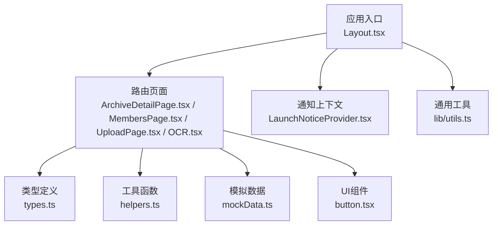
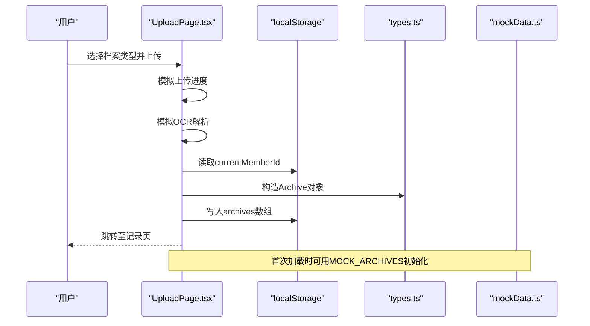
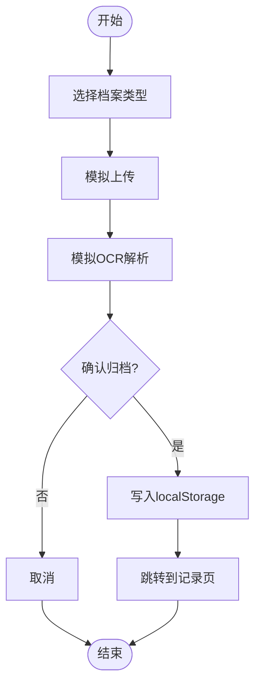
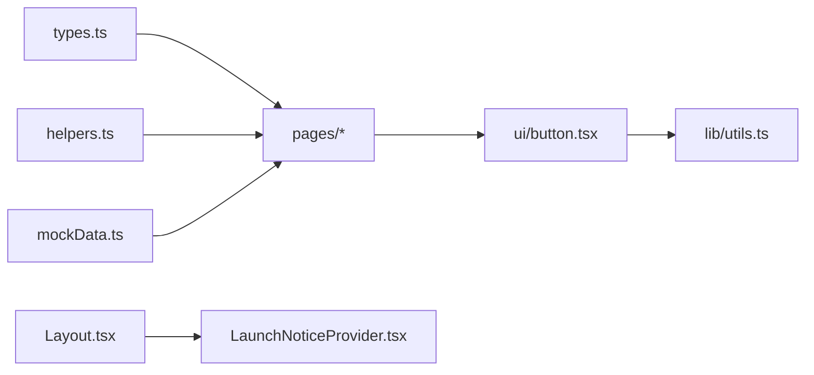

# API参考

<cite>
**本文引用的文件**
- [types.ts](file://figma-ui/src/app/types.ts)
- [helpers.ts](file://figma-ui/src/app/utils/helpers.ts)
- [mockData.ts](file://figma-ui/src/app/utils/mockData.ts)
- [useHomeSectionNav.ts](file://figma-ui/src/app/hooks/useHomeSectionNav.ts)
- [utils.ts](file://figma-ui/src/lib/utils.ts)
- [Layout.tsx](file://figma-ui/src/app/components/Layout.tsx)
- [LaunchNoticeProvider.tsx](file://figma-ui/src/app/components/LaunchNoticeProvider.tsx)
- [button.tsx](file://figma-ui/src/app/components/ui/button.tsx)
- [ArchiveDetailPage.tsx](file://figma-ui/src/app/pages/ArchiveDetailPage.tsx)
- [MembersPage.tsx](file://figma-ui/src/app/pages/MembersPage.tsx)
- [OCR.tsx](file://figma-ui/src/app/pages/OCR.tsx)
- [UploadPage.tsx](file://figma-ui/src/app/pages/UploadPage.tsx)
</cite>

## 目录
1. [简介](#简介)
2. [项目结构](#项目结构)
3. [核心组件与数据模型](#核心组件与数据模型)
4. [架构总览](#架构总览)
5. [详细API说明](#详细api说明)
6. [依赖关系分析](#依赖关系分析)
7. [性能与可用性建议](#性能与可用性建议)
8. [故障排查指南](#故障排查指南)
9. [结论](#结论)
10. [附录：版本兼容与迁移](#附录版本兼容与迁移)

## 简介
本API参考面向医案通医疗档案网站的前端实现，覆盖以下范围：
- TypeScript类型定义（Member、Archive、OCRData等）
- 工具函数API（日期格式化、过期判断、ID生成、脱敏等）
- 自定义Hooks接口（首页导航滚动、通知弹窗上下文）
- 组件事件与Props接口（按钮、布局、页面级交互）
- 数据流与状态管理（基于localStorage的本地存储）
- 错误处理与异常场景（缺失数据、空态、权限限制等）
- 版本兼容与迁移建议（向后兼容字段、扩展点）

## 项目结构
前端采用React + TypeScript，按功能域组织：
- 类型与常量：src/app/types.ts
- 工具函数：src/app/utils/helpers.ts
- 模拟数据与初始化：src/app/utils/mockData.ts
- 自定义Hooks：src/app/hooks/useHomeSectionNav.ts
- UI基础组件：src/app/components/ui/*（如Button）
- 业务组件与页面：src/app/components/Layout.tsx、src/app/pages/*
- 全局样式与工具：src/lib/utils.ts（clsx合并）

图表来源
- [Layout.tsx:10-144](file://figma-ui/src/app/components/Layout.tsx#L10-L144)
- [ArchiveDetailPage.tsx:27-40](file://figma-ui/src/app/pages/ArchiveDetailPage.tsx#L27-L40)
- [MembersPage.tsx:6-18](file://figma-ui/src/app/pages/MembersPage.tsx#L6-L18)
- [UploadPage.tsx:7-52](file://figma-ui/src/app/pages/UploadPage.tsx#L7-L52)
- [OCR.tsx:24-75](file://figma-ui/src/app/pages/OCR.tsx#L24-L75)
- [types.ts:1-95](file://figma-ui/src/app/types.ts#L1-L95)
- [helpers.ts:1-52](file://figma-ui/src/app/utils/helpers.ts#L1-L52)
- [mockData.ts:1-98](file://figma-ui/src/app/utils/mockData.ts#L1-L98)
- [button.tsx:7-58](file://figma-ui/src/app/components/ui/button.tsx#L7-L58)
- [utils.ts:1-7](file://figma-ui/src/lib/utils.ts#L1-L7)

章节来源
- [Layout.tsx:10-144](file://figma-ui/src/app/components/Layout.tsx#L10-L144)
- [types.ts:1-95](file://figma-ui/src/app/types.ts#L1-L95)

## 核心组件与数据模型
本节聚焦于数据模型与关键组件的对外API。

### 数据模型（TypeScript接口）
- Member：成员信息
  - 字段：id, name, relation, gender?, birthday?, bloodType?, allergies?
  - 用途：家庭成员管理、切换当前成员、关联其档案
- Archive：档案条目
  - 字段：id, memberId, type, title, hospital, department?, date, uploadDate, imageUrl?, ocrData?, tags[], isFavorite, isDeleted
  - 类型枚举：ArchiveType（门诊病历、检验报告、影像报告、处方、体检报告、出院记录、发票、其他）
  - 用途：档案列表、详情展示、上传归档
- OCRData：OCR/AI提取结果
  - 字段：hospital?, department?, date?, doctorName?, diagnosis?, items?, prescription?, [key: string]: any
  - 子项：LabItem（name, value, unit?, referenceRange?, isAbnormal?）、PrescriptionItem（name, dosage?, frequency?, duration?）
  - 用途：不同档案类型的结构化展示与AI提示
- ShareLink：分享链接
  - 字段：id, archiveIds[], url, password?, expiresAt, createdAt, isRevoked, viewCount
  - 用途：未来分享能力的数据契约（当前未使用）

章节来源
- [types.ts:1-95](file://figma-ui/src/app/types.ts#L1-L95)

### 工具函数API
- formatDate(date): string
  - 参数：string | Date
  - 返回：中文长日期字符串
  - 注意：内部使用Intl.DateTimeFormat
- formatDateShort(date): string
  - 参数：string | Date
  - 返回：中文短日期字符串
- isExpired(expiryDate): boolean
  - 参数：string | Date
  - 返回：是否已过期
- generateId(): string
  - 返回：基于时间+随机数的唯一ID
- maskPhone(phone): string
  - 参数：手机号字符串
  - 返回：中间四位掩码后的手机号
- daysUntilExpiry(expiryDate): number
  - 参数：string | Date
  - 返回：距离过期的天数（向上取整）

章节来源
- [helpers.ts:1-52](file://figma-ui/src/app/utils/helpers.ts#L1-L52)

### 自定义Hooks接口
- useHomeSectionNav()
  - 返回值：{ goToHomeSection(sectionId: string): void }
  - 行为：在首页路径下直接平滑滚动到指定section；否则先导航到首页并通过location.state传递目标sectionId
  - 适用：Hash路由或History模式下避免hash抢占问题

章节来源
- [useHomeSectionNav.ts:1-26](file://figma-ui/src/app/hooks/useHomeSectionNav.ts#L1-L26)

### 通知上下文Hook
- useLaunchNotice()
  - 返回值：{ showLaunchNotice(): void; showPartnerNotice(): void }
  - 行为：打开“立即体验”或“合作咨询”的二维码弹窗
  - 约束：必须在LaunchNoticeProvider内使用，否则会抛出错误

章节来源
- [LaunchNoticeProvider.tsx:12-118](file://figma-ui/src/app/components/LaunchNoticeProvider.tsx#L12-L118)

### UI组件API
- Button
  - Props：className, variant(default|destructive|outline|secondary|ghost|link), size(default|sm|lg|icon), asChild?, ...props
  - 行为：统一样式与可访问性，支持作为子元素渲染
  - 依赖：class-variance-authority、tailwind-merge、clsx

章节来源
- [button.tsx:7-58](file://figma-ui/src/app/components/ui/button.tsx#L7-L58)

## 架构总览
前端以页面组件为主，通过localStorage进行本地数据持久化，结合模拟数据提供初始体验。OCR与上传流程为模拟实现，便于演示。

图表来源
- [UploadPage.tsx:7-52](file://figma-ui/src/app/pages/UploadPage.tsx#L7-L52)
- [mockData.ts:1-98](file://figma-ui/src/app/utils/mockData.ts#L1-L98)
- [types.ts:11-46](file://figma-ui/src/app/types.ts#L11-L46)

## 详细API说明

### 数据模型API
- Member
  - 必填：id, name, relation
  - 可选：gender, birthday, bloodType, allergies
  - 业务规则：
    - id用于唯一标识成员
    - relation用于显示关系标签
    - 删除成员时会级联删除其所有非删除状态的档案
- Archive
  - 必填：id, memberId, type, title, hospital, date, uploadDate, tags[], isFavorite, isDeleted
  - 可选：department, imageUrl, ocrData
  - 业务规则：
    - type决定详情页渲染逻辑（检验报告/处方/门诊病历/影像报告/体检报告等）
    - isDeleted用于软删除，不参与统计
    - ocrData根据type包含不同结构（items/prescription/diagnosis等）
- OCRData
  - 检验报告：items[]（LabItem）
  - 处方：prescription[]（PrescriptionItem）
  - 门诊/影像/体检：diagnosis等文本字段
  - 业务规则：
    - LabItem.isAbnormal用于高亮异常指标
    - PrescriptionItem.dosage/frequency/duration用于用药提醒展示

章节来源
- [types.ts:1-95](file://figma-ui/src/app/types.ts#L1-L95)
- [ArchiveDetailPage.tsx:54-249](file://figma-ui/src/app/pages/ArchiveDetailPage.tsx#L54-L249)

### 工具函数API
- 日期格式化
  - 输入：ISO字符串或Date对象
  - 输出：符合zh-CN格式的日期字符串
  - 注意：跨时区场景建议使用UTC或服务器时间
- 过期判断
  - 输入：到期时间
  - 输出：布尔值
  - 注意：比较的是本地时间
- ID生成
  - 输出：短ID，适合前端临时标识
  - 注意：如需强唯一性建议后端生成
- 脱敏
  - 输入：手机号
  - 输出：中间四位掩码
  - 注意：仅用于展示层

章节来源
- [helpers.ts:1-52](file://figma-ui/src/app/utils/helpers.ts#L1-L52)

### 自定义Hooks接口
- useHomeSectionNav
  - 方法：goToHomeSection(sectionId)
  - 行为：
    - 若当前路径为首页根路径，则直接滚动到对应锚点
    - 否则导航到首页并通过state传递目标sectionId，由页面监听后滚动
  - 注意：适用于单页应用中的锚点导航

章节来源
- [useHomeSectionNav.ts:1-26](file://figma-ui/src/app/hooks/useHomeSectionNav.ts#L1-L26)

### 通知上下文Hook
- useLaunchNotice
  - 方法：showLaunchNotice(), showPartnerNotice()
  - 行为：打开对应二维码弹窗
  - 异常：未在Provider中使用会抛错

章节来源
- [LaunchNoticeProvider.tsx:12-118](file://figma-ui/src/app/components/LaunchNoticeProvider.tsx#L12-L118)

### 页面级API与事件

#### 成员管理（MembersPage）
- 事件与回调
  - handleAddMember(member: Member): void
    - 作用：新增成员并持久化到localStorage
  - handleDeleteMember(id: string): void
    - 作用：删除成员及其所有档案（软删除标记除外）
  - handleSwitchMember(id: string): void
    - 作用：设置当前成员并返回首页
- 状态
  - members: Member[]
  - showAddForm: boolean
- 注意事项
  - 不能删除本人（id="1"）
  - 删除成员会同时清理其档案

章节来源
- [MembersPage.tsx:6-153](file://figma-ui/src/app/pages/MembersPage.tsx#L6-L153)
- [MembersPage.tsx:155-294](file://figma-ui/src/app/pages/MembersPage.tsx#L155-L294)

#### 档案详情（ArchiveDetailPage）
- 数据获取
  - 优先从localStorage读取archives，找不到则回退到MOCK_ARCHIVES
- 渲染逻辑
  - 根据archive.type渲染不同视图：检验报告、处方、门诊病历、影像/体检报告
- 事件
  - 返回上一页、分享、更多操作（占位）
- 注意事项
  - 无数据时显示空态与返回按钮

章节来源
- [ArchiveDetailPage.tsx:27-52](file://figma-ui/src/app/pages/ArchiveDetailPage.tsx#L27-L52)
- [ArchiveDetailPage.tsx:54-249](file://figma-ui/src/app/pages/ArchiveDetailPage.tsx#L54-L249)

#### 上传与OCR（UploadPage & OCR）
- UploadPage
  - 步骤：选择类型 -> 模拟上传 -> 模拟OCR -> 确认归档
  - 事件：handleFileSelect(type), handleConfirm()
  - 数据：构造Archive并写入localStorage
- OCR
  - 事件：handleFileChange(e), startScan(), reset()
  - 行为：模拟扫描进度与识别结果，toast提示成功
  - 注意：当前为演示用模拟数据

章节来源
- [UploadPage.tsx:7-52](file://figma-ui/src/app/pages/UploadPage.tsx#L7-L52)
- [OCR.tsx:24-75](file://figma-ui/src/app/pages/OCR.tsx#L24-L75)

### 数据流图（上传归档）

图表来源
- [UploadPage.tsx:12-52](file://figma-ui/src/app/pages/UploadPage.tsx#L12-L52)

## 依赖关系分析
- 页面组件依赖类型定义与工具函数
- 布局组件依赖路由与通知上下文
- UI组件依赖样式合并工具
- 模拟数据用于首次加载与空态填充

图表来源
- [types.ts:1-95](file://figma-ui/src/app/types.ts#L1-L95)
- [helpers.ts:1-52](file://figma-ui/src/app/utils/helpers.ts#L1-L52)
- [mockData.ts:1-98](file://figma-ui/src/app/utils/mockData.ts#L1-L98)
- [Layout.tsx:10-144](file://figma-ui/src/app/components/Layout.tsx#L10-L144)
- [LaunchNoticeProvider.tsx:12-118](file://figma-ui/src/app/components/LaunchNoticeProvider.tsx#L12-L118)
- [button.tsx:7-58](file://figma-ui/src/app/components/ui/button.tsx#L7-L58)
- [utils.ts:1-7](file://figma-ui/src/lib/utils.ts#L1-L7)

章节来源
- [Layout.tsx:10-144](file://figma-ui/src/app/components/Layout.tsx#L10-L144)
- [LaunchNoticeProvider.tsx:12-118](file://figma-ui/src/app/components/LaunchNoticeProvider.tsx#L12-L118)

## 性能与可用性建议
- 本地存储读写
  - 批量更新时减少多次localStorage调用，可在内存中维护状态再一次性写入
- 图片与预览
  - 大图片预览时使用URL.createObjectURL并及时释放，避免内存泄漏
- 动画与重绘
  - 合理使用motion/react，避免过度动画导致卡顿
- 无障碍
  - 按钮与表单控件保持语义化，确保键盘可达性与屏幕阅读器友好

[本节为通用建议，不直接分析具体文件]

## 故障排查指南
- 未找到档案
  - 现象：详情页显示“未找到相关档案”
  - 原因：localStorage中不存在对应id且mockData中也没有匹配项
  - 处理：检查上传流程是否正确写入archives
- 无法删除本人
  - 现象：删除本人成员被阻止
  - 原因：业务规则保护
  - 处理：仅允许删除非本人成员
- 通知弹窗报错
  - 现象：useLaunchNotice抛出错误
  - 原因：未在LaunchNoticeProvider包裹
  - 处理：在应用根节点或父组件中提供该Provider
- OCR识别失败
  - 现象：当前为模拟流程，实际需接入后端服务
  - 处理：替换startScan逻辑为真实OCR调用，增加错误分支与重试机制

章节来源
- [ArchiveDetailPage.tsx:27-52](file://figma-ui/src/app/pages/ArchiveDetailPage.tsx#L27-L52)
- [MembersPage.tsx:27-43](file://figma-ui/src/app/pages/MembersPage.tsx#L27-L43)
- [LaunchNoticeProvider.tsx:111-118](file://figma-ui/src/app/components/LaunchNoticeProvider.tsx#L111-L118)
- [OCR.tsx:42-75](file://figma-ui/src/app/pages/OCR.tsx#L42-L75)

## 结论
本API参考覆盖了医案通医疗档案网站的核心类型、工具函数、自定义Hooks与页面级交互。当前实现以本地存储与模拟数据为主，便于快速原型验证。后续建议：
- 引入后端API替代localStorage
- 完善OCR与上传的真实链路
- 增强错误边界与日志上报
- 补充单元测试与集成测试

[本节为总结性内容，不直接分析具体文件]

## 附录：版本兼容与迁移
- 向后兼容策略
  - 对可选字段（如department、imageUrl、ocrData）保持兼容，旧数据仍可渲染
  - 对枚举类型ArchiveType新增值时，提供默认映射与降级展示
- 迁移指南
  - 从localStorage迁移到服务端：
    - 导出本地数据格式（Archive[]、Member[]）
    - 设计REST/GraphQL接口，保持字段一致
    - 客户端逐步替换读写逻辑，保留降级到本地存储的能力
  - OCR服务接入：
    - 将OCR.tsx中的模拟逻辑替换为异步请求
    - 增加错误处理与重试，提升用户体验
  - 分享功能：
    - 基于ShareLink类型实现分享链接创建、查看与撤销

[本节为概念性指导，不直接分析具体文件]