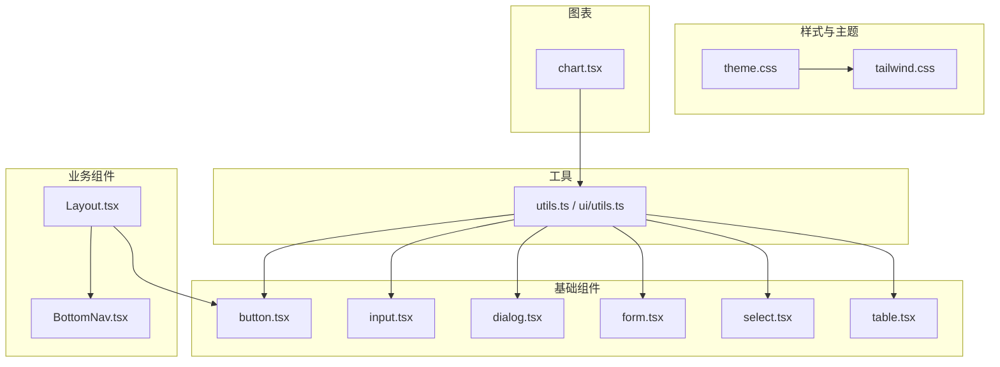
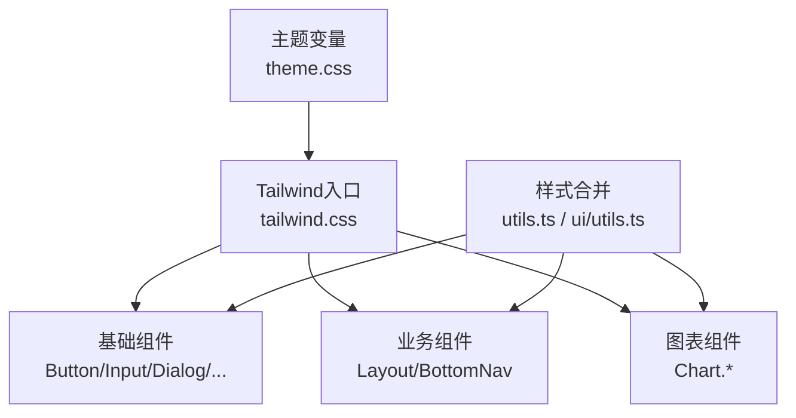
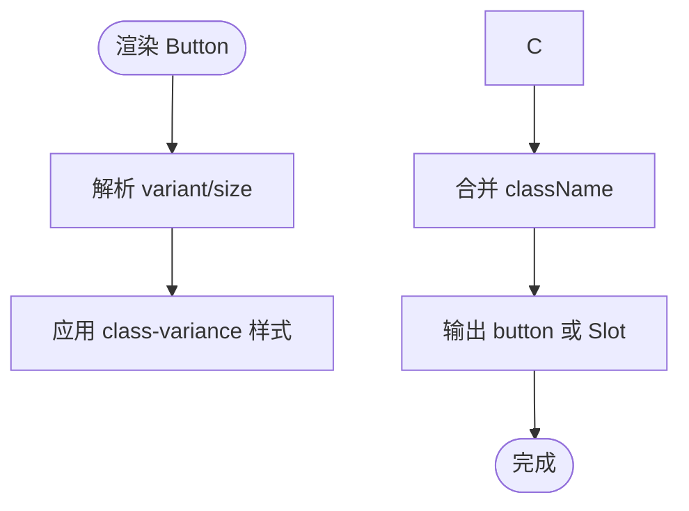
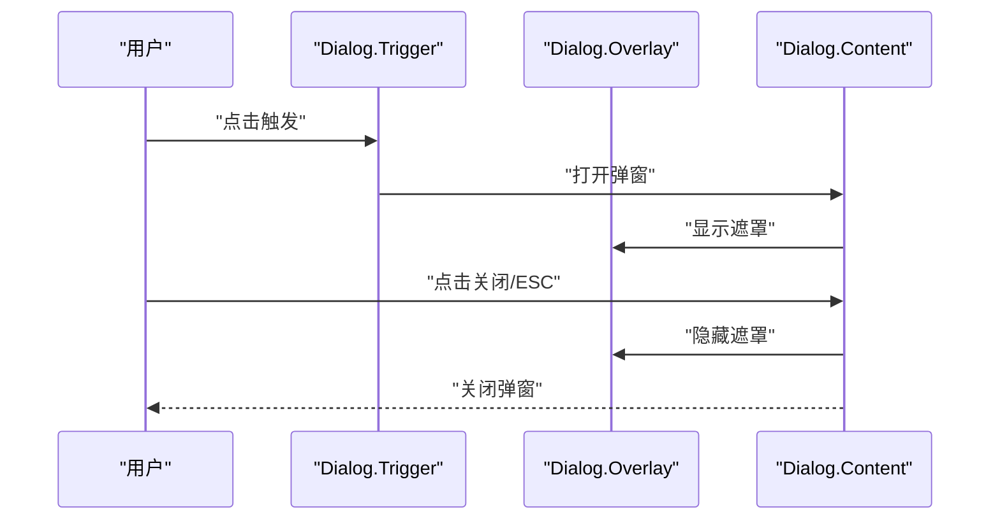
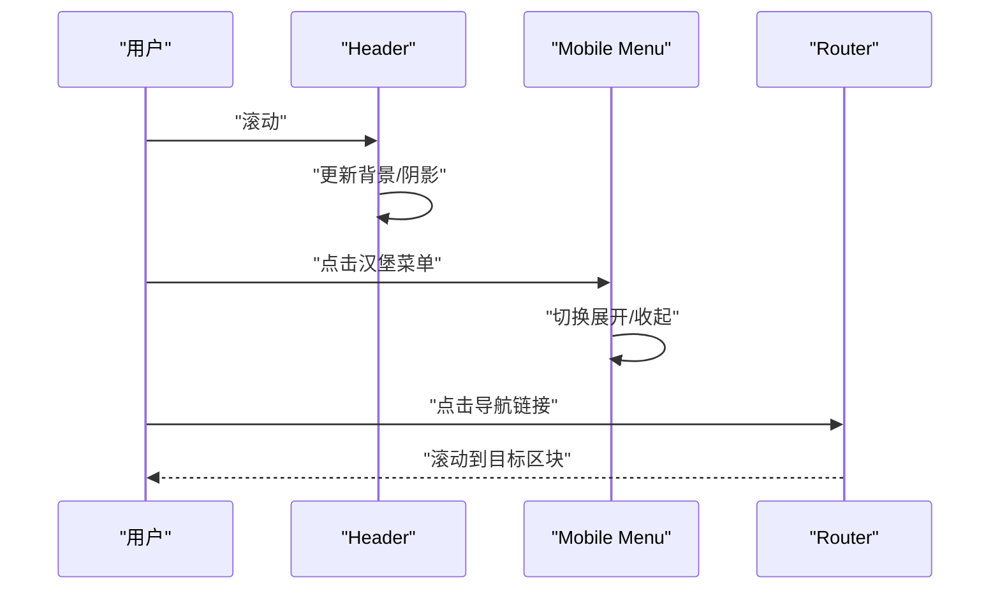
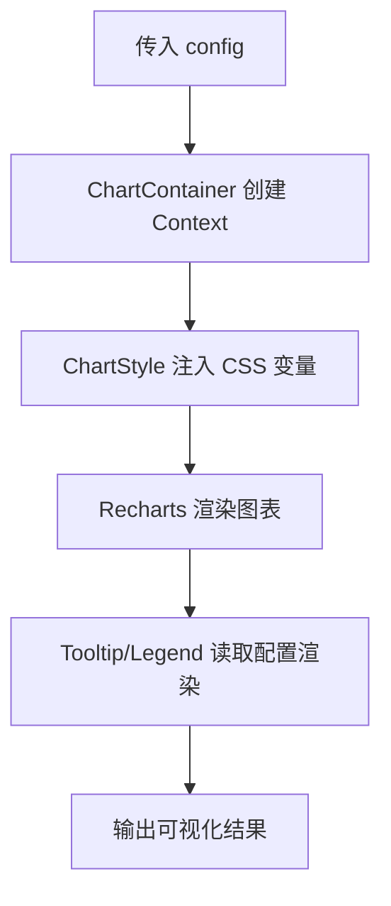
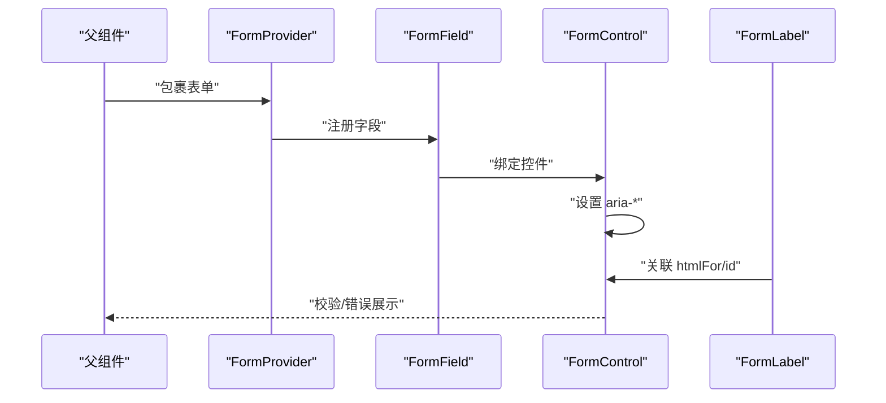
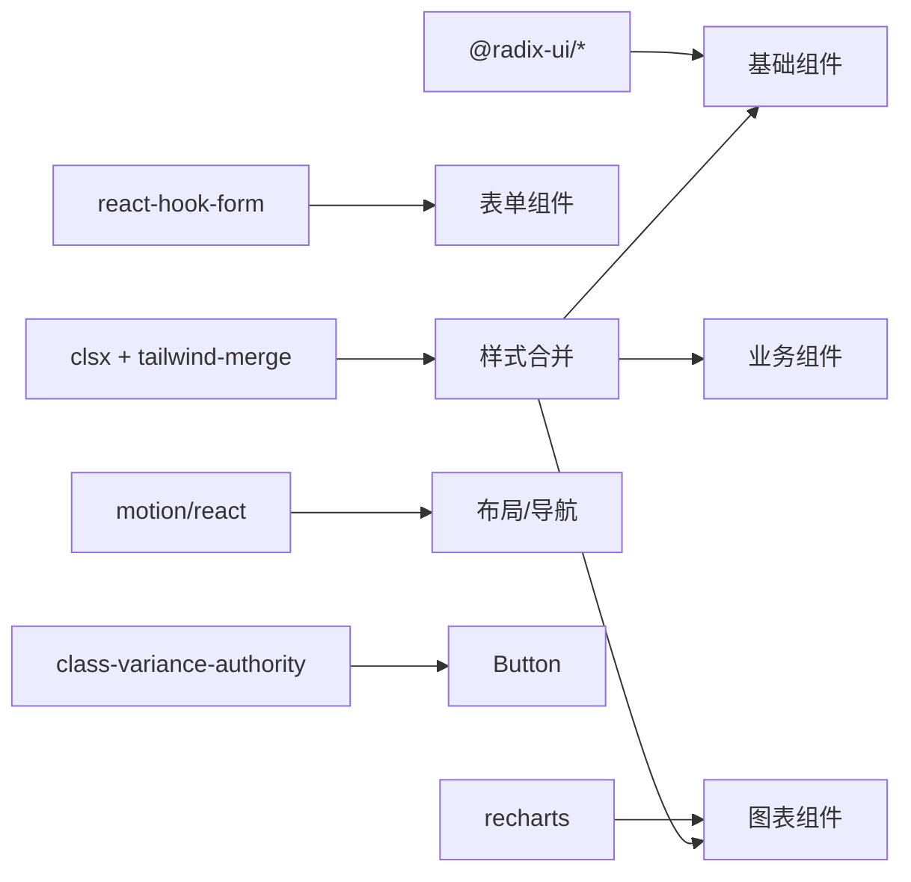

# UI组件系统

<cite>
**本文引用的文件**
- [package.json](file://figma-ui/package.json)
- [theme.css](file://figma-ui/src/styles/theme.css)
- [tailwind.css](file://figma-ui/src/styles/tailwind.css)
- [utils.ts](file://figma-ui/src/lib/utils.ts)
- [ui/utils.ts](file://figma-ui/src/app/components/ui/utils.ts)
- [button.tsx](file://figma-ui/src/app/components/ui/button.tsx)
- [input.tsx](file://figma-ui/src/app/components/ui/input.tsx)
- [dialog.tsx](file://figma-ui/src/app/components/ui/dialog.tsx)
- [card.tsx](file://figma-ui/src/app/components/ui/card.tsx)
- [chart.tsx](file://figma-ui/src/app/components/ui/chart.tsx)
- [form.tsx](file://figma-ui/src/app/components/ui/form.tsx)
- [select.tsx](file://figma-ui/src/app/components/ui/select.tsx)
- [table.tsx](file://figma-ui/src/app/components/ui/table.tsx)
- [Layout.tsx](file://figma-ui/src/app/components/Layout.tsx)
- [BottomNav.tsx](file://figma-ui/src/app/components/BottomNav.tsx)
</cite>

## 目录
1. [简介](#简介)
2. [项目结构](#项目结构)
3. [核心组件](#核心组件)
4. [架构总览](#架构总览)
5. [详细组件分析](#详细组件分析)
6. [依赖关系分析](#依赖关系分析)
7. [性能考量](#性能考量)
8. [故障排查指南](#故障排查指南)
9. [结论](#结论)
10. [附录：API参考与扩展指南](#附录api参考与扩展指南)

## 简介
本文件为医案通医疗档案网站的UI组件系统文档，聚焦于基于Radix UI与Tailwind CSS构建的组件库。内容涵盖基础组件（Button、Input、Dialog等）与业务组件（Layout、Card、Chart等）的设计原则、Props接口、事件处理、样式定制与主题支持；并提供使用示例、最佳实践（响应式、无障碍、性能优化）、组合模式与复用策略，以及API参考与自定义扩展指南。

## 项目结构
- 样式与主题
  - 主题变量与暗色模式在主题文件中集中定义，并通过Tailwind的@theme映射到设计令牌。
  - Tailwind入口通过source扫描源码以生成工具类，并引入动画库。
- 工具函数
  - 提供统一的className合并工具，确保样式覆盖与冲突解决一致化。
- 基础UI组件
  - 按钮、输入、对话框、表单、选择器、表格等，均基于Radix原语封装，结合Tailwind实现可访问性与一致性样式。
- 业务组件
  - 布局容器与底部导航，负责页面骨架与导航交互。
- 图表组件
  - 基于Recharts封装，提供主题化配置、Tooltip与图例能力。

**图示来源**
- [theme.css:1-218](file://figma-ui/src/styles/theme.css#L1-L218)
- [tailwind.css:1-5](file://figma-ui/src/styles/tailwind.css#L1-L5)
- [utils.ts:1-7](file://figma-ui/src/lib/utils.ts#L1-L7)
- [ui/utils.ts:1-7](file://figma-ui/src/app/components/ui/utils.ts#L1-L7)
- [button.tsx:1-59](file://figma-ui/src/app/components/ui/button.tsx#L1-L59)
- [input.tsx:1-22](file://figma-ui/src/app/components/ui/input.tsx#L1-L22)
- [dialog.tsx:1-136](file://figma-ui/src/app/components/ui/dialog.tsx#L1-L136)
- [form.tsx:1-169](file://figma-ui/src/app/components/ui/form.tsx#L1-L169)
- [select.tsx:1-190](file://figma-ui/src/app/components/ui/select.tsx#L1-L190)
- [table.tsx:1-117](file://figma-ui/src/app/components/ui/table.tsx#L1-L117)
- [Layout.tsx:1-251](file://figma-ui/src/app/components/Layout.tsx#L1-L251)
- [BottomNav.tsx:1-85](file://figma-ui/src/app/components/BottomNav.tsx#L1-L85)
- [chart.tsx:1-354](file://figma-ui/src/app/components/ui/chart.tsx#L1-L354)

**章节来源**
- [package.json:1-101](file://figma-ui/package.json#L1-L101)
- [theme.css:1-218](file://figma-ui/src/styles/theme.css#L1-L218)
- [tailwind.css:1-5](file://figma-ui/src/styles/tailwind.css#L1-L5)
- [utils.ts:1-7](file://figma-ui/src/lib/utils.ts#L1-L7)
- [ui/utils.ts:1-7](file://figma-ui/src/app/components/ui/utils.ts#L1-L7)

## 核心组件
- Button
  - 设计要点：基于class-variance-authority管理变体与尺寸；支持asChild透传；统一焦点环与禁用态；与主题色绑定。
  - Props：variant、size、asChild及原生button属性；className可叠加覆盖。
  - 事件：透传所有原生事件（onClick等）。
  - 样式定制：通过variants与Tailwind类名组合；可通过className注入额外样式。
  - 主题：使用主题色令牌（primary、secondary、destructive等），自动适配暗色模式。
  - 参考路径：[button.tsx:7-59](file://figma-ui/src/app/components/ui/button.tsx#L7-L59)
- Input
  - 设计要点：统一边框、占位符、选中高亮、禁用态与焦点环；移动端字号适配。
  - Props：type与原生input属性；className可叠加。
  - 事件：透传所有原生事件（onChange、onFocus等）。
  - 样式定制：通过Tailwind类名与data-slot标记定位。
  - 主题：使用输入背景与边框令牌，暗色模式自动切换。
  - 参考路径：[input.tsx:5-22](file://figma-ui/src/app/components/ui/input.tsx#L5-L22)
- Dialog
  - 设计要点：基于Radix Dialog原语，提供Overlay、Content、Header/Footer、Title/Description等子组件；包含关闭按钮与无障碍标签。
  - Props：各子组件透传对应Radix原语属性；className可叠加。
  - 事件：透传Radix事件（如onOpenChange等）。
  - 样式定制：通过Tailwind类名与状态钩子（open/closed）控制动画与布局。
  - 主题：背景、文字、边框与阴影遵循主题令牌。
  - 参考路径：[dialog.tsx:9-136](file://figma-ui/src/app/components/ui/dialog.tsx#L9-L136)
- Card
  - 设计要点：卡片容器与Header/Title/Description/Action/Content/Footer分块布局；网格与间距统一。
  - Props：各子组件透传div属性；className可叠加。
  - 事件：透传原生事件。
  - 样式定制：通过Tailwind类名与data-slot定位。
  - 主题：卡片背景与前景色来自主题令牌。
  - 参考路径：[card.tsx:5-93](file://figma-ui/src/app/components/ui/card.tsx#L5-L93)
- Chart
  - 设计要点：基于Recharts封装，提供Container、Tooltip、Legend及其内容组件；通过Context传递配置，动态注入主题色CSS变量。
  - Props：Container接受config（字段级label/icon/color或theme映射）；Tooltip/Legend支持自定义指示器、格式化与名称键。
  - 事件：透传Recharts事件（如onMouseEnter等）。
  - 样式定制：通过Tailwind类名与CSS变量(--color-*)控制颜色；支持暗色前缀选择器。
  - 主题：light/dark双主题映射，按数据项渲染对应颜色。
  - 参考路径：[chart.tsx:11-354](file://figma-ui/src/app/components/ui/chart.tsx#L11-L354)
- Form（与Label/FormControl等）
  - 设计要点：基于react-hook-form与Radix Label封装；提供FormItem/FormField/FormLabel/FormControl/FormDescription/FormMessage；自动关联id与aria属性。
  - Props：FormField透传ControllerProps；其他子组件透传对应原语属性；className可叠加。
  - 事件：透表单验证与提交事件（由hook form管理）。
  - 样式定制：错误态文本颜色、描述与消息样式；data-error状态驱动样式。
  - 主题：使用前景、边框与破坏色令牌。
  - 参考路径：[form.tsx:19-169](file://figma-ui/src/app/components/ui/form.tsx#L19-L169)
- Select
  - 设计要点：基于Radix Select封装Trigger/Content/Item/Group/Label/Separator/ScrollButtons；支持popper定位与滚动区域。
  - Props：各子组件透传Radix属性；Trigger支持size；className可叠加。
  - 事件：透传Radix事件（如onValueChange等）。
  - 样式定制：下拉面板动画、滚动条与选中指示器；data-size控制高度。
  - 主题：背景、前景、边框与焦点环遵循主题令牌。
  - 参考路径：[select.tsx:13-190](file://figma-ui/src/app/components/ui/select.tsx#L13-L190)
- Table
  - 设计要点：表格容器与Header/Body/Footer/Row/Head/Cell/Caption；悬停与选中态；横向滚动容器。
  - Props：各子组件透表原生属性；className可叠加。
  - 事件：透原生事件。
  - 样式定制：行高、对齐、边框与选中背景；data-slot定位。
  - 主题：使用前景、边框与muted令牌。
  - 参考路径：[table.tsx:7-117](file://figma-ui/src/app/components/ui/table.tsx#L7-L117)

**章节来源**
- [button.tsx:7-59](file://figma-ui/src/app/components/ui/button.tsx#L7-L59)
- [input.tsx:5-22](file://figma-ui/src/app/components/ui/input.tsx#L5-L22)
- [dialog.tsx:9-136](file://figma-ui/src/app/components/ui/dialog.tsx#L9-L136)
- [card.tsx:5-93](file://figma-ui/src/app/components/ui/card.tsx#L5-L93)
- [chart.tsx:11-354](file://figma-ui/src/app/components/ui/chart.tsx#L11-L354)
- [form.tsx:19-169](file://figma-ui/src/app/components/ui/form.tsx#L19-L169)
- [select.tsx:13-190](file://figma-ui/src/app/components/ui/select.tsx#L13-L190)
- [table.tsx:7-117](file://figma-ui/src/app/components/ui/table.tsx#L7-L117)

## 架构总览
- 主题层
  - 通过CSS变量定义明/暗主题色板与圆角、字体权重等设计令牌，并在@theme中映射到Tailwind颜色与半径。
- 工具层
  - className合并工具统一处理多源样式，避免冲突并保证优先级。
- 组件层
  - 基础组件：对Radix原语进行轻量封装，添加一致的样式、无障碍与主题适配。
  - 业务组件：组合基础组件与路由/状态，形成页面骨架与导航。
  - 图表组件：在Recharts之上提供配置驱动的可视化能力。
- 集成点
  - 布局组件使用路由与全局上下文（如通知、导航）；图表组件通过Context共享配置；表单组件与hook form集成。

**图示来源**
- [theme.css:1-218](file://figma-ui/src/styles/theme.css#L1-L218)
- [tailwind.css:1-5](file://figma-ui/src/styles/tailwind.css#L1-L5)
- [utils.ts:1-7](file://figma-ui/src/lib/utils.ts#L1-L7)
- [ui/utils.ts:1-7](file://figma-ui/src/app/components/ui/utils.ts#L1-L7)
- [button.tsx:1-59](file://figma-ui/src/app/components/ui/button.tsx#L1-L59)
- [dialog.tsx:1-136](file://figma-ui/src/app/components/ui/dialog.tsx#L1-L136)
- [chart.tsx:1-354](file://figma-ui/src/app/components/ui/chart.tsx#L1-L354)
- [Layout.tsx:1-251](file://figma-ui/src/app/components/Layout.tsx#L1-L251)
- [BottomNav.tsx:1-85](file://figma-ui/src/app/components/BottomNav.tsx#L1-L85)

## 详细组件分析

### 基础组件：Button
- 设计原则
  - 变体与尺寸分离，便于组合；asChild支持无缝替换为Link等元素；统一焦点环与禁用态。
- Props接口
  - variant：default/outline/secondary/ghost/link/destructive
  - size：default/sm/lg/icon
  - asChild：boolean
  - 其余透传button原生属性
- 事件处理
  - 透传onClick等原生事件
- 样式定制
  - 通过cva变体与Tailwind类名组合；className追加覆盖
- 主题支持
  - 使用主题色令牌，自动适配暗色模式
- 参考路径
  - [button.tsx:7-59](file://figma-ui/src/app/components/ui/button.tsx#L7-L59)

**图示来源**
- [button.tsx:7-59](file://figma-ui/src/app/components/ui/button.tsx#L7-L59)

**章节来源**
- [button.tsx:7-59](file://figma-ui/src/app/components/ui/button.tsx#L7-L59)

### 基础组件：Input
- 设计原则
  - 统一输入框外观、焦点环与错误态；移动端字号优化
- Props接口
  - type与原生input属性；className
- 事件处理
  - 透传onChange/onFocus等
- 样式定制
  - 通过Tailwind类名与data-slot定位
- 主题支持
  - 使用输入背景与边框令牌
- 参考路径
  - [input.tsx:5-22](file://figma-ui/src/app/components/ui/input.tsx#L5-L22)

**章节来源**
- [input.tsx:5-22](file://figma-ui/src/app/components/ui/input.tsx#L5-L22)

### 基础组件：Dialog
- 设计原则
  - 基于Radix Dialog，提供完整语义结构与无障碍支持；默认关闭按钮含屏幕阅读器文本
- Props接口
  - 各子组件透传Radix原语属性；className
- 事件处理
  - 透传onOpenChange等Radix事件
- 样式定制
  - 通过Tailwind与状态钩子控制动画与布局
- 主题支持
  - 背景、前景、边框与阴影遵循主题令牌
- 参考路径
  - [dialog.tsx:9-136](file://figma-ui/src/app/components/ui/dialog.tsx#L9-L136)

**图示来源**
- [dialog.tsx:9-136](file://figma-ui/src/app/components/ui/dialog.tsx#L9-L136)

**章节来源**
- [dialog.tsx:9-136](file://figma-ui/src/app/components/ui/dialog.tsx#L9-L136)

### 业务组件：Layout
- 设计原则
  - 固定头部与页脚，响应式导航；滚动时头部背景模糊；移动端菜单展开收起
- 关键逻辑
  - 监听滚动改变头部样式；移动端菜单状态管理；导航跳转至首页锚点
- 组合模式
  - 组合Button、路由与动画库；通过Outlet嵌入页面内容
- 参考路径
  - [Layout.tsx:10-251](file://figma-ui/src/app/components/Layout.tsx#L10-L251)

**图示来源**
- [Layout.tsx:10-251](file://figma-ui/src/app/components/Layout.tsx#L10-L251)

**章节来源**
- [Layout.tsx:10-251](file://figma-ui/src/app/components/Layout.tsx#L10-L251)

### 业务组件：BottomNav
- 设计原则
  - 底部固定导航，特殊操作突出显示；当前页高亮与微动效
- 关键逻辑
  - 根据路由判断激活态；特殊项采用浮动按钮样式
- 参考路径
  - [BottomNav.tsx:5-85](file://figma-ui/src/app/components/BottomNav.tsx#L5-L85)

**章节来源**
- [BottomNav.tsx:5-85](file://figma-ui/src/app/components/BottomNav.tsx#L5-L85)

### 图表组件：Chart
- 设计原则
  - 配置驱动的可视化；主题色通过CSS变量注入；Tooltip与Legend可定制
- 数据结构
  - ChartConfig：每项可配置label、icon、color或theme映射
- 处理流程
  - Container注入Context与Style；Tooltip/Legend读取配置渲染
- 参考路径
  - [chart.tsx:11-354](file://figma-ui/src/app/components/ui/chart.tsx#L11-L354)

**图示来源**
- [chart.tsx:11-354](file://figma-ui/src/app/components/ui/chart.tsx#L11-L354)

**章节来源**
- [chart.tsx:11-354](file://figma-ui/src/app/components/ui/chart.tsx#L11-L354)

### 表单组件：Form
- 设计原则
  - 基于react-hook-form与Radix Label；自动关联id与aria；错误态与描述信息
- 关键逻辑
  - useFormField获取字段状态；FormControl设置aria-describedby与aria-invalid
- 参考路径
  - [form.tsx:19-169](file://figma-ui/src/app/components/ui/form.tsx#L19-L169)

**图示来源**
- [form.tsx:19-169](file://figma-ui/src/app/components/ui/form.tsx#L19-L169)

**章节来源**
- [form.tsx:19-169](file://figma-ui/src/app/components/ui/form.tsx#L19-L169)

### 选择器组件：Select
- 设计原则
  - 基于Radix Select；popper定位；滚动与分组；大小变体
- 关键逻辑
  - Trigger/Content/Item/Group/Label/Separator/ScrollButtons组合；data-size控制高度
- 参考路径
  - [select.tsx:13-190](file://figma-ui/src/app/components/ui/select.tsx#L13-L190)

**章节来源**
- [select.tsx:13-190](file://figma-ui/src/app/components/ui/select.tsx#L13-L190)

### 表格组件：Table
- 设计原则
  - 表格容器支持横向滚动；行悬停与选中态；标题与说明
- 关键逻辑
  - 各子组件透传原生属性；data-slot定位
- 参考路径
  - [table.tsx:7-117](file://figma-ui/src/app/components/ui/table.tsx#L7-L117)

**章节来源**
- [table.tsx:7-117](file://figma-ui/src/app/components/ui/table.tsx#L7-L117)

## 依赖关系分析
- 运行时依赖
  - Radix UI系列组件用于可访问性原语
  - Recharts用于图表渲染
  - react-hook-form用于表单状态管理
  - motion/react用于动画
  - lucide-react用于图标
  - class-variance-authority、clsx、tailwind-merge用于样式组合
- 构建与样式
  - Tailwind v4 + @tailwindcss/vite 插件
  - 主题变量通过CSS变量与@theme映射
- 耦合与内聚
  - 基础组件低耦合，仅依赖工具函数与主题令牌
  - 业务组件组合基础组件与路由/上下文
  - 图表组件通过Context解耦配置与渲染

**图示来源**
- [package.json:14-82](file://figma-ui/package.json#L14-L82)
- [button.tsx:1-59](file://figma-ui/src/app/components/ui/button.tsx#L1-L59)
- [form.tsx:1-169](file://figma-ui/src/app/components/ui/form.tsx#L1-L169)
- [chart.tsx:1-354](file://figma-ui/src/app/components/ui/chart.tsx#L1-L354)
- [Layout.tsx:1-251](file://figma-ui/src/app/components/Layout.tsx#L1-L251)
- [utils.ts:1-7](file://figma-ui/src/lib/utils.ts#L1-L7)

**章节来源**
- [package.json:14-82](file://figma-ui/package.json#L14-L82)

## 性能考量
- 样式与主题
  - 使用Tailwind原子类减少重复CSS；通过@theme集中管理设计令牌，降低样式冗余
- 组件渲染
  - 图表组件仅在Container内渲染，配合ResponsiveContainer自适应尺寸
  - Dialog/Select等弹出层使用Portal，避免层级与重排问题
- 动画与交互
  - 使用motion/react进行轻量动画；避免过度重绘
- 无障碍与可维护性
  - 基于Radix的原语确保键盘与屏幕阅读器支持；data-slot便于测试与定位

[本节为通用指导，不直接分析具体文件]

## 故障排查指南
- 主题未生效
  - 检查theme.css是否导入且@theme映射正确；确认dark类是否正确挂载
  - 参考：[theme.css:1-218](file://figma-ui/src/styles/theme.css#L1-L218)
- 样式冲突
  - 使用cn工具合并className，避免顺序导致的覆盖问题
  - 参考：[utils.ts:1-7](file://figma-ui/src/lib/utils.ts#L1-L7)、[ui/utils.ts:1-7](file://figma-ui/src/app/components/ui/utils.ts#L1-L7)
- 表单字段无报错
  - 确认FormField已包裹FormControl，并使用useFormField获取状态
  - 参考：[form.tsx:45-169](file://figma-ui/src/app/components/ui/form.tsx#L45-L169)
- 图表颜色异常
  - 检查ChartConfig中color或theme映射；确认Container已提供Context
  - 参考：[chart.tsx:11-103](file://figma-ui/src/app/components/ui/chart.tsx#L11-L103)
- 弹窗无法关闭
  - 确认Dialog.Close存在且未被阻止；检查事件冒泡
  - 参考：[dialog.tsx:27-73](file://figma-ui/src/app/components/ui/dialog.tsx#L27-L73)

**章节来源**
- [theme.css:1-218](file://figma-ui/src/styles/theme.css#L1-L218)
- [utils.ts:1-7](file://figma-ui/src/lib/utils.ts#L1-L7)
- [ui/utils.ts:1-7](file://figma-ui/src/app/components/ui/utils.ts#L1-L7)
- [form.tsx:45-169](file://figma-ui/src/app/components/ui/form.tsx#L45-L169)
- [chart.tsx:11-103](file://figma-ui/src/app/components/ui/chart.tsx#L11-L103)
- [dialog.tsx:27-73](file://figma-ui/src/app/components/ui/dialog.tsx#L27-L73)

## 结论
本UI组件系统以Radix UI为核心，结合Tailwind CSS与主题变量，构建了高内聚、低耦合的基础与业务组件体系。通过统一的样式合并工具与可访问性保障，实现了跨主题、跨设备的稳定表现。图表与表单等复杂组件通过配置与上下文解耦，提升了可扩展性与可维护性。建议在实际项目中遵循本文档的组合模式与最佳实践，以获得一致的视觉体验与良好的用户体验。

[本节为总结，不直接分析具体文件]

## 附录：API参考与扩展指南

### 主题与样式
- 主题变量
  - 明/暗主题色板、圆角、字体权重、图表色板、侧边栏令牌等
  - 参考：[theme.css:3-93](file://figma-ui/src/styles/theme.css#L3-L93)
- Tailwind映射
  - 将CSS变量映射为Tailwind颜色与半径
  - 参考：[theme.css:95-140](file://figma-ui/src/styles/theme.css#L95-L140)
- 入口与动画
  - 扫描源码并引入动画库
  - 参考：[tailwind.css:1-5](file://figma-ui/src/styles/tailwind.css#L1-L5)

**章节来源**
- [theme.css:3-140](file://figma-ui/src/styles/theme.css#L3-L140)
- [tailwind.css:1-5](file://figma-ui/src/styles/tailwind.css#L1-L5)

### 基础组件API
- Button
  - Props：variant、size、asChild、className、原生button属性
  - 事件：onClick等
  - 参考：[button.tsx:7-59](file://figma-ui/src/app/components/ui/button.tsx#L7-L59)
- Input
  - Props：type、className、原生input属性
  - 事件：onChange、onFocus等
  - 参考：[input.tsx:5-22](file://figma-ui/src/app/components/ui/input.tsx#L5-L22)
- Dialog
  - 子组件：Dialog、DialogTrigger、DialogPortal、DialogClose、DialogOverlay、DialogContent、DialogHeader、DialogFooter、DialogTitle、DialogDescription
  - 事件：onOpenChange等
  - 参考：[dialog.tsx:9-136](file://figma-ui/src/app/components/ui/dialog.tsx#L9-L136)
- Card
  - 子组件：Card、CardHeader、CardTitle、CardDescription、CardAction、CardContent、CardFooter
  - 参考：[card.tsx:5-93](file://figma-ui/src/app/components/ui/card.tsx#L5-L93)
- Select
  - 子组件：Select、SelectTrigger、SelectContent、SelectGroup、SelectLabel、SelectItem、SelectSeparator、SelectScrollUpButton、SelectScrollDownButton、SelectValue
  - 参考：[select.tsx:13-190](file://figma-ui/src/app/components/ui/select.tsx#L13-L190)
- Table
  - 子组件：Table、TableHeader、TableBody、TableFooter、TableRow、TableHead、TableCell、TableCaption
  - 参考：[table.tsx:7-117](file://figma-ui/src/app/components/ui/table.tsx#L7-L117)

**章节来源**
- [button.tsx:7-59](file://figma-ui/src/app/components/ui/button.tsx#L7-L59)
- [input.tsx:5-22](file://figma-ui/src/app/components/ui/input.tsx#L5-L22)
- [dialog.tsx:9-136](file://figma-ui/src/app/components/ui/dialog.tsx#L9-L136)
- [card.tsx:5-93](file://figma-ui/src/app/components/ui/card.tsx#L5-L93)
- [select.tsx:13-190](file://figma-ui/src/app/components/ui/select.tsx#L13-L190)
- [table.tsx:7-117](file://figma-ui/src/app/components/ui/table.tsx#L7-L117)

### 业务组件API
- Layout
  - 职责：页面头部/页脚、响应式导航、滚动效果
  - 组合：Button、路由、动画
  - 参考：[Layout.tsx:10-251](file://figma-ui/src/app/components/Layout.tsx#L10-L251)
- BottomNav
  - 职责：底部导航、激活态、特殊操作按钮
  - 参考：[BottomNav.tsx:5-85](file://figma-ui/src/app/components/BottomNav.tsx#L5-L85)

**章节来源**
- [Layout.tsx:10-251](file://figma-ui/src/app/components/Layout.tsx#L10-L251)
- [BottomNav.tsx:5-85](file://figma-ui/src/app/components/BottomNav.tsx#L5-L85)

### 图表组件API
- ChartContainer
  - Props：id、className、children、config
  - 作用：提供Context与主题样式注入
  - 参考：[chart.tsx:37-70](file://figma-ui/src/app/components/ui/chart.tsx#L37-L70)
- ChartTooltipContent
  - Props：active、payload、indicator、hideLabel、hideIndicator、label、labelFormatter、labelClassName、formatter、color、nameKey、labelKey
  - 作用：自定义提示框内容与格式
  - 参考：[chart.tsx:107-249](file://figma-ui/src/app/components/ui/chart.tsx#L107-L249)
- ChartLegendContent
  - Props：className、hideIcon、payload、verticalAlign、nameKey
  - 作用：自定义图例内容与布局
  - 参考：[chart.tsx:253-305](file://figma-ui/src/app/components/ui/chart.tsx#L253-L305)

**章节来源**
- [chart.tsx:37-305](file://figma-ui/src/app/components/ui/chart.tsx#L37-L305)

### 表单组件API
- Form/FormField/FormItem/FormLabel/FormControl/FormDescription/FormMessage
  - 职责：表单容器、字段注册、标签与控件关联、描述与错误信息
  - 参考：[form.tsx:19-169](file://figma-ui/src/app/components/ui/form.tsx#L19-L169)

**章节来源**
- [form.tsx:19-169](file://figma-ui/src/app/components/ui/form.tsx#L19-L169)

### 组合模式与复用策略
- 组合模式
  - 基础组件作为积木，业务组件通过组合形成页面骨架
  - 图表组件通过Container+Context实现配置驱动
- 复用策略
  - 使用cn工具统一样式合并
  - 通过variants与Tailwind类名管理变体
  - 利用data-slot进行稳定定位与测试

[本节为概念性内容，不直接分析具体文件]

### 最佳实践
- 响应式设计
  - 使用Tailwind断点与容器查询；图表使用ResponsiveContainer
- 无障碍访问
  - 优先使用Radix原语；确保焦点管理与屏幕阅读器文本
- 性能优化
  - 避免不必要的重渲染；合理使用Portal与懒加载
- 主题定制
  - 在theme.css中集中管理令牌；通过@theme映射到Tailwind

[本节为通用指导，不直接分析具体文件]