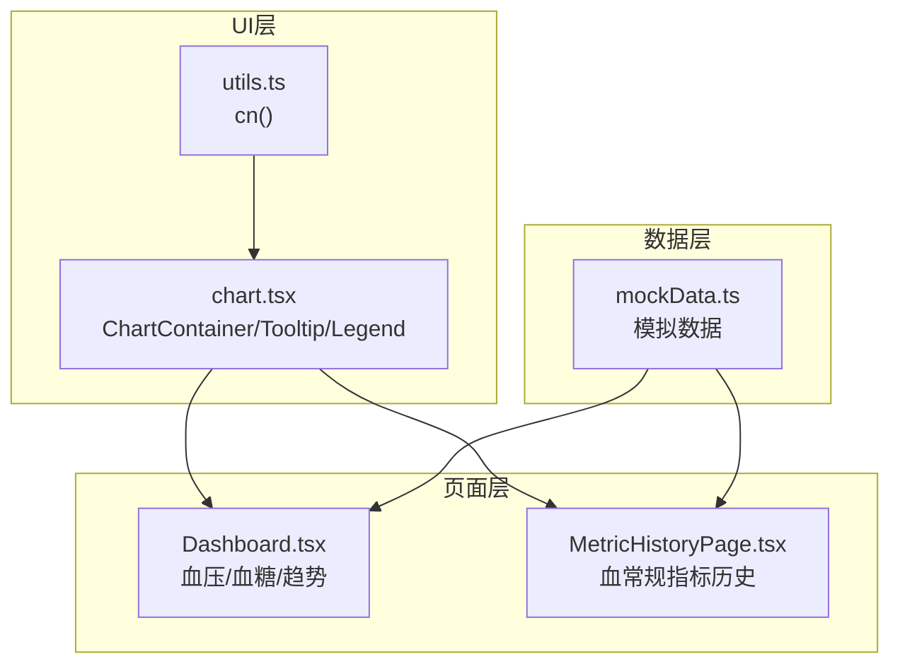
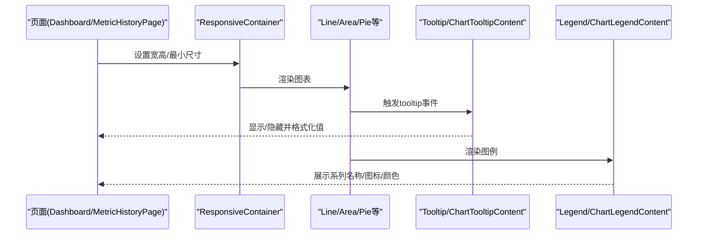
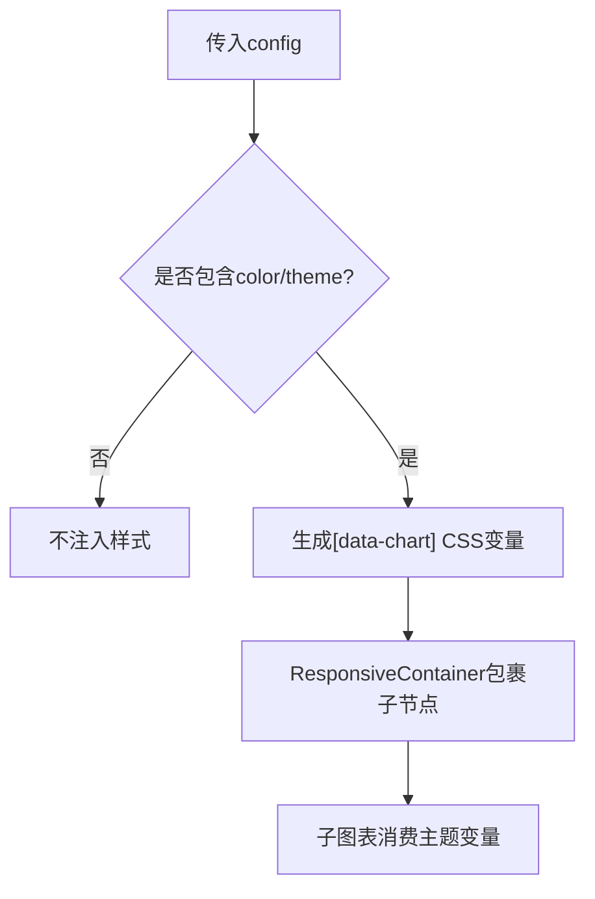
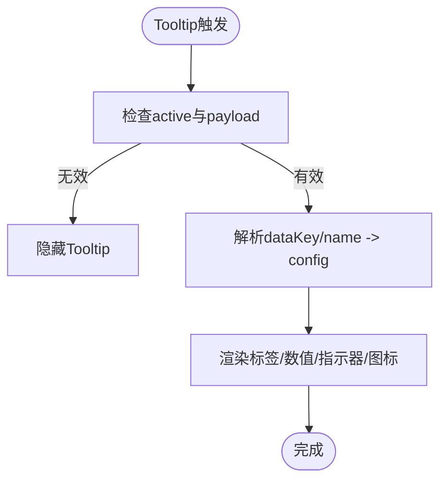
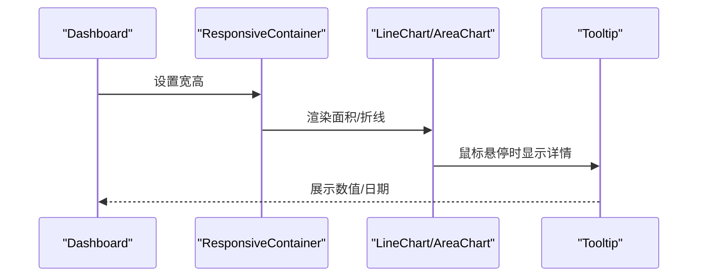
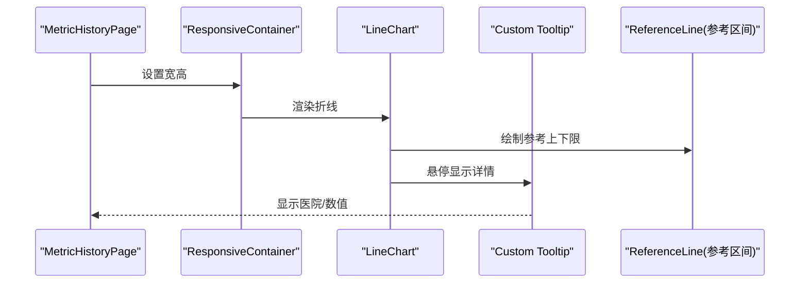
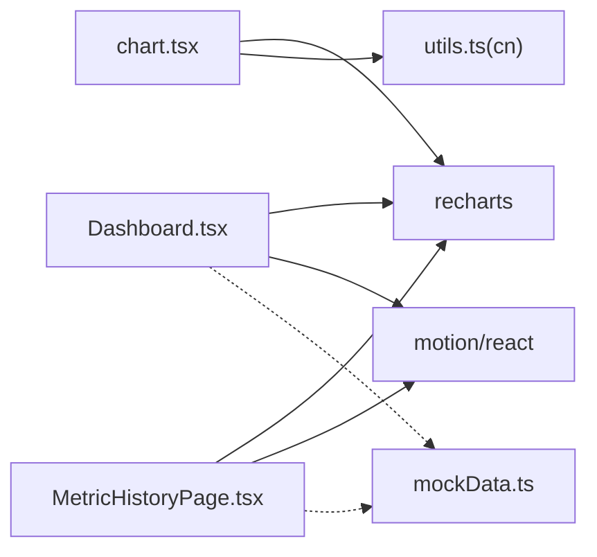

# Chart图表组件

<cite>
**本文引用的文件**
- [chart.tsx](file://figma-ui/src/app/components/ui/chart.tsx)
- [Dashboard.tsx](file://figma-ui/src/app/pages/Dashboard.tsx)
- [MetricHistoryPage.tsx](file://figma-ui/src/app/pages/MetricHistoryPage.tsx)
- [utils.ts](file://figma-ui/src/app/components/ui/utils.ts)
- [mockData.ts](file://figma-ui/src/app/utils/mockData.ts)
</cite>

## 目录
1. [简介](#简介)
2. [项目结构](#项目结构)
3. [核心组件](#核心组件)
4. [架构总览](#架构总览)
5. [详细组件分析](#详细组件分析)
6. [依赖关系分析](#依赖关系分析)
7. [性能与响应式优化](#性能与响应式优化)
8. [使用示例与最佳实践](#使用示例与最佳实践)
9. [故障排查指南](#故障排查指南)
10. [结论](#结论)

## 简介
本组件文档围绕医案通医疗档案网站中的Chart图表能力，系统梳理基于Recharts封装的医疗数据可视化方案。内容涵盖：
- 支持的医疗指标图表类型：血压趋势、血糖曲线、体重变化、血常规指标等
- 数据格式规范、配置项与自定义样式方法
- 业务场景下的使用示例：实时数据更新、交互操作、多指标对比
- 响应式适配与性能优化策略

该套件以可复用的容器、工具提示、图例为核心，结合页面级图表实现（如Dashboard、MetricHistoryPage），为医疗健康数据的可视化提供统一、易扩展的基础能力。

## 项目结构
- 图表基础能力封装位于 UI 层：
  - 容器与主题化：ChartContainer、ChartStyle
  - 交互增强：ChartTooltipContent、ChartLegendContent
  - 工具函数：getPayloadConfigFromPayload
- 页面级图表实现：
  - Dashboard：健康指标概览（血压、血糖）与主趋势图
  - MetricHistoryPage：血常规指标历史追溯（白细胞、红细胞等）
- 辅助工具：
  - utils.ts：类名合并工具 cn
  - mockData.ts：模拟归档数据（用于展示/测试）

**图示来源**
- [chart.tsx:37-103](file://figma-ui/src/app/components/ui/chart.tsx#L37-L103)
- [Dashboard.tsx:17-141](file://figma-ui/src/app/pages/Dashboard.tsx#L17-L141)
- [MetricHistoryPage.tsx:23-143](file://figma-ui/src/app/pages/MetricHistoryPage.tsx#L23-L143)
- [utils.ts:4-6](file://figma-ui/src/app/components/ui/utils.ts#L4-L6)
- [mockData.ts:3-89](file://figma-ui/src/app/utils/mockData.ts#L3-L89)

**章节来源**
- [chart.tsx:1-354](file://figma-ui/src/app/components/ui/chart.tsx#L1-L354)
- [Dashboard.tsx:1-204](file://figma-ui/src/app/pages/Dashboard.tsx#L1-L204)
- [MetricHistoryPage.tsx:1-216](file://figma-ui/src/app/pages/MetricHistoryPage.tsx#L1-L216)
- [utils.ts:1-7](file://figma-ui/src/app/components/ui/utils.ts#L1-L7)
- [mockData.ts:1-98](file://figma-ui/src/app/utils/mockData.ts#L1-L98)

## 核心组件
- ChartContainer
  - 作用：图表容器，注入主题色变量、包裹ResponsiveContainer，提供统一的尺寸与样式上下文
  - 关键特性：通过data-chart标识生成CSS变量；支持传入config定义系列颜色/主题
- ChartTooltipContent
  - 作用：统一的可定制工具提示，支持隐藏标签/指示器、格式化显示、图标与颜色映射
  - 关键特性：从ChartContext读取config，按dataKey/name解析label与颜色
- ChartLegendContent
  - 作用：统一图例渲染，支持图标与颜色映射，位置控制
- getPayloadConfigFromPayload
  - 作用：根据payload动态解析对应系列的配置（label/icon/color）

**章节来源**
- [chart.tsx:11-35](file://figma-ui/src/app/components/ui/chart.tsx#L11-L35)
- [chart.tsx:37-103](file://figma-ui/src/app/components/ui/chart.tsx#L37-L103)
- [chart.tsx:107-249](file://figma-ui/src/app/components/ui/chart.tsx#L107-L249)
- [chart.tsx:253-305](file://figma-ui/src/app/components/ui/chart.tsx#L253-L305)
- [chart.tsx:308-344](file://figma-ui/src/app/components/ui/chart.tsx#L308-L344)

## 架构总览
图表体系由“基础封装 + 页面实现”两层构成：
- 基础封装（chart.tsx）提供容器、主题、Tooltip、Legend的统一接口
- 页面实现（Dashboard、MetricHistoryPage）直接使用Recharts原语或封装组件完成具体业务图表

**图示来源**
- [Dashboard.tsx:107-141](file://figma-ui/src/app/pages/Dashboard.tsx#L107-L141)
- [MetricHistoryPage.tsx:109-143](file://figma-ui/src/app/pages/MetricHistoryPage.tsx#L109-L143)
- [chart.tsx:107-249](file://figma-ui/src/app/components/ui/chart.tsx#L107-L249)
- [chart.tsx:253-305](file://figma-ui/src/app/components/ui/chart.tsx#L253-L305)

## 详细组件分析

### 容器与主题：ChartContainer / ChartStyle
- 通过data-chart唯一标识注入CSS变量，实现按系列的颜色主题化
- 内置响应式容器，确保在不同屏幕下自适应
- 支持传入config对象，声明每个系列的label、icon、color或theme映射

**图示来源**
- [chart.tsx:37-103](file://figma-ui/src/app/components/ui/chart.tsx#L37-L103)

**章节来源**
- [chart.tsx:37-103](file://figma-ui/src/app/components/ui/chart.tsx#L37-L103)

### 工具提示：ChartTooltipContent
- 支持隐藏标签/指示器、自定义formatter、图标渲染
- 自动从config中解析系列label与颜色，保证一致的主题表现
- 与页面级Tooltip配合，可实现更丰富的医疗信息展示（如医院名称、单位）

**图示来源**
- [chart.tsx:107-249](file://figma-ui/src/app/components/ui/chart.tsx#L107-L249)

**章节来源**
- [chart.tsx:107-249](file://figma-ui/src/app/components/ui/chart.tsx#L107-L249)

### 图例：ChartLegendContent
- 支持隐藏图标、垂直对齐控制
- 自动从config解析label与颜色，保持与图表一致

**章节来源**
- [chart.tsx:253-305](file://figma-ui/src/app/components/ui/chart.tsx#L253-L305)

### 页面级图表实现

#### Dashboard：健康指标概览
- 血压、血糖卡片使用AreaChart展示迷你趋势
- 主区域使用LineChart展示整体趋势，支持时间筛选（最近7天/30天）
- 数据源：本地MOCK_STATS数组

**图示来源**
- [Dashboard.tsx:58-105](file://figma-ui/src/app/pages/Dashboard.tsx#L58-L105)
- [Dashboard.tsx:107-141](file://figma-ui/src/app/pages/Dashboard.tsx#L107-L141)

**章节来源**
- [Dashboard.tsx:17-141](file://figma-ui/src/app/pages/Dashboard.tsx#L17-L141)

#### MetricHistoryPage：血常规指标历史
- 使用LineChart展示白细胞/红细胞等指标的历史趋势
- 通过ReferenceLine标注参考区间上下限，直观判断异常
- 自定义Tooltip展示医院信息与当前值

**图示来源**
- [MetricHistoryPage.tsx:109-143](file://figma-ui/src/app/pages/MetricHistoryPage.tsx#L109-L143)

**章节来源**
- [MetricHistoryPage.tsx:23-143](file://figma-ui/src/app/pages/MetricHistoryPage.tsx#L23-L143)

## 依赖关系分析
- chart.tsx依赖：
  - Recharts原语：ResponsiveContainer、Tooltip、Legend等
  - 工具函数：cn（来自utils.ts）
- Dashboard.tsx依赖：
  - Recharts原语：LineChart、AreaChart、XAxis、YAxis、CartesianGrid、Tooltip、ResponsiveContainer
  - 动画库：motion/react
- MetricHistoryPage.tsx依赖：
  - Recharts原语：LineChart、XAxis、YAxis、CartesianGrid、Tooltip、ResponsiveContainer、ReferenceLine
  - 动画库：motion/react
- mockData.ts提供示例数据，便于演示与测试

**图示来源**
- [chart.tsx:3-6](file://figma-ui/src/app/components/ui/chart.tsx#L3-L6)
- [Dashboard.tsx:1-15](file://figma-ui/src/app/pages/Dashboard.tsx#L1-L15)
- [MetricHistoryPage.tsx:1-17](file://figma-ui/src/app/pages/MetricHistoryPage.tsx#L1-L17)
- [utils.ts:1-7](file://figma-ui/src/app/components/ui/utils.ts#L1-L7)
- [mockData.ts:1-98](file://figma-ui/src/app/utils/mockData.ts#L1-L98)

**章节来源**
- [chart.tsx:1-354](file://figma-ui/src/app/components/ui/chart.tsx#L1-L354)
- [Dashboard.tsx:1-204](file://figma-ui/src/app/pages/Dashboard.tsx#L1-L204)
- [MetricHistoryPage.tsx:1-216](file://figma-ui/src/app/pages/MetricHistoryPage.tsx#L1-L216)
- [utils.ts:1-7](file://figma-ui/src/app/components/ui/utils.ts#L1-L7)
- [mockData.ts:1-98](file://figma-ui/src/app/utils/mockData.ts#L1-L98)

## 性能与响应式优化
- 响应式适配
  - 使用ResponsiveContainer确保图表在任意容器尺寸下自适应
  - 在Dashboard中为小卡片设置minWidth/minHeight，避免布局抖动
- 渲染性能
  - 合理设置X/Y轴刻度与网格，减少重绘开销
  - 对大量数据点考虑采样或分页加载
- 主题与样式
  - 通过ChartContainer的config集中管理颜色，避免分散样式
  - 使用CSS变量与Tailwind类名组合，提升一致性
- 交互体验
  - 自定义Tooltip减少DOM复杂度，按需渲染
  - 合理使用ReferenceLine标注参考区间，降低用户认知成本

[本节为通用指导，不直接分析具体文件]

## 使用示例与最佳实践

### 数据格式要求
- 时间序列数据（如Dashboard、MetricHistoryPage）
  - 数组元素包含时间键（如name/date）与数值键（如value/wbc/rbc）
  - 示例：{ name: "03/01", value: 120 } 或 { date: "10-01", wbc: 6.5, rbc: 4.8 }
- 多指标对比
  - 在同一数据集内提供多个数值键（wbc、rbc等），通过不同Line/Area渲染
- 参考区间
  - 使用ReferenceLine标注上下限，便于异常识别

**章节来源**
- [Dashboard.tsx:17-23](file://figma-ui/src/app/pages/Dashboard.tsx#L17-L23)
- [MetricHistoryPage.tsx:23-30](file://figma-ui/src/app/pages/MetricHistoryPage.tsx#L23-L30)

### 配置选项与自定义样式
- 容器配置（ChartContainer）
  - config：定义每个系列的label、icon、color或theme映射
  - className：叠加额外样式
- Tooltip配置（ChartTooltipContent）
  - hideLabel/hideIndicator：控制显示
  - indicator：dot/line/dashed
  - formatter：自定义数值显示
  - labelFormatter：自定义标签显示
- Legend配置（ChartLegendContent）
  - hideIcon：隐藏图标
  - verticalAlign：top/bottom
- 页面级样式
  - 通过Tailwind类名与CSS变量组合实现主题切换与品牌风格

**章节来源**
- [chart.tsx:11-19](file://figma-ui/src/app/components/ui/chart.tsx#L11-L19)
- [chart.tsx:107-249](file://figma-ui/src/app/components/ui/chart.tsx#L107-L249)
- [chart.tsx:253-305](file://figma-ui/src/app/components/ui/chart.tsx#L253-L305)

### 医疗业务场景示例
- 血压趋势图（Dashboard）
  - 使用AreaChart展示近期血压波动，卡片内嵌迷你图
  - 通过select选择时间范围（最近7天/30天）
- 血糖曲线图（Dashboard）
  - 使用AreaChart展示血糖趋势，颜色与填充区分指标
- 血常规指标历史（MetricHistoryPage）
  - 使用LineChart展示白细胞/红细胞等指标历史
  - ReferenceLine标注参考区间，异常状态高亮
  - 自定义Tooltip展示医院信息与当前值

**章节来源**
- [Dashboard.tsx:58-105](file://figma-ui/src/app/pages/Dashboard.tsx#L58-L105)
- [Dashboard.tsx:107-141](file://figma-ui/src/app/pages/Dashboard.tsx#L107-L141)
- [MetricHistoryPage.tsx:109-143](file://figma-ui/src/app/pages/MetricHistoryPage.tsx#L109-L143)

### 实时数据更新与交互
- 实时更新
  - 通过state或外部数据源更新数据数组，Recharts会自动重绘
  - 建议在高频更新时使用节流/防抖，避免频繁渲染
- 交互操作
  - 使用Tooltip进行数据探查
  - 使用ReferenceLine进行阈值提示
  - 结合按钮/下拉框切换时间范围或指标

[本节为通用指导，不直接分析具体文件]

## 故障排查指南
- 未使用ChartContainer导致主题失效
  - 现象：系列颜色未按config生效
  - 解决：确保图表被ChartContainer包裹，并传入正确config
- Tooltip不显示或显示为空
  - 现象：hover无提示或值为空
  - 解决：检查active与payload有效性；确认dataKey/name与config匹配
- 图表尺寸异常
  - 现象：图表溢出或压缩
  - 解决：为ResponsiveContainer设置合适的宽高与minWidth/minHeight
- 参考区间不显示
  - 现象：ReferenceLine不可见
  - 解决：确认y值与YAxis domain范围匹配

**章节来源**
- [chart.tsx:37-103](file://figma-ui/src/app/components/ui/chart.tsx#L37-L103)
- [chart.tsx:107-249](file://figma-ui/src/app/components/ui/chart.tsx#L107-L249)
- [Dashboard.tsx:107-141](file://figma-ui/src/app/pages/Dashboard.tsx#L107-L141)
- [MetricHistoryPage.tsx:109-143](file://figma-ui/src/app/pages/MetricHistoryPage.tsx#L109-L143)

## 结论
本套Chart图表组件以Recharts为基础，通过容器化、主题化与交互增强，为医案通医疗档案网站提供了稳定、可扩展的可视化能力。页面级实现覆盖了血压、血糖、血常规等常见医疗指标的趋势展示与历史追溯。借助统一的数据格式、配置项与样式策略，开发者可以快速构建符合医疗业务需求的图表界面，并通过响应式与性能优化保障用户体验。