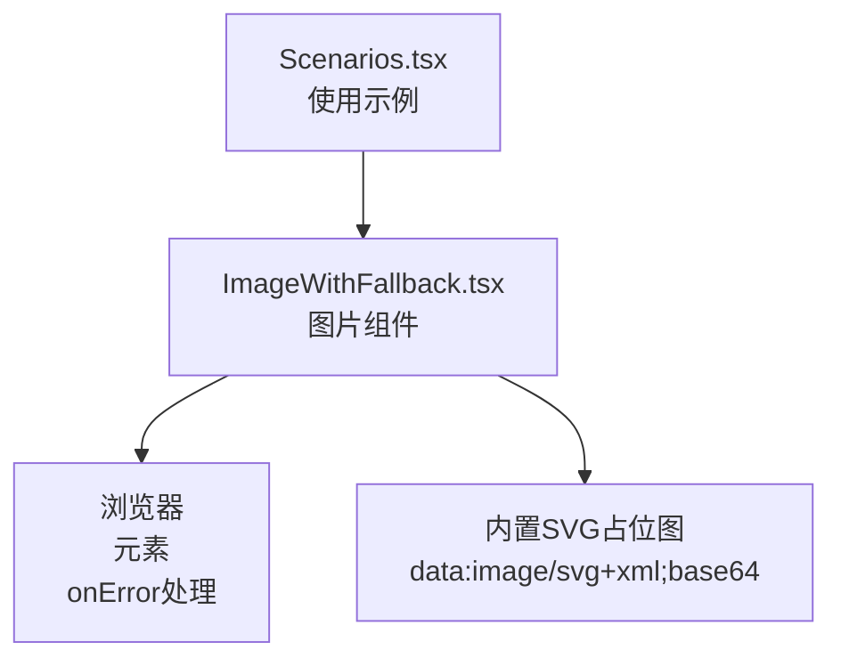
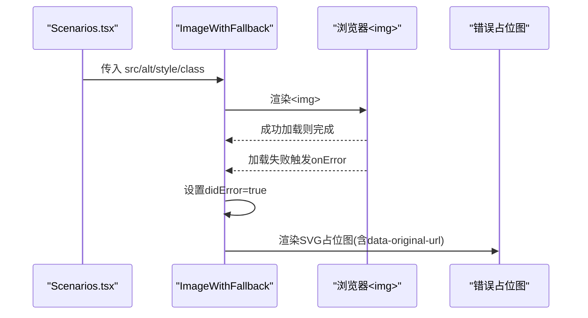
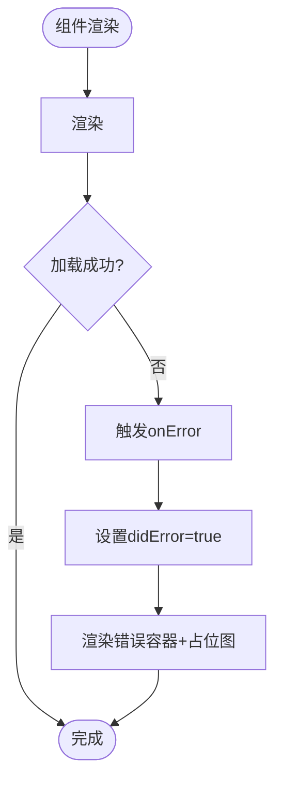
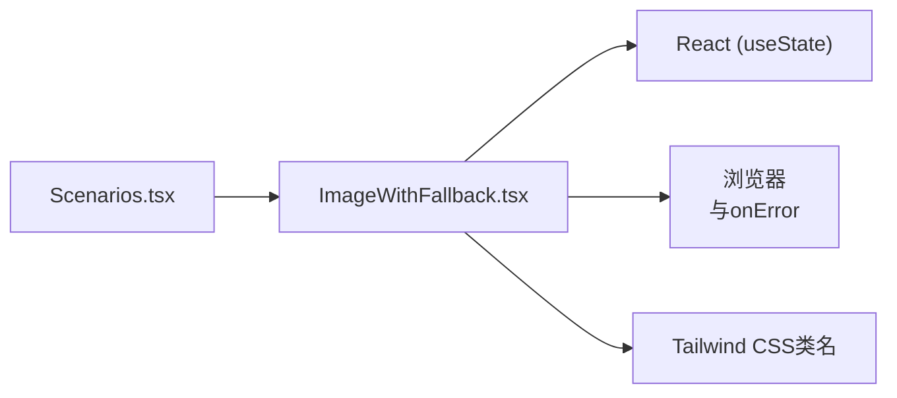

# ImageWithFallback图片组件

<cite>
**本文引用的文件**
- [ImageWithFallback.tsx](file://figma-ui/src/app/components/figma/ImageWithFallback.tsx)
- [Scenarios.tsx](file://figma-ui/src/app/pages/Home/Scenarios.tsx)
- [types.ts](file://figma-ui/src/app/types.ts)
- [README.md](file://figma-ui/README.md)
</cite>

## 目录
1. [简介](#简介)
2. [项目结构](#项目结构)
3. [核心组件](#核心组件)
4. [架构总览](#架构总览)
5. [详细组件分析](#详细组件分析)
6. [依赖关系分析](#依赖关系分析)
7. [性能考量](#性能考量)
8. [故障排查指南](#故障排查指南)
9. [结论](#结论)
10. [附录](#附录)

## 简介
ImageWithFallback 是一个基于 React 的图片展示组件，用于在图片加载失败时自动降级为错误占位图，保证页面布局与用户体验的稳定性。该组件适用于医疗档案网站中的医生头像、医疗文档缩略图等场景，确保在网络异常或资源不可用时仍能提供一致的视觉反馈。

## 项目结构
- 组件位于 figma-ui/src/app/components/figma 目录下，以独立 TSX 文件形式提供。
- 使用示例位于首页“典型使用场景”页面中，通过传入 src、alt、className 等属性进行渲染。
- 类型定义集中在 types.ts，包含档案、OCR、检验项等数据结构，便于在业务层组织图片数据（如 imageUrl）。

图表来源
- [Scenarios.tsx:100-108](file://figma-ui/src/app/pages/Home/Scenarios.tsx#L100-L108)
- [ImageWithFallback.tsx:1-28](file://figma-ui/src/app/components/figma/ImageWithFallback.tsx#L1-L28)

章节来源
- [README.md:1-11](file://figma-ui/README.md#L1-L11)

## 核心组件
ImageWithFallback 的核心职责：
- 正常状态：渲染原生 ，透传所有标准 img 属性（src、alt、style、className 及其余 HTMLAttributes）。
- 错误状态：当图片加载失败时，切换为内联块级容器，居中显示内置 SVG 占位图，并保留原始 URL 以便调试。
- 样式与尺寸：通过 className 和 style 由调用方控制；错误态容器默认使用灰色背景与居中对齐，保持布局稳定。

关键行为要点：
- 使用 useState 管理 didError 状态，初始为 false。
- 通过 onError 回调设置错误标志，触发重新渲染。
- 错误态下将 data-original-url 附加到占位图上，便于定位原始请求地址。

章节来源
- [ImageWithFallback.tsx:1-28](file://figma-ui/src/app/components/figma/ImageWithFallback.tsx#L1-L28)

## 架构总览
下图展示了从页面到组件再到浏览器的完整渲染流程，以及错误时的降级路径。

图表来源
- [Scenarios.tsx:100-108](file://figma-ui/src/app/pages/Home/Scenarios.tsx#L100-L108)
- [ImageWithFallback.tsx:6-26](file://figma-ui/src/app/components/figma/ImageWithFallback.tsx#L6-L26)

## 详细组件分析

### 组件能力与配置选项
- 支持的属性
  - src：图片地址（必填）
  - alt：替代文本（建议填写）
  - style：行内样式（可控制宽高、圆角等）
  - className：Tailwind 类名（可控制布局与外观）
  - 其他 img HTMLAttributes：如 loading、decoding、crossOrigin 等均可透传
- 内部行为
  - 错误占位图：使用内嵌 base64 SVG，避免额外网络请求
  - 错误标记：didError 状态切换后，渲染容器 + 占位图
  - 调试信息：占位图附带 data-original-url，便于定位问题源

章节来源
- [ImageWithFallback.tsx:6-26](file://figma-ui/src/app/components/figma/ImageWithFallback.tsx#L6-L26)

### 医疗场景使用示例
- 医生头像
  - 使用方式：传入医生头像地址，配合圆形裁剪与固定尺寸
  - 失败处理：自动显示占位图，避免头像缺失影响界面
- 医疗文档缩略图
  - 使用方式：传入病历、报告、影像等缩略图地址
  - 失败处理：统一降级为占位图，保持卡片布局一致
- 参考用法位置
  - 首页“典型使用场景”中，对多张医疗相关图片使用 ImageWithFallback 进行渲染

章节来源
- [Scenarios.tsx:100-108](file://figma-ui/src/app/pages/Home/Scenarios.tsx#L100-L108)
- [types.ts:11-25](file://figma-ui/src/app/types.ts#L11-L25)

### 与React生命周期的结合
- 当前实现未使用 useEffect/useMemo/useCallback 等生命周期钩子，仅依赖 useState 管理错误状态。
- 优点：逻辑简洁、无副作用、易于维护。
- 适用性：对于静态图片展示与失败降级已足够；如需重试、预加载、缓存等高级功能，可在上层封装或使用自定义 Hook。

章节来源
- [ImageWithFallback.tsx:1-28](file://figma-ui/src/app/components/figma/ImageWithFallback.tsx#L1-L28)

### 流程图：加载与降级逻辑

图表来源
- [ImageWithFallback.tsx:6-26](file://figma-ui/src/app/components/figma/ImageWithFallback.tsx#L6-L26)

## 依赖关系分析
- 直接依赖
  - React：useState、函数式组件
  - Tailwind CSS：通过 className 控制样式（如 bg-gray-100、inline-block、flex、align-middle）
- 间接依赖
  - 浏览器原生  事件模型（onError）
  - 页面层（Scenarios.tsx）负责传入具体图片资源与样式

图表来源
- [Scenarios.tsx:100-108](file://figma-ui/src/app/pages/Home/Scenarios.tsx#L100-L108)
- [ImageWithFallback.tsx:1-28](file://figma-ui/src/app/components/figma/ImageWithFallback.tsx#L1-L28)

章节来源
- [Scenarios.tsx:100-108](file://figma-ui/src/app/pages/Home/Scenarios.tsx#L100-L108)
- [ImageWithFallback.tsx:1-28](file://figma-ui/src/app/components/figma/ImageWithFallback.tsx#L1-L28)

## 性能考量
- 零额外请求：错误占位图为内嵌 base64 SVG，不产生额外网络开销。
- 最小重渲染：仅在 onError 时切换状态，减少不必要的更新。
- 样式解耦：通过 className/style 由调用方控制，组件本身轻量。
- 可扩展点（可选优化方向）：
  - 添加重试机制：在上层封装重试次数与退避策略，避免频繁请求导致雪崩。
  - 预加载与懒加载：结合 IntersectionObserver 或 loading="lazy" 提升首屏性能。
  - 缓存策略：利用浏览器缓存或内存缓存减少重复请求。
  - 错误上报：在 onError 中收集统计信息，便于监控与告警。

[本节为通用性能建议，无需特定文件引用]

## 故障排查指南
- 常见问题
  - 图片无法加载：检查 src 是否有效、跨域策略、CDN 可用性。
  - 占位图不显示：确认 onError 是否被触发，查看 data-original-url 是否正确。
  - 样式错乱：核对 className/style 是否与容器尺寸匹配。
- 定位方法
  - 使用浏览器开发者工具查看 Network 面板，确认图片请求状态。
  - 在占位图上读取 data-original-url，快速定位原始地址。
  - 若需扩展错误回调，可在外层包裹一层组件，捕获并记录错误信息。

章节来源
- [ImageWithFallback.tsx:9-22](file://figma-ui/src/app/components/figma/ImageWithFallback.tsx#L9-L22)

## 结论
ImageWithFallback 以极简实现提供了可靠的图片加载失败降级能力，适合医疗档案网站中对稳定性要求较高的图片展示场景。其设计遵循“简单即强大”的原则：通过最小状态与内嵌占位图，在不引入复杂依赖的前提下保障用户体验。未来可根据业务需要在上层扩展重试、缓存、监控等功能。

[本节为总结性内容，无需特定文件引用]

## 附录
- 运行与开发
  - 安装依赖：npm i
  - 启动开发服务器：npm run dev
- 参考文件
  - 组件实现：ImageWithFallback.tsx
  - 使用示例：Scenarios.tsx
  - 数据类型：types.ts

章节来源
- [README.md:6-11](file://figma-ui/README.md#L6-L11)
- [ImageWithFallback.tsx:1-28](file://figma-ui/src/app/components/figma/ImageWithFallback.tsx#L1-L28)
- [Scenarios.tsx:100-108](file://figma-ui/src/app/pages/Home/Scenarios.tsx#L100-L108)
- [types.ts:11-25](file://figma-ui/src/app/types.ts#L11-L25)