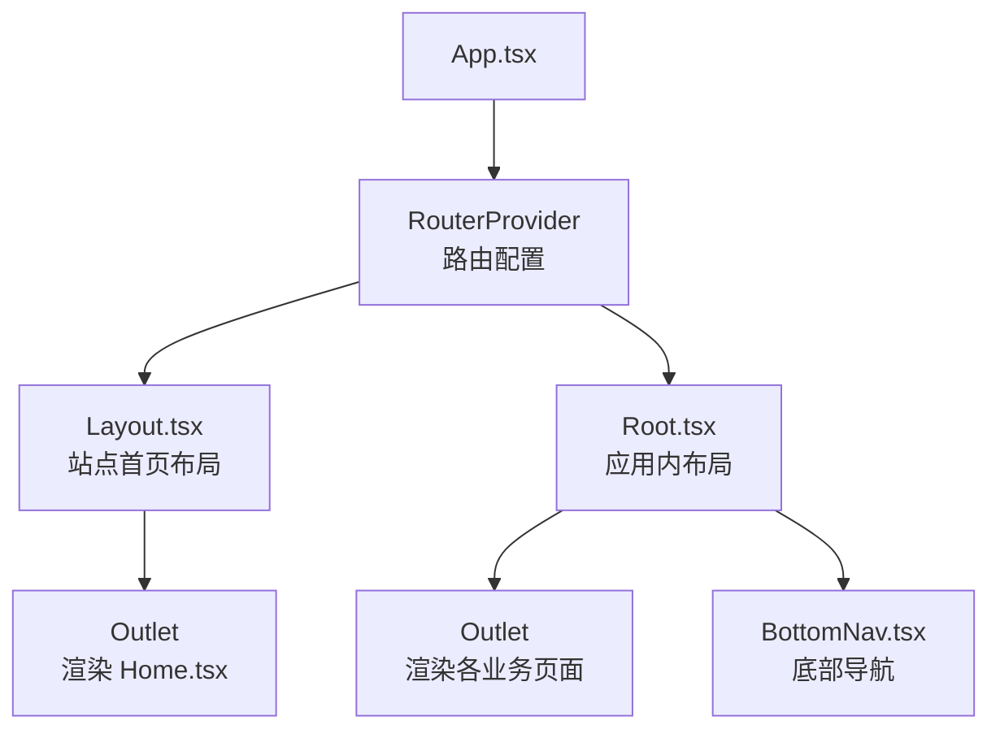
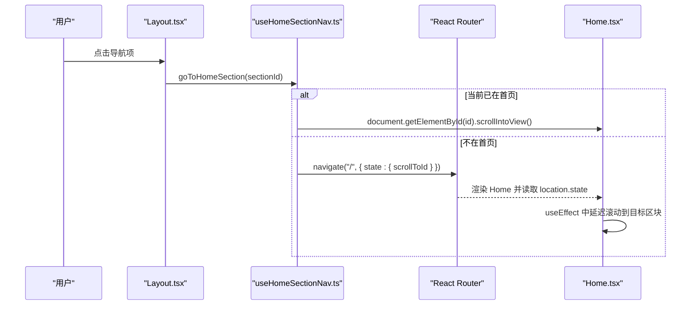
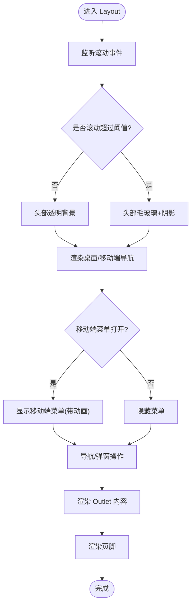
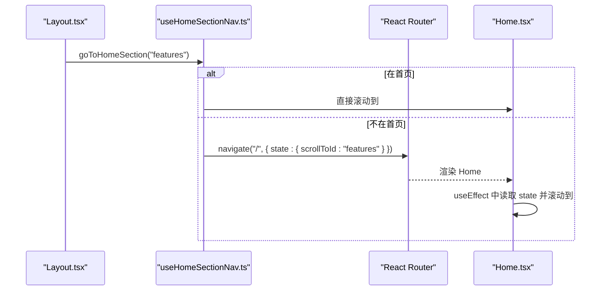
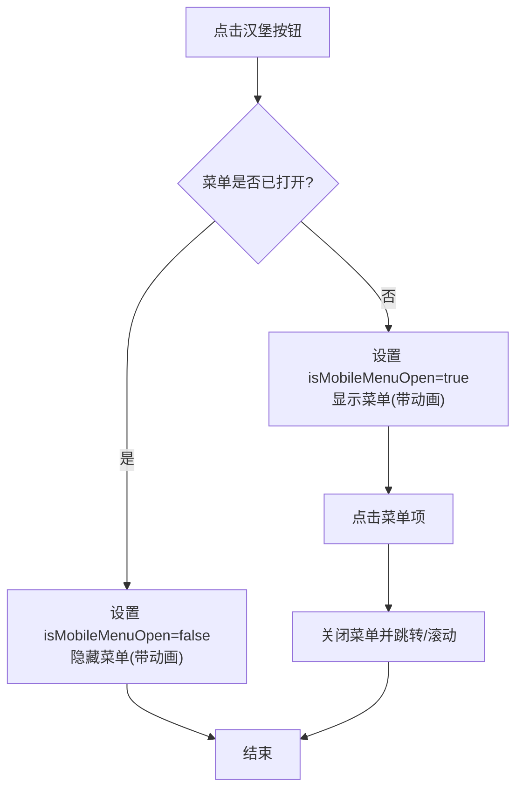
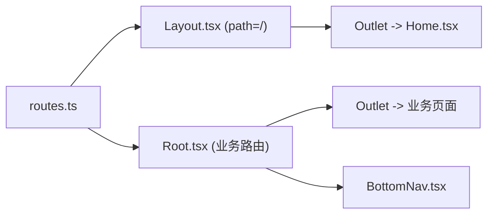
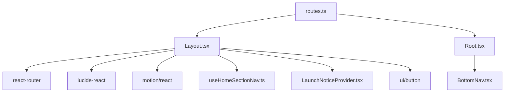

# Layout布局组件

<cite>
**本文引用的文件**
- [Layout.tsx](file://figma-ui/src/app/components/Layout.tsx)
- [routes.ts](file://figma-ui/src/app/routes.ts)
- [App.tsx](file://figma-ui/src/app/App.tsx)
- [useHomeSectionNav.ts](file://figma-ui/src/app/hooks/useHomeSectionNav.ts)
- [LaunchNoticeProvider.tsx](file://figma-ui/src/app/components/LaunchNoticeProvider.tsx)
- [Root.tsx](file://figma-ui/src/app/Root.tsx)
- [BottomNav.tsx](file://figma-ui/src/app/components/BottomNav.tsx)
- [Home.tsx](file://figma-ui/src/app/pages/Home.tsx)
</cite>

## 目录
1. [简介](#简介)
2. [项目结构](#项目结构)
3. [核心组件](#核心组件)
4. [架构总览](#架构总览)
5. [详细组件分析](#详细组件分析)
6. [依赖关系分析](#依赖关系分析)
7. [性能考量](#性能考量)
8. [故障排查指南](#故障排查指南)
9. [结论](#结论)
10. [附录：使用示例与最佳实践](#附录使用示例与最佳实践)

## 简介
Layout 组件是医案通医疗档案网站的主布局容器，负责全局导航栏、移动端菜单切换、滚动效果处理、页面内容区域（Outlet）以及页脚信息。它通过 React Router 集成页面路由，结合自定义 Hook 实现首页锚点跳转，并通过上下文提供“立即体验”和“合作咨询”弹窗能力。同时，该组件具备响应式适配策略，在桌面端展示完整导航，在移动端提供可展开的汉堡菜单。

## 项目结构
Layout 位于应用组件层，作为根路由下的一个布局组件，包裹首页内容；应用内其他功能模块则通过 Root 布局与底部导航组合，形成两套不同的布局体系：
- 站点首页布局：由 Layout 提供顶部导航、主内容区与页脚。
- 应用内布局：由 Root 提供登录态校验、Outlet 内容与底部导航。

图表来源
- [App.tsx:1-12](file://figma-ui/src/app/App.tsx#L1-L12)
- [routes.ts:25-35](file://figma-ui/src/app/routes.ts#L25-L35)
- [Layout.tsx:10-144](file://figma-ui/src/app/components/Layout.tsx#L10-L144)
- [Root.tsx:6-58](file://figma-ui/src/app/Root.tsx#L6-L58)
- [BottomNav.tsx:5-85](file://figma-ui/src/app/components/BottomNav.tsx#L5-L85)

章节来源
- [App.tsx:1-12](file://figma-ui/src/app/App.tsx#L1-L12)
- [routes.ts:25-35](file://figma-ui/src/app/routes.ts#L25-L35)

## 核心组件
- Layout.tsx：站点首页布局容器，包含固定头部、响应式导航、移动端菜单、滚动监听、页脚与 Outlet。
- useHomeSectionNav.ts：封装首页锚点滚动逻辑，支持从任意页面跳转到首页并滚动到指定区块。
- LaunchNoticeProvider.tsx：提供“立即体验”和“合作咨询”弹窗的状态与 UI。
- Root.tsx：应用内布局，负责登录态检查、成员数据加载、Outlet 与底部导航。
- BottomNav.tsx：应用内底部导航，提供常用入口与动效。
- routes.ts：定义路由树，将 Layout 与 Root 挂载到对应路径下。

章节来源
- [Layout.tsx:10-251](file://figma-ui/src/app/components/Layout.tsx#L10-L251)
- [useHomeSectionNav.ts:1-26](file://figma-ui/src/app/hooks/useHomeSectionNav.ts#L1-L26)
- [LaunchNoticeProvider.tsx:1-118](file://figma-ui/src/app/components/LaunchNoticeProvider.tsx#L1-L118)
- [Root.tsx:1-59](file://figma-ui/src/app/Root.tsx#L1-L59)
- [BottomNav.tsx:1-85](file://figma-ui/src/app/components/BottomNav.tsx#L1-L85)
- [routes.ts:1-106](file://figma-ui/src/app/routes.ts#L1-L106)

## 架构总览
Layout 作为站点首页的布局容器，通过 React Router 的 Outlet 注入页面内容；顶部导航在桌面端直接显示，在移动端以汉堡菜单形式呈现；滚动时头部背景与阴影发生变化；页脚提供产品与服务、支持与联系等分组链接；所有导航点击统一通过 useHomeSectionNav 进行平滑滚动或跨页面跳转。

图表来源
- [Layout.tsx:24-63](file://figma-ui/src/app/components/Layout.tsx#L24-L63)
- [useHomeSectionNav.ts:8-25](file://figma-ui/src/app/hooks/useHomeSectionNav.ts#L8-L25)
- [Home.tsx:13-27](file://figma-ui/src/app/pages/Home.tsx#L13-L27)

## 详细组件分析

### Layout 组件
- 职责
  - 提供固定头部，根据滚动状态切换背景透明度与阴影。
  - 桌面端展示导航链接，移动端提供汉堡菜单与动画展开收起。
  - 集成“立即体验”和“合作咨询”弹窗（通过上下文）。
  - 通过 Outlet 渲染子页面内容。
  - 提供页脚，包含品牌介绍、产品与服务、支持与联系等分组。
- 关键实现要点
  - 滚动监听：监听 window.scrollY，超过阈值切换头部样式。
  - 移动端菜单：使用 AnimatePresence 控制展开/收起动画。
  - 导航行为：统一调用 useHomeSectionNav.goToHomeSection 实现平滑滚动或跨页跳转。
  - 弹窗能力：通过 useLaunchNotice 暴露 showLaunchNotice/showPartnerNotice。
  - 响应式：Tailwind 类名控制不同断点的显隐与布局。

图表来源
- [Layout.tsx:16-22](file://figma-ui/src/app/components/Layout.tsx#L16-L22)
- [Layout.tsx:33-90](file://figma-ui/src/app/components/Layout.tsx#L33-L90)
- [Layout.tsx:92-140](file://figma-ui/src/app/components/Layout.tsx#L92-L140)
- [Layout.tsx:142-247](file://figma-ui/src/app/components/Layout.tsx#L142-L247)

章节来源
- [Layout.tsx:10-251](file://figma-ui/src/app/components/Layout.tsx#L10-L251)

### 滚动与锚点导航
- 滚动监听：在 Layout 中监听 scroll 事件，更新 isScrolled 状态，用于切换头部样式。
- 锚点跳转：useHomeSectionNav 判断当前是否在首页，若在则直接滚动到目标区块；若不在则先导航到首页并通过 location.state 传递目标区块 ID，Home 页面在 effect 中执行滚动并清理 state。

图表来源
- [Layout.tsx:24-63](file://figma-ui/src/app/components/Layout.tsx#L24-L63)
- [useHomeSectionNav.ts:8-25](file://figma-ui/src/app/hooks/useHomeSectionNav.ts#L8-L25)
- [Home.tsx:13-27](file://figma-ui/src/app/pages/Home.tsx#L13-L27)

章节来源
- [Layout.tsx:16-22](file://figma-ui/src/app/components/Layout.tsx#L16-L22)
- [useHomeSectionNav.ts:1-26](file://figma-ui/src/app/hooks/useHomeSectionNav.ts#L1-L26)
- [Home.tsx:13-27](file://figma-ui/src/app/pages/Home.tsx#L13-L27)

### 移动端菜单切换
- 状态管理：isMobileMenuOpen 控制菜单展开/收起。
- 交互：点击汉堡图标切换状态；菜单项点击后关闭菜单并执行导航。
- 动画：使用 AnimatePresence 与 motion 实现淡入淡出与位移过渡。

图表来源
- [Layout.tsx:79-139](file://figma-ui/src/app/components/Layout.tsx#L79-L139)

章节来源
- [Layout.tsx:79-139](file://figma-ui/src/app/components/Layout.tsx#L79-L139)

### 与 React Router 的集成
- 路由挂载：routes.ts 将 Layout 挂载到根路径 "/"，其 children 为首页 Home。
- 应用内路由：Root 作为另一组布局，挂载多个业务页面，并提供底部导航。
- 导航方式：Layout 内部使用 Link 与按钮触发导航；跨页锚点通过 useHomeSectionNav 与 Home 的 location.state 配合实现。

图表来源
- [routes.ts:25-76](file://figma-ui/src/app/routes.ts#L25-L76)
- [Layout.tsx:142-144](file://figma-ui/src/app/components/Layout.tsx#L142-L144)
- [Root.tsx:52-58](file://figma-ui/src/app/Root.tsx#L52-L58)

章节来源
- [routes.ts:25-76](file://figma-ui/src/app/routes.ts#L25-L76)
- [Root.tsx:6-58](file://figma-ui/src/app/Root.tsx#L6-L58)

### 状态管理机制
- 滚动状态：isScrolled 由 scroll 事件驱动，影响头部视觉样式。
- 菜单状态：isMobileMenuOpen 由点击事件驱动，控制移动端菜单可见性。
- 弹窗状态：通过 LaunchNoticeProvider 的上下文管理 showLaunchNotice/showPartnerNotice 的开关与类型。
- 导航状态：useHomeSectionNav 基于 location.pathname 与 navigate 决定滚动或跳转。

章节来源
- [Layout.tsx:13-22](file://figma-ui/src/app/components/Layout.tsx#L13-L22)
- [Layout.tsx:79-139](file://figma-ui/src/app/components/Layout.tsx#L79-L139)
- [LaunchNoticeProvider.tsx:52-69](file://figma-ui/src/app/components/LaunchNoticeProvider.tsx#L52-L69)
- [useHomeSectionNav.ts:8-25](file://figma-ui/src/app/hooks/useHomeSectionNav.ts#L8-L25)

### 响应式适配策略
- 桌面端：显示完整导航与按钮；头部固定且透明/毛玻璃切换。
- 平板/手机：隐藏桌面导航，显示汉堡菜单；移动端菜单全宽展开，按钮纵向排列。
- 页脚：网格布局在小屏单列，大屏多列。

章节来源
- [Layout.tsx:33-90](file://figma-ui/src/app/components/Layout.tsx#L33-L90)
- [Layout.tsx:92-139](file://figma-ui/src/app/components/Layout.tsx#L92-L139)
- [Layout.tsx:146-247](file://figma-ui/src/app/components/Layout.tsx#L146-L247)

## 依赖关系分析
- Layout 依赖
  - React Router：Link、Outlet、useLocation、useNavigate（间接通过 Hook）。
  - lucide-react：Menu、X 图标。
  - motion/react：AnimatePresence、motion 动画。
  - 自定义 Hook：useHomeSectionNav。
  - 上下文：useLaunchNotice。
  - UI 组件：Button。
- 路由依赖
  - routes.ts 将 Layout 与 Root 挂载到不同路径，形成两套布局。
- 应用内布局
  - Root 依赖 BottomNav 与业务页面 Outlet。

图表来源
- [Layout.tsx:1-8](file://figma-ui/src/app/components/Layout.tsx#L1-L8)
- [routes.ts:25-76](file://figma-ui/src/app/routes.ts#L25-L76)
- [Root.tsx:1-59](file://figma-ui/src/app/Root.tsx#L1-L59)
- [BottomNav.tsx:1-85](file://figma-ui/src/app/components/BottomNav.tsx#L1-L85)

章节来源
- [Layout.tsx:1-8](file://figma-ui/src/app/components/Layout.tsx#L1-L8)
- [routes.ts:25-76](file://figma-ui/src/app/routes.ts#L25-L76)
- [Root.tsx:1-59](file://figma-ui/src/app/Root.tsx#L1-L59)
- [BottomNav.tsx:1-85](file://figma-ui/src/app/components/BottomNav.tsx#L1-L85)

## 性能考量
- 滚动监听：建议在大型应用中考虑节流/防抖以减少频繁状态更新；当前实现简单有效，适合首页场景。
- 动画性能：移动端菜单使用 AnimatePresence 与 motion，注意避免过度重绘；当前动画范围较小，影响有限。
- 路由跳转：跨页锚点通过 location.state 传递，避免 hash 冲突；Home 中延迟滚动确保 DOM 就绪。
- 内存管理：事件监听在 useEffect 中正确移除，防止泄漏。

[本节为通用指导，不直接分析具体文件]

## 故障排查指南
- 滚动无效果
  - 检查目标区块是否存在 id，并确保 Home 页面已渲染后再滚动。
  - 确认 useHomeSectionNav 是否正确判断当前路径是否为首页。
- 移动端菜单无法关闭
  - 检查菜单项点击是否调用 setIsMobileMenuOpen(false)。
  - 确认 AnimatePresence 的 exit 动画未阻止交互。
- 弹窗不显示
  - 确认组件处于 LaunchNoticeProvider 上下文中。
  - 检查 showLaunchNotice/showPartnerNotice 是否被调用。
- 路由跳转异常
  - 检查 routes.ts 中 Layout 与 Root 的路径配置是否正确。
  - 确认 Outlet 嵌套层级与子页面组件导入无误。

章节来源
- [useHomeSectionNav.ts:8-25](file://figma-ui/src/app/hooks/useHomeSectionNav.ts#L8-L25)
- [Layout.tsx:79-139](file://figma-ui/src/app/components/Layout.tsx#L79-L139)
- [LaunchNoticeProvider.tsx:52-69](file://figma-ui/src/app/components/LaunchNoticeProvider.tsx#L52-L69)
- [routes.ts:25-76](file://figma-ui/src/app/routes.ts#L25-L76)

## 结论
Layout 组件作为站点首页的主布局容器，提供了稳定的导航、响应式菜单、滚动效果与页脚信息，并通过 React Router 与自定义 Hook 实现了灵活的页面导航与锚点滚动。结合 LaunchNoticeProvider 的弹窗能力，整体用户体验流畅且易于扩展。对于后续迭代，可在滚动监听中加入节流优化，并进一步抽象导航项配置以提升可维护性。

[本节为总结，不直接分析具体文件]

## 附录：使用示例与最佳实践
- 在页面中嵌套 Outlet 内容
  - 将需要作为子页面的组件注册到 routes.ts 中，并在 Layout 中使用 Outlet 渲染。
  - 参考：[routes.ts:25-35](file://figma-ui/src/app/routes.ts#L25-L35)、[Layout.tsx:142-144](file://figma-ui/src/app/components/Layout.tsx#L142-L144)
- 自定义导航链接
  - 在 navLinks 数组中添加新的导航项，并为每个项绑定 goToHomeSection 或 navigate。
  - 参考：[Layout.tsx:24-63](file://figma-ui/src/app/components/Layout.tsx#L24-L63)
- 自定义页脚信息
  - 修改页脚中的分组标题、链接与文案，保持响应式网格布局。
  - 参考：[Layout.tsx:146-247](file://figma-ui/src/app/components/Layout.tsx#L146-L247)
- 状态管理建议
  - 滚动与菜单状态保持在组件内，弹窗状态通过上下文共享。
  - 导航逻辑集中在 useHomeSectionNav，便于复用与维护。
  - 参考：[Layout.tsx:13-22](file://figma-ui/src/app/components/Layout.tsx#L13-L22)、[useHomeSectionNav.ts:8-25](file://figma-ui/src/app/hooks/useHomeSectionNav.ts#L8-L25)、[LaunchNoticeProvider.tsx:52-69](file://figma-ui/src/app/components/LaunchNoticeProvider.tsx#L52-L69)

章节来源
- [routes.ts:25-35](file://figma-ui/src/app/routes.ts#L25-L35)
- [Layout.tsx:24-63](file://figma-ui/src/app/components/Layout.tsx#L24-L63)
- [Layout.tsx:142-144](file://figma-ui/src/app/components/Layout.tsx#L142-L144)
- [Layout.tsx:146-247](file://figma-ui/src/app/components/Layout.tsx#L146-L247)
- [Layout.tsx:13-22](file://figma-ui/src/app/components/Layout.tsx#L13-L22)
- [useHomeSectionNav.ts:8-25](file://figma-ui/src/app/hooks/useHomeSectionNav.ts#L8-L25)
- [LaunchNoticeProvider.tsx:52-69](file://figma-ui/src/app/components/LaunchNoticeProvider.tsx#L52-L69)