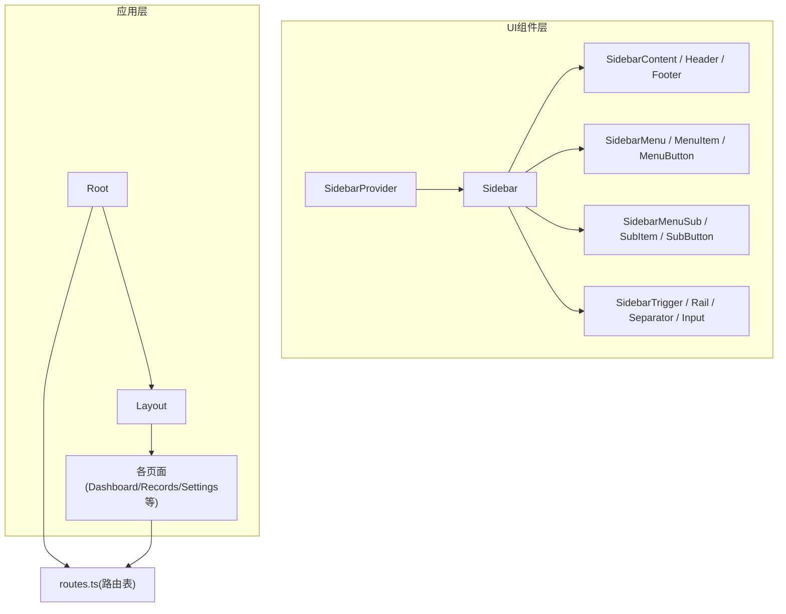
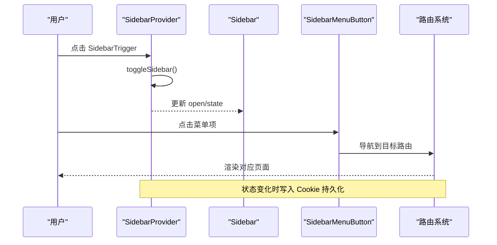
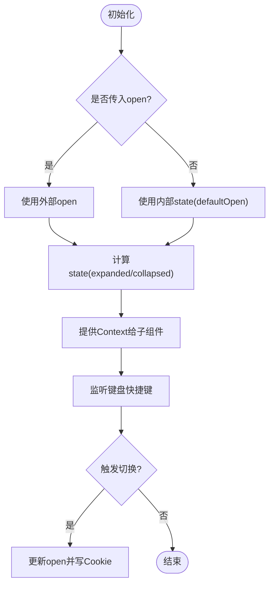
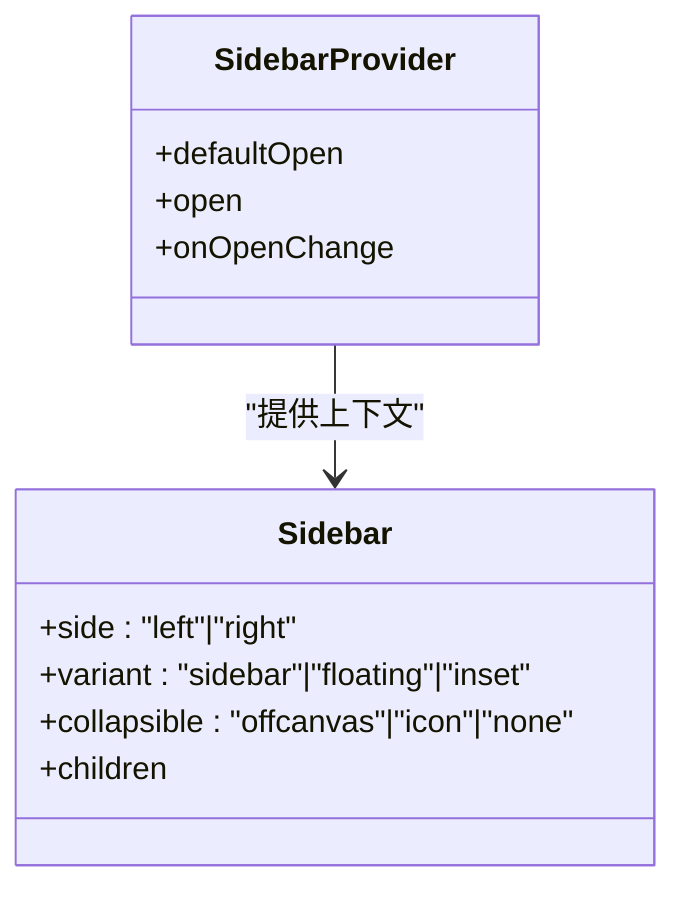
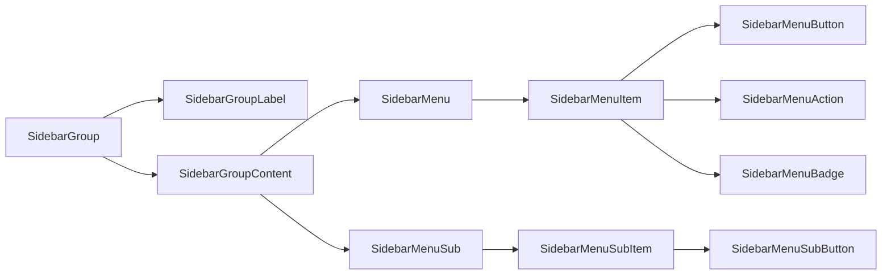
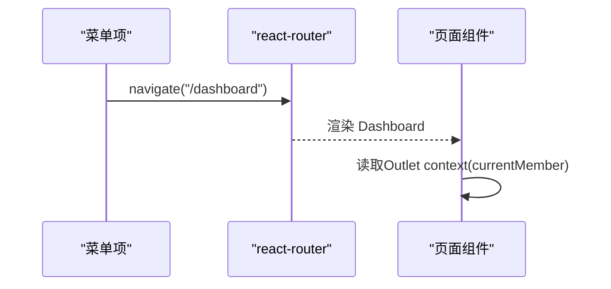
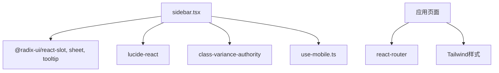

# Sidebar侧边栏组件

<cite>
**本文引用的文件**
- [sidebar.tsx](file://figma-ui/src/app/components/ui/sidebar.tsx)
- [use-mobile.ts](file://figma-ui/src/app/components/ui/use-mobile.ts)
- [routes.ts](file://figma-ui/src/app/routes.ts)
- [Root.tsx](file://figma-ui/src/app/Root.tsx)
- [Layout.tsx](file://figma-ui/src/app/components/Layout.tsx)
- [Dashboard.tsx](file://figma-ui/src/app/pages/Dashboard.tsx)
- [Records.tsx](file://figma-ui/src/app/pages/Records.tsx)
- [types.ts](file://figma-ui/src/app/types.ts)
</cite>

## 目录
1. [简介](#简介)
2. [项目结构](#项目结构)
3. [核心组件与能力](#核心组件与能力)
4. [架构总览](#架构总览)
5. [详细组件分析](#详细组件分析)
6. [依赖关系分析](#依赖关系分析)
7. [性能考量](#性能考量)
8. [故障排查指南](#故障排查指南)
9. [结论](#结论)
10. [附录：配置与使用示例](#附录配置与使用示例)

## 简介
本文件为医案通医疗档案网站的“Sidebar侧边栏组件”提供完整技术文档。该组件用于应用导航与菜单展示，支持多级菜单、折叠展开、图标显示、选中状态管理、响应式行为（桌面/移动端），以及与路由系统的集成和状态同步机制。文档同时给出在医疗业务场景下的使用建议，如档案管理导航、功能模块切换、用户设置入口等。

## 项目结构
本项目采用基于 React + Tailwind 的模块化 UI 组件体系，侧边栏相关代码集中在 UI 组件层，并通过 Context 暴露统一的状态管理能力；路由定义位于 routes.ts，页面级布局与导航入口由 Layout 与 Root 组合构成。

图表来源
- [sidebar.tsx:56-152](file://figma-ui/src/app/components/ui/sidebar.tsx#L56-L152)
- [sidebar.tsx:154-254](file://figma-ui/src/app/components/ui/sidebar.tsx#L154-L254)
- [routes.ts:25-76](file://figma-ui/src/app/routes.ts#L25-L76)
- [Root.tsx:52-56](file://figma-ui/src/app/Root.tsx#L52-L56)
- [Layout.tsx:31-144](file://figma-ui/src/app/components/Layout.tsx#L31-L144)

章节来源
- [sidebar.tsx:1-727](file://figma-ui/src/app/components/ui/sidebar.tsx#L1-L727)
- [routes.ts:1-106](file://figma-ui/src/app/routes.ts#L1-L106)
- [Root.tsx:1-59](file://figma-ui/src/app/Root.tsx#L1-L59)
- [Layout.tsx:1-251](file://figma-ui/src/app/components/Layout.tsx#L1-L251)

## 核心组件与能力
- 状态提供者：SidebarProvider 提供 open/collapsed 状态、移动端抽屉开关、键盘快捷键、Cookie 持久化等能力。
- 容器组件：Sidebar 负责在不同模式下渲染（固定侧边栏、浮动、内嵌）、响应式切换（桌面/移动）。
- 内容组织：SidebarHeader/SidebarContent/SidebarFooter/Separator 用于结构化布局。
- 分组与标签：SidebarGroup/SidebarGroupLabel/SidebarGroupAction/SidebarGroupContent 用于分组标题与操作。
- 菜单系统：SidebarMenu/SidebarMenuItem/SidebarMenuButton/SidebarMenuAction/SidebarMenuBadge 实现主菜单项、动作按钮与徽标。
- 子菜单：SidebarMenuSub/SidebarMenuSubItem/SidebarMenuSubButton 实现二级/多级菜单。
- 交互辅助：SidebarTrigger 触发开关、SidebarRail 拖拽/点击收起、SidebarInput 搜索输入、Skeleton 骨架屏。
- 工具：useIsMobile 检测移动端断点；useSidebar 获取上下文状态。

章节来源
- [sidebar.tsx:28-54](file://figma-ui/src/app/components/ui/sidebar.tsx#L28-L54)
- [sidebar.tsx:56-152](file://figma-ui/src/app/components/ui/sidebar.tsx#L56-L152)
- [sidebar.tsx:154-254](file://figma-ui/src/app/components/ui/sidebar.tsx#L154-L254)
- [sidebar.tsx:321-383](file://figma-ui/src/app/components/ui/sidebar.tsx#L321-L383)
- [sidebar.tsx:385-452](file://figma-ui/src/app/components/ui/sidebar.tsx#L385-L452)
- [sidebar.tsx:454-600](file://figma-ui/src/app/components/ui/sidebar.tsx#L454-L600)
- [sidebar.tsx:602-699](file://figma-ui/src/app/components/ui/sidebar.tsx#L602-L699)
- [use-mobile.ts:1-22](file://figma-ui/src/app/components/ui/use-mobile.ts#L1-L22)

## 架构总览
侧边栏通过 React Context 集中管理打开/折叠状态，并在桌面端以固定面板呈现，在移动端以 Drawer（Sheet）形式弹出。菜单项通过 Link 或 Button 与路由系统集成，结合 isActive 控制高亮。状态变更会写入 Cookie 以跨会话保持偏好。

图表来源
- [sidebar.tsx:91-110](file://figma-ui/src/app/components/ui/sidebar.tsx#L91-L110)
- [sidebar.tsx:256-280](file://figma-ui/src/app/components/ui/sidebar.tsx#L256-L280)
- [sidebar.tsx:498-546](file://figma-ui/src/app/components/ui/sidebar.tsx#L498-L546)
- [routes.ts:25-76](file://figma-ui/src/app/routes.ts#L25-L76)

## 详细组件分析

### SidebarProvider（状态中枢）
- 职责：维护 open/collapsed 状态、移动端抽屉开关、键盘快捷键监听、Cookie 持久化、向子树暴露 useSidebar 上下文。
- 关键点：
  - 默认宽度与图标宽度通过 CSS 变量注入，便于主题定制。
  - 支持受控与非受控两种模式（open/onOpenChange）。
  - 键盘快捷键：Ctrl/Cmd + B 切换侧边栏。
  - 移动端优先使用 Sheet 作为抽屉容器。

图表来源
- [sidebar.tsx:56-152](file://figma-ui/src/app/components/ui/sidebar.tsx#L56-L152)

章节来源
- [sidebar.tsx:56-152](file://figma-ui/src/app/components/ui/sidebar.tsx#L56-L152)

### Sidebar（容器与响应式）
- 职责：根据 collapsible 与 isMobile 决定渲染方式（固定面板/Drawer），处理 data-state/data-collapsible 等数据属性以便样式联动。
- 关键行为：
  - 桌面端：固定定位，支持 offcanvas/icon/none 三种折叠模式。
  - 移动端：使用 Sheet 作为抽屉，自动隐藏关闭按钮以提升体验。
  - 通过 CSS 变量与 Tailwind 类名驱动宽度与间距。

图表来源
- [sidebar.tsx:154-254](file://figma-ui/src/app/components/ui/sidebar.tsx#L154-L254)
- [sidebar.tsx:56-152](file://figma-ui/src/app/components/ui/sidebar.tsx#L56-L152)

章节来源
- [sidebar.tsx:154-254](file://figma-ui/src/app/components/ui/sidebar.tsx#L154-L254)

### 菜单与子菜单（多级导航）
- 主菜单：SidebarMenu/SidebarMenuItem/SidebarMenuButton 支持图标、文本、激活态、尺寸变体、Tooltip。
- 子菜单：SidebarMenuSub/SidebarMenuSubItem/SidebarMenuSubButton 支持缩进与层级样式。
- 动作与徽标：SidebarMenuAction/SidebarMenuBadge 用于附加操作与计数提示。
- 分组：SidebarGroup/SidebarGroupLabel/SidebarGroupAction/SidebarGroupContent 用于组织菜单区块。

图表来源
- [sidebar.tsx:385-452](file://figma-ui/src/app/components/ui/sidebar.tsx#L385-L452)
- [sidebar.tsx:454-600](file://figma-ui/src/app/components/ui/sidebar.tsx#L454-L600)
- [sidebar.tsx:640-699](file://figma-ui/src/app/components/ui/sidebar.tsx#L640-L699)

章节来源
- [sidebar.tsx:385-699](file://figma-ui/src/app/components/ui/sidebar.tsx#L385-L699)

### 交互辅助（触发器、轨道、分隔符、输入）
- SidebarTrigger：图标按钮，调用 toggleSidebar。
- SidebarRail：边缘条带，支持点击/悬停收起与拖拽调整（视觉反馈）。
- SidebarSeparator：分割线。
- SidebarInput：适配主题的搜索输入框。

章节来源
- [sidebar.tsx:256-333](file://figma-ui/src/app/components/ui/sidebar.tsx#L256-L333)

### 与路由系统的集成与状态同步
- 路由定义：routes.ts 定义了 dashboard、records、search、upload、share、settings、family、members 等路径，供菜单项跳转。
- 页面上下文：Root.tsx 通过 Outlet context 传递当前成员信息，页面可据此渲染个性化内容。
- 选中状态：菜单项可通过 isActive 控制高亮，结合路由当前路径进行同步（建议在业务层实现）。
- 状态持久化：SidebarProvider 将 open 状态写入 Cookie，刷新后仍保持上次选择。

图表来源
- [routes.ts:25-76](file://figma-ui/src/app/routes.ts#L25-L76)
- [Root.tsx:52-56](file://figma-ui/src/app/Root.tsx#L52-L56)
- [Dashboard.tsx:30-33](file://figma-ui/src/app/pages/Dashboard.tsx#L30-L33)

章节来源
- [routes.ts:25-76](file://figma-ui/src/app/routes.ts#L25-L76)
- [Root.tsx:1-59](file://figma-ui/src/app/Root.tsx#L1-L59)
- [Dashboard.tsx:1-204](file://figma-ui/src/app/pages/Dashboard.tsx#L1-L204)

## 依赖关系分析
- 组件内依赖：
  - Radix UI（Slot、Sheet、Tooltip）用于可访问性与弹窗/提示。
  - lucide-react 图标库用于菜单图标。
  - class-variance-authority 用于变体样式。
  - 自定义 useIsMobile 判断移动端。
- 应用层依赖：
  - react-router 提供路由与导航。
  - Tailwind 类名驱动样式与响应式。

图表来源
- [sidebar.tsx:1-27](file://figma-ui/src/app/components/ui/sidebar.tsx#L1-L27)
- [use-mobile.ts:1-22](file://figma-ui/src/app/components/ui/use-mobile.ts#L1-L22)
- [routes.ts:1-2](file://figma-ui/src/app/routes.ts#L1-L2)

章节来源
- [sidebar.tsx:1-27](file://figma-ui/src/app/components/ui/sidebar.tsx#L1-L27)
- [use-mobile.ts:1-22](file://figma-ui/src/app/components/ui/use-mobile.ts#L1-L22)
- [routes.ts:1-2](file://figma-ui/src/app/routes.ts#L1-L2)

## 性能考量
- 避免不必要的重渲染：SidebarProvider 使用 useMemo 缓存上下文值，减少子组件重渲染。
- 移动端优化：移动端使用 Sheet 抽屉，仅在需要时挂载，降低首屏开销。
- 动画与过渡：CSS 过渡与 Tailwind 类名控制，避免复杂 JS 动画带来的性能损耗。
- 图标与资源：使用轻量图标库，按需引入。

[本节为通用性能建议，不直接分析具体文件]

## 故障排查指南
- 错误：未包裹在 SidebarProvider 中使用 useSidebar
  - 现象：抛出错误提示必须在 Provider 内使用。
  - 解决：确保组件树中包含 SidebarProvider。
- 移动端无法展开/收起
  - 检查：isMobile 是否正确识别断点；Sheet 的 open 状态是否被正确绑定。
- 键盘快捷键无效
  - 检查：是否监听了 Ctrl/Cmd + B；事件是否被其他组件拦截。
- 状态未持久化
  - 检查：Cookie 写入逻辑是否执行；浏览器是否允许第三方 Cookie。

章节来源
- [sidebar.tsx:47-54](file://figma-ui/src/app/components/ui/sidebar.tsx#L47-L54)
- [sidebar.tsx:91-110](file://figma-ui/src/app/components/ui/sidebar.tsx#L91-L110)
- [sidebar.tsx:85-87](file://figma-ui/src/app/components/ui/sidebar.tsx#L85-L87)

## 结论
Sidebar 组件提供了完整的侧边栏解决方案，涵盖状态管理、响应式布局、多级菜单、交互辅助与路由集成。通过合理的配置与样式定制，可快速构建符合医疗业务场景的导航体验。建议在实际项目中结合路由与业务状态，完善选中态同步与权限控制。

[本节为总结性内容，不直接分析具体文件]

## 附录：配置与使用示例

### 配置方式
- 基本用法
  - 使用 SidebarProvider 包裹应用或局部区域，提供 defaultOpen/open/onOpenChange。
  - 使用 Sidebar 指定 side/variant/collapsible，配合 SidebarContent/Header/Footer 组织内容。
- 菜单与子菜单
  - 使用 SidebarGroup 分组，SidebarGroupLabel 标注分组名称。
  - 使用 SidebarMenu/SidebarMenuItem/SidebarMenuButton 创建主菜单项，支持图标与 Tooltip。
  - 使用 SidebarMenuSub/SidebarMenuSubItem/SidebarMenuSubButton 创建二级菜单。
- 交互辅助
  - 使用 SidebarTrigger 提供切换按钮；使用 SidebarRail 提供边缘条带；使用 SidebarSeparator 分隔区块；使用 SidebarInput 添加搜索。
- 响应式行为
  - 桌面端：固定面板，支持 offcanvas/icon/none 折叠。
  - 移动端：自动切换为 Sheet 抽屉，隐藏关闭按钮提升体验。

章节来源
- [sidebar.tsx:56-152](file://figma-ui/src/app/components/ui/sidebar.tsx#L56-L152)
- [sidebar.tsx:154-254](file://figma-ui/src/app/components/ui/sidebar.tsx#L154-L254)
- [sidebar.tsx:321-383](file://figma-ui/src/app/components/ui/sidebar.tsx#L321-L383)
- [sidebar.tsx:385-699](file://figma-ui/src/app/components/ui/sidebar.tsx#L385-L699)

### 样式定制方法
- 通过 CSS 变量覆盖宽度：--sidebar-width、--sidebar-width-icon。
- 通过 variant 切换外观：sidebar/floating/inset。
- 通过 data-state/data-collapsible 选择器控制样式（如 collapsed 时的宽度与溢出）。
- 使用 Tailwind 类名扩展颜色、阴影、圆角等。

章节来源
- [sidebar.tsx:132-149](file://figma-ui/src/app/components/ui/sidebar.tsx#L132-L149)
- [sidebar.tsx:218-251](file://figma-ui/src/app/components/ui/sidebar.tsx#L218-L251)

### 医疗业务场景使用示例
- 档案管理导航
  - 使用 SidebarGroup 分组“我的档案”、“历史指标”、“分享与协作”。
  - 菜单项链接至 /records、/records/history/:categoryId、/share 等路由。
- 功能模块切换
  - 使用 SidebarMenuButton 切换 Dashboard、OCR、Family、Members 等功能页。
  - 结合 isActive 与当前路由高亮当前模块。
- 用户设置入口
  - 在 SidebarFooter 放置“设置”入口，链接至 /settings。
  - 可加入 SidebarMenuBadge 显示通知数量。

章节来源
- [routes.ts:25-76](file://figma-ui/src/app/routes.ts#L25-L76)
- [Records.tsx:101-124](file://figma-ui/src/app/pages/Records.tsx#L101-L124)
- [Dashboard.tsx:30-33](file://figma-ui/src/app/pages/Dashboard.tsx#L30-L33)

### 与路由系统的集成与状态同步机制
- 路由集成
  - 菜单项通过 Link/Button 跳转到 routes.ts 中定义的路径。
  - 页面通过 Outlet context 获取 currentMember，实现个性化展示。
- 状态同步
  - 菜单项的 isActive 可根据当前路由计算，保持高亮一致。
  - SidebarProvider 将 open 状态写入 Cookie，刷新后保持一致。

章节来源
- [routes.ts:25-76](file://figma-ui/src/app/routes.ts#L25-L76)
- [Root.tsx:52-56](file://figma-ui/src/app/Root.tsx#L52-L56)
- [sidebar.tsx:85-87](file://figma-ui/src/app/components/ui/sidebar.tsx#L85-L87)