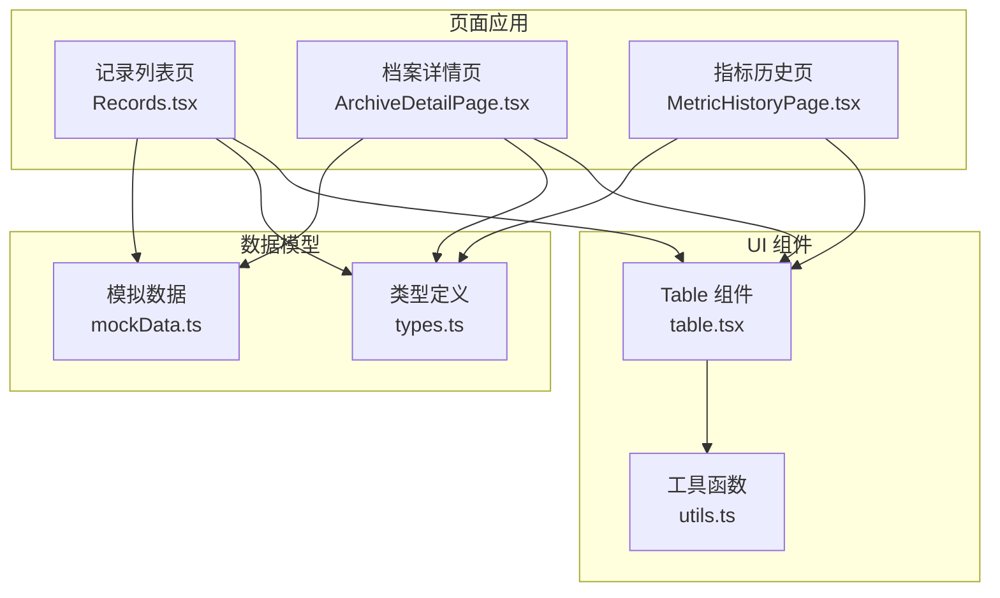
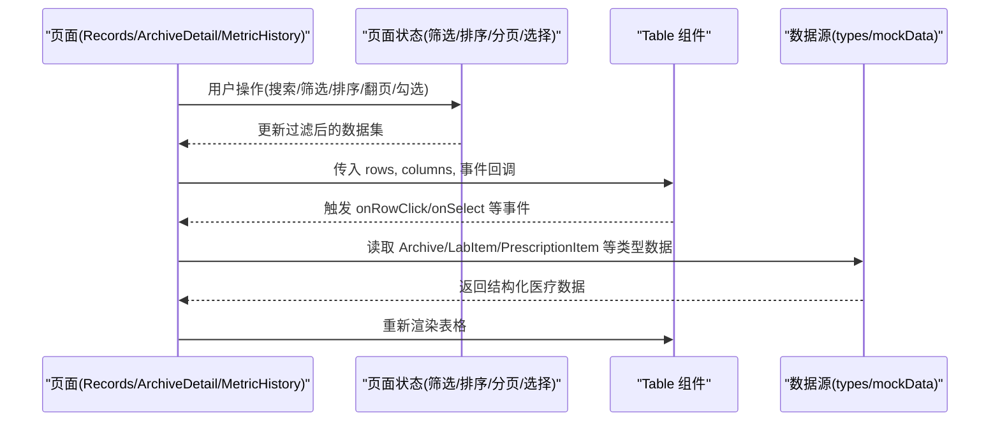
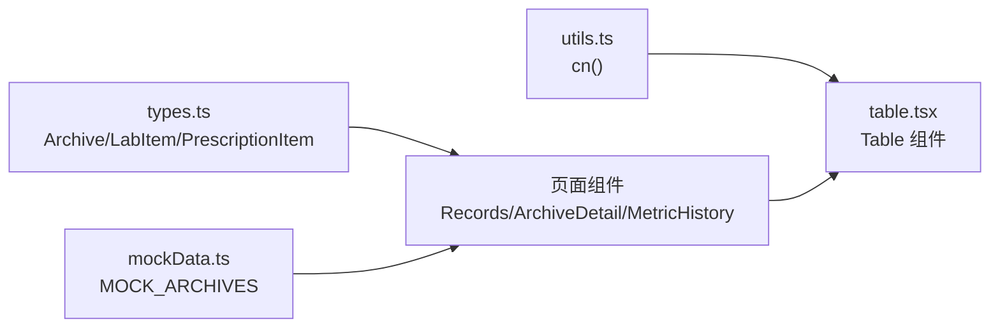

# Table表格组件

<cite>
**本文引用的文件**
- [table.tsx](file://figma-ui/src/app/components/ui/table.tsx)
- [utils.ts](file://figma-ui/src/app/components/ui/utils.ts)
- [types.ts](file://figma-ui/src/app/types.ts)
- [mockData.ts](file://figma-ui/src/app/utils/mockData.ts)
- [Records.tsx](file://figma-ui/src/app/pages/Records.tsx)
- [ArchiveDetailPage.tsx](file://figma-ui/src/app/pages/ArchiveDetailPage.tsx)
- [MetricHistoryPage.tsx](file://figma-ui/src/app/pages/MetricHistoryPage.tsx)
</cite>

## 目录
1. [简介](#简介)
2. [项目结构](#项目结构)
3. [核心组件](#核心组件)
4. [架构总览](#架构总览)
5. [详细组件分析](#详细组件分析)
6. [依赖关系分析](#依赖关系分析)
7. [性能与大数据处理](#性能与大数据处理)
8. [故障排查指南](#故障排查指南)
9. [结论](#结论)
10. [附录：医疗场景使用示例](#附录医疗场景使用示例)

## 简介
本文件为医案通医疗档案网站的 Table 表格组件提供完整文档。该组件基于 React 与 Tailwind CSS，提供基础表格结构与样式封装，适用于展示患者档案、检查报告、用药记录等医疗数据。当前仓库中的 Table 组件聚焦于“可访问性良好、样式统一、易于扩展”的基础能力；排序、筛选、分页、行选择等功能可通过上层页面组合实现。本文同时给出在医疗场景下的典型用法、数据结构定义、列配置方式、事件处理机制，以及针对大数据量的虚拟化渲染与内存优化建议。

## 项目结构
Table 组件位于 UI 组件库中，配合类型定义与模拟数据，可在多个页面复用。整体组织如下：
- UI 层：table.tsx 提供 Table 及其子组件（表头、表体、行、单元格、页脚、标题）
- 工具层：utils.ts 提供类名合并工具 cn
- 数据层：types.ts 定义医疗档案相关类型；mockData.ts 提供示例数据
- 页面层：Records.tsx、ArchiveDetailPage.tsx、MetricHistoryPage.tsx 展示了不同医疗场景的数据呈现方式

图表来源
- [table.tsx:1-117](file://figma-ui/src/app/components/ui/table.tsx#L1-L117)
- [utils.ts:1-7](file://figma-ui/src/app/components/ui/utils.ts#L1-L7)
- [types.ts:1-95](file://figma-ui/src/app/types.ts#L1-L95)
- [mockData.ts:1-98](file://figma-ui/src/app/utils/mockData.ts#L1-L98)
- [Records.tsx:1-421](file://figma-ui/src/app/pages/Records.tsx#L1-L421)
- [ArchiveDetailPage.tsx:1-356](file://figma-ui/src/app/pages/ArchiveDetailPage.tsx#L1-L356)
- [MetricHistoryPage.tsx:1-216](file://figma-ui/src/app/pages/MetricHistoryPage.tsx#L1-L216)

章节来源
- [table.tsx:1-117](file://figma-ui/src/app/components/ui/table.tsx#L1-L117)
- [utils.ts:1-7](file://figma-ui/src/app/components/ui/utils.ts#L1-L7)
- [types.ts:1-95](file://figma-ui/src/app/types.ts#L1-L95)
- [mockData.ts:1-98](file://figma-ui/src/app/utils/mockData.ts#L1-L98)

## 核心组件
Table 组件由一组语义化 HTML 元素封装的 React 组件构成，便于通过 Tailwind 进行样式定制与主题适配。

- Table：表格容器，支持横向滚动与宽度自适应
- TableHeader：表头区域
- TableBody：表体区域
- TableFooter：表尾区域（常用于统计信息或汇总）
- TableRow：表格行，支持选中态高亮
- TableHead：表头单元格
- TableCell：表格单元格
- TableCaption：表格标题说明

这些组件均透传原生属性，便于接入无障碍特性（如 role、aria-*），并通过 className 进行样式覆盖。

章节来源
- [table.tsx:7-116](file://figma-ui/src/app/components/ui/table.tsx#L7-L116)

## 架构总览
Table 组件作为纯展示层，不内置业务逻辑。业务侧通过传入数据与列配置，结合页面状态管理完成排序、筛选、分页、行选择等交互。下图展示了从页面到表格组件的数据流与交互路径。

图表来源
- [table.tsx:7-116](file://figma-ui/src/app/components/ui/table.tsx#L7-L116)
- [types.ts:11-61](file://figma-ui/src/app/types.ts#L11-L61)
- [mockData.ts:3-89](file://figma-ui/src/app/utils/mockData.ts#L3-L89)
- [Records.tsx:101-122](file://figma-ui/src/app/pages/Records.tsx#L101-L122)
- [ArchiveDetailPage.tsx:27-40](file://figma-ui/src/app/pages/ArchiveDetailPage.tsx#L27-L40)
- [MetricHistoryPage.tsx:59-63](file://figma-ui/src/app/pages/MetricHistoryPage.tsx#L59-L63)

## 详细组件分析

### 组件 API 与属性
- Table
  - 作用：表格容器，负责横向滚动与整体布局
  - 关键样式：相对定位、全宽、溢出横向滚动
  - 适用场景：所有需要表格展示的场景
- TableHeader/TableBody/TableFooter
  - 作用：分别对应 thead/tbody/tfoot 区域
  - 关键样式：边框分隔、背景色、字体权重
- TableRow
  - 作用：单行容器
  - 关键样式：悬停高亮、选中态高亮（data-[state=selected]）
  - 事件：可透传 onClick 等事件，用于行点击、选择
- TableHead/TableCell
  - 作用：表头/单元格内容容器
  - 关键样式：对齐方式、内边距、换行控制
- TableCaption
  - 作用：表格标题/说明文字

章节来源
- [table.tsx:7-116](file://figma-ui/src/app/components/ui/table.tsx#L7-L116)

### 数据结构定义
- Archive：医疗档案主数据，包含 id、memberId、type、title、hospital、department、date、uploadDate、imageUrl、ocrData、tags、isFavorite、isDeleted
- OCRData：OCR 提取结果，包含医院、科室、日期、医生、诊断、检验项 items、处方 prescription 等
- LabItem：检验项，包含 name、value、unit、referenceRange、isAbnormal
- PrescriptionItem：处方项，包含 name、dosage、frequency、duration
- ARCHIVE_TYPE_LABELS/ARCHIVE_TYPE_COLORS：档案类型标签与颜色映射

章节来源
- [types.ts:11-61](file://figma-ui/src/app/types.ts#L11-L61)
- [types.ts:74-94](file://figma-ui/src/app/types.ts#L74-L94)

### 列配置方式
由于 Table 组件是通用封装，列配置通常由页面层以“列定义数组 + 渲染函数”的方式实现：
- 列定义：字段名、显示标题、是否可排序、是否可筛选、格式化函数、渲染函数
- 渲染函数：根据数据类型（文本、数值、标签、链接、操作按钮）返回 JSX
- 示例字段：
  - 患者档案列表：姓名、性别、年龄、血型、过敏史、档案数量、操作
  - 检查报告表格：项目名称、结果值、单位、参考范围、异常标记
  - 用药记录管理：药品名称、单次用量、频次、疗程、提醒开关

提示：列配置应遵循“声明式 + 可扩展”的原则，便于后续加入虚拟滚动、固定列、冻结表头等高级功能。

### 事件处理机制
- 行级事件：onClick、onDoubleClick、onContextMenu 等，用于查看详情、编辑、删除
- 选择事件：通过自定义 state 管理选中行集合，结合 TableRow 的 data-[state=selected] 样式实现多选
- 排序事件：点击表头触发，对数据进行升序/降序切换
- 筛选事件：输入框或下拉框变化时，过滤原始数据并刷新表格
- 分页事件：改变当前页码或每页条数，计算切片数据并渲染

章节来源
- [table.tsx:55-66](file://figma-ui/src/app/components/ui/table.tsx#L55-L66)

### 医疗场景使用示例

#### 患者档案列表
- 数据来源：members 与 archives（本地存储或 mockData）
- 列配置：成员姓名、关系、性别、生日、血型、过敏史、档案数量、操作（查看/删除）
- 交互：搜索、按关系筛选、切换成员、删除成员（保护本人不可删）
- 参考实现：MembersPage 中成员卡片与操作逻辑

章节来源
- [MembersPage.tsx:6-48](file://figma-ui/src/app/pages/MembersPage.tsx#L6-L48)
- [MembersPage.tsx:78-129](file://figma-ui/src/app/pages/MembersPage.tsx#L78-L129)

#### 检查报告表格
- 数据来源：Archive.ocrData.items（LabItem[]）
- 列配置：项目名称、结果值、单位、参考范围、异常标记
- 交互：异常高亮、详情跳转、AI 指标提醒
- 参考实现：ArchiveDetailPage 中检验项目分析与异常提示

章节来源
- [ArchiveDetailPage.tsx:54-112](file://figma-ui/src/app/pages/ArchiveDetailPage.tsx#L54-L112)
- [types.ts:48-54](file://figma-ui/src/app/types.ts#L48-L54)

#### 用药记录管理
- 数据来源：Archive.ocrData.prescription（PrescriptionItem[]）
- 列配置：药品名称、单次用量、频次、疗程、智能用药提醒
- 交互：添加日程提醒、查看原件、用量核对提示
- 参考实现：ArchiveDetailPage 中处方用药清单与提醒模块

章节来源
- [ArchiveDetailPage.tsx:114-174](file://figma-ui/src/app/pages/ArchiveDetailPage.tsx#L114-L174)
- [types.ts:56-61](file://figma-ui/src/app/types.ts#L56-L61)

#### 指标趋势与追溯
- 数据来源：MetricHistoryPage 中的历史指标数据
- 可视化：折线图展示 WBC/RBC 等指标趋势，标注参考区间
- 交互：切换指标、查看原件、时间范围选择
- 参考实现：MetricHistoryPage 中折线图与指标列表

章节来源
- [MetricHistoryPage.tsx:23-57](file://figma-ui/src/app/pages/MetricHistoryPage.tsx#L23-L57)
- [MetricHistoryPage.tsx:109-143](file://figma-ui/src/app/pages/MetricHistoryPage.tsx#L109-L143)

## 依赖关系分析
- Table 组件依赖 utils.ts 的 cn 工具进行类名合并
- 页面组件依赖 types.ts 的类型定义确保数据结构一致
- mockData.ts 提供演示数据，便于快速验证与开发
- 各页面通过组合 Table 组件与自身状态管理实现复杂交互

图表来源
- [utils.ts:1-7](file://figma-ui/src/app/components/ui/utils.ts#L1-L7)
- [table.tsx:1-117](file://figma-ui/src/app/components/ui/table.tsx#L1-L117)
- [types.ts:1-95](file://figma-ui/src/app/types.ts#L1-L95)
- [mockData.ts:1-98](file://figma-ui/src/app/utils/mockData.ts#L1-L98)
- [Records.tsx:1-421](file://figma-ui/src/app/pages/Records.tsx#L1-L421)
- [ArchiveDetailPage.tsx:1-356](file://figma-ui/src/app/pages/ArchiveDetailPage.tsx#L1-L356)
- [MetricHistoryPage.tsx:1-216](file://figma-ui/src/app/pages/MetricHistoryPage.tsx#L1-L216)

章节来源
- [table.tsx:1-117](file://figma-ui/src/app/components/ui/table.tsx#L1-L117)
- [utils.ts:1-7](file://figma-ui/src/app/components/ui/utils.ts#L1-L7)
- [types.ts:1-95](file://figma-ui/src/app/types.ts#L1-L95)
- [mockData.ts:1-98](file://figma-ui/src/app/utils/mockData.ts#L1-L98)

## 性能与大数据处理
当前 Table 组件为轻量封装，未内置虚拟化渲染。面对医疗大数据量（如成千上万条检验项、长期用药记录），建议采用以下策略：

- 虚拟化渲染
  - 仅渲染可视区域内的行，减少 DOM 节点数量
  - 使用窗口化方案（如 react-window 或 tanstack-virtual）实现高效滚动
  - 行高度固定或估算，提升计算效率

- 分页与懒加载
  - 服务端分页：按页请求数据，避免一次性加载全部
  - 前端分页：对已加载数据进行切片渲染
  - 无限滚动：滚动到底部时追加数据

- 内存优化
  - 使用 key 稳定标识（id）避免不必要的重渲染
  - 缓存列配置与渲染函数，避免重复创建
  - 对大对象进行浅比较或使用 memo 包裹单元格

- 排序与筛选优化
  - 排序：优先在服务端排序；前端排序时使用索引数组避免复制
  - 筛选：防抖输入，增量过滤；建立倒排索引加速匹配
  - 复合条件：将筛选条件扁平化为查询表达式

- 渲染优化
  - 单元格内容按需渲染（图片懒加载、长文本截断）
  - 使用 React.memo 包裹单元格组件
  - 避免在渲染过程中执行昂贵计算

- 可访问性与体验
  - 保持键盘导航与屏幕阅读器支持
  - 提供加载状态、空状态、错误状态
  - 对异常指标进行视觉强调但不过度干扰

[本节为通用性能指导，不直接分析具体代码文件]

## 故障排查指南
- 表格空白或无数据
  - 检查数据源是否正确注入（localStorage 或 mockData）
  - 确认列配置与数据结构字段一致
  - 参考：ArchiveDetailPage 中对 localStorage 与 mockData 的回退逻辑

- 行选择无效
  - 确认使用了稳定的 key（id）
  - 检查选中态样式与 data-[state=selected] 的使用
  - 参考：TableRow 的选中态样式

- 排序/筛选失效
  - 检查事件绑定与状态更新
  - 确认过滤逻辑与搜索词大小写处理
  - 参考：Records.tsx 中的分类与搜索过滤

- 移动端滚动异常
  - 确认 Table 容器的 overflow-x 设置
  - 检查外层布局是否限制宽度

章节来源
- [ArchiveDetailPage.tsx:32-40](file://figma-ui/src/app/pages/ArchiveDetailPage.tsx#L32-L40)
- [table.tsx:55-66](file://figma-ui/src/app/components/ui/table.tsx#L55-L66)
- [Records.tsx:113-122](file://figma-ui/src/app/pages/Records.tsx#L113-L122)
- [table.tsx:7-19](file://figma-ui/src/app/components/ui/table.tsx#L7-L19)

## 结论
Table 组件提供了稳定、可访问、易扩展的基础表格能力，适合在医疗档案场景中承载患者档案、检查报告、用药记录等数据的展示与交互。通过页面层的列配置、状态管理与事件处理，可实现排序、筛选、分页、行选择等常见功能。对于大数据量场景，建议引入虚拟化渲染与服务端分页，并结合内存优化策略保障性能与用户体验。

[本节为总结性内容，不直接分析具体代码文件]

## 附录：医疗场景使用示例

### 患者档案列表
- 目标：展示家庭成员及其档案数量，支持添加、删除、切换成员
- 数据：Member[]、Archive[]
- 列配置：姓名、关系、性别、生日、血型、过敏史、档案数量、操作
- 交互：添加成员表单、删除确认、切换成员后跳转首页
- 参考实现：MembersPage 的成员列表与表单

章节来源
- [MembersPage.tsx:6-48](file://figma-ui/src/app/pages/MembersPage.tsx#L6-L48)
- [MembersPage.tsx:155-294](file://figma-ui/src/app/pages/MembersPage.tsx#L155-L294)

### 检查报告表格
- 目标：展示检验项目明细，突出异常指标
- 数据：OCRData.items（LabItem[]）
- 列配置：项目名称、结果值、单位、参考范围、异常标记
- 交互：异常高亮、AI 指标提醒、详情跳转
- 参考实现：ArchiveDetailPage 的检验项目分析与提醒

章节来源
- [ArchiveDetailPage.tsx:54-112](file://figma-ui/src/app/pages/ArchiveDetailPage.tsx#L54-L112)
- [types.ts:48-54](file://figma-ui/src/app/types.ts#L48-L54)

### 用药记录管理
- 目标：展示处方用药清单，提供智能提醒
- 数据：OCRData.prescription（PrescriptionItem[]）
- 列配置：药品名称、单次用量、频次、疗程、提醒开关
- 交互：添加到日程、查看原件、用量核对提示
- 参考实现：ArchiveDetailPage 的处方用药清单与提醒模块

章节来源
- [ArchiveDetailPage.tsx:114-174](file://figma-ui/src/app/pages/ArchiveDetailPage.tsx#L114-L174)
- [types.ts:56-61](file://figma-ui/src/app/types.ts#L56-L61)

### 指标趋势与追溯
- 目标：展示历史指标趋势，辅助医生与患者理解病情变化
- 数据：MetricHistoryPage 的历史指标数据
- 可视化：折线图、参考区间线、时间轴
- 交互：切换指标、查看原件、时间范围选择
- 参考实现：MetricHistoryPage 的折线图与指标列表

章节来源
- [MetricHistoryPage.tsx:23-57](file://figma-ui/src/app/pages/MetricHistoryPage.tsx#L23-L57)
- [MetricHistoryPage.tsx:109-143](file://figma-ui/src/app/pages/MetricHistoryPage.tsx#L109-L143)