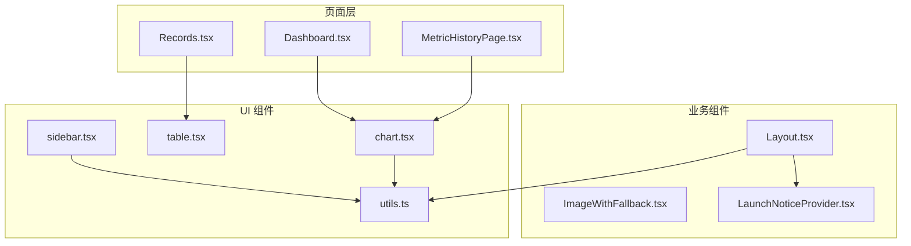
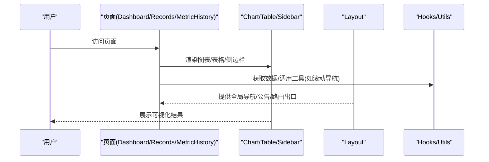
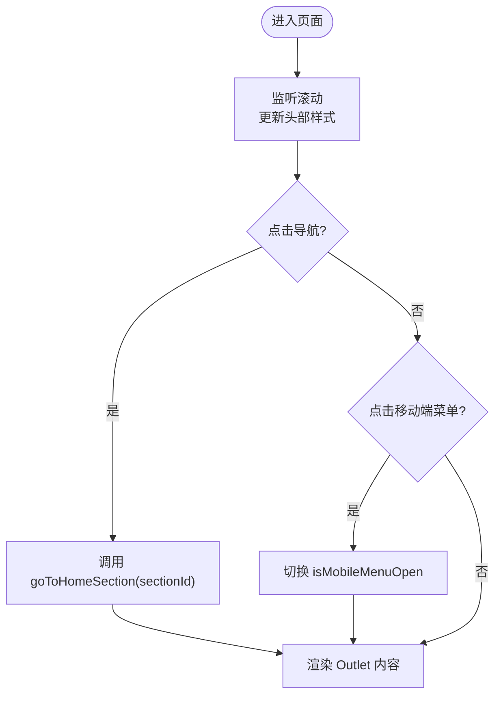
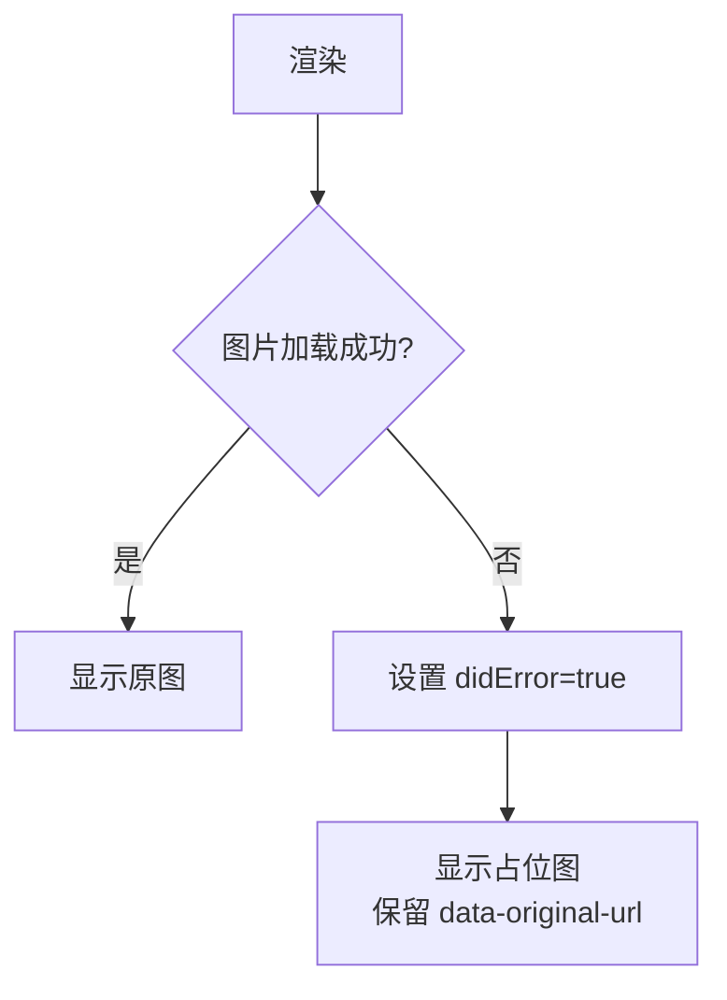
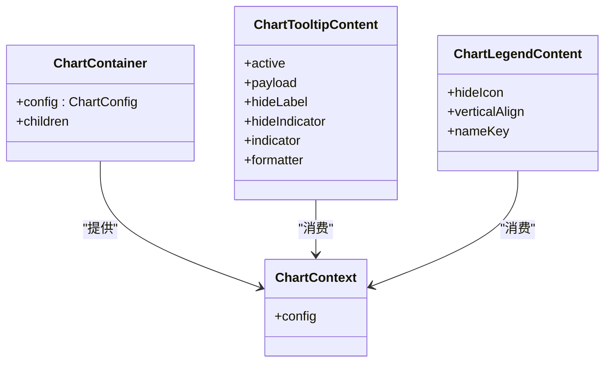
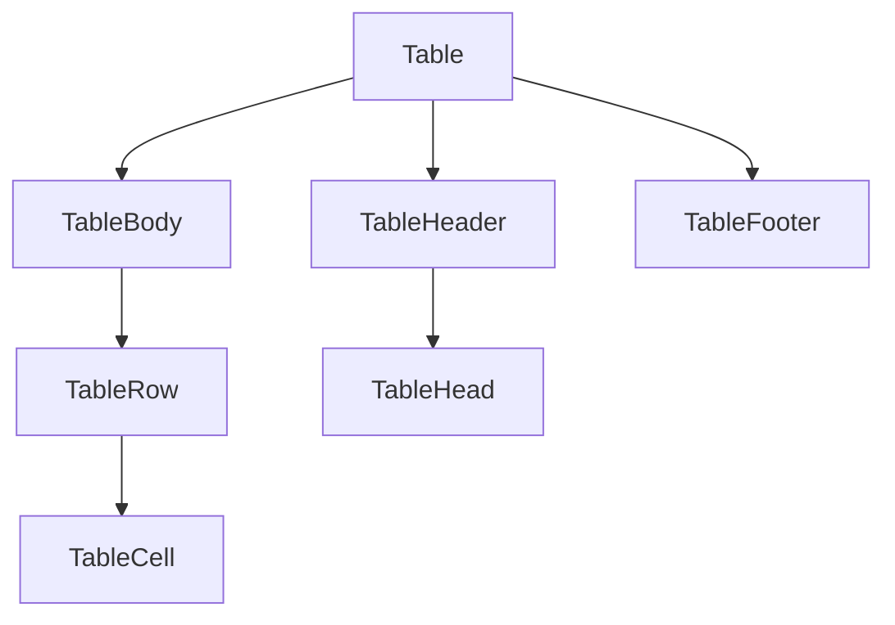
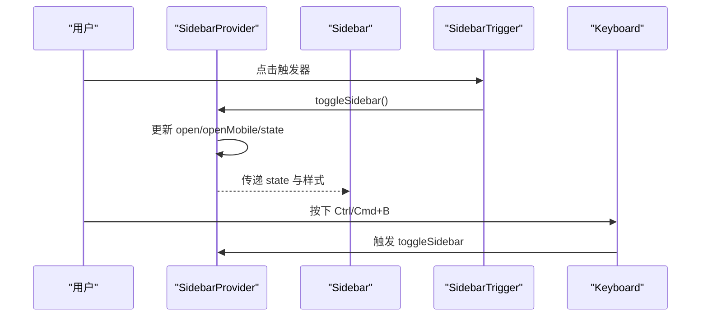
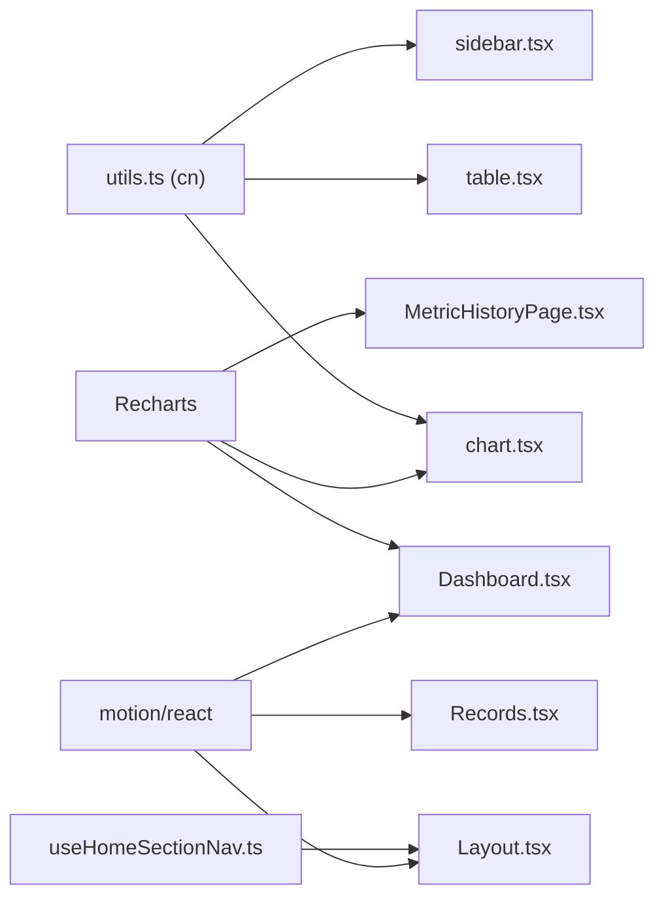

# 业务组件库

<cite>
**本文引用的文件**
- [Layout.tsx](file://figma-ui/src/app/components/Layout.tsx)
- [ImageWithFallback.tsx](file://figma-ui/src/app/components/figma/ImageWithFallback.tsx)
- [chart.tsx](file://figma-ui/src/app/components/ui/chart.tsx)
- [table.tsx](file://figma-ui/src/app/components/ui/table.tsx)
- [sidebar.tsx](file://figma-ui/src/app/components/ui/sidebar.tsx)
- [utils.ts](file://figma-ui/src/app/components/ui/utils.ts)
- [useHomeSectionNav.ts](file://figma-ui/src/app/hooks/useHomeSectionNav.ts)
- [LaunchNoticeProvider.tsx](file://figma-ui/src/app/components/LaunchNoticeProvider.tsx)
- [Dashboard.tsx](file://figma-ui/src/app/pages/Dashboard.tsx)
- [Records.tsx](file://figma-ui/src/app/pages/Records.tsx)
- [MetricHistoryPage.tsx](file://figma-ui/src/app/pages/MetricHistoryPage.tsx)
- [mockData.ts](file://figma-ui/src/app/utils/mockData.ts)
</cite>

## 目录
1. [简介](#简介)
2. [项目结构](#项目结构)
3. [核心组件](#核心组件)
4. [架构总览](#架构总览)
5. [详细组件分析](#详细组件分析)
6. [依赖关系分析](#依赖关系分析)
7. [性能考虑](#性能考虑)
8. [故障排查指南](#故障排查指南)
9. [结论](#结论)
10. [附录：医疗场景使用示例](#附录医疗场景使用示例)

## 简介
本文件为医案通医疗档案网站的“业务组件库”文档，聚焦面向医疗档案管理业务的专用组件与页面级集成。内容覆盖布局组件、图片容错组件、图表组件、表格组件、侧边栏组件等，详细说明其功能特性、数据绑定方式、事件处理与状态管理，并结合健康指标展示、医疗档案管理等真实场景给出使用建议与扩展机制说明。

## 项目结构
本项目采用按“功能域 + UI 原子组件”的组织方式：
- 业务页面位于 pages 目录（如 Dashboard、Records、MetricHistoryPage）
- 通用 UI 组件位于 components/ui（如 chart、table、sidebar）
- 业务级布局与上下文在 components 下（如 Layout、LaunchNoticeProvider）
- 工具与钩子在 hooks 与 utils 中（如 useHomeSectionNav、cn 工具函数）

图表来源
- [Dashboard.tsx:1-204](file://figma-ui/src/app/pages/Dashboard.tsx#L1-L204)
- [MetricHistoryPage.tsx:1-216](file://figma-ui/src/app/pages/MetricHistoryPage.tsx#L1-L216)
- [Records.tsx:1-421](file://figma-ui/src/app/pages/Records.tsx#L1-L421)
- [Layout.tsx:1-251](file://figma-ui/src/app/components/Layout.tsx#L1-L251)
- [chart.tsx:1-354](file://figma-ui/src/app/components/ui/chart.tsx#L1-L354)
- [table.tsx:1-117](file://figma-ui/src/app/components/ui/table.tsx#L1-L117)
- [sidebar.tsx:1-727](file://figma-ui/src/app/components/ui/sidebar.tsx#L1-L727)
- [utils.ts:1-7](file://figma-ui/src/app/components/ui/utils.ts#L1-L7)

章节来源
- [Layout.tsx:1-251](file://figma-ui/src/app/components/Layout.tsx#L1-L251)
- [chart.tsx:1-354](file://figma-ui/src/app/components/ui/chart.tsx#L1-L354)
- [table.tsx:1-117](file://figma-ui/src/app/components/ui/table.tsx#L1-L117)
- [sidebar.tsx:1-727](file://figma-ui/src/app/components/ui/sidebar.tsx#L1-L727)

## 核心组件
- Layout 布局组件：提供全局头部导航、移动端菜单、页脚与路由出口；集成滚动监听、公告弹窗与首页锚点跳转。
- ImageWithFallback 图片组件：当图片加载失败时自动降级为占位图，并保留原始地址以便重试或调试。
- Chart 图表组件：基于 Recharts 封装的容器、提示框、图例与主题样式注入，支持多主题颜色配置与响应式尺寸。
- Table 表格组件：提供表头、表体、行、单元格、标题等语义化子组件，适配横向滚动与选中态样式。
- Sidebar 侧边栏组件：提供展开/折叠、移动端抽屉模式、快捷键切换、分组菜单与骨架屏等能力。

章节来源
- [Layout.tsx:10-144](file://figma-ui/src/app/components/Layout.tsx#L10-L144)
- [ImageWithFallback.tsx:1-28](file://figma-ui/src/app/components/figma/ImageWithFallback.tsx#L1-L28)
- [chart.tsx:25-103](file://figma-ui/src/app/components/ui/chart.tsx#L25-L103)
- [table.tsx:7-117](file://figma-ui/src/app/components/ui/table.tsx#L7-L117)
- [sidebar.tsx:56-152](file://figma-ui/src/app/components/ui/sidebar.tsx#L56-L152)

## 架构总览
整体采用“页面组合业务组件 + 复用 UI 原子组件”的分层架构：
- 页面层负责数据聚合与交互编排（如 Dashboard 的健康指标趋势、Records 的档案列表与筛选、MetricHistoryPage 的指标追溯）
- 业务组件层提供跨页面可复用的结构与行为（如 Layout 的全局导航与公告、Sidebar 的导航组织）
- UI 组件层提供无业务耦合的可视化控件（Chart、Table、Button、Input 等）
- 工具与上下文层提供横切能力（如 cn 样式合并、useHomeSectionNav 滚动导航、LaunchNoticeProvider 公告弹窗）

图表来源
- [Dashboard.tsx:1-204](file://figma-ui/src/app/pages/Dashboard.tsx#L1-L204)
- [Records.tsx:1-421](file://figma-ui/src/app/pages/Records.tsx#L1-L421)
- [MetricHistoryPage.tsx:1-216](file://figma-ui/src/app/pages/MetricHistoryPage.tsx#L1-L216)
- [Layout.tsx:10-144](file://figma-ui/src/app/components/Layout.tsx#L10-L144)
- [useHomeSectionNav.ts:1-26](file://figma-ui/src/app/hooks/useHomeSectionNav.ts#L1-L26)

## 详细组件分析

### Layout 布局组件
- 功能特性
  - 固定头部：滚动时背景模糊与阴影变化
  - 桌面/移动端导航：点击导航项通过 useHomeSectionNav 平滑滚动到指定区块
  - 公告弹窗：通过 LaunchNoticeProvider 暴露 showLaunchNotice/showPartnerNotice
  - 路由出口：使用 Outlet 承载页面内容
  - 页脚：产品与服务、支持与联系、备案信息
- 数据绑定与状态
  - isScrolled：监听 window.scrollY 控制头部样式
  - isMobileMenuOpen：控制移动端菜单显隐
  - navLinks：静态导航项，映射到 sectionId
- 事件处理
  - scroll 事件更新头部样式
  - 导航按钮点击触发 goToHomeSection
  - 移动端菜单开关切换
- 与业务逻辑集成
  - 与 LaunchNoticeProvider 协作显示合作/体验弹窗
  - 与 useHomeSectionNav 协作实现首页内锚点滚动
- 扩展机制
  - 新增导航项只需扩展 navLinks
  - 可通过替换 AppIconSvg 与文案进行品牌定制

图表来源
- [Layout.tsx:16-22](file://figma-ui/src/app/components/Layout.tsx#L16-L22)
- [Layout.tsx:24-63](file://figma-ui/src/app/components/Layout.tsx#L24-L63)
- [Layout.tsx:79-139](file://figma-ui/src/app/components/Layout.tsx#L79-L139)
- [useHomeSectionNav.ts:8-25](file://figma-ui/src/app/hooks/useHomeSectionNav.ts#L8-L25)

章节来源
- [Layout.tsx:10-144](file://figma-ui/src/app/components/Layout.tsx#L10-L144)
- [useHomeSectionNav.ts:1-26](file://figma-ui/src/app/hooks/useHomeSectionNav.ts#L1-L26)
- [LaunchNoticeProvider.tsx:52-118](file://figma-ui/src/app/components/LaunchNoticeProvider.tsx#L52-L118)

### ImageWithFallback 图片组件
- 功能特性
  - 默认渲染 img，捕获 onError 将 didError 置为 true
  - 错误态渲染内置 SVG 占位图，保留 data-original-url 便于调试
- 数据绑定与状态
  - didError：本地状态标记是否发生加载错误
  - props：透传 src、alt、style、className 等原生属性
- 事件处理
  - onError：切换至错误态
- 医疗场景用法
  - 用于医院 Logo、报告缩略图等可能失败的图片资源，提升鲁棒性
- 扩展机制
  - 可自定义 ERROR_IMG_SRC 以匹配品牌风格
  - 可在父组件根据 data-original-url 实现重试逻辑

图表来源
- [ImageWithFallback.tsx:6-27](file://figma-ui/src/app/components/figma/ImageWithFallback.tsx#L6-L27)

章节来源
- [ImageWithFallback.tsx:1-28](file://figma-ui/src/app/components/figma/ImageWithFallback.tsx#L1-L28)

### Chart 图表组件
- 功能特性
  - ChartContainer：提供 Context 注入 config，包裹 ResponsiveContainer，动态注入主题 CSS 变量
  - ChartTooltipContent：统一 Tooltip 样式，支持 hideLabel/hideIndicator/indicator 类型、formatter、nameKey/labelKey
  - ChartLegendContent：统一图例样式，支持 icon 与 label
  - getPayloadConfigFromPayload：从 payload 推导配置键，支持嵌套 payload
- 数据绑定与状态
  - config：定义每个数据系列的 label、icon、color/theme
  - 通过 Context 在子组件间共享配置
- 事件处理
  - Tooltip 交互由 Recharts 内部驱动，外部通过 formatter 定制
- 医疗场景用法
  - 健康指标趋势（血压、血糖）、检验指标历史（白细胞计数等）
- 扩展机制
  - 通过 config 扩展主题色与图标
  - 通过自定义 Tooltip/Legend 内容满足复杂展示需求

图表来源
- [chart.tsx:25-103](file://figma-ui/src/app/components/ui/chart.tsx#L25-L103)
- [chart.tsx:107-249](file://figma-ui/src/app/components/ui/chart.tsx#L107-L249)
- [chart.tsx:253-305](file://figma-ui/src/app/components/ui/chart.tsx#L253-L305)
- [chart.tsx:307-344](file://figma-ui/src/app/components/ui/chart.tsx#L307-L344)

章节来源
- [chart.tsx:1-354](file://figma-ui/src/app/components/ui/chart.tsx#L1-L354)

### Table 表格组件
- 功能特性
  - 提供 Table、TableHeader、TableBody、TableFooter、TableRow、TableHead、TableCell、TableCaption
  - 支持横向滚动、行 hover 高亮、选中态样式
- 数据绑定与状态
  - 通过 children 组合构建表格结构
  - 通过 className 与 data-slot 进行样式定位
- 事件处理
  - 无内置事件，交由上层业务组件处理行点击、选择等
- 医疗场景用法
  - 医疗档案列表、检验指标明细表、处方记录表
- 扩展机制
  - 结合 Checkbox 实现多选
  - 结合 Pagination 实现分页
  - 结合 Sort/Filter 实现排序与筛选

图表来源
- [table.tsx:7-117](file://figma-ui/src/app/components/ui/table.tsx#L7-L117)

章节来源
- [table.tsx:1-117](file://figma-ui/src/app/components/ui/table.tsx#L1-L117)

### Sidebar 侧边栏组件
- 功能特性
  - 提供 SidebarProvider/Sidebar/SidebarTrigger/SidebarRail 等完整生态
  - 支持 offcanvas/icon/none 三种折叠模式，floating/inset/sidebar 三种变体
  - 移动端自动切换为 Sheet 抽屉模式
  - 键盘快捷键（Ctrl/Cmd+B）切换
  - 提供菜单组、标签、动作、徽章、骨架屏等丰富子组件
- 数据绑定与状态
  - open/openMobile/state 由 Provider 管理，支持受控与非受控
  - 持久化：打开状态写入 Cookie 保持刷新后一致
- 事件处理
  - toggleSidebar：统一切换入口
  - 菜单按钮点击、轨道拖拽调整宽度（视觉类）
- 医疗场景用法
  - 左侧导航：档案分类、指标追溯、成员管理、设置
- 扩展机制
  - 通过 SidebarGroup/SidebarMenu 组合任意菜单结构
  - 通过 SidebarMenuBadge/SidebarMenuAction 增强交互

图表来源
- [sidebar.tsx:56-152](file://figma-ui/src/app/components/ui/sidebar.tsx#L56-L152)
- [sidebar.tsx:154-254](file://figma-ui/src/app/components/ui/sidebar.tsx#L154-L254)
- [sidebar.tsx:256-305](file://figma-ui/src/app/components/ui/sidebar.tsx#L256-L305)

章节来源
- [sidebar.tsx:1-727](file://figma-ui/src/app/components/ui/sidebar.tsx#L1-L727)

## 依赖关系分析
- 样式工具
  - cn：基于 clsx 与 tailwind-merge 的类名合并工具，被 chart、table、sidebar 广泛使用
- 路由与导航
  - useHomeSectionNav：在 Layout 中用于首页锚点滚动，避免 hash 冲突
- 第三方库
  - Recharts：图表渲染（Dashboard、MetricHistoryPage 直接使用，chart.tsx 封装）
  - motion/react：动画与过渡（Layout 移动端菜单、Dashboard/Records 卡片动效）
  - lucide-react：图标（各页面与组件）
  - @radix-ui/react-slot：侧边栏按钮插槽

图表来源
- [utils.ts:1-7](file://figma-ui/src/app/components/ui/utils.ts#L1-L7)
- [chart.tsx:1-103](file://figma-ui/src/app/components/ui/chart.tsx#L1-L103)
- [table.tsx:1-117](file://figma-ui/src/app/components/ui/table.tsx#L1-L117)
- [sidebar.tsx:1-152](file://figma-ui/src/app/components/ui/sidebar.tsx#L1-L152)
- [useHomeSectionNav.ts:1-26](file://figma-ui/src/app/hooks/useHomeSectionNav.ts#L1-L26)
- [Dashboard.tsx:1-204](file://figma-ui/src/app/pages/Dashboard.tsx#L1-L204)
- [MetricHistoryPage.tsx:1-216](file://figma-ui/src/app/pages/MetricHistoryPage.tsx#L1-L216)
- [Records.tsx:1-421](file://figma-ui/src/app/pages/Records.tsx#L1-L421)

章节来源
- [utils.ts:1-7](file://figma-ui/src/app/components/ui/utils.ts#L1-L7)
- [useHomeSectionNav.ts:1-26](file://figma-ui/src/app/hooks/useHomeSectionNav.ts#L1-L26)

## 性能考虑
- 图表渲染
  - 使用 ResponsiveContainer 自适应尺寸，避免重复计算
  - 合理拆分数据系列，减少 tooltip/legend 渲染开销
  - 对大数据集考虑分页或采样展示
- 列表与表格
  - 大列表建议使用虚拟滚动或分页
  - 行操作尽量延迟到点击时再请求详情
- 图片加载
  - 使用 ImageWithFallback 降低失败影响
  - 对大图进行懒加载与压缩
- 动画与过渡
  - 合理使用 motion 的入场/退出动画，避免过度重绘
- 状态管理
  - 局部状态优先，必要时使用 Context 或状态库
  - 避免在高频事件中创建新对象

[本节为通用指导，不直接分析具体文件]

## 故障排查指南
- 图表异常
  - 检查 ChartContainer 的 config 是否正确传入
  - 确认数据字段与 dataKey/nameKey 一致
  - 若 Tooltip 不显示，检查 active/payload 是否为空
- 表格错位
  - 确保外层容器允许横向滚动
  - 列宽过宽时使用 truncate 或固定宽度
- 侧边栏状态不同步
  - 检查是否在 SidebarProvider 内部使用
  - 确认移动端/桌面端状态分别维护
- 图片加载失败
  - 检查 src 路径与网络可达性
  - 利用 data-original-url 定位原始地址
- 滚动导航无效
  - 确认目标元素存在且 id 正确
  - 在非首页时通过 navigate(state) 跳转后再滚动

章节来源
- [chart.tsx:27-35](file://figma-ui/src/app/components/ui/chart.tsx#L27-L35)
- [table.tsx:7-19](file://figma-ui/src/app/components/ui/table.tsx#L7-L19)
- [sidebar.tsx:47-54](file://figma-ui/src/app/components/ui/sidebar.tsx#L47-L54)
- [ImageWithFallback.tsx:9-11](file://figma-ui/src/app/components/figma/ImageWithFallback.tsx#L9-L11)
- [useHomeSectionNav.ts:13-22](file://figma-ui/src/app/hooks/useHomeSectionNav.ts#L13-L22)

## 结论
本业务组件库围绕医疗档案管理的核心场景，提供了稳定、可扩展的布局、图片、图表、表格与侧边栏组件。通过统一的样式工具与上下文机制，实现了跨页面的复用与一致性。结合 Dashboard、Records、MetricHistoryPage 等页面，形成了完整的健康指标展示与档案管理能力。建议在后续迭代中继续完善数据接入、权限控制与无障碍支持，以提升用户体验与可维护性。

[本节为总结，不直接分析具体文件]

## 附录：医疗场景使用示例

### 健康指标图表展示（Dashboard）
- 使用 Recharts 的 AreaChart/LineChart 展示血压、血糖等趋势
- 通过 ResponsiveContainer 保证移动端适配
- 结合 Tooltip 展示具体数值与时间
- 数据来源可使用 mockData 或后端接口

章节来源
- [Dashboard.tsx:58-142](file://figma-ui/src/app/pages/Dashboard.tsx#L58-L142)

### 医疗档案表格管理（Records）
- 使用卡片列表展示最近归档，支持分类筛选与搜索
- 可替换为 Table 组件实现更复杂的行列展示与操作
- 结合 AI 摘要与标签，提高可读性与检索效率
- 数据来源可使用 MOCK_RECORDS 或后端接口

章节来源
- [Records.tsx:101-421](file://figma-ui/src/app/pages/Records.tsx#L101-L421)

### 指标追溯与趋势（MetricHistoryPage）
- 使用 LineChart 展示某指标的历史趋势，叠加参考区间线
- 自定义 Tooltip 展示医院信息与当前值
- 通过按钮切换不同指标，联动图表与列表高亮
- 数据来源可使用 METRIC_DATA 或后端接口

章节来源
- [MetricHistoryPage.tsx:80-153](file://figma-ui/src/app/pages/MetricHistoryPage.tsx#L80-L153)
- [MetricHistoryPage.tsx:156-216](file://figma-ui/src/app/pages/MetricHistoryPage.tsx#L156-L216)

### 数据模型与样例（mockData）
- MOCK_ARCHIVES 提供多种类型的医疗档案样例（化验单、病历、处方、影像、体检）
- 可用于初始化本地存储或演示数据填充
- 建议在实际项目中替换为 API 返回的数据结构

章节来源
- [mockData.ts:1-98](file://figma-ui/src/app/utils/mockData.ts#L1-L98)