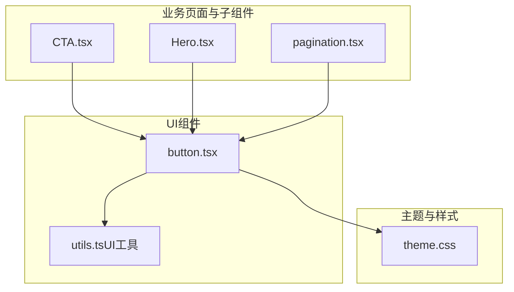
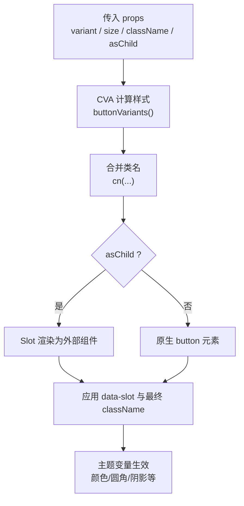
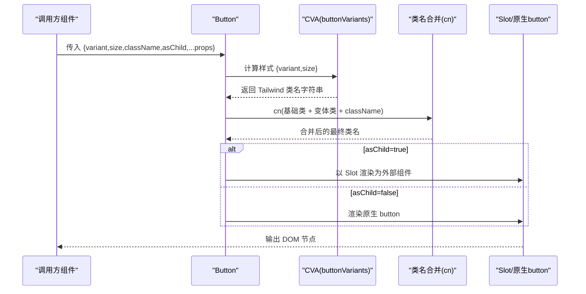
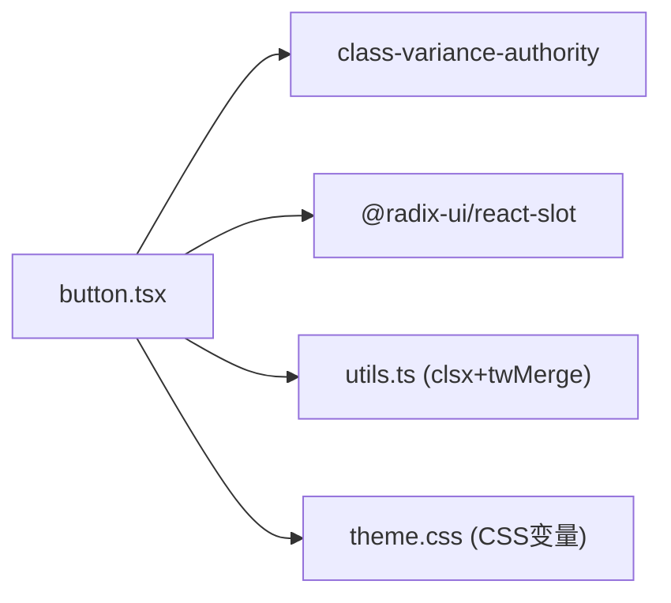

# Button按钮组件

<cite>
**本文引用的文件**
- [button.tsx](file://figma-ui/src/app/components/ui/button.tsx)
- [utils.ts（UI工具）](file://figma-ui/src/app/components/ui/utils.ts)
- [theme.css](file://figma-ui/src/styles/theme.css)
- [CTA.tsx](file://figma-ui/src/app/pages/Home/CTA.tsx)
- [Hero.tsx](file://figma-ui/src/app/pages/Home/Hero.tsx)
- [pagination.tsx](file://figma-ui/src/app/components/ui/pagination.tsx)
</cite>

## 目录
1. [简介](#简介)
2. [项目结构](#项目结构)
3. [核心组件](#核心组件)
4. [架构总览](#架构总览)
5. [详细组件分析](#详细组件分析)
6. [依赖关系分析](#依赖关系分析)
7. [性能与可访问性](#性能与可访问性)
8. [故障排查指南](#故障排查指南)
9. [结论](#结论)
10. [附录：使用示例与主题定制](#附录使用示例与主题定制)

## 简介
本组件文档面向医案通医疗档案网站的Button按钮组件。该组件基于 class-variance-authority（CVA）构建，提供多套预设变体与尺寸规格，支持 asChild 透传渲染、完整的焦点与键盘交互样式、以及通过 CSS 变量驱动的主题定制能力。本文档将系统说明其接口、变体、尺寸、可访问性、扩展方式与主题定制方法，并给出实际页面中的使用参考路径。

## 项目结构
Button 组件位于 UI 组件库中，配合统一的工具函数与主题变量，被多个页面与子组件复用。

图表来源
- [button.tsx:1-59](file://figma-ui/src/app/components/ui/button.tsx#L1-L59)
- [utils.ts（UI工具）:1-7](file://figma-ui/src/app/components/ui/utils.ts#L1-L7)
- [theme.css:1-218](file://figma-ui/src/styles/theme.css#L1-L218)
- [CTA.tsx:1-58](file://figma-ui/src/app/pages/Home/CTA.tsx#L1-L58)
- [Hero.tsx:1-107](file://figma-ui/src/app/pages/Home/Hero.tsx#L1-L107)
- [pagination.tsx:1-128](file://figma-ui/src/app/components/ui/pagination.tsx#L1-L128)

章节来源
- [button.tsx:1-59](file://figma-ui/src/app/components/ui/button.tsx#L1-L59)
- [theme.css:1-218](file://figma-ui/src/styles/theme.css#L1-L218)

## 核心组件
- 组件名：Button
- 技术基础：class-variance-authority（CVA）用于变体管理；Radix Slot 用于 asChild 透传；clsx + tailwind-merge 合并类名。
- 主要职责：统一按钮外观与交互状态（默认、禁用、焦点、无效等），并通过主题变量实现全局风格一致。

章节来源
- [button.tsx:1-59](file://figma-ui/src/app/components/ui/button.tsx#L1-L59)
- [utils.ts（UI工具）:1-7](file://figma-ui/src/app/components/ui/utils.ts#L1-L7)

## 架构总览
Button 组件由“样式变体 + 尺寸 + 透传渲染”三部分构成，结合主题变量完成最终渲染。

图表来源
- [button.tsx:7-55](file://figma-ui/src/app/components/ui/button.tsx#L7-L55)
- [theme.css:95-140](file://figma-ui/src/styles/theme.css#L95-L140)

## 详细组件分析

### 组件接口（Props）
- variant：控制视觉变体，可选值包括 default、destructive、outline、secondary、ghost、link。
- size：控制尺寸，可选值包括 default、sm、lg、icon。
- asChild：布尔值，为 true 时通过 Radix Slot 将 Button 的样式与属性透传到父级组件（如自定义链接或第三方按钮）。
- className：附加类名，用于覆盖或增强样式。
- 其他：继承原生 button 的所有属性（如 type、onClick、disabled、aria-* 等）。

章节来源
- [button.tsx:37-55](file://figma-ui/src/app/components/ui/button.tsx#L37-L55)

### 预设变体（variants）
- default：主色背景与前景，悬停加深。
- destructive：破坏性操作（如删除），含深色模式适配与焦点环。
- outline：描边风格，悬停高亮背景。
- secondary：次要操作，半透明悬停效果。
- ghost：无背景，仅悬停高亮。
- link：文本链接样式，带下划线与悬停下划线。

章节来源
- [button.tsx:7-35](file://figma-ui/src/app/components/ui/button.tsx#L7-L35)

### 尺寸规格（sizes）
- default：标准高度与内边距，包含图标场景优化。
- sm：更紧凑的尺寸，适合行内小控件。
- lg：更大高度与内边距，强调主操作。
- icon：方形图标按钮，固定宽高。

章节来源
- [button.tsx:23-28](file://figma-ui/src/app/components/ui/button.tsx#L23-L28)

### 可访问性与焦点状态
- 焦点可见：focus-visible 状态下显示环形边框与彩色聚焦环，确保键盘导航可见。
- 无效状态：aria-invalid 时采用破坏性色彩作为焦点环与边框，提示输入错误。
- 禁用态：disabled 时禁止指针事件并降低不透明度。
- 语义化：当 asChild 为 false 时渲染原生 button，具备默认的可访问性语义；为 true 时由外层组件承担语义责任。

章节来源
- [button.tsx:8-8](file://figma-ui/src/app/components/ui/button.tsx#L8-L8)

### 数据流与渲染流程

图表来源
- [button.tsx:7-55](file://figma-ui/src/app/components/ui/button.tsx#L7-L55)

### 在业务中的使用示例（参考路径）
- 首页主区域（Hero）：展示大尺寸主按钮与描边按钮组合，用于引导体验与合作咨询。
  - 参考路径：[Hero.tsx:34-53](file://figma-ui/src/app/pages/Home/Hero.tsx#L34-L53)
- 行动号召区（CTA）：展示大尺寸主按钮与描边按钮，搭配图标与动画。
  - 参考路径：[CTA.tsx:33-52](file://figma-ui/src/app/pages/Home/CTA.tsx#L33-L52)
- 分页组件：复用 buttonVariants 实现不同状态的链接按钮（active/ghost/outline）。
  - 参考路径：[pagination.tsx:45-65](file://figma-ui/src/app/components/ui/pagination.tsx#L45-L65)

章节来源
- [Hero.tsx:34-53](file://figma-ui/src/app/pages/Home/Hero.tsx#L34-L53)
- [CTA.tsx:33-52](file://figma-ui/src/app/pages/Home/CTA.tsx#L33-L52)
- [pagination.tsx:45-65](file://figma-ui/src/app/components/ui/pagination.tsx#L45-L65)

### 自定义样式扩展
- 通过 className 追加 Tailwind 类名进行覆盖或增强（例如自定义背景、阴影、间距等）。
- 若需新增变体或尺寸，可在 CVA 配置中扩展 variants/sizes，并在业务中按需引入。
- 注意：使用 cn 工具合并类名，避免冲突。

章节来源
- [button.tsx:49-54](file://figma-ui/src/app/components/ui/button.tsx#L49-L54)
- [utils.ts（UI工具）:1-7](file://figma-ui/src/app/components/ui/utils.ts#L1-L7)

### 主题定制指南
- 颜色与圆角：通过 theme.css 中的 CSS 变量（如 --primary、--destructive、--ring、--radius 等）统一控制按钮主题。
- 明暗模式：dark 选择器下覆盖对应变量，实现自动切换。
- 字体与层级：@layer base 中对 button 的基础排版进行统一设置，便于全局一致性。
- 建议：优先修改 CSS 变量而非直接覆盖类名，保证主题一致性与可维护性。

章节来源
- [theme.css:3-93](file://figma-ui/src/styles/theme.css#L3-L93)
- [theme.css:95-140](file://figma-ui/src/styles/theme.css#L95-L140)
- [theme.css:207-211](file://figma-ui/src/styles/theme.css#L207-L211)

## 依赖关系分析
- 内部依赖
  - class-variance-authority：定义并计算变体样式。
  - @radix-ui/react-slot：实现 asChild 透传渲染。
  - clsx + tailwind-merge：安全合并类名。
- 外部依赖
  - Tailwind CSS：通过主题变量与工具类驱动样式。
  - 主题变量：来自 theme.css，决定颜色、圆角、阴影等。

图表来源
- [button.tsx:1-5](file://figma-ui/src/app/components/ui/button.tsx#L1-L5)
- [utils.ts（UI工具）:1-7](file://figma-ui/src/app/components/ui/utils.ts#L1-L7)
- [theme.css:95-140](file://figma-ui/src/styles/theme.css#L95-L140)

章节来源
- [button.tsx:1-59](file://figma-ui/src/app/components/ui/button.tsx#L1-L59)
- [theme.css:95-140](file://figma-ui/src/styles/theme.css#L95-L140)

## 性能与可访问性
- 性能
  - CVA 在编译期生成类名，运行时开销极低。
  - 类名合并仅在渲染时执行一次，避免重复计算。
  - asChild 减少额外 DOM 层级，有利于性能与可访问性。
- 可访问性
  - 焦点可见：focus-visible 提供清晰的焦点指示。
  - 语义正确：默认渲染 button，具备原生可访问性；asChild 时需由外层组件负责语义。
  - 错误提示：aria-invalid 时通过破坏性色彩提示。
  - 键盘导航：遵循浏览器默认行为，无需额外处理。

章节来源
- [button.tsx:8-8](file://figma-ui/src/app/components/ui/button.tsx#L8-L8)
- [button.tsx:47-54](file://figma-ui/src/app/components/ui/button.tsx#L47-L54)

## 故障排查指南
- 按钮点击无效
  - 检查是否设置了 disabled 或阻止了默认行为。
  - 确认 onClick 是否正确绑定。
- 样式未生效
  - 检查 className 是否被后续样式覆盖。
  - 确认主题变量已正确引入且未被意外覆盖。
- 焦点不可见
  - 检查是否移除了 focus-visible 相关样式。
  - 确认浏览器是否支持 focus-visible。
- asChild 后语义丢失
  - 确保外层组件具备正确的语义标签与 aria 属性。

章节来源
- [button.tsx:8-8](file://figma-ui/src/app/components/ui/button.tsx#L8-L8)
- [button.tsx:47-54](file://figma-ui/src/app/components/ui/button.tsx#L47-L54)

## 结论
Button 组件通过 CVA 实现了灵活而一致的变体与尺寸体系，结合主题变量与可访问性最佳实践，满足医案通网站在不同场景下的按钮需求。推荐优先通过主题变量进行全局定制，必要时通过 className 进行局部覆盖，保持设计与开发的一致性。

## 附录：使用示例与主题定制

### 使用示例（参考路径）
- 主按钮与描边按钮组合（首页 Hero）
  - 参考路径：[Hero.tsx:34-53](file://figma-ui/src/app/pages/Home/Hero.tsx#L34-L53)
- 大尺寸主按钮与描边按钮（CTA 区域）
  - 参考路径：[CTA.tsx:33-52](file://figma-ui/src/app/pages/Home/CTA.tsx#L33-L52)
- 分页链接按钮（复用 buttonVariants）
  - 参考路径：[pagination.tsx:45-65](file://figma-ui/src/app/components/ui/pagination.tsx#L45-L65)

### 主题定制步骤
- 打开 theme.css，定位到 :root 与 .dark 块，调整以下关键变量：
  - 主色与前景：--primary、--primary-foreground
  - 破坏色：--destructive、--destructive-foreground
  - 辅助色：--secondary、--secondary-foreground
  - 强调色：--accent、--accent-foreground
  - 边框与输入：--border、--input、--input-background
  - 聚焦环：--ring
  - 圆角：--radius（影响 --radius-sm/md/lg/xl）
- 保存后刷新页面，观察按钮在各变体与尺寸下的表现是否符合预期。

章节来源
- [theme.css:3-93](file://figma-ui/src/styles/theme.css#L3-L93)
- [theme.css:95-140](file://figma-ui/src/styles/theme.css#L95-L140)