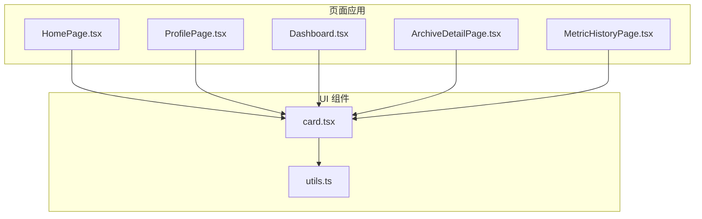
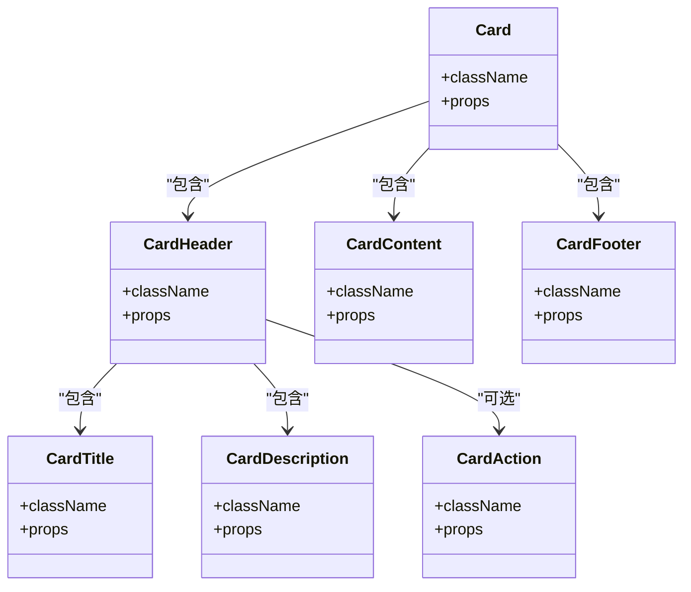
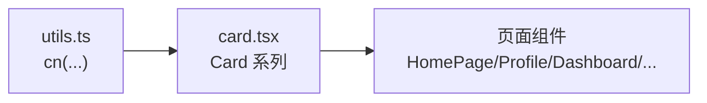

# Card卡片组件

<cite>
**本文引用的文件**
- [card.tsx](file://figma-ui/src/app/components/ui/card.tsx)
- [utils.ts](file://figma-ui/src/app/components/ui/utils.ts)
- [HomePage.tsx](file://figma-ui/src/app/pages/HomePage.tsx)
- [ProfilePage.tsx](file://figma-ui/src/app/pages/ProfilePage.tsx)
- [Dashboard.tsx](file://figma-ui/src/app/pages/Dashboard.tsx)
- [ArchiveDetailPage.tsx](file://figma-ui/src/app/pages/ArchiveDetailPage.tsx)
- [MetricHistoryPage.tsx](file://figma-ui/src/app/pages/MetricHistoryPage.tsx)
</cite>

## 目录
1. [简介](#简介)
2. [项目结构](#项目结构)
3. [核心组件](#核心组件)
4. [架构总览](#架构总览)
5. [详细组件分析](#详细组件分析)
6. [依赖关系分析](#依赖关系分析)
7. [性能与可访问性](#性能与可访问性)
8. [故障排查指南](#故障排查指南)
9. [结论](#结论)
10. [附录：使用示例与最佳实践](#附录使用示例与最佳实践)

## 简介
本章节面向医案通医疗档案网站的“Card卡片组件”，基于语义化HTML结构构建，提供一套开箱即用的卡片容器与子组件，包括 Card、CardHeader、CardTitle、CardDescription、CardContent、CardFooter（以及可选的 CardAction）。文档将说明布局结构、内容组织方式、样式定制选项、响应式行为、阴影与悬停交互，并结合医疗档案、用户信息、统计信息等业务场景给出组合模式与最佳实践。

## 项目结构
- 组件实现位于 UI 层：figma-ui/src/app/components/ui/card.tsx
- 工具函数用于类名合并：figma-ui/src/app/components/ui/utils.ts
- 页面中广泛采用“卡片式”布局（通过 Tailwind 类名）来承载医疗档案、用户信息、统计指标等内容，便于统一视觉与交互风格

图表来源
- [card.tsx:1-92](file://figma-ui/src/app/components/ui/card.tsx#L1-L92)
- [utils.ts:1-7](file://figma-ui/src/app/components/ui/utils.ts#L1-L7)

章节来源
- [card.tsx:1-92](file://figma-ui/src/app/components/ui/card.tsx#L1-L92)
- [utils.ts:1-7](file://figma-ui/src/app/components/ui/utils.ts#L1-L7)

## 核心组件
- Card：卡片容器，负责背景色、文字色、圆角、边框与纵向间距等基础样式
- CardHeader：卡片头部区域，支持网格布局与可选的操作区对齐
- CardTitle：标题元素（h4），控制行高与排版
- CardDescription：描述文本（p），使用中性前景色
- CardContent：主体内容区，内边距与底部留白
- CardFooter：底部操作区，水平居中与分割线适配
- CardAction：可选的头部右侧操作区，配合 CardHeader 的网格进行定位

章节来源
- [card.tsx:5-16](file://figma-ui/src/app/components/ui/card.tsx#L5-L16)
- [card.tsx:18-29](file://figma-ui/src/app/components/ui/card.tsx#L18-L29)
- [card.tsx:31-39](file://figma-ui/src/app/components/ui/card.tsx#L31-L39)
- [card.tsx:41-49](file://figma-ui/src/app/components/ui/card.tsx#L41-L49)
- [card.tsx:51-62](file://figma-ui/src/app/components/ui/card.tsx#L51-L62)
- [card.tsx:64-72](file://figma-ui/src/app/components/ui/card.tsx#L64-L72)
- [card.tsx:74-82](file://figma-ui/src/app/components/ui/card.tsx#L74-L82)

## 架构总览
Card 组件以“容器 + 分区”的方式组织内容，遵循语义化标签与数据属性标记，便于测试与样式选择器定位。各子组件通过 className 组合与 data-slot 标识形成稳定的结构契约。页面侧通过组合这些子组件，快速搭建医疗档案、用户信息、统计指标等卡片。

图表来源
- [card.tsx:5-82](file://figma-ui/src/app/components/ui/card.tsx#L5-L82)

## 详细组件分析

### Card（容器）
- 作用：定义卡片的基础外观（背景、前景色、圆角、边框、纵向间距）
- 关键点：
  - 使用 data-slot="card" 便于定位
  - 默认纵向布局与间距，便于内部子组件排列
  - 可通过 className 覆盖或扩展样式

章节来源
- [card.tsx:5-16](file://figma-ui/src/app/components/ui/card.tsx#L5-L16)

### CardHeader（头部）
- 作用：承载标题、描述与可选操作按钮
- 关键点：
  - 使用网格布局，自动行高；当存在 CardAction 时，自动切换为两列布局，使操作区靠右对齐
  - 顶部内边距与分隔线处理（当存在下边框时调整底部间距）
  - 使用 data-slot="card-header"

章节来源
- [card.tsx:18-29](file://figma-ui/src/app/components/ui/card.tsx#L18-L29)

### CardTitle（标题）
- 作用：语义化的 h4 标题，控制行高避免换行异常
- 关键点：
  - 使用 data-slot="card-title"
  - 可通过 className 自定义字体大小、粗细等

章节来源
- [card.tsx:31-39](file://figma-ui/src/app/components/ui/card.tsx#L31-L39)

### CardDescription（描述）
- 作用：辅助说明文本，使用中性前景色
- 关键点：
  - 使用 data-slot="card-description"
  - 适合放置副标题、摘要、状态提示等

章节来源
- [card.tsx:41-49](file://figma-ui/src/app/components/ui/card.tsx#L41-L49)

### CardAction（操作区）
- 作用：在头部右侧放置操作按钮或开关等
- 关键点：
  - 使用 data-slot="card-action"
  - 与 CardHeader 的网格结合，自动定位到第二列并跨行对齐

章节来源
- [card.tsx:51-62](file://figma-ui/src/app/components/ui/card.tsx#L51-L62)

### CardContent（内容区）
- 作用：承载主要信息块
- 关键点：
  - 使用 data-slot="card-content"
  - 左右内边距与最后一个子元素的底部留白，保证视觉节奏

章节来源
- [card.tsx:64-72](file://figma-ui/src/app/components/ui/card.tsx#L64-L72)

### CardFooter（底部）
- 作用：放置次要操作、链接、版权信息等
- 关键点：
  - 使用 data-slot="card-footer"
  - 水平居中布局，当存在上边框时增加顶部间距

章节来源
- [card.tsx:74-82](file://figma-ui/src/app/components/ui/card.tsx#L74-L82)

## 依赖关系分析
- 类名合并工具：utils.ts 中的 cn 函数，基于 clsx 与 tailwind-merge，确保样式冲突最小化与优先级正确
- 组件间耦合：子组件仅依赖 Card 提供的上下文（data-slot）与自身 className，低耦合、高复用
- 页面集成：页面通过组合子组件形成不同业务卡片，无需修改组件即可满足多样需求

图表来源
- [utils.ts:1-7](file://figma-ui/src/app/components/ui/utils.ts#L1-L7)
- [card.tsx:1-92](file://figma-ui/src/app/components/ui/card.tsx#L1-L92)

章节来源
- [utils.ts:1-7](file://figma-ui/src/app/components/ui/utils.ts#L1-L7)
- [card.tsx:1-92](file://figma-ui/src/app/components/ui/card.tsx#L1-L92)

## 性能与可访问性
- 性能
  - 组件无额外运行时逻辑，渲染开销极低
  - 使用 CSS Grid 与 Tailwind 原子类，减少自定义样式体积
- 可访问性
  - 标题使用语义化 h4，利于屏幕阅读器识别
  - 通过 data-slot 便于自动化测试定位
- 主题与响应式
  - 颜色变量来自主题（如 bg-card、text-card-foreground），便于全局主题切换
  - 网格布局与间距适配移动端与桌面端

[本节为通用指导，不直接分析具体文件]

## 故障排查指南
- 样式未生效
  - 检查是否引入并正确配置了 Tailwind 与主题变量
  - 确认 className 未被其他样式覆盖
- 布局异常
  - 若 CardHeader 中同时出现 CardTitle、CardDescription、CardAction，请确保顺序合理，必要时通过 className 调整
- 阴影与边框
  - 如需增强立体感，可在 Card 外层包裹容器添加阴影类；注意与主题色搭配
- 可访问性
  - 确保标题层级合理，避免跳过级别；为图片与图标补充 alt 或 aria-label

[本节为通用指导，不直接分析具体文件]

## 结论
Card 组件以简洁的语义化结构与灵活的样式系统，为医案通网站提供了统一的卡片范式。通过组合 CardHeader、CardTitle、CardDescription、CardContent、CardFooter 与可选的 CardAction，可以快速构建医疗档案、用户信息、统计指标等多种业务卡片，并具备良好的可维护性与可扩展性。

[本节为总结性内容，不直接分析具体文件]

## 附录：使用示例与最佳实践

### 医疗档案卡片（列表项）
- 目标：展示单条医疗档案的标题、类型、医院、日期与标签
- 建议结构：
  - CardHeader：CardTitle（档案标题）、CardDescription（医院/科室）
  - CardContent：类型标签、收藏状态、时间、标签
  - CardFooter：查看详情按钮
- 参考页面中的卡片式实现思路与交互（如悬停边框变化、渐变边框效果）

章节来源
- [HomePage.tsx:188-276](file://figma-ui/src/app/pages/HomePage.tsx#L188-L276)

### 用户信息卡片（个人中心）
- 目标：展示头像、用户名、已保护档案数等基本信息
- 建议结构：
  - CardHeader：头像与用户信息
  - CardContent：统计数据或快捷入口
  - CardFooter：设置或退出登录
- 参考页面中的用户信息区块与菜单卡片

章节来源
- [ProfilePage.tsx:52-137](file://figma-ui/src/app/pages/ProfilePage.tsx#L52-L137)

### 统计信息卡片（仪表盘）
- 目标：展示关键健康指标（血压、血糖等）与趋势图
- 建议结构：
  - CardHeader：指标名称与当前值
  - CardContent：迷你折线图或面积图
  - CardFooter：时间范围选择或更多操作
- 参考页面中的统计卡片与图表容器

章节来源
- [Dashboard.tsx:58-142](file://figma-ui/src/app/pages/Dashboard.tsx#L58-L142)

### 档案详情页卡片
- 目标：展示档案标题、医院、医生、标签与 AI 提取结果
- 建议结构：
  - CardHeader：标题与元信息（医院、日期、医生）
  - CardContent：诊断、处方、影像报告等分块内容
  - CardFooter：下载、分享等操作
- 参考页面中的标题卡片与信息区块

章节来源
- [ArchiveDetailPage.tsx:278-313](file://figma-ui/src/app/pages/ArchiveDetailPage.tsx#L278-L313)

### 指标历史卡片
- 目标：展示某项指标的历史趋势与参考区间
- 建议结构：
  - CardHeader：指标名称与当前值、状态提示
  - CardContent：折线图与参考线
  - CardFooter：时间范围与查看原件入口
- 参考页面中的指标卡片与图表

章节来源
- [MetricHistoryPage.tsx:80-153](file://figma-ui/src/app/pages/MetricHistoryPage.tsx#L80-L153)

### 布局与样式最佳实践
- 语义化结构：优先使用 CardHeader/CardTitle/CardDescription 表达信息层次
- 内容组织：将主信息与辅助信息分离，避免拥挤；必要时使用 CardAction 放置高频操作
- 响应式：利用网格与间距类，在小屏设备上保持可读性
- 阴影与悬停：在容器层添加阴影与过渡，提升层次感与交互反馈
- 主题一致性：通过主题变量与 Tailwind 类名保持一致的视觉语言

[本节为通用指导，不直接分析具体文件]