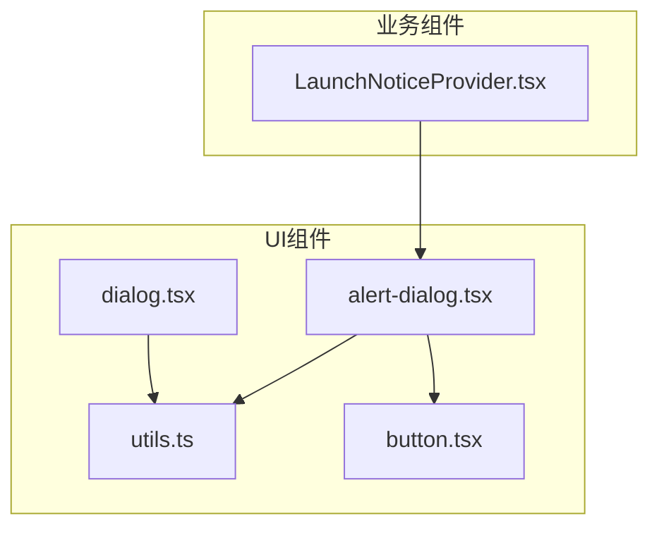
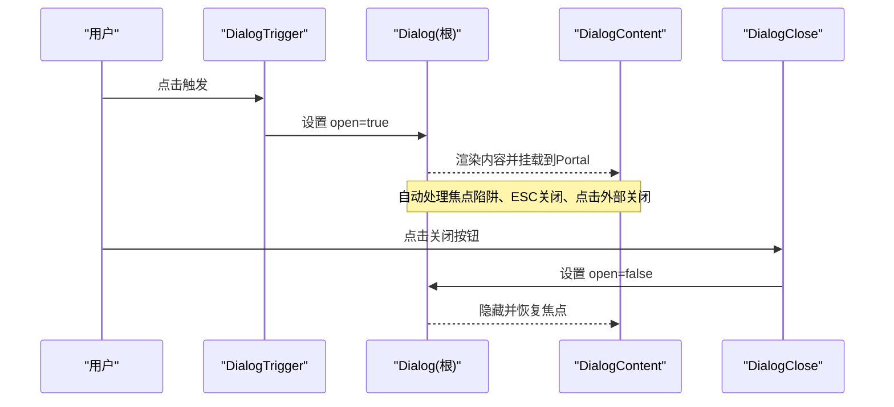
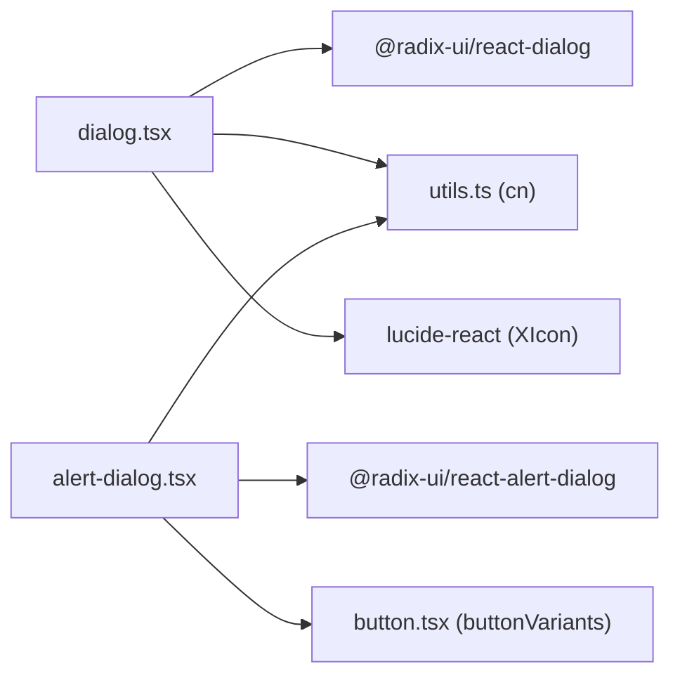

# Dialog对话框组件

<cite>
**本文引用的文件**
- [dialog.tsx](file://figma-ui/src/app/components/ui/dialog.tsx)
- [alert-dialog.tsx](file://figma-ui/src/app/components/ui/alert-dialog.tsx)
- [button.tsx](file://figma-ui/src/app/components/ui/button.tsx)
- [utils.ts](file://figma-ui/src/app/components/ui/utils.ts)
- [LaunchNoticeProvider.tsx](file://figma-ui/src/app/components/LaunchNoticeProvider.tsx)
</cite>

## 目录
1. [简介](#简介)
2. [项目结构](#项目结构)
3. [核心组件](#核心组件)
4. [架构总览](#架构总览)
5. [详细组件分析](#详细组件分析)
6. [依赖分析](#依赖分析)
7. [性能考虑](#性能考虑)
8. [故障排查指南](#故障排查指南)
9. [结论](#结论)
10. [附录：使用示例与最佳实践](#附录使用示例与最佳实践)

## 简介
本组件文档面向医案通医疗档案网站中的“Dialog对话框”能力。该能力基于 Radix UI Dialog 构建，提供开箱即用的模态对话框、焦点管理、可访问性支持以及动画效果。组件封装了 Dialog、DialogTrigger、DialogContent、DialogHeader、DialogTitle、DialogFooter、DialogDescription、DialogOverlay、DialogPortal、DialogClose 等子组件，便于在业务页面中快速组合出确认对话框、信息提示、表单弹窗等常见场景。

## 项目结构
- 基础UI层位于 figma-ui/src/app/components/ui，包含 dialog.tsx、alert-dialog.tsx、button.tsx、utils.ts 等通用组件。
- 业务侧通过 LaunchNoticeProvider 展示一个基于 AlertDialog 的启动通知弹窗，演示状态管理与打开/关闭控制。
- 样式与动画通过 Tailwind CSS 类名实现，结合 Radix 的状态选择器（data-[state=open/closed]）完成入场/出场动画。

图表来源
- [dialog.tsx:1-136](file://figma-ui/src/app/components/ui/dialog.tsx#L1-L136)
- [alert-dialog.tsx:1-158](file://figma-ui/src/app/components/ui/alert-dialog.tsx#L1-L158)
- [button.tsx:1-59](file://figma-ui/src/app/components/ui/button.tsx#L1-L59)
- [utils.ts:1-7](file://figma-ui/src/app/components/ui/utils.ts#L1-L7)
- [LaunchNoticeProvider.tsx:1-118](file://figma-ui/src/app/components/LaunchNoticeProvider.tsx#L1-L118)

章节来源
- [dialog.tsx:1-136](file://figma-ui/src/app/components/ui/dialog.tsx#L1-L136)
- [alert-dialog.tsx:1-158](file://figma-ui/src/app/components/ui/alert-dialog.tsx#L1-L158)
- [button.tsx:1-59](file://figma-ui/src/app/components/ui/button.tsx#L1-L59)
- [utils.ts:1-7](file://figma-ui/src/app/components/ui/utils.ts#L1-L7)
- [LaunchNoticeProvider.tsx:1-118](file://figma-ui/src/app/components/LaunchNoticeProvider.tsx#L1-L118)

## 核心组件
- Dialog / DialogTrigger / DialogContent / DialogHeader / DialogTitle / DialogFooter / DialogDescription / DialogOverlay / DialogPortal / DialogClose
  - 均基于 @radix-ui/react-dialog 的对应原语进行轻量封装，统一添加 data-slot 标记与默认样式。
  - DialogContent 内部自动挂载 Overlay，并内置右上角关闭按钮（带无障碍标签）。
  - Header/Footer 提供移动端优先的布局（纵向堆叠），在桌面端切换为横向排列。
  - 所有组件通过 className 透传，可使用 Tailwind 类名覆盖或扩展样式。

章节来源
- [dialog.tsx:9-136](file://figma-ui/src/app/components/ui/dialog.tsx#L9-L136)

## 架构总览
Radix Dialog 负责底层交互与可访问性契约；本组件在其之上提供一致的视觉风格与布局约定。业务侧可通过 open/onOpenChange 控制显隐，或通过 Trigger/Close 触发交互。

图表来源
- [dialog.tsx:15-73](file://figma-ui/src/app/components/ui/dialog.tsx#L15-L73)

## 详细组件分析

### Dialog 与 DialogTrigger
- Dialog 作为容器，承载整个对话框生命周期。
- DialogTrigger 用于绑定触发元素，将焦点与键盘事件委托给 Radix 管理。
- 典型用法：将任意可聚焦元素包裹为 Trigger，或使用 Button 作为触发器。

章节来源
- [dialog.tsx:9-19](file://figma-ui/src/app/components/ui/dialog.tsx#L9-L19)

### DialogContent
- 自动包含 Overlay 与关闭按钮，具备淡入/缩放动画。
- 响应式宽度：移动端最大宽度为视口减去内边距，桌面端限制为 sm:max-w-lg。
- 固定定位居中，使用 translate(-50%, -50%) 实现水平垂直居中。
- 可自定义 className 以覆盖默认样式。

章节来源
- [dialog.tsx:33-73](file://figma-ui/src/app/components/ui/dialog.tsx#L33-L73)

### DialogHeader / DialogFooter / DialogTitle / DialogDescription
- Header/Footer 提供移动端优先的纵向布局，桌面端改为横向对齐。
- Title/Description 分别承担标题与说明文本的可访问性语义。
- 这些组件均为 div 包装，便于自由组合内容。

章节来源
- [dialog.tsx:75-122](file://figma-ui/src/app/components/ui/dialog.tsx#L75-L122)

### DialogOverlay / DialogPortal / DialogClose
- Overlay 提供半透明遮罩，支持淡入/淡出动画。
- Portal 将内容渲染到 DOM 顶层，避免层级问题。
- Close 提供关闭行为与无障碍标签，便于屏幕阅读器识别。

章节来源
- [dialog.tsx:21-31](file://figma-ui/src/app/components/ui/dialog.tsx#L21-L31)
- [dialog.tsx:33-47](file://figma-ui/src/app/components/ui/dialog.tsx#L33-L47)
- [dialog.tsx:27-31](file://figma-ui/src/app/components/ui/dialog.tsx#L27-L31)

### AlertDialog（确认对话框）
- 基于 @radix-ui/react-alert-dialog 封装，提供 Action/Cancel 按钮样式复用。
- 适合用于删除确认、退出确认等需要明确操作的场景。
- 与 Dialog 类似，具备 Overlay、Content、Header/Footer、Title/Description 等子组件。

章节来源
- [alert-dialog.tsx:1-158](file://figma-ui/src/app/components/ui/alert-dialog.tsx#L1-L158)
- [button.tsx:7-35](file://figma-ui/src/app/components/ui/button.tsx#L7-L35)

### 业务示例：启动通知弹窗（LaunchNoticeProvider）
- 使用 Context 暴露 showLaunchNotice/showPartnerNotice 方法，集中管理弹窗状态。
- 通过 open/onOpenChange 控制弹窗显隐，并在 Footer 中提供“我知道了”操作。
- 展示了如何在业务组件中组合 AlertDialog 及其子组件。

章节来源
- [LaunchNoticeProvider.tsx:52-108](file://figma-ui/src/app/components/LaunchNoticeProvider.tsx#L52-L108)

## 依赖分析
- 运行时依赖：@radix-ui/react-dialog、@radix-ui/react-alert-dialog
- 样式工具：clsx + tailwind-merge（utils.ts 的 cn 函数）
- 图标：lucide-react（XIcon 用于关闭按钮）
- 按钮样式：button.tsx 的 buttonVariants 被 AlertDialogAction/Cancel 复用

图表来源
- [dialog.tsx:3-7](file://figma-ui/src/app/components/ui/dialog.tsx#L3-L7)
- [alert-dialog.tsx:3-7](file://figma-ui/src/app/components/ui/alert-dialog.tsx#L3-L7)
- [button.tsx:1-8](file://figma-ui/src/app/components/ui/button.tsx#L1-L8)
- [utils.ts:1-7](file://figma-ui/src/app/components/ui/utils.ts#L1-L7)

章节来源
- [dialog.tsx:3-7](file://figma-ui/src/app/components/ui/dialog.tsx#L3-L7)
- [alert-dialog.tsx:3-7](file://figma-ui/src/app/components/ui/alert-dialog.tsx#L3-L7)
- [button.tsx:1-59](file://figma-ui/src/app/components/ui/button.tsx#L1-L59)
- [utils.ts:1-7](file://figma-ui/src/app/components/ui/utils.ts#L1-L7)

## 性能考虑
- 使用 Portal 将对话框渲染至 DOM 顶层，减少重排与层级冲突。
- 动画采用 CSS 过渡（fade/zoom），由 data-[state] 驱动，避免 JS 动画开销。
- 仅在 open 时渲染内容，降低初始渲染成本。
- 合理使用 memo/useCallback（如业务 Provider 中）避免不必要的重渲染。

[本节为通用指导，不直接分析具体文件]

## 故障排查指南
- 无法关闭
  - 检查是否遗漏 DialogClose 或未调用 onOpenChange(false)。
  - 确认 Trigger 是否正确关联到 Dialog 上下文。
- 焦点异常
  - 确保第一个可聚焦元素在 DialogContent 内，Radix 会自动管理焦点进入/离开。
  - 若自定义内容包含复杂表单，请保证 Tab 顺序合理。
- 样式覆盖无效
  - 检查 className 是否被后续样式覆盖；必要时提高优先级或使用 !important（谨慎）。
  - 确认 Tailwind 配置已启用相关动画与颜色变量。
- 动画不生效
  - 确认 data-[state=open/closed] 类名存在；检查浏览器控制台是否有 CSS 错误。
- 屏幕阅读器无反馈
  - 为标题使用 DialogTitle，描述使用 DialogDescription；关闭按钮需保留 sr-only 文本。

章节来源
- [dialog.tsx:33-73](file://figma-ui/src/app/components/ui/dialog.tsx#L33-L73)
- [alert-dialog.tsx:47-64](file://figma-ui/src/app/components/ui/alert-dialog.tsx#L47-L64)

## 结论
本 Dialog 组件基于 Radix 的原语封装，提供了稳定、可访问且易定制的模态对话框能力。通过统一的子组件约定与 Tailwind 样式策略，可在不同场景下快速组合出确认、提示、表单弹窗等交互。建议业务侧优先使用 open/onOpenChange 进行受控管理，并结合 Trigger/Close 完成交互闭环。

[本节为总结，不直接分析具体文件]

## 附录：使用示例与最佳实践

- 确认对话框（删除确认）
  - 使用 AlertDialog 组合 Header/Title/Description/Footer，并通过 Action/Cancel 执行确认或取消逻辑。
  - 参考路径：[alert-dialog.tsx:95-158](file://figma-ui/src/app/components/ui/alert-dialog.tsx#L95-L158)

- 信息提示（公告/通知）
  - 使用 Dialog 组合 Header/Title/Description，配合 Trigger 触发显示。
  - 参考路径：[dialog.tsx:9-122](file://figma-ui/src/app/components/ui/dialog.tsx#L9-L122)

- 表单弹窗（录入/编辑）
  - 在 DialogContent 中放置表单控件，利用 Focus Trap 与 ESC/点击外部关闭提升体验。
  - 参考路径：[dialog.tsx:49-73](file://figma-ui/src/app/components/ui/dialog.tsx#L49-L73)

- 状态管理与打开/关闭控制
  - 使用 open/onOpenChange 进行受控模式；或在 Provider 中集中管理状态。
  - 参考路径：[LaunchNoticeProvider.tsx:52-108](file://figma-ui/src/app/components/LaunchNoticeProvider.tsx#L52-L108)

- 可访问性与屏幕阅读器支持
  - 使用 DialogTitle/DialogDescription 表达语义；关闭按钮保留 sr-only 文本。
  - 参考路径：[dialog.tsx:66-69](file://figma-ui/src/app/components/ui/dialog.tsx#L66-L69)

- 动画效果定制
  - 通过 Tailwind 类名覆盖 data-[state=open/closed] 的动画；如需自定义时长/缓动，可调整对应类名。
  - 参考路径：[dialog.tsx:33-63](file://figma-ui/src/app/components/ui/dialog.tsx#L33-L63)

- 响应式布局指南
  - 移动端：Header/Footer 纵向堆叠，内容宽度自适应；桌面端：Footer 右对齐，内容最大宽度受限。
  - 参考路径：[dialog.tsx:75-96](file://figma-ui/src/app/components/ui/dialog.tsx#L75-L96)

- 按钮样式复用
  - AlertDialogAction/Cancel 复用 buttonVariants，保持风格一致。
  - 参考路径：[alert-dialog.tsx:121-143](file://figma-ui/src/app/components/ui/alert-dialog.tsx#L121-L143)
  - 参考路径：[button.tsx:7-35](file://figma-ui/src/app/components/ui/button.tsx#L7-L35)

章节来源
- [alert-dialog.tsx:95-158](file://figma-ui/src/app/components/ui/alert-dialog.tsx#L95-L158)
- [dialog.tsx:9-122](file://figma-ui/src/app/components/ui/dialog.tsx#L9-L122)
- [LaunchNoticeProvider.tsx:52-108](file://figma-ui/src/app/components/LaunchNoticeProvider.tsx#L52-L108)
- [dialog.tsx:66-69](file://figma-ui/src/app/components/ui/dialog.tsx#L66-L69)
- [dialog.tsx:33-63](file://figma-ui/src/app/components/ui/dialog.tsx#L33-L63)
- [dialog.tsx:75-96](file://figma-ui/src/app/components/ui/dialog.tsx#L75-L96)
- [alert-dialog.tsx:121-143](file://figma-ui/src/app/components/ui/alert-dialog.tsx#L121-L143)
- [button.tsx:7-35](file://figma-ui/src/app/components/ui/button.tsx#L7-L35)