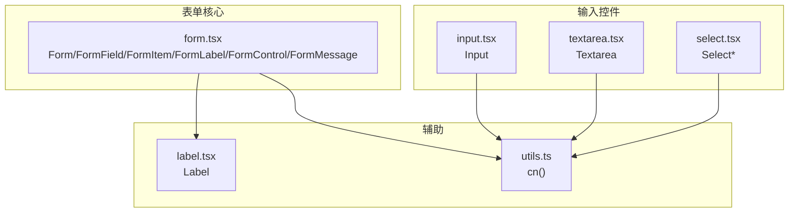
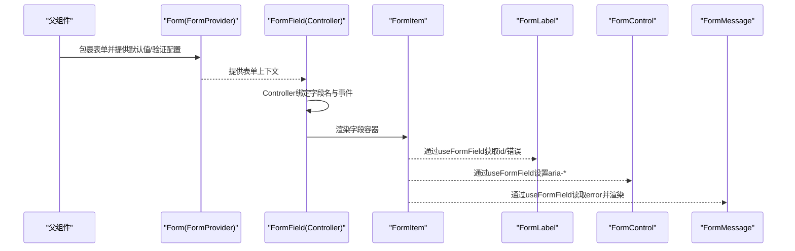
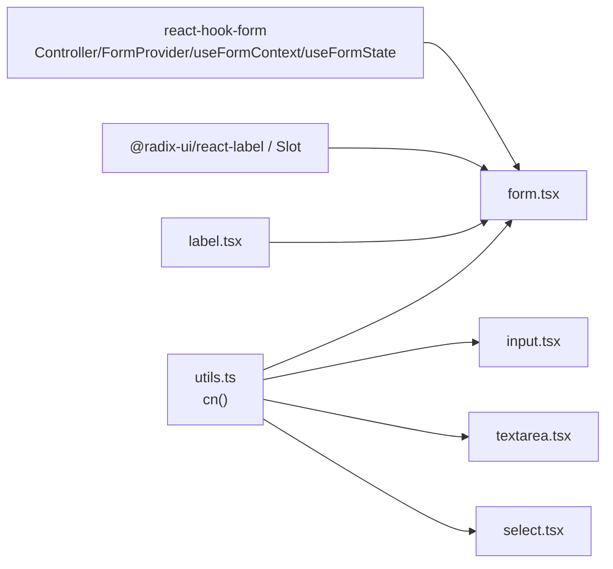
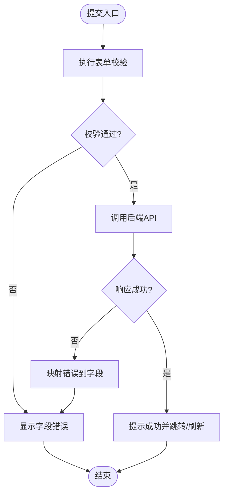

# Form表单组件

<cite>
**本文引用的文件**
- [form.tsx](file://figma-ui/src/app/components/ui/form.tsx)
- [input.tsx](file://figma-ui/src/app/components/ui/input.tsx)
- [textarea.tsx](file://figma-ui/src/app/components/ui/textarea.tsx)
- [select.tsx](file://figma-ui/src/app/components/ui/select.tsx)
- [label.tsx](file://figma-ui/src/app/components/ui/label.tsx)
- [utils.ts](file://figma-ui/src/app/components/ui/utils.ts)
</cite>

## 目录
1. [简介](#简介)
2. [项目结构](#项目结构)
3. [核心组件](#核心组件)
4. [架构总览](#架构总览)
5. [详细组件分析](#详细组件分析)
6. [依赖关系分析](#依赖关系分析)
7. [性能考量](#性能考量)
8. [故障排查指南](#故障排查指南)
9. [结论](#结论)
10. [附录：使用示例与最佳实践](#附录使用示例与最佳实践)

## 简介
本文件为医案通医疗档案网站的Form表单组件提供系统化文档。该表单系统基于React Hook Form构建，封装了FormProvider、FormField、FormItem、FormLabel、FormControl、FormMessage等核心组件，统一了字段状态管理、验证与错误提示的交互体验。本文档将说明表单验证机制、错误消息显示、数据提交处理、复杂表单构建方式、字段验证规则与异步验证实现、表单状态管理与重置、批量操作以及与后端API集成的数据提交模式和错误处理策略。

## 项目结构
本项目采用按功能域组织的前端结构，表单相关UI组件集中在ui目录下，通过统一的工具函数进行样式合并与类名处理。表单核心由form.tsx提供，输入控件（Input、Textarea、Select）与标签（Label）作为基础原子组件被复用。

图表来源
- [form.tsx:1-169](file://figma-ui/src/app/components/ui/form.tsx#L1-L169)
- [input.tsx:1-22](file://figma-ui/src/app/components/ui/input.tsx#L1-L22)
- [textarea.tsx:1-19](file://figma-ui/src/app/components/ui/textarea.tsx#L1-L19)
- [select.tsx:1-190](file://figma-ui/src/app/components/ui/select.tsx#L1-L190)
- [label.tsx:1-25](file://figma-ui/src/app/components/ui/label.tsx#L1-L25)
- [utils.ts:1-7](file://figma-ui/src/app/components/ui/utils.ts#L1-L7)

章节来源
- [form.tsx:1-169](file://figma-ui/src/app/components/ui/form.tsx#L1-L169)
- [input.tsx:1-22](file://figma-ui/src/app/components/ui/input.tsx#L1-L22)
- [textarea.tsx:1-19](file://figma-ui/src/app/components/ui/textarea.tsx#L1-L19)
- [select.tsx:1-190](file://figma-ui/src/app/components/ui/select.tsx#L1-L190)
- [label.tsx:1-25](file://figma-ui/src/app/components/ui/label.tsx#L1-L25)
- [utils.ts:1-7](file://figma-ui/src/app/components/ui/utils.ts#L1-L7)

## 核心组件
- Form（FormProvider）：提供表单上下文，集中管理所有字段的值、校验状态和生命周期方法（如submit、reset）。
- FormField：基于react-hook-form的Controller包装，将字段绑定到表单上下文，并暴露useFormField钩子供子组件读取字段状态。
- FormItem：为每个字段提供容器，生成唯一id并注入上下文，便于无障碍访问与关联。
- FormLabel：与FormControl建立关联，自动根据错误状态切换样式，提升可访问性。
- FormControl：通过Slot透传原生元素属性，自动设置aria-invalid与aria-describedby，确保屏幕阅读器正确播报。
- FormDescription：用于展示字段帮助信息，与FormControl通过id关联。
- FormMessage：统一渲染字段错误消息或自定义内容，仅在存在内容时渲染。

这些组件共同实现了“声明式字段绑定 + 集中式状态管理 + 一致的可访问性与样式”的表单体系。

章节来源
- [form.tsx:19-168](file://figma-ui/src/app/components/ui/form.tsx#L19-L168)

## 架构总览
下图展示了表单组件之间的协作关系与数据流向：父级Form提供上下文；FormField通过Controller连接react-hook-form；FormItem提供id与布局；FormLabel/FormControl/FormMessage通过useFormField读取字段状态并渲染对应UI。

图表来源
- [form.tsx:19-168](file://figma-ui/src/app/components/ui/form.tsx#L19-L168)

## 详细组件分析

### Form（FormProvider）
- 职责：作为表单根节点，集中管理字段值、校验结果、提交与重置。
- 关键点：对外暴露submitHandler、reset、setValue等方法，供页面层调用。
- 建议：在页面中结合react-hook-form的useForm创建实例，并将schema（如Zod）传入以启用类型安全与同步/异步校验。

章节来源
- [form.tsx:19-19](file://figma-ui/src/app/components/ui/form.tsx#L19-L19)

### FormField
- 职责：将单个字段与react-hook-form的Controller绑定，并通过Context传递name给子组件。
- 关键点：内部使用ControllerProps泛型，支持强类型字段路径；配合useFormField读取字段状态。
- 建议：为每个业务字段创建一个FormField，并在其内组合FormControl与FormMessage。

章节来源
- [form.tsx:32-43](file://figma-ui/src/app/components/ui/form.tsx#L32-L43)

### FormItem
- 职责：为字段提供容器，生成唯一id并注入上下文，便于无障碍关联。
- 关键点：使用React.useId生成稳定id，避免重复。
- 建议：每个字段用FormItem包裹，保证Label与Control的关联一致性。

章节来源
- [form.tsx:76-88](file://figma-ui/src/app/components/ui/form.tsx#L76-L88)

### FormLabel
- 职责：渲染字段标签，自动关联FormControl的id，并根据错误状态切换样式。
- 关键点：data-error属性便于样式控制；htmlFor指向FormControl的id。
- 建议：始终为每个FormControl提供可读的FormLabel。

章节来源
- [form.tsx:90-105](file://figma-ui/src/app/components/ui/form.tsx#L90-L105)

### FormControl
- 职责：通过Slot透传props到实际输入元素，设置aria-invalid与aria-describedby，增强可访问性。
- 关键点：当存在错误时，aria-describedby包含错误消息id；无错误时仅包含描述id。
- 建议：在FormField内使用FormControl包裹具体输入组件（如Input/Textarea/Select）。

章节来源
- [form.tsx:107-124](file://figma-ui/src/app/components/ui/form.tsx#L107-L124)

### FormDescription
- 职责：渲染字段帮助文本，与FormControl通过id关联。
- 关键点：使用固定class与语义化p标签。
- 建议：对复杂字段提供简短说明，提升可用性。

章节来源
- [form.tsx:126-137](file://figma-ui/src/app/components/ui/form.tsx#L126-L137)

### FormMessage
- 职责：统一渲染字段错误消息或自定义内容，仅在存在内容时渲染。
- 关键点：优先使用校验错误message，否则回退到children。
- 建议：将FormMessage置于FormControl之后，确保读屏顺序合理。

章节来源
- [form.tsx:139-157](file://figma-ui/src/app/components/ui/form.tsx#L139-L157)

### 输入控件集成
- Input：标准文本输入，具备焦点与无效态样式，适合与FormControl组合。
- Textarea：多行文本输入，具备相同可访问性与样式约定。
- Select：下拉选择组件，提供触发器、内容、选项等子组件，可与FormControl组合实现受控选择。

章节来源
- [input.tsx:1-22](file://figma-ui/src/app/components/ui/input.tsx#L1-L22)
- [textarea.tsx:1-19](file://figma-ui/src/app/components/ui/textarea.tsx#L1-L19)
- [select.tsx:1-190](file://figma-ui/src/app/components/ui/select.tsx#L1-L190)

## 依赖关系分析
- 表单核心依赖react-hook-form提供的Controller、FormProvider、useFormContext、useFormState，用于字段绑定与状态管理。
- UI层依赖Radix UI的Label与Slot，以及自定义Label组件，确保可访问性与样式。
- 样式合并依赖utils.ts中的cn函数，统一处理Tailwind类名冲突与合并。

图表来源
- [form.tsx:1-18](file://figma-ui/src/app/components/ui/form.tsx#L1-L18)
- [label.tsx:1-25](file://figma-ui/src/app/components/ui/label.tsx#L1-L25)
- [utils.ts:1-7](file://figma-ui/src/app/components/ui/utils.ts#L1-L7)
- [input.tsx:1-22](file://figma-ui/src/app/components/ui/input.tsx#L1-L22)
- [textarea.tsx:1-19](file://figma-ui/src/app/components/ui/textarea.tsx#L1-L19)
- [select.tsx:1-190](file://figma-ui/src/app/components/ui/select.tsx#L1-L190)

章节来源
- [form.tsx:1-18](file://figma-ui/src/app/components/ui/form.tsx#L1-L18)
- [utils.ts:1-7](file://figma-ui/src/app/components/ui/utils.ts#L1-L7)

## 性能考量
- 字段级更新：FormField通过Controller精确绑定字段，避免整表重渲染。
- 条件渲染：FormMessage仅在存在内容时渲染，减少DOM开销。
- 样式合并：使用cn函数合并类名，避免不必要的样式计算。
- 可访问性优化：通过aria-*属性提升读屏体验，减少额外逻辑。

[本节为通用性能指导，不直接分析具体文件]

## 故障排查指南
- useFormField必须在FormField内部使用：若抛出错误，检查是否在正确的上下文中调用。
- 标签与控件未关联：确认FormLabel的htmlFor与FormControl的id一致，且均位于同一FormItem下。
- 错误消息不显示：确认表单已配置校验规则，且FormMessage处于FormControl之后；检查error.message是否存在。
- 样式异常：检查cn是否正确引入，Tailwind配置是否生效；必要时查看data-slot与data-error属性。

章节来源
- [form.tsx:45-66](file://figma-ui/src/app/components/ui/form.tsx#L45-L66)
- [form.tsx:90-105](file://figma-ui/src/app/components/ui/form.tsx#L90-L105)
- [form.tsx:139-157](file://figma-ui/src/app/components/ui/form.tsx#L139-L157)

## 结论
本表单系统通过react-hook-form与一组高内聚的UI组件，提供了类型安全、可访问性强、易于扩展的表单解决方案。借助FormProvider集中管理状态，FormField精准绑定字段，FormItem/Label/Control/Message形成一致的字段模板，能够高效支撑复杂医疗档案场景下的表单需求。

[本节为总结性内容，不直接分析具体文件]

## 附录：使用示例与最佳实践

### 复杂表单构建模式
- 使用Form包裹整个表单，传入默认值与验证规则（例如使用Zod schema）。
- 每个字段使用FormField+FormItem包裹，内部组合FormLabel、FormControl（Input/Textarea/Select）、FormDescription与FormMessage。
- 对于联动字段（如根据城市选择动态加载区域），可在onChange中通过setValue更新依赖字段，或使用watch监听变化。

章节来源
- [form.tsx:19-168](file://figma-ui/src/app/components/ui/form.tsx#L19-L168)
- [input.tsx:1-22](file://figma-ui/src/app/components/ui/input.tsx#L1-L22)
- [textarea.tsx:1-19](file://figma-ui/src/app/components/ui/textarea.tsx#L1-L19)
- [select.tsx:1-190](file://figma-ui/src/app/components/ui/select.tsx#L1-L190)

### 字段验证规则与异步验证
- 同步验证：在schema中定义必填、长度、格式等规则，提交或失焦时即时校验。
- 异步验证：在字段规则中使用异步函数（如查询用户名是否占用），返回Promise以延迟校验结果。
- 错误消息：在schema中为每个字段定义message，FormMessage会自动渲染。

章节来源
- [form.tsx:139-157](file://figma-ui/src/app/components/ui/form.tsx#L139-L157)

### 表单状态管理与重置
- 状态管理：通过FormProvider统一管理字段值与校验状态；可使用setValue修改指定字段，setValues批量赋值。
- 重置：调用reset清空表单并恢复默认值；在需要时结合clearErrors清除错误。
- 批量操作：在提交前可对多个字段进行批量校验或转换，再统一提交。

章节来源
- [form.tsx:19-19](file://figma-ui/src/app/components/ui/form.tsx#L19-L19)

### 与后端API集成的数据提交模式与错误处理
- 提交流程：在handleSubmit中组装表单数据，调用后端API；成功时给出反馈，失败时捕获错误并映射到字段错误。
- 错误映射：将服务端错误对象转换为字段级错误，以便FormMessage显示。
- 网络异常：统一捕获超时或网络错误，提示用户重试或检查网络。

[此图为概念流程图，不直接映射具体代码文件]

### 可访问性与用户体验
- 使用FormLabel与FormControl的关联，确保键盘导航与读屏设备正确播报。
- 通过aria-invalid与aria-describedby增强错误提示的可访问性。
- 保持一致的样式与交互反馈，提升整体可用性。

章节来源
- [form.tsx:107-124](file://figma-ui/src/app/components/ui/form.tsx#L107-L124)
- [form.tsx:90-105](file://figma-ui/src/app/components/ui/form.tsx#L90-L105)