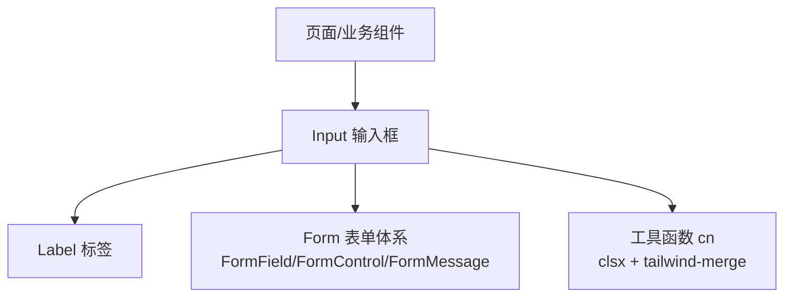
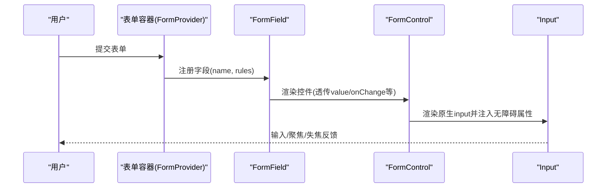
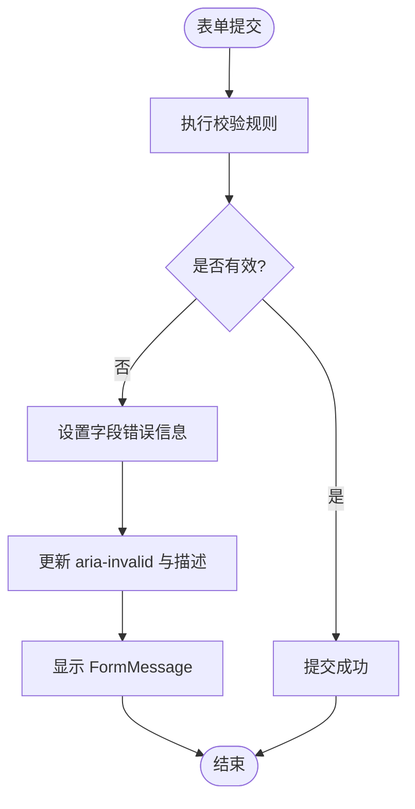
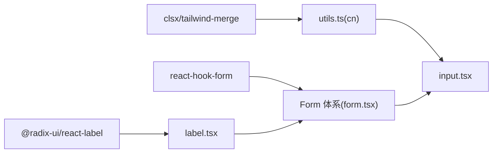

# Input输入框组件

<cite>
**本文引用的文件**
- [input.tsx](file://figma-ui/src/app/components/ui/input.tsx)
- [form.tsx](file://figma-ui/src/app/components/ui/form.tsx)
- [label.tsx](file://figma-ui/src/app/components/ui/label.tsx)
- [utils.ts](file://figma-ui/src/app/components/ui/utils.ts)
- [sidebar.tsx](file://figma-ui/src/app/components/ui/sidebar.tsx)
- [package.json](file://figma-ui/package.json)
</cite>

## 目录
1. [简介](#简介)
2. [项目结构](#项目结构)
3. [核心组件](#核心组件)
4. [架构总览](#架构总览)
5. [详细组件分析](#详细组件分析)
6. [依赖关系分析](#依赖关系分析)
7. [性能考量](#性能考量)
8. [故障排查指南](#故障排查指南)
9. [结论](#结论)
10. [附录](#附录)

## 简介
本文件为医案通医疗档案网站的 Input 输入框组件提供完整、可操作的文档。Input 是对原生 HTML input 的轻量封装，统一样式与交互行为，支持多种输入类型（text、email、password、number 等）、占位符文本、禁用状态与只读模式，并内置错误态与焦点可见性样式。同时提供与 React Hook Form 的集成方案，便于在表单中实现受控数据绑定、校验与无障碍访问。

## 项目结构
Input 组件位于 UI 组件库中，配合 Label 与 Form 体系使用，形成一致的表单体验。相关工具函数用于合并类名，确保样式一致性。

图表来源
- [input.tsx:5-18](file://figma-ui/src/app/components/ui/input.tsx#L5-L18)
- [form.tsx:76-124](file://figma-ui/src/app/components/ui/form.tsx#L76-L124)
- [label.tsx:8-21](file://figma-ui/src/app/components/ui/label.tsx#L8-L21)
- [utils.ts:4-6](file://figma-ui/src/app/components/ui/utils.ts#L4-L6)

章节来源
- [input.tsx:1-22](file://figma-ui/src/app/components/ui/input.tsx#L1-L22)
- [form.tsx:1-169](file://figma-ui/src/app/components/ui/form.tsx#L1-L169)
- [label.tsx:1-25](file://figma-ui/src/app/components/ui/label.tsx#L1-L25)
- [utils.ts:1-7](file://figma-ui/src/app/components/ui/utils.ts#L1-L7)

## 核心组件
- Input：对原生 input 的封装，透传所有标准属性，统一样式与可访问性增强。
- Label：基于 Radix 的标签组件，可与 FormControl 关联，提升可访问性。
- Form 体系：基于 react-hook-form 的封装，提供 FormField、FormControl、FormMessage 等，简化表单绑定与错误展示。

章节来源
- [input.tsx:5-18](file://figma-ui/src/app/components/ui/input.tsx#L5-L18)
- [form.tsx:32-43](file://figma-ui/src/app/components/ui/form.tsx#L32-L43)
- [form.tsx:107-124](file://figma-ui/src/app/components/ui/form.tsx#L107-L124)
- [label.tsx:8-21](file://figma-ui/src/app/components/ui/label.tsx#L8-L21)

## 架构总览
Input 通过 className 合并策略应用主题与状态样式；当与 Form 体系结合时，FormControl 会注入 aria-invalid、aria-describedby 等无障碍属性，并与 Label 建立关联，保证屏幕阅读器可用性与键盘可达性。

图表来源
- [form.tsx:32-43](file://figma-ui/src/app/components/ui/form.tsx#L32-L43)
- [form.tsx:107-124](file://figma-ui/src/app/components/ui/form.tsx#L107-L124)
- [input.tsx:5-18](file://figma-ui/src/app/components/ui/input.tsx#L5-L18)

## 详细组件分析

### Input 组件
- 功能概述
  - 封装原生 input，透传所有标准属性（type、placeholder、disabled、readOnly、value、onChange 等）。
  - 统一样式：尺寸、圆角、边框、背景、字体大小、过渡动画。
  - 交互状态：focus-visible 高亮环；aria-invalid 错误态边框与描边；disabled 不可用态。
  - 无障碍：通过父级 FormControl 注入 aria-invalid、aria-describedby，与 Label 关联。
- Props 接口
  - 继承自 React.ComponentProps<"input">，包含所有原生 input 属性。
  - 额外可通过 className 覆盖样式。
- 样式要点
  - 基础样式：高度、宽度、最小宽度、圆角、边框、内边距、字体大小、背景色、过渡。
  - 焦点样式：focus-visible 边框与环形阴影。
  - 错误样式：aria-invalid 时边框与环形颜色变化。
  - 禁用样式：pointer-events、cursor、透明度。
- 可访问性
  - 与 Label 配合：通过 htmlFor 与 id 关联。
  - 错误描述：通过 aria-describedby 指向描述或错误信息元素。
  - 键盘可达：默认可聚焦，focus-visible 提供清晰视觉反馈。
- 使用示例（路径引用）
  - 侧边栏输入封装示例：[sidebar.tsx:321-333](file://figma-ui/src/app/components/ui/sidebar.tsx#L321-L333)
  - 表单控件包装示例（FormControl 包裹 Input）：[form.tsx:107-124](file://figma-ui/src/app/components/ui/form.tsx#L107-L124)

章节来源
- [input.tsx:5-18](file://figma-ui/src/app/components/ui/input.tsx#L5-L18)
- [sidebar.tsx:321-333](file://figma-ui/src/app/components/ui/sidebar.tsx#L321-L333)
- [form.tsx:107-124](file://figma-ui/src/app/components/ui/form.tsx#L107-L124)

### 与 Label 的关联
- Label 基于 Radix，支持 disabled 状态与组合样式。
- 在表单体系中，Label 的 htmlFor 由 FormControl 生成的 id 决定，确保点击标签可聚焦对应输入。

章节来源
- [label.tsx:8-21](file://figma-ui/src/app/components/ui/label.tsx#L8-L21)
- [form.tsx:90-105](file://figma-ui/src/app/components/ui/form.tsx#L90-L105)

### 与 Form 体系的集成（React Hook Form）
- 关键角色
  - FormProvider：提供表单上下文。
  - FormField：将 Controller 与上下文结合，暴露字段名称。
  - FormControl：注入无障碍属性（id、aria-describedby、aria-invalid），并透传给子控件。
  - FormMessage：根据错误状态显示错误消息。
- 数据绑定机制
  - 通过 Controller 将 Input 的值与 onChange 绑定到表单状态。
  - 使用 useFormState 获取字段级状态（如 error）。
- 错误处理流程
  - 校验失败时设置 error.message。
  - FormControl 将 aria-invalid 设为 true，并链接到错误描述元素。
  - FormMessage 渲染错误文案。

图表来源
- [form.tsx:45-66](file://figma-ui/src/app/components/ui/form.tsx#L45-L66)
- [form.tsx:107-124](file://figma-ui/src/app/components/ui/form.tsx#L107-L124)
- [form.tsx:139-157](file://figma-ui/src/app/components/ui/form.tsx#L139-L157)

章节来源
- [form.tsx:32-43](file://figma-ui/src/app/components/ui/form.tsx#L32-L43)
- [form.tsx:45-66](file://figma-ui/src/app/components/ui/form.tsx#L45-L66)
- [form.tsx:107-124](file://figma-ui/src/app/components/ui/form.tsx#L107-L124)
- [form.tsx:139-157](file://figma-ui/src/app/components/ui/form.tsx#L139-L157)

### 使用示例与最佳实践
- 基本用法
  - 直接传入 type、placeholder、disabled、readOnly、value、onChange 等原生属性。
  - 参考路径：[input.tsx:5-18](file://figma-ui/src/app/components/ui/input.tsx#L5-L18)
- 在表单中使用
  - 使用 FormField + Controller 绑定值与变更事件。
  - 使用 FormControl 包裹 Input，自动注入无障碍属性。
  - 使用 FormMessage 显示错误信息。
  - 参考路径：[form.tsx:32-43](file://figma-ui/src/app/components/ui/form.tsx#L32-L43)、[form.tsx:107-124](file://figma-ui/src/app/components/ui/form.tsx#L107-L124)、[form.tsx:139-157](file://figma-ui/src/app/components/ui/form.tsx#L139-L157)
- 自定义样式
  - 通过 className 覆盖默认样式，使用 cn 工具函数合并类名。
  - 参考路径：[utils.ts:4-6](file://figma-ui/src/app/components/ui/utils.ts#L4-L6)

章节来源
- [input.tsx:5-18](file://figma-ui/src/app/components/ui/input.tsx#L5-L18)
- [form.tsx:32-43](file://figma-ui/src/app/components/ui/form.tsx#L32-L43)
- [form.tsx:107-124](file://figma-ui/src/app/components/ui/form.tsx#L107-L124)
- [form.tsx:139-157](file://figma-ui/src/app/components/ui/form.tsx#L139-L157)
- [utils.ts:4-6](file://figma-ui/src/app/components/ui/utils.ts#L4-L6)

## 依赖关系分析
- 外部依赖
  - react-hook-form：表单状态管理与控制器。
  - @radix-ui/react-label：无障碍友好的标签组件。
  - clsx + tailwind-merge：类名合并工具。
- 内部依赖
  - Input 依赖 utils 的 cn 进行样式合并。
  - Form 体系依赖 Label 与 Slot 以透传子节点。

图表来源
- [package.json:62-75](file://figma-ui/package.json#L62-L75)
- [form.tsx:1-18](file://figma-ui/src/app/components/ui/form.tsx#L1-L18)
- [input.tsx:1-4](file://figma-ui/src/app/components/ui/input.tsx#L1-L4)
- [utils.ts:1-6](file://figma-ui/src/app/components/ui/utils.ts#L1-L6)

章节来源
- [package.json:14-75](file://figma-ui/package.json#L14-L75)
- [form.tsx:1-18](file://figma-ui/src/app/components/ui/form.tsx#L1-L18)
- [input.tsx:1-4](file://figma-ui/src/app/components/ui/input.tsx#L1-L4)
- [utils.ts:1-6](file://figma-ui/src/app/components/ui/utils.ts#L1-L6)

## 性能考量
- 组件本身无额外计算开销，仅做属性透传与样式合并。
- 在大型表单中建议：
  - 使用 React Hook Form 的 Controller 避免不必要的重渲染。
  - 合理使用 shouldValidate、mode 等配置减少校验频率。
  - 避免在 onChange 中进行昂贵计算，必要时使用防抖。
- 样式方面，className 合并由工具函数完成，开销极小。

## 故障排查指南
- 问题：输入框未正确显示错误样式
  - 检查是否在 FormField/Controller 中正确绑定 name。
  - 确认 FormControl 已包裹 Input，以便注入 aria-invalid。
  - 参考路径：[form.tsx:107-124](file://figma-ui/src/app/components/ui/form.tsx#L107-L124)
- 问题：点击标签无法聚焦输入框
  - 确保 Label 的 htmlFor 与 FormControl 的 id 一致。
  - 参考路径：[form.tsx:90-105](file://figma-ui/src/app/components/ui/form.tsx#L90-L105)
- 问题：禁用状态不生效
  - 确认传入 disabled 属性，且未被外层覆盖。
  - 参考路径：[input.tsx:11-13](file://figma-ui/src/app/components/ui/input.tsx#L11-L13)
- 问题：只读模式无效
  - 确认传入 readOnly 属性。
  - 参考路径：[input.tsx:5-18](file://figma-ui/src/app/components/ui/input.tsx#L5-L18)

章节来源
- [form.tsx:90-105](file://figma-ui/src/app/components/ui/form.tsx#L90-L105)
- [form.tsx:107-124](file://figma-ui/src/app/components/ui/form.tsx#L107-L124)
- [input.tsx:11-13](file://figma-ui/src/app/components/ui/input.tsx#L11-L13)

## 结论
Input 组件以极简方式封装原生 input，提供一致的样式与可访问性增强，并通过 Form 体系无缝集成 React Hook Form。开发者可直接使用其标准属性，或在表单中借助 FormControl 与 FormMessage 获得完整的校验与无障碍体验。该设计兼顾易用性与扩展性，适合在医案通项目中广泛复用。

## 附录

### Props 接口定义（摘要）
- 继承自 React.ComponentProps<"input">，包括：
  - value：当前值（受控）
  - onChange：值变更回调
  - placeholder：占位符文本
  - disabled：禁用状态
  - readOnly：只读模式
  - type：输入类型（text、email、password、number 等）
  - className：自定义样式类名
- 其他原生 input 属性均可透传。

章节来源
- [input.tsx:5-18](file://figma-ui/src/app/components/ui/input.tsx#L5-L18)

### 与 React Hook Form 的集成步骤
- 使用 FormProvider 包裹表单。
- 使用 FormField + Controller 绑定字段。
- 使用 FormControl 包裹 Input，自动注入无障碍属性。
- 使用 FormMessage 显示错误信息。
- 参考路径：
  - [form.tsx:32-43](file://figma-ui/src/app/components/ui/form.tsx#L32-L43)
  - [form.tsx:107-124](file://figma-ui/src/app/components/ui/form.tsx#L107-L124)
  - [form.tsx:139-157](file://figma-ui/src/app/components/ui/form.tsx#L139-L157)