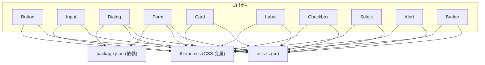
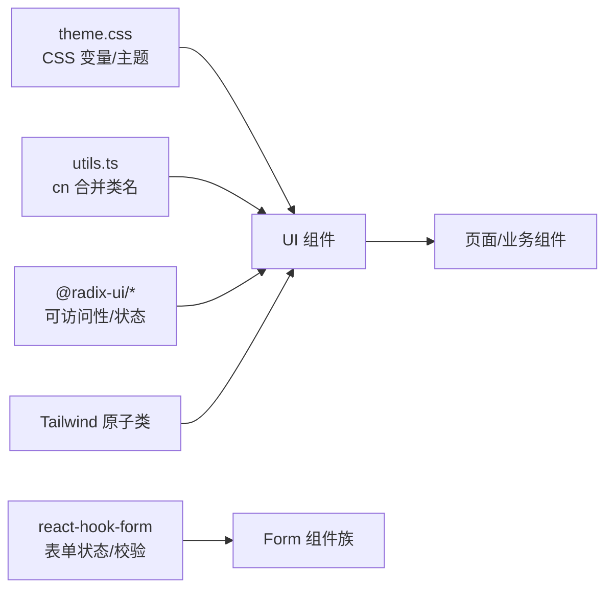
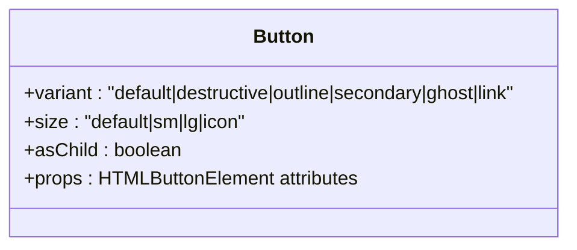
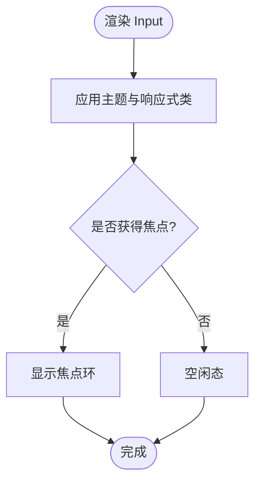
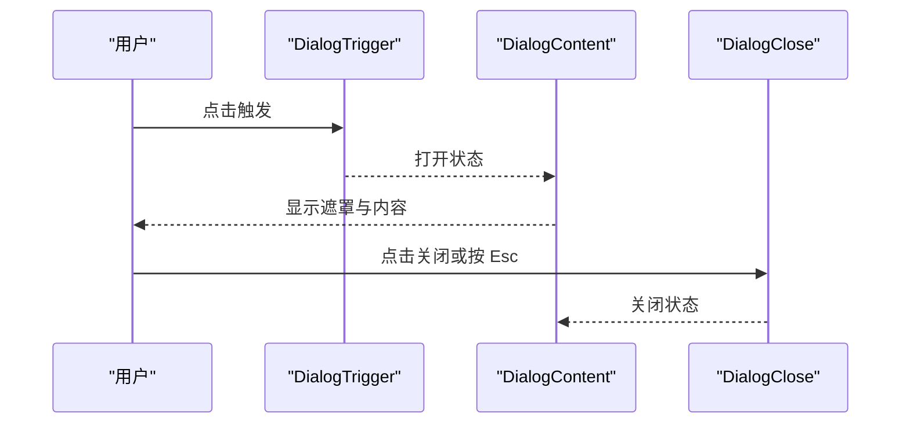
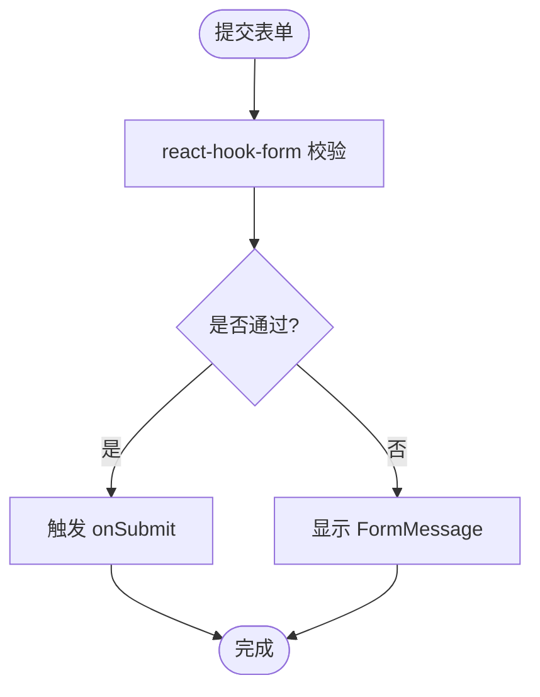
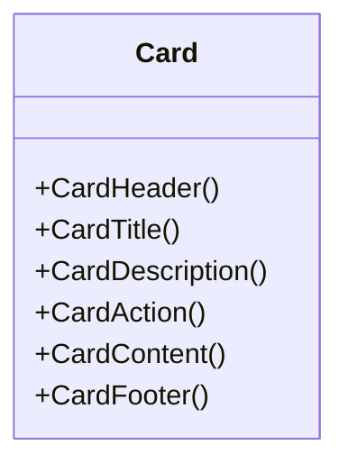
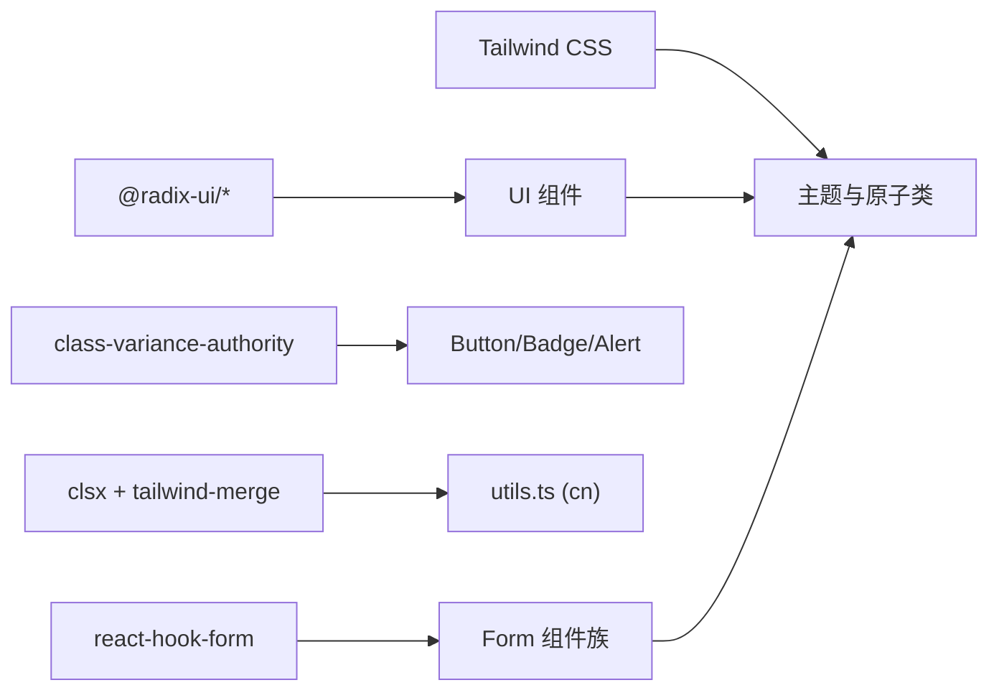

# 基础组件库

<cite>
**本文引用的文件**
- [button.tsx](file://figma-ui/src/app/components/ui/button.tsx)
- [input.tsx](file://figma-ui/src/app/components/ui/input.tsx)
- [dialog.tsx](file://figma-ui/src/app/components/ui/dialog.tsx)
- [form.tsx](file://figma-ui/src/app/components/ui/form.tsx)
- [card.tsx](file://figma-ui/src/app/components/ui/card.tsx)
- [label.tsx](file://figma-ui/src/app/components/ui/label.tsx)
- [checkbox.tsx](file://figma-ui/src/app/components/ui/checkbox.tsx)
- [select.tsx](file://figma-ui/src/app/components/ui/select.tsx)
- [alert.tsx](file://figma-ui/src/app/components/ui/alert.tsx)
- [badge.tsx](file://figma-ui/src/app/components/ui/badge.tsx)
- [utils.ts](file://figma-ui/src/app/components/ui/utils.ts)
- [theme.css](file://figma-ui/src/styles/theme.css)
- [package.json](file://figma-ui/package.json)
</cite>

## 目录
1. [简介](#简介)
2. [项目结构](#项目结构)
3. [核心组件](#核心组件)
4. [架构总览](#架构总览)
5. [详细组件分析](#详细组件分析)
6. [依赖关系分析](#依赖关系分析)
7. [性能考量](#性能考量)
8. [故障排查指南](#故障排查指南)
9. [结论](#结论)
10. [附录](#附录)

## 简介
本组件库基于 Radix UI 与 Tailwind CSS，为医案通医疗档案网站提供一套可访问、可主题化、可组合的基础 UI 组件。文档聚焦 Button、Input、Dialog、Form、Card 等核心组件，覆盖 Props 接口、事件处理、样式定制、主题支持、可访问性、响应式设计与性能优化策略，并提供组合模式与最佳实践建议。

## 项目结构
- 组件位于 figma-ui/src/app/components/ui，每个组件以独立文件组织，便于复用与维护。
- 样式通过 Tailwind 原子类与 CSS 变量（主题）统一管理，确保一致性与可定制性。
- 工具函数 cn 用于合并 class 名称，避免冲突并提升可读性。

图表来源
- [button.tsx:1-59](file://figma-ui/src/app/components/ui/button.tsx#L1-L59)
- [input.tsx:1-22](file://figma-ui/src/app/components/ui/input.tsx#L1-L22)
- [dialog.tsx:1-136](file://figma-ui/src/app/components/ui/dialog.tsx#L1-L136)
- [form.tsx:1-169](file://figma-ui/src/app/components/ui/form.tsx#L1-L169)
- [card.tsx:1-93](file://figma-ui/src/app/components/ui/card.tsx#L1-L93)
- [utils.ts:1-7](file://figma-ui/src/app/components/ui/utils.ts#L1-L7)
- [theme.css:1-218](file://figma-ui/src/styles/theme.css#L1-L218)
- [package.json:1-101](file://figma-ui/package.json#L1-L101)

章节来源
- [button.tsx:1-59](file://figma-ui/src/app/components/ui/button.tsx#L1-L59)
- [input.tsx:1-22](file://figma-ui/src/app/components/ui/input.tsx#L1-L22)
- [dialog.tsx:1-136](file://figma-ui/src/app/components/ui/dialog.tsx#L1-L136)
- [form.tsx:1-169](file://figma-ui/src/app/components/ui/form.tsx#L1-L169)
- [card.tsx:1-93](file://figma-ui/src/app/components/ui/card.tsx#L1-L93)
- [utils.ts:1-7](file://figma-ui/src/app/components/ui/utils.ts#L1-L7)
- [theme.css:1-218](file://figma-ui/src/styles/theme.css#L1-L218)
- [package.json:1-101](file://figma-ui/package.json#L1-L101)

## 核心组件
本节概述各组件的职责、Props 能力、事件机制、样式与主题、可访问性与响应式特性。

- Button：基于 class-variance-authority 的变体与尺寸系统；支持 asChild 透传；内置 focus-visible 与禁用态；可通过 className 扩展。
- Input：原生 input 封装；统一边框、焦点环、禁用态；支持 file 输入样式；响应式字体与高度。
- Dialog：基于 Radix Dialog；包含 Overlay、Content、Header、Footer、Title、Description、Close；具备动画与可访问性属性；移动端自适应宽度。
- Form：基于 react-hook-form；提供 FormProvider、FormField、FormItem、FormLabel、FormControl、FormDescription、FormMessage；自动关联 id 与 aria-*；错误状态联动 Label 与消息。
- Card：语义化容器；Header/Title/Description/Action/Content/Footer 分区布局；网格与间距控制；适合信息卡片展示。

章节来源
- [button.tsx:7-58](file://figma-ui/src/app/components/ui/button.tsx#L7-L58)
- [input.tsx:5-19](file://figma-ui/src/app/components/ui/input.tsx#L5-L19)
- [dialog.tsx:9-135](file://figma-ui/src/app/components/ui/dialog.tsx#L9-L135)
- [form.tsx:19-168](file://figma-ui/src/app/components/ui/form.tsx#L19-L168)
- [card.tsx:5-92](file://figma-ui/src/app/components/ui/card.tsx#L5-L92)

## 架构总览
组件层通过统一的样式工具与主题变量构建一致的视觉语言；Radix 提供无障碍与状态管理；react-hook-form 负责表单数据流与校验；Tailwind 原子类实现响应式与主题切换。

图表来源
- [theme.css:1-218](file://figma-ui/src/styles/theme.css#L1-L218)
- [utils.ts:1-7](file://figma-ui/src/app/components/ui/utils.ts#L1-L7)
- [package.json:20-45](file://figma-ui/package.json#L20-L45)
- [form.tsx:1-169](file://figma-ui/src/app/components/ui/form.tsx#L1-L169)

## 详细组件分析

### Button 按钮
- 职责：提供多种视觉变体与尺寸，支持作为任意子元素渲染。
- Props 接口
  - variant：default、destructive、outline、secondary、ghost、link
  - size：default、sm、lg、icon
  - asChild：布尔值，决定是否使用 Slot 透传根节点
  - 其余标准 button 属性（onClick、disabled、className 等）
- 事件处理：透传所有原生事件；asChild 时事件绑定到目标元素。
- 样式与主题：通过 cva 定义变体与尺寸；颜色来自 theme.css 的 CSS 变量；focus-visible 与禁用态已内置。
- 可访问性：保持 button 语义；禁用态不可交互；焦点环清晰。
- 响应式：尺寸与内边距适配不同屏幕；图标尺寸固定。
- 性能：无额外运行时开销；类名合并高效。
- 使用示例路径
  - 默认按钮：[button.tsx:7-58](file://figma-ui/src/app/components/ui/button.tsx#L7-L58)
  - 危险按钮：[button.tsx:13-14](file://figma-ui/src/app/components/ui/button.tsx#L13-L14)
  - 作为链接：[button.tsx:21-21](file://figma-ui/src/app/components/ui/button.tsx#L21-L21)

图表来源
- [button.tsx:7-58](file://figma-ui/src/app/components/ui/button.tsx#L7-L58)

章节来源
- [button.tsx:7-58](file://figma-ui/src/app/components/ui/button.tsx#L7-L58)

### Input 输入框
- 职责：统一样式的文本输入控件，支持 file 类型。
- Props 接口
  - type：string（如 text、email、password、file 等）
  - 其余标准 input 属性（value、onChange、placeholder、disabled、className 等）
- 事件处理：透传所有原生事件；支持 onChange、onFocus、onBlur 等。
- 样式与主题：统一边框、背景、焦点环、禁用态；移动端字体与高度调整。
- 可访问性：保留原生语义；aria-invalid 在表单中由上层设置。
- 响应式：min-w-0 防止溢出；md:text-sm 在小屏增大字号。
- 性能：轻量封装，无额外逻辑。
- 使用示例路径
  - 基础用法：[input.tsx:5-19](file://figma-ui/src/app/components/ui/input.tsx#L5-L19)
  - 文件输入：[input.tsx:11-11](file://figma-ui/src/app/components/ui/input.tsx#L11-L11)

图表来源
- [input.tsx:5-19](file://figma-ui/src/app/components/ui/input.tsx#L5-L19)

章节来源
- [input.tsx:5-19](file://figma-ui/src/app/components/ui/input.tsx#L5-L19)

### Dialog 对话框
- 职责：模态对话框，包含遮罩、内容区、标题、描述、关闭按钮与页眉/页脚。
- Props 接口
  - Root/Trigger/Portal/Close/Overlay/Content/Header/Footer/Title/Description：均透传对应 Radix 组件的属性。
- 事件处理：透传打开/关闭、键盘导航、点击外部关闭等；关闭按钮触发关闭。
- 样式与主题：入场/出场动画；移动端最大宽度限制；深色模式兼容。
- 可访问性：焦点陷阱、Esc 关闭、ARIA 状态；关闭按钮含 sr-only 提示。
- 响应式：max-w-[calc(100%-2rem)] 与 sm:max-w-lg 适配不同屏幕。
- 性能：Portal 渲染避免层级问题；动画使用 CSS。
- 使用示例路径
  - 打开/关闭流程：[dialog.tsx:9-73](file://figma-ui/src/app/components/ui/dialog.tsx#L9-L73)
  - 标题/描述：[dialog.tsx:98-122](file://figma-ui/src/app/components/ui/dialog.tsx#L98-L122)

图表来源
- [dialog.tsx:15-73](file://figma-ui/src/app/components/ui/dialog.tsx#L15-L73)

章节来源
- [dialog.tsx:9-135](file://figma-ui/src/app/components/ui/dialog.tsx#L9-L135)

### Form 表单
- 职责：基于 react-hook-form 的表单体系，提供字段上下文、标签、描述与错误消息。
- Props 接口
  - Form：FormProvider，包裹整个表单
  - FormField：Controller 包装，name 必填
  - FormItem：字段容器，生成唯一 id
  - FormLabel：关联 FormControl，错误时高亮
  - FormControl：Slot 包装，注入 id、aria-describedby、aria-invalid
  - FormDescription：辅助说明
  - FormMessage：错误消息
- 事件处理：通过 react-hook-form 的 onChange、onSubmit、validate 等；useFormField 获取 fieldState。
- 样式与主题：错误态文字与边框；描述与消息字体大小与颜色。
- 可访问性：id 关联、aria-describedby、aria-invalid；Label 与控件关联。
- 响应式：Grid 布局与间距；移动端友好。
- 性能：按需渲染消息；Context 减少重复计算。
- 使用示例路径
  - 字段上下文与状态：[form.tsx:28-66](file://figma-ui/src/app/components/ui/form.tsx#L28-L66)
  - 标签与控件关联：[form.tsx:90-124](file://figma-ui/src/app/components/ui/form.tsx#L90-L124)
  - 错误消息：[form.tsx:139-157](file://figma-ui/src/app/components/ui/form.tsx#L139-L157)

图表来源
- [form.tsx:45-66](file://figma-ui/src/app/components/ui/form.tsx#L45-L66)
- [form.tsx:139-157](file://figma-ui/src/app/components/ui/form.tsx#L139-L157)

章节来源
- [form.tsx:19-168](file://figma-ui/src/app/components/ui/form.tsx#L19-L168)

### Card 卡片
- 职责：信息展示容器，划分头部、标题、描述、动作、内容与页脚。
- Props 接口
  - Card/CardHeader/CardTitle/CardDescription/CardAction/CardContent/CardFooter：透 div 属性
- 事件处理：透传原生事件；常用于承载交互元素。
- 样式与主题：背景、边框、圆角、间距；网格布局对齐。
- 可访问性：语义化标题与段落；适合屏幕阅读器。
- 响应式：@container 与网格行高自适应。
- 性能：纯展示组件，无状态。
- 使用示例路径
  - 卡片结构与样式：[card.tsx:5-92](file://figma-ui/src/app/components/ui/card.tsx#L5-L92)

图表来源
- [card.tsx:5-92](file://figma-ui/src/app/components/ui/card.tsx#L5-L92)

章节来源
- [card.tsx:5-92](file://figma-ui/src/app/components/ui/card.tsx#L5-L92)

### 其他常用组件概览
- Label：与表单控件关联，支持禁用态与 peer-disabled 样式。
- Checkbox：基于 Radix Checkbox，带选中指示器与焦点环。
- Select：下拉选择，支持分组、分隔符、滚动按钮与 popper 定位。
- Alert：警告与提示，支持 default 与 destructive 变体。
- Badge：标签徽章，支持多种变体与 asChild。

章节来源
- [label.tsx:8-24](file://figma-ui/src/app/components/ui/label.tsx#L8-L24)
- [checkbox.tsx:9-32](file://figma-ui/src/app/components/ui/checkbox.tsx#L9-L32)
- [select.tsx:13-189](file://figma-ui/src/app/components/ui/select.tsx#L13-L189)
- [alert.tsx:6-66](file://figma-ui/src/app/components/ui/alert.tsx#L6-L66)
- [badge.tsx:7-46](file://figma-ui/src/app/components/ui/badge.tsx#L7-L46)

## 依赖关系分析
- Radix UI：提供可访问的底层原语（Dialog、Label、Select、Checkbox 等）。
- react-hook-form：表单状态管理与校验。
- class-variance-authority：组件变体与尺寸系统。
- clsx + tailwind-merge：类名合并工具。
- Tailwind CSS：原子类与主题变量映射。
- Lucide React：图标资源。

图表来源
- [package.json:20-45](file://figma-ui/package.json#L20-L45)
- [utils.ts:1-7](file://figma-ui/src/app/components/ui/utils.ts#L1-L7)
- [theme.css:95-140](file://figma-ui/src/styles/theme.css#L95-L140)

章节来源
- [package.json:20-45](file://figma-ui/package.json#L20-L45)
- [utils.ts:1-7](file://figma-ui/src/app/components/ui/utils.ts#L1-L7)
- [theme.css:95-140](file://figma-ui/src/styles/theme.css#L95-L140)

## 性能考量
- 类名合并：使用 cn 合并动态类名，避免冗余与冲突，提升渲染效率。
- 动画与过渡：Dialog 与 Select 使用 CSS 动画，GPU 加速，减少重排。
- 按需渲染：FormMessage 仅在存在错误时渲染，降低 DOM 体积。
- Portal 隔离：Dialog 使用 Portal 避免层级与样式污染。
- 主题变量：通过 CSS 变量集中管理颜色与尺寸，减少重复计算。
- 组件粒度：小且单一职责的组件，利于 Tree Shaking 与缓存。

## 故障排查指南
- 表单错误未显示
  - 检查 FormField 的 name 是否正确传入 useFormField。
  - 确认 FormMessage 是否在 FormItem 内且与 FormControl 关联。
  - 参考：[form.tsx:45-66](file://figma-ui/src/app/components/ui/form.tsx#L45-L66)、[form.tsx:139-157](file://figma-ui/src/app/components/ui/form.tsx#L139-L157)
- 焦点环不可见
  - 检查浏览器是否启用 outline 与 focus-visible；确认未覆盖 outline 样式。
  - 参考：[button.tsx:8-8](file://figma-ui/src/app/components/ui/button.tsx#L8-L8)、[input.tsx:12-12](file://figma-ui/src/app/components/ui/input.tsx#L12-L12)
- Dialog 无法关闭
  - 确认 DialogClose 正确绑定；检查是否阻止了默认行为。
  - 参考：[dialog.tsx:27-31](file://figma-ui/src/app/components/ui/dialog.tsx#L27-L31)
- 主题色不生效
  - 检查 theme.css 中 CSS 变量是否被 Tailwind 映射；确认 dark 模式类是否应用。
  - 参考：[theme.css:3-56](file://figma-ui/src/styles/theme.css#L3-L56)、[theme.css:95-140](file://figma-ui/src/styles/theme.css#L95-L140)

章节来源
- [form.tsx:45-66](file://figma-ui/src/app/components/ui/form.tsx#L45-L66)
- [form.tsx:139-157](file://figma-ui/src/app/components/ui/form.tsx#L139-L157)
- [button.tsx:8-8](file://figma-ui/src/app/components/ui/button.tsx#L8-L8)
- [input.tsx:12-12](file://figma-ui/src/app/components/ui/input.tsx#L12-L12)
- [dialog.tsx:27-31](file://figma-ui/src/app/components/ui/dialog.tsx#L27-L31)
- [theme.css:3-56](file://figma-ui/src/styles/theme.css#L3-L56)
- [theme.css:95-140](file://figma-ui/src/styles/theme.css#L95-L140)

## 结论
本组件库以 Radix 的可访问性与 react-hook-form 的表单能力为基础，结合 Tailwind 的主题系统与原子类，提供了稳定、可扩展、易用的基础 UI 组件。通过统一的样式工具与主题变量，组件在不同场景下保持一致的视觉与交互体验。建议在业务组件中优先复用这些基础组件，并通过 className 与变体进行定制，以获得最佳的维护性与性能。

## 附录

### 组件组合模式与最佳实践
- 表单组合
  - 使用 Form 包裹，FormField 管理字段，FormItem 组织布局，FormLabel 与 FormControl 关联，FormDescription 提供说明，FormMessage 显示错误。
  - 参考：[form.tsx:19-168](file://figma-ui/src/app/components/ui/form.tsx#L19-L168)
- 对话框组合
  - 使用 DialogTrigger 触发，DialogContent 承载内容，DialogHeader/Title/Description 组织信息，DialogFooter 放置操作按钮，DialogClose 提供关闭。
  - 参考：[dialog.tsx:9-135](file://figma-ui/src/app/components/ui/dialog.tsx#L9-L135)
- 按钮与标签组合
  - 使用 Badge 标注状态，Button 执行操作；注意 asChild 与事件冒泡。
  - 参考：[badge.tsx:7-46](file://figma-ui/src/app/components/ui/badge.tsx#L7-L46)、[button.tsx:7-58](file://figma-ui/src/app/components/ui/button.tsx#L7-L58)
- 可访问性要点
  - 确保所有交互元素可聚焦、有明确标签与状态；表单控件使用 htmlFor 与 id 关联；错误时使用 aria-invalid 与描述。
  - 参考：[form.tsx:90-124](file://figma-ui/src/app/components/ui/form.tsx#L90-L124)、[dialog.tsx:66-70](file://figma-ui/src/app/components/ui/dialog.tsx#L66-L70)
- 主题与样式定制
  - 通过 CSS 变量与 Tailwind 类名定制颜色、尺寸与圆角；dark 模式下自动切换。
  - 参考：[theme.css:3-56](file://figma-ui/src/styles/theme.css#L3-L56)、[theme.css:95-140](file://figma-ui/src/styles/theme.css#L95-L140)