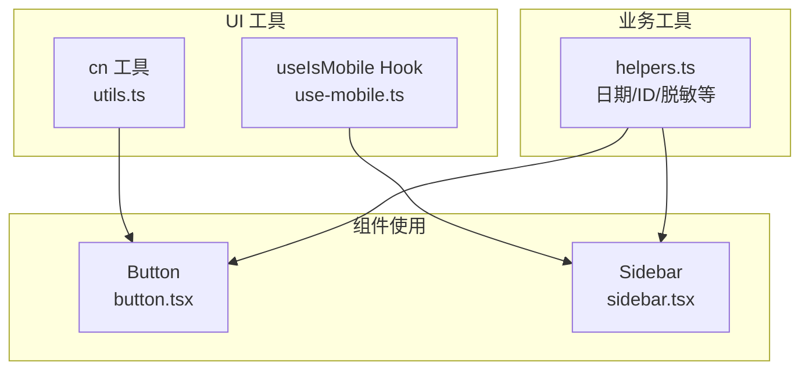
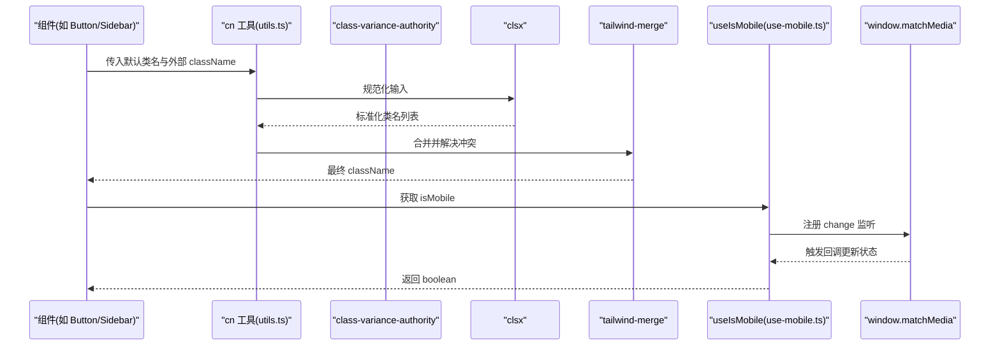
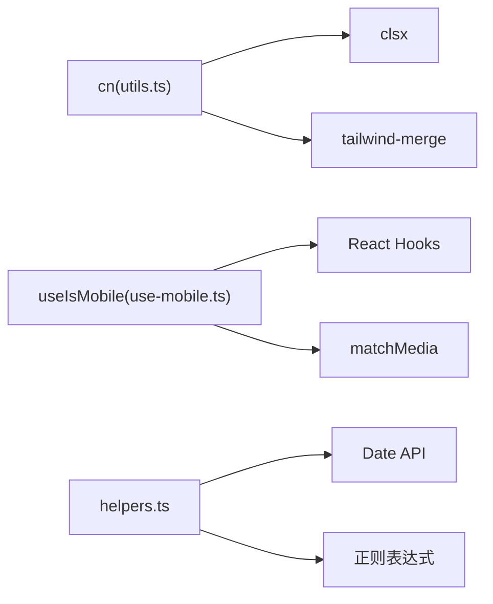

# 实用工具组件

<cite>
**本文引用的文件**
- [utils.ts](file://figma-ui/src/app/components/ui/utils.ts)
- [use-mobile.ts](file://figma-ui/src/app/components/ui/use-mobile.ts)
- [helpers.ts](file://figma-ui/src/app/utils/helpers.ts)
- [button.tsx](file://figma-ui/src/app/components/ui/button.tsx)
- [sidebar.tsx](file://figma-ui/src/app/components/ui/sidebar.tsx)
</cite>

## 目录
1. [简介](#简介)
2. [项目结构](#项目结构)
3. [核心组件](#核心组件)
4. [架构总览](#架构总览)
5. [详细组件分析](#详细组件分析)
6. [依赖关系分析](#依赖关系分析)
7. [性能考虑](#性能考虑)
8. [故障排查指南](#故障排查指南)
9. [结论](#结论)
10. [附录：使用示例与最佳实践](#附录使用示例与最佳实践)

## 简介
本章节面向医案通医疗档案网站的 UI 工具层，聚焦以下实用能力：
- cn 类名合并工具函数：用于安全、可预测地合并 Tailwind 类名，避免冲突与冗余。
- useIsMobile 移动端检测 Hook：基于 matchMedia 的响应式断点检测，提供 isMobile 布尔值。
- helpers 工具函数集：日期格式化、过期判断、随机 ID、手机号脱敏、剩余天数计算等通用能力。

这些工具被广泛复用在 UI 组件（如 Button、Sidebar）中，确保样式一致性与跨端体验一致性。

## 项目结构
工具相关代码主要分布在以下位置：
- 类名合并工具：位于 UI 组件目录下的 utils.ts，并在 lib 下提供同构导出。
- 移动端检测 Hook：位于 UI 组件目录下的 use-mobile.ts。
- 业务工具函数：位于 app/utils/helpers.ts。
- 典型使用场景：Button 通过 cva + cn 组合生成样式；Sidebar 通过 useIsMobile 切换移动端行为。

图表来源
- [utils.ts:1-7](file://figma-ui/src/app/components/ui/utils.ts#L1-L7)
- [use-mobile.ts:1-22](file://figma-ui/src/app/components/ui/use-mobile.ts#L1-L22)
- [helpers.ts:1-52](file://figma-ui/src/app/utils/helpers.ts#L1-L52)
- [button.tsx:1-59](file://figma-ui/src/app/components/ui/button.tsx#L1-L59)
- [sidebar.tsx:1-200](file://figma-ui/src/app/components/ui/sidebar.tsx#L1-L200)

章节来源
- [utils.ts:1-7](file://figma-ui/src/app/components/ui/utils.ts#L1-L7)
- [use-mobile.ts:1-22](file://figma-ui/src/app/components/ui/use-mobile.ts#L1-L22)
- [helpers.ts:1-52](file://figma-ui/src/app/utils/helpers.ts#L1-L52)
- [button.tsx:1-59](file://figma-ui/src/app/components/ui/button.tsx#L1-L59)
- [sidebar.tsx:1-200](file://figma-ui/src/app/components/ui/sidebar.tsx#L1-L200)

## 核心组件
本节对三类核心工具进行说明：参数规范、返回值格式、使用场景与设计原理。

- cn 类名合并工具
  - 作用：将多个类名输入安全合并，优先保留后传入的类，自动去重并处理 Tailwind 覆盖。
  - 参数：可变数量的 ClassValue（字符串、对象、数组、条件值）。
  - 返回：合并后的字符串类名。
  - 设计原理：先通过 clsx 规范化输入，再用 tailwind-merge 解决 Tailwind 类冲突与覆盖顺序问题。
  - 典型场景：为组件 props.className 与内部默认类名合并，保证外部覆盖可控。
  - 参考实现路径：[utils.ts:1-7](file://figma-ui/src/app/components/ui/utils.ts#L1-L7)

- useIsMobile 移动端检测 Hook
  - 作用：监听窗口宽度变化，返回当前是否为移动端（isMobile 布尔值）。
  - 断点：小于 768px 视为移动端。
  - 行为：首次渲染同步设置状态，并通过 matchMedia 监听 change 事件更新状态；组件卸载时移除监听。
  - 返回：boolean（true 表示移动端）。
  - 典型场景：在 Sidebar 等布局组件中根据 isMobile 切换展示模式（抽屉 vs 侧边栏）。
  - 参考实现路径：[use-mobile.ts:1-22](file://figma-ui/src/app/components/ui/use-mobile.ts#L1-L22)

- helpers 工具函数集
  - formatDate / formatDateShort：将 Date 或日期字符串格式化为中文本地化日期。
  - isExpired：判断给定日期是否已过期。
  - generateId：生成短 ID（时间戳+随机片段），适用于临时标识。
  - maskPhone：手机号中间四位掩码，保护隐私。
  - daysUntilExpiry：计算距离过期的天数（向上取整）。
  - 参考实现路径：[helpers.ts:1-52](file://figma-ui/src/app/utils/helpers.ts#L1-L52)

章节来源
- [utils.ts:1-7](file://figma-ui/src/app/components/ui/utils.ts#L1-L7)
- [use-mobile.ts:1-22](file://figma-ui/src/app/components/ui/use-mobile.ts#L1-L22)
- [helpers.ts:1-52](file://figma-ui/src/app/utils/helpers.ts#L1-L52)

## 架构总览
下图展示了工具函数与组件之间的调用关系，以及数据流与控制流。

图表来源
- [utils.ts:1-7](file://figma-ui/src/app/components/ui/utils.ts#L1-L7)
- [use-mobile.ts:1-22](file://figma-ui/src/app/components/ui/use-mobile.ts#L1-L22)
- [button.tsx:1-59](file://figma-ui/src/app/components/ui/button.tsx#L1-L59)
- [sidebar.tsx:1-200](file://figma-ui/src/app/components/ui/sidebar.tsx#L1-L200)

## 详细组件分析

### cn 类名合并工具
- 设计要点
  - 使用 clsx 处理条件类名、数组、对象等复杂输入，提升易用性。
  - 使用 tailwind-merge 保证 Tailwind 类的覆盖顺序正确，避免重复与冲突。
- 复杂度
  - 时间复杂度近似 O(n)，n 为输入类名数量。
  - 空间复杂度近似 O(n)，用于存储合并结果。
- 扩展方法
  - 可在外层封装主题前缀或品牌类名前缀策略。
  - 可结合 CSS-in-JS 方案统一注入全局类名策略。
- 错误处理
  - 输入非法类型会被 clsx 忽略或抛出明确异常，建议在组件层做 PropTypes/TS 约束。
- 性能建议
  - 避免在高频渲染中创建大量临时数组或对象作为 className 输入。
  - 将常用类名组合提取为常量或函数，减少运行时开销。

章节来源
- [utils.ts:1-7](file://figma-ui/src/app/components/ui/utils.ts#L1-L7)

### useIsMobile 移动端检测 Hook
- 设计要点
  - 使用 window.matchMedia 监听 max-width 断点变化，保证响应式行为准确。
  - 初始状态设为 undefined，在 effect 中同步设置，避免 SSR 不一致。
  - 清理逻辑完善：组件卸载时移除事件监听，防止内存泄漏。
- 复杂度
  - 时间复杂度 O(1) 每次状态更新。
  - 空间复杂度 O(1)。
- 扩展方法
  - 支持自定义断点配置，便于多端适配。
  - 可封装 useBreakpoint 以支持多断点查询。
- 错误处理
  - 在非浏览器环境（SSR）需降级处理，避免访问 window。
- 性能建议
  - 仅在需要响应式行为的组件中使用，避免全局频繁重渲染。
  - 可将 isMobile 提升到更高层级缓存，减少重复订阅。

章节来源
- [use-mobile.ts:1-22](file://figma-ui/src/app/components/ui/use-mobile.ts#L1-L22)

### helpers 工具函数集
- 设计要点
  - 统一日期处理入口，支持 string | Date 输入，增强健壮性。
  - 隐私保护：maskPhone 对敏感信息进行脱敏。
  - 业务语义清晰：isExpired、daysUntilExpiry 直接表达业务意图。
- 复杂度
  - 均为 O(1) 操作，无额外内存分配。
- 扩展方法
  - 可扩展国际化日期格式、时区处理、相对时间显示等。
  - 可增加校验函数（如手机号格式校验）。
- 错误处理
  - 对无效日期应返回默认值或抛出明确错误，由调用方决定处理方式。
- 性能建议
  - 避免在渲染循环中重复调用，必要时缓存结果或使用 useMemo。

章节来源
- [helpers.ts:1-52](file://figma-ui/src/app/utils/helpers.ts#L1-L52)

### 组件中的实际应用

#### Button 组件与 cn 的结合
- 使用 class-variance-authority 定义变体与尺寸，再通过 cn 合并外部 className，确保覆盖顺序正确。
- 典型调用路径：
  - 组件内部：cva 生成基础类名 -> cn 合并外部传入 -> 最终渲染。
- 参考路径：[button.tsx:1-59](file://figma-ui/src/app/components/ui/button.tsx#L1-L59)

章节来源
- [button.tsx:1-59](file://figma-ui/src/app/components/ui/button.tsx#L1-L59)

#### Sidebar 组件与 useIsMobile 的结合
- 在移动端使用 Sheet 抽屉形式展示侧边栏，桌面端则使用常驻侧边栏。
- 通过 useIsMobile 控制 openMobile 与 toggleSidebar 的行为差异。
- 参考路径：[sidebar.tsx:1-200](file://figma-ui/src/app/components/ui/sidebar.tsx#L1-L200)

章节来源
- [sidebar.tsx:1-200](file://figma-ui/src/app/components/ui/sidebar.tsx#L1-L200)

## 依赖关系分析
- cn 依赖
  - clsx：负责类名规范化与条件合并。
  - tailwind-merge：负责 Tailwind 类冲突解决与覆盖顺序。
- useIsMobile 依赖
  - React：useState、useEffect。
  - window.matchMedia：响应式断点监听。
- helpers 依赖
  - 原生 Date API：日期解析与计算。
  - 正则表达式：手机号脱敏。

图表来源
- [utils.ts:1-7](file://figma-ui/src/app/components/ui/utils.ts#L1-L7)
- [use-mobile.ts:1-22](file://figma-ui/src/app/components/ui/use-mobile.ts#L1-L22)
- [helpers.ts:1-52](file://figma-ui/src/app/utils/helpers.ts#L1-L52)

章节来源
- [utils.ts:1-7](file://figma-ui/src/app/components/ui/utils.ts#L1-L7)
- [use-mobile.ts:1-22](file://figma-ui/src/app/components/ui/use-mobile.ts#L1-L22)
- [helpers.ts:1-52](file://figma-ui/src/app/utils/helpers.ts#L1-L52)

## 性能考虑
- 类名合并
  - 避免在高频渲染中构造复杂的 className 表达式，尽量使用常量或 memo 化。
  - 合理使用 cva 预定义变体，减少运行时分支。
- 移动端检测
  - 只在必要处订阅 matchMedia，避免全局监听导致不必要的重渲染。
  - 若多处使用，可封装共享状态以减少重复监听。
- 工具函数
  - 日期格式化与计算结果可缓存，避免重复计算。
  - 手机号脱敏等纯函数适合配合 useMemo 使用。

## 故障排查指南
- cn 合并结果不符合预期
  - 检查传入的 className 是否存在冲突或拼写错误。
  - 确认外部 className 是否在内部默认类之后传入，以保证覆盖顺序。
  - 参考路径：[utils.ts:1-7](file://figma-ui/src/app/components/ui/utils.ts#L1-L7)
- useIsMobile 未更新或报错
  - 确认运行环境支持 window.matchMedia（SSR 需降级）。
  - 检查组件是否正确挂载与卸载，确保事件监听被清理。
  - 参考路径：[use-mobile.ts:1-22](file://figma-ui/src/app/components/ui/use-mobile.ts#L1-L22)
- helpers 工具函数异常
  - 日期格式不正确会导致解析失败，建议在调用前校验或捕获异常。
  - 手机号脱敏需确保输入为字符串且长度符合预期。
  - 参考路径：[helpers.ts:1-52](file://figma-ui/src/app/utils/helpers.ts#L1-L52)

章节来源
- [utils.ts:1-7](file://figma-ui/src/app/components/ui/utils.ts#L1-L7)
- [use-mobile.ts:1-22](file://figma-ui/src/app/components/ui/use-mobile.ts#L1-L22)
- [helpers.ts:1-52](file://figma-ui/src/app/utils/helpers.ts#L1-L52)

## 结论
本项目通过 cn、useIsMobile 与 helpers 构建了稳定、可复用的工具层：
- cn 解决了 Tailwind 类名合并与覆盖问题，提升了组件样式的可维护性。
- useIsMobile 提供了简洁的响应式能力，支撑了移动端与桌面端的差异化交互。
- helpers 集中了常见的业务工具函数，降低了重复实现成本。
在实际开发中，建议遵循本文的最佳实践与性能建议，以获得更好的可维护性与用户体验。

## 附录：使用示例与最佳实践

- cn 使用示例（示意）
  - 在组件中将内部默认类与外部 className 合并，确保覆盖顺序正确。
  - 参考路径：[button.tsx:1-59](file://figma-ui/src/app/components/ui/button.tsx#L1-L59)

- useIsMobile 使用示例（示意）
  - 在 Sidebar 中根据 isMobile 切换抽屉与侧边栏模式。
  - 参考路径：[sidebar.tsx:1-200](file://figma-ui/src/app/components/ui/sidebar.tsx#L1-L200)

- helpers 使用示例（示意）
  - 使用 formatDate/formatDateShort 展示本地化日期。
  - 使用 isExpired/daysUntilExpiry 管理有效期提醒。
  - 使用 generateId 生成唯一标识。
  - 使用 maskPhone 对手机号进行脱敏展示。
  - 参考路径：[helpers.ts:1-52](file://figma-ui/src/app/utils/helpers.ts#L1-L52)

- 最佳实践
  - 将常用类名组合抽取为常量或函数，减少重复。
  - 在高频渲染路径中避免创建大型对象或数组作为 className。
  - 对响应式逻辑进行分层管理，避免在深层组件中重复订阅。
  - 对工具函数进行单元测试，确保边界条件与异常路径的正确性。