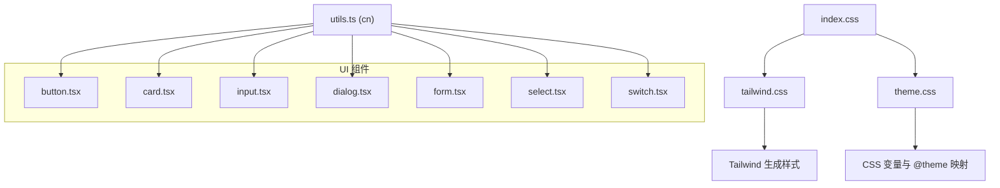
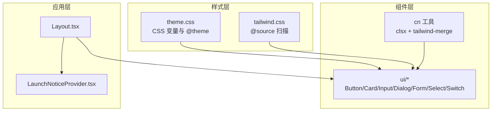
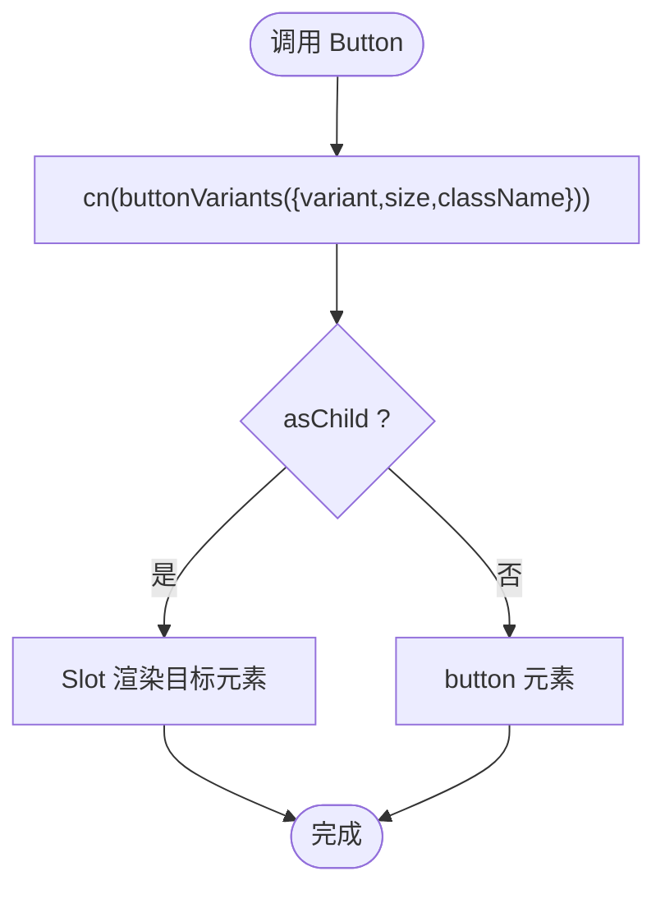
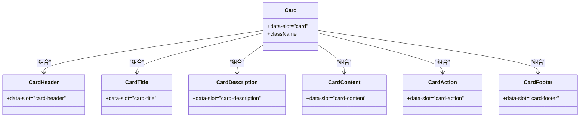
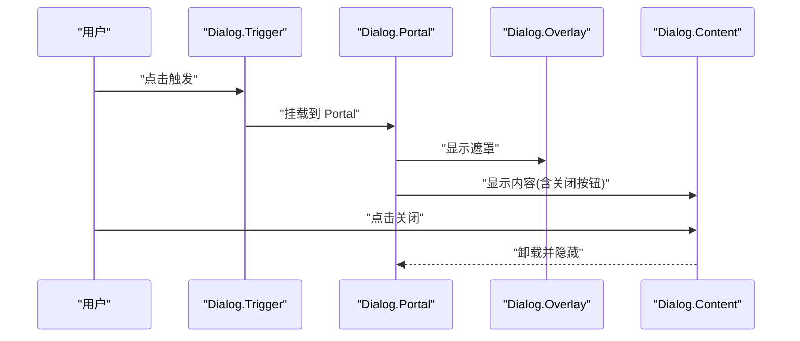
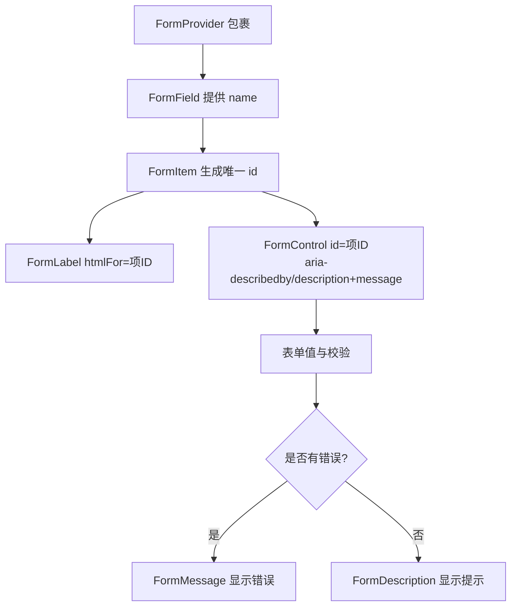
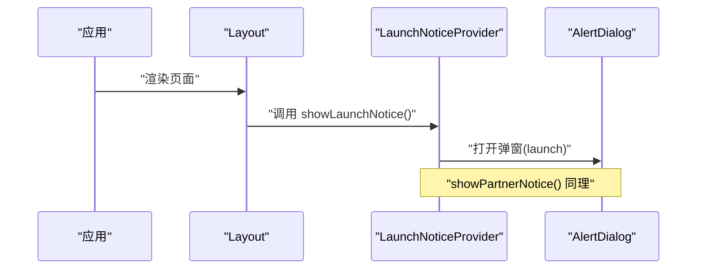
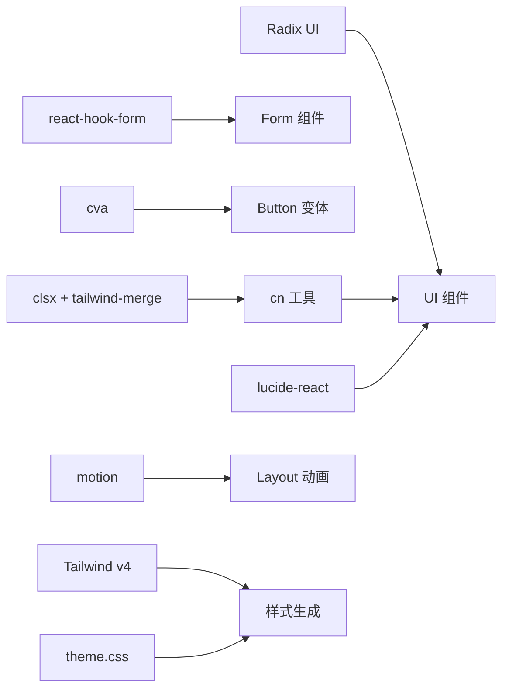

# 组件设计规范

<cite>
**本文引用的文件**
- [package.json](file://figma-ui/package.json)
- [tailwind.css](file://figma-ui/src/styles/tailwind.css)
- [theme.css](file://figma-ui/src/styles/theme.css)
- [index.css](file://figma-ui/src/styles/index.css)
- [utils.ts](file://figma-ui/src/app/components/ui/utils.ts)
- [utils.ts](file://figma-ui/src/lib/utils.ts)
- [button.tsx](file://figma-ui/src/app/components/ui/button.tsx)
- [card.tsx](file://figma-ui/src/app/components/ui/card.tsx)
- [input.tsx](file://figma-ui/src/app/components/ui/input.tsx)
- [dialog.tsx](file://figma-ui/src/app/components/ui/dialog.tsx)
- [form.tsx](file://figma-ui/src/app/components/ui/form.tsx)
- [select.tsx](file://figma-ui/src/app/components/ui/select.tsx)
- [switch.tsx](file://figma-ui/src/app/components/ui/switch.tsx)
- [Layout.tsx](file://figma-ui/src/app/components/Layout.tsx)
- [LaunchNoticeProvider.tsx](file://figma-ui/src/app/components/LaunchNoticeProvider.tsx)
</cite>

## 目录
1. [简介](#简介)
2. [项目结构](#项目结构)
3. [核心组件](#核心组件)
4. [架构总览](#架构总览)
5. [详细组件分析](#详细组件分析)
6. [依赖关系分析](#依赖关系分析)
7. [性能考虑](#性能考虑)
8. [故障排查指南](#故障排查指南)
9. [结论](#结论)
10. [附录](#附录)

## 简介
本规范面向医案通医疗档案网站的组件设计与实现，统一组件设计原则、命名约定、代码与样式规范，明确可复用性、组合模式、状态管理、错误处理策略，并说明主题系统（CSS 变量与 Tailwind CSS）工作原理。同时提供可访问性标准、性能优化技巧、测试策略以及文档编写与版本管理指南，帮助团队高效构建一致、可维护、可扩展的 UI 组件库。

## 项目结构
- 样式体系
  - 入口样式：index.css 引入字体、Tailwind、主题变量
  - Tailwind 配置：通过 @import 'tailwindcss' 与 @source 扫描源码中的类名；引入动画库 tw-animate-css
  - 主题变量：在 theme.css 中定义 CSS 变量，并通过 @theme inline 映射到 Tailwind 语义化颜色与圆角等
- 组件组织
  - 基础 UI 组件：位于 src/app/components/ui，采用 Radix 无样式原子组件 + Tailwind 样式封装
  - 业务布局与上下文：Layout.tsx、LaunchNoticeProvider.tsx 等
- 工具函数
  - cn 工具：基于 clsx 与 tailwind-merge 合并类名，避免冲突

**图表来源**
- [index.css:1-4](file://figma-ui/src/styles/index.css#L1-L4)
- [tailwind.css:1-5](file://figma-ui/src/styles/tailwind.css#L1-L5)
- [theme.css:1-218](file://figma-ui/src/styles/theme.css#L1-L218)
- [utils.ts:1-7](file://figma-ui/src/app/components/ui/utils.ts#L1-L7)
- [button.tsx:1-59](file://figma-ui/src/app/components/ui/button.tsx#L1-L59)
- [card.tsx:1-93](file://figma-ui/src/app/components/ui/card.tsx#L1-L93)
- [input.tsx:1-22](file://figma-ui/src/app/components/ui/input.tsx#L1-L22)
- [dialog.tsx:1-136](file://figma-ui/src/app/components/ui/dialog.tsx#L1-L136)
- [form.tsx:1-169](file://figma-ui/src/app/components/ui/form.tsx#L1-L169)
- [select.tsx:1-190](file://figma-ui/src/app/components/ui/select.tsx#L1-L190)
- [switch.tsx:1-32](file://figma-ui/src/app/components/ui/switch.tsx#L1-L32)

**章节来源**
- [index.css:1-4](file://figma-ui/src/styles/index.css#L1-L4)
- [tailwind.css:1-5](file://figma-ui/src/styles/tailwind.css#L1-L5)
- [theme.css:1-218](file://figma-ui/src/styles/theme.css#L1-L218)

## 核心组件
- 按钮 Button
  - 使用 class-variance-authority 定义 variant 与 size 变体，结合 cn 合并类名
  - 支持 asChild 透传为任意元素，便于与路由或第三方组件组合
- 卡片 Card
  - 拆分为 CardHeader/CardTitle/CardDescription/CardContent/CardAction/CardFooter，遵循组合模式
  - 使用 data-slot 标记子区域，便于定位与测试
- 输入 Input
  - 统一的边框、焦点环、禁用态、无效态样式，适配暗色主题
- 对话框 Dialog
  - 基于 Radix Dialog，包含 Overlay、Portal、Close、Header/Footer、Title/Description
  - 内置关闭按钮与无障碍描述
- 表单 Form
  - 基于 react-hook-form 的 FormProvider/Controller，提供 FormItem/FormLabel/FormControl/FormDescription/FormMessage
  - 自动关联 aria-describedby、aria-invalid，提升可访问性
- 选择 Select
  - 基于 Radix Select，支持 Trigger/Content/Item/Group/Separator/Scroll 按钮
  - 内容区使用 Portal 渲染，支持 popper 定位
- 开关 Switch
  - 基于 Radix Switch，状态驱动样式，支持禁用与焦点环

**章节来源**
- [button.tsx:1-59](file://figma-ui/src/app/components/ui/button.tsx#L1-L59)
- [card.tsx:1-93](file://figma-ui/src/app/components/ui/card.tsx#L1-L93)
- [input.tsx:1-22](file://figma-ui/src/app/components/ui/input.tsx#L1-L22)
- [dialog.tsx:1-136](file://figma-ui/src/app/components/ui/dialog.tsx#L1-L136)
- [form.tsx:1-169](file://figma-ui/src/app/components/ui/form.tsx#L1-L169)
- [select.tsx:1-190](file://figma-ui/src/app/components/ui/select.tsx#L1-L190)
- [switch.tsx:1-32](file://figma-ui/src/app/components/ui/switch.tsx#L1-L32)

## 架构总览
- 样式层
  - 通过 theme.css 定义 CSS 变量，并使用 @theme inline 将变量映射到 Tailwind 的颜色、圆角等语义化 token
  - tailwind.css 启用 @source 扫描 React 源码中的类名，确保按需生成样式
- 组件层
  - 所有 UI 组件统一使用 cn 工具合并类名，保证样式优先级可控
  - 复杂交互组件基于 Radix 无样式原子组件，确保可访问性与行为正确性
- 应用层
  - Layout 负责页面骨架与导航，集成 LaunchNoticeProvider 提供的全局通知能力
  - 业务页面通过组合基础组件快速搭建界面

**图表来源**
- [theme.css:95-140](file://figma-ui/src/styles/theme.css#L95-L140)
- [tailwind.css:1-5](file://figma-ui/src/styles/tailwind.css#L1-L5)
- [utils.ts:1-7](file://figma-ui/src/app/components/ui/utils.ts#L1-L7)
- [Layout.tsx:1-251](file://figma-ui/src/app/components/Layout.tsx#L1-L251)
- [LaunchNoticeProvider.tsx:1-118](file://figma-ui/src/app/components/LaunchNoticeProvider.tsx#L1-L118)

## 详细组件分析

### 按钮 Button
- 设计要点
  - 使用 cva 声明变体与尺寸，默认 variant=default、size=default
  - 支持 asChild 以 Slot 透传，便于与路由链接或图标组合
  - 统一焦点环与无效态样式，适配暗色主题
- 数据流
  - 外部传入 className → cn 合并 → 渲染 button 或 Slot 目标元素
- 可访问性
  - 保持原生 button 语义，必要时通过 aria-* 扩展

**图表来源**
- [button.tsx:7-58](file://figma-ui/src/app/components/ui/button.tsx#L7-L58)

**章节来源**
- [button.tsx:1-59](file://figma-ui/src/app/components/ui/button.tsx#L1-L59)

### 卡片 Card
- 设计要点
  - 组合式拆分：Header/Title/Description/Content/Action/Footer，职责单一
  - 使用 data-slot 标识各子区域，便于自动化测试与调试
- 布局
  - Header 使用网格布局，支持 Action 右侧对齐
- 可访问性
  - Title 使用 h4，语义清晰

**图表来源**
- [card.tsx:5-92](file://figma-ui/src/app/components/ui/card.tsx#L5-L92)

**章节来源**
- [card.tsx:1-93](file://figma-ui/src/app/components/ui/card.tsx#L1-L93)

### 输入 Input
- 设计要点
  - 统一边框、背景、占位符、禁用态、无效态样式
  - 焦点环与选中高亮使用主题色
- 可访问性
  - 原生 input 语义，配合表单组件时由上层设置 aria-*

**章节来源**
- [input.tsx:1-22](file://figma-ui/src/app/components/ui/input.tsx#L1-L22)

### 对话框 Dialog
- 设计要点
  - 基于 Radix Dialog，提供 Root/Trigger/Portal/Overlay/Content/Close/Header/Footer/Title/Description
  - Content 内嵌 Close 按钮，带 sr-only 文本，确保屏幕阅读器可用
- 动画
  - 打开/关闭使用淡入淡出与缩放过渡

**图表来源**
- [dialog.tsx:9-135](file://figma-ui/src/app/components/ui/dialog.tsx#L9-L135)

**章节来源**
- [dialog.tsx:1-136](file://figma-ui/src/app/components/ui/dialog.tsx#L1-L136)

### 表单 Form
- 设计要点
  - 基于 react-hook-form 的 Provider/Controller，统一管理字段状态与校验
  - FormItem/FormLabel/FormControl/FormDescription/FormMessage 协作，自动建立 ID 关联与 aria 属性
- 可访问性
  - FormControl 设置 id、aria-describedby、aria-invalid，FormMessage 仅在错误时渲染

**图表来源**
- [form.tsx:19-168](file://figma-ui/src/app/components/ui/form.tsx#L19-L168)

**章节来源**
- [form.tsx:1-169](file://figma-ui/src/app/components/ui/form.tsx#L1-L169)

### 选择 Select
- 设计要点
  - 基于 Radix Select，提供 Trigger/Content/Item/Group/Separator/滚动按钮
  - Content 使用 Portal 渲染，支持 popper 定位与视口自适应
- 可访问性
  - 选项键盘导航、指示器、禁用态均符合无障碍要求

**章节来源**
- [select.tsx:1-190](file://figma-ui/src/app/components/ui/select.tsx#L1-L190)

### 开关 Switch
- 设计要点
  - 基于 Radix Switch，状态驱动外观，支持禁用与焦点环
- 可访问性
  - 原生 switch 语义，配合标签与描述信息

**章节来源**
- [switch.tsx:1-32](file://figma-ui/src/app/components/ui/switch.tsx#L1-L32)

### 布局与全局通知
- Layout
  - 固定头部、响应式导航、移动端菜单动画、页脚信息
  - 集成 useHomeSectionNav 进行首页锚点跳转
- LaunchNoticeProvider
  - 通过 Context 暴露 showLaunchNotice/showPartnerNotice
  - 内部使用 AlertDialog 展示二维码与文案，支持关闭

**图表来源**
- [Layout.tsx:1-251](file://figma-ui/src/app/components/Layout.tsx#L1-L251)
- [LaunchNoticeProvider.tsx:1-118](file://figma-ui/src/app/components/LaunchNoticeProvider.tsx#L1-L118)

**章节来源**
- [Layout.tsx:1-251](file://figma-ui/src/app/components/Layout.tsx#L1-L251)
- [LaunchNoticeProvider.tsx:1-118](file://figma-ui/src/app/components/LaunchNoticeProvider.tsx#L1-L118)

## 依赖关系分析
- 运行时依赖
  - Radix UI 系列：提供无样式、可访问的基础组件
  - react-hook-form：表单状态与校验
  - class-variance-authority：组件变体管理
  - clsx + tailwind-merge：类名合并与去重
  - lucide-react：图标
  - motion/react：动画
  - next-themes：主题切换（若使用）
- 构建与样式
  - Vite + @vitejs/plugin-react
  - Tailwind v4 + @tailwindcss/vite
  - tw-animate-css：动画类库

**图表来源**
- [package.json:14-81](file://figma-ui/package.json#L14-L81)
- [utils.ts:1-7](file://figma-ui/src/app/components/ui/utils.ts#L1-L7)
- [theme.css:95-140](file://figma-ui/src/styles/theme.css#L95-L140)

**章节来源**
- [package.json:14-81](file://figma-ui/package.json#L14-L81)

## 性能考虑
- 样式生成
  - 使用 Tailwind v4 的 @source 仅扫描必要文件，减少无用样式
  - 通过 @theme inline 将 CSS 变量映射到 Tailwind，避免重复定义
- 组件渲染
  - 使用 Radix 的 Portal 与受控状态，减少重排重绘
  - 列表与长内容使用虚拟滚动或分页（如需要）
- 资源加载
  - 图片懒加载与合适的格式（WebP/AVIF）
  - 图标使用矢量图标库并按需引入
- 交互优化
  - 动画使用 transform/opacity 等合成属性
  - 避免在高频事件中进行昂贵计算

[本节为通用指导，不直接分析具体文件]

## 故障排查指南
- 样式未生效
  - 检查 index.css 是否正确引入 tailwind.css 与 theme.css
  - 确认 Tailwind 已配置 @source 扫描 React 源码
- 主题变量不生效
  - 确认 theme.css 中 @theme inline 已映射所需 token
  - 检查 dark 模式下变量覆盖是否正确
- 表单验证与可访问性
  - 确保 FormField 被 FormProvider 包裹
  - 检查 FormControl 是否设置了正确的 id 与 aria-*
- 弹窗无法关闭或遮挡
  - 检查 Dialog 的 z-index 与 Portal 挂载位置
  - 确认关闭按钮的事件绑定未被阻止冒泡

**章节来源**
- [index.css:1-4](file://figma-ui/src/styles/index.css#L1-L4)
- [tailwind.css:1-5](file://figma-ui/src/styles/tailwind.css#L1-L5)
- [theme.css:1-218](file://figma-ui/src/styles/theme.css#L1-L218)
- [form.tsx:19-168](file://figma-ui/src/app/components/ui/form.tsx#L19-L168)
- [dialog.tsx:9-135](file://figma-ui/src/app/components/ui/dialog.tsx#L9-L135)

## 结论
本项目通过 Radix 原子组件与 Tailwind 主题变量构建了统一、可访问、易扩展的 UI 组件体系。借助 cn 工具与 class-variance-authority，实现了灵活的变体管理与类名合并；通过 context 与 provider 模式管理全局状态与通知。建议团队在新增组件时严格遵循本规范，确保一致性、可维护性与可访问性。

[本节为总结，不直接分析具体文件]

## 附录

### 组件设计原则
- 单一职责：每个组件只做一件事，组合优于继承
- 可配置：通过 props 控制外观与行为，默认值合理
- 可访问性：优先使用语义化 HTML 与 ARIA 属性
- 主题友好：使用 CSS 变量与 Tailwind 语义化 token
- 可测试：使用 data-slot 与稳定的 DOM 结构便于自动化测试

### 命名约定
- 组件文件：小驼峰，如 button.tsx、card.tsx
- 导出名称：大驼峰，与文件名对应
- Props：语义化命名，布尔前缀用 is/has/show/hide
- 变体：使用 variant/size 等通用键，集中管理 cva 变体
- 类名：使用 Tailwind 原子类，避免自定义类名滥用

### 代码结构与样式规范
- 组件结构：先类型与常量，再逻辑与渲染
- 样式：优先 Tailwind 原子类，必要时使用 cn 合并
- 主题：通过 CSS 变量与 @theme 映射，不在组件内硬编码颜色
- 动画：使用 motion 或 Tailwind 动画类，避免过度动画

### 可复用性与组合模式
- 组合：将复杂组件拆分为多个小组件（如 Card*）
- 插槽：使用 Slot 或 children 透传内容
- 变体：使用 cva 管理 variant/size 等维度

### 状态管理模式
- 局部状态：useState/useReducer
- 表单状态：react-hook-form 统一管理
- 全局状态：Context + Provider（如 LaunchNoticeProvider）
- 副作用：useEffect/useCallback/useMemo 合理使用

### 错误处理策略
- 边界：对关键路径添加 try/catch 与错误边界
- 反馈：对用户可见的错误提供友好提示
- 日志：生产环境记录必要错误信息

### 主题系统与 Tailwind 配置
- CSS 变量：在 theme.css 中定义，dark 模式覆盖
- @theme inline：将变量映射到 Tailwind 颜色、圆角等
- 扫描：tailwind.css 使用 @source 扫描源码，确保按需生成

**章节来源**
- [theme.css:1-218](file://figma-ui/src/styles/theme.css#L1-L218)
- [tailwind.css:1-5](file://figma-ui/src/styles/tailwind.css#L1-L5)

### 可访问性标准
- 语义化：使用合适 HTML 元素（h1-h4、button、input 等）
- 键盘导航：确保 Tab 顺序合理，支持 Enter/Space
- 屏幕阅读器：提供 alt、aria-label、aria-describedby
- 对比度：确保文本与背景对比度达标

### 性能优化技巧
- 渲染：避免不必要的重渲染，合理使用 memo
- 网络：请求合并与缓存，图片懒加载
- 样式：减少重排重绘，使用合成属性动画

### 测试策略
- 单元测试：针对工具函数与纯组件逻辑
- 组件测试：使用 data-slot 定位节点，模拟用户交互
- 快照测试：谨慎使用，关注关键 UI 变化
- 可访问性测试：使用 axe 等工具检测

### 组件文档编写规范
- 基本信息：组件用途、适用场景
- API：Props 类型、默认值、示例
- 变体：列出所有 variant/size 及效果
- 可访问性：说明键盘与屏幕阅读器支持
- 主题：说明如何定制颜色与尺寸

### 版本管理指南
- 语义化版本：主版本破坏性变更，次版本新功能，补丁修复
- 变更记录：CHANGELOG 记录重要变更与迁移指引
- 兼容性：标注支持的 React/Tailwind/Radix 版本范围

[本节为通用指导，不直接分析具体文件]