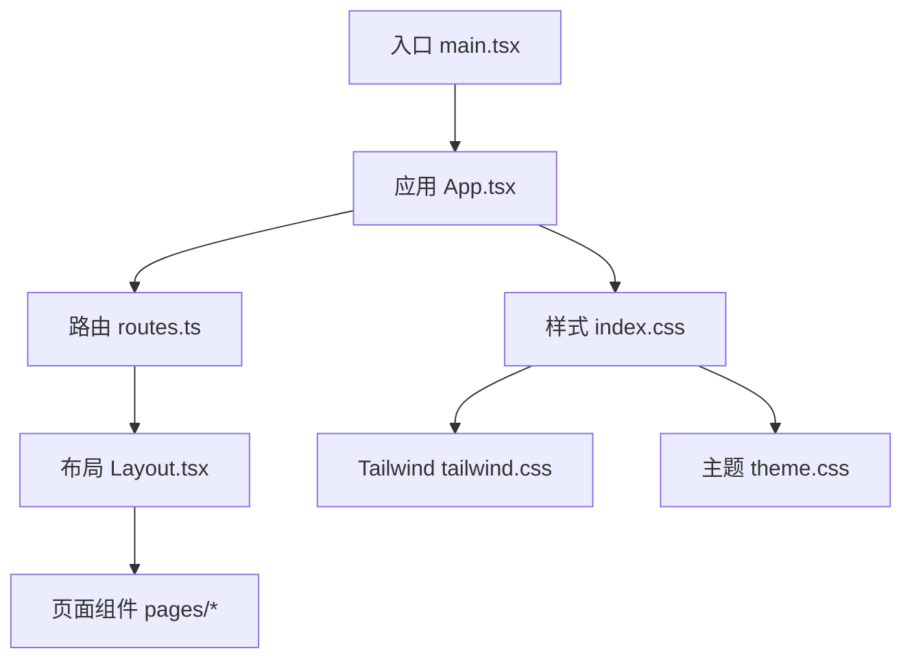
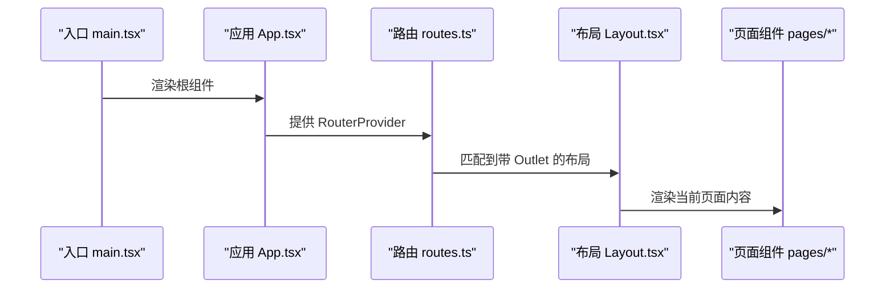
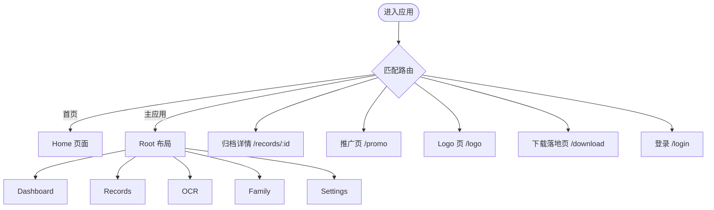
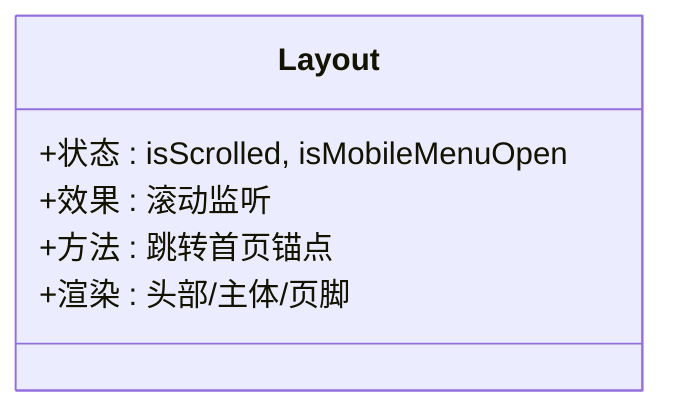
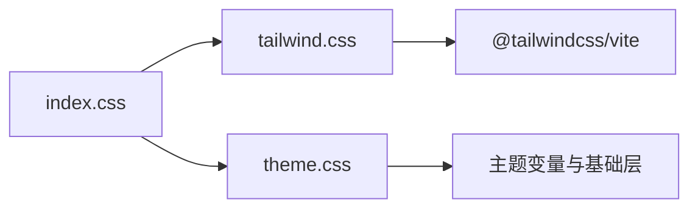
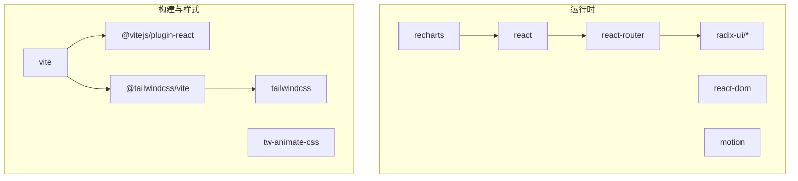
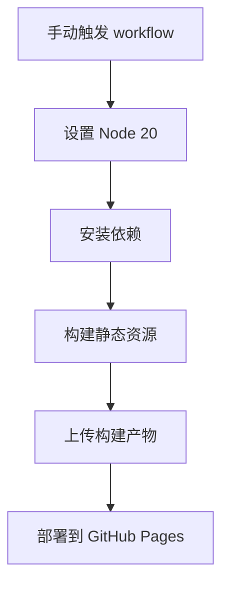

# 开发指南

<cite>
**本文引用的文件**
- [package.json](file://figma-ui/package.json)
- [vite.config.ts](file://figma-ui/vite.config.ts)
- [postcss.config.mjs](file://figma-ui/postcss.config.mjs)
- [deploy-figma-ui-pages.yml](file://.github/workflows/deploy-figma-ui-pages.yml)
- [README.md](file://figma-ui/README.md)
- [main.tsx](file://figma-ui/src/main.tsx)
- [App.tsx](file://figma-ui/src/app/App.tsx)
- [routes.ts](file://figma-ui/src/app/routes.ts)
- [Layout.tsx](file://figma-ui/src/app/components/Layout.tsx)
- [tailwind.css](file://figma-ui/src/styles/tailwind.css)
- [index.css](file://figma-ui/src/styles/index.css)
- [theme.css](file://figma-ui/src/styles/theme.css)
- [utils.ts](file://figma-ui/src/lib/utils.ts)
- [types.ts](file://figma-ui/src/app/types.ts)
</cite>

## 目录
1. [简介](#简介)
2. [项目结构](#项目结构)
3. [核心组件](#核心组件)
4. [架构总览](#架构总览)
5. [详细组件分析](#详细组件分析)
6. [依赖分析](#依赖分析)
7. [性能考虑](#性能考虑)
8. [故障排查指南](#故障排查指南)
9. [结论](#结论)
10. [附录](#附录)

## 简介
本指南面向医案通医疗档案网站的开发与维护，覆盖开发环境配置、代码规范与最佳实践、Vite 构建与 PostCSS 处理、GitHub Actions 自动化部署流程、代码组织与命名约定、调试技巧、性能优化建议、测试策略（单元/集成/E2E）以及贡献流程与 Pull Request 审查标准。目标是帮助新成员快速上手并高质量地参与迭代。

## 项目结构
本项目采用基于功能与页面划分的 React + Vite 前端工程：
- 入口与路由：应用入口渲染根组件，使用 Hash 路由组织页面与布局。
- 样式体系：Tailwind CSS v4 + 自定义主题变量，统一通过样式入口引入。
- 组件与页面：UI 原子组件位于 ui 子目录，业务页面按模块划分在 pages 目录。
- 工具与类型：通用工具函数与类型定义集中管理，便于复用与约束。
- 构建与部署：Vite 负责构建，PostCSS 由 Tailwind 插件自动配置；CI 提供 GitHub Pages 部署工作流。

**图示来源**
- [main.tsx:1-7](file://figma-ui/src/main.tsx#L1-L7)
- [App.tsx:1-12](file://figma-ui/src/app/App.tsx#L1-L12)
- [routes.ts:1-106](file://figma-ui/src/app/routes.ts#L1-L106)
- [Layout.tsx:1-251](file://figma-ui/src/app/components/Layout.tsx#L1-L251)
- [index.css:1-4](file://figma-ui/src/styles/index.css#L1-L4)
- [tailwind.css:1-5](file://figma-ui/src/styles/tailwind.css#L1-L5)
- [theme.css:1-218](file://figma-ui/src/styles/theme.css#L1-L218)

**章节来源**
- [README.md:1-11](file://figma-ui/README.md#L1-L11)
- [package.json:1-101](file://figma-ui/package.json#L1-L101)

## 核心组件
- 应用壳与路由
  - 应用根组件提供全局上下文与路由容器，确保导航与全局提示能力可用。
  - 路由采用 Hash 模式，便于静态站点部署与无服务端回退场景。
- 布局组件
  - 统一的头部导航、移动端菜单、页脚信息，配合滚动监听与动画增强交互体验。
- 样式系统
  - 通过样式入口聚合字体、Tailwind 与主题变量，保证全局一致性与可维护性。
- 工具与类型
  - 类名合并工具用于动态样式组合；领域类型集中定义，保障数据结构一致性。

**章节来源**
- [App.tsx:1-12](file://figma-ui/src/app/App.tsx#L1-L12)
- [routes.ts:1-106](file://figma-ui/src/app/routes.ts#L1-L106)
- [Layout.tsx:1-251](file://figma-ui/src/app/components/Layout.tsx#L1-L251)
- [index.css:1-4](file://figma-ui/src/styles/index.css#L1-L4)
- [tailwind.css:1-5](file://figma-ui/src/styles/tailwind.css#L1-L5)
- [theme.css:1-218](file://figma-ui/src/styles/theme.css#L1-L218)
- [utils.ts:1-7](file://figma-ui/src/lib/utils.ts#L1-L7)
- [types.ts:1-95](file://figma-ui/src/app/types.ts#L1-L95)

## 架构总览
下图展示从入口到页面渲染的调用链路与关键依赖关系。

**图示来源**
- [main.tsx:1-7](file://figma-ui/src/main.tsx#L1-L7)
- [App.tsx:1-12](file://figma-ui/src/app/App.tsx#L1-L12)
- [routes.ts:1-106](file://figma-ui/src/app/routes.ts#L1-L106)
- [Layout.tsx:1-251](file://figma-ui/src/app/components/Layout.tsx#L1-L251)

## 详细组件分析

### 路由与页面组织
- 路由策略
  - 使用 Hash 路由，避免服务端回退问题，适配静态托管。
  - 将首页与主应用区分为不同布局层级，便于共享 UI 与权限控制扩展。
- 页面划分
  - 页面按功能域拆分，如仪表盘、记录、OCR、家庭、设置等，便于独立维护与测试。
- 扩展点
  - 新增页面需在路由表中注册，遵循路径语义化与命名规范。

**图示来源**
- [routes.ts:1-106](file://figma-ui/src/app/routes.ts#L1-L106)

**章节来源**
- [routes.ts:1-106](file://figma-ui/src/app/routes.ts#L1-L106)

### 布局与导航
- 响应式导航
  - 桌面端显示完整导航项，移动端提供折叠菜单与平滑过渡动画。
- 滚动行为
  - 监听滚动改变头部样式，提升视觉层次。
- 底部信息
  - 包含产品链接、合规信息与品牌标语，保持品牌一致性。

**图示来源**
- [Layout.tsx:1-251](file://figma-ui/src/app/components/Layout.tsx#L1-L251)

**章节来源**
- [Layout.tsx:1-251](file://figma-ui/src/app/components/Layout.tsx#L1-L251)

### 样式与主题
- 样式入口
  - 统一导入字体、Tailwind 与主题，确保全局样式一致。
- Tailwind 配置
  - 通过 Vite 插件启用 Tailwind，并在样式文件中声明扫描范围与动画库。
- 主题变量
  - 定义明暗主题变量与基础排版规则，支持深色模式与统一色彩体系。

**图示来源**
- [index.css:1-4](file://figma-ui/src/styles/index.css#L1-L4)
- [tailwind.css:1-5](file://figma-ui/src/styles/tailwind.css#L1-L5)
- [theme.css:1-218](file://figma-ui/src/styles/theme.css#L1-L218)

**章节来源**
- [index.css:1-4](file://figma-ui/src/styles/index.css#L1-L4)
- [tailwind.css:1-5](file://figma-ui/src/styles/tailwind.css#L1-L5)
- [theme.css:1-218](file://figma-ui/src/styles/theme.css#L1-L218)

### 工具与类型
- 类名合并
  - 提供统一的类名合并函数，避免冲突并提高可读性。
- 领域类型
  - 集中定义成员、归档、OCR 数据、分享链接等类型，确保前后端契约一致。

**章节来源**
- [utils.ts:1-7](file://figma-ui/src/lib/utils.ts#L1-L7)
- [types.ts:1-95](file://figma-ui/src/app/types.ts#L1-L95)

## 依赖分析
- 运行时依赖
  - React、React DOM、React Router、Radix UI 系列、MUI、Recharts、Motion、日期与表单库等。
- 构建与样式
  - Vite、@vitejs/plugin-react、@tailwindcss/vite、Tailwind CSS v4、tw-animate-css。
- 开发环境与版本
  - Node.js 指定为 20，确保团队环境一致。

**图示来源**
- [package.json:1-101](file://figma-ui/package.json#L1-L101)

**章节来源**
- [package.json:1-101](file://figma-ui/package.json#L1-L101)

## 性能考虑
- 构建优化
  - 使用 Vite 原生 ES 模块与按需加载，减少首屏体积。
  - 合理拆分页面与组件，利用路由懒加载降低初始包大小。
- 样式优化
  - 仅引入必要的 Tailwind 类名，避免冗余；使用主题变量统一管理颜色与尺寸。
- 资源优化
  - 图片与图标按需加载，SVG 内联以减少请求；静态资源使用合适的缓存策略。
- 运行时优化
  - 列表渲染使用稳定 key；避免不必要的重渲染；图表数据按需更新。

[本节为通用指导，不直接分析具体文件]

## 故障排查指南
- 本地开发
  - 安装依赖后启动开发服务器，确认端口占用与热更新正常。
  - 若样式未生效，检查样式入口是否正确引入，Tailwind 扫描路径是否包含相关文件。
- 构建失败
  - 检查 Node 版本是否为 20；清理缓存后重试构建。
  - 若路径别名失效，确认 Vite 配置中的别名指向正确。
- 部署异常
  - 确认环境变量 base 或 VITE_BASE_URL 设置正确，尤其是子路径部署。
  - 检查 CI 工作流日志，定位安装与构建阶段错误。

**章节来源**
- [README.md:1-11](file://figma-ui/README.md#L1-L11)
- [vite.config.ts:1-30](file://figma-ui/vite.config.ts#L1-L30)
- [deploy-figma-ui-pages.yml:1-46](file://.github/workflows/deploy-figma-ui-pages.yml#L1-L46)

## 结论
本项目以 Vite + React + Tailwind 为核心技术栈，具备清晰的目录结构与模块化设计，便于团队协作与持续交付。通过标准化的构建、样式与部署流程，结合完善的类型与工具函数，可有效提升开发效率与代码质量。建议在后续迭代中补充单元测试与端到端测试，进一步完善性能监控与错误上报机制。

[本节为总结性内容，不直接分析具体文件]

## 附录

### 开发环境配置
- 环境要求
  - Node.js 20；推荐使用 npm 进行依赖管理。
- 安装与运行
  - 安装依赖后，启动开发服务器预览效果。
- 构建与预览
  - 执行构建命令生成静态资源；使用预览命令本地验证产物。

**章节来源**
- [package.json:1-101](file://figma-ui/package.json#L1-L101)
- [README.md:1-11](file://figma-ui/README.md#L1-L11)

### Vite 构建配置说明
- 基础路径
  - 支持通过环境变量设置基础路径，适配不同部署场景。
- 插件
  - 启用 React 与 Tailwind 插件，确保 JSX 与样式编译正常。
- 别名与资源
  - 配置 @ 指向 src 目录；允许导入 SVG、CSV 等静态资源。

**章节来源**
- [vite.config.ts:1-30](file://figma-ui/vite.config.ts#L1-L30)

### PostCSS 处理器设置
- 说明
  - Tailwind v4 通过 Vite 插件自动配置所需 PostCSS 插件，无需额外添加 autoprefixer 等。
- 扩展
  - 如需其他 PostCSS 插件，可在配置文件中追加。

**章节来源**
- [postcss.config.mjs:1-16](file://figma-ui/postcss.config.mjs#L1-L16)

### GitHub Actions 自动化部署
- 触发方式
  - 默认通过手动触发工作流，避免每次推送都部署。
- 构建步骤
  - 检出代码、安装 Node 20、安装依赖并构建产物。
- 部署步骤
  - 上传构建产物至 GitHub Pages 环境，完成发布。

**图示来源**
- [deploy-figma-ui-pages.yml:1-46](file://.github/workflows/deploy-figma-ui-pages.yml#L1-L46)

**章节来源**
- [deploy-figma-ui-pages.yml:1-46](file://.github/workflows/deploy-figma-ui-pages.yml#L1-L46)

### 代码组织与命名约定
- 目录组织
  - 页面按功能域划分于 pages 目录；UI 原子组件集中于 ui 子目录；公共逻辑放入 hooks、utils、lib 等。
- 命名约定
  - 组件与页面使用帕斯卡命名；样式文件使用小写连字符；常量与枚举使用大写加下划线。
- 文件职责
  - 单一职责原则：每个文件聚焦一个功能或组件；类型与工具集中管理，避免散落。

[本节为通用规范，不直接分析具体文件]

### 调试技巧
- 浏览器开发者工具
  - 使用 Network 面板检查资源加载；使用 Performance 面板分析渲染瓶颈。
- 日志与断点
  - 在关键路由切换与用户交互处添加日志；对复杂状态变更使用断点调试。
- 样式调试
  - 使用 Tailwind 官方扩展或在线工具辅助排查类名冲突。

[本节为通用指导，不直接分析具体文件]

### 性能优化建议
- 首屏优化
  - 路由级代码分割；关键样式内联；图片懒加载与压缩。
- 运行时优化
  - 避免大对象频繁创建；合理使用 useMemo/useCallback；图表数据增量更新。
- 资源缓存
  - 开启静态资源长缓存；使用 CDN 加速静态资源分发。

[本节为通用指导，不直接分析具体文件]

### 测试策略
- 单元测试
  - 针对工具函数与纯组件编写用例，覆盖边界条件与异常分支。
- 集成测试
  - 对路由与页面组合进行测试，验证组件间协作与数据流。
- 端到端测试
  - 模拟用户操作路径，覆盖核心业务流程（如上传、查看、分享）。
- 建议工具
  - 可使用 Jest/Vitest 进行单元与集成测试；使用 Playwright/Cypress 进行 E2E 测试。

[本节为通用指导，不直接分析具体文件]

### 贡献流程与 Pull Request 规范
- 分支策略
  - 新功能与修复基于特性分支开发，定期合并至主分支。
- 提交规范
  - 提交信息清晰描述改动目的与影响范围；必要时附带截图或录屏。
- Pull Request
  - 描述改动背景、实现方案与测试情况；关联相关 Issue。
- 代码审查
  - 关注可读性、可维护性与性能；确保符合命名与组织规范；通过所有检查后再合并。

[本节为通用规范，不直接分析具体文件]