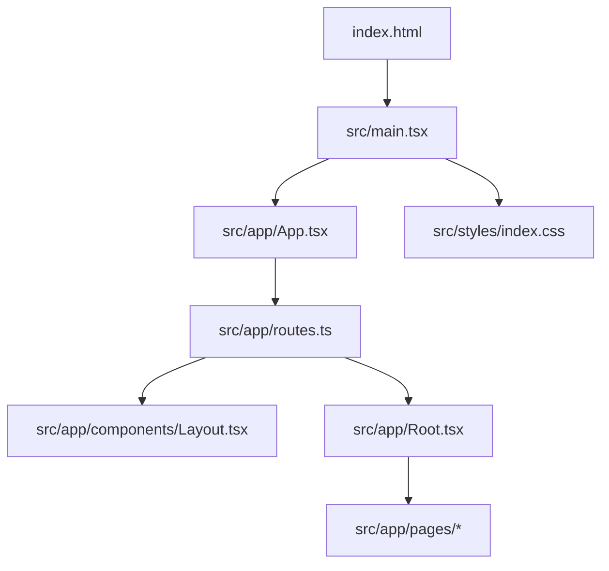
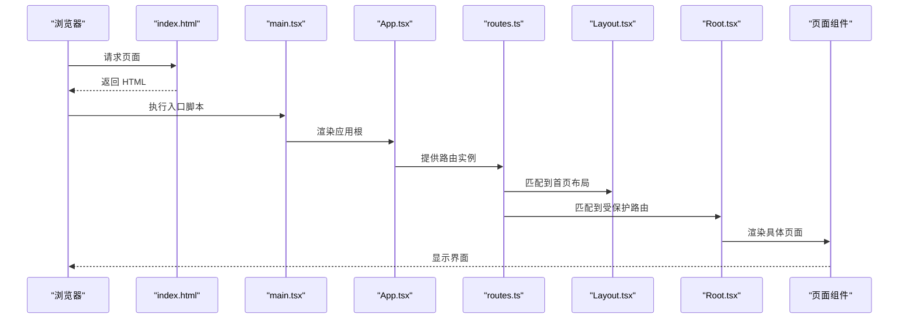
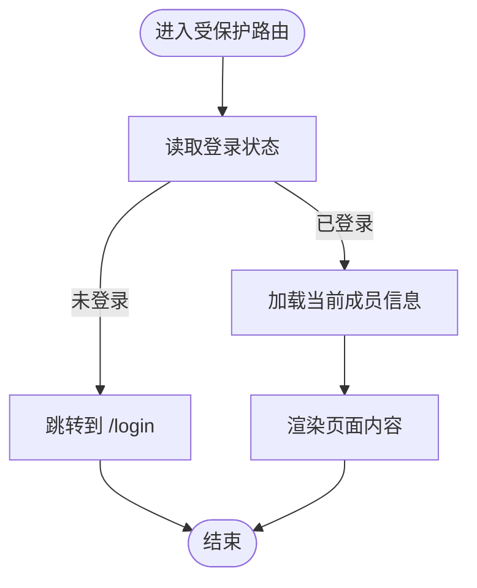
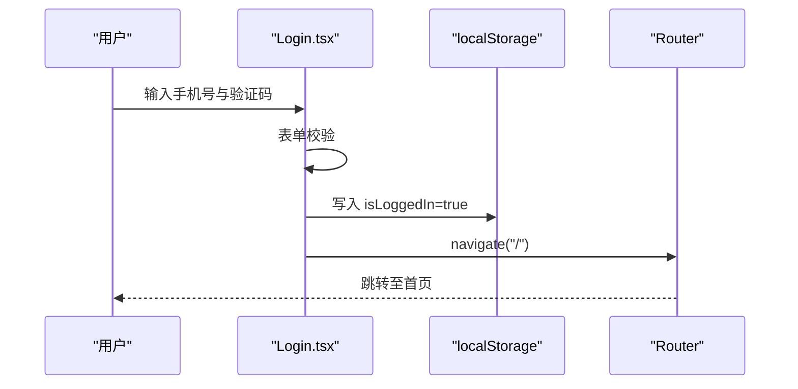
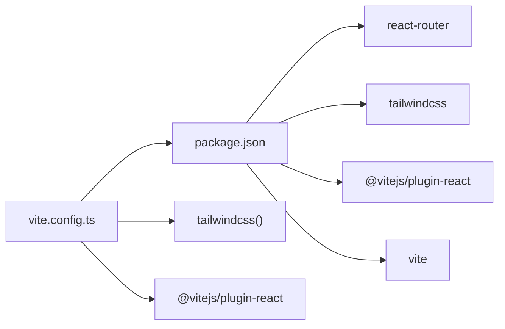

# 快速开始

<cite>
**本文引用的文件**
- [package.json](file://figma-ui/package.json)
- [README.md](file://figma-ui/README.md)
- [vite.config.ts](file://figma-ui/vite.config.ts)
- [index.html](file://figma-ui/index.html)
- [main.tsx](file://figma-ui/src/main.tsx)
- [App.tsx](file://figma-ui/src/app/App.tsx)
- [routes.ts](file://figma-ui/src/app/routes.ts)
- [Root.tsx](file://figma-ui/src/app/Root.tsx)
- [Layout.tsx](file://figma-ui/src/app/components/Layout.tsx)
- [HomePage.tsx](file://figma-ui/src/app/pages/HomePage.tsx)
- [Login.tsx](file://figma-ui/src/app/pages/Login.tsx)
- [button.tsx](file://figma-ui/src/app/components/ui/button.tsx)
- [types.ts](file://figma-ui/src/app/types.ts)
- [index.css](file://figma-ui/src/styles/index.css)
</cite>

## 目录
1. [简介](#简介)
2. [项目结构](#项目结构)
3. [核心组件](#核心组件)
4. [架构总览](#架构总览)
5. [详细组件分析](#详细组件分析)
6. [依赖关系分析](#依赖关系分析)
7. [性能注意事项](#性能注意事项)
8. [故障排查指南](#故障排查指南)
9. [结论](#结论)
10. [附录](#附录)

## 简介
本指南面向首次接触医案通医疗档案网站的新手开发者，帮助你在最短时间内完成环境搭建、运行开发服务器、理解项目结构与路由机制，并学会创建第一个页面与基础组件。项目基于 React + Vite + Tailwind CSS + React Router 构建，采用模块化组织方式，便于扩展与维护。

## 项目结构
项目根目录位于 figma-ui，主要目录职责如下：
- src/main.tsx：应用入口，挂载 React 根节点并引入全局样式。
- src/app：应用主体，包含路由、页面、布局与通用组件。
  - src/app/routes.ts：集中定义所有路由（Hash 模式）。
  - src/app/App.tsx：应用顶层容器，提供路由与全局上下文。
  - src/app/Root.tsx：受保护路由的根布局，负责登录态校验与底部导航。
  - src/app/components：通用 UI 组件与业务布局（如 Layout、BottomNav）。
  - src/app/pages：页面级组件（首页、登录、上传、搜索等）。
  - src/app/utils：工具函数与模拟数据。
  - src/app/types.ts：类型定义（成员、档案、OCR 数据等）。
- src/styles：全局样式入口，聚合字体、Tailwind 与主题样式。
- index.html：HTML 模板，提供 #root 挂载点与入口脚本。
- vite.config.ts：Vite 构建配置，启用 React、Tailwind，设置别名与 base。
- package.json：脚本命令、依赖版本与 Node 引擎要求。

图表来源
- [index.html:1-15](file://figma-ui/index.html#L1-L15)
- [main.tsx:1-7](file://figma-ui/src/main.tsx#L1-L7)
- [App.tsx:1-12](file://figma-ui/src/app/App.tsx#L1-L12)
- [routes.ts:1-106](file://figma-ui/src/app/routes.ts#L1-L106)
- [Layout.tsx:1-251](file://figma-ui/src/app/components/Layout.tsx#L1-L251)
- [Root.tsx:1-59](file://figma-ui/src/app/Root.tsx#L1-L59)

章节来源
- [package.json:1-101](file://figma-ui/package.json#L1-L101)
- [README.md:1-11](file://figma-ui/README.md#L1-L11)
- [vite.config.ts:1-30](file://figma-ui/vite.config.ts#L1-L30)
- [index.html:1-15](file://figma-ui/index.html#L1-L15)
- [main.tsx:1-7](file://figma-ui/src/main.tsx#L1-L7)
- [App.tsx:1-12](file://figma-ui/src/app/App.tsx#L1-L12)
- [routes.ts:1-106](file://figma-ui/src/app/routes.ts#L1-L106)

## 核心组件
- 应用容器 App：注入路由与全局通知上下文，作为整个应用的根。
- 路由系统 routes：使用 Hash 路由集中管理页面与嵌套路由，区分公开页与受保护页。
- 受保护根 Root：检查登录状态，未登录跳转至登录页；加载当前成员信息并提供底部导航。
- 布局 Layout：站点头部、导航、页脚与移动端菜单，配合首页各区块滚动定位。
- 页面示例 HomePage：展示档案列表、统计卡片、视图切换（时间轴/分类）等。
- 登录页 Login：手机号+验证码登录流程，成功后写入本地状态并跳转首页。
- 基础按钮 Button：可复用 UI 按钮组件，支持多种变体与尺寸。

章节来源
- [App.tsx:1-12](file://figma-ui/src/app/App.tsx#L1-L12)
- [routes.ts:1-106](file://figma-ui/src/app/routes.ts#L1-L106)
- [Root.tsx:1-59](file://figma-ui/src/app/Root.tsx#L1-L59)
- [Layout.tsx:1-251](file://figma-ui/src/app/components/Layout.tsx#L1-L251)
- [HomePage.tsx:1-276](file://figma-ui/src/app/pages/HomePage.tsx#L1-L276)
- [Login.tsx:1-123](file://figma-ui/src/app/pages/Login.tsx#L1-L123)
- [button.tsx:1-59](file://figma-ui/src/app/components/ui/button.tsx#L1-L59)

## 架构总览
下图展示了从 HTML 到 React 渲染、再到路由分发与页面渲染的整体流程。

图表来源
- [index.html:1-15](file://figma-ui/index.html#L1-L15)
- [main.tsx:1-7](file://figma-ui/src/main.tsx#L1-L7)
- [App.tsx:1-12](file://figma-ui/src/app/App.tsx#L1-L12)
- [routes.ts:1-106](file://figma-ui/src/app/routes.ts#L1-L106)
- [Layout.tsx:1-251](file://figma-ui/src/app/components/Layout.tsx#L1-L251)
- [Root.tsx:1-59](file://figma-ui/src/app/Root.tsx#L1-L59)

## 详细组件分析

### 路由与页面组织
- 路由模式：Hash 路由，无需服务端回退，适合静态托管。
- 路由分组：
  - 首页布局 /：包含首页子路由。
  - 受保护路由组：dashboard、search、upload、share、settings、records、ocr、family、members 等。
  - 独立路由：记录详情、历史、文档查看、推广页、Logo 页、下载落地页、登录页。
- 受保护逻辑：进入受保护路由时，Root 会检查登录态，未登录则跳转登录页。

图表来源
- [routes.ts:24-106](file://figma-ui/src/app/routes.ts#L24-L106)
- [Root.tsx:10-46](file://figma-ui/src/app/Root.tsx#L10-L46)

章节来源
- [routes.ts:1-106](file://figma-ui/src/app/routes.ts#L1-L106)
- [Root.tsx:1-59](file://figma-ui/src/app/Root.tsx#L1-L59)

### 首页与布局
- Layout：固定头部、响应式导航、页脚与移动端菜单；提供锚点跳转至首页各区块。
- HomePage：展示统计卡片、视图切换（时间轴/分类）、空状态引导上传；通过本地存储初始化并读取数据。

章节来源
- [Layout.tsx:1-251](file://figma-ui/src/app/components/Layout.tsx#L1-L251)
- [HomePage.tsx:1-276](file://figma-ui/src/app/pages/HomePage.tsx#L1-L276)

### 登录流程
- 输入校验：手机号长度校验。
- 登录动作：写入本地登录状态，提示成功并跳转首页。
- 验证码发送：模拟发送，带加载态与提示。

图表来源
- [Login.tsx:18-27](file://figma-ui/src/app/pages/Login.tsx#L18-L27)

章节来源
- [Login.tsx:1-123](file://figma-ui/src/app/pages/Login.tsx#L1-L123)

### 基础组件 Button
- 支持多变体（默认、危险、轮廓、次要、幽灵、链接）与尺寸（默认、小、大、图标）。
- 通过 class-variance-authority 组合样式，适配暗色模式与焦点状态。

章节来源
- [button.tsx:1-59](file://figma-ui/src/app/components/ui/button.tsx#L1-L59)

### 类型与数据模型
- Member：成员基本信息。
- Archive：档案条目，含类型、标签、收藏、删除标记等。
- OCRData/LabItem/PrescriptionItem：OCR 解析结果与检验/处方项。
- 常量映射：档案类型标签与颜色。

章节来源
- [types.ts:1-95](file://figma-ui/src/app/types.ts#L1-L95)

## 依赖关系分析
- 运行时依赖：React、React DOM、React Router、UI 库（Radix、Material Icons）、动画（motion）、图表（recharts）、表单（react-hook-form）、日期处理（date-fns）等。
- 开发依赖：Vite、@vitejs/plugin-react、Tailwind CSS v4、PostCSS 插件。
- 构建配置：启用 React 与 Tailwind 插件，设置 @ 别名指向 src，支持 SVG/CSV 资源导入。

图表来源
- [package.json:1-101](file://figma-ui/package.json#L1-L101)
- [vite.config.ts:1-30](file://figma-ui/vite.config.ts#L1-L30)

章节来源
- [package.json:1-101](file://figma-ui/package.json#L1-L101)
- [vite.config.ts:1-30](file://figma-ui/vite.config.ts#L1-L30)

## 性能注意事项
- 路由懒加载：建议对大型页面进行按需加载，减少首屏体积。
- 图片优化：使用合适的图片格式与尺寸，必要时启用 CDN。
- 样式策略：Tailwind 按需生成类名，避免冗余 CSS。
- 状态管理：当前使用 localStorage 与局部状态，数据量增长后可考虑更完善的状态方案。
- 构建产物：生产构建前清理无用代码与调试日志，确保最小化输出。

[本节为通用指导，不直接分析具体文件]

## 故障排查指南
- 无法启动开发服务器
  - 确认 Node.js 版本满足要求（见 engines.node）。
  - 重新安装依赖后再次启动。
- 页面空白或样式异常
  - 检查入口样式是否引入（index.css 聚合了字体、Tailwind、主题）。
  - 确认 Vite 插件已启用（React、Tailwind）。
- 路由跳转无效
  - 确认路由路径已在 routes.ts 中注册。
  - 受保护路由需先登录，否则会被 Root 重定向到登录页。
- 本地数据为空
  - 首页会初始化模拟数据，若仍为空，检查 localStorage 是否被拦截或清除。
- 构建失败
  - 检查依赖版本冲突与 peerDependencies。
  - 清理缓存后重试构建。

章节来源
- [package.json:6-12](file://figma-ui/package.json#L6-L12)
- [index.css:1-4](file://figma-ui/src/styles/index.css#L1-L4)
- [vite.config.ts:14-19](file://figma-ui/vite.config.ts#L14-L19)
- [routes.ts:24-106](file://figma-ui/src/app/routes.ts#L24-L106)
- [Root.tsx:10-16](file://figma-ui/src/app/Root.tsx#L10-L16)
- [HomePage.tsx:13-19](file://figma-ui/src/app/pages/HomePage.tsx#L13-L19)

## 结论
通过本指南，你应能完成环境准备、运行开发服务器、理解项目结构与路由机制，并掌握新增页面与组件的基本方法。建议在熟悉现有页面与组件后，逐步扩展功能模块，遵循现有目录与命名约定，保持代码一致性与可维护性。

## 附录

### 环境搭建与运行
- Node.js 版本要求
  - 请安装 Node.js 20（参考 engines.node）。
- 安装依赖
  - 在项目根目录执行依赖安装命令以安装所有依赖。
- 启动开发服务器
  - 执行开发脚本以启动热更新的开发服务器。
- 构建生产版本
  - 执行构建脚本以生成生产可用产物。
- 预览构建产物
  - 执行预览脚本以本地预览构建后的站点。

章节来源
- [package.json:6-12](file://figma-ui/package.json#L6-L12)
- [README.md:6-11](file://figma-ui/README.md#L6-L11)

### 项目结构说明（快速对照）
- src/app：应用主体（路由、页面、布局、类型、工具）。
- src/app/pages：页面级组件（首页、登录、上传、搜索等）。
- src/app/components：通用 UI 组件与布局（按钮、导航、布局等）。
- src/styles：全局样式入口（字体、Tailwind、主题）。
- index.html：HTML 模板与入口脚本挂载点。
- vite.config.ts：构建与开发配置（插件、别名、base）。
- package.json：脚本命令与依赖声明。

章节来源
- [main.tsx:1-7](file://figma-ui/src/main.tsx#L1-L7)
- [App.tsx:1-12](file://figma-ui/src/app/App.tsx#L1-L12)
- [routes.ts:1-106](file://figma-ui/src/app/routes.ts#L1-L106)
- [index.css:1-4](file://figma-ui/src/styles/index.css#L1-L4)
- [vite.config.ts:1-30](file://figma-ui/vite.config.ts#L1-L30)
- [package.json:1-101](file://figma-ui/package.json#L1-L101)

### 创建第一个页面（示例步骤）
- 在 src/app/pages 下新建页面组件文件（例如 NewPage.tsx），导出默认组件。
- 在 src/app/routes.ts 中添加路由条目，将 path 与 Component 关联。
- 如需布局包裹，可将路由放入受保护路由组或首页布局组。
- 在页面中使用现有 UI 组件（如 Button）与样式（Tailwind）。
- 保存后，开发服务器会自动热更新，访问对应路由即可预览。

章节来源
- [routes.ts:24-106](file://figma-ui/src/app/routes.ts#L24-L106)
- [button.tsx:1-59](file://figma-ui/src/app/components/ui/button.tsx#L1-L59)

### 基本组件开发（示例要点）
- 组件拆分：将复杂页面拆分为可复用的小组件，提升可维护性。
- 样式策略：优先使用 Tailwind 原子类，必要时抽取公共样式。
- 交互逻辑：使用 React Hooks 管理状态与副作用，避免过度耦合。
- 类型安全：在 types.ts 中定义接口，并在组件中引用，保证数据结构一致。

章节来源
- [types.ts:1-95](file://figma-ui/src/app/types.ts#L1-L95)
- [HomePage.tsx:1-276](file://figma-ui/src/app/pages/HomePage.tsx#L1-L276)