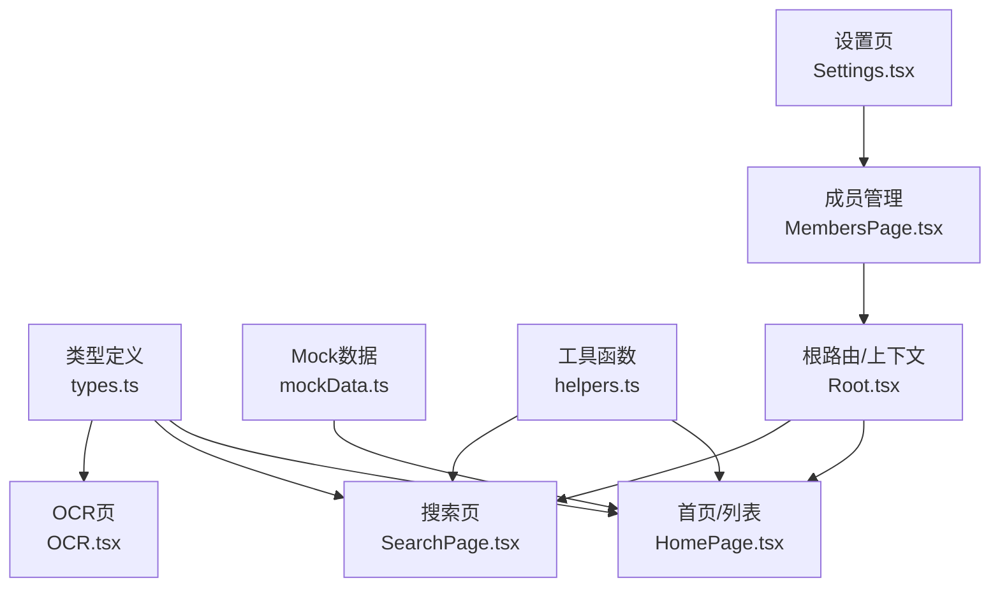
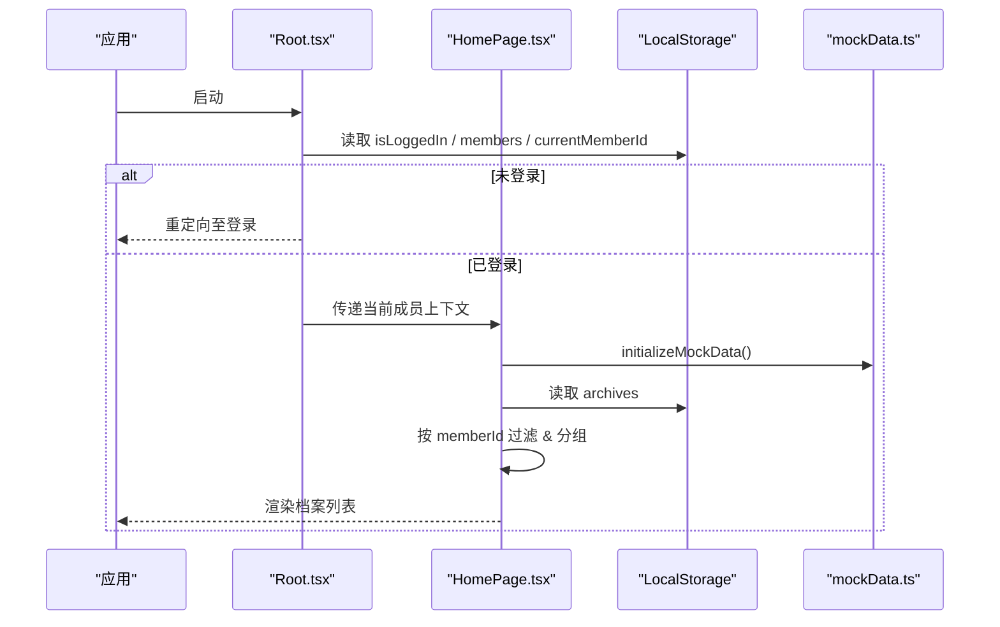
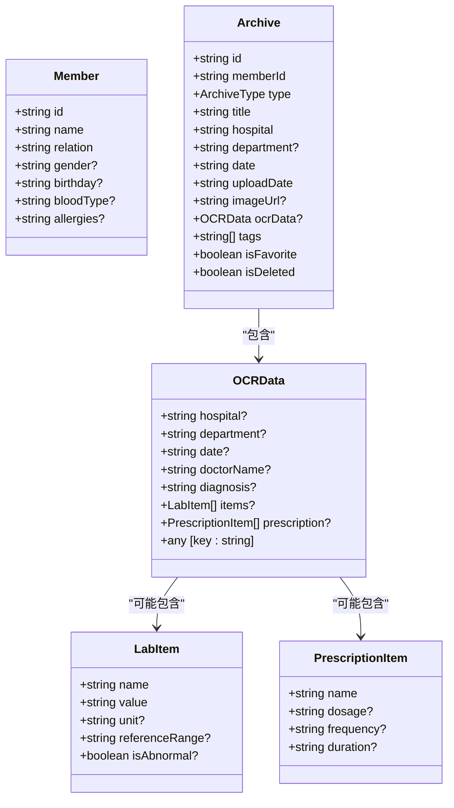
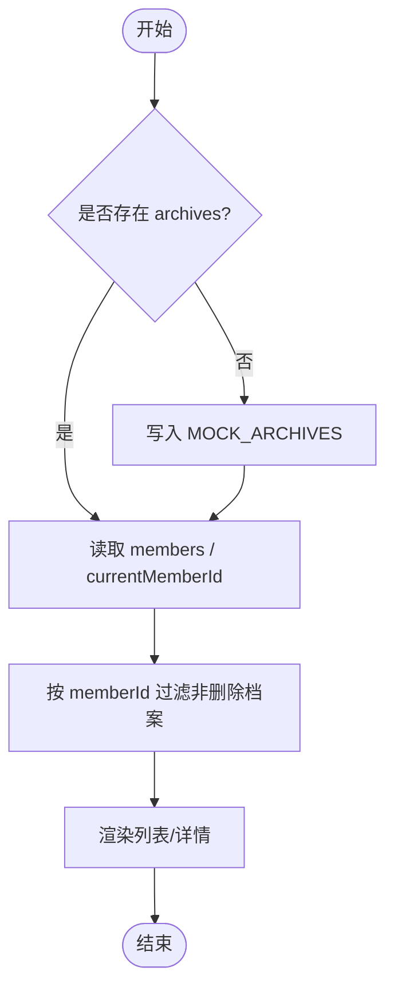
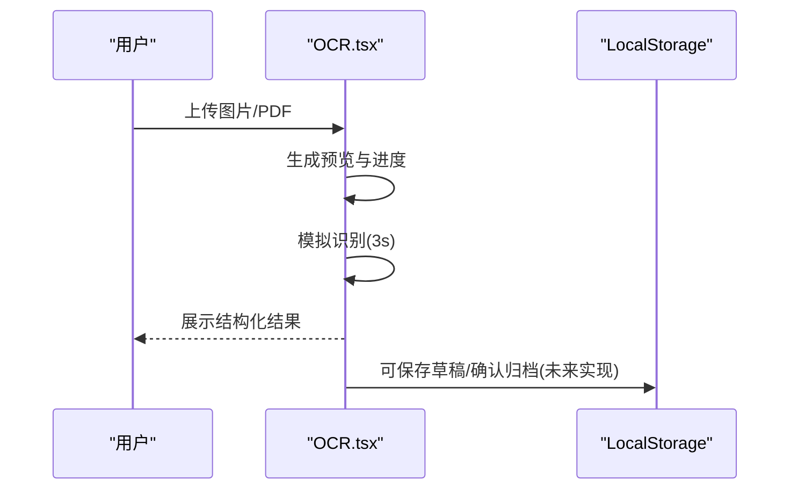
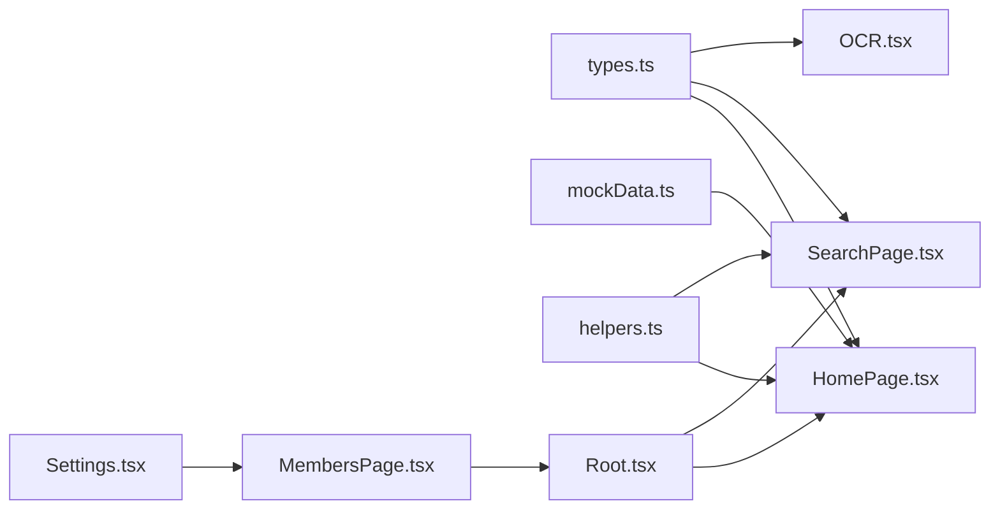

# 数据管理

<cite>
**本文引用的文件**
- [types.ts](file://figma-ui/src/app/types.ts)
- [mockData.ts](file://figma-ui/src/app/utils/mockData.ts)
- [helpers.ts](file://figma-ui/src/app/utils/helpers.ts)
- [Root.tsx](file://figma-ui/src/app/Root.tsx)
- [HomePage.tsx](file://figma-ui/src/app/pages/HomePage.tsx)
- [MembersPage.tsx](file://figma-ui/src/app/pages/MembersPage.tsx)
- [SearchPage.tsx](file://figma-ui/src/app/pages/SearchPage.tsx)
- [Settings.tsx](file://figma-ui/src/app/pages/Settings.tsx)
- [OCR.tsx](file://figma-ui/src/app/pages/OCR.tsx)
</cite>

## 目录
1. [简介](#简介)
2. [项目结构](#项目结构)
3. [核心组件](#核心组件)
4. [架构总览](#架构总览)
5. [详细组件分析](#详细组件分析)
6. [依赖关系分析](#依赖关系分析)
7. [性能考虑](#性能考虑)
8. [故障排查指南](#故障排查指南)
9. [结论](#结论)
10. [附录](#附录)

## 简介
本文件为医案通医疗档案网站的数据管理模块提供综合文档，覆盖以下方面：
- TypeScript 类型定义系统：Member（家庭成员）、Archive（医疗档案）、OCRData（OCR识别结果）等核心模型。
- LocalStorage 存储策略：成员、当前成员、档案的读写与初始化流程。
- 数据验证机制与错误处理：表单校验、删除保护、异常提示。
- Mock 数据组织与使用：测试数据与示例数据的结构与初始化方式。
- 数据操作工具函数与辅助方法：日期格式化、ID 生成、过期判断等。
- 数据迁移策略、备份恢复机制与性能优化建议。

## 项目结构
数据相关代码主要分布在类型定义、工具函数、页面组件中：
- 类型定义集中在 types.ts，统一描述 Member、Archive、OCRData 等数据结构及常量映射。
- 工具函数在 helpers.ts 提供通用能力（日期格式化、ID 生成、过期计算等）。
- Mock 数据在 mockData.ts 提供初始档案数据与初始化逻辑。
- 页面组件通过 Root.tsx 与多个页面（HomePage、MembersPage、SearchPage、Settings、OCR）协作，完成数据读取、筛选、展示与更新。

图表来源
- [types.ts:1-95](file://figma-ui/src/app/types.ts#L1-L95)
- [mockData.ts:1-98](file://figma-ui/src/app/utils/mockData.ts#L1-L98)
- [helpers.ts:1-52](file://figma-ui/src/app/utils/helpers.ts#L1-L52)
- [Root.tsx:1-59](file://figma-ui/src/app/Root.tsx#L1-L59)
- [HomePage.tsx:1-276](file://figma-ui/src/app/pages/HomePage.tsx#L1-L276)
- [MembersPage.tsx:1-294](file://figma-ui/src/app/pages/MembersPage.tsx#L1-L294)
- [SearchPage.tsx:1-286](file://figma-ui/src/app/pages/SearchPage.tsx#L1-L286)
- [Settings.tsx:1-347](file://figma-ui/src/app/pages/Settings.tsx#L1-L347)

章节来源
- [types.ts:1-95](file://figma-ui/src/app/types.ts#L1-L95)
- [mockData.ts:1-98](file://figma-ui/src/app/utils/mockData.ts#L1-L98)
- [helpers.ts:1-52](file://figma-ui/src/app/utils/helpers.ts#L1-L52)
- [Root.tsx:1-59](file://figma-ui/src/app/Root.tsx#L1-L59)
- [HomePage.tsx:1-276](file://figma-ui/src/app/pages/HomePage.tsx#L1-L276)
- [MembersPage.tsx:1-294](file://figma-ui/src/app/pages/MembersPage.tsx#L1-L294)
- [SearchPage.tsx:1-286](file://figma-ui/src/app/pages/SearchPage.tsx#L1-L286)
- [Settings.tsx:1-347](file://figma-ui/src/app/pages/Settings.tsx#L1-L347)

## 核心组件
- 类型系统
  - Member：家庭成员基本信息（id、name、relation、可选性别/生日/血型/过敏史）。
  - Archive：医疗档案（id、memberId、type、title、hospital、department、date、uploadDate、imageUrl、ocrData、tags、isFavorite、isDeleted）。
  - OCRData：OCR识别结果（医院、科室、日期、医生、诊断、检验项、处方项等扩展字段）。
  - 枚举与标签：ArchiveType 及其显示标签与颜色映射，便于 UI 渲染。
- 工具函数
  - 日期格式化（中文本地化、短格式）。
  - 过期判断与剩余天数计算。
  - 随机 ID 生成。
  - 手机号脱敏。
- Mock 数据
  - MOCK_ARCHIVES：一组示例档案，包含不同类别与 OCR 数据样例。
  - initializeMockData：首次进入时若 localStorage 无 archives，则写入示例数据。

章节来源
- [types.ts:1-95](file://figma-ui/src/app/types.ts#L1-L95)
- [helpers.ts:1-52](file://figma-ui/src/app/utils/helpers.ts#L1-L52)
- [mockData.ts:1-98](file://figma-ui/src/app/utils/mockData.ts#L1-L98)

## 架构总览
数据流围绕“类型定义 + 工具函数 + Mock 数据 + 页面组件”展开：
- 应用启动后，Root 检查登录状态并加载当前成员；若不存在则回退到默认成员。
- HomePage 初始化 Mock 数据，并从 localStorage 读取 members、archives，按当前成员过滤展示。
- MembersPage 负责成员的增删改查，并在删除成员时级联清理其档案。
- SearchPage 基于关键字、机构、时间范围对 archives 进行筛选。
- Settings 提供成员管理与切换，持久化 currentMemberId。
- OCR 页面模拟上传与识别流程，产出结构化数据（可用于后续归档）。

图表来源
- [Root.tsx:1-59](file://figma-ui/src/app/Root.tsx#L1-L59)
- [HomePage.tsx:1-276](file://figma-ui/src/app/pages/HomePage.tsx#L1-L276)
- [mockData.ts:1-98](file://figma-ui/src/app/utils/mockData.ts#L1-L98)

## 详细组件分析

### 类型系统与数据模型
- Member：用于家庭管理，支持基础信息与可选健康信息。
- Archive：核心业务实体，关联成员、分类、时间、标签、收藏与软删除标记。
- OCRData：灵活的结构化解析结果，支持检验项与处方项等数组字段，同时保留任意扩展键。
- 常量映射：ArchiveType 的中文标签与样式类名，提升 UI 一致性。

图表来源
- [types.ts:1-95](file://figma-ui/src/app/types.ts#L1-L95)

章节来源
- [types.ts:1-95](file://figma-ui/src/app/types.ts#L1-L95)

### LocalStorage 存储策略
- 关键键名
  - isLoggedIn：登录态标志。
  - members：家庭成员数组。
  - currentMemberId：当前选中成员 ID。
  - archives：医疗档案数组。
  - userPhone：用户手机号（用于展示与脱敏）。
- 初始化
  - 首次进入时，若 archives 为空，则写入 MOCK_ARCHIVES。
- 读写模式
  - 各页面直接通过 JSON.parse(JSON.stringify(...)) 进行序列化/反序列化。
  - 成员切换时更新 currentMemberId，影响首页与搜索的过滤结果。
- 级联删除
  - 删除成员时，同步移除该成员的所有档案。

图表来源
- [mockData.ts:91-98](file://figma-ui/src/app/utils/mockData.ts#L91-L98)
- [HomePage.tsx:13-35](file://figma-ui/src/app/pages/HomePage.tsx#L13-L35)
- [MembersPage.tsx:15-43](file://figma-ui/src/app/pages/MembersPage.tsx#L15-L43)

章节来源
- [mockData.ts:1-98](file://figma-ui/src/app/utils/mockData.ts#L1-L98)
- [HomePage.tsx:13-35](file://figma-ui/src/app/pages/HomePage.tsx#L13-L35)
- [MembersPage.tsx:15-43](file://figma-ui/src/app/pages/MembersPage.tsx#L15-L43)
- [Root.tsx:10-46](file://figma-ui/src/app/Root.tsx#L10-L46)
- [Settings.tsx:36-42](file://figma-ui/src/app/pages/Settings.tsx#L36-L42)

### 数据验证机制与错误处理
- 表单校验
  - 添加成员需填写姓名与关系，否则提示并阻止提交。
- 删除保护
  - 禁止删除“本人”成员，防止误删导致数据不可用。
- 交互反馈
  - 使用 toast 或 alert 提示成功/失败信息，提升用户体验。
- 边界情况
  - 当 members 为空时，Root 会创建默认成员以保证应用可用。

章节来源
- [MembersPage.tsx:20-43](file://figma-ui/src/app/pages/MembersPage.tsx#L20-L43)
- [Settings.tsx:84-126](file://figma-ui/src/app/pages/Settings.tsx#L84-L126)
- [Root.tsx:18-39](file://figma-ui/src/app/Root.tsx#L18-L39)

### Mock 数据组织结构与使用
- 结构
  - MOCK_ARCHIVES：多份示例档案，涵盖不同类别与 OCR 数据。
- 使用
  - initializeMockData：在首页初始化时调用，确保首次体验有数据。
  - 页面通过过滤 member 与 isDeleted 展示有效数据。

章节来源
- [mockData.ts:1-98](file://figma-ui/src/app/utils/mockData.ts#L1-L98)
- [HomePage.tsx:13-35](file://figma-ui/src/app/pages/HomePage.tsx#L13-L35)

### 数据操作工具函数与辅助方法
- 日期格式化：formatDate、formatDateShort，适配中文本地化。
- 过期判断：isExpired、daysUntilExpiry，用于分享链接等场景。
- ID 生成：generateId，用于唯一标识。
- 隐私脱敏：maskPhone，用于敏感信息展示。

章节来源
- [helpers.ts:1-52](file://figma-ui/src/app/utils/helpers.ts#L1-L52)

### OCR 识别流程与数据结构对接
- 流程
  - 选择图片/PDF -> 预览 -> 模拟扫描进度 -> 输出结构化结果（标题、日期、医院、医生、指标、总结）。
- 数据结构
  - 结果可映射到 OCRData 的扩展字段，便于后续归档到 Archive。
- 集成点
  - 可将识别结果合并入 Archive.ocrData，并更新标签、诊断等信息。

图表来源
- [OCR.tsx:32-75](file://figma-ui/src/app/pages/OCR.tsx#L32-L75)

章节来源
- [OCR.tsx:1-270](file://figma-ui/src/app/pages/OCR.tsx#L1-L270)

### 搜索与筛选
- 关键字：标题、医院、科室、标签模糊匹配。
- 机构：按医院去重后筛选。
- 时间范围：近一周/一月/三月/一年。
- 结果：仅展示当前成员且未删除的档案。

章节来源
- [SearchPage.tsx:15-69](file://figma-ui/src/app/pages/SearchPage.tsx#L15-L69)

## 依赖关系分析
- 类型依赖
  - 所有页面与工具均依赖 types.ts 中的 Member、Archive、OCRData 等类型，保证数据结构一致。
- 数据源依赖
  - HomePage、SearchPage 依赖 mockData.ts 的初始化逻辑与示例数据。
- 运行时依赖
  - Root.tsx 维护登录态与当前成员上下文，影响其他页面的数据读取。
- 工具依赖
  - helpers.ts 被多处复用，减少重复逻辑。

图表来源
- [types.ts:1-95](file://figma-ui/src/app/types.ts#L1-L95)
- [mockData.ts:1-98](file://figma-ui/src/app/utils/mockData.ts#L1-L98)
- [helpers.ts:1-52](file://figma-ui/src/app/utils/helpers.ts#L1-L52)
- [Root.tsx:1-59](file://figma-ui/src/app/Root.tsx#L1-L59)
- [HomePage.tsx:1-276](file://figma-ui/src/app/pages/HomePage.tsx#L1-L276)
- [MembersPage.tsx:1-294](file://figma-ui/src/app/pages/MembersPage.tsx#L1-L294)
- [SearchPage.tsx:1-286](file://figma-ui/src/app/pages/SearchPage.tsx#L1-L286)
- [Settings.tsx:1-347](file://figma-ui/src/app/pages/Settings.tsx#L1-L347)

章节来源
- [types.ts:1-95](file://figma-ui/src/app/types.ts#L1-L95)
- [mockData.ts:1-98](file://figma-ui/src/app/utils/mockData.ts#L1-L98)
- [helpers.ts:1-52](file://figma-ui/src/app/utils/helpers.ts#L1-L52)
- [Root.tsx:1-59](file://figma-ui/src/app/Root.tsx#L1-L59)
- [HomePage.tsx:1-276](file://figma-ui/src/app/pages/HomePage.tsx#L1-L276)
- [MembersPage.tsx:1-294](file://figma-ui/src/app/pages/MembersPage.tsx#L1-L294)
- [SearchPage.tsx:1-286](file://figma-ui/src/app/pages/SearchPage.tsx#L1-L286)
- [Settings.tsx:1-347](file://figma-ui/src/app/pages/Settings.tsx#L1-L347)

## 性能考虑
- 避免频繁 JSON 序列化/反序列化：将多次读取合并为一次，或在组件内缓存 parsed 数据。
- 列表渲染优化：对长列表采用虚拟滚动或分页加载，减少 DOM 节点数量。
- 过滤与排序：在内存中进行轻量过滤与排序，必要时引入索引（如按 memberId、type、date）。
- 事件监听：合理使用 storage 事件，避免重复刷新。
- 图片与资源：懒加载与压缩，降低首屏压力。

[本节为通用指导，不直接分析具体文件]

## 故障排查指南
- 无法加载成员或档案
  - 检查 localStorage 中 members、archives 是否为空或格式错误。
  - 确认 initializeMockData 是否执行成功。
- 切换成员无效
  - 检查 currentMemberId 是否正确写入，并确保页面重新读取。
- 删除成员失败
  - 确认是否尝试删除“本人”，以及是否触发级联删除逻辑。
- OCR 识别无结果
  - 检查文件选择与预览是否正常，确认模拟识别流程是否完成。

章节来源
- [Root.tsx:10-46](file://figma-ui/src/app/Root.tsx#L10-L46)
- [mockData.ts:91-98](file://figma-ui/src/app/utils/mockData.ts#L91-L98)
- [MembersPage.tsx:20-43](file://figma-ui/src/app/pages/MembersPage.tsx#L20-L43)
- [OCR.tsx:32-75](file://figma-ui/src/app/pages/OCR.tsx#L32-L75)

## 结论
本数据管理模块以清晰的类型系统为基础，结合 LocalStorage 的轻量持久化与 Mock 数据快速体验，实现了家庭成员与医疗档案的基本管理能力。通过工具函数与页面协作，完成了数据初始化、筛选、展示与简单编辑。后续可在数据层抽象出统一的存储服务，增强校验、迁移与备份恢复能力，并进一步优化性能与可扩展性。

[本节为总结，不直接分析具体文件]

## 附录

### 数据迁移策略（建议）
- 版本化存储键：为 members、archives 增加版本号，便于升级时迁移。
- 增量迁移：根据旧版本结构逐步转换到新结构，保留兼容字段。
- 回滚机制：迁移前备份原始数据，失败时可恢复。

[本节为概念性内容，不直接分析具体文件]

### 备份与恢复机制（建议）
- 导出：将 members、archives 序列化为 JSON 并提供下载。
- 导入：校验导入数据格式与完整性，再写入 LocalStorage。
- 冲突处理：合并策略（按 id 去重、时间戳优先等）。

[本节为概念性内容，不直接分析具体文件]

### 数据操作工具函数使用指南
- 日期格式化：用于展示与比较，确保本地化一致。
- ID 生成：用于新增成员/档案的唯一标识。
- 过期判断：用于分享链接有效期控制。
- 手机号脱敏：用于个人信息展示。

章节来源
- [helpers.ts:1-52](file://figma-ui/src/app/utils/helpers.ts#L1-L52)