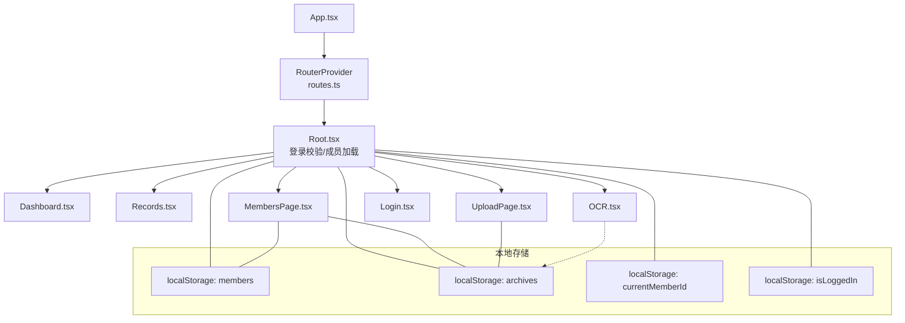
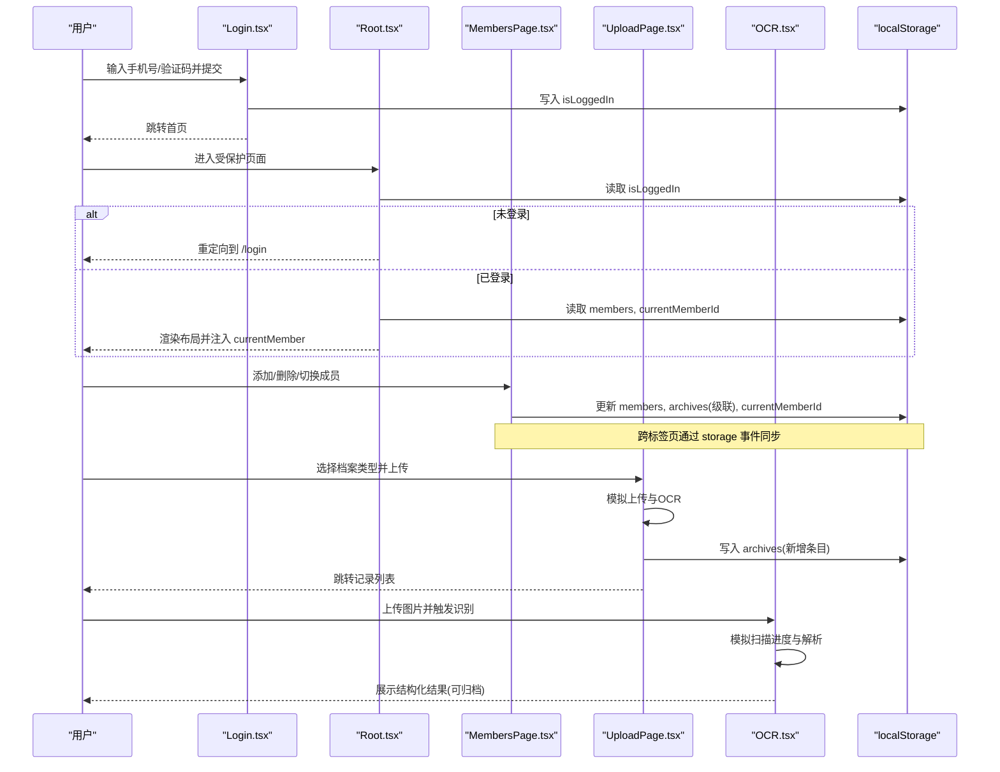
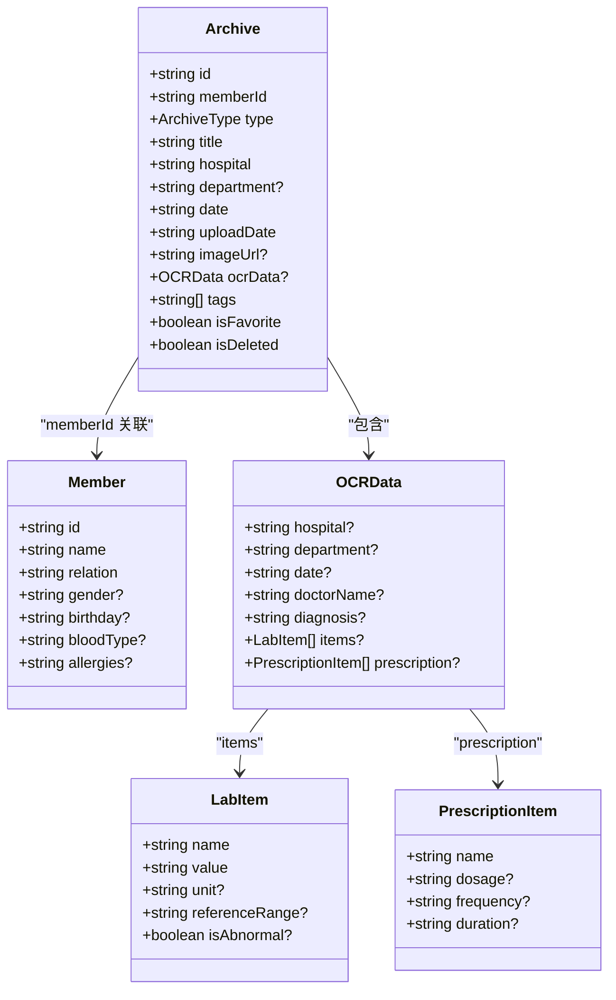
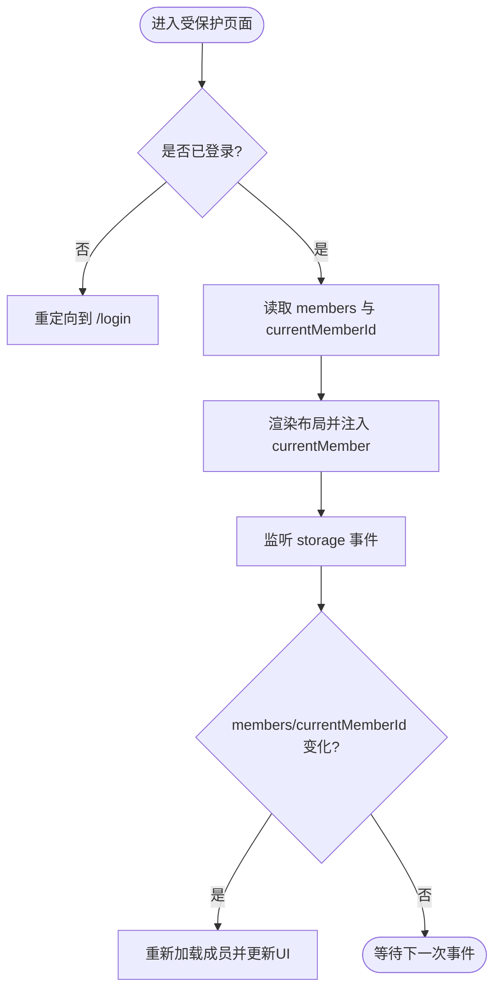
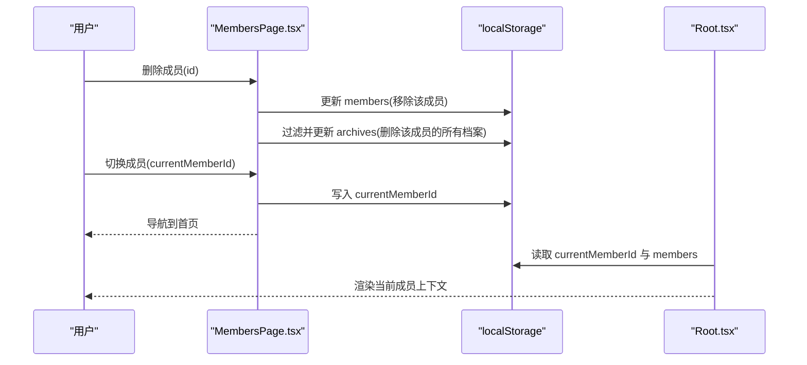
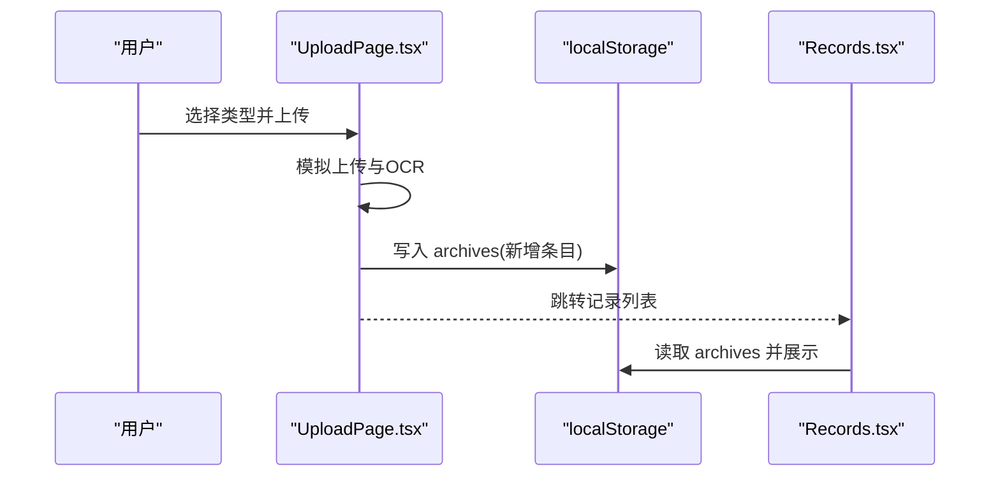
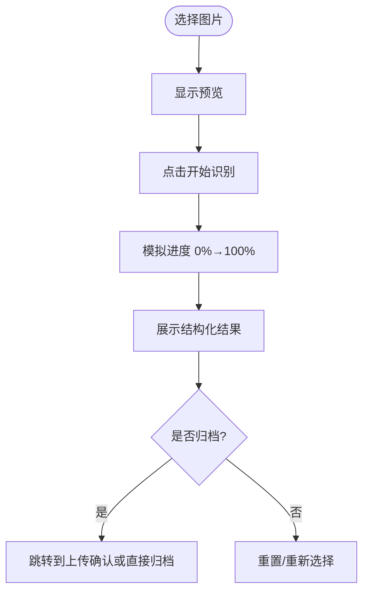
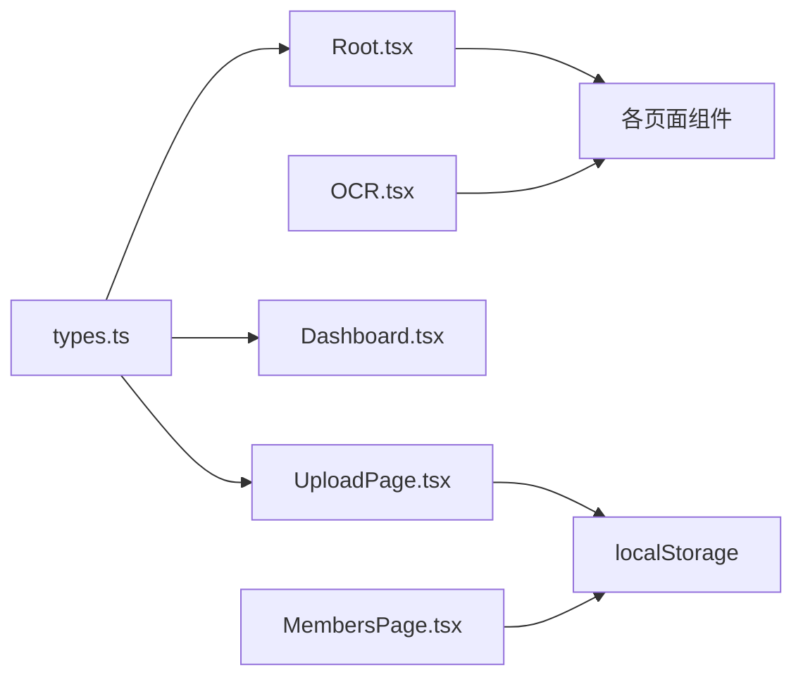

# 数据流设计

<cite>
**本文引用的文件**
- [types.ts](file://figma-ui/src/app/types.ts)
- [App.tsx](file://figma-ui/src/app/App.tsx)
- [Root.tsx](file://figma-ui/src/app/Root.tsx)
- [routes.ts](file://figma-ui/src/app/routes.ts)
- [Dashboard.tsx](file://figma-ui/src/app/pages/Dashboard.tsx)
- [Records.tsx](file://figma-ui/src/app/pages/Records.tsx)
- [MembersPage.tsx](file://figma-ui/src/app/pages/MembersPage.tsx)
- [UploadPage.tsx](file://figma-ui/src/app/pages/UploadPage.tsx)
- [OCR.tsx](file://figma-ui/src/app/pages/OCR.tsx)
- [Login.tsx](file://figma-ui/src/app/pages/Login.tsx)
- [helpers.ts](file://figma-ui/src/app/utils/helpers.ts)
- [mockData.ts](file://figma-ui/src/app/utils/mockData.ts)
</cite>

## 目录
1. [简介](#简介)
2. [项目结构](#项目结构)
3. [核心组件](#核心组件)
4. [架构总览](#架构总览)
5. [详细组件分析](#详细组件分析)
6. [依赖关系分析](#依赖关系分析)
7. [性能考虑](#性能考虑)
8. [故障排查指南](#故障排查指南)
9. [结论](#结论)
10. [附录](#附录)

## 简介
本文件面向医案通医疗档案网站的数据流设计，覆盖从用户交互到本地存储的完整链路：用户输入处理、状态更新、LocalStorage 同步、类型系统、数据验证与错误处理、数据一致性保障、持久化方案、迁移策略与版本管理，以及性能优化（缓存、懒加载、增量更新）。文档通过多幅图表展示组件间数据传递与状态同步机制。

## 项目结构
- 路由与应用壳
  - App.tsx 作为应用根，提供全局上下文（如启动提示）并挂载 RouterProvider。
  - Root.tsx 作为受保护布局，负责登录态校验、当前成员加载与跨页同步（storage 事件）。
  - routes.ts 定义 Hash 路由表，将页面映射到具体组件。
- 页面与功能模块
  - Dashboard.tsx：仪表盘，读取当前成员信息并展示统计与最近记录。
  - Records.tsx：健康档案列表与指标追溯视图（演示数据为主）。
  - MembersPage.tsx：成员管理，读写 members 与 archives，支持切换当前成员。
  - UploadPage.tsx：上传与归档流程，模拟 OCR 后写入 archives。
  - OCR.tsx：OCR 识别界面，模拟扫描进度与结果展示。
  - Login.tsx：登录入口，设置 isLoggedIn 并跳转。
- 类型与工具
  - types.ts：Member、Archive、OCRData、LabItem、PrescriptionItem 等核心类型及常量。
  - helpers.ts：日期格式化、过期判断、ID 生成、脱敏等通用工具。
  - mockData.ts：初始化示例数据（archives），便于首次体验。

图示来源
- [App.tsx:1-12](file://figma-ui/src/app/App.tsx#L1-L12)
- [routes.ts:25-106](file://figma-ui/src/app/routes.ts#L25-L106)
- [Root.tsx:1-59](file://figma-ui/src/app/Root.tsx#L1-L59)
- [Dashboard.tsx:30-40](file://figma-ui/src/app/pages/Dashboard.tsx#L30-L40)
- [MembersPage.tsx:15-48](file://figma-ui/src/app/pages/MembersPage.tsx#L15-L48)
- [UploadPage.tsx:26-52](file://figma-ui/src/app/pages/UploadPage.tsx#L26-L52)
- [OCR.tsx:42-75](file://figma-ui/src/app/pages/OCR.tsx#L42-L75)
- [Login.tsx:18-27](file://figma-ui/src/app/pages/Login.tsx#L18-L27)

章节来源
- [App.tsx:1-12](file://figma-ui/src/app/App.tsx#L1-L12)
- [routes.ts:25-106](file://figma-ui/src/app/routes.ts#L25-L106)
- [Root.tsx:1-59](file://figma-ui/src/app/Root.tsx#L1-L59)

## 核心组件
- 类型系统（types.ts）
  - Member：成员基本信息（id、name、relation、gender、birthday、bloodType、allergies）。
  - Archive：档案主实体（id、memberId、type、title、hospital、department、date、uploadDate、imageUrl、ocrData、tags、isFavorite、isDeleted）。
  - OCRData：OCR 结构化数据（医院、科室、日期、医生、诊断、检验项 items、处方 prescription 等）。
  - LabItem / PrescriptionItem：检验项与处方项明细。
  - ShareLink：分享链接元数据（用于未来扩展）。
  - 常量：ARCHIVE_TYPE_LABELS、ARCHIVE_TYPE_COLORS 用于 UI 展示。
- 应用壳与路由（App.tsx、routes.ts）
  - 使用 createHashRouter 配置路由；Layout 包裹业务区域；Root 作为受保护容器。
- 登录与会话（Login.tsx、Root.tsx）
  - Login.tsx 在提交时写入 isLoggedIn 并导航至首页。
  - Root.tsx 检查 isLoggedIn，未登录则重定向到 /login；同时加载 members 与 currentMemberId，并通过 storage 事件监听跨标签页变更。
- 成员管理（MembersPage.tsx）
  - 读取/写入 localStorage 中的 members；删除成员时级联清理其 archives；切换 currentMemberId 并导航回首页。
- 上传与归档（UploadPage.tsx）
  - 选择类型后模拟上传与 OCR，最终构造 Archive 对象并追加到 archives，然后跳转到 records。
- OCR 识别（OCR.tsx）
  - 选择图片后模拟扫描进度与结果展示，为后续归档提供结构化数据预览。
- 工具函数（helpers.ts）
  - 日期格式化、过期判断、随机 ID 生成、手机号脱敏、剩余天数计算等。
- 示例数据（mockData.ts）
  - 首次访问时若 archives 为空，则写入示例数据，提升首屏体验。

章节来源
- [types.ts:1-95](file://figma-ui/src/app/types.ts#L1-L95)
- [App.tsx:1-12](file://figma-ui/src/app/App.tsx#L1-L12)
- [routes.ts:25-106](file://figma-ui/src/app/routes.ts#L25-L106)
- [Login.tsx:18-27](file://figma-ui/src/app/pages/Login.tsx#L18-L27)
- [Root.tsx:10-46](file://figma-ui/src/app/Root.tsx#L10-L46)
- [MembersPage.tsx:15-48](file://figma-ui/src/app/pages/MembersPage.tsx#L15-L48)
- [UploadPage.tsx:26-52](file://figma-ui/src/app/pages/UploadPage.tsx#L26-L52)
- [OCR.tsx:42-75](file://figma-ui/src/app/pages/OCR.tsx#L42-L75)
- [helpers.ts:1-52](file://figma-ui/src/app/utils/helpers.ts#L1-L52)
- [mockData.ts:91-98](file://figma-ui/src/app/utils/mockData.ts#L91-L98)

## 架构总览
下图展示了从用户交互到本地存储的关键数据流路径，包括登录校验、成员加载、上传归档、OCR 识别与跨页同步。

图示来源
- [Login.tsx:18-27](file://figma-ui/src/app/pages/Login.tsx#L18-L27)
- [Root.tsx:10-46](file://figma-ui/src/app/Root.tsx#L10-L46)
- [MembersPage.tsx:15-48](file://figma-ui/src/app/pages/MembersPage.tsx#L15-L48)
- [UploadPage.tsx:26-52](file://figma-ui/src/app/pages/UploadPage.tsx#L26-L52)
- [OCR.tsx:42-75](file://figma-ui/src/app/pages/OCR.tsx#L42-L75)

## 详细组件分析

### 类型系统与数据模型
- Member：唯一标识 id，姓名 name，关系 relation，可选性别 gender、生日 birthday、血型 bloodType、过敏史 allergies。
- Archive：唯一标识 id，关联 memberId，类型 type（枚举），标题 title，医院 hospital，科室 department，就诊日期 date，上传日期 uploadDate，可选图片 imageUrl，OCR 结构化数据 ocrData，标签 tags，收藏 isFavorite，逻辑删除 isDeleted。
- OCRData：包含医院、科室、日期、医生、诊断、检验项 items、处方 prescription 等字段，支持扩展键。
- LabItem / PrescriptionItem：分别描述检验项与处方项的结构。
- 常量：档案类型标签与颜色映射，便于前端展示。

图示来源
- [types.ts:1-95](file://figma-ui/src/app/types.ts#L1-L95)

章节来源
- [types.ts:1-95](file://figma-ui/src/app/types.ts#L1-L95)

### 登录与会话数据流
- 登录：Login.tsx 校验手机号长度，成功后写入 isLoggedIn 并跳转首页。
- 守卫：Root.tsx 检查 isLoggedIn，未登录重定向到 /login；已登录后加载 members 与 currentMemberId，并将 currentMember 注入 Outlet 上下文供子页面使用。
- 跨页同步：Root.tsx 监听 window.storage 事件，当其他标签修改 members 或 currentMemberId 时自动刷新当前成员。

图示来源
- [Login.tsx:18-27](file://figma-ui/src/app/pages/Login.tsx#L18-L27)
- [Root.tsx:10-46](file://figma-ui/src/app/Root.tsx#L10-L46)

章节来源
- [Login.tsx:18-27](file://figma-ui/src/app/pages/Login.tsx#L18-L27)
- [Root.tsx:10-46](file://figma-ui/src/app/Root.tsx#L10-L46)

### 成员管理与数据一致性
- 成员增删改
  - 新增：MembersPage.tsx 收集表单数据，生成新 Member，写入 members。
  - 删除：过滤掉目标成员，并级联删除其所有 archives。
  - 切换：更新 currentMemberId 并导航回首页，Root.tsx 会重新加载该成员。
- 数据一致性
  - 删除成员时确保 archives 中对应 memberId 的记录被清理，避免孤儿数据。
  - 通过 storage 事件实现多标签页一致。

图示来源
- [MembersPage.tsx:27-48](file://figma-ui/src/app/pages/MembersPage.tsx#L27-L48)
- [Root.tsx:18-46](file://figma-ui/src/app/Root.tsx#L18-L46)

章节来源
- [MembersPage.tsx:27-48](file://figma-ui/src/app/pages/MembersPage.tsx#L27-L48)
- [Root.tsx:18-46](file://figma-ui/src/app/Root.tsx#L18-L46)

### 上传与归档流程
- 流程步骤
  - 选择档案类型（门诊病历、检验报告、影像报告、处方、体检报告、出院记录、发票、其他）。
  - 模拟上传与 OCR 解析。
  - 确认后将新 Archive 写入 archives，并跳转到记录列表。
- 数据结构
  - 新 Archive 包含 id、memberId（来自 currentMemberId）、type、title、hospital、department、date、uploadDate、tags、isFavorite、isDeleted、ocrData（示例结构化数据）。

图示来源
- [UploadPage.tsx:12-52](file://figma-ui/src/app/pages/UploadPage.tsx#L12-L52)

章节来源
- [UploadPage.tsx:12-52](file://figma-ui/src/app/pages/UploadPage.tsx#L12-L52)

### OCR 识别与结果展示
- 用户选择图片后，显示预览与“开始识别”按钮。
- 点击后模拟扫描进度条与结果展示，包含关键指标与总结。
- 结果可用于后续归档（与 UploadPage 流程衔接）。

图示来源
- [OCR.tsx:32-75](file://figma-ui/src/app/pages/OCR.tsx#L32-L75)

章节来源
- [OCR.tsx:32-75](file://figma-ui/src/app/pages/OCR.tsx#L32-L75)

### 仪表盘与记录列表
- Dashboard.tsx：从 Root 上下文获取 currentMember，展示欢迎信息与统计卡片、最近记录。
- Records.tsx：提供常规列表与指标追溯两种视图，支持分类筛选与搜索（演示数据为主）。

章节来源
- [Dashboard.tsx:30-40](file://figma-ui/src/app/pages/Dashboard.tsx#L30-L40)
- [Records.tsx:101-122](file://figma-ui/src/app/pages/Records.tsx#L101-L122)

## 依赖关系分析
- 组件耦合
  - Root.tsx 依赖 types.ts 的 Member 类型，并通过 Outlet 向子页面注入 currentMember。
  - MembersPage.tsx 直接操作 localStorage 的 members 与 archives，维护成员与档案的一致性。
  - UploadPage.tsx 依赖 types.ts 的 ArchiveType 与 ARCHIVE_TYPE_LABELS，构造 Archive 并写入 archives。
  - OCR.tsx 独立于持久层，仅负责模拟识别流程与结果展示。
- 外部依赖
  - React Router（createHashRouter）用于路由与导航。
  - motion/react 用于动画效果。
  - sonner 用于 Toast 提示。
  - recharts 用于图表展示（Dashboard）。

图示来源
- [types.ts:1-95](file://figma-ui/src/app/types.ts#L1-L95)
- [Root.tsx:1-59](file://figma-ui/src/app/Root.tsx#L1-L59)
- [UploadPage.tsx:1-52](file://figma-ui/src/app/pages/UploadPage.tsx#L1-L52)
- [MembersPage.tsx:1-48](file://figma-ui/src/app/pages/MembersPage.tsx#L1-L48)
- [OCR.tsx:1-75](file://figma-ui/src/app/pages/OCR.tsx#L1-L75)

章节来源
- [types.ts:1-95](file://figma-ui/src/app/types.ts#L1-L95)
- [Root.tsx:1-59](file://figma-ui/src/app/Root.tsx#L1-L59)
- [UploadPage.tsx:1-52](file://figma-ui/src/app/pages/UploadPage.tsx#L1-L52)
- [MembersPage.tsx:1-48](file://figma-ui/src/app/pages/MembersPage.tsx#L1-L48)
- [OCR.tsx:1-75](file://figma-ui/src/app/pages/OCR.tsx#L1-L75)

## 性能考虑
- 数据缓存
  - 使用 localStorage 作为轻量级缓存，减少重复请求与初始化成本。
  - 首次访问通过 mockData.ts 初始化示例数据，提升首屏体验。
- 懒加载
  - 路由采用 Hash 模式，结合 React Router 按需加载页面组件。
  - 图表与大图资源可在实际项目中按视口懒加载。
- 增量更新
  - 成员删除时仅对 archives 进行必要过滤，避免全量重建。
  - 通过 storage 事件实现跨标签页增量同步，避免轮询。
- 渲染优化
  - 使用 motion/react 的 AnimatePresence 与 layout 动画，减少不必要的重排。
  - 列表项使用 key 稳定标识，提高 Diff 效率。

[本节为通用指导，不直接分析具体文件]

## 故障排查指南
- 常见问题
  - 无法进入受保护页面：检查 localStorage 中 isLoggedIn 是否存在且为真。
  - 当前成员为空：检查 members 是否为空数组或 currentMemberId 是否指向有效成员。
  - 成员删除后仍有残留档案：确认删除逻辑是否正确过滤 archives 中对应 memberId 的记录。
  - 多标签页不同步：确认 Root.tsx 是否正确监听 storage 事件并刷新成员。
- 调试建议
  - 在浏览器开发者工具的 Application 面板查看 localStorage 内容。
  - 在 Network 与 Console 中观察是否有异常日志。
  - 逐步断点定位：登录、成员加载、上传归档、OCR 识别等关键节点。

章节来源
- [Root.tsx:10-46](file://figma-ui/src/app/Root.tsx#L10-L46)
- [MembersPage.tsx:27-48](file://figma-ui/src/app/pages/MembersPage.tsx#L27-L48)
- [UploadPage.tsx:26-52](file://figma-ui/src/app/pages/UploadPage.tsx#L26-L52)
- [OCR.tsx:42-75](file://figma-ui/src/app/pages/OCR.tsx#L42-L75)

## 结论
本项目以 React Router 驱动页面路由，Root.tsx 作为受保护布局统一处理登录态与成员上下文；成员与档案数据通过 localStorage 持久化，并在多标签页间通过 storage 事件保持同步。类型系统清晰定义了 Member、Archive、OCRData 等核心模型，支撑上传归档与 OCR 识别流程。当前实现以演示数据为主，后续可扩展真实 OCR 服务、后端 API 与更完善的权限控制。建议在工程化层面引入数据迁移与版本管理，进一步提升健壮性与可维护性。

[本节为总结性内容，不直接分析具体文件]

## 附录

### 数据持久化方案（LocalStorage）
- 键名约定
  - isLoggedIn：布尔值字符串，表示登录状态。
  - members：成员列表 JSON 数组。
  - archives：档案列表 JSON 数组。
  - currentMemberId：当前成员 ID。
- 读写策略
  - 登录：写入 isLoggedIn。
  - 成员管理：读写 members，删除成员时级联清理 archives。
  - 上传归档：写入 archives 新条目。
  - 跨页同步：Root.tsx 监听 storage 事件，自动刷新成员。

章节来源
- [Login.tsx:18-27](file://figma-ui/src/app/pages/Login.tsx#L18-L27)
- [MembersPage.tsx:15-48](file://figma-ui/src/app/pages/MembersPage.tsx#L15-L48)
- [UploadPage.tsx:26-52](file://figma-ui/src/app/pages/UploadPage.tsx#L26-L52)
- [Root.tsx:18-46](file://figma-ui/src/app/Root.tsx#L18-L46)

### 数据验证机制与错误处理策略
- 输入验证
  - 登录：手机号长度校验，错误时通过 toast 提示。
  - 成员表单：必填字段（姓名、关系）校验，缺失时提示。
- 错误处理
  - 使用 sonner 的 toast 提供即时反馈。
  - 删除成员前二次确认，防止误删。
- 数据一致性
  - 删除成员时级联清理 archives，避免孤儿数据。
  - 通过 storage 事件保证多标签页一致性。

章节来源
- [Login.tsx:18-27](file://figma-ui/src/app/pages/Login.tsx#L18-L27)
- [MembersPage.tsx:27-48](file://figma-ui/src/app/pages/MembersPage.tsx#L27-L48)

### 数据迁移策略与版本管理
- 现状
  - 当前无显式版本字段与迁移脚本。
- 建议
  - 在 members/archives 中添加 version 字段，用于标识数据结构版本。
  - 应用启动时检测版本，执行迁移脚本（如字段重命名、默认值填充、历史数据兼容）。
  - 提供回滚机制与迁移日志，便于问题定位。

[本节为概念性建议，不直接分析具体文件]