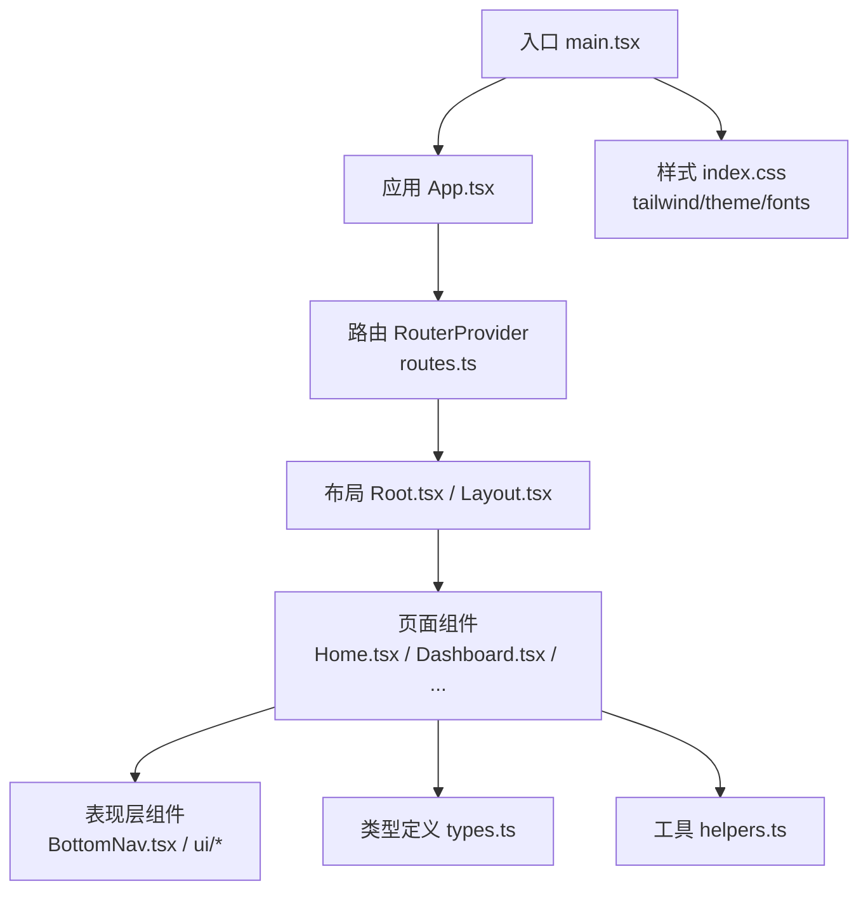
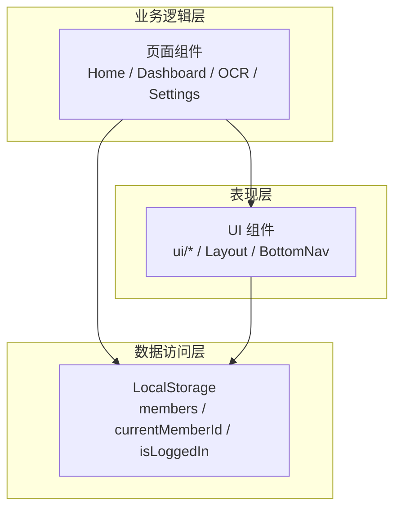
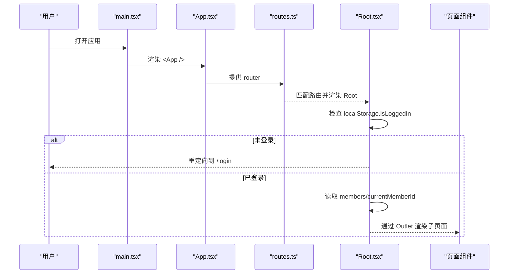
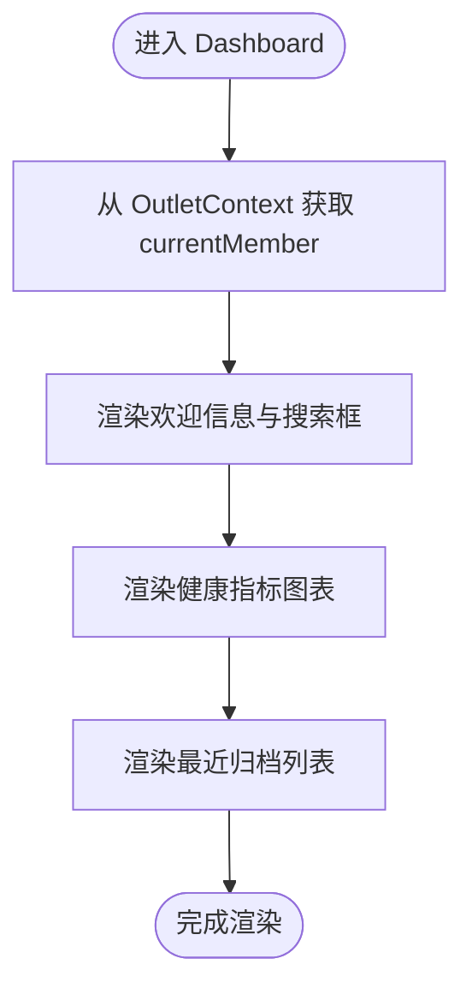
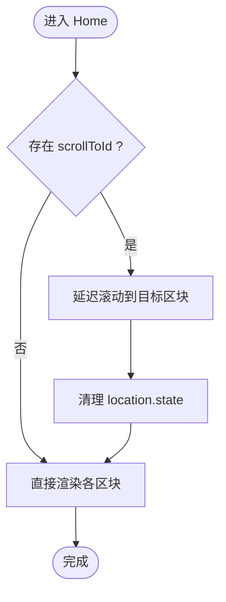
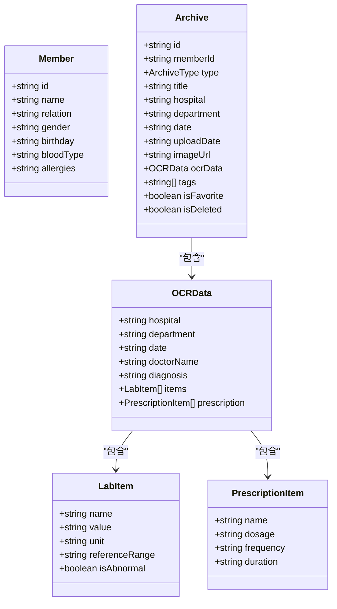
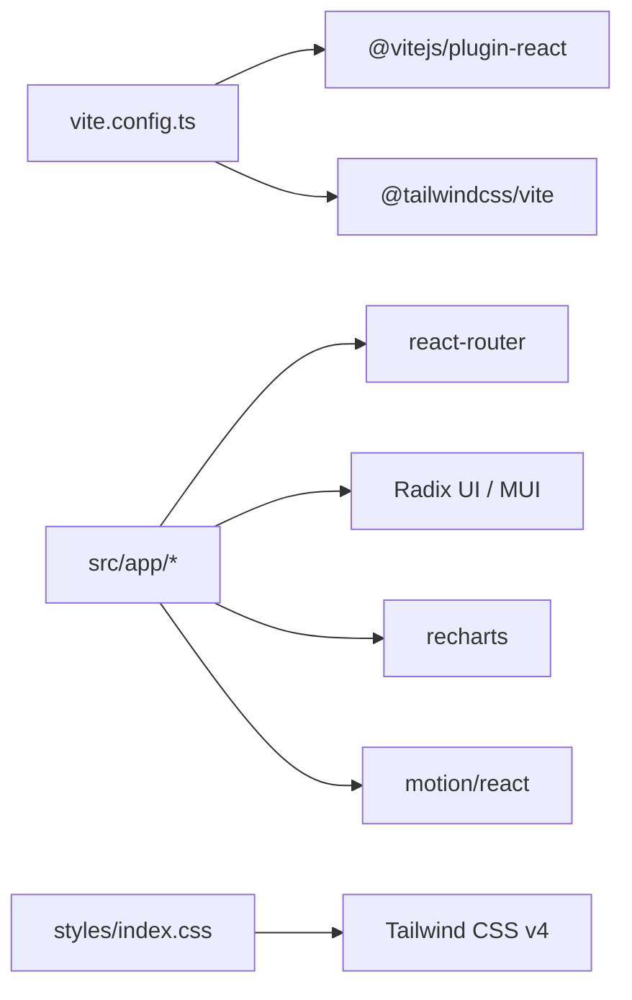

# 整体架构概览

<cite>
**本文引用的文件**
- [package.json](file://figma-ui/package.json)
- [vite.config.ts](file://figma-ui/vite.config.ts)
- [postcss.config.mjs](file://figma-ui/postcss.config.mjs)
- [README.md](file://figma-ui/README.md)
- [main.tsx](file://figma-ui/src/main.tsx)
- [App.tsx](file://figma-ui/src/app/App.tsx)
- [routes.ts](file://figma-ui/src/app/routes.ts)
- [Root.tsx](file://figma-ui/src/app/Root.tsx)
- [Layout.tsx](file://figma-ui/src/app/components/Layout.tsx)
- [BottomNav.tsx](file://figma-ui/src/app/components/BottomNav.tsx)
- [Home.tsx](file://figma-ui/src/app/pages/Home.tsx)
- [Dashboard.tsx](file://figma-ui/src/app/pages/Dashboard.tsx)
- [types.ts](file://figma-ui/src/app/types.ts)
- [helpers.ts](file://figma-ui/src/app/utils/helpers.ts)
- [index.css](file://figma-ui/src/styles/index.css)
</cite>

## 目录
1. [简介](#简介)
2. [项目结构](#项目结构)
3. [核心组件](#核心组件)
4. [架构总览](#架构总览)
5. [详细组件分析](#详细组件分析)
6. [依赖分析](#依赖分析)
7. [性能考虑](#性能考虑)
8. [故障排查指南](#故障排查指南)
9. [结论](#结论)
10. [附录](#附录)

## 简介
本文件为“医案通医疗档案网站”的整体架构概览，面向前端工程与产品团队，帮助快速理解基于 React + TypeScript 的现代化前端应用。项目采用 Vite 作为构建工具，使用 Tailwind CSS（v4）进行原子化样式开发，结合 Radix UI、MUI、Recharts、Motion 等生态库，实现高可用、可维护、可扩展的前端体验。数据层当前以 LocalStorage 为主，便于离线演示与快速迭代；后续可按需接入后端 API。

## 项目结构
项目采用按功能域划分的目录组织方式：
- src/app：应用根模块，包含路由、页面、通用布局与上下文提供者
- src/app/components：表现层组件（如 Layout、BottomNav、UI 基础组件）
- src/app/pages：业务逻辑层页面组件（如 Home、Dashboard、OCR、Settings 等）
- src/app/utils：工具函数（日期格式化、掩码、ID 生成等）
- src/app/hooks：自定义 Hook（如首页滚动导航）
- src/styles：全局样式入口与主题配置
- figma-ui：Vite 工程根，包含构建配置、脚本与依赖声明

图表来源
- [main.tsx:1-7](file://figma-ui/src/main.tsx#L1-L7)
- [App.tsx:1-12](file://figma-ui/src/app/App.tsx#L1-L12)
- [routes.ts:1-106](file://figma-ui/src/app/routes.ts#L1-L106)
- [Root.tsx:1-59](file://figma-ui/src/app/Root.tsx#L1-L59)
- [Layout.tsx:1-251](file://figma-ui/src/app/components/Layout.tsx#L1-L251)
- [BottomNav.tsx:1-85](file://figma-ui/src/app/components/BottomNav.tsx#L1-L85)
- [Home.tsx:1-43](file://figma-ui/src/app/pages/Home.tsx#L1-L43)
- [Dashboard.tsx:1-204](file://figma-ui/src/app/pages/Dashboard.tsx#L1-L204)
- [types.ts:1-95](file://figma-ui/src/app/types.ts#L1-L95)
- [helpers.ts:1-52](file://figma-ui/src/app/utils/helpers.ts#L1-L52)
- [index.css:1-4](file://figma-ui/src/styles/index.css#L1-L4)

章节来源
- [README.md:1-11](file://figma-ui/README.md#L1-L11)
- [package.json:1-101](file://figma-ui/package.json#L1-L101)
- [vite.config.ts:1-30](file://figma-ui/vite.config.ts#L1-L30)
- [postcss.config.mjs:1-16](file://figma-ui/postcss.config.mjs#L1-L16)

## 核心组件
- 应用壳与路由
  - 入口渲染：React 18 createRoot 挂载到 #root
  - 应用容器：RouterProvider 注入路由实例，提供全局上下文（如 LaunchNoticeProvider）
  - 路由表：createHashRouter 集中管理页面与嵌套路由，支持登录态守卫与子路由 Outlet
- 布局与导航
  - Root：登录态校验、成员信息加载、底部导航常驻
  - Layout：顶部导航、移动端菜单、页脚与内容区
  - BottomNav：移动端底部导航，含特殊上传按钮与动效
- 页面组件
  - Home：首页多区块组合，支持平滑滚动定位
  - Dashboard：仪表盘，展示健康指标趋势与最近归档
- 类型与工具
  - types：成员、档案、OCR、分享链接等核心数据结构
  - helpers：日期格式化、过期判断、ID 生成、手机号掩码等

章节来源
- [main.tsx:1-7](file://figma-ui/src/main.tsx#L1-L7)
- [App.tsx:1-12](file://figma-ui/src/app/App.tsx#L1-L12)
- [routes.ts:1-106](file://figma-ui/src/app/routes.ts#L1-L106)
- [Root.tsx:1-59](file://figma-ui/src/app/Root.tsx#L1-L59)
- [Layout.tsx:1-251](file://figma-ui/src/app/components/Layout.tsx#L1-L251)
- [BottomNav.tsx:1-85](file://figma-ui/src/app/components/BottomNav.tsx#L1-L85)
- [Home.tsx:1-43](file://figma-ui/src/app/pages/Home.tsx#L1-L43)
- [Dashboard.tsx:1-204](file://figma-ui/src/app/pages/Dashboard.tsx#L1-L204)
- [types.ts:1-95](file://figma-ui/src/app/types.ts#L1-L95)
- [helpers.ts:1-52](file://figma-ui/src/app/utils/helpers.ts#L1-L52)

## 架构总览
应用采用三层分层架构：
- 表现层（UI 组件）：负责界面呈现与交互反馈，包括基础 UI 组件、布局与导航
- 业务逻辑层（页面组件）：聚合多个 UI 组件，编排用户流程与状态展示
- 数据访问层（LocalStorage）：当前用于本地持久化与跨标签同步（storage 事件），便于演示与快速验证

技术栈选型与优势：
- React 18：并发特性、更好的渲染性能与更稳定的状态更新
- TypeScript：强类型约束，提升代码可维护性与团队协作效率
- Vite：极速冷启动与热更新，插件生态完善，适合现代前端工程
- Tailwind CSS v4：原子化样式，通过 @tailwindcss/vite 集成，减少 CSS 体积并提升一致性
- Radix UI/MUI：高质量无障碍组件与丰富 UI 能力，降低重复造轮子成本
- Recharts/Motion：数据可视化与流畅动效，提升用户体验

图表来源
- [Root.tsx:10-46](file://figma-ui/src/app/Root.tsx#L10-L46)
- [Dashboard.tsx:30-55](file://figma-ui/src/app/pages/Dashboard.tsx#L30-L55)
- [Layout.tsx:10-144](file://figma-ui/src/app/components/Layout.tsx#L10-L144)
- [BottomNav.tsx:5-85](file://figma-ui/src/app/components/BottomNav.tsx#L5-L85)

## 详细组件分析

### 路由与导航流
- 入口渲染后，App 注入 RouterProvider，由 routes.ts 定义的路由表驱动页面切换
- Root 在挂载时检查登录态，未登录跳转至登录页；已登录则加载成员信息并通过 Outlet 渲染子页面
- Layout 提供顶部导航与页脚，配合 Home 的滚动定位实现单页内导航

图表来源
- [main.tsx:1-7](file://figma-ui/src/main.tsx#L1-L7)
- [App.tsx:1-12](file://figma-ui/src/app/App.tsx#L1-L12)
- [routes.ts:24-106](file://figma-ui/src/app/routes.ts#L24-L106)
- [Root.tsx:10-55](file://figma-ui/src/app/Root.tsx#L10-L55)

章节来源
- [routes.ts:1-106](file://figma-ui/src/app/routes.ts#L1-L106)
- [Root.tsx:1-59](file://figma-ui/src/app/Root.tsx#L1-L59)

### 仪表盘数据展示
- Dashboard 从 Root 的 OutletContext 获取当前成员信息，展示欢迎语与健康指标
- 使用 Recharts 绘制面积图与折线图，展示血压、血糖等趋势
- 最近归档列表通过 Link 跳转到详情页，体现页面间导航

图表来源
- [Dashboard.tsx:30-141](file://figma-ui/src/app/pages/Dashboard.tsx#L30-L141)
- [Root.tsx:52-55](file://figma-ui/src/app/Root.tsx#L52-L55)

章节来源
- [Dashboard.tsx:1-204](file://figma-ui/src/app/pages/Dashboard.tsx#L1-L204)

### 首页滚动导航
- Home 根据 location.state 中的 scrollToId 自动滚动到对应区块，并在完成后清理 state
- 通过 useHomeSectionNav 与 Layout 联动，实现顶部导航点击平滑滚动

图表来源
- [Home.tsx:13-27](file://figma-ui/src/app/pages/Home.tsx#L13-L27)
- [Layout.tsx:24-63](file://figma-ui/src/app/components/Layout.tsx#L24-L63)

章节来源
- [Home.tsx:1-43](file://figma-ui/src/app/pages/Home.tsx#L1-L43)
- [Layout.tsx:1-251](file://figma-ui/src/app/components/Layout.tsx#L1-L251)

### 数据模型与类型
- Member：成员基本信息
- Archive：档案条目，包含类型、元数据、OCR 解析结果、标签、收藏与删除标记
- OCRData/LabItem/PrescriptionItem：结构化病历数据
- ShareLink：分享链接的生命周期与权限控制

图表来源
- [types.ts:1-95](file://figma-ui/src/app/types.ts#L1-L95)

章节来源
- [types.ts:1-95](file://figma-ui/src/app/types.ts#L1-L95)

## 依赖分析
- 运行时依赖
  - React 18、ReactDOM：UI 框架与渲染引擎
  - react-router：客户端路由与导航
  - tailwind-merge、clsx：类名合并与条件类名
  - recharts：数据可视化
  - motion/react：动画与过渡效果
  - lucide-react：图标库
  - Radix UI 系列：无样式、可访问的基础组件
  - MUI：可选的 Material 风格组件与图标
- 构建与样式
  - vite：构建与开发服务器
  - @vitejs/plugin-react：React 支持
  - @tailwindcss/vite：Tailwind v4 集成
  - postcss.config.mjs：扩展 PostCSS 插件（当前为空）

图表来源
- [vite.config.ts:1-30](file://figma-ui/vite.config.ts#L1-L30)
- [postcss.config.mjs:1-16](file://figma-ui/postcss.config.mjs#L1-L16)
- [package.json:14-82](file://figma-ui/package.json#L14-L82)
- [index.css:1-4](file://figma-ui/src/styles/index.css#L1-L4)

章节来源
- [package.json:1-101](file://figma-ui/package.json#L1-L101)
- [vite.config.ts:1-30](file://figma-ui/vite.config.ts#L1-L30)
- [postcss.config.mjs:1-16](file://figma-ui/postcss.config.mjs#L1-L16)

## 性能考虑
- 构建优化
  - Vite 提供极快的开发与构建速度，按需编译与热更新
  - Tailwind v4 通过 @tailwindcss/vite 自动处理样式树摇与去重
- 渲染优化
  - React 18 的并发渲染与批处理有助于复杂页面的响应性
  - 合理使用 memo/useMemo/useCallback 避免不必要的重渲染（建议在大数据列表或高频更新场景评估）
- 资源优化
  - 图片与 SVG 通过 assetsInclude 支持原始导入，建议按需懒加载与压缩
  - 图表数据量较大时可分页或虚拟滚动（当前示例数据较小）
- 存储优化
  - LocalStorage 容量有限且同步读写，建议对大对象进行序列化与分片存储
  - 利用 storage 事件实现跨标签同步，注意节流与错误处理

[本节为通用指导，不直接分析具体文件]

## 故障排查指南
- 登录态问题
  - 现象：进入应用被重定向到登录页
  - 排查：检查 localStorage 中 isLoggedIn 是否存在；确认 Root 的 useEffect 是否正确执行
  - 参考路径：[Root.tsx:10-16](file://figma-ui/src/app/Root.tsx#L10-L16)
- 成员数据为空
  - 现象：页面显示加载中或默认成员
  - 排查：检查 members 与 currentMemberId 是否写入；确认 storage 事件监听是否生效
  - 参考路径：[Root.tsx:18-45](file://figma-ui/src/app/Root.tsx#L18-L45)
- 样式未生效
  - 现象：Tailwind 类无效或主题色异常
  - 排查：确认 styles/index.css 引入顺序；检查 vite.config.ts 与 postcss.config.mjs 配置
  - 参考路径：[index.css:1-4](file://figma-ui/src/styles/index.css#L1-L4)、[vite.config.ts:14-19](file://figma-ui/vite.config.ts#L14-L19)、[postcss.config.mjs:1-16](file://figma-ui/postcss.config.mjs#L1-L16)
- 路由跳转异常
  - 现象：页面无法切换或参数丢失
  - 排查：检查 routes.ts 路由定义与 Link 的 to 属性；确认 Hash 模式与 base 配置
  - 参考路径：[routes.ts:24-106](file://figma-ui/src/app/routes.ts#L24-L106)、[vite.config.ts:9-13](file://figma-ui/vite.config.ts#L9-L13)

章节来源
- [Root.tsx:10-55](file://figma-ui/src/app/Root.tsx#L10-L55)
- [index.css:1-4](file://figma-ui/src/styles/index.css#L1-L4)
- [vite.config.ts:9-19](file://figma-ui/vite.config.ts#L9-L19)
- [postcss.config.mjs:1-16](file://figma-ui/postcss.config.mjs#L1-L16)
- [routes.ts:24-106](file://figma-ui/src/app/routes.ts#L24-L106)

## 结论
本项目以 React 18 + TypeScript 为核心，借助 Vite 与 Tailwind CSS v4 构建现代化前端工程。通过清晰的三层架构（表现层、业务逻辑层、数据访问层）与模块化目录组织，实现了良好的可维护性与扩展性。当前数据层基于 LocalStorage，便于快速演示与迭代；未来可平滑迁移至后端 API 与服务端渲染。建议在后续版本中引入状态管理、错误边界与单元测试，进一步提升稳定性与可测试性。

[本节为总结性内容，不直接分析具体文件]

## 附录
- 开发环境配置
  - Node 版本：20（见 engines）
  - 安装依赖：npm i
  - 启动开发服务器：npm run dev
  - 预览构建产物：npm run preview
- 构建流程说明
  - 构建命令：vite build
  - 插件：@vitejs/plugin-react、@tailwindcss/vite
  - 别名：@ -> ./src
  - 静态资源：支持 .svg、.csv 原始导入
  - 部署基路径：可通过环境变量 VITE_BASE_URL 设置（默认 /）

章节来源
- [README.md:6-11](file://figma-ui/README.md#L6-L11)
- [package.json:6-13](file://figma-ui/package.json#L6-L13)
- [vite.config.ts:1-29](file://figma-ui/vite.config.ts#L1-L29)