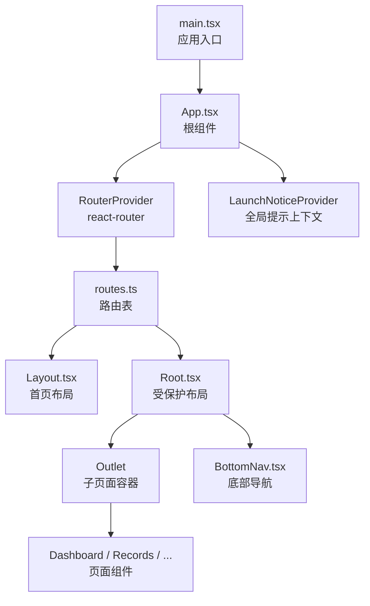
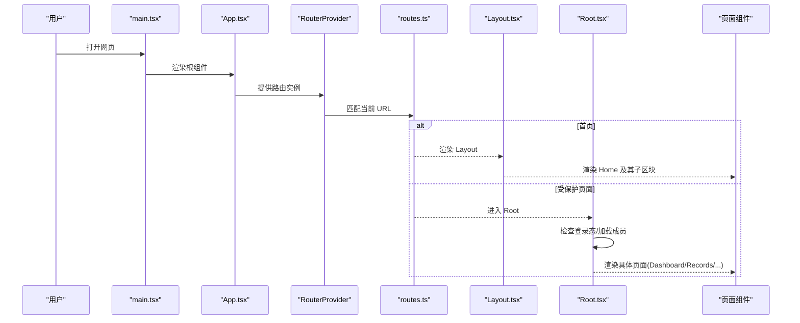
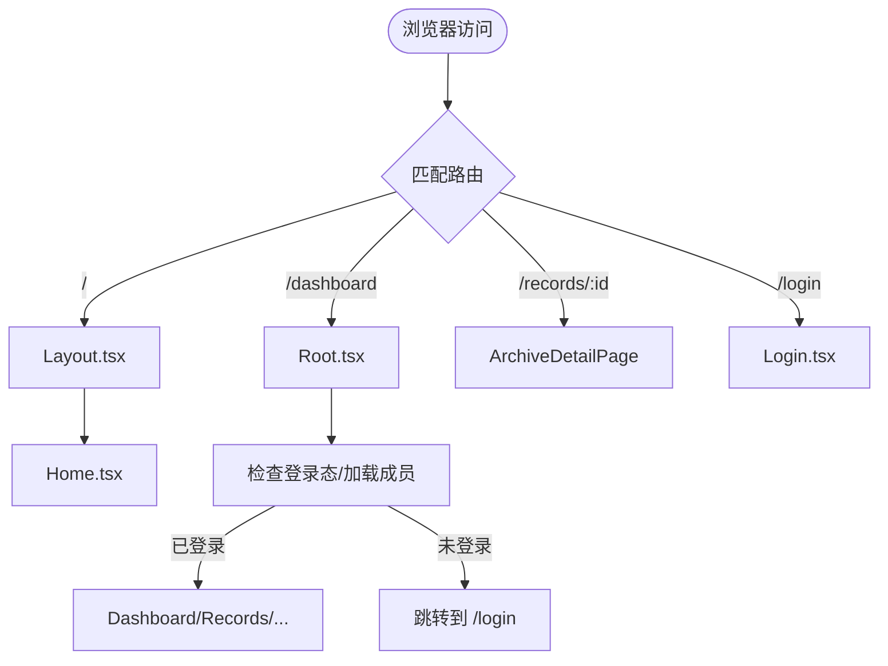
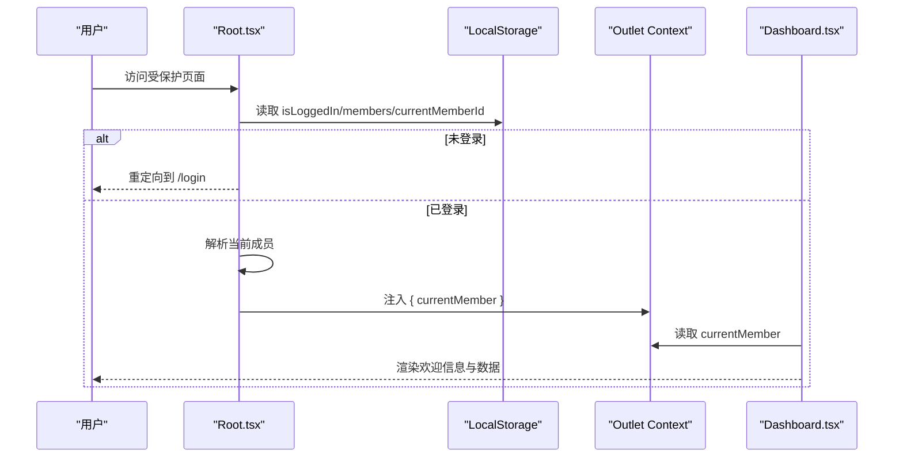
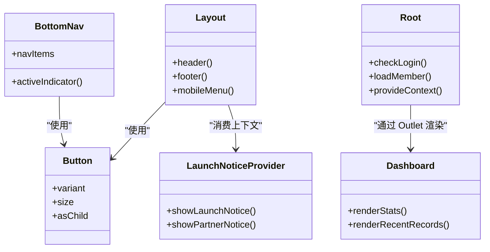
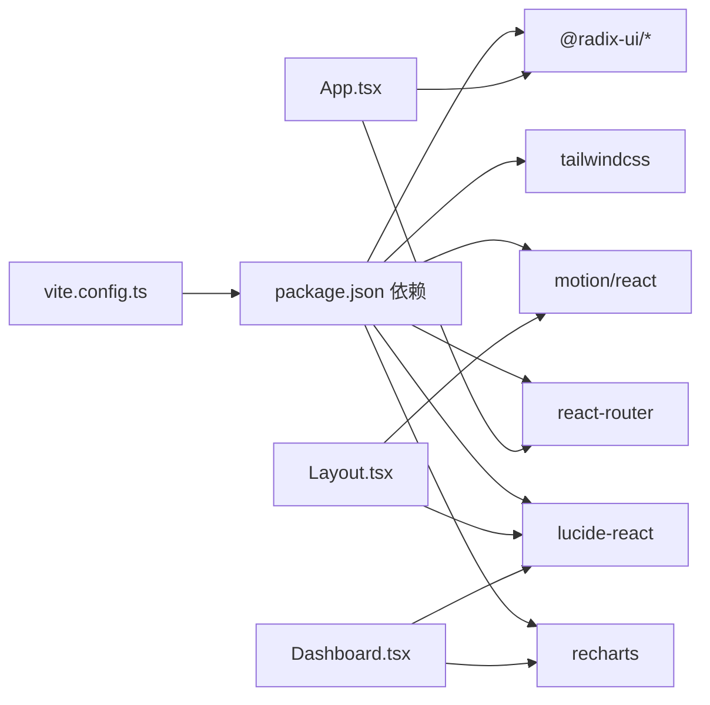

# 架构设计

<cite>
**本文引用的文件**
- [package.json](file://figma-ui/package.json)
- [vite.config.ts](file://figma-ui/vite.config.ts)
- [main.tsx](file://figma-ui/src/main.tsx)
- [App.tsx](file://figma-ui/src/app/App.tsx)
- [Root.tsx](file://figma-ui/src/app/Root.tsx)
- [routes.ts](file://figma-ui/src/app/routes.ts)
- [Layout.tsx](file://figma-ui/src/app/components/Layout.tsx)
- [BottomNav.tsx](file://figma-ui/src/app/components/BottomNav.tsx)
- [LaunchNoticeProvider.tsx](file://figma-ui/src/app/components/LaunchNoticeProvider.tsx)
- [Home.tsx](file://figma-ui/src/app/pages/Home.tsx)
- [Dashboard.tsx](file://figma-ui/src/app/pages/Dashboard.tsx)
- [types.ts](file://figma-ui/src/app/types.ts)
- [useHomeSectionNav.ts](file://figma-ui/src/app/hooks/useHomeSectionNav.ts)
- [helpers.ts](file://figma-ui/src/app/utils/helpers.ts)
- [button.tsx](file://figma-ui/src/app/components/ui/button.tsx)
- [index.css](file://figma-ui/src/styles/index.css)
</cite>

## 目录
1. [简介](#简介)
2. [项目结构](#项目结构)
3. [核心组件](#核心组件)
4. [架构总览](#架构总览)
5. [详细组件分析](#详细组件分析)
6. [依赖关系分析](#依赖关系分析)
7. [性能考量](#性能考量)
8. [故障排查指南](#故障排查指南)
9. [结论](#结论)
10. [附录](#附录)

## 简介
本文件为“医案通医疗档案网站”的架构设计文档，面向产品、设计与工程团队。文档基于仓库现有代码，系统性阐述整体应用架构与实现要点：
- 前端技术栈：React + TypeScript（类型定义集中）、Vite 构建、Tailwind CSS 样式体系、React Router v7（Hash 路由）
- 状态管理：Context API 用于全局提示弹窗；LocalStorage 用于登录态与当前成员信息；页面内使用 React Hooks 管理局部状态
- 组件分层：基础 UI 组件 → 业务组件 → 页面组件；通过路由组织页面，通过 Context/Hooks 共享能力
- 数据流：用户交互触发状态更新或路由跳转，必要时读写 LocalStorage；页面渲染由路由与上下文驱动

## 项目结构
- 入口与根节点
  - 应用入口在 main.tsx，挂载 React 根节点并引入全局样式
  - App 作为根组件，提供 LaunchNoticeProvider 与 RouterProvider
- 路由与布局
  - routes.ts 使用 createHashRouter 声明式组合式路由，将首页 Layout 与受保护的 Root 布局分离
  - Root 负责登录校验、加载当前成员信息，并通过 Outlet 注入子页面
  - Layout 提供首页头部导航与页脚，配合 Home 页面展示营销与引导内容
- 页面与功能模块
  - Dashboard、Records、OCR、Family、Settings、Search、Upload、Share、Members、MetricHistory、DocumentViewer、Promo、Logo、Download、Login 等页面按功能划分
- 基础 UI 与工具
  - ui/button 等基础组件采用 class-variance-authority 管理变体
  - hooks/useHomeSectionNav 封装首页锚点滚动逻辑
  - utils/helpers 提供日期格式化、过期判断、ID 生成等通用方法
- 构建与样式
  - vite.config.ts 配置别名、插件与资源包含
  - styles/index.css 统一引入字体、Tailwind 与主题

图表来源
- [main.tsx:1-7](file://figma-ui/src/main.tsx#L1-L7)
- [App.tsx:1-12](file://figma-ui/src/app/App.tsx#L1-L12)
- [routes.ts:1-106](file://figma-ui/src/app/routes.ts#L1-L106)
- [Layout.tsx:1-251](file://figma-ui/src/app/components/Layout.tsx#L1-L251)
- [Root.tsx:1-59](file://figma-ui/src/app/Root.tsx#L1-L59)
- [BottomNav.tsx:1-85](file://figma-ui/src/app/components/BottomNav.tsx#L1-L85)
- [LaunchNoticeProvider.tsx:1-118](file://figma-ui/src/app/components/LaunchNoticeProvider.tsx#L1-L118)

章节来源
- [main.tsx:1-7](file://figma-ui/src/main.tsx#L1-L7)
- [App.tsx:1-12](file://figma-ui/src/app/App.tsx#L1-L12)
- [routes.ts:1-106](file://figma-ui/src/app/routes.ts#L1-L106)
- [vite.config.ts:1-30](file://figma-ui/vite.config.ts#L1-L30)
- [index.css:1-4](file://figma-ui/src/styles/index.css#L1-L4)

## 核心组件
- 应用根组件 App
  - 提供 LaunchNoticeProvider 包裹 RouterProvider，确保全局提示可用
- 路由系统 routes
  - 使用 createHashRouter 定义组合式路由，区分首页 Layout 与受保护 Root
  - 将 dashboard、records、upload、share、settings、search、ocr、family、members 等路径挂载到 Root
  - 独立页面如 records/:id、history/:categoryId、download、login 等直接挂载
- 受保护布局 Root
  - 检查 localStorage 中的登录态，未登录则跳转 /login
  - 从 localStorage 读取 members 与 currentMemberId，解析当前成员并注入 Outlet context
  - 监听 storage 事件以同步跨标签页的成员变更
- 首页布局 Layout
  - 固定头部与移动端菜单，支持滚动阴影效果
  - 提供“立即体验”、“合作咨询”按钮，调用 LaunchNoticeProvider 的提示方法
  - 页脚包含品牌信息与站点链接
- 底部导航 BottomNav
  - 基于 react-router 的 useLocation 高亮当前项
  - 特殊上传按钮使用悬浮动效，提升移动端操作体验
- 全局提示 LaunchNoticeProvider
  - 通过 Context 暴露 showLaunchNotice/showPartnerNotice
  - 内部维护弹窗打开状态与文案，渲染二维码与说明
- 基础 UI Button
  - 使用 class-variance-authority 管理 variant/size 变体
  - 支持 asChild 透传，便于与 Radix 等无头组件组合
- 类型系统 types
  - 定义 Member、Archive、OCRData、LabItem、PrescriptionItem、ShareLink 等核心数据结构
  - 提供 ArchiveType 枚举及对应标签与颜色映射，便于 UI 渲染一致性

章节来源
- [App.tsx:1-12](file://figma-ui/src/app/App.tsx#L1-L12)
- [routes.ts:1-106](file://figma-ui/src/app/routes.ts#L1-L106)
- [Root.tsx:1-59](file://figma-ui/src/app/Root.tsx#L1-L59)
- [Layout.tsx:1-251](file://figma-ui/src/app/components/Layout.tsx#L1-L251)
- [BottomNav.tsx:1-85](file://figma-ui/src/app/components/BottomNav.tsx#L1-L85)
- [LaunchNoticeProvider.tsx:1-118](file://figma-ui/src/app/components/LaunchNoticeProvider.tsx#L1-L118)
- [button.tsx:1-59](file://figma-ui/src/app/components/ui/button.tsx#L1-L59)
- [types.ts:1-95](file://figma-ui/src/app/types.ts#L1-L95)

## 架构总览
下图展示了从入口到页面渲染的整体流程，以及各层之间的依赖关系。

图表来源
- [main.tsx:1-7](file://figma-ui/src/main.tsx#L1-L7)
- [App.tsx:1-12](file://figma-ui/src/app/App.tsx#L1-L12)
- [routes.ts:1-106](file://figma-ui/src/app/routes.ts#L1-L106)
- [Layout.tsx:1-251](file://figma-ui/src/app/components/Layout.tsx#L1-L251)
- [Root.tsx:1-59](file://figma-ui/src/app/Root.tsx#L1-L59)

## 详细组件分析

### 路由系统与组合式路由（React Router v7）
- 路由组织
  - 首页路由组：path "/"，嵌套 index 路由指向 Home，外层由 Layout 包裹
  - 受保护路由组：Component Root，children 包含 dashboard、search、upload、share、settings、records、ocr、family、members
  - 独立路由：/records/:id、/records/history/:categoryId、/records/history/:categoryId/originals、/promo、/logo、/download、/login
- 行为特性
  - 使用 Hash 路由，避免服务端回退配置问题
  - 通过 Outlet 注入子页面，Root 中统一处理登录校验与成员上下文

图表来源
- [routes.ts:1-106](file://figma-ui/src/app/routes.ts#L1-L106)
- [Root.tsx:1-59](file://figma-ui/src/app/Root.tsx#L1-L59)

章节来源
- [routes.ts:1-106](file://figma-ui/src/app/routes.ts#L1-L106)

### 状态管理与数据流（Context API + LocalStorage）
- 全局提示上下文
  - LaunchNoticeProvider 通过 Context 暴露 showLaunchNotice/showPartnerNotice
  - 任意子组件可通过 useLaunchNotice 触发弹窗
- 登录态与成员信息
  - Root 在 useEffect 中读取 localStorage 的 isLoggedIn、members、currentMemberId
  - 若未登录，使用 navigate 重定向至 /login
  - 解析当前成员后，通过 Outlet context 传递给子页面（如 Dashboard）
  - 监听 window.storage 事件，实现多标签页间成员状态同步
- 页面内状态
  - 页面组件使用 useState/useEffect 管理本地状态（如滚动位置、表单输入）
  - 通过 React Router 的 state/location 传递轻量参数（如首页锚点滚动）

图表来源
- [Root.tsx:1-59](file://figma-ui/src/app/Root.tsx#L1-L59)
- [Dashboard.tsx:1-204](file://figma-ui/src/app/pages/Dashboard.tsx#L1-L204)

章节来源
- [LaunchNoticeProvider.tsx:1-118](file://figma-ui/src/app/components/LaunchNoticeProvider.tsx#L1-L118)
- [Root.tsx:1-59](file://figma-ui/src/app/Root.tsx#L1-L59)
- [Dashboard.tsx:1-204](file://figma-ui/src/app/pages/Dashboard.tsx#L1-L204)

### 组件层次结构与通信机制
- 基础 UI 组件
  - Button 使用 cva 管理变体，支持 size/variant/asChild
  - 其他 Radix 系列组件（对话框、菜单等）在 ui 目录下复用
- 业务组件
  - Layout：首页头部与页脚，集成滚动监听与移动端菜单
  - BottomNav：底部导航，结合 motion 提供动效
  - LaunchNoticeProvider：全局提示上下文
- 页面组件
  - Home：聚合多个区块（Hero、Why、Solution、Features、Scenarios、Principles、Privacy、TargetAudience、CTA）
  - Dashboard：展示健康指标趋势、最近归档与快捷卡片
- 通信机制
  - 路由：通过 Link/useNavigate 进行页面跳转与参数传递
  - 上下文：LaunchNoticeProvider 提供全局提示；Root 通过 Outlet context 传递成员信息
  - 事件：window.storage 监听实现跨标签页状态同步

图表来源
- [button.tsx:1-59](file://figma-ui/src/app/components/ui/button.tsx#L1-L59)
- [Layout.tsx:1-251](file://figma-ui/src/app/components/Layout.tsx#L1-L251)
- [BottomNav.tsx:1-85](file://figma-ui/src/app/components/BottomNav.tsx#L1-L85)
- [LaunchNoticeProvider.tsx:1-118](file://figma-ui/src/app/components/LaunchNoticeProvider.tsx#L1-L118)
- [Root.tsx:1-59](file://figma-ui/src/app/Root.tsx#L1-L59)
- [Dashboard.tsx:1-204](file://figma-ui/src/app/pages/Dashboard.tsx#L1-L204)

章节来源
- [button.tsx:1-59](file://figma-ui/src/app/components/ui/button.tsx#L1-L59)
- [Layout.tsx:1-251](file://figma-ui/src/app/components/Layout.tsx#L1-L251)
- [BottomNav.tsx:1-85](file://figma-ui/src/app/components/BottomNav.tsx#L1-L85)
- [LaunchNoticeProvider.tsx:1-118](file://figma-ui/src/app/components/LaunchNoticeProvider.tsx#L1-L118)
- [Root.tsx:1-59](file://figma-ui/src/app/Root.tsx#L1-L59)
- [Dashboard.tsx:1-204](file://figma-ui/src/app/pages/Dashboard.tsx#L1-L204)

### 数据模型与类型系统
- 核心类型
  - Member：成员基本信息（id、name、relation、gender、birthday、bloodType、allergies）
  - Archive：档案条目（id、memberId、type、title、hospital、department、date、uploadDate、imageUrl、ocrData、tags、isFavorite、isDeleted）
  - OCRData/LabItem/PrescriptionItem：OCR 结构化数据与检验/处方明细
  - ShareLink：分享链接元数据（id、archiveIds、url、password、expiresAt、createdAt、isRevoked、viewCount）
- 类型常量
  - ARCHIVE_TYPE_LABELS：档案类型中文标签映射
  - ARCHIVE_TYPE_COLORS：档案类型颜色样式映射，便于 UI 一致化

章节来源
- [types.ts:1-95](file://figma-ui/src/app/types.ts#L1-L95)

### 首页导航与滚动优化
- useHomeSectionNav
  - 在首页时直接滚动到指定 sectionId
  - 在非首页时先导航到首页，再通过 location.state 携带 scrollToId，由 Home 组件在挂载后执行平滑滚动
- Home 组件
  - 在 effect 中读取 location.state.scrollToId，延迟滚动并清理 state，避免地址栏污染

章节来源
- [useHomeSectionNav.ts:1-26](file://figma-ui/src/app/hooks/useHomeSectionNav.ts#L1-L26)
- [Home.tsx:1-43](file://figma-ui/src/app/pages/Home.tsx#L1-L43)

## 依赖关系分析
- 构建与运行时依赖
  - React 18、react-dom 18
  - react-router 7.x（createHashRouter）
  - Tailwind CSS 4.x（@tailwindcss/vite 插件）
  - Vite 6.x（构建与开发服务器）
  - Radix UI 系列（无头组件库）
  - Motion（动画）
  - Recharts（图表）
  - Lucide React（图标）
- 模块耦合与内聚
  - App 仅负责提供上下文与路由，低耦合
  - Root 承担鉴权与成员上下文，职责清晰
  - Layout/BottomNav 专注导航与布局，可复用性强
  - 页面组件通过路由与上下文获取数据，保持单一职责
- 外部依赖与集成点
  - 样式：Tailwind 主题与字体通过 index.css 统一引入
  - 构建：vite.config.ts 配置别名 @→src，资源包含 svg/csv

图表来源
- [package.json:1-101](file://figma-ui/package.json#L1-L101)
- [vite.config.ts:1-30](file://figma-ui/vite.config.ts#L1-L30)
- [App.tsx:1-12](file://figma-ui/src/app/App.tsx#L1-L12)
- [Layout.tsx:1-251](file://figma-ui/src/app/components/Layout.tsx#L1-L251)
- [Dashboard.tsx:1-204](file://figma-ui/src/app/pages/Dashboard.tsx#L1-L204)

章节来源
- [package.json:1-101](file://figma-ui/package.json#L1-L101)
- [vite.config.ts:1-30](file://figma-ui/vite.config.ts#L1-L30)

## 性能考量
- 路由与渲染
  - 使用 Hash 路由避免服务端回退配置开销
  - 组合式路由按需加载页面组件，减少首屏体积
- 状态与存储
  - LocalStorage 读写集中在 Root，避免重复解析
  - 使用 window.storage 事件同步跨标签页状态，降低轮询成本
- 样式与构建
  - Tailwind 按需生成样式，减少 CSS 体积
  - Vite 插件链简洁，构建速度快
- 动画与交互
  - 使用 motion 对关键交互添加微动效，注意控制动画数量与复杂度，避免影响低端设备性能

[本节为通用指导，不直接分析具体文件]

## 故障排查指南
- 登录后仍被重定向
  - 检查 localStorage 中 isLoggedIn 是否设置正确
  - 确认 Root 的 useEffect 是否正确读取并跳转
- 成员信息不同步
  - 确认其他页面是否在修改 members/currentMemberId 后触发 storage 事件
  - 检查 Root 是否正确监听 storage 并重新加载成员
- 首页锚点滚动无效
  - 确认 Home 是否读取了 location.state.scrollToId
  - 确认目标元素是否存在 id，且滚动时机是否足够延迟
- 构建或样式异常
  - 检查 vite.config.ts 的 base、alias、assetsInclude 配置
  - 确认 index.css 是否正确引入 fonts/tailwind/theme

章节来源
- [Root.tsx:1-59](file://figma-ui/src/app/Root.tsx#L1-L59)
- [Home.tsx:1-43](file://figma-ui/src/app/pages/Home.tsx#L1-L43)
- [vite.config.ts:1-30](file://figma-ui/vite.config.ts#L1-L30)
- [index.css:1-4](file://figma-ui/src/styles/index.css#L1-L4)

## 结论
本项目采用清晰的组件分层与组合式路由，结合 Context API 与 LocalStorage 实现了轻量而实用的状态管理。通过 Vite + Tailwind 的现代化构建与样式方案，保证了开发与构建效率。未来可在以下方面持续演进：
- 引入更完善的状态管理（如 Zustand/Redux Toolkit）以应对复杂业务
- 增加服务端数据获取与缓存策略（如 TanStack Query）
- 强化错误边界与日志上报，提升稳定性与可观测性
- 扩展无障碍与国际化支持，提升用户体验

[本节为总结性内容，不直接分析具体文件]

## 附录
- 常用工具函数
  - formatDate/formatDateShort：日期格式化
  - isExpired/daysUntilExpiry：过期判断与剩余天数计算
  - generateId：生成唯一 ID
  - maskPhone：手机号脱敏
- 样式与主题
  - index.css 统一引入字体、Tailwind 与主题，保证视觉一致性

章节来源
- [helpers.ts:1-52](file://figma-ui/src/app/utils/helpers.ts#L1-L52)
- [index.css:1-4](file://figma-ui/src/styles/index.css#L1-L4)