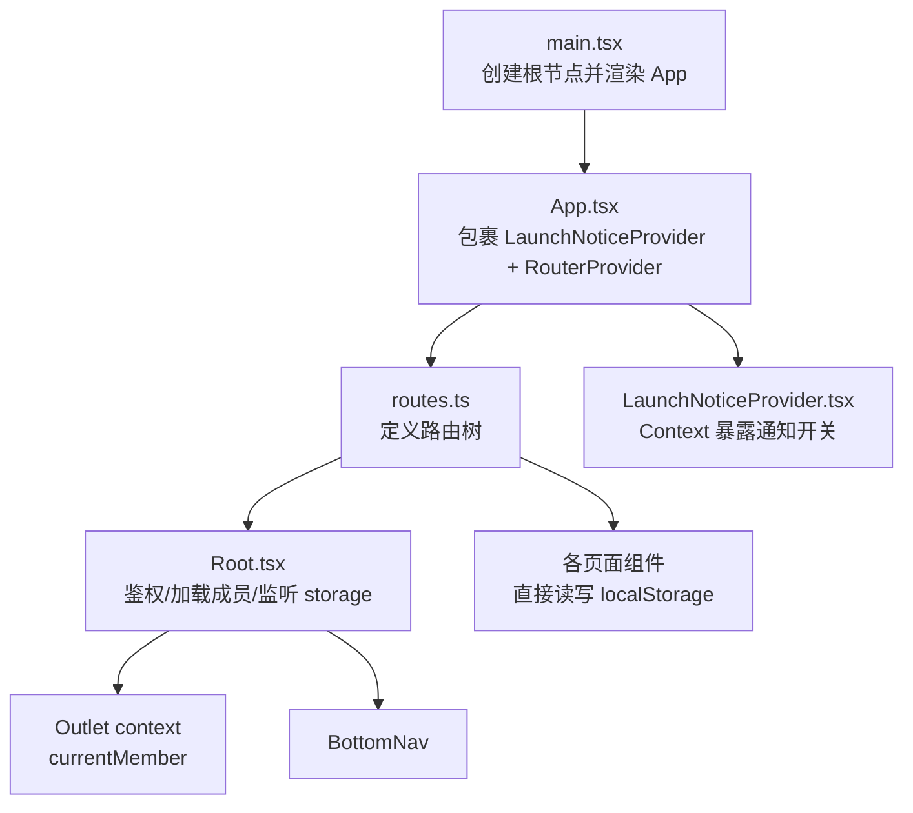
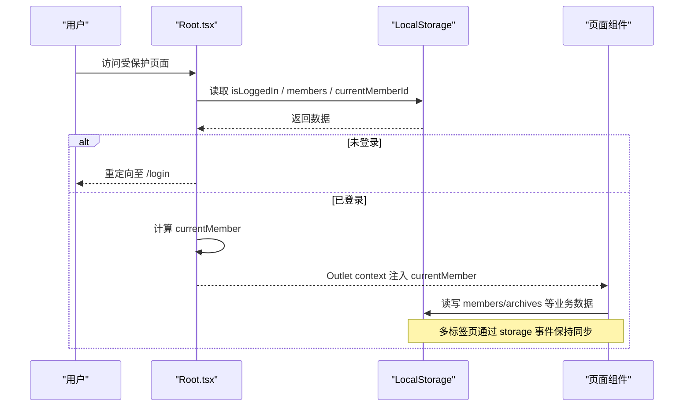
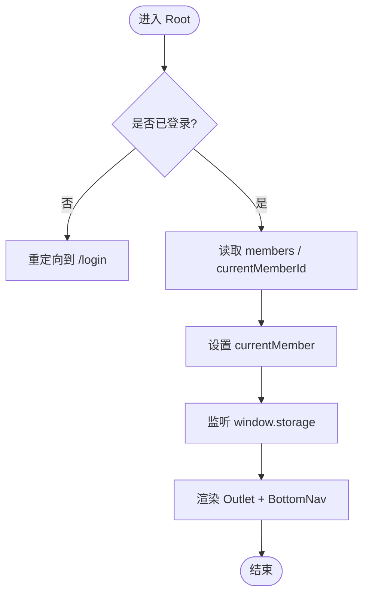
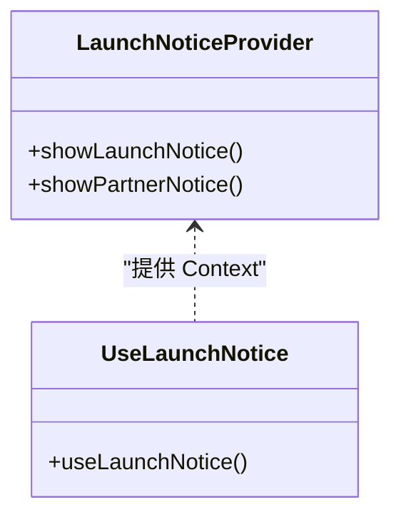
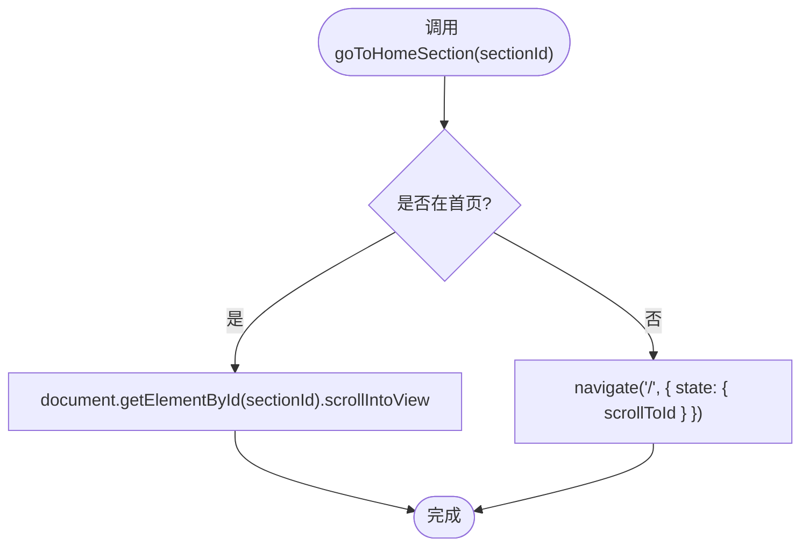
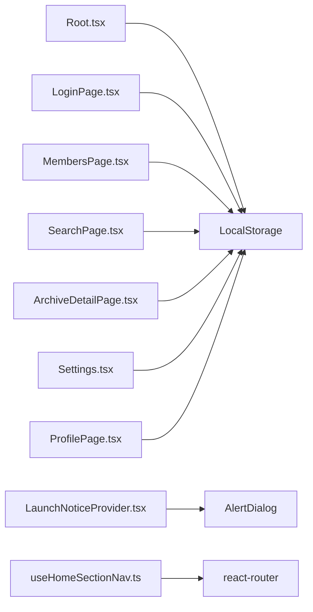

# 状态管理方案

<cite>
**本文引用的文件**
- [main.tsx](file://figma-ui/src/main.tsx)
- [App.tsx](file://figma-ui/src/app/App.tsx)
- [Root.tsx](file://figma-ui/src/app/Root.tsx)
- [routes.ts](file://figma-ui/src/app/routes.ts)
- [LaunchNoticeProvider.tsx](file://figma-ui/src/app/components/LaunchNoticeProvider.tsx)
- [useHomeSectionNav.ts](file://figma-ui/src/app/hooks/useHomeSectionNav.ts)
- [types.ts](file://figma-ui/src/app/types.ts)
- [Settings.tsx](file://figma-ui/src/app/pages/Settings.tsx)
- [MembersPage.tsx](file://figma-ui/src/app/pages/MembersPage.tsx)
- [LoginPage.tsx](file://figma-ui/src/app/pages/LoginPage.tsx)
- [ProfilePage.tsx](file://figma-ui/src/app/pages/ProfilePage.tsx)
- [SearchPage.tsx](file://figma-ui/src/app/pages/SearchPage.tsx)
- [ArchiveDetailPage.tsx](file://figma-ui/src/app/pages/ArchiveDetailPage.tsx)
</cite>

## 目录
1. [简介](#简介)
2. [项目结构](#项目结构)
3. [核心组件](#核心组件)
4. [架构总览](#架构总览)
5. [详细组件分析](#详细组件分析)
6. [依赖关系分析](#依赖关系分析)
7. [性能考虑](#性能考虑)
8. [故障排查指南](#故障排查指南)
9. [结论](#结论)
10. [附录](#附录)

## 简介
本方案为医案通医疗档案网站提供基于 React Context API 与 LocalStorage 的轻量级状态管理设计。目标是在不引入重型状态库的前提下，实现：
- 全局状态的组织与共享（如登录态、当前成员、公告弹窗等）
- 跨页面数据持久化（LocalStorage）
- 多标签页/多窗口状态同步（storage 事件）
- 可维护的自定义 Hook 模式（如 useHomeSectionNav）
- 冲突解决策略与性能优化
- 调试与监控手段
- 版本迁移与兼容性处理
- 最佳实践与常见陷阱规避

## 项目结构
应用入口渲染 App，App 内通过 RouterProvider 挂载路由树；根布局 Root 负责鉴权与当前成员加载，并通过 Outlet context 向下传递；业务页面直接读写 LocalStorage 完成数据持久化；部分通用能力通过 Context Provider 暴露（如 LaunchNoticeProvider）。

图表来源
- [main.tsx:1-7](file://figma-ui/src/main.tsx#L1-L7)
- [App.tsx:1-12](file://figma-ui/src/app/App.tsx#L1-L12)
- [routes.ts:1-106](file://figma-ui/src/app/routes.ts#L1-L106)
- [Root.tsx:1-59](file://figma-ui/src/app/Root.tsx#L1-L59)
- [LaunchNoticeProvider.tsx:1-118](file://figma-ui/src/app/components/LaunchNoticeProvider.tsx#L1-L118)

章节来源
- [main.tsx:1-7](file://figma-ui/src/main.tsx#L1-L7)
- [App.tsx:1-12](file://figma-ui/src/app/App.tsx#L1-L12)
- [routes.ts:1-106](file://figma-ui/src/app/routes.ts#L1-L106)

## 核心组件
- 应用启动与路由装配：main.tsx 创建根节点并渲染 App；App 组合 LaunchNoticeProvider 与 RouterProvider；routes.ts 定义 Hash 路由与页面映射。
- 根布局与全局上下文：Root.tsx 负责登录校验、从 LocalStorage 加载 members 与 currentMemberId，设置 currentMember 并通过 Outlet context 传递给子路由；同时监听 window.storage 事件以响应其他标签页对成员的变更。
- 全局 UI 状态：LaunchNoticeProvider.tsx 使用 createContext/useContext 暴露 showLaunchNotice/showPartnerNotice 方法，集中控制通知弹窗的显示与内容。
- 导航与滚动：useHomeSectionNav.ts 封装首页锚点跳转逻辑，区分在首页直接滚动与不在首页时先导航到首页再滚动。

章节来源
- [Root.tsx:1-59](file://figma-ui/src/app/Root.tsx#L1-L59)
- [LaunchNoticeProvider.tsx:1-118](file://figma-ui/src/app/components/LaunchNoticeProvider.tsx#L1-L118)
- [useHomeSectionNav.ts:1-26](file://figma-ui/src/app/hooks/useHomeSectionNav.ts#L1-L26)

## 架构总览
整体采用“Context 提供 UI 状态 + LocalStorage 作为持久化层”的双层架构：
- UI 状态层：React Context（如 LaunchNoticeProvider）用于跨组件共享瞬时或会话级状态。
- 持久化层：LocalStorage 存储用户会话、成员信息、档案列表等；通过 storage 事件实现多标签页同步。
- 路由层：react-router 管理页面切换，Root 作为受保护布局统一处理鉴权与成员上下文。

图表来源
- [Root.tsx:10-46](file://figma-ui/src/app/Root.tsx#L10-L46)
- [routes.ts:25-76](file://figma-ui/src/app/routes.ts#L25-L76)

## 详细组件分析

### 根布局与成员上下文（Root.tsx）
- 职责
  - 检查登录态：若未登录则跳转到 /login。
  - 加载成员数据：从 LocalStorage 读取 members 与 currentMemberId，确定当前成员。
  - 跨标签页同步：监听 window.storage 事件，当其他标签页修改 members/currentMemberId 时重新加载。
  - 上下文注入：通过 Outlet context 将 currentMember 注入到子路由。
- 关键点
  - 使用 useEffect 初始化并在卸载时移除事件监听，避免内存泄漏。
  - 在 currentMember 为空时展示 Loading，保证下游组件消费安全。
- 潜在风险
  - 若 LocalStorage 损坏或缺失字段，需做好默认值与降级处理。
  - storage 事件仅在跨标签页触发，同标签页内需自行 setState。

图表来源
- [Root.tsx:10-59](file://figma-ui/src/app/Root.tsx#L10-L59)

章节来源
- [Root.tsx:1-59](file://figma-ui/src/app/Root.tsx#L1-L59)

### 通知弹窗上下文（LaunchNoticeProvider.tsx）
- 职责
  - 通过 createContext 暴露 showLaunchNotice/showPartnerNotice。
  - 内部维护 open 与 kind 状态，渲染 AlertDialog。
  - 提供 useLaunchNotice Hook 供任意子组件调用。
- 设计要点
  - 使用 useMemo 稳定 value 引用，减少不必要的重渲染。
  - 错误边界：未在 Provider 内使用 Hook 会抛出明确错误，便于定位问题。
- 扩展建议
  - 可将 notice 显隐偏好持久化到 LocalStorage，刷新后恢复上次状态。

图表来源
- [LaunchNoticeProvider.tsx:12-118](file://figma-ui/src/app/components/LaunchNoticeProvider.tsx#L12-L118)

章节来源
- [LaunchNoticeProvider.tsx:1-118](file://figma-ui/src/app/components/LaunchNoticeProvider.tsx#L1-L118)

### 首页锚点导航 Hook（useHomeSectionNav.ts）
- 职责
  - 在首页路径下直接滚动到指定 sectionId。
  - 在非首页路径下，先导航到首页，再通过 location.state 携带 scrollToId，由首页组件根据 state 执行滚动。
- 设计要点
  - 使用 useCallback 缓存回调，避免重复创建。
  - 兼容 Hash 路由限制，避免 href="#id" 抢占 hash。
- 使用场景
  - 首页各模块间的平滑跳转，提升用户体验。

图表来源
- [useHomeSectionNav.ts:4-25](file://figma-ui/src/app/hooks/useHomeSectionNav.ts#L4-L25)

章节来源
- [useHomeSectionNav.ts:1-26](file://figma-ui/src/app/hooks/useHomeSectionNav.ts#L1-L26)

### 类型与数据模型（types.ts）
- 定义了 Member、Archive、OCRData、LabItem、PrescriptionItem、ShareLink 等核心数据结构，以及档案类型标签与颜色映射。
- 作用
  - 统一前后端/本地数据的类型契约。
  - 为 LocalStorage 序列化/反序列化提供类型保障。
- 建议
  - 后续可在持久化层增加版本号字段，便于迁移。

章节来源
- [types.ts:1-95](file://figma-ui/src/app/types.ts#L1-L95)

### 页面中的状态读写示例
- 登录流程（LoginPage.tsx）
  - 登录后写入 isLoggedIn、userPhone，必要时初始化 members 与 currentMemberId。
- 退出流程（ProfilePage.tsx）
  - 清除 isLoggedIn，并重定向到登录页。
- 成员管理（MembersPage.tsx）
  - 读取/更新 members，删除成员时级联清理其 archives，并更新 currentMemberId。
- 搜索与详情（SearchPage.tsx、ArchiveDetailPage.tsx）
  - 读取 currentMemberId 与 archives，进行过滤与展示。
- 设置页（Settings.tsx）
  - 读取 members 与 currentMemberId，支持切换当前成员。

章节来源
- [LoginPage.tsx:38-54](file://figma-ui/src/app/pages/LoginPage.tsx#L38-L54)
- [ProfilePage.tsx:20-69](file://figma-ui/src/app/pages/ProfilePage.tsx#L20-L69)
- [MembersPage.tsx:11-46](file://figma-ui/src/app/pages/MembersPage.tsx#L11-L46)
- [SearchPage.tsx:16-17](file://figma-ui/src/app/pages/SearchPage.tsx#L16-L17)
- [ArchiveDetailPage.tsx:34-34](file://figma-ui/src/app/pages/ArchiveDetailPage.tsx#L34-L34)
- [Settings.tsx:36-41](file://figma-ui/src/app/pages/Settings.tsx#L36-L41)

## 依赖关系分析
- 组件耦合
  - Root 与 routes：Root 作为受保护布局，承载鉴权与成员上下文。
  - 页面与 LocalStorage：页面直接读写 LocalStorage，形成松耦合的数据源。
  - LaunchNoticeProvider 与子组件：通过 Context 解耦 UI 状态与展示。
- 外部依赖
  - react-router：Hash 路由，配合 navigate/location/state 实现导航与参数传递。
  - DOM API：scrollIntoView 用于平滑滚动。
- 可能的循环依赖
  - 当前未见循环引用；注意新增 Provider 时避免在 Provider 内部再次引入自身。

图表来源
- [Root.tsx:10-46](file://figma-ui/src/app/Root.tsx#L10-L46)
- [LaunchNoticeProvider.tsx:73-107](file://figma-ui/src/app/components/LaunchNoticeProvider.tsx#L73-L107)
- [useHomeSectionNav.ts:1-25](file://figma-ui/src/app/hooks/useHomeSectionNav.ts#L1-L25)

章节来源
- [Root.tsx:10-46](file://figma-ui/src/app/Root.tsx#L10-L46)
- [LaunchNoticeProvider.tsx:73-107](file://figma-ui/src/app/components/LaunchNoticeProvider.tsx#L73-L107)
- [useHomeSectionNav.ts:1-25](file://figma-ui/src/app/hooks/useHomeSectionNav.ts#L1-L25)

## 性能考虑
- 最小化重渲染
  - 使用 useMemo 稳定 Context value（如 LaunchNoticeProvider），避免子组件无谓更新。
  - 在 Root 中仅监听 storage 事件一次，避免重复绑定。
- 数据体积控制
  - LocalStorage 容量有限，建议对 archives 等大对象进行分页或按需加载。
  - 对敏感信息（如手机号）做脱敏展示，减少不必要的数据传输。
- 滚动与交互
  - 使用 scrollIntoView({ behavior: "smooth" }) 提升体验，但避免频繁触发导致卡顿。
- 路由与状态
  - 利用 location.state 传递轻量参数（如 scrollToId），避免额外请求。

[本节为通用指导，不直接分析具体文件]

## 故障排查指南
- 常见问题
  - 多标签页不同步：确认是否正确监听 window.storage 事件，且其他标签页确实写入了相同的 key。
  - 数据格式异常：Local Storage 字符串可能损坏，需在读取处增加 try/catch 与默认值。
  - 未登录被重定向：检查 isLoggedIn 是否存在且为真值。
  - 滚动失效：确认 sectionId 对应的元素存在，或在非首页时正确通过 location.state 传递。
- 调试建议
  - 在浏览器控制台监听 storage 事件，观察键值变化。
  - 在 Root 中打印 members/currentMemberId 的变化轨迹，定位同步时机。
  - 对 LaunchNoticeProvider 的 open/kind 状态加日志，验证弹窗触发链路。
- 回滚与容错
  - 对 JSON.parse 失败的情况提供空数组/默认对象兜底。
  - 对关键操作（如删除成员）增加二次确认与失败提示。

章节来源
- [Root.tsx:10-46](file://figma-ui/src/app/Root.tsx#L10-L46)
- [LaunchNoticeProvider.tsx:111-117](file://figma-ui/src/app/components/LaunchNoticeProvider.tsx#L111-L117)
- [useHomeSectionNav.ts:13-22](file://figma-ui/src/app/hooks/useHomeSectionNav.ts#L13-L22)

## 结论
本项目采用“Context + LocalStorage”的轻量状态管理方案，满足医疗档案网站的入门级需求：
- 通过 Context 提供 UI 状态共享（通知弹窗等）
- 通过 LocalStorage 实现跨页面持久化与多标签页同步
- 通过自定义 Hook（如 useHomeSectionNav）封装复杂交互
- 具备基本的错误处理与调试手段
未来如需更复杂的状态流转（如并发更新、撤销/重做、离线同步），可逐步引入状态库（如 Zustand/Redux Toolkit）并保留现有 LocalStorage 作为持久化适配器。

[本节为总结性内容，不直接分析具体文件]

## 附录

### 状态同步机制与冲突解决
- 同步机制
  - 单标签页：通过 React state 更新 UI。
  - 多标签页：通过 window.storage 事件监听 key 变化，重新拉取最新数据。
- 冲突解决
  - 以“最后写入者胜”为原则，确保最终一致性。
  - 对关键操作（如删除成员）增加确认与幂等处理。
- 注意事项
  - storage 事件不会在同标签页内触发，需自行 setState。
  - 避免在 storage 回调中进行昂贵计算，尽量只触发数据重载。

章节来源
- [Root.tsx:43-46](file://figma-ui/src/app/Root.tsx#L43-L46)
- [MembersPage.tsx:27-46](file://figma-ui/src/app/pages/MembersPage.tsx#L27-L46)

### 性能优化清单
- 使用 useMemo 稳定 Context value
- 避免在高频事件中执行重计算
- 对大对象进行分页/懒加载
- 合理使用 location.state 传递轻量参数
- 对 LocalStorage 读写进行批量化与去抖

[本节为通用指导，不直接分析具体文件]

### 调试工具与监控
- 浏览器开发者工具
  - Application -> Local Storage：查看键值与大小
  - Console：监听 storage 事件
- 代码层面
  - 在 Root 中打印 members/currentMemberId 变化
  - 在 LaunchNoticeProvider 中记录 open/kind 变化
  - 在 useHomeSectionNav 中记录导航与滚动行为

章节来源
- [Root.tsx:10-46](file://figma-ui/src/app/Root.tsx#L10-L46)
- [LaunchNoticeProvider.tsx:52-69](file://figma-ui/src/app/components/LaunchNoticeProvider.tsx#L52-L69)
- [useHomeSectionNav.ts:13-22](file://figma-ui/src/app/hooks/useHomeSectionNav.ts#L13-L22)

### 状态迁移与版本兼容
- 建议在持久化数据中加入 version 字段，升级时检测并迁移旧数据。
- 对 LocalStorage 读取增加 try/catch 与默认值，防止脏数据导致崩溃。
- 对关键字段（如 currentMemberId）提供回退策略（如取 members[0]）。

章节来源
- [Root.tsx:18-38](file://figma-ui/src/app/Root.tsx#L18-L38)

### 最佳实践与常见陷阱
- 最佳实践
  - 将 UI 状态放入 Context，将业务数据放入 LocalStorage
  - 使用自定义 Hook 封装复杂逻辑（如导航、滚动）
  - 对 LocalStorage 读写进行统一封装，便于替换与测试
- 常见陷阱
  - 忘记在卸载时移除 storage 事件监听
  - 直接使用 href="#id" 导致 hash 抢占
  - 未处理 JSON.parse 失败导致的运行时错误
  - 在多标签页场景下误以为 storage 事件会立即生效

章节来源
- [Root.tsx:43-46](file://figma-ui/src/app/Root.tsx#L43-L46)
- [useHomeSectionNav.ts:8-22](file://figma-ui/src/app/hooks/useHomeSectionNav.ts#L8-L22)