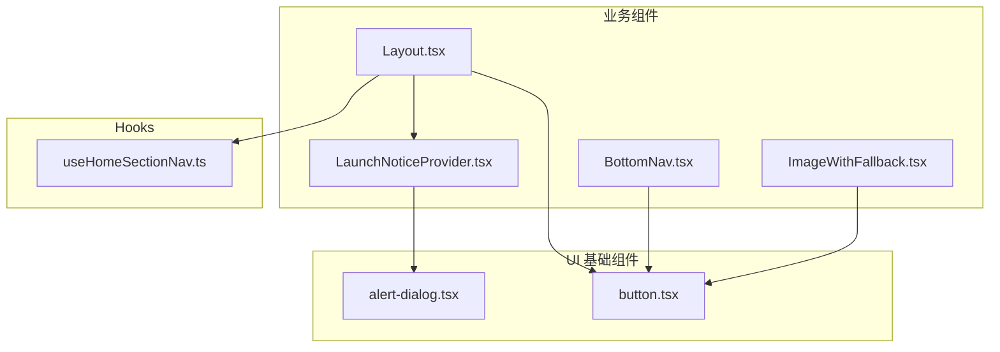
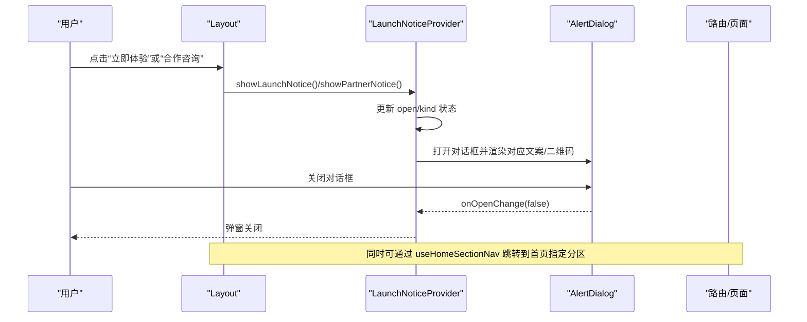
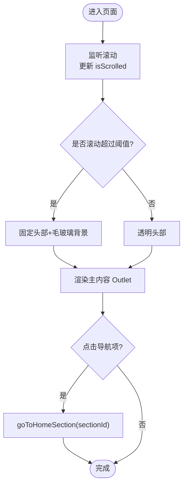
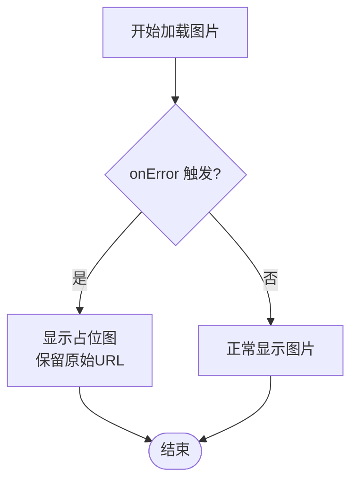
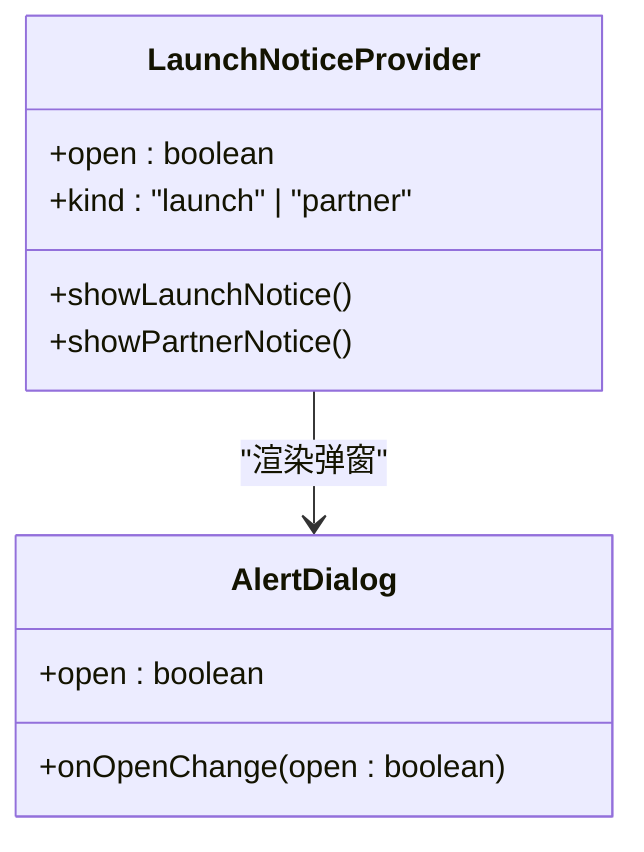
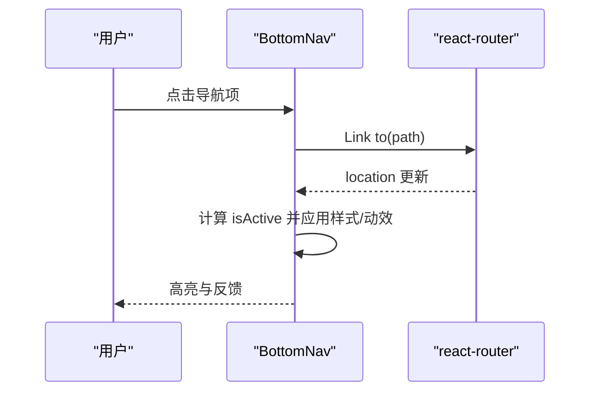
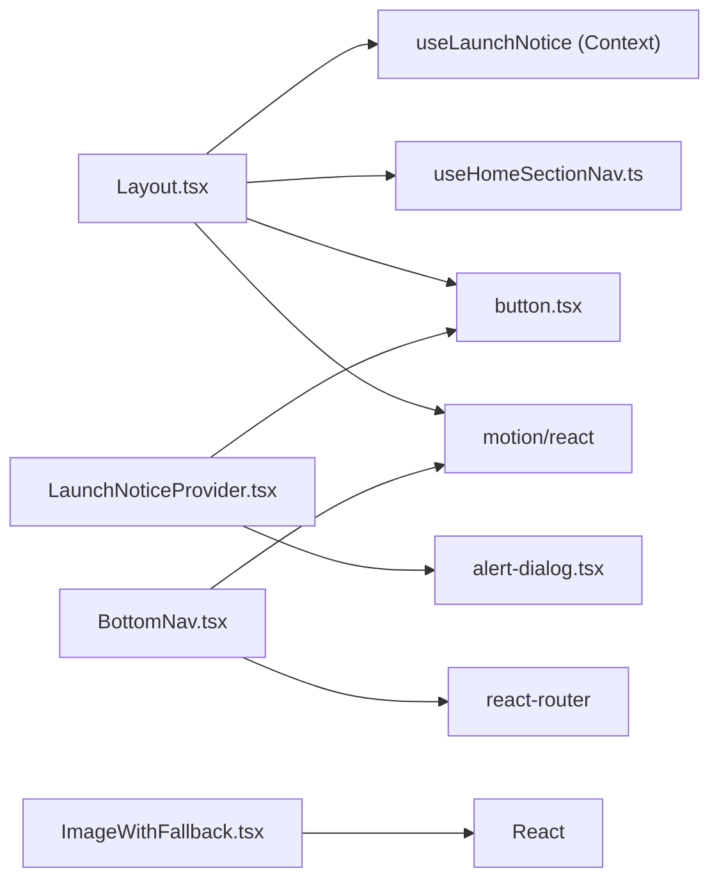

# 业务组件

<cite>
**本文引用的文件**
- [Layout.tsx](file://figma-ui/src/app/components/Layout.tsx)
- [ImageWithFallback.tsx](file://figma-ui/src/app/components/figma/ImageWithFallback.tsx)
- [LaunchNoticeProvider.tsx](file://figma-ui/src/app/components/LaunchNoticeProvider.tsx)
- [BottomNav.tsx](file://figma-ui/src/app/components/BottomNav.tsx)
- [useHomeSectionNav.ts](file://figma-ui/src/app/hooks/useHomeSectionNav.ts)
- [alert-dialog.tsx](file://figma-ui/src/app/components/ui/alert-dialog.tsx)
- [button.tsx](file://figma-ui/src/app/components/ui/button.tsx)
</cite>

## 目录
1. [简介](#简介)
2. [项目结构](#项目结构)
3. [核心组件总览](#核心组件总览)
4. [架构总览](#架构总览)
5. [详细组件分析](#详细组件分析)
6. [依赖关系分析](#依赖关系分析)
7. [性能与可访问性](#性能与可访问性)
8. [故障排查指南](#故障排查指南)
9. [结论](#结论)
10. [附录：使用示例与最佳实践](#附录使用示例与最佳实践)

## 简介
本文件面向医案通医疗档案网站的业务组件，聚焦以下四个关键业务组件的设计与实现：
- Layout 布局容器：提供全局头部、导航、页脚与路由内容区，集成滚动监听、移动端菜单、通知触发与首页分区跳转。
- ImageWithFallback 图片组件：封装图片加载失败时的降级展示，提升用户体验与健壮性。
- LaunchNoticeProvider 通知提供者：通过 Context 管理“立即体验/合作咨询”弹窗状态，集中维护文案与二维码资源。
- BottomNav 底部导航：固定于底部的移动端导航栏，支持高亮、动效与特殊按钮样式。

文档将深入说明各组件的业务逻辑封装、状态管理策略、数据流处理、事件通信机制、配置选项、扩展点设计、与其他组件的集成方式，并提供实际使用示例与优化建议。

## 项目结构
围绕业务组件的相关文件组织如下：
- 业务组件位于 src/app/components 下，基础 UI 组件位于 components/ui，页面级 Hook 位于 hooks。
- Layout 组合了 Header、Footer、Outlet 以及通知与导航能力；BottomNav 为独立导航组件；LaunchNoticeProvider 提供全局通知上下文；ImageWithFallback 作为通用图片组件供多处复用。

图表来源
- [Layout.tsx:1-251](file://figma-ui/src/app/components/Layout.tsx#L1-L251)
- [BottomNav.tsx:1-85](file://figma-ui/src/app/components/BottomNav.tsx#L1-L85)
- [LaunchNoticeProvider.tsx:1-118](file://figma-ui/src/app/components/LaunchNoticeProvider.tsx#L1-L118)
- [ImageWithFallback.tsx:1-28](file://figma-ui/src/app/components/figma/ImageWithFallback.tsx#L1-L28)
- [alert-dialog.tsx:1-158](file://figma-ui/src/app/components/ui/alert-dialog.tsx#L1-L158)
- [button.tsx:1-59](file://figma-ui/src/app/components/ui/button.tsx#L1-L59)
- [useHomeSectionNav.ts:1-26](file://figma-ui/src/app/hooks/useHomeSectionNav.ts#L1-L26)

章节来源
- [Layout.tsx:1-251](file://figma-ui/src/app/components/Layout.tsx#L1-L251)
- [BottomNav.tsx:1-85](file://figma-ui/src/app/components/BottomNav.tsx#L1-L85)
- [LaunchNoticeProvider.tsx:1-118](file://figma-ui/src/app/components/LaunchNoticeProvider.tsx#L1-L118)
- [ImageWithFallback.tsx:1-28](file://figma-ui/src/app/components/figma/ImageWithFallback.tsx#L1-L28)
- [useHomeSectionNav.ts:1-26](file://figma-ui/src/app/hooks/useHomeSectionNav.ts#L1-L26)
- [alert-dialog.tsx:1-158](file://figma-ui/src/app/components/ui/alert-dialog.tsx#L1-L158)
- [button.tsx:1-59](file://figma-ui/src/app/components/ui/button.tsx#L1-L59)

## 核心组件总览
- Layout：负责页面骨架、滚动效果、响应式菜单、通知触发、首页分区跳转与页脚信息。
- ImageWithFallback：统一图片加载错误处理，提供内联占位图与原始地址保留。
- LaunchNoticeProvider：集中管理通知弹窗的状态与文案，暴露 showLaunchNotice/showPartnerNotice 方法。
- BottomNav：移动端底部导航，支持当前路径高亮、动效与特殊入口（上传）。

章节来源
- [Layout.tsx:10-251](file://figma-ui/src/app/components/Layout.tsx#L10-L251)
- [ImageWithFallback.tsx:6-27](file://figma-ui/src/app/components/figma/ImageWithFallback.tsx#L6-L27)
- [LaunchNoticeProvider.tsx:12-118](file://figma-ui/src/app/components/LaunchNoticeProvider.tsx#L12-L118)
- [BottomNav.tsx:5-85](file://figma-ui/src/app/components/BottomNav.tsx#L5-L85)

## 架构总览
业务组件之间通过 React Context、Hook 与路由进行协作：
- Layout 通过 useLaunchNotice 获取通知控制函数，通过 useHomeSectionNav 实现首页分区跳转。
- LaunchNoticeProvider 提供通知弹窗 UI，并基于 Radix 的 AlertDialog 构建可访问的模态框。
- BottomNav 基于 react-router 的路由状态渲染高亮与动效。
- ImageWithFallback 作为无状态组件，被任意需要图片展示的组件复用。

图表来源
- [Layout.tsx:10-140](file://figma-ui/src/app/components/Layout.tsx#L10-L140)
- [LaunchNoticeProvider.tsx:52-108](file://figma-ui/src/app/components/LaunchNoticeProvider.tsx#L52-L108)
- [alert-dialog.tsx:9-64](file://figma-ui/src/app/components/ui/alert-dialog.tsx#L9-L64)
- [useHomeSectionNav.ts:13-24](file://figma-ui/src/app/hooks/useHomeSectionNav.ts#L13-L24)

## 详细组件分析

### Layout 布局容器
- 职责
  - 提供固定头部、滚动时背景变化、桌面/移动端导航、页脚信息与 Outlet 内容区。
  - 集成通知弹窗触发（立即体验/合作咨询）与首页分区跳转。
- 状态与副作用
  - isScrolled：监听 window.scrollY 切换头部样式。
  - isMobileMenuOpen：控制移动端菜单展开/收起。
- 事件与交互
  - 导航项点击调用 goToHomeSection(sectionId)，在首页直接平滑滚动到目标分区，否则先导航回首页再通过 state 传递目标 ID。
  - 按钮点击触发 showLaunchNotice/showPartnerNotice。
- 可访问性与动画
  - 使用 motion/react 的 AnimatePresence 实现移动端菜单进出场动画。
  - 链接与按钮具备清晰的语义与焦点样式。
- 扩展点
  - navLinks 数组可配置新增导航项。
  - 页脚内容与链接可按需扩展。
- 与其他组件集成
  - 使用 Button、AppIconSvg、useLaunchNotice、useHomeSectionNav。

图表来源
- [Layout.tsx:16-22](file://figma-ui/src/app/components/Layout.tsx#L16-L22)
- [Layout.tsx:24-63](file://figma-ui/src/app/components/Layout.tsx#L24-L63)
- [useHomeSectionNav.ts:13-24](file://figma-ui/src/app/hooks/useHomeSectionNav.ts#L13-L24)

章节来源
- [Layout.tsx:10-251](file://figma-ui/src/app/components/Layout.tsx#L10-L251)
- [useHomeSectionNav.ts:1-26](file://figma-ui/src/app/hooks/useHomeSectionNav.ts#L1-L26)

### ImageWithFallback 图片组件
- 职责
  - 当图片加载失败时，自动切换到内置占位图，避免空白或破损图标影响体验。
- 状态与错误处理
  - didError：记录是否发生加载错误。
  - onError：捕获错误并切换至占位图，同时保留原始 URL 以便调试。
- 配置与扩展
  - 透传所有 img 属性（src、alt、style、className 等），便于灵活嵌入不同场景。
  - 占位图为内联 SVG base64，零网络开销。
- 性能与可访问性
  - 错误态以 div 包裹，保持布局稳定。
  - alt 文本用于无障碍读屏。

图表来源
- [ImageWithFallback.tsx:6-27](file://figma-ui/src/app/components/figma/ImageWithFallback.tsx#L6-L27)

章节来源
- [ImageWithFallback.tsx:1-28](file://figma-ui/src/app/components/figma/ImageWithFallback.tsx#L1-L28)

### LaunchNoticeProvider 通知提供者
- 职责
  - 提供全局的通知弹窗能力，统一管理“立即体验/合作咨询”两种类型的内容与二维码。
- 状态与数据流
  - open：控制弹窗显隐。
  - kind：区分 launch/partner，决定文案与二维码资源。
  - noticeCopy：集中化文案与媒体资源，便于维护与本地化。
- 事件与交互
  - showLaunchNotice/showPartnerNotice：设置 kind 并打开弹窗。
  - 关闭回调 onOpenChange：重置 open。
- 可访问性
  - 基于 Radix AlertDialog，具备键盘导航、焦点管理与屏幕阅读器支持。
- 扩展点
  - 可在 noticeCopy 中新增 NoticeKind，并在 Provider 中增加对应分支。
  - 可替换 AlertDialogContent 的样式与布局以满足品牌规范。

图表来源
- [LaunchNoticeProvider.tsx:12-118](file://figma-ui/src/app/components/LaunchNoticeProvider.tsx#L12-L118)
- [alert-dialog.tsx:9-64](file://figma-ui/src/app/components/ui/alert-dialog.tsx#L9-L64)

章节来源
- [LaunchNoticeProvider.tsx:1-118](file://figma-ui/src/app/components/LaunchNoticeProvider.tsx#L1-L118)
- [alert-dialog.tsx:1-158](file://figma-ui/src/app/components/ui/alert-dialog.tsx#L1-L158)

### BottomNav 底部导航
- 职责
  - 提供移动端底部导航，包含首页、档案、上传（特殊按钮）、分享、设置。
- 状态与交互
  - 基于 useLocation 判断当前激活项，驱动图标颜色、描边粗细与背景指示器。
  - 特殊按钮（上传）采用悬浮圆形按钮样式，带缩放动效。
- 动画与视觉
  - 使用 motion/react 的 whileHover/whileTap/animate/layoutId 实现流畅过渡与位置同步。
- 可访问性
  - 使用 Link 保证键盘导航与语义正确。
- 扩展点
  - navItems 数组可扩展新入口，支持 special 标记自定义样式。

图表来源
- [BottomNav.tsx:5-85](file://figma-ui/src/app/components/BottomNav.tsx#L5-L85)

章节来源
- [BottomNav.tsx:1-85](file://figma-ui/src/app/components/BottomNav.tsx#L1-L85)

## 依赖关系分析
- Layout 依赖
  - useLaunchNotice：从 LaunchNoticeProvider 获取通知控制函数。
  - useHomeSectionNav：实现首页分区跳转逻辑。
  - Button：统一的按钮样式与变体。
  - motion/react：用于移动端菜单动画。
- LaunchNoticeProvider 依赖
  - alert-dialog：Radix 的可访问弹窗组件。
  - button：用于弹窗操作按钮。
- BottomNav 依赖
  - react-router：路由状态与导航。
  - motion/react：动效。
- ImageWithFallback 无外部业务依赖，仅使用 React。

图表来源
- [Layout.tsx:1-251](file://figma-ui/src/app/components/Layout.tsx#L1-L251)
- [LaunchNoticeProvider.tsx:1-118](file://figma-ui/src/app/components/LaunchNoticeProvider.tsx#L1-L118)
- [BottomNav.tsx:1-85](file://figma-ui/src/app/components/BottomNav.tsx#L1-L85)
- [ImageWithFallback.tsx:1-28](file://figma-ui/src/app/components/figma/ImageWithFallback.tsx#L1-L28)
- [alert-dialog.tsx:1-158](file://figma-ui/src/app/components/ui/alert-dialog.tsx#L1-L158)
- [button.tsx:1-59](file://figma-ui/src/app/components/ui/button.tsx#L1-L59)
- [useHomeSectionNav.ts:1-26](file://figma-ui/src/app/hooks/useHomeSectionNav.ts#L1-L26)

章节来源
- [Layout.tsx:1-251](file://figma-ui/src/app/components/Layout.tsx#L1-L251)
- [LaunchNoticeProvider.tsx:1-118](file://figma-ui/src/app/components/LaunchNoticeProvider.tsx#L1-L118)
- [BottomNav.tsx:1-85](file://figma-ui/src/app/components/BottomNav.tsx#L1-L85)
- [ImageWithFallback.tsx:1-28](file://figma-ui/src/app/components/figma/ImageWithFallback.tsx#L1-L28)
- [alert-dialog.tsx:1-158](file://figma-ui/src/app/components/ui/alert-dialog.tsx#L1-L158)
- [button.tsx:1-59](file://figma-ui/src/app/components/ui/button.tsx#L1-L59)
- [useHomeSectionNav.ts:1-26](file://figma-ui/src/app/hooks/useHomeSectionNav.ts#L1-L26)

## 性能与可访问性
- 性能
  - Layout 的滚动监听使用 useEffect 添加/移除事件，避免内存泄漏。
  - 移动端菜单使用 AnimatePresence 做进出场动画，减少重排。
  - BottomNav 使用 layoutId 实现平滑指示器移动，降低抖动。
  - ImageWithFallback 的错误占位图为内联 SVG，避免额外请求。
- 可访问性
  - 弹窗基于 Radix AlertDialog，具备键盘与屏幕阅读器支持。
  - 导航与按钮具备合适的语义标签与焦点样式。
  - 图片组件提供 alt 文本，错误态仍保持可读性。

[本节为通用指导，不直接分析具体文件]

## 故障排查指南
- 通知弹窗无法打开
  - 检查是否在 LaunchNoticeProvider 内部使用 useLaunchNotice，否则会抛出错误。
  - 确认 open 状态与 onOpenChange 是否正确绑定。
- 首页分区跳转无效
  - 确认目标元素存在且拥有正确的 id。
  - 在非首页路径下，确保 navigate 到 "/" 并通过 state 传递 scrollToId。
- 图片加载失败未降级
  - 检查 onError 是否被触发，确认 didError 状态切换。
  - 验证占位图资源是否可用（内联 SVG 通常不受影响）。
- 底部导航高亮异常
  - 确认路由路径与 navItems.path 一致。
  - 检查 useLocation 返回值与比较逻辑。

章节来源
- [LaunchNoticeProvider.tsx:111-117](file://figma-ui/src/app/components/LaunchNoticeProvider.tsx#L111-L117)
- [useHomeSectionNav.ts:13-24](file://figma-ui/src/app/hooks/useHomeSectionNav.ts#L13-L24)
- [ImageWithFallback.tsx:6-27](file://figma-ui/src/app/components/figma/ImageWithFallback.tsx#L6-L27)
- [BottomNav.tsx:20-80](file://figma-ui/src/app/components/BottomNav.tsx#L20-L80)

## 结论
本项目的业务组件围绕“布局容器、图片容错、全局通知、底部导航”四大能力构建，采用 Context + Hook + 路由的组合模式，实现了清晰的数据流与良好的可维护性。各组件职责单一、扩展点明确，既能满足当前业务需求，也为后续功能演进预留了空间。

[本节为总结性内容，不直接分析具体文件]

## 附录：使用示例与最佳实践
- 布局嵌套
  - 在根路由中使用 Layout 包裹页面，确保全局头部、页脚与内容区一致。
  - 在 Layout 内部通过 Outlet 渲染页面内容。
- 图片加载优化
  - 在所有图片展示处使用 ImageWithFallback，传入必要的 alt 与样式。
  - 对大图可结合懒加载与尺寸约束，配合占位图提升感知性能。
- 全局状态管理
  - 将 LaunchNoticeProvider 置于应用顶层，确保任意子组件均可调用 showLaunchNotice/showPartnerNotice。
  - 如需新增通知类型，扩展 noticeCopy 并在 Provider 中处理分支。
- 底部导航集成
  - 在移动端页面引入 BottomNav，根据业务扩展 navItems。
  - 对特殊入口（如上传）使用 special 标记以获得突出样式。
- 事件通信与数据流
  - 通过 useHomeSectionNav 实现跨页面的分区跳转，避免直接使用 DOM 滚动。
  - 使用 Button 统一交互样式，结合 motion/react 增强反馈。

章节来源
- [Layout.tsx:10-251](file://figma-ui/src/app/components/Layout.tsx#L10-L251)
- [ImageWithFallback.tsx:6-27](file://figma-ui/src/app/components/figma/ImageWithFallback.tsx#L6-L27)
- [LaunchNoticeProvider.tsx:52-118](file://figma-ui/src/app/components/LaunchNoticeProvider.tsx#L52-L118)
- [BottomNav.tsx:5-85](file://figma-ui/src/app/components/BottomNav.tsx#L5-L85)
- [useHomeSectionNav.ts:13-24](file://figma-ui/src/app/hooks/useHomeSectionNav.ts#L13-L24)
- [button.tsx:7-59](file://figma-ui/src/app/components/ui/button.tsx#L7-L59)