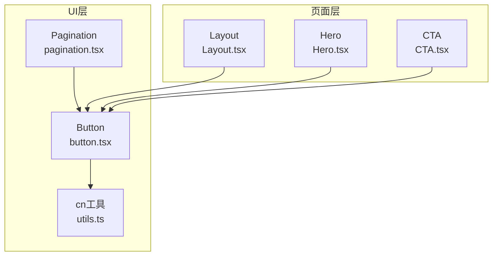
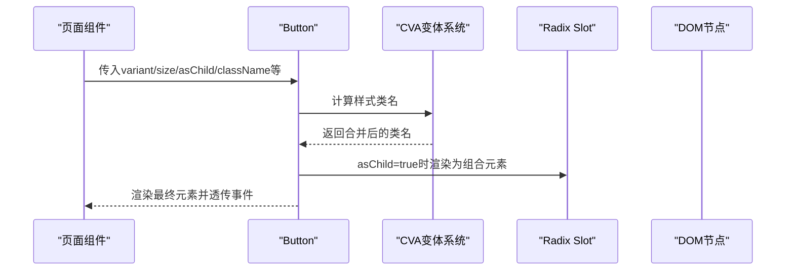
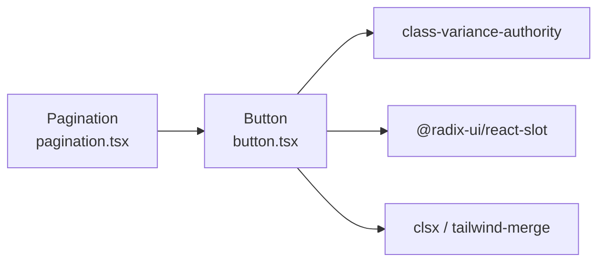

# Button按钮组件

<cite>
**本文引用的文件**
- [button.tsx](file://figma-ui/src/app/components/ui/button.tsx)
- [utils.ts](file://figma-ui/src/app/components/ui/utils.ts)
- [pagination.tsx](file://figma-ui/src/app/components/ui/pagination.tsx)
- [Layout.tsx](file://figma-ui/src/app/components/Layout.tsx)
- [Hero.tsx](file://figma-ui/src/app/pages/Home/Hero.tsx)
- [CTA.tsx](file://figma-ui/src/app/pages/Home/CTA.tsx)
- [package.json](file://figma-ui/package.json)
</cite>

## 目录
1. [简介](#简介)
2. [项目结构](#项目结构)
3. [核心组件](#核心组件)
4. [架构总览](#架构总览)
5. [详细组件分析](#详细组件分析)
6. [依赖关系分析](#依赖关系分析)
7. [性能考量](#性能考量)
8. [故障排查指南](#故障排查指南)
9. [结论](#结论)
10. [附录：Props接口与使用示例](#附录props接口与使用示例)

## 简介
Button按钮组件是基于 class-variance-authority（CVA）构建的可复用UI原语，提供统一的样式变体系统与尺寸规格，并通过 Radix Slot 实现“组合模式”，使按钮可无缝渲染为原生元素或第三方组件。该组件在医案通网站中被广泛用于导航、表单提交、状态切换等场景，具备完善的可访问性与主题适配能力。

## 项目结构
Button组件位于共享UI层，被页面与子组件广泛引用；其样式系统由CVA管理，类名合并通过工具函数完成；分页等复合组件复用Button的变体与尺寸以保持一致性。

图表来源
- [button.tsx:1-59](file://figma-ui/src/app/components/ui/button.tsx#L1-L59)
- [utils.ts:1-7](file://figma-ui/src/app/components/ui/utils.ts#L1-L7)
- [pagination.tsx:1-128](file://figma-ui/src/app/components/ui/pagination.tsx#L1-L128)
- [Layout.tsx:1-251](file://figma-ui/src/app/components/Layout.tsx#L1-L251)
- [Hero.tsx:1-107](file://figma-ui/src/app/pages/Home/Hero.tsx#L1-L107)
- [CTA.tsx:1-58](file://figma-ui/src/app/pages/Home/CTA.tsx#L1-L58)

章节来源
- [button.tsx:1-59](file://figma-ui/src/app/components/ui/button.tsx#L1-L59)
- [pagination.tsx:1-128](file://figma-ui/src/app/components/ui/pagination.tsx#L1-L128)
- [Layout.tsx:1-251](file://figma-ui/src/app/components/Layout.tsx#L1-L251)
- [Hero.tsx:1-107](file://figma-ui/src/app/pages/Home/Hero.tsx#L1-L107)
- [CTA.tsx:1-58](file://figma-ui/src/app/pages/Home/CTA.tsx#L1-L58)

## 核心组件
- 基于CVA定义样式变体与尺寸，默认变体为default，默认尺寸为default。
- 支持6种变体：default、destructive、outline、secondary、ghost、link。
- 支持4种尺寸：default、sm、lg、icon。
- 通过asChild属性与Radix Slot实现组合模式，可将按钮渲染为任意可组合元素（如a、Link等），保持事件与可访问性语义。
- 使用cn工具进行类名合并，确保Tailwind类名冲突可控且可覆盖。

章节来源
- [button.tsx:7-35](file://figma-ui/src/app/components/ui/button.tsx#L7-L35)
- [button.tsx:37-58](file://figma-ui/src/app/components/ui/button.tsx#L37-L58)
- [utils.ts:1-7](file://figma-ui/src/app/components/ui/utils.ts#L1-L7)

## 架构总览
Button组件作为原子组件，向上被业务组件复用，向下依赖CVA与工具函数。分页组件通过复用buttonVariants实现一致的视觉语言。

图表来源
- [button.tsx:7-58](file://figma-ui/src/app/components/ui/button.tsx#L7-L58)

## 详细组件分析

### 样式变体系统（CVA）
- 设计原理：使用CVA集中声明基础样式与变体规则，避免重复CSS与条件类名拼接。
- 变体说明：
  - default：主按钮，强调主要操作。
  - destructive：危险操作，用于删除、取消等高风险行为。
  - outline：描边风格，适合次要或并列操作。
  - secondary：次级填充，用于辅助操作。
  - ghost：透明背景悬停高亮，常用于工具栏或密集区域。
  - link：链接风格，用于文本内跳转或轻量导航。
- 尺寸说明：
  - default：标准高度与内边距。
  - sm：紧凑尺寸，适合表格或空间受限场景。
  - lg：更大点击区域，适合首屏引导或重要入口。
  - icon：正方形图标按钮，仅容纳图标。

章节来源
- [button.tsx:7-35](file://figma-ui/src/app/components/ui/button.tsx#L7-L35)

### 组合模式（asChild + Slot）
- 当asChild为true时，Button不渲染原生button，而是将自身作为“插槽”渲染到父组件提供的元素中（如a、Link）。
- 优势：
  - 保持语义化标签（如a用于导航）。
  - 继承父元素的交互与可访问性特性。
  - 便于与路由库集成，无需额外包装。

章节来源
- [button.tsx:37-58](file://figma-ui/src/app/components/ui/button.tsx#L37-L58)

### 可访问性（a11y）
- 焦点环：focus-visible边框与ring增强键盘可达性。
- 错误态：aria-invalid时应用破坏色ring与边框，便于表单校验反馈。
- 禁用态：disabled时pointer-events与透明度变化，提示不可用。
- 图标按钮：通过aria-label或屏幕阅读器友好文案提升可用性（在分页等组件中体现）。

章节来源
- [button.tsx:8-9](file://figma-ui/src/app/components/ui/button.tsx#L8-L9)
- [pagination.tsx:40-66](file://figma-ui/src/app/components/ui/pagination.tsx#L40-L66)

### 主题适配
- 使用语义化颜色变量（primary、background、foreground、accent、destructive等），自动适配明暗主题。
- 深色模式：通过dark前缀覆盖关键样式，保证对比度与可读性。

章节来源
- [button.tsx:8-22](file://figma-ui/src/app/components/ui/button.tsx#L8-L22)

### 事件处理机制
- 透传所有原生事件（onClick、onKeyDown等），与原生button一致。
- 在asChild模式下，事件绑定到组合元素，保持正确的冒泡与默认行为。

章节来源
- [button.tsx:37-58](file://figma-ui/src/app/components/ui/button.tsx#L37-L58)

### 实际使用示例（来自项目）
- 首页引导区：大尺寸主按钮与描边按钮并列，分别触发不同动作。
- 布局头部：幽灵按钮与主按钮用于合作咨询与立即体验。
- 分页组件：复用buttonVariants实现一致的按钮风格与尺寸。

章节来源
- [Hero.tsx:34-53](file://figma-ui/src/app/pages/Home/Hero.tsx#L34-L53)
- [CTA.tsx:33-52](file://figma-ui/src/app/pages/Home/CTA.tsx#L33-L52)
- [Layout.tsx:65-77](file://figma-ui/src/app/components/Layout.tsx#L65-L77)
- [pagination.tsx:40-66](file://figma-ui/src/app/components/ui/pagination.tsx#L40-L66)

## 依赖关系分析
- 运行时依赖：
  - class-variance-authority：变体系统。
  - @radix-ui/react-slot：组合模式。
  - clsx + tailwind-merge：类名合并与去重。
- 组件耦合：
  - Pagination直接复用buttonVariants，降低样式不一致风险。
  - 页面组件仅消费Button，不感知内部实现细节。

图表来源
- [button.tsx:1-5](file://figma-ui/src/app/components/ui/button.tsx#L1-L5)
- [pagination.tsx:1-10](file://figma-ui/src/app/components/ui/pagination.tsx#L1-L10)
- [package.json:14-75](file://figma-ui/package.json#L14-L75)

章节来源
- [package.json:14-75](file://figma-ui/package.json#L14-L75)
- [button.tsx:1-5](file://figma-ui/src/app/components/ui/button.tsx#L1-L5)
- [pagination.tsx:1-10](file://figma-ui/src/app/components/ui/pagination.tsx#L1-L10)

## 性能考量
- 样式计算：CVA在编译期生成类名，运行时无开销；类名合并仅在渲染时执行一次。
- 组合模式：asChild避免多余DOM层级，减少重排与事件监听成本。
- 图标按钮：icon尺寸固定宽高，利于布局稳定与图片懒加载优化。

[本节为通用指导，不直接分析具体文件]

## 故障排查指南
- 样式未生效：检查是否通过cn正确合并类名，确认Tailwind配置包含相关语义色。
- 事件无效：确认asChild模式下目标元素支持对应事件；必要时添加type="button"防止意外提交。
- 可访问性问题：为图标按钮补充aria-label；表单错误时使用aria-invalid配合组件内置样式。
- 主题异常：确认全局已引入主题样式，dark模式开关正常工作。

章节来源
- [button.tsx:8-9](file://figma-ui/src/app/components/ui/button.tsx#L8-L9)
- [pagination.tsx:40-66](file://figma-ui/src/app/components/ui/pagination.tsx#L40-L66)

## 结论
Button组件通过CVA实现了高内聚、低耦合的样式系统，结合Radix Slot的组合模式，既能满足多样化业务需求，又保证了可访问性与主题一致性。在医案通网站中，它被广泛应用于导航、转化与数据展示等关键路径，是构建统一UI体系的核心基石。

[本节为总结性内容，不直接分析具体文件]

## 附录：Props接口与使用示例

### Props接口规范
- className?: string — 自定义类名，经cn合并后注入。
- variant?: "default" | "destructive" | "outline" | "secondary" | "ghost" | "link" — 样式变体。
- size?: "default" | "sm" | "lg" | "icon" — 尺寸规格。
- asChild?: boolean — 是否启用组合模式，渲染为外部传入的元素。
- 其余属性：透传至底层元素（如button或组合元素），包括事件处理器与ARIA属性。

章节来源
- [button.tsx:37-58](file://figma-ui/src/app/components/ui/button.tsx#L37-L58)

### 使用示例（按业务场景）
- 表单提交：使用默认变体与size，设置type="button"避免意外提交，绑定onClick处理逻辑。
- 导航操作：asChild配合路由Link或a标签，保持语义与SEO友好。
- 状态切换：使用ghost或outline变体，搭配图标表示开关或筛选。
- 危险操作：使用destructive变体，明确风险提示。
- 链接式操作：使用link变体，适用于行内跳转或文本导航。

章节来源
- [Hero.tsx:34-53](file://figma-ui/src/app/pages/Home/Hero.tsx#L34-L53)
- [CTA.tsx:33-52](file://figma-ui/src/app/pages/Home/CTA.tsx#L33-L52)
- [Layout.tsx:65-77](file://figma-ui/src/app/components/Layout.tsx#L65-L77)
- [pagination.tsx:40-66](file://figma-ui/src/app/components/ui/pagination.tsx#L40-L66)