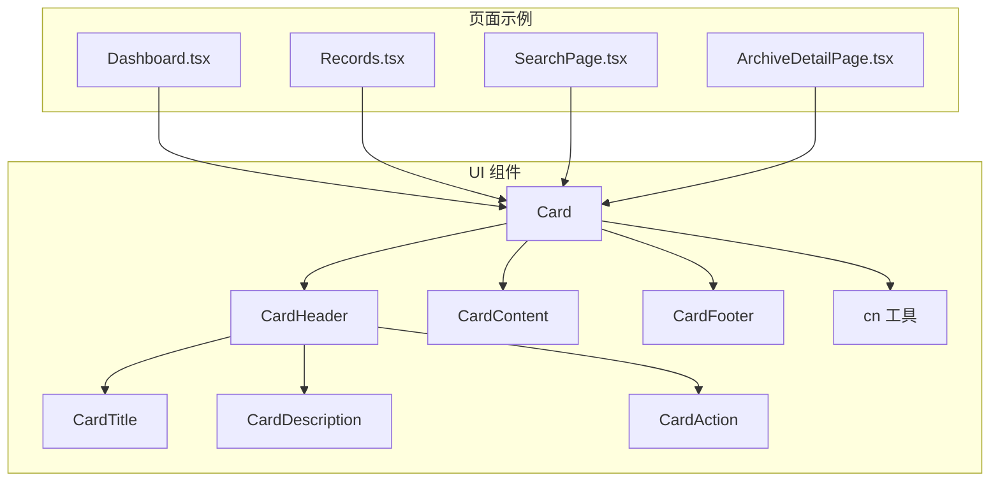
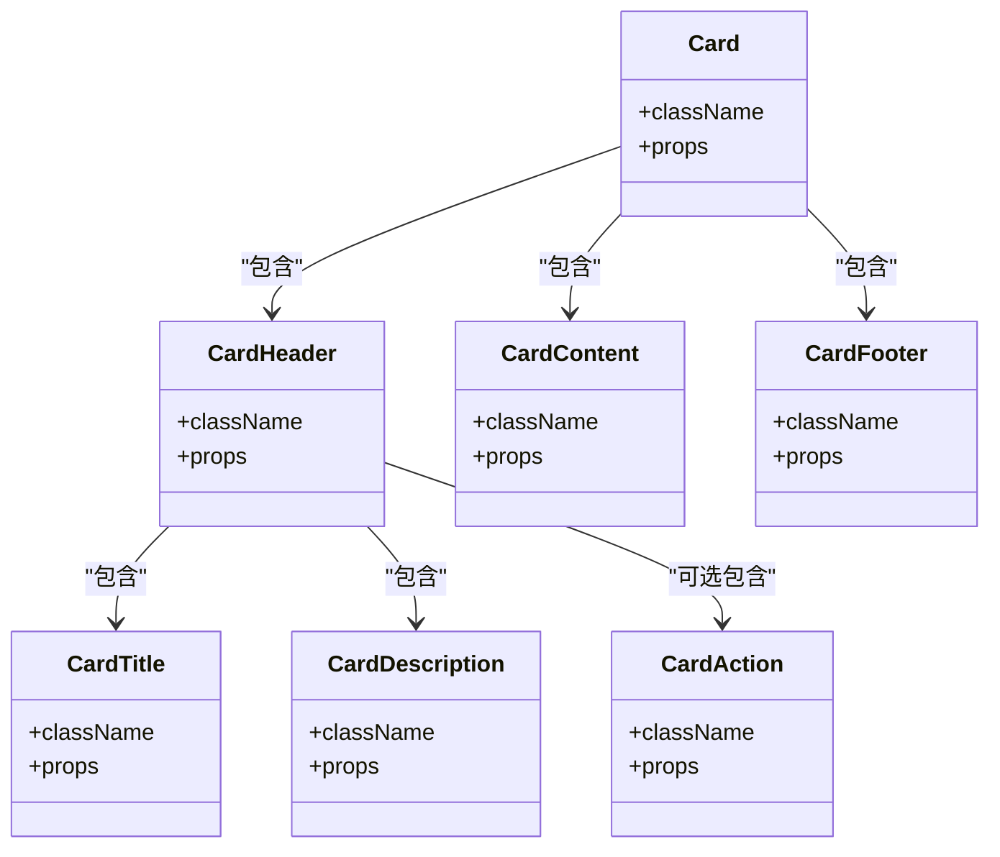
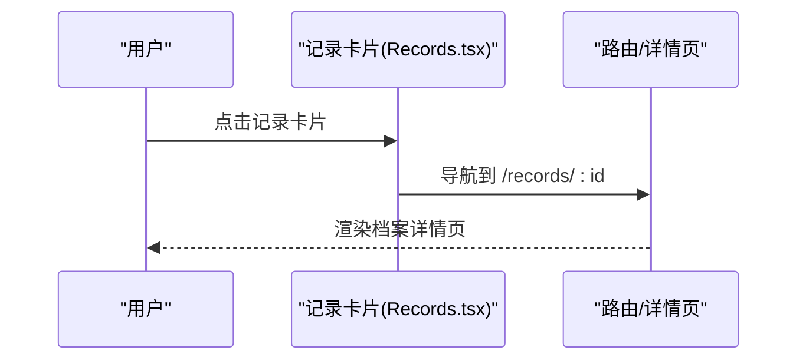
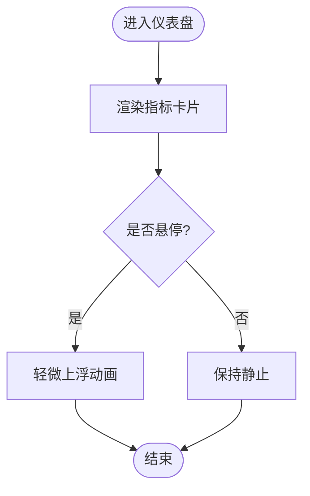
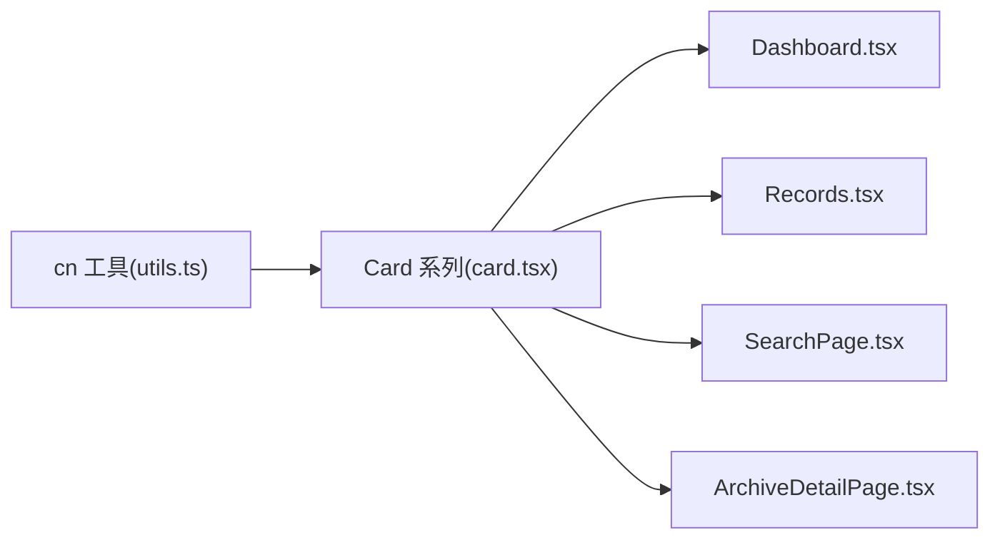

# Card卡片组件

<cite>
**本文引用的文件**
- [card.tsx](file://figma-ui/src/app/components/ui/card.tsx)
- [utils.ts](file://figma-ui/src/app/components/ui/utils.ts)
- [Dashboard.tsx](file://figma-ui/src/app/pages/Dashboard.tsx)
- [Records.tsx](file://figma-ui/src/app/pages/Records.tsx)
- [SearchPage.tsx](file://figma-ui/src/app/pages/SearchPage.tsx)
- [ArchiveDetailPage.tsx](file://figma-ui/src/app/pages/ArchiveDetailPage.tsx)
</cite>

## 目录
1. [简介](#简介)
2. [项目结构](#项目结构)
3. [核心组件](#核心组件)
4. [架构总览](#架构总览)
5. [详细组件分析](#详细组件分析)
6. [依赖分析](#依赖分析)
7. [性能考虑](#性能考虑)
8. [故障排查指南](#故障排查指南)
9. [结论](#结论)
10. [附录](#附录)

## 简介
本文件为医案通医疗档案网站的 Card 卡片组件提供完整、可落地的文档。内容涵盖语义化结构（标题、描述、内容、操作区）、视觉层次（边框、阴影、圆角、间距）、响应式布局适配、样式定制选项与插槽使用，并结合数据展示、信息概览、操作面板等业务场景给出具体用法指引。

## 项目结构
Card 组件位于 UI 基础组件目录中，由多个子区域组件组合而成，并通过工具函数合并类名以支持灵活定制。页面层通过不同卡片形态实现业务场景：
- 仪表盘中的指标卡片与快捷操作卡片
- 记录列表中的条目卡片
- 搜索结果的档案卡片
- 详情页中的信息区块卡片

图表来源
- [card.tsx:5-82](file://figma-ui/src/app/components/ui/card.tsx#L5-L82)
- [utils.ts:4-6](file://figma-ui/src/app/components/ui/utils.ts#L4-L6)
- [Dashboard.tsx:182-200](file://figma-ui/src/app/pages/Dashboard.tsx#L182-L200)
- [Records.tsx:282-335](file://figma-ui/src/app/pages/Records.tsx#L282-L335)
- [SearchPage.tsx:226-279](file://figma-ui/src/app/pages/SearchPage.tsx#L226-L279)
- [ArchiveDetailPage.tsx:278-333](file://figma-ui/src/app/pages/ArchiveDetailPage.tsx#L278-L333)

章节来源
- [card.tsx:5-82](file://figma-ui/src/app/components/ui/card.tsx#L5-L82)
- [utils.ts:4-6](file://figma-ui/src/app/components/ui/utils.ts#L4-L6)

## 核心组件
- Card：容器，负责背景色、文字色、纵向布局、间距、圆角与边框等基础视觉。
- CardHeader：头部区域，支持网格布局与可选的操作区定位；当存在 card-action 时自动切换为两列布局。
- CardTitle：标题元素，语义化为 h4，行高紧凑。
- CardDescription：描述文本，采用中性前景色。
- CardAction：右上角操作区，在 header 网格中独立占位。
- CardContent：内容区，左右内边距一致，最后一个子元素底部留白。
- CardFooter：底部区域，水平居中排列，顶部边框时增加上内边距。

这些子组件通过 data-slot 标记彼此关系，便于样式选择器与测试定位。

章节来源
- [card.tsx:5-82](file://figma-ui/src/app/components/ui/card.tsx#L5-L82)

## 架构总览
Card 组件采用“容器 + 分区”的原子化设计，所有样式基于 Tailwind 实用类，配合 cn 工具进行类名合并，确保可组合性与可覆盖性。页面侧根据业务需求复用该组件或在其基础上扩展。

图表来源
- [card.tsx:5-82](file://figma-ui/src/app/components/ui/card.tsx#L5-L82)

## 详细组件分析

### 语义化结构与布局规范
- 容器（Card）
  - 背景与文字：使用主题变量背景与前景色，保证对比度与一致性。
  - 布局：纵向堆叠，统一间距，圆角与边框作为默认视觉基线。
- 头部（CardHeader）
  - 网格：默认单列，当检测到 card-action 时切换为两列，标题/描述与操作区并排。
  - 下边框：当自身带有底边框时，底部内边距增大以容纳分隔线。
- 标题（CardTitle）
  - 语义：h4，行高紧凑，适合短标题。
- 描述（CardDescription）
  - 语义：p，中性前景色，用于辅助说明。
- 内容（CardContent）
  - 左右内边距与最后一项底部留白，保证内容呼吸感。
- 底部（CardFooter）
  - 水平排列，顶部边框时增加上内边距，常用于标签、按钮组等。

章节来源
- [card.tsx:18-82](file://figma-ui/src/app/components/ui/card.tsx#L18-L82)

### 视觉层次与样式规范
- 边框：默认带边框，可通过覆盖类移除或调整颜色。
- 阴影：默认无内置阴影，可在容器或父级添加阴影以提升层级。
- 圆角：默认中等圆角，可根据品牌风格调整。
- 间距：容器内部统一 gap，内容区左右内边距一致，底部留白规则明确。
- 色彩：使用主题变量，确保明暗模式与品牌色一致。

章节来源
- [card.tsx:5-82](file://figma-ui/src/app/components/ui/card.tsx#L5-L82)

### 响应式布局适配
- 头部网格：当存在操作区时自动两列布局，在小屏下仍保持可读性。
- 内容区：左右内边距固定，结合外层容器栅格可实现多列卡片布局。
- 建议：在移动端将卡片全宽显示，平板及以上可多列并排。

章节来源
- [card.tsx:18-62](file://figma-ui/src/app/components/ui/card.tsx#L18-L62)

### 内容插槽与组合方式
- 标题插槽：CardTitle
- 描述插槽：CardDescription
- 内容插槽：CardContent
- 操作插槽：CardAction（置于 CardHeader 内）
- 底部插槽：CardFooter

典型组合：
- 数据展示：标题 + 描述 + 内容（数值/摘要）+ 底部（标签/时间）
- 信息概览：标题 + 描述 + 内容（关键指标）+ 操作（查看详情）
- 操作面板：标题 + 描述 + 内容（表单/开关）+ 底部（确认/取消）

章节来源
- [card.tsx:18-82](file://figma-ui/src/app/components/ui/card.tsx#L18-L82)

### 业务场景示例

#### 数据展示（记录条目）
- 结构：标题（记录名称）、描述（医院/日期）、内容（AI 摘要/关键指标）、底部（标签/状态）。
- 交互：点击整卡进入详情，底部右侧箭头提示可跳转。
- 参考路径：[Records.tsx:282-335](file://figma-ui/src/app/pages/Records.tsx#L282-L335)

图表来源
- [Records.tsx:282-335](file://figma-ui/src/app/pages/Records.tsx#L282-L335)

章节来源
- [Records.tsx:282-335](file://figma-ui/src/app/pages/Records.tsx#L282-L335)

#### 信息概览（仪表盘指标）
- 结构：图标 + 指标值 + 单位 + 迷你趋势图。
- 交互：悬停轻微上浮提升层级。
- 参考路径：[Dashboard.tsx:60-104](file://figma-ui/src/app/pages/Dashboard.tsx#L60-L104)

图表来源
- [Dashboard.tsx:60-104](file://figma-ui/src/app/pages/Dashboard.tsx#L60-L104)

章节来源
- [Dashboard.tsx:60-104](file://figma-ui/src/app/pages/Dashboard.tsx#L60-L104)

#### 操作面板（快捷入口）
- 结构：图标 + 提示文案 + 主信息 + 副信息。
- 交互：点击跳转到对应功能页。
- 参考路径：[Dashboard.tsx:182-200](file://figma-ui/src/app/pages/Dashboard.tsx#L182-L200)

章节来源
- [Dashboard.tsx:182-200](file://figma-ui/src/app/pages/Dashboard.tsx#L182-L200)

#### 搜索结果（档案卡片）
- 结构：类型标签 + AI 解析标识 + 标题 + 医院/科室 + 时间 + 标签。
- 交互：点击打开档案详情。
- 参考路径：[SearchPage.tsx:226-279](file://figma-ui/src/app/pages/SearchPage.tsx#L226-L279)

章节来源
- [SearchPage.tsx:226-279](file://figma-ui/src/app/pages/SearchPage.tsx#L226-L279)

#### 详情页（信息区块）
- 结构：标题卡片（标题 + 元信息）+ 内容区块（诊断/建议/影像报告）。
- 交互：查看原件、分享等操作。
- 参考路径：[ArchiveDetailPage.tsx:278-333](file://figma-ui/src/app/pages/ArchiveDetailPage.tsx#L278-L333)

章节来源
- [ArchiveDetailPage.tsx:278-333](file://figma-ui/src/app/pages/ArchiveDetailPage.tsx#L278-L333)

## 依赖分析
- 组件内部依赖
  - cn 工具：合并多个类名，避免冲突并支持条件类。
- 页面依赖
  - Dashboard、Records、SearchPage、ArchiveDetailPage 均通过自定义卡片形态实现业务需求，体现组件的可扩展性。

图表来源
- [utils.ts:4-6](file://figma-ui/src/app/components/ui/utils.ts#L4-L6)
- [card.tsx:5-82](file://figma-ui/src/app/components/ui/card.tsx#L5-L82)
- [Dashboard.tsx:60-104](file://figma-ui/src/app/pages/Dashboard.tsx#L60-L104)
- [Records.tsx:282-335](file://figma-ui/src/app/pages/Records.tsx#L282-L335)
- [SearchPage.tsx:226-279](file://figma-ui/src/app/pages/SearchPage.tsx#L226-L279)
- [ArchiveDetailPage.tsx:278-333](file://figma-ui/src/app/pages/ArchiveDetailPage.tsx#L278-L333)

章节来源
- [utils.ts:4-6](file://figma-ui/src/app/components/ui/utils.ts#L4-L6)
- [card.tsx:5-82](file://figma-ui/src/app/components/ui/card.tsx#L5-L82)

## 性能考虑
- 类名合并：使用 cn 工具减少重复与冲突类名，降低样式计算开销。
- 布局稳定：卡片内部使用固定间距与网格，避免重排抖动。
- 动画与过渡：仅在必要时启用轻量过渡（如悬停），避免过度动画影响滚动性能。
- 图片与图表：在卡片内嵌入图表时注意按需渲染与尺寸限制，避免大图阻塞。

## 故障排查指南
- 标题与描述未对齐
  - 检查是否在 CardHeader 内正确放置 CardTitle 与 CardDescription。
  - 若使用 CardAction，确认其位于 CardHeader 内以触发两列布局。
- 内容底部留白异常
  - 确认最后一个子元素是否为 CardContent 的直接子节点。
- 边框与阴影不生效
  - 检查是否被外层样式覆盖；如需去除边框，可在 Card 上覆盖类名。
- 响应式错位
  - 在小屏设备上确认外层栅格宽度与卡片最大宽度设置。

章节来源
- [card.tsx:18-82](file://figma-ui/src/app/components/ui/card.tsx#L18-L82)

## 结论
Card 组件以清晰的语义化结构与灵活的样式定制能力，支撑了医案通网站的数据展示、信息概览与操作面板等多种业务场景。通过统一的视觉语言与响应式策略，确保在不同屏幕尺寸下的良好体验。建议在项目中优先使用该组件族，并在需要时通过类名覆盖与组合实现差异化样式。

## 附录

### 组件 API 速查
- Card
  - 作用：卡片容器
  - 关键样式：背景/前景色、纵向布局、间距、圆角、边框
  - 可覆盖：className
- CardHeader
  - 作用：头部区域，支持操作区并排
  - 关键样式：网格、内边距、下边框处理
- CardTitle
  - 作用：标题（h4）
  - 关键样式：紧凑行高
- CardDescription
  - 作用：描述（p）
  - 关键样式：中性前景色
- CardAction
  - 作用：右上角操作区
  - 关键样式：网格定位
- CardContent
  - 作用：内容区
  - 关键样式：左右内边距、末项底部留白
- CardFooter
  - 作用：底部区域
  - 关键样式：水平排列、顶边框处理

章节来源
- [card.tsx:5-82](file://figma-ui/src/app/components/ui/card.tsx#L5-L82)