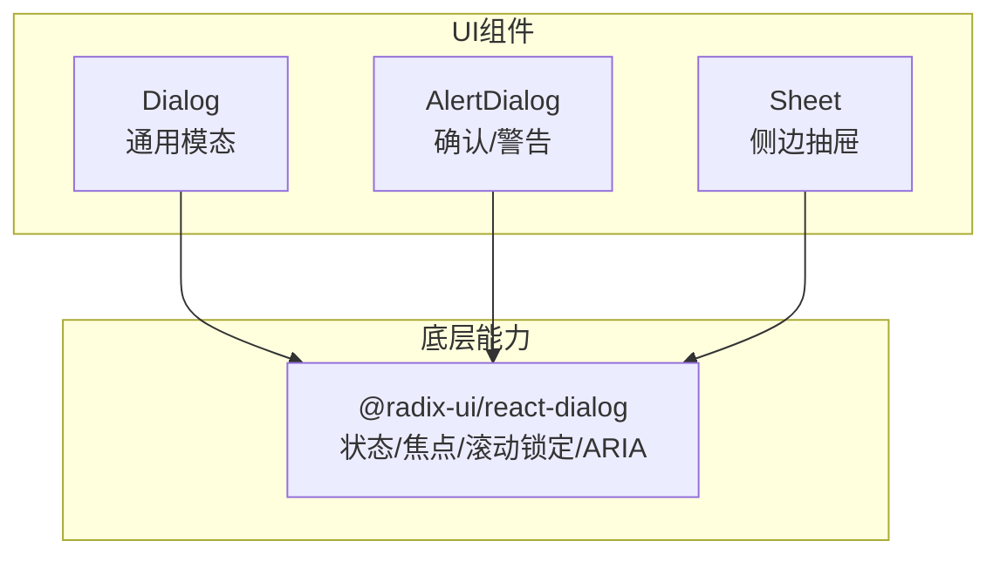
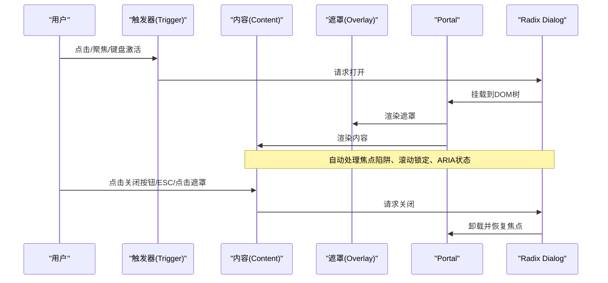
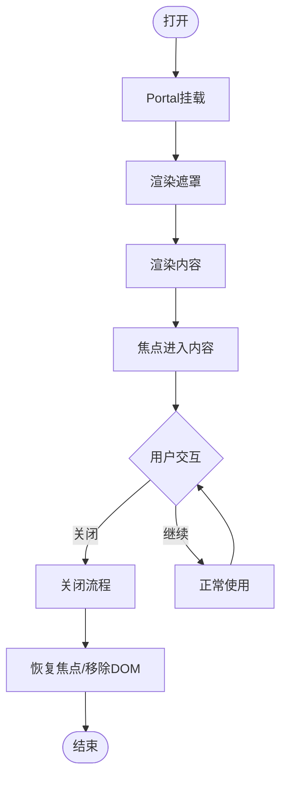
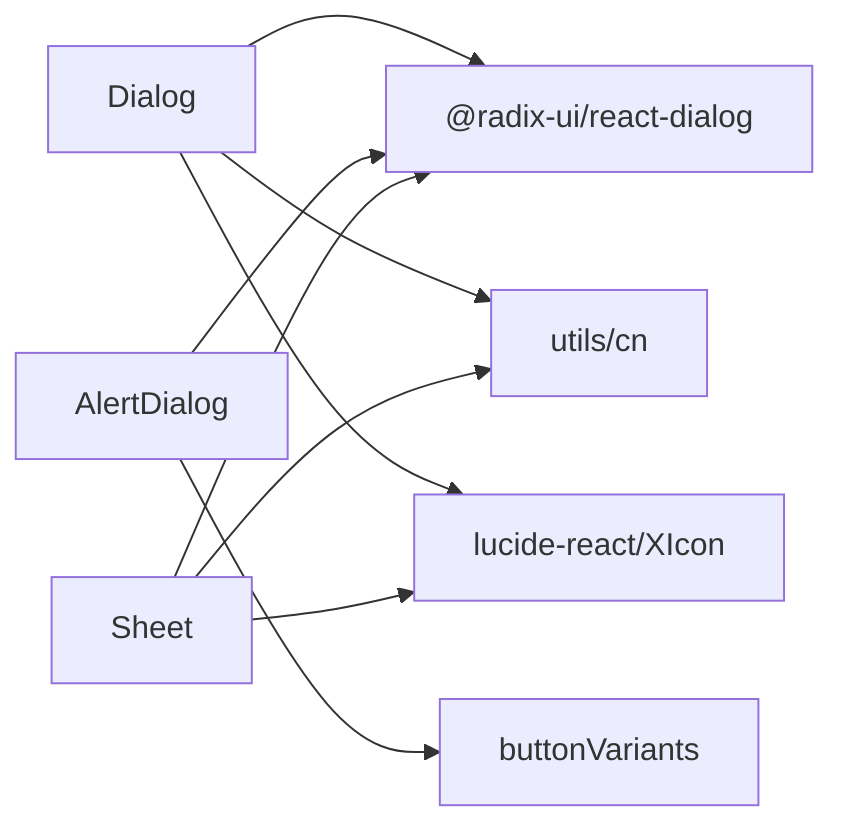

# Dialog对话框组件

<cite>
**本文引用的文件**
- [dialog.tsx](file://figma-ui/src/app/components/ui/dialog.tsx)
- [alert-dialog.tsx](file://figma-ui/src/app/components/ui/alert-dialog.tsx)
- [sheet.tsx](file://figma-ui/src/app/components/ui/sheet.tsx)
- [LaunchNoticeProvider.tsx](file://figma-ui/src/app/components/LaunchNoticeProvider.tsx)
</cite>

## 目录
1. [简介](#简介)
2. [项目结构](#项目结构)
3. [核心组件](#核心组件)
4. [架构总览](#架构总览)
5. [详细组件分析](#详细组件分析)
6. [依赖关系分析](#依赖关系分析)
7. [性能与可访问性](#性能与可访问性)
8. [故障排查指南](#故障排查指南)
9. [结论](#结论)
10. [附录：API与使用示例](#附录api与使用示例)

## 简介
本组件文档围绕医案通医疗档案网站中的Dialog对话框组件，基于Radix UI的Dialog实现，系统阐述触发器、内容区域、关闭按钮与遮罩层的完整交互流程；说明对话框生命周期（打开/关闭动画、焦点管理、滚动锁定）；解释可访问性特性（键盘导航、屏幕阅读器支持、Aria属性配置）；提供完整的API接口规范、自定义样式选项与响应式布局适配；并通过确认操作、信息展示、表单弹窗等典型业务场景给出具体用法指引。

## 项目结构
本项目在UI层提供了三类模态类组件：
- Dialog：通用模态框，内置遮罩、居中内容与右上角关闭按钮
- AlertDialog：用于确认/警告场景，提供Action/Cancel按钮
- Sheet：侧边抽屉，同样基于Dialog底层能力

图表来源
- [dialog.tsx:1-136](file://figma-ui/src/app/components/ui/dialog.tsx#L1-L136)
- [alert-dialog.tsx:1-158](file://figma-ui/src/app/components/ui/alert-dialog.tsx#L1-L158)
- [sheet.tsx:1-140](file://figma-ui/src/app/components/ui/sheet.tsx#L1-L140)

章节来源
- [dialog.tsx:1-136](file://figma-ui/src/app/components/ui/dialog.tsx#L1-L136)
- [alert-dialog.tsx:1-158](file://figma-ui/src/app/components/ui/alert-dialog.tsx#L1-L158)
- [sheet.tsx:1-140](file://figma-ui/src/app/components/ui/sheet.tsx#L1-L140)

## 核心组件
- Dialog：封装了Root、Trigger、Portal、Overlay、Content、Close、Header、Footer、Title、Description等子组件，提供开箱即用的居中模态体验，并内建关闭按钮。
- AlertDialog：面向确认/警告场景，提供Action/Cancel按钮，样式与交互语义更明确。
- Sheet：侧边抽屉，支持多方向滑入滑出，适合复杂表单或设置面板。

章节来源
- [dialog.tsx:9-135](file://figma-ui/src/app/components/ui/dialog.tsx#L9-L135)
- [alert-dialog.tsx:9-157](file://figma-ui/src/app/components/ui/alert-dialog.tsx#L9-L157)
- [sheet.tsx:9-139](file://figma-ui/src/app/components/ui/sheet.tsx#L9-L139)

## 架构总览
Dialog系列组件以Radix UI为底座，通过React组合模式对外暴露简洁API。Dialog内部将Overlay与Content组合在Portal中渲染，确保层级与焦点隔离；同时注入默认关闭按钮与响应式样式。

图表来源
- [dialog.tsx:15-73](file://figma-ui/src/app/components/ui/dialog.tsx#L15-L73)
- [alert-dialog.tsx:15-64](file://figma-ui/src/app/components/ui/alert-dialog.tsx#L15-L64)
- [sheet.tsx:13-82](file://figma-ui/src/app/components/ui/sheet.tsx#L13-L82)

## 详细组件分析

### Dialog组件
- 职责
  - 提供统一的模态容器与默认样式
  - 内置遮罩与居中内容
  - 内置右上角关闭按钮，具备可访问性
- 关键子组件
  - Root/Trigger/Portal/Overlay/Content/Close
  - Header/Footer/Title/Description：用于结构化布局与语义化标题/描述
- 交互流程
  - 打开：Trigger触发后，Portal挂载Overlay与Content，应用入场动画
  - 关闭：Close按钮、ESC键、点击遮罩均可关闭，应用出场动画并恢复焦点
- 可访问性
  - 焦点管理：打开时焦点移至内容，关闭后恢复至触发元素
  - 键盘：支持Tab循环、Esc关闭
  - ARIA：由Radix维护aria-modal、role="dialog"等属性
- 样式与响应式
  - 遮罩：固定定位、半透明背景、z-index保障层级
  - 内容：居中、圆角、阴影、移动端全宽、桌面端最大宽度限制
  - 动画：data-[state]驱动的淡入/缩放动画
  - 关闭按钮：绝对定位右上角，hover/focus可见性与尺寸控制

图表来源
- [dialog.tsx:21-73](file://figma-ui/src/app/components/ui/dialog.tsx#L21-L73)

章节来源
- [dialog.tsx:9-135](file://figma-ui/src/app/components/ui/dialog.tsx#L9-L135)

### AlertDialog组件
- 适用场景：确认删除、重要提示、二次确认等
- 特点：提供Action/Cancel按钮，语义更贴近“警告/确认”
- 交互：与Dialog一致，但强调主/次动作区分

章节来源
- [alert-dialog.tsx:9-157](file://figma-ui/src/app/components/ui/alert-dialog.tsx#L9-L157)

### Sheet组件
- 适用场景：设置面板、编辑表单、详情侧栏
- 特点：支持top/right/bottom/left四向滑入，带遮罩与关闭按钮
- 交互：与Dialog一致，侧重滑入/滑出动画

章节来源
- [sheet.tsx:9-139](file://figma-ui/src/app/components/ui/sheet.tsx#L9-L139)

## 依赖关系分析
- 外部依赖
  - @radix-ui/react-dialog：提供无障碍、焦点、状态、动画钩子等基础能力
  - lucide-react：XIcon用于关闭按钮
  - Tailwind CSS：通过cn工具函数组合样式类
- 内部依赖
  - utils/cn：样式合并
  - buttonVariants（AlertDialog）：统一按钮风格

图表来源
- [dialog.tsx:3-7](file://figma-ui/src/app/components/ui/dialog.tsx#L3-L7)
- [alert-dialog.tsx:3-7](file://figma-ui/src/app/components/ui/alert-dialog.tsx#L3-L7)
- [sheet.tsx:3-7](file://figma-ui/src/app/components/ui/sheet.tsx#L3-L7)

章节来源
- [dialog.tsx:3-7](file://figma-ui/src/app/components/ui/dialog.tsx#L3-L7)
- [alert-dialog.tsx:3-7](file://figma-ui/src/app/components/ui/alert-dialog.tsx#L3-L7)
- [sheet.tsx:3-7](file://figma-ui/src/app/components/ui/sheet.tsx#L3-L7)

## 性能与可访问性
- 性能
  - Portal隔离：避免父级样式/变换影响模态层级
  - 按需渲染：仅当open为true时挂载DOM节点
  - 动画时长短：默认200ms级别，减少卡顿
- 可访问性
  - 焦点管理：打开时自动聚焦首个可聚焦元素，关闭后回到触发元素
  - 键盘导航：Tab/Shift+Tab在内容内循环，Esc关闭
  - 屏幕阅读器：role="dialog"、aria-modal、标题/描述语义化
  - 关闭按钮：包含sr-only文本，便于读屏识别

章节来源
- [dialog.tsx:27-73](file://figma-ui/src/app/components/ui/dialog.tsx#L27-L73)
- [alert-dialog.tsx:31-64](file://figma-ui/src/app/components/ui/alert-dialog.tsx#L31-L64)
- [sheet.tsx:31-82](file://figma-ui/src/app/components/ui/sheet.tsx#L31-L82)

## 故障排查指南
- 问题：点击遮罩无法关闭
  - 检查是否覆盖了默认关闭行为（例如阻止事件冒泡）
  - 确认未禁用Radix默认的遮罩关闭逻辑
- 问题：焦点丢失或无法Tab
  - 确保内容中包含可聚焦元素
  - 避免在内容内使用tabindex负值阻断焦点流
- 问题：动画不生效
  - 检查Tailwind动画配置是否启用
  - 确认data-[state]类未被覆盖
- 问题：移动端显示异常
  - 检查max-w与translate居中样式是否被全局样式覆盖
  - 确认viewport与z-index层级正确

章节来源
- [dialog.tsx:33-73](file://figma-ui/src/app/components/ui/dialog.tsx#L33-L73)
- [alert-dialog.tsx:31-64](file://figma-ui/src/app/components/ui/alert-dialog.tsx#L31-L64)
- [sheet.tsx:31-82](file://figma-ui/src/app/components/ui/sheet.tsx#L31-L82)

## 结论
Dialog组件基于Radix UI构建，提供开箱即用、可访问性强、易于定制的模态能力。结合AlertDialog与Sheet，可满足医案通网站从简单提示到复杂表单的多场景需求。推荐优先使用Dialog进行通用弹窗，使用AlertDialog表达确认/警告，使用Sheet承载侧边信息或表单。

## 附录：API与使用示例

### API概览
- Dialog
  - Root/Trigger/Portal/Overlay/Content/Close
  - Header/Footer/Title/Description
- AlertDialog
  - Root/Trigger/Portal/Overlay/Content
  - Header/Footer/Title/Description
  - Action/Cancel
- Sheet
  - Root/Trigger/Portal/Overlay/Content
  - Header/Footer/Title/Description
  - side: "top" | "right" | "bottom" | "left"

章节来源
- [dialog.tsx:9-135](file://figma-ui/src/app/components/ui/dialog.tsx#L9-L135)
- [alert-dialog.tsx:9-157](file://figma-ui/src/app/components/ui/alert-dialog.tsx#L9-L157)
- [sheet.tsx:9-139](file://figma-ui/src/app/components/ui/sheet.tsx#L9-L139)

### 生命周期与交互要点
- 打开/关闭
  - 通过open/onOpenChange控制显隐
  - 支持ESC关闭、点击遮罩关闭、Close按钮关闭
- 动画
  - data-[state=open]/[closed]驱动淡入/缩放/滑入滑出
- 焦点与滚动
  - 打开时锁定页面滚动，焦点进入内容
  - 关闭后恢复滚动与焦点

章节来源
- [dialog.tsx:21-73](file://figma-ui/src/app/components/ui/dialog.tsx#L21-L73)
- [alert-dialog.tsx:23-64](file://figma-ui/src/app/components/ui/alert-dialog.tsx#L23-L64)
- [sheet.tsx:25-82](file://figma-ui/src/app/components/ui/sheet.tsx#L25-L82)

### 可访问性实践
- 键盘：Tab循环、Esc关闭
- 屏幕阅读器：role="dialog"、aria-modal、标题/描述
- 关闭按钮：包含sr-only文本，提升读屏体验

章节来源
- [dialog.tsx:27-73](file://figma-ui/src/app/components/ui/dialog.tsx#L27-L73)
- [alert-dialog.tsx:31-64](file://figma-ui/src/app/components/ui/alert-dialog.tsx#L31-L64)
- [sheet.tsx:31-82](file://figma-ui/src/app/components/ui/sheet.tsx#L31-L82)

### 样式与响应式
- 遮罩：固定定位、半透明背景、高z-index
- 内容：居中、圆角、阴影、移动端全宽、桌面端最大宽度
- 关闭按钮：右上角绝对定位，hover/focus增强可见性
- 动画：data-[state]驱动的过渡效果

章节来源
- [dialog.tsx:33-73](file://figma-ui/src/app/components/ui/dialog.tsx#L33-L73)
- [alert-dialog.tsx:31-64](file://figma-ui/src/app/components/ui/alert-dialog.tsx#L31-L64)
- [sheet.tsx:31-82](file://figma-ui/src/app/components/ui/sheet.tsx#L31-L82)

### 业务场景示例

- 确认操作（删除/提交前确认）
  - 使用AlertDialog，配合Action/Cancel按钮
  - 参考用法路径：[LaunchNoticeProvider.tsx:76-106](file://figma-ui/src/app/components/LaunchNoticeProvider.tsx#L76-L106)

- 信息展示（公告/帮助/二维码）
  - 使用AlertDialog或Dialog，展示标题、描述与富媒体内容
  - 参考用法路径：[LaunchNoticeProvider.tsx:76-106](file://figma-ui/src/app/components/LaunchNoticeProvider.tsx#L76-L106)

- 表单弹窗（新增/编辑）
  - 使用Dialog或Sheet（长表单建议Sheet），利用Header/Footer组织布局
  - 参考组件定义：[dialog.tsx:75-96](file://figma-ui/src/app/components/ui/dialog.tsx#L75-L96)、[sheet.tsx:84-102](file://figma-ui/src/app/components/ui/sheet.tsx#L84-L102)

- 触发器与关闭
  - 触发：使用Trigger包裹任意可交互元素
  - 关闭：使用Close按钮或ESC/遮罩关闭
  - 参考组件定义：[dialog.tsx:15-31](file://figma-ui/src/app/components/ui/dialog.tsx#L15-L31)

章节来源
- [LaunchNoticeProvider.tsx:76-106](file://figma-ui/src/app/components/LaunchNoticeProvider.tsx#L76-L106)
- [dialog.tsx:15-96](file://figma-ui/src/app/components/ui/dialog.tsx#L15-L96)
- [sheet.tsx:84-102](file://figma-ui/src/app/components/ui/sheet.tsx#L84-L102)