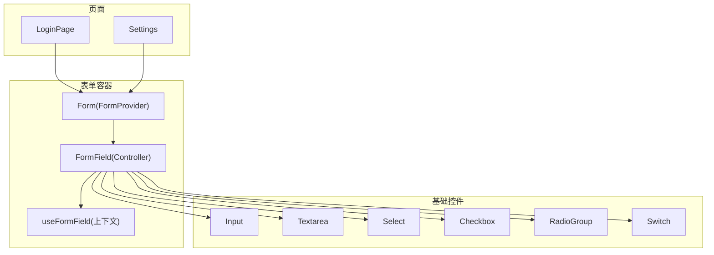
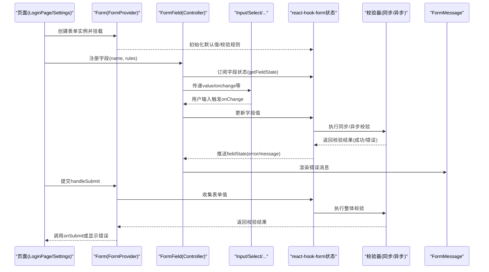
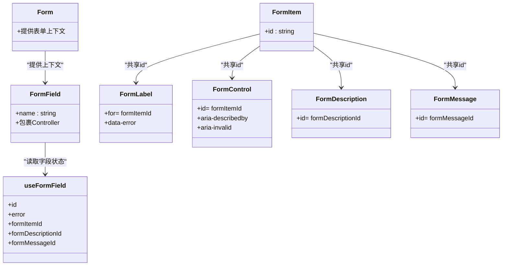
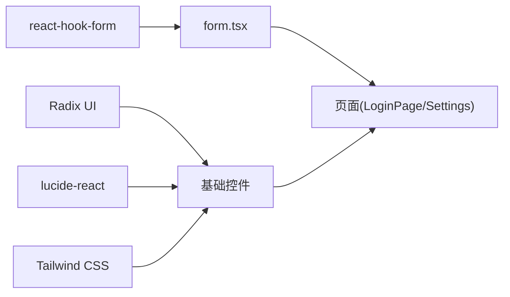

# Form表单组件

<cite>
**本文引用的文件**
- [form.tsx](file://figma-ui/src/app/components/ui/form.tsx)
- [input.tsx](file://figma-ui/src/app/components/ui/input.tsx)
- [textarea.tsx](file://figma-ui/src/app/components/ui/textarea.tsx)
- [select.tsx](file://figma-ui/src/app/components/ui/select.tsx)
- [checkbox.tsx](file://figma-ui/src/app/components/ui/checkbox.tsx)
- [radio-group.tsx](file://figma-ui/src/app/components/ui/radio-group.tsx)
- [switch.tsx](file://figma-ui/src/app/components/ui/switch.tsx)
- [Settings.tsx](file://figma-ui/src/app/pages/Settings.tsx)
- [LoginPage.tsx](file://figma-ui/src/app/pages/LoginPage.tsx)
</cite>

## 目录
1. [简介](#简介)
2. [项目结构](#项目结构)
3. [核心组件](#核心组件)
4. [架构总览](#架构总览)
5. [详细组件分析](#详细组件分析)
6. [依赖关系分析](#依赖关系分析)
7. [性能考量](#性能考量)
8. [故障排查指南](#故障排查指南)
9. [结论](#结论)
10. [附录：业务场景示例与最佳实践](#附录业务场景示例与最佳实践)

## 简介
本文件为“医案通医疗档案网站”的Form表单组件文档，聚焦基于React Hook Form的表单系统。内容涵盖：
- 表单状态管理、字段注册、值绑定与数据转换
- 同步与异步验证（含Zod集成思路）
- 错误处理与提示展示
- 提交处理流程
- 在用户设置、数据录入、搜索筛选等复杂业务中的构建模式与最佳实践

本项目已提供一套可复用的表单基础组件与UI控件，便于快速搭建符合无障碍与可访问性要求的表单界面。

## 项目结构
围绕表单能力，项目采用“基础UI + 表单容器 + 页面应用”的分层组织：
- 表单容器与上下文：封装react-hook-form的Provider、Controller与字段上下文，统一错误与描述信息
- 基础输入控件：Input、Textarea、Select、Checkbox、RadioGroup、Switch等，均支持无障碍属性与错误态样式
- 页面级表单：在登录页、设置页等页面中组合使用上述组件完成业务表单

图表来源
- [form.tsx:1-168](file://figma-ui/src/app/components/ui/form.tsx#L1-L168)
- [input.tsx:1-22](file://figma-ui/src/app/components/ui/input.tsx#L1-L22)
- [textarea.tsx:1-19](file://figma-ui/src/app/components/ui/textarea.tsx#L1-L19)
- [select.tsx:1-190](file://figma-ui/src/app/components/ui/select.tsx#L1-L190)
- [checkbox.tsx:1-33](file://figma-ui/src/app/components/ui/checkbox.tsx#L1-L33)
- [radio-group.tsx:1-46](file://figma-ui/src/app/components/ui/radio-group.tsx#L1-L46)
- [switch.tsx:1-32](file://figma-ui/src/app/components/ui/switch.tsx#L1-L32)
- [LoginPage.tsx:1-203](file://figma-ui/src/app/pages/LoginPage.tsx#L1-L203)
- [Settings.tsx:1-347](file://figma-ui/src/app/pages/Settings.tsx#L1-L347)

章节来源
- [form.tsx:1-168](file://figma-ui/src/app/components/ui/form.tsx#L1-L168)
- [input.tsx:1-22](file://figma-ui/src/app/components/ui/input.tsx#L1-L22)
- [textarea.tsx:1-19](file://figma-ui/src/app/components/ui/textarea.tsx#L1-L19)
- [select.tsx:1-190](file://figma-ui/src/app/components/ui/select.tsx#L1-L190)
- [checkbox.tsx:1-33](file://figma-ui/src/app/components/ui/checkbox.tsx#L1-L33)
- [radio-group.tsx:1-46](file://figma-ui/src/app/components/ui/radio-group.tsx#L1-L46)
- [switch.tsx:1-32](file://figma-ui/src/app/components/ui/switch.tsx#L1-L32)
- [LoginPage.tsx:1-203](file://figma-ui/src/app/pages/LoginPage.tsx#L1-L203)
- [Settings.tsx:1-347](file://figma-ui/src/app/pages/Settings.tsx#L1-L347)

## 核心组件
- Form/FormProvider：作为表单根节点，集中管理表单状态、校验与提交
- FormField/Controller：将具体字段接入react-hook-form，负责值绑定、事件监听与校验执行
- useFormField：从上下文中获取字段ID、错误、描述与消息ID，供Label/Control/Message等子组件复用
- FormItem/FormLabel/FormControl/FormDescription/FormMessage：构成一个完整的字段区块，提供语义化结构与无障碍属性

这些组件共同实现了：
- 统一的字段上下文与错误传播
- 自动关联label与控件的id/describedby
- 错误态下的视觉反馈（通过aria-invalid与data-error）

章节来源
- [form.tsx:19-66](file://figma-ui/src/app/components/ui/form.tsx#L19-L66)
- [form.tsx:76-157](file://figma-ui/src/app/components/ui/form.tsx#L76-L157)

## 架构总览
下图展示了表单从渲染到提交的完整链路，以及各组件的职责分工。

图表来源
- [form.tsx:1-168](file://figma-ui/src/app/components/ui/form.tsx#L1-L168)
- [LoginPage.tsx:1-203](file://figma-ui/src/app/pages/LoginPage.tsx#L1-L203)
- [Settings.tsx:1-347](file://figma-ui/src/app/pages/Settings.tsx#L1-L347)

## 详细组件分析

### 表单容器与上下文（Form/FormField/useFormField）
- Form：即FormProvider，承载整个表单的状态与生命周期
- FormField：包装Controller，注入字段name到上下文，使子组件能读取字段状态
- useFormField：聚合字段ID、错误、描述与消息ID，供Label/Control/Message消费
- FormItem：生成唯一ID并提供布局容器
- FormLabel/FormDescription/FormMessage：分别负责标签、说明与错误消息，结合aria属性提升可访问性

图表来源
- [form.tsx:19-66](file://figma-ui/src/app/components/ui/form.tsx#L19-L66)
- [form.tsx:76-157](file://figma-ui/src/app/components/ui/form.tsx#L76-L157)

章节来源
- [form.tsx:19-66](file://figma-ui/src/app/components/ui/form.tsx#L19-L66)
- [form.tsx:76-157](file://figma-ui/src/app/components/ui/form.tsx#L76-L157)

### 基础输入控件（Input/Textarea/Select/Checkbox/RadioGroup/Switch）
- Input/Textarea：标准文本输入，支持placeholder、禁用态、焦点环与错误态边框/阴影
- Select：下拉选择，包含Trigger/Content/Item等，支持占位符与键盘导航
- Checkbox/RadioGroup：多选与单选，具备选中态与禁用态
- Switch：开关控件，用于布尔值切换

这些控件均通过className与aria-*属性实现一致的交互与可访问性体验，可与FormField配合完成受控绑定。

章节来源
- [input.tsx:1-22](file://figma-ui/src/app/components/ui/input.tsx#L1-L22)
- [textarea.tsx:1-19](file://figma-ui/src/app/components/ui/textarea.tsx#L1-L19)
- [select.tsx:1-190](file://figma-ui/src/app/components/ui/select.tsx#L1-L190)
- [checkbox.tsx:1-33](file://figma-ui/src/app/components/ui/checkbox.tsx#L1-L33)
- [radio-group.tsx:1-46](file://figma-ui/src/app/components/ui/radio-group.tsx#L1-L46)
- [switch.tsx:1-32](file://figma-ui/src/app/components/ui/switch.tsx#L1-L32)

### 页面级表单示例
- 登录页：手机号与验证码输入，本地存储用户信息与成员初始化，演示了简单表单的输入与提交流程
- 设置页：家庭成员添加表单，演示了动态表单、状态管理与本地持久化的组合用法

章节来源
- [LoginPage.tsx:1-203](file://figma-ui/src/app/pages/LoginPage.tsx#L1-L203)
- [Settings.tsx:1-347](file://figma-ui/src/app/pages/Settings.tsx#L1-L347)

## 依赖关系分析
- react-hook-form：提供FormProvider、Controller、useFormContext、useFormState等能力，驱动表单状态与校验
- Radix UI：提供底层无样式UI原语（如Label、Select、Checkbox、Switch等），确保可访问性与行为一致性
- lucide-react：图标库，用于增强表单控件的可读性
- Tailwind CSS：通过cn工具类组合样式，统一焦点环、错误态与暗色适配

图表来源
- [form.tsx:1-168](file://figma-ui/src/app/components/ui/form.tsx#L1-L168)
- [select.tsx:1-190](file://figma-ui/src/app/components/ui/select.tsx#L1-L190)
- [checkbox.tsx:1-33](file://figma-ui/src/app/components/ui/checkbox.tsx#L1-L33)
- [switch.tsx:1-32](file://figma-ui/src/app/components/ui/switch.tsx#L1-L32)
- [LoginPage.tsx:1-203](file://figma-ui/src/app/pages/LoginPage.tsx#L1-L203)
- [Settings.tsx:1-347](file://figma-ui/src/app/pages/Settings.tsx#L1-L347)

章节来源
- [form.tsx:1-168](file://figma-ui/src/app/components/ui/form.tsx#L1-L168)
- [select.tsx:1-190](file://figma-ui/src/app/components/ui/select.tsx#L1-L190)
- [checkbox.tsx:1-33](file://figma-ui/src/app/components/ui/checkbox.tsx#L1-L33)
- [switch.tsx:1-32](file://figma-ui/src/app/components/ui/switch.tsx#L1-L32)
- [LoginPage.tsx:1-203](file://figma-ui/src/app/pages/LoginPage.tsx#L1-L203)
- [Settings.tsx:1-347](file://figma-ui/src/app/pages/Settings.tsx#L1-L347)

## 性能考量
- 避免不必要的重渲染：使用FormField精确控制字段范围，减少父组件重渲染对整表的影响
- 延迟校验：对长耗时校验使用防抖或仅在失焦时触发，降低输入卡顿
- 异步校验优化：合并重复请求、缓存结果、取消过期请求，避免竞态
- 列表型表单：对动态增删字段进行稳定key管理，必要时拆分子组件以减少DOM操作
- 大表单分页/分步：按步骤加载与校验，降低首屏负担

[本节为通用指导，不直接分析具体文件]

## 故障排查指南
- 字段未生效
  - 确认字段已在FormField中正确注册name
  - 检查FormControl是否正确透传props
  - 参考路径：[form.tsx:32-43](file://figma-ui/src/app/components/ui/form.tsx#L32-L43)、[form.tsx:107-124](file://figma-ui/src/app/components/ui/form.tsx#L107-L124)
- 错误消息不显示
  - 确认FormMessage位于FormItem内且未被条件渲染隐藏
  - 检查useFormField是否正确获取error与formMessageId
  - 参考路径：[form.tsx:139-157](file://figma-ui/src/app/components/ui/form.tsx#L139-L157)
- 可访问性问题
  - 确保Label的htmlFor与控件id一致，描述与消息通过aria-describedby关联
  - 参考路径：[form.tsx:90-105](file://figma-ui/src/app/components/ui/form.tsx#L90-L105)、[form.tsx:107-124](file://figma-ui/src/app/components/ui/form.tsx#L107-L124)
- 页面级问题
  - 登录页：验证码倒计时与按钮禁用逻辑
    - 参考路径：[LoginPage.tsx:12-29](file://figma-ui/src/app/pages/LoginPage.tsx#L12-L29)
  - 设置页：成员添加表单的状态与本地存储
    - 参考路径：[Settings.tsx:84-104](file://figma-ui/src/app/pages/Settings.tsx#L84-L104)

章节来源
- [form.tsx:32-43](file://figma-ui/src/app/components/ui/form.tsx#L32-L43)
- [form.tsx:90-105](file://figma-ui/src/app/components/ui/form.tsx#L90-L105)
- [form.tsx:107-124](file://figma-ui/src/app/components/ui/form.tsx#L107-L124)
- [form.tsx:139-157](file://figma-ui/src/app/components/ui/form.tsx#L139-L157)
- [LoginPage.tsx:12-29](file://figma-ui/src/app/pages/LoginPage.tsx#L12-L29)
- [Settings.tsx:84-104](file://figma-ui/src/app/pages/Settings.tsx#L84-L104)

## 结论
本项目以react-hookform为核心，结合Radix UI与Tailwind构建了一套高可用、可访问、易扩展的表单体系。通过Form/FormField与基础控件的组合，可在登录、设置、数据录入与搜索筛选等场景中快速落地复杂表单需求。建议后续引入Zod进行类型安全的同步/异步校验，进一步提升表单健壮性与开发体验。

[本节为总结性内容，不直接分析具体文件]

## 附录：业务场景示例与最佳实践

### 表单构建模式
- 基本字段：使用FormField包裹Input/Textarea/Select/Checkbox/RadioGroup/Switch，并通过rules定义校验规则
- 分组与布局：用FormItem组织字段区块，FormLabel/FormDescription/FormMessage提供语义化说明与错误提示
- 值绑定与数据转换：在Controller的render中通过setValue/getValue进行双向绑定与格式化（如日期、金额）
- 提交处理：使用handleSubmit收集值，先做前端校验，再调用后端接口；根据响应展示成功/失败反馈

章节来源
- [form.tsx:19-66](file://figma-ui/src/app/components/ui/form.tsx#L19-L66)
- [form.tsx:76-157](file://figma-ui/src/app/components/ui/form.tsx#L76-L157)

### 与Zod验证库的集成方式
- 同步验证：在字段rules中使用zod的同步校验函数，或在schema中定义同步规则，提交前即时校验
- 异步验证：在rules中返回Promise，或使用自定义异步校验器（如查询唯一性），结合防抖避免频繁请求
- 错误映射：将Zod错误转换为表单message，由FormMessage统一展示
- 类型安全：通过zod schema推导字段类型，保证前后端数据结构一致

[本节为概念性说明，不直接分析具体文件]

### 字段注册机制、值绑定与数据转换
- 注册：在FormField中声明name，确保唯一且与schema一致
- 绑定：通过Controller将UI控件与表单值绑定，onChange更新值， onBlur触发校验
- 转换：在提交前或输入时进行格式化处理（如去除空白、单位换算、日期标准化）

章节来源
- [form.tsx:32-43](file://figma-ui/src/app/components/ui/form.tsx#L32-L43)
- [form.tsx:107-124](file://figma-ui/src/app/components/ui/form.tsx#L107-L124)

### 错误处理与提示显示
- 字段级错误：由useFormField获取error，FormMessage渲染对应提示
- 全局错误：在提交时捕获异常，通过toast或顶部提示告知用户
- 可访问性：利用aria-invalid与aria-describedby确保屏幕阅读器正确播报

章节来源
- [form.tsx:139-157](file://figma-ui/src/app/components/ui/form.tsx#L139-L157)

### 复杂表单业务场景示例
- 用户设置：家庭成员添加表单，包含姓名、关系等字段，提交后写入本地存储并刷新列表
  - 参考路径：[Settings.tsx:84-104](file://figma-ui/src/app/pages/Settings.tsx#L84-L104)
- 数据录入：登录页手机号与验证码输入，包含长度校验、倒计时与本地初始化
  - 参考路径：[LoginPage.tsx:12-58](file://figma-ui/src/app/pages/LoginPage.tsx#L12-L58)
- 搜索筛选：可使用Select/Checkbox组合筛选条件，结合防抖与分页加载结果
  - 参考路径：[select.tsx:1-190](file://figma-ui/src/app/components/ui/select.tsx#L1-L190)、[checkbox.tsx:1-33](file://figma-ui/src/app/components/ui/checkbox.tsx#L1-L33)

章节来源
- [Settings.tsx:84-104](file://figma-ui/src/app/pages/Settings.tsx#L84-L104)
- [LoginPage.tsx:12-58](file://figma-ui/src/app/pages/LoginPage.tsx#L12-L58)
- [select.tsx:1-190](file://figma-ui/src/app/components/ui/select.tsx#L1-L190)
- [checkbox.tsx:1-33](file://figma-ui/src/app/components/ui/checkbox.tsx#L1-L33)