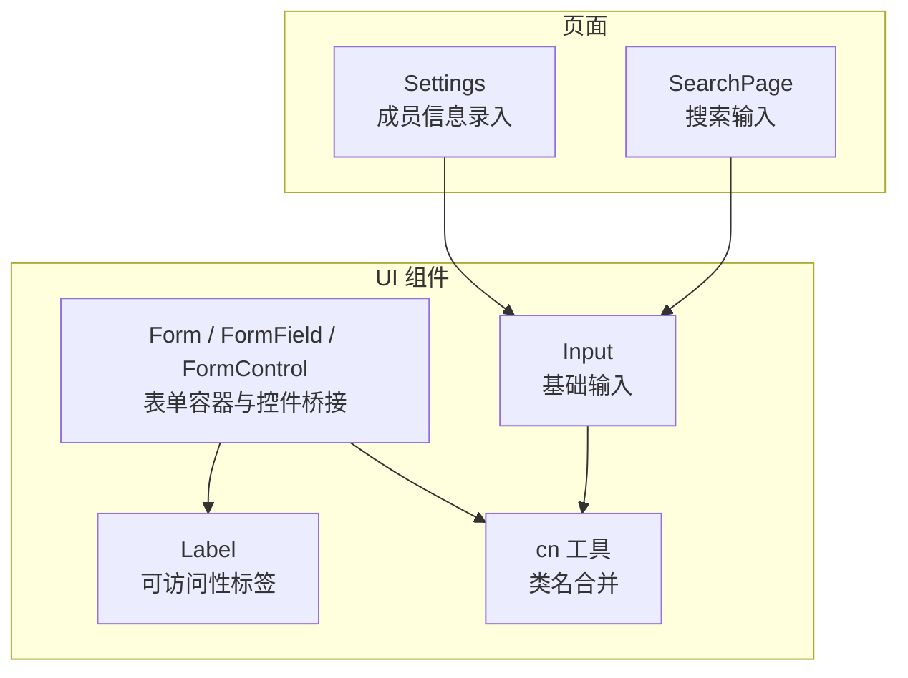
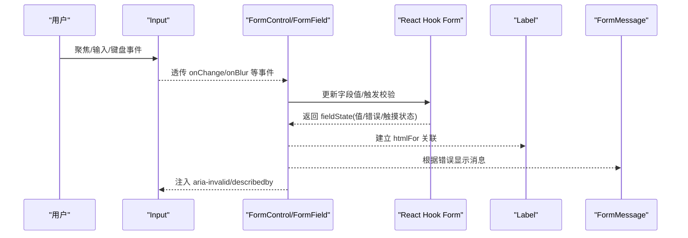
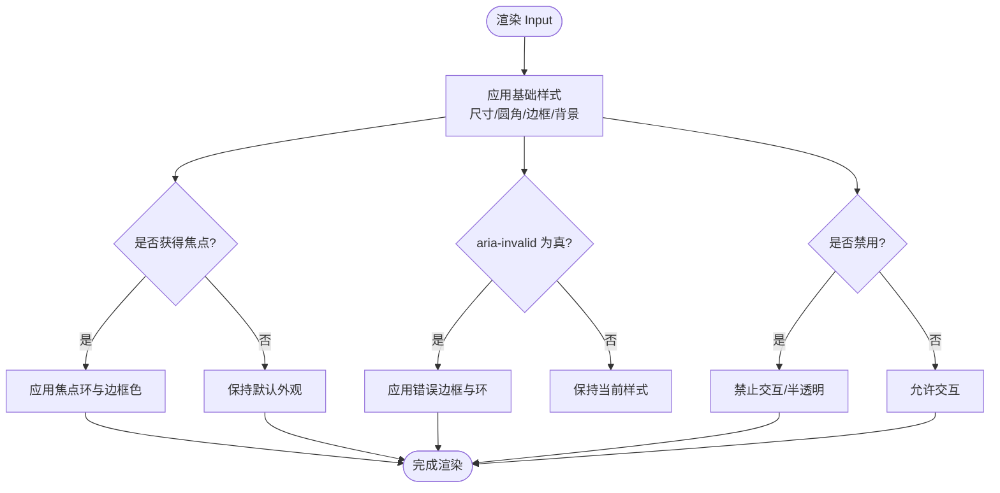
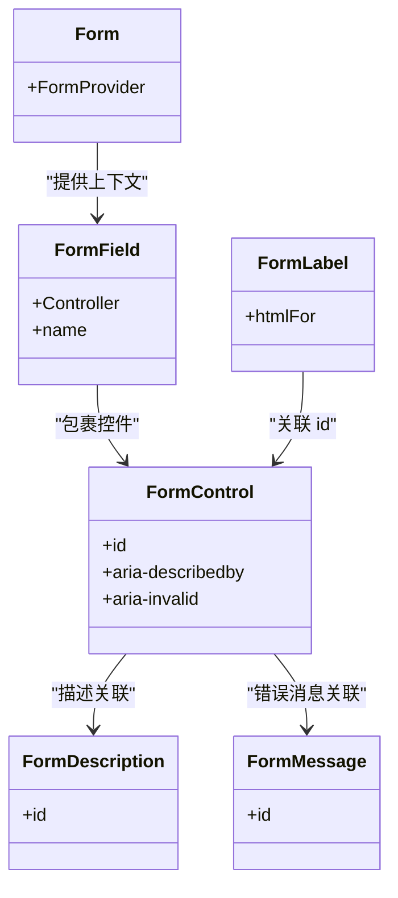
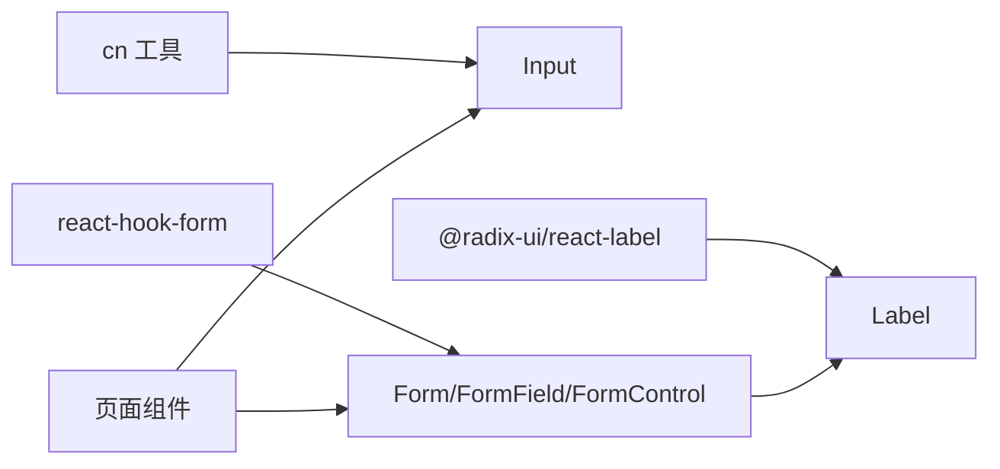

# Input输入框组件

<cite>
**本文引用的文件**
- [input.tsx](file://figma-ui/src/app/components/ui/input.tsx)
- [form.tsx](file://figma-ui/src/app/components/ui/form.tsx)
- [label.tsx](file://figma-ui/src/app/components/ui/label.tsx)
- [utils.ts](file://figma-ui/src/app/components/ui/utils.ts)
- [SearchPage.tsx](file://figma-ui/src/app/pages/SearchPage.tsx)
- [Settings.tsx](file://figma-ui/src/app/pages/Settings.tsx)
</cite>

## 目录
1. [简介](#简介)
2. [项目结构](#项目结构)
3. [核心组件](#核心组件)
4. [架构总览](#架构总览)
5. [详细组件分析](#详细组件分析)
6. [依赖关系分析](#依赖关系分析)
7. [性能考量](#性能考量)
8. [故障排查指南](#故障排查指南)
9. [结论](#结论)
10. [附录：使用示例与最佳实践](#附录使用示例与最佳实践)

## 简介
本组件文档围绕医案通医疗档案网站中的 Input 输入框组件，系统阐述其作为原生 HTML input 的高级封装能力，包括类型支持、验证状态管理、焦点处理与键盘事件响应；并详细说明与 React Hook Form 的集成方式（表单绑定、实时验证、错误提示）。同时覆盖无障碍访问特性（ARIA 标签、屏幕阅读器支持与键盘导航）、Props 接口规范、样式定制选项与响应式适配。文末提供在用户注册、搜索过滤、数据录入等场景下的具体用法指引与最佳实践。

## 项目结构
Input 组件位于 UI 基础组件层，配合表单容器组件与标签组件共同构成可复用的表单体系。页面层通过原生 input 或结合表单组件完成交互。

图表来源
- [input.tsx:1-22](file://figma-ui/src/app/components/ui/input.tsx#L1-L22)
- [form.tsx:1-169](file://figma-ui/src/app/components/ui/form.tsx#L1-L169)
- [label.tsx:1-25](file://figma-ui/src/app/components/ui/label.tsx#L1-L25)
- [utils.ts:1-7](file://figma-ui/src/app/components/ui/utils.ts#L1-L7)
- [SearchPage.tsx:73-112](file://figma-ui/src/app/pages/SearchPage.tsx#L73-L112)
- [Settings.tsx:246-293](file://figma-ui/src/app/pages/Settings.tsx#L246-L293)

章节来源
- [input.tsx:1-22](file://figma-ui/src/app/components/ui/input.tsx#L1-L22)
- [form.tsx:1-169](file://figma-ui/src/app/components/ui/form.tsx#L1-L169)
- [label.tsx:1-25](file://figma-ui/src/app/components/ui/label.tsx#L1-L25)
- [utils.ts:1-7](file://figma-ui/src/app/components/ui/utils.ts#L1-L7)
- [SearchPage.tsx:73-112](file://figma-ui/src/app/pages/SearchPage.tsx#L73-L112)
- [Settings.tsx:246-293](file://figma-ui/src/app/pages/Settings.tsx#L246-L293)

## 核心组件
- Input：对原生 input 的轻量封装，统一样式、焦点态、禁用态与无效态视觉反馈，透传所有原生属性。
- Form/FormField/FormControl/FormLabel/FormDescription/FormMessage：基于 Radix 与 React Hook Form 的表单组合，提供字段上下文、Aria 关联与错误消息展示。
- Label：可访问性友好的标签组件，可与表单控件联动。
- cn：类名合并工具，用于 Tailwind 类名的安全拼接与覆盖。

章节来源
- [input.tsx:1-22](file://figma-ui/src/app/components/ui/input.tsx#L1-L22)
- [form.tsx:1-169](file://figma-ui/src/app/components/ui/form.tsx#L1-L169)
- [label.tsx:1-25](file://figma-ui/src/app/components/ui/label.tsx#L1-L25)
- [utils.ts:1-7](file://figma-ui/src/app/components/ui/utils.ts#L1-L7)

## 架构总览
Input 组件负责渲染与样式，表单组件负责状态与可访问性绑定，页面组件负责业务逻辑与数据流。三者协作实现“输入—验证—反馈”的闭环。

图表来源
- [form.tsx:45-124](file://figma-ui/src/app/components/ui/form.tsx#L45-L124)
- [input.tsx:5-17](file://figma-ui/src/app/components/ui/input.tsx#L5-L17)

## 详细组件分析

### Input 组件
- 类型支持：通过原生 type 属性支持 text、email、password、number、tel 等所有浏览器支持的输入类型。
- 验证状态管理：当与表单组件集成时，通过 FormControl 的 aria-invalid 将错误状态映射到 Input，从而触发无效态样式。
- 焦点处理：内置 focus-visible 边框与环状高亮，确保键盘导航可见性。
- 键盘事件响应：透传所有原生键盘事件（如 onKeyDown），便于扩展快捷键或回车提交等行为。
- 禁用态：disabled 时不可交互且半透明。
- 样式定制：通过 className 追加或覆盖默认样式；内部使用 cn 工具进行类名合并。

图表来源
- [input.tsx:5-17](file://figma-ui/src/app/components/ui/input.tsx#L5-L17)

章节来源
- [input.tsx:5-17](file://figma-ui/src/app/components/ui/input.tsx#L5-L17)

### 表单集成（React Hook Form）
- 表单容器：FormProvider 提供表单上下文。
- 字段容器：FormField 包装 Controller，将字段名暴露给 useFormField。
- 控件桥接：FormControl 通过 Slot 透传 props，自动设置 id、aria-describedby、aria-invalid，并与描述/消息元素关联。
- 标签关联：FormLabel 通过 htmlFor 指向控件 id，提升可访问性。
- 描述与消息：FormDescription 提供辅助说明，FormMessage 显示错误或自定义消息。
- 状态获取：useFormField 从 useFormContext 中读取字段状态，包含值、错误、触摸状态等。

图表来源
- [form.tsx:19-169](file://figma-ui/src/app/components/ui/form.tsx#L19-L169)

章节来源
- [form.tsx:19-169](file://figma-ui/src/app/components/ui/form.tsx#L19-L169)

### 可访问性（无障碍）
- ARIA 属性：
  - aria-invalid：当字段存在错误时由 FormControl 设置为 true，Input 据此呈现无效态。
  - aria-describedby：将控件与描述/消息元素关联，屏幕阅读器会朗读说明与错误信息。
- 标签关联：FormLabel 的 htmlFor 指向控件 id，点击标签即可聚焦输入框。
- 键盘导航：Input 的 focus-visible 样式确保键盘操作可见；Tab/Shift+Tab 顺序遵循 DOM 顺序。
- 语义化：使用原生 input 保证浏览器与辅助技术兼容性。

章节来源
- [form.tsx:90-124](file://figma-ui/src/app/components/ui/form.tsx#L90-L124)
- [input.tsx:5-17](file://figma-ui/src/app/components/ui/input.tsx#L5-L17)

### Props 接口规范（Input）
- 继承自原生 input 的所有属性（type、value、placeholder、onChange、onKeyDown、disabled、className 等）。
- 推荐属性
  - type：文本、邮箱、密码、数字、电话等。
  - placeholder：占位提示。
  - disabled：禁用状态。
  - className：样式覆盖。
  - onChange：值变化回调。
  - onBlur/onFocus：焦点事件。
  - onKeyDown：键盘事件（如回车提交、方向键控制）。
  - autoComplete：自动填充策略。
  - required/maxLength/minLength/step 等：HTML 原生约束。
- 与表单集成时，建议通过 FormControl 包裹并使用 React Hook Form 的 Controller 绑定字段。

章节来源
- [input.tsx:5-17](file://figma-ui/src/app/components/ui/input.tsx#L5-L17)
- [form.tsx:107-124](file://figma-ui/src/app/components/ui/form.tsx#L107-L124)

### 样式定制与响应式
- 基础样式：高度、圆角、边框、内边距、字体大小、背景、过渡动画。
- 焦点态：focus-visible 边框与环状高亮，增强键盘可达性。
- 无效态：aria-invalid 驱动的错误边框与环颜色。
- 禁用态：pointer-events 禁用与透明度降低。
- 响应式：移动端与桌面端字号差异（md:text-sm），宽度自适应 w-full。
- 主题兼容：使用 CSS 变量（如 border-input、ring-ring）以适配主题切换。

章节来源
- [input.tsx:10-15](file://figma-ui/src/app/components/ui/input.tsx#L10-L15)

## 依赖关系分析
- Input 依赖 cn 工具进行类名合并，确保样式优先级正确。
- 表单组件依赖 Radix Label 与 React Hook Form，提供可访问性与状态管理。
- 页面层直接使用原生 input 或通过表单组件组合，形成“页面—表单—控件”的清晰分层。

图表来源
- [utils.ts:1-7](file://figma-ui/src/app/components/ui/utils.ts#L1-L7)
- [form.tsx:1-18](file://figma-ui/src/app/components/ui/form.tsx#L1-L18)
- [input.tsx:1-4](file://figma-ui/src/app/components/ui/input.tsx#L1-L4)

章节来源
- [utils.ts:1-7](file://figma-ui/src/app/components/ui/utils.ts#L1-L7)
- [form.tsx:1-18](file://figma-ui/src/app/components/ui/form.tsx#L1-L18)
- [input.tsx:1-4](file://figma-ui/src/app/components/ui/input.tsx#L1-L4)

## 性能考量
- 最小重渲染：Input 本身无状态，仅做样式与属性透传，避免额外开销。
- 表单状态集中：通过 React Hook Form 统一管理字段状态，减少重复计算。
- 类名合并：使用 cn 工具合并类名，避免不必要的样式冲突与重绘。
- 事件优化：在复杂场景中可使用防抖/节流处理高频输入事件（如搜索）。

[本节为通用指导，不直接分析具体文件]

## 故障排查指南
- 无法聚焦或键盘不可见：检查是否设置了 outline-hidden 或移除了 focus-visible 样式；确认未覆盖焦点样式。
- 错误提示不显示：确认 FormControl 已包裹输入框，且 FormMessage 正确渲染；检查 React Hook Form 是否正确绑定字段并触发校验。
- 标签无法关联：确保 FormLabel 的 htmlFor 与控件 id 一致（由表单组件自动生成）。
- 样式异常：检查 className 覆盖顺序与主题变量是否生效；必要时使用开发者工具查看最终计算的类名。

章节来源
- [form.tsx:107-157](file://figma-ui/src/app/components/ui/form.tsx#L107-L157)
- [input.tsx:10-15](file://figma-ui/src/app/components/ui/input.tsx#L10-L15)

## 结论
Input 组件以原生 input 为基础，提供一致的样式与可访问性保障；配合表单组件与 React Hook Form，可实现健壮的表单绑定、实时验证与错误提示。通过合理的 Props 设计与样式策略，既能满足多样化业务场景，又能保证跨设备的一致体验。

[本节为总结性内容，不直接分析具体文件]

## 附录：使用示例与最佳实践

### 场景一：搜索过滤（页面级原生 input）
- 使用原生 input 绑定关键词，监听 onChange 实时更新过滤结果。
- 建议增加清除按钮与空状态提示，提升可用性。
- 参考路径
  - [SearchPage.tsx:73-112](file://figma-ui/src/app/pages/SearchPage.tsx#L73-L112)

章节来源
- [SearchPage.tsx:73-112](file://figma-ui/src/app/pages/SearchPage.tsx#L73-L112)

### 场景二：数据录入（表单组件 + Input）
- 使用 Form 包裹表单，FormField 绑定字段，FormControl 包裹 Input，FormLabel 提供可读标签，FormMessage 显示错误。
- 通过 React Hook Form 的 validate 或 schema 校验实现实时验证。
- 参考路径
  - [form.tsx:19-169](file://figma-ui/src/app/components/ui/form.tsx#L19-L169)
  - [input.tsx:5-17](file://figma-ui/src/app/components/ui/input.tsx#L5-L17)

章节来源
- [form.tsx:19-169](file://figma-ui/src/app/components/ui/form.tsx#L19-L169)
- [input.tsx:5-17](file://figma-ui/src/app/components/ui/input.tsx#L5-L17)

### 场景三：用户注册（表单组件 + Input）
- 使用 email/password/number 等类型，结合 required、minLength、pattern 等约束。
- 利用 FormMessage 展示即时错误，提升用户体验。
- 参考路径
  - [form.tsx:90-157](file://figma-ui/src/app/components/ui/form.tsx#L90-L157)
  - [input.tsx:5-17](file://figma-ui/src/app/components/ui/input.tsx#L5-L17)

章节来源
- [form.tsx:90-157](file://figma-ui/src/app/components/ui/form.tsx#L90-L157)
- [input.tsx:5-17](file://figma-ui/src/app/components/ui/input.tsx#L5-L17)

### 场景四：简单文本录入（页面级原生 input）
- 适用于快速编辑或临时输入，可直接使用原生 input 并添加合适的 placeholder 与样式。
- 参考路径
  - [Settings.tsx:246-293](file://figma-ui/src/app/pages/Settings.tsx#L246-L293)

章节来源
- [Settings.tsx:246-293](file://figma-ui/src/app/pages/Settings.tsx#L246-L293)

### 最佳实践清单
- 始终为输入框提供明确的 Label 或 aria-label。
- 使用表单组件统一管理状态与校验，避免分散的状态管理。
- 对高频输入（如搜索）采用防抖/节流优化性能。
- 充分利用 aria-invalid 与 FormMessage 提供清晰的错误反馈。
- 保持键盘可达性：确保 Tab 顺序合理、焦点可见、Enter/Space 行为符合预期。
- 通过 className 与主题变量进行样式定制，避免硬编码颜色与尺寸。

[本节为通用指导，不直接分析具体文件]