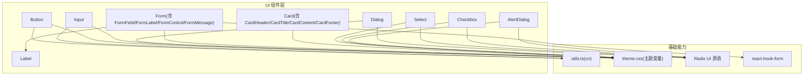
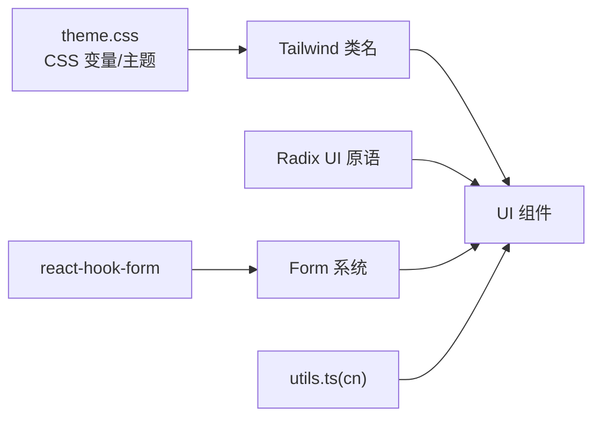
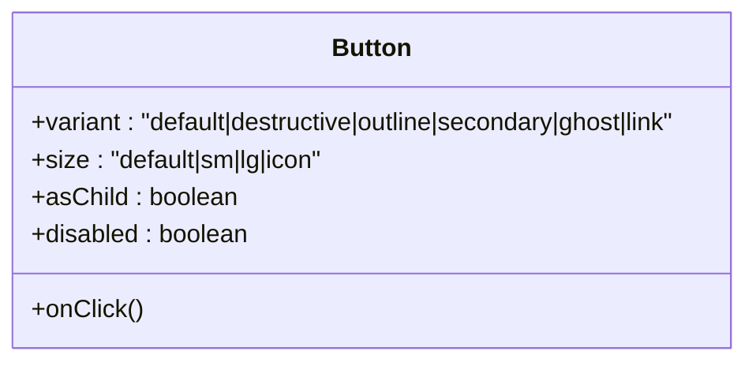
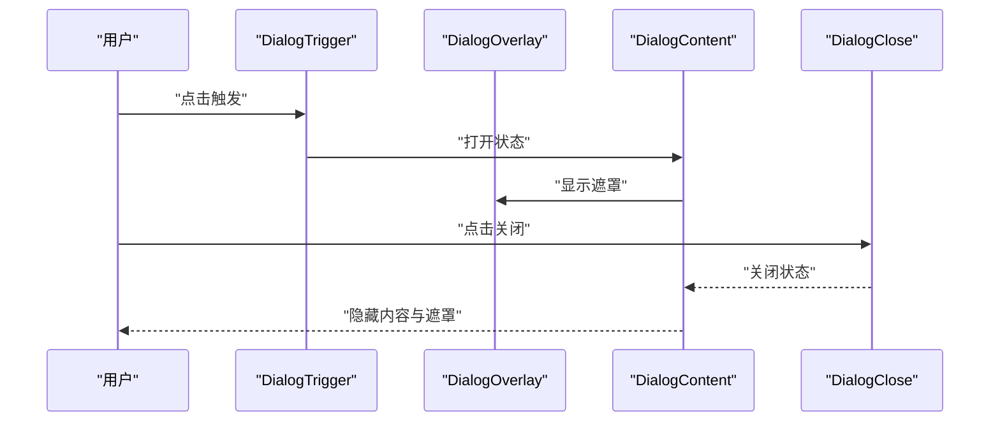
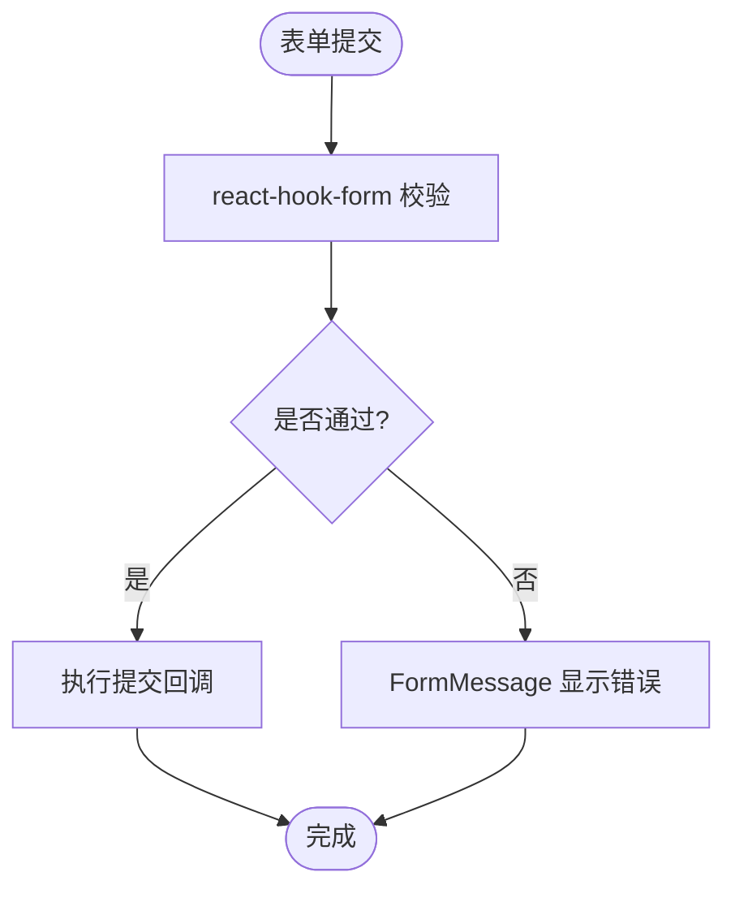
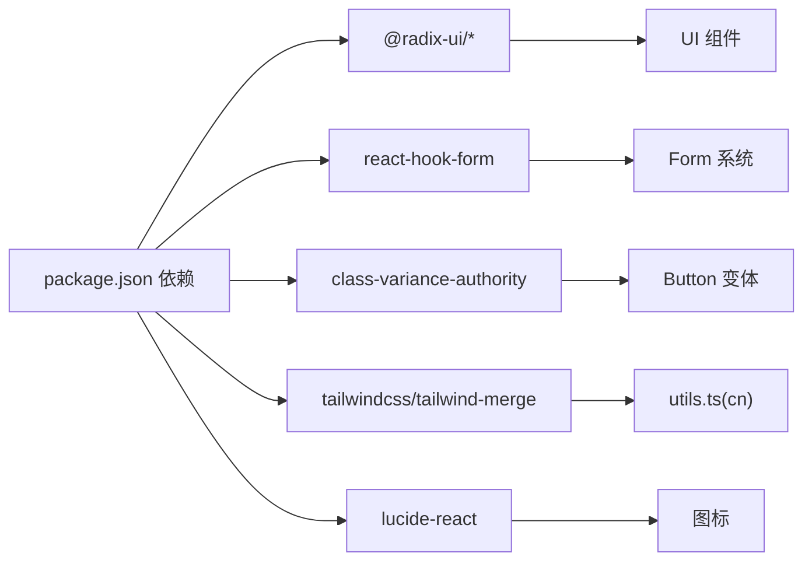

# 基础UI组件

<cite>
**本文引用的文件**
- [button.tsx](file://figma-ui/src/app/components/ui/button.tsx)
- [input.tsx](file://figma-ui/src/app/components/ui/input.tsx)
- [dialog.tsx](file://figma-ui/src/app/components/ui/dialog.tsx)
- [form.tsx](file://figma-ui/src/app/components/ui/form.tsx)
- [card.tsx](file://figma-ui/src/app/components/ui/card.tsx)
- [label.tsx](file://figma-ui/src/app/components/ui/label.tsx)
- [checkbox.tsx](file://figma-ui/src/app/components/ui/checkbox.tsx)
- [select.tsx](file://figma-ui/src/app/components/ui/select.tsx)
- [alert-dialog.tsx](file://figma-ui/src/app/components/ui/alert-dialog.tsx)
- [utils.ts](file://figma-ui/src/app/components/ui/utils.ts)
- [theme.css](file://figma-ui/src/styles/theme.css)
- [package.json](file://figma-ui/package.json)
</cite>

## 目录
1. [简介](#简介)
2. [项目结构](#项目结构)
3. [核心组件](#核心组件)
4. [架构总览](#架构总览)
5. [详细组件分析](#详细组件分析)
6. [依赖关系分析](#依赖关系分析)
7. [性能与可访问性](#性能与可访问性)
8. [主题与响应式](#主题与响应式)
9. [组合使用模式与示例](#组合使用模式与示例)
10. [故障排查](#故障排查)
11. [结论](#结论)

## 简介
本文件为医案通医疗档案网站的基础UI组件文档，聚焦基于 Radix UI 封装的原子化组件设计模式。内容覆盖 Button、Input、Dialog、Form、Card 等核心组件的实现原理、Props 接口规范、事件处理机制、样式定制选项与可访问性支持；并提供组合使用模式、主题适配方案与响应式设计实现，以及表单验证、模态框交互、卡片布局等场景的实践指导。

## 项目结构
- 组件位于 figma-ui/src/app/components/ui，采用“按功能拆分”的组织方式，每个组件独立文件，便于复用与维护。
- 样式通过 Tailwind CSS + class-variance-authority（cva）进行变体管理，统一通过 cn 工具合并类名。
- 主题变量集中在 theme.css，提供明暗主题与品牌色体系。
- 依赖管理在 package.json，包含 Radix UI 系列、react-hook-form、Tailwind 等关键库。

图表来源
- [button.tsx:1-59](file://figma-ui/src/app/components/ui/button.tsx#L1-L59)
- [input.tsx:1-22](file://figma-ui/src/app/components/ui/input.tsx#L1-L22)
- [dialog.tsx:1-136](file://figma-ui/src/app/components/ui/dialog.tsx#L1-L136)
- [form.tsx:1-169](file://figma-ui/src/app/components/ui/form.tsx#L1-L169)
- [card.tsx:1-93](file://figma-ui/src/app/components/ui/card.tsx#L1-L93)
- [label.tsx:1-25](file://figma-ui/src/app/components/ui/label.tsx#L1-L25)
- [select.tsx:1-190](file://figma-ui/src/app/components/ui/select.tsx#L1-L190)
- [checkbox.tsx:1-33](file://figma-ui/src/app/components/ui/checkbox.tsx#L1-L33)
- [alert-dialog.tsx:1-158](file://figma-ui/src/app/components/ui/alert-dialog.tsx#L1-L158)
- [utils.ts:1-7](file://figma-ui/src/app/components/ui/utils.ts#L1-L7)
- [theme.css:1-218](file://figma-ui/src/styles/theme.css#L1-L218)

章节来源
- [package.json:14-75](file://figma-ui/package.json#L14-L75)
- [theme.css:1-218](file://figma-ui/src/styles/theme.css#L1-L218)

## 核心组件
本节概述各组件的职责与设计要点：
- Button：基于 cva 的多变体按钮，支持尺寸、风格、图标对齐、禁用态与焦点环。
- Input：标准输入控件，内置占位符、禁用态、错误态与焦点环。
- Dialog：基于 Radix Dialog 的弹窗容器，含 Overlay、Content、Header/Footer、标题与描述，具备动画与可访问性。
- Form：基于 react-hook-form 的表单系统，提供 FormProvider、FormField、FormItem、FormLabel、FormControl、FormDescription、FormMessage，自动关联 ID 与 ARIA 属性。
- Card：卡片容器及语义化子区域，适合信息展示与操作入口。
- Label：可访问性友好的标签，支持禁用态与联动。
- Select：下拉选择器，含触发器、内容面板、滚动按钮与分隔项。
- Checkbox：复选框，带选中指示与状态样式。
- AlertDialog：确认对话框，结合 Button 变体提供动作与取消按钮。

章节来源
- [button.tsx:7-58](file://figma-ui/src/app/components/ui/button.tsx#L7-L58)
- [input.tsx:5-19](file://figma-ui/src/app/components/ui/input.tsx#L5-L19)
- [dialog.tsx:9-135](file://figma-ui/src/app/components/ui/dialog.tsx#L9-L135)
- [form.tsx:19-168](file://figma-ui/src/app/components/ui/form.tsx#L19-L168)
- [card.tsx:5-92](file://figma-ui/src/app/components/ui/card.tsx#L5-L92)
- [label.tsx:8-24](file://figma-ui/src/app/components/ui/label.tsx#L8-L24)
- [select.tsx:13-189](file://figma-ui/src/app/components/ui/select.tsx#L13-L189)
- [checkbox.tsx:9-32](file://figma-ui/src/app/components/ui/checkbox.tsx#L9-L32)
- [alert-dialog.tsx:9-157](file://figma-ui/src/app/components/ui/alert-dialog.tsx#L9-L157)

## 架构总览
组件以“原子化 + 组合”的方式构建：
- 样式层：theme.css 定义 CSS 变量，Tailwind 通过 @theme 映射到 color/radius 等设计令牌；cn 工具负责类名合并与冲突解决。
- 行为层：Radix UI 提供无样式、高可访问性的底层原语；react-hook-form 提供表单状态与校验。
- 组件层：业务组件仅关注 UI 结构与交互细节，不耦合具体样式与第三方逻辑。

图表来源
- [theme.css:95-140](file://figma-ui/src/styles/theme.css#L95-L140)
- [utils.ts:1-7](file://figma-ui/src/app/components/ui/utils.ts#L1-L7)
- [form.tsx:1-169](file://figma-ui/src/app/components/ui/form.tsx#L1-L169)

## 详细组件分析

### Button
- 职责：提供统一的按钮外观与交互，支持多种变体与尺寸，兼容 asChild 透传。
- Props 规范：
  - 继承原生 button 所有属性（如 onClick、disabled、type 等）。
  - variant：default、destructive、outline、secondary、ghost、link。
  - size：default、sm、lg、icon。
  - asChild：布尔值，决定是否使用 Slot 渲染为任意元素。
- 事件处理：透传原生事件；禁用态时 pointer-events 关闭并降低透明度。
- 样式定制：通过 cva 变体与 className 叠加；支持 focus-visible 与 aria-invalid 状态样式。
- 可访问性：保留原生语义，focus-visible 提供可见焦点环；禁用态不可聚焦。

图表来源
- [button.tsx:7-58](file://figma-ui/src/app/components/ui/button.tsx#L7-L58)

章节来源
- [button.tsx:7-58](file://figma-ui/src/app/components/ui/button.tsx#L7-L58)

### Input
- 职责：标准文本输入控件，支持类型切换与错误态。
- Props 规范：
  - 继承原生 input 所有属性（type、value、onChange、placeholder、disabled 等）。
- 事件处理：透传原生事件；支持 file 类型时的自定义样式。
- 样式定制：默认圆角、边框、背景与 placeholder 颜色；focus-visible 与 aria-invalid 状态样式。
- 可访问性：保持原生语义；aria-invalid 用于错误提示联动。

章节来源
- [input.tsx:5-19](file://figma-ui/src/app/components/ui/input.tsx#L5-L19)

### Dialog
- 职责：可访问的模态对话框，包含触发器、遮罩、内容区、头部与底部、标题与描述。
- 组件拆分：
  - Dialog/DialogTrigger/DialogPortal/DialogClose：控制打开/关闭与挂载。
  - DialogOverlay：全屏遮罩，带淡入淡出动画。
  - DialogContent：居中内容容器，内置关闭按钮与动画。
  - DialogHeader/DialogFooter：布局容器，移动端纵向排列，桌面端横向。
  - DialogTitle/DialogDescription：语义化标题与说明。
- 事件处理：透传 Radix 事件；关闭按钮调用 Close 处理器。
- 样式定制：通过 className 扩展；支持 data-state 动画。
- 可访问性：自动焦点管理、Esc 关闭、屏幕阅读器友好。

图表来源
- [dialog.tsx:9-135](file://figma-ui/src/app/components/ui/dialog.tsx#L9-L135)

章节来源
- [dialog.tsx:9-135](file://figma-ui/src/app/components/ui/dialog.tsx#L9-L135)

### Form（基于 react-hook-form）
- 职责：提供表单上下文、字段绑定、校验消息与无障碍关联。
- 组件拆分：
  - Form：FormProvider，包裹整个表单。
  - FormField：绑定单个字段，内部使用 Controller。
  - FormItem：字段容器，生成唯一 id。
  - FormLabel：标签，关联 formItemId。
  - FormControl：控件包装，设置 id、aria-describedby、aria-invalid。
  - FormDescription：辅助说明。
  - FormMessage：错误消息，仅在 error 存在时渲染。
- 数据流：useFormField 从上下文获取字段名与状态，结合 useFormState 与 getFieldState 计算校验结果。
- 事件处理：由 react-hook-form 统一管理 onChange/onBlur 等。
- 样式定制：通过 className 与 data-error 状态样式。
- 可访问性：id/for 关联、aria-describedby 与 aria-invalid 提升读屏体验。

图表来源
- [form.tsx:19-168](file://figma-ui/src/app/components/ui/form.tsx#L19-L168)

章节来源
- [form.tsx:19-168](file://figma-ui/src/app/components/ui/form.tsx#L19-L168)

### Card
- 职责：信息卡片容器，提供语义化的 Header/Title/Description/Content/Footer/Action 区域。
- 特点：栅格布局与间距预设，便于组合不同内容块。
- 可访问性：语义化标签（h4 作为标题），适合 SEO 与读屏。

章节来源
- [card.tsx:5-92](file://figma-ui/src/app/components/ui/card.tsx#L5-L92)

### Label
- 职责：可访问性标签，支持禁用态与 peer 联动。
- 可访问性：可与表单控件通过 htmlFor/id 关联。

章节来源
- [label.tsx:8-24](file://figma-ui/src/app/components/ui/label.tsx#L8-L24)

### Select
- 职责：下拉选择器，包含触发器、内容面板、滚动按钮、分隔项与标签。
- 特性：popper 定位、键盘导航、焦点环与错误态样式。

章节来源
- [select.tsx:13-189](file://figma-ui/src/app/components/ui/select.tsx#L13-L189)

### Checkbox
- 职责：复选框，带选中指示与状态样式。
- 可访问性：原生语义，支持禁用与错误态。

章节来源
- [checkbox.tsx:9-32](file://figma-ui/src/app/components/ui/checkbox.tsx#L9-L32)

### AlertDialog
- 职责：确认对话框，结合 Button 变体提供 Action/Cancel。
- 特性：与 Dialog 类似的结构，但强调确认/取消语义。

章节来源
- [alert-dialog.tsx:9-157](file://figma-ui/src/app/components/ui/alert-dialog.tsx#L9-L157)

## 依赖关系分析
- 样式依赖：
  - utils.ts 提供 cn，基于 clsx 与 tailwind-merge，确保类名合并无冲突。
  - theme.css 定义 CSS 变量并通过 @theme 暴露给 Tailwind。
- 运行时依赖：
  - Radix UI 提供无样式、可访问的原语（Dialog、Label、Select、Checkbox、Alert Dialog 等）。
  - react-hook-form 提供表单状态管理与校验。
  - class-variance-authority 提供按钮变体管理。
  - lucide-react 提供图标。

图表来源
- [package.json:14-75](file://figma-ui/package.json#L14-L75)
- [utils.ts:1-7](file://figma-ui/src/app/components/ui/utils.ts#L1-L7)
- [button.tsx:1-59](file://figma-ui/src/app/components/ui/button.tsx#L1-L59)
- [form.tsx:1-169](file://figma-ui/src/app/components/ui/form.tsx#L1-L169)

章节来源
- [package.json:14-75](file://figma-ui/package.json#L14-L75)

## 性能与可访问性
- 性能优化建议：
  - 使用 React.memo 或 useMemo/useCallback 对复杂表单字段或列表项进行优化（当字段较多时）。
  - 避免在高频事件中创建新对象或函数；将校验规则与格式化函数提升到组件外。
  - 合理使用 Portal（Dialog/Select 已内置），减少重排重绘。
  - 图片与图标按需加载，避免阻塞首屏。
- 可访问性实践：
  - 所有交互元素支持键盘操作与焦点可见性（focus-visible）。
  - 表单控件通过 id/for 与 aria-describedby/aria-invalid 建立关联。
  - 模态框具备焦点捕获、Esc 关闭与屏幕阅读器提示。
  - 颜色对比度遵循主题变量，确保可读性。

[本节为通用指导，不直接分析具体文件]

## 主题与响应式
- 主题：
  - 通过 theme.css 定义 CSS 变量（背景、前景、主色、边框、圆角等），并在 @theme 中映射到 Tailwind 的设计令牌。
  - 支持 dark 模式，通过 .dark 选择器覆盖变量。
- 响应式：
  - 组件广泛使用 Tailwind 断点（如 sm:）与容器查询（@container）实现自适应布局。
  - Dialog/AlertDialog 在移动端纵向堆叠，桌面端横向排列。
  - Card 头部使用网格布局，根据 action 是否存在调整列数。

章节来源
- [theme.css:1-218](file://figma-ui/src/styles/theme.css#L1-L218)
- [dialog.tsx:75-96](file://figma-ui/src/app/components/ui/dialog.tsx#L75-L96)
- [card.tsx:18-29](file://figma-ui/src/app/components/ui/card.tsx#L18-L29)

## 组合使用模式与示例
以下为常见场景的组合方式与步骤指引（不包含代码片段，路径指向对应实现）：

- 表单验证（注册/登录）
  - 使用 Form 包裹表单，FormField 绑定字段，配合 react-hook-form 的 rules 进行校验。
  - 使用 FormLabel 与 FormControl 关联控件，FormMessage 显示错误信息。
  - 使用 Input/Select/Checkbox 作为控件，结合 disabled、aria-invalid 等状态。
  - 参考路径：
    - [form.tsx:19-168](file://figma-ui/src/app/components/ui/form.tsx#L19-L168)
    - [input.tsx:5-19](file://figma-ui/src/app/components/ui/input.tsx#L5-L19)
    - [select.tsx:13-189](file://figma-ui/src/app/components/ui/select.tsx#L13-L189)
    - [checkbox.tsx:9-32](file://figma-ui/src/app/components/ui/checkbox.tsx#L9-L32)

- 模态框交互（确认删除/查看详情）
  - 使用 DialogTrigger 触发，DialogContent 承载内容，DialogHeader/DialogTitle/DialogDescription 组织信息，DialogFooter 放置操作按钮。
  - 使用 Button 的 variant 区分主次操作（如 destructive 表示危险操作）。
  - 参考路径：
    - [dialog.tsx:9-135](file://figma-ui/src/app/components/ui/dialog.tsx#L9-L135)
    - [button.tsx:7-58](file://figma-ui/src/app/components/ui/button.tsx#L7-L58)

- 卡片布局（信息展示/功能入口）
  - 使用 Card 作为容器，CardHeader/CardTitle/CardDescription 展示标题与说明，CardContent 放置主体内容，CardFooter 放置操作按钮，CardAction 放置右侧操作。
  - 参考路径：
    - [card.tsx:5-92](file://figma-ui/src/app/components/ui/card.tsx#L5-L92)

- 下拉选择与分组
  - 使用 Select/SelectTrigger/SelectValue 展示当前值，SelectContent/SelectItem/SelectGroup/SelectSeparator 组织选项与分组。
  - 参考路径：
    - [select.tsx:13-189](file://figma-ui/src/app/components/ui/select.tsx#L13-L189)

- 确认对话框
  - 使用 AlertDialog/AlertDialogTrigger/AlertDialogContent/AlertDialogTitle/AlertDialogDescription/AlertDialogAction/AlertDialogCancel 构建确认流程。
  - 参考路径：
    - [alert-dialog.tsx:9-157](file://figma-ui/src/app/components/ui/alert-dialog.tsx#L9-L157)

[本节为概念性指导，不直接分析具体文件]

## 故障排查
- 表单字段未绑定或校验不生效
  - 检查是否使用 FormField 包裹，并确保 name 正确；确认 Form 已用 FormProvider 包裹。
  - 参考路径：[form.tsx:32-43](file://figma-ui/src/app/components/ui/form.tsx#L32-L43)
- 错误消息不显示
  - 确认 FormMessage 在 FormItem 内且与 FormControl 关联；检查 error.message 是否存在。
  - 参考路径：[form.tsx:139-157](file://figma-ui/src/app/components/ui/form.tsx#L139-L157)
- 模态框无法关闭或焦点异常
  - 确认 DialogClose 被正确调用；检查是否阻止了默认行为；确保焦点在可聚焦元素上。
  - 参考路径：[dialog.tsx:27-31](file://figma-ui/src/app/components/ui/dialog.tsx#L27-L31)
- 按钮样式不生效或冲突
  - 检查 className 是否正确传入；确认 cn 工具未被覆盖；核对 variant/size 是否匹配。
  - 参考路径：[button.tsx:7-58](file://figma-ui/src/app/components/ui/button.tsx#L7-L58)
- 主题颜色不生效
  - 确认 theme.css 已引入；检查 dark 类是否应用；核对 CSS 变量名称是否与 Tailwind 令牌一致。
  - 参考路径：[theme.css:95-140](file://figma-ui/src/styles/theme.css#L95-L140)

章节来源
- [form.tsx:32-43](file://figma-ui/src/app/components/ui/form.tsx#L32-L43)
- [form.tsx:139-157](file://figma-ui/src/app/components/ui/form.tsx#L139-L157)
- [dialog.tsx:27-31](file://figma-ui/src/app/components/ui/dialog.tsx#L27-L31)
- [button.tsx:7-58](file://figma-ui/src/app/components/ui/button.tsx#L7-L58)
- [theme.css:95-140](file://figma-ui/src/styles/theme.css#L95-L140)

## 结论
本项目以 Radix UI 为基础，结合 Tailwind 与 react-hook-form，构建了高内聚、低耦合的原子化 UI 组件体系。通过统一的主题变量、可访问性保障与响应式策略，组件在不同场景下具备良好的可扩展性与一致性。建议在业务中优先使用这些基础组件，并通过组合满足复杂需求，同时遵循本文提供的最佳实践以确保质量与可维护性。