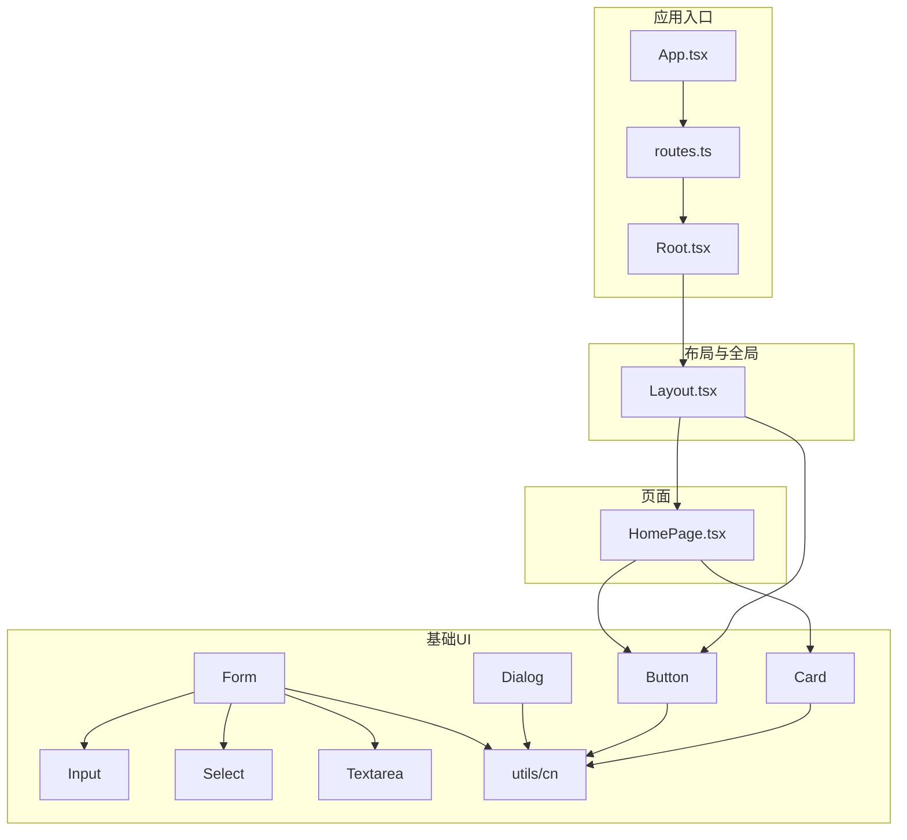
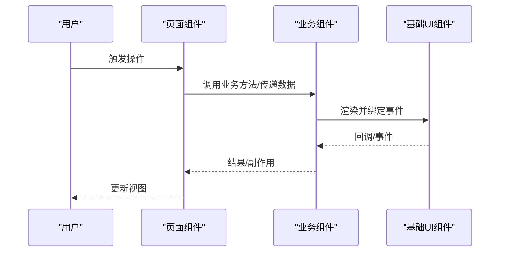
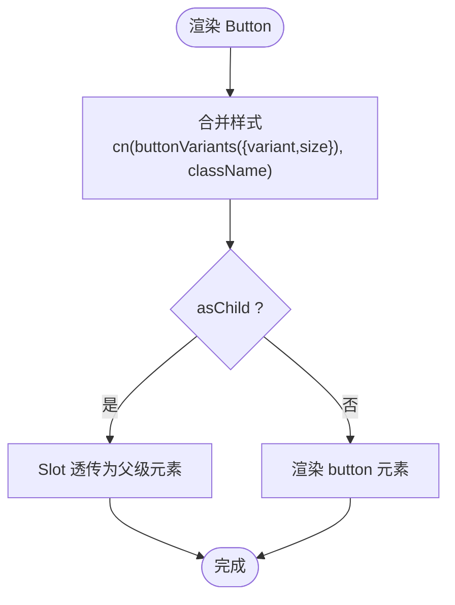
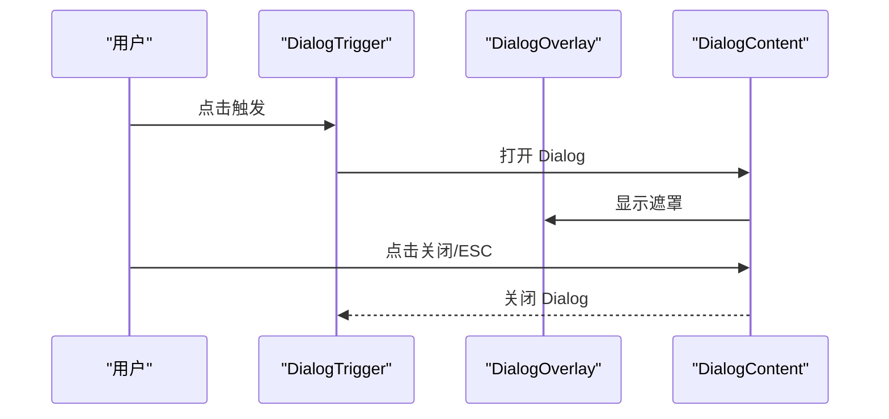
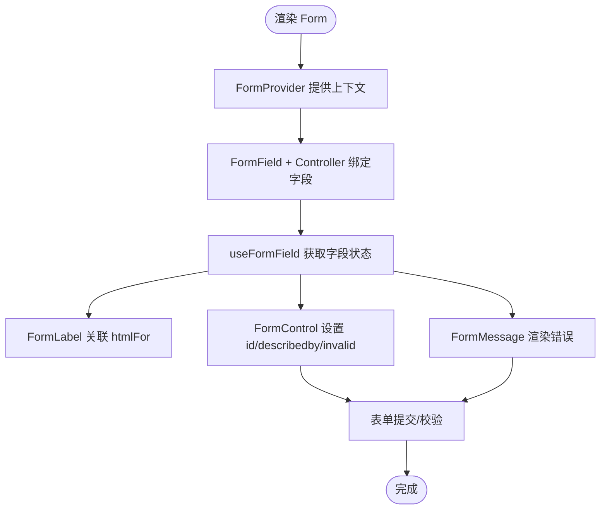
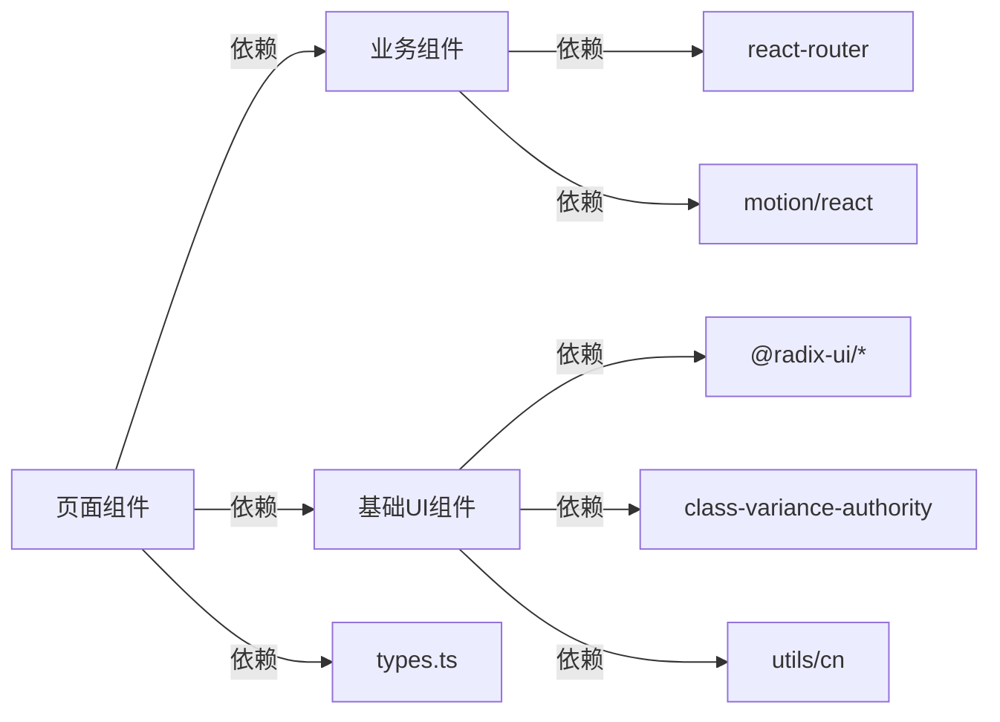

# 组件架构设计

<cite>
**本文引用的文件**
- [button.tsx](file://figma-ui/src/app/components/ui/button.tsx)
- [dialog.tsx](file://figma-ui/src/app/components/ui/dialog.tsx)
- [form.tsx](file://figma-ui/src/app/components/ui/form.tsx)
- [input.tsx](file://figma-ui/src/app/components/ui/input.tsx)
- [label.tsx](file://figma-ui/src/app/components/ui/label.tsx)
- [select.tsx](file://figma-ui/src/app/components/ui/select.tsx)
- [textarea.tsx](file://figma-ui/src/app/components/ui/textarea.tsx)
- [card.tsx](file://figma-ui/src/app/components/ui/card.tsx)
- [utils.ts](file://figma-ui/src/app/components/ui/utils.ts)
- [Layout.tsx](file://figma-ui/src/app/components/Layout.tsx)
- [Root.tsx](file://figma-ui/src/app/Root.tsx)
- [App.tsx](file://figma-ui/src/app/App.tsx)
- [routes.ts](file://figma-ui/src/app/routes.ts)
- [types.ts](file://figma-ui/src/app/types.ts)
- [HomePage.tsx](file://figma-ui/src/app/pages/HomePage.tsx)
</cite>

## 目录
1. [简介](#简介)
2. [项目结构](#项目结构)
3. [核心组件](#核心组件)
4. [架构总览](#架构总览)
5. [详细组件分析](#详细组件分析)
6. [依赖关系分析](#依赖关系分析)
7. [性能考量](#性能考量)
8. [故障排查指南](#故障排查指南)
9. [结论](#结论)
10. [附录](#附录)

## 简介
本文件为医案通医疗档案网站的组件架构设计文档，围绕“基础UI组件（基于 Radix UI 封装的业务无关组件）—业务组件（组合基础组件实现特定业务功能）—页面组件（完整的功能页面）”的三层架构模式展开。文档涵盖组件设计原则、Props 接口规范、事件处理机制、状态管理与生命周期、性能优化策略，以及测试与文档生成方案。通过 Button、Dialog、Form 等具体示例，说明如何以可复用、可维护的方式构建前端界面。

## 项目结构
本项目采用按职责分层的目录组织：
- 基础 UI 组件位于 components/ui，统一基于 Radix UI 进行无业务语义的封装，并通过 class-variance-authority 管理变体样式，使用统一的 cn 工具合并类名。
- 业务组件位于 components，如 Layout、BottomNav、LaunchNoticeProvider 等，负责页面级布局与全局交互。
- 页面组件位于 pages，承载具体业务视图与路由映射。
- 应用入口与路由在 App.tsx、Root.tsx、routes.ts 中定义，提供全局上下文与导航。
- 类型定义集中在 types.ts，确保跨层数据一致性。

图表来源
- [App.tsx:1-12](file://figma-ui/src/app/App.tsx#L1-L12)
- [Root.tsx:1-59](file://figma-ui/src/app/Root.tsx#L1-L59)
- [routes.ts:1-106](file://figma-ui/src/app/routes.ts#L1-L106)
- [Layout.tsx:1-251](file://figma-ui/src/app/components/Layout.tsx#L1-L251)
- [HomePage.tsx:1-276](file://figma-ui/src/app/pages/HomePage.tsx#L1-L276)
- [button.tsx:1-59](file://figma-ui/src/app/components/ui/button.tsx#L1-L59)
- [dialog.tsx:1-136](file://figma-ui/src/app/components/ui/dialog.tsx#L1-L136)
- [form.tsx:1-169](file://figma-ui/src/app/components/ui/form.tsx#L1-L169)
- [input.tsx:1-22](file://figma-ui/src/app/components/ui/input.tsx#L1-L22)
- [select.tsx:1-190](file://figma-ui/src/app/components/ui/select.tsx#L1-L190)
- [textarea.tsx:1-19](file://figma-ui/src/app/components/ui/textarea.tsx#L1-L19)
- [card.tsx:1-93](file://figma-ui/src/app/components/ui/card.tsx#L1-L93)
- [utils.ts:1-7](file://figma-ui/src/app/components/ui/utils.ts#L1-L7)

章节来源
- [App.tsx:1-12](file://figma-ui/src/app/App.tsx#L1-L12)
- [Root.tsx:1-59](file://figma-ui/src/app/Root.tsx#L1-L59)
- [routes.ts:1-106](file://figma-ui/src/app/routes.ts#L1-L106)
- [Layout.tsx:1-251](file://figma-ui/src/app/components/Layout.tsx#L1-L251)
- [HomePage.tsx:1-276](file://figma-ui/src/app/pages/HomePage.tsx#L1-L276)

## 核心组件
- 基础UI组件（ui 目录）
  - 目标：提供无业务语义、高内聚、可复用的原子能力；遵循无障碍与可访问性最佳实践。
  - 技术栈：Radix UI 作为行为与可访问性基座；class-variance-authority 管理变体；clsx + tailwind-merge 的 cn 工具统一样式合并。
  - 典型组件：Button、Dialog、Form、Input、Label、Select、Textarea、Card 等。
- 业务组件（components 目录）
  - 目标：组合基础组件完成页面级布局与全局交互（如 Layout、BottomNav、LaunchNoticeProvider）。
  - 关注点：路由集成、全局通知、响应式布局、滚动与菜单状态。
- 页面组件（pages 目录）
  - 目标：承载具体业务视图，组合业务组件与基础组件，编排数据流与用户操作。
  - 关注点：数据加载、视图切换、表单提交、列表展示与交互。

章节来源
- [button.tsx:1-59](file://figma-ui/src/app/components/ui/button.tsx#L1-L59)
- [dialog.tsx:1-136](file://figma-ui/src/app/components/ui/dialog.tsx#L1-L136)
- [form.tsx:1-169](file://figma-ui/src/app/components/ui/form.tsx#L1-L169)
- [input.tsx:1-22](file://figma-ui/src/app/components/ui/input.tsx#L1-L22)
- [label.tsx:1-25](file://figma-ui/src/app/components/ui/label.tsx#L1-L25)
- [select.tsx:1-190](file://figma-ui/src/app/components/ui/select.tsx#L1-L190)
- [textarea.tsx:1-19](file://figma-ui/src/app/components/ui/textarea.tsx#L1-L19)
- [card.tsx:1-93](file://figma-ui/src/app/components/ui/card.tsx#L1-L93)
- [Layout.tsx:1-251](file://figma-ui/src/app/components/Layout.tsx#L1-L251)
- [HomePage.tsx:1-276](file://figma-ui/src/app/pages/HomePage.tsx#L1-L276)

## 架构总览
三层组件架构的职责边界清晰：
- 基础UI组件：专注渲染与交互细节，不感知业务领域；通过 props 暴露最小必要能力，内部使用 Radix 保证可访问性与键盘交互。
- 业务组件：聚合多个基础组件，注入业务上下文（如路由、主题、通知），对外暴露简洁 API。
- 页面组件：编排业务组件与数据源，处理用户流程与状态流转。

图表来源
- [HomePage.tsx:1-276](file://figma-ui/src/app/pages/HomePage.tsx#L1-L276)
- [Layout.tsx:1-251](file://figma-ui/src/app/components/Layout.tsx#L1-L251)
- [button.tsx:1-59](file://figma-ui/src/app/components/ui/button.tsx#L1-L59)
- [dialog.tsx:1-136](file://figma-ui/src/app/components/ui/dialog.tsx#L1-L136)
- [form.tsx:1-169](file://figma-ui/src/app/components/ui/form.tsx#L1-L169)

## 详细组件分析

### 基础UI组件：Button
- 设计要点
  - 基于 Radix Slot 支持 asChild 透传，便于与路由或第三方元素无缝组合。
  - 使用 cva 管理 variant 与 size 变体，默认值集中配置，扩展性强。
  - 通过 cn 合并 className，支持外部覆盖与主题适配。
- Props 接口规范
  - 继承原生 button 属性，叠加 VariantProps（variant、size）、asChild 布尔开关。
- 事件处理
  - 透传所有事件处理器至底层元素，保持与原生一致的行为。
- 性能
  - 纯函数组件，无额外状态；样式计算轻量。
- 使用建议
  - 通过 variant 表达语义（默认、次要、危险、链接等），通过 size 控制尺寸；图标按钮使用 icon 尺寸。

图表来源
- [button.tsx:1-59](file://figma-ui/src/app/components/ui/button.tsx#L1-L59)
- [utils.ts:1-7](file://figma-ui/src/app/components/ui/utils.ts#L1-L7)

章节来源
- [button.tsx:1-59](file://figma-ui/src/app/components/ui/button.tsx#L1-L59)
- [utils.ts:1-7](file://figma-ui/src/app/components/ui/utils.ts#L1-L7)

### 基础UI组件：Dialog
- 设计要点
  - 基于 @radix-ui/react-dialog 封装 Root、Trigger、Portal、Overlay、Content、Header、Footer、Title、Description、Close 等子组件。
  - Content 内置关闭按钮与动画过渡，Overlay 提供遮罩与层级控制。
- Props 接口规范
  - 完全透传 Radix 对应组件的 props，保持最大灵活性。
- 事件处理
  - 由 Radix 管理打开/关闭、焦点陷阱、Esc 关闭等；业务侧可通过 onOpenChange 等回调处理。
- 可访问性
  - 自动处理 aria-*、焦点管理、屏幕阅读器提示。
- 使用建议
  - 将触发器与内容分离，避免重复渲染；复杂内容建议使用 Portal 挂载到 body。

图表来源
- [dialog.tsx:1-136](file://figma-ui/src/app/components/ui/dialog.tsx#L1-L136)

章节来源
- [dialog.tsx:1-136](file://figma-ui/src/app/components/ui/dialog.tsx#L1-L136)

### 基础UI组件：Form（基于 react-hook-form）
- 设计要点
  - 使用 FormProvider 包裹表单，FormField 结合 Controller 绑定字段；useFormField 提供字段状态与无障碍 ID。
  - FormItem/FormLabel/FormControl/FormDescription/FormMessage 形成一组语义化容器与描述。
- Props 接口规范
  - FormField 接受 react-hook-form 的 ControllerProps；其他子组件透传原生或 Label 的 props。
- 事件处理
  - 通过 react-hook-form 的 onChange/onBlur 等统一管理；错误信息通过 FormMessage 渲染。
- 可访问性
  - 自动关联 htmlFor、aria-describedby、aria-invalid，提升可访问性。
- 使用建议
  - 表单校验规则集中在 schema（如 zod），通过 useForm 注册；复杂输入使用 Select/Input/Textarea 组合。

图表来源
- [form.tsx:1-169](file://figma-ui/src/app/components/ui/form.tsx#L1-L169)
- [label.tsx:1-25](file://figma-ui/src/app/components/ui/label.tsx#L1-L25)

章节来源
- [form.tsx:1-169](file://figma-ui/src/app/components/ui/form.tsx#L1-L169)
- [label.tsx:1-25](file://figma-ui/src/app/components/ui/label.tsx#L1-L25)

### 基础UI组件：Input / Textarea / Select
- Input/Textarea
  - 统一样式与焦点环、禁用态、无效态；通过 cn 合并类名，支持自定义覆盖。
- Select
  - 基于 Radix Select，提供 Trigger、Content、Item、Group、Separator、Scroll 等子组件；支持 popper 定位与键盘导航。
- 使用建议
  - 与 Form 组合时，通过 Controller 绑定 value 与 onChange；Select 用于枚举选择场景。

章节来源
- [input.tsx:1-22](file://figma-ui/src/app/components/ui/input.tsx#L1-L22)
- [textarea.tsx:1-19](file://figma-ui/src/app/components/ui/textarea.tsx#L1-L19)
- [select.tsx:1-190](file://figma-ui/src/app/components/ui/select.tsx#L1-L190)

### 基础UI组件：Card
- 设计要点
  - Card 及其 Header/Content/Footer/Title/Description/Action 子组件，提供卡片式布局结构。
- 使用建议
  - 适合展示档案摘要、统计卡片、操作面板等；配合阴影与边框突出层次。

章节来源
- [card.tsx:1-93](file://figma-ui/src/app/components/ui/card.tsx#L1-L93)

### 业务组件：Layout（首页布局）
- 职责
  - 顶部导航、移动端菜单、滚动监听、底部页脚；整合 LaunchNotice 与 HomeSection 导航。
- 状态与生命周期
  - 使用 useState 管理滚动状态与菜单展开；useEffect 监听 scroll 事件并清理。
- 事件处理
  - 导航项点击调用 useHomeSectionNav 的 goToHomeSection；按钮触发 LaunchNotice。
- 性能
  - 仅必要的 DOM 监听与条件渲染；移动端菜单使用 AnimatePresence 平滑过渡。

章节来源
- [Layout.tsx:1-251](file://figma-ui/src/app/components/Layout.tsx#L1-L251)

### 页面组件：HomePage（首页）
- 职责
  - 展示档案概览、统计卡片、时间轴/分类视图切换；从 localStorage 加载成员与档案数据。
- 状态与生命周期
  - useEffect 初始化模拟数据并加载；根据当前成员过滤档案；本地存储变更同步。
- 事件处理
  - 视图切换、空状态引导上传、归档卡片跳转详情。
- 数据模型
  - 使用 types.ts 中的 Member、Archive、ArchiveType 等类型，保证数据结构一致。

章节来源
- [HomePage.tsx:1-276](file://figma-ui/src/app/pages/HomePage.tsx#L1-L276)
- [types.ts:1-95](file://figma-ui/src/app/types.ts#L1-L95)

### 应用入口与路由
- App.tsx
  - 提供全局 LaunchNoticeProvider，并挂载 RouterProvider。
- Root.tsx
  - 登录检查与成员数据加载；未登录重定向至登录页；提供 Outlet 上下文。
- routes.ts
  - 使用 createHashRouter 定义页面路由，包含受保护区域与独立页面。

章节来源
- [App.tsx:1-12](file://figma-ui/src/app/App.tsx#L1-L12)
- [Root.tsx:1-59](file://figma-ui/src/app/Root.tsx#L1-L59)
- [routes.ts:1-106](file://figma-ui/src/app/routes.ts#L1-L106)

## 依赖关系分析
- 基础UI组件依赖
  - Radix UI（行为与可访问性）
  - class-variance-authority（变体样式）
  - clsx + tailwind-merge（样式合并）
- 业务组件依赖
  - React Router（导航与上下文）
  - motion/react（动画）
  - lucide-react（图标）
- 页面组件依赖
  - 业务组件与基础UI组件
  - 类型定义（types.ts）
  - 本地存储（localStorage）

图表来源
- [button.tsx:1-59](file://figma-ui/src/app/components/ui/button.tsx#L1-L59)
- [dialog.tsx:1-136](file://figma-ui/src/app/components/ui/dialog.tsx#L1-L136)
- [form.tsx:1-169](file://figma-ui/src/app/components/ui/form.tsx#L1-L169)
- [Layout.tsx:1-251](file://figma-ui/src/app/components/Layout.tsx#L1-L251)
- [HomePage.tsx:1-276](file://figma-ui/src/app/pages/HomePage.tsx#L1-L276)
- [types.ts:1-95](file://figma-ui/src/app/types.ts#L1-L95)

章节来源
- [button.tsx:1-59](file://figma-ui/src/app/components/ui/button.tsx#L1-L59)
- [dialog.tsx:1-136](file://figma-ui/src/app/components/ui/dialog.tsx#L1-L136)
- [form.tsx:1-169](file://figma-ui/src/app/components/ui/form.tsx#L1-L169)
- [Layout.tsx:1-251](file://figma-ui/src/app/components/Layout.tsx#L1-L251)
- [HomePage.tsx:1-276](file://figma-ui/src/app/pages/HomePage.tsx#L1-L276)
- [types.ts:1-95](file://figma-ui/src/app/types.ts#L1-L95)

## 性能考量
- 组件粒度
  - 基础UI组件保持无状态与纯函数，减少重渲染；业务组件按需拆分，避免大组件。
- 样式与主题
  - 使用 cva 集中管理变体，避免重复样式；通过 cn 合并类名，减少冲突与冗余。
- 事件与监听
  - 合理清理事件监听（如 scroll），避免内存泄漏；移动端菜单使用条件渲染与动画库优化体验。
- 数据加载
  - 页面组件在 useEffect 中加载数据，必要时加入防抖/节流；对大数据列表考虑虚拟滚动与分页。
- 可访问性
  - 借助 Radix 的无障碍能力，减少手动实现成本；确保焦点顺序与键盘交互符合标准。

[本节为通用指导，无需特定文件引用]

## 故障排查指南
- 表单相关
  - 若出现“useFormField should be used within <FormField>”，请确认字段在 FormField 上下文中使用。
  - 检查 FormItem 是否提供唯一 id，确保 Label 与 FormControl 正确关联。
- 对话框相关
  - 若无法关闭或焦点异常，检查是否正确使用 Dialog.Trigger/Dialog.Close，并确保 Overlay/Content 层级正确。
- 路由与鉴权
  - 若进入页面被重定向至登录，检查 Root 中的登录状态判断逻辑与 localStorage 键名是否正确。
- 样式问题
  - 若样式未生效，检查 cn 是否正确合并；确认 Tailwind 配置与主题变量是否引入。

章节来源
- [form.tsx:1-169](file://figma-ui/src/app/components/ui/form.tsx#L1-L169)
- [dialog.tsx:1-136](file://figma-ui/src/app/components/ui/dialog.tsx#L1-L136)
- [Root.tsx:1-59](file://figma-ui/src/app/Root.tsx#L1-L59)
- [utils.ts:1-7](file://figma-ui/src/app/components/ui/utils.ts#L1-L7)

## 结论
本项目通过清晰的三层组件架构，实现了高内聚、低耦合的前端工程化体系。基础UI组件聚焦可复用与可访问性，业务组件负责布局与全局交互，页面组件承载业务逻辑与数据流。借助 Radix UI、cva、react-hook-form 等成熟生态，项目在易用性、可维护性与性能方面具备良好基础。后续可进一步引入单元测试与可视化文档，完善质量保障与团队协作效率。

[本节为总结，无需特定文件引用]

## 附录

### 组件设计原则
- 单一职责：每个组件只负责一个明确的能力。
- 可组合：通过 props 与 children 灵活组合，避免硬编码。
- 可访问性：优先使用 Radix 提供的无障碍能力。
- 可测试：组件尽量纯函数化，减少外部依赖，便于单测。
- 可扩展：通过变体系统与主题系统支持多风格。

[本节为通用指导，无需特定文件引用]

### Props 接口规范
- 命名：使用驼峰命名，语义清晰。
- 类型：优先使用 TypeScript 类型与泛型约束。
- 默认值：为可选 props 提供合理的默认值。
- 透传：对于基础UI组件，透传原生或底层组件 props，保持兼容性。

[本节为通用指导，无需特定文件引用]

### 事件处理机制
- 基础UI组件：透传事件处理器，保持与原生一致。
- 业务组件：在合适的时机订阅/取消订阅事件，避免泄漏。
- 页面组件：集中处理用户操作，调用业务组件或 API。

[本节为通用指导，无需特定文件引用]

### 状态管理与生命周期
- 局部状态：使用 useState/useReducer 管理组件内状态。
- 副作用：使用 useEffect 管理副作用，注意清理。
- 全局状态：通过 Provider/Context 共享全局上下文（如 LaunchNotice）。

[本节为通用指导，无需特定文件引用]

### 性能优化策略
- 组件拆分：将大组件拆分为小颗粒组件，减少重渲染范围。
- 样式优化：使用 cva 与 cn 合并类名，避免重复计算。
- 数据优化：分页、懒加载、缓存；避免不必要的重新计算。
- 动画优化：合理使用 motion，避免过度动画影响性能。

[本节为通用指导，无需特定文件引用]

### 组件测试策略
- 单元覆盖：对基础UI组件进行快照与交互测试（如点击、键盘）。
- 集成测试：对业务组件与页面组件进行端到端流程测试。
- 可访问性测试：验证焦点顺序、屏幕阅读器输出。
- 工具建议：Vitest/Jest + Testing Library；Playwright/Cypress 做 E2E。

[本节为通用指导，无需特定文件引用]

### 文档生成方案
- 代码注释：使用 JSDoc/TypeScript 注释描述组件用途、props、事件。
- 自动化文档：使用 Storybook 或类似工具生成组件故事与示例。
- 版本管理：在 README 或 docs 目录维护变更记录与使用指南。

[本节为通用指导，无需特定文件引用]