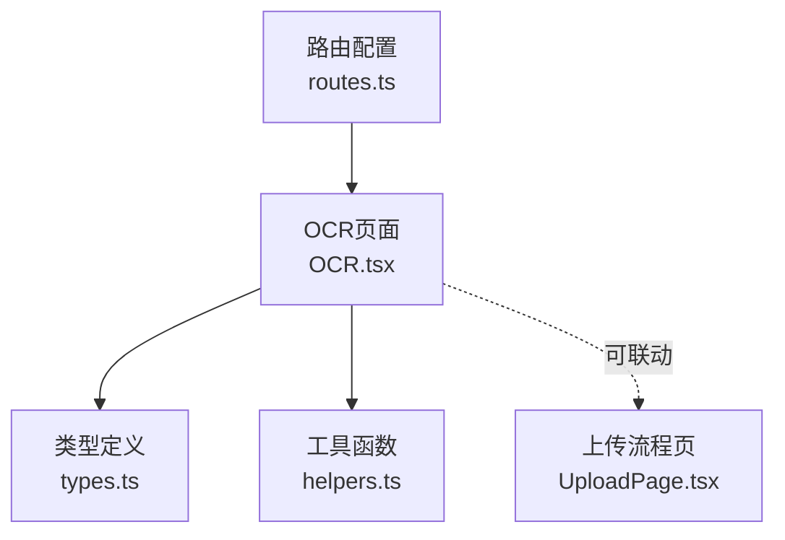
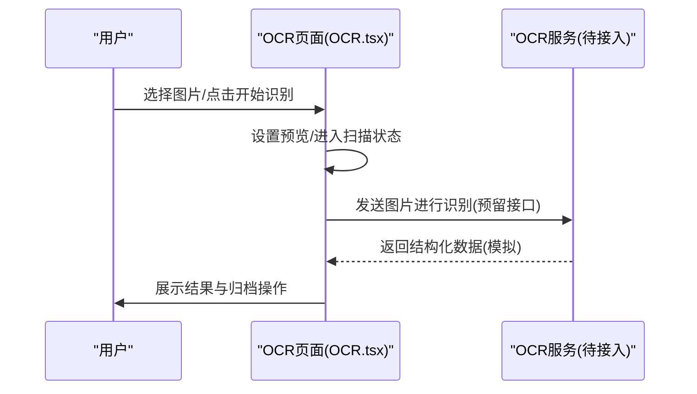
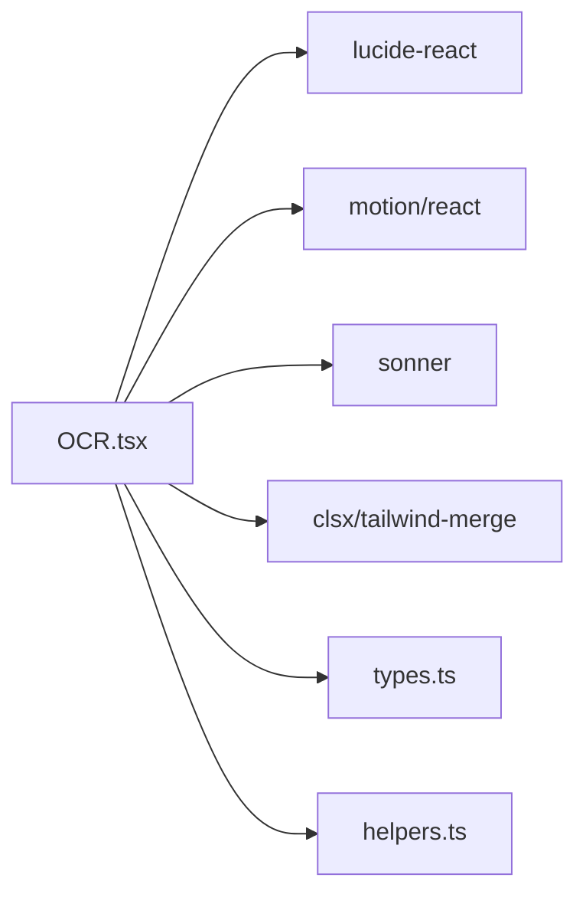
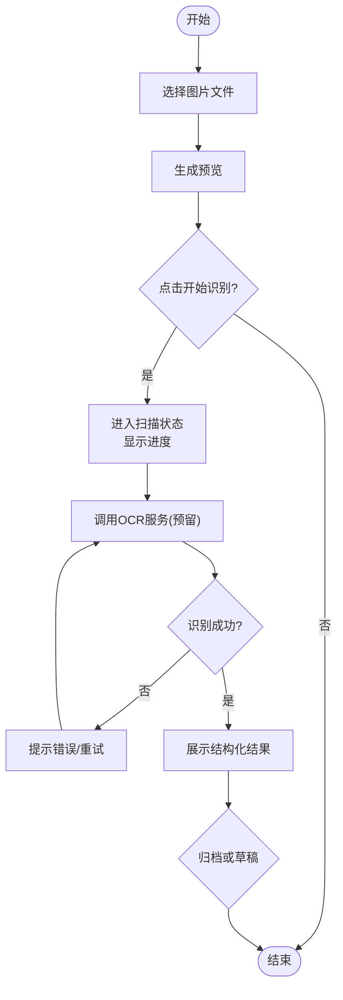

# OCR识别页面

<cite>
**本文引用的文件**
- [OCR.tsx](file://figma-ui/src/app/pages/OCR.tsx)
- [routes.ts](file://figma-ui/src/app/routes.ts)
- [types.ts](file://figma-ui/src/app/types.ts)
- [helpers.ts](file://figma-ui/src/app/utils/helpers.ts)
- [UploadPage.tsx](file://figma-ui/src/app/pages/UploadPage.tsx)
- [package.json](file://figma-ui/package.json)
</cite>

## 目录
1. [简介](#简介)
2. [项目结构](#项目结构)
3. [核心组件](#核心组件)
4. [架构总览](#架构总览)
5. [详细组件分析](#详细组件分析)
6. [依赖分析](#依赖分析)
7. [性能考虑](#性能考虑)
8. [故障排查指南](#故障排查指南)
9. [结论](#结论)
10. [附录](#附录)

## 简介
本页面为医案通医疗档案网站的“OCR智能识别”入口，提供图像上传预览、模拟识别进度展示、结构化结果展示与归档操作。当前实现以本地状态驱动为主，包含文件选择器、图片预览、扫描动画与结果卡片；OCR服务集成点已预留，便于后续接入真实后端识别能力。

## 项目结构
- 路由注册：OCR 页面通过路由挂载到 /ocr。
- 页面组件：OCR.tsx 负责文件选择、预览、识别流程与结果展示。
- 类型定义：types.ts 定义了 OCRData、LabItem、PrescriptionItem 等数据结构，用于统一数据模型。
- 工具函数：helpers.ts 提供日期格式化、ID生成等通用方法。
- 相关页面：UploadPage.tsx 展示了从选择到上传再到确认的完整流程，可作为与OCR页联动的参考。

图表来源
- [routes.ts:24-66](file://figma-ui/src/app/routes.ts#L24-L66)
- [OCR.tsx:24-269](file://figma-ui/src/app/pages/OCR.tsx#L24-L269)
- [types.ts:11-61](file://figma-ui/src/app/types.ts#L11-L61)
- [helpers.ts:1-52](file://figma-ui/src/app/utils/helpers.ts#L1-L52)
- [UploadPage.tsx:7-24](file://figma-ui/src/app/pages/UploadPage.tsx#L7-L24)

章节来源
- [routes.ts:24-66](file://figma-ui/src/app/routes.ts#L24-L66)
- [OCR.tsx:24-269](file://figma-ui/src/app/pages/OCR.tsx#L24-L269)

## 核心组件
- 文件选择与预览
  - 使用隐藏的 <input type="file"> 触发系统选择器，支持 image/* 格式。
  - 通过 URL.createObjectURL 生成预览链接并渲染 img。
- 识别流程
  - 点击“开启 AI 智能分析”后进入 isScanning 状态，显示扫描动画与进度条。
  - 当前为模拟识别，固定时长后返回结构化结果（标题、日期、医院、医生、关键指标、总结）。
- 结果展示与归档
  - 结果卡片展示关键指标，带正常/异常图标提示。
  - 提供“存入草稿”和“确认归档”两个操作按钮（当前未绑定具体逻辑）。
- 重置与交互
  - 提供刷新按钮清空当前文件与结果，回到初始上传态。

章节来源
- [OCR.tsx:32-40](file://figma-ui/src/app/pages/OCR.tsx#L32-L40)
- [OCR.tsx:42-75](file://figma-ui/src/app/pages/OCR.tsx#L42-L75)
- [OCR.tsx:85-244](file://figma-ui/src/app/pages/OCR.tsx#L85-L244)

## 架构总览
OCR页面采用单组件自洽模式：事件处理、状态管理、UI渲染集中在同一组件内；类型与工具函数作为外部依赖。未来可扩展为多组件拆分（如 FileUploader、ScanProgress、ResultCard）与服务层（OCRService）解耦。

图表来源
- [OCR.tsx:32-75](file://figma-ui/src/app/pages/OCR.tsx#L32-L75)

## 详细组件分析

### 文件选择与预览
- 文件选择器
  - 通过 ref 控制隐藏 input 的 click，避免样式限制。
  - accept="image/*" 限定图片类型；如需PDF支持，可在后续扩展 accept 或增加独立入口。
- 预览
  - 使用 URL.createObjectURL(file) 创建临时预览地址，注意在组件卸载或切换时释放以避免内存泄漏（当前未显式释放，建议优化）。
- 错误处理
  - 当前未做文件大小校验与格式校验，建议在 handleFileChange 中加入白名单与大小限制提示。

章节来源
- [OCR.tsx:126-132](file://figma-ui/src/app/pages/OCR.tsx#L126-L132)
- [OCR.tsx:32-40](file://figma-ui/src/app/pages/OCR.tsx#L32-L40)

### 识别流程与进度
- 进度模拟
  - 使用 setInterval 递增 progress，达到100%停止。
  - 使用 setTimeout 模拟网络/识别耗时，结束后关闭 isScanning。
- 用户体验
  - 扫描期间覆盖遮罩与扫描线动画，提升感知度。
- 扩展点
  - startScan 中可替换为真实调用OCR服务的逻辑，并在回调中更新进度与结果。

章节来源
- [OCR.tsx:42-75](file://figma-ui/src/app/pages/OCR.tsx#L42-L75)
- [OCR.tsx:160-175](file://figma-ui/src/app/pages/OCR.tsx#L160-L175)

### 结构化数据展示
- 数据模型
  - 当前结果对象包含 title、date、hospital、doctor、data[]、summary。
  - 可与 types.ts 中的 OCRData、LabItem 对齐，便于后续持久化与归档。
- 展示逻辑
  - data[] 每项渲染 label/value，并根据 normal 字段显示正常/异常图标。
  - summary 区域以引用样式呈现AI总结。
- 编辑与校对
  - 当前为只读展示；可在此基础上加入表单控件（输入框/下拉）实现人工校对编辑。

章节来源
- [OCR.tsx:60-73](file://figma-ui/src/app/pages/OCR.tsx#L60-L73)
- [OCR.tsx:205-239](file://figma-ui/src/app/pages/OCR.tsx#L205-L239)
- [types.ts:37-61](file://figma-ui/src/app/types.ts#L37-L61)

### 归档与草稿
- 按钮占位
  - “存入草稿”“确认归档”按钮已存在但未绑定业务逻辑。
- 建议实现
  - 将 scanResult 转换为 Archive 类型（参考 types.ts），写入本地存储或提交后端。
  - 结合 UploadPage.tsx 的流程，形成“选择-上传-识别-确认”的闭环。

章节来源
- [OCR.tsx:231-239](file://figma-ui/src/app/pages/OCR.tsx#L231-L239)
- [types.ts:11-25](file://figma-ui/src/app/types.ts#L11-L25)
- [UploadPage.tsx:7-24](file://figma-ui/src/app/pages/UploadPage.tsx#L7-L24)

### 路由与入口
- 路由挂载
  - 在 routes.ts 中将 /ocr 映射到 OCR 组件，可通过哈希路由访问。
- 导航建议
  - 可在其他页面（如上传页）跳转到 /ocr，或在底部导航添加入口。

章节来源
- [routes.ts:63-66](file://figma-ui/src/app/routes.ts#L63-L66)

## 依赖分析
- 运行时依赖
  - lucide-react：图标库，用于扫描、上传、成功/警告等图标。
  - motion/react：动画与过渡效果，用于上传区、扫描遮罩、结果卡片入场。
  - sonner：轻量通知，用于识别成功提示。
  - clsx/tailwind-merge：样式合并工具。
- 构建与工程
  - React 18 + Vite 构建，Tailwind CSS 样式体系。
  - 包管理中包含 html2canvas 等可用于截图/转图的库（当前OCR页未直接使用）。

图表来源
- [OCR.tsx:1-18](file://figma-ui/src/app/pages/OCR.tsx#L1-L18)
- [package.json:14-75](file://figma-ui/package.json#L14-L75)

章节来源
- [package.json:14-75](file://figma-ui/package.json#L14-L75)
- [OCR.tsx:1-18](file://figma-ui/src/app/pages/OCR.tsx#L1-L18)

## 性能考虑
- 预览图片内存
  - URL.createObjectURL 创建的 Blob URL 应在不再使用时释放，避免内存增长。
- 动画与重绘
  - 扫描遮罩与进度条使用 motion 动画，注意避免频繁状态更新导致重排。
- 识别并发
  - 若接入真实OCR服务，建议对请求进行防抖/节流与队列控制，避免重复提交。
- 大文件处理
  - 建议在上传前压缩图片（可借助 canvas 或第三方库），降低传输体积与解析时间。

[本节为通用指导，不直接分析具体文件]

## 故障排查指南
- 无法选择文件或无预览
  - 检查浏览器是否允许文件访问权限；确认 accept 属性与设备支持。
  - 检查 fileInputRef 是否正确指向隐藏 input。
- 识别无响应或卡住
  - 当前为模拟流程，若接入真实服务，需检查网络、鉴权与接口返回格式。
  - 关注控制台错误与网络面板请求详情。
- 结果展示异常
  - 核对 scanResult 数据结构是否与渲染逻辑一致（label/value/normal）。
  - 若对接后端，确保字段映射正确。
- 归档失败
  - 确认“确认归档”按钮已绑定保存逻辑，目标存储（本地/后端）可用。

章节来源
- [OCR.tsx:32-40](file://figma-ui/src/app/pages/OCR.tsx#L32-L40)
- [OCR.tsx:42-75](file://figma-ui/src/app/pages/OCR.tsx#L42-L75)
- [OCR.tsx:205-239](file://figma-ui/src/app/pages/OCR.tsx#L205-L239)

## 结论
OCR识别页面已完成前端交互闭环：文件选择、预览、识别进度与结果展示。当前为模拟识别，易于快速验证体验；后续可按以下方向演进：
- 接入真实OCR服务，替换 startScan 中的模拟逻辑。
- 完善文件校验（类型、大小）、错误重试与加载态。
- 引入Canvas图像处理（缩放、裁剪、去噪）提升识别率。
- 增强人工校对编辑能力，支持字段级编辑与版本对比。
- 与 UploadPage 打通，形成端到端归档流程。

[本节为总结性内容，不直接分析具体文件]

## 附录

### 代码片段路径指引（不含具体代码）
- 文件选择器实现
  - [文件输入与变更处理:126-132](file://figma-ui/src/app/pages/OCR.tsx#L126-L132)
  - [handleFileChange 逻辑:32-40](file://figma-ui/src/app/pages/OCR.tsx#L32-L40)
- 预览与扫描
  - [预览渲染与扫描遮罩:157-175](file://figma-ui/src/app/pages/OCR.tsx#L157-L175)
  - [startScan 进度与完成:42-75](file://figma-ui/src/app/pages/OCR.tsx#L42-L75)
- 结果展示与归档
  - [结果卡片与指标渲染:205-239](file://figma-ui/src/app/pages/OCR.tsx#L205-L239)
  - [归档按钮占位:231-239](file://figma-ui/src/app/pages/OCR.tsx#L231-L239)
- 类型与工具
  - [OCR数据结构定义:37-61](file://figma-ui/src/app/types.ts#L37-L61)
  - [日期与ID工具函数:1-52](file://figma-ui/src/app/utils/helpers.ts#L1-L52)
- 路由与联动
  - [/ocr 路由注册:63-66](file://figma-ui/src/app/routes.ts#L63-L66)
  - [上传页流程参考:7-24](file://figma-ui/src/app/pages/UploadPage.tsx#L7-L24)

### 数据模型与字段说明
- OCRData
  - 关键字段：hospital、department、date、doctorName、diagnosis、items、prescription。
  - 用途：承载OCR提取的结构化信息，便于归档与展示。
- LabItem
  - 关键字段：name、value、unit、referenceRange、isAbnormal。
  - 用途：检验指标项的标准结构。
- PrescriptionItem
  - 关键字段：name、dosage、frequency、duration。
  - 用途：处方药品及用法用量。

章节来源
- [types.ts:37-61](file://figma-ui/src/app/types.ts#L37-L61)

### 流程图：识别主流程

图表来源
- [OCR.tsx:42-75](file://figma-ui/src/app/pages/OCR.tsx#L42-L75)
- [OCR.tsx:205-239](file://figma-ui/src/app/pages/OCR.tsx#L205-L239)