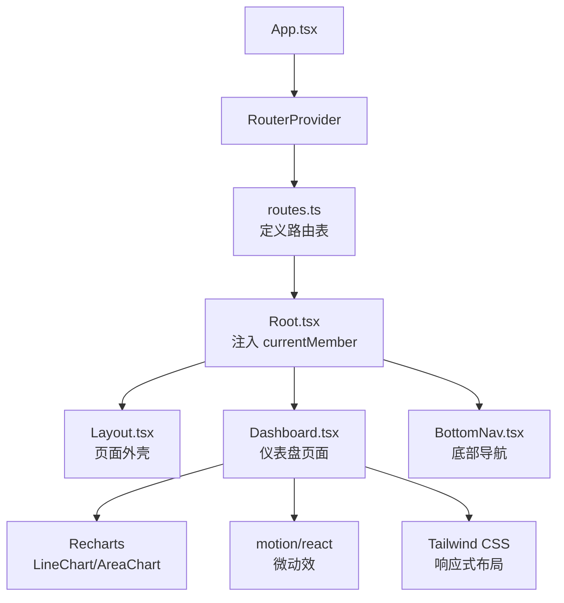
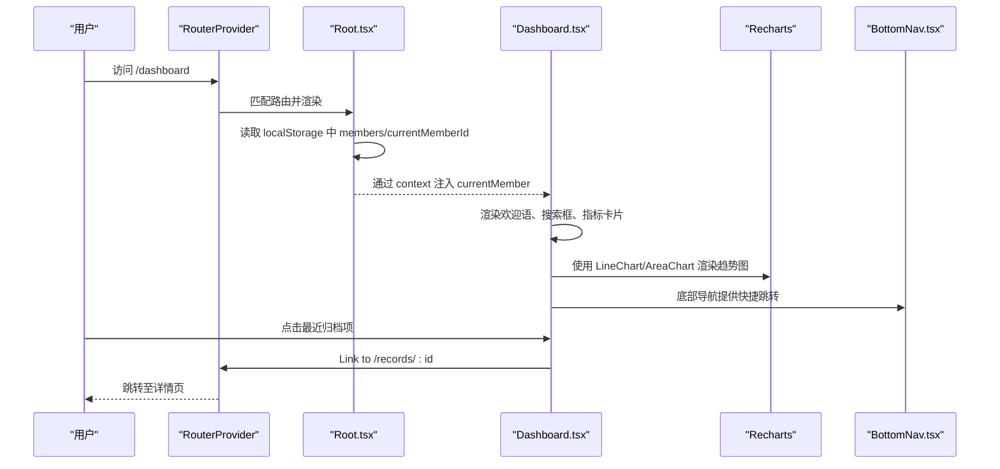
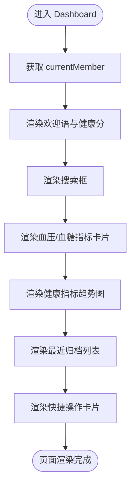
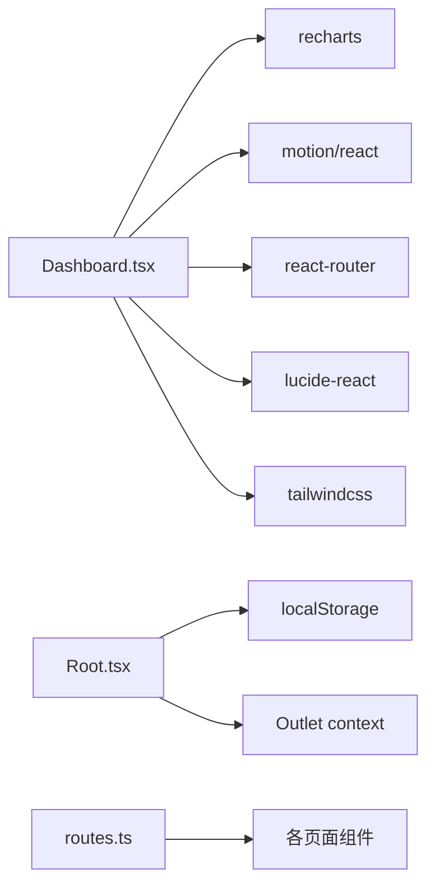

# 仪表盘页面

<cite>
**本文引用的文件**
- [Dashboard.tsx](file://figma-ui/src/app/pages/Dashboard.tsx)
- [routes.ts](file://figma-ui/src/app/routes.ts)
- [Root.tsx](file://figma-ui/src/app/Root.tsx)
- [types.ts](file://figma-ui/src/app/types.ts)
- [mockData.ts](file://figma-ui/src/app/utils/mockData.ts)
- [chart.tsx](file://figma-ui/src/app/components/ui/chart.tsx)
- [BottomNav.tsx](file://figma-ui/src/app/components/BottomNav.tsx)
- [package.json](file://figma-ui/package.json)
</cite>

## 目录
1. [简介](#简介)
2. [项目结构](#项目结构)
3. [核心组件](#核心组件)
4. [架构总览](#架构总览)
5. [详细组件分析](#详细组件分析)
6. [依赖关系分析](#依赖关系分析)
7. [性能考量](#性能考量)
8. [故障排查指南](#故障排查指南)
9. [结论](#结论)
10. [附录](#附录)

## 简介
本文件为医案通医疗档案网站的“仪表盘”页面提供完整的技术文档。内容涵盖：健康指标展示、趋势图表渲染、最近记录列表与快捷操作；数据获取策略、状态管理模式、图表配置选项与用户交互流程；Recharts 的使用方式、响应式布局实现、动画效果配置与性能优化策略；以及页面组件组合结构、子组件调用关系和数据流管理。

## 项目结构
仪表盘页面位于应用路由的受保护区域，由根容器负责注入当前成员上下文，并通过 React Router 进行导航。整体结构如下：
- 应用入口通过 RouterProvider 挂载路由
- Root 组件负责登录态校验与成员上下文注入（currentMember）
- Dashboard 页面在 /dashboard 路由下渲染，使用 Recharts 绘制健康指标趋势，使用 motion 添加微动效，结合 Tailwind 完成响应式布局
- BottomNav 提供底部导航栏，支持快速跳转至其他功能页

**图示来源**
- [routes.ts:25-75](file://figma-ui/src/app/routes.ts#L25-L75)
- [Root.tsx:6-58](file://figma-ui/src/app/Root.tsx#L6-L58)
- [Dashboard.tsx:1-204](file://figma-ui/src/app/pages/Dashboard.tsx#L1-L204)

**章节来源**
- [routes.ts:25-75](file://figma-ui/src/app/routes.ts#L25-L75)
- [Root.tsx:6-58](file://figma-ui/src/app/Root.tsx#L6-L58)
- [Dashboard.tsx:1-204](file://figma-ui/src/app/pages/Dashboard.tsx#L1-L204)

## 核心组件
- 仪表盘页面（Dashboard）
  - 健康指标卡片：血压、血糖等，包含数值与迷你面积图
  - 主趋势图：折线图展示健康指标随时间变化
  - 最近归档：列表展示最近上传或识别的医疗记录，支持点击跳转详情
  - 快捷操作：复诊提醒、待服药物等卡片
  - 搜索框：用于检索报告、医院或科室
- 根容器（Root）
  - 检查登录态并跳转到登录页
  - 从 localStorage 加载 members 与 currentMemberId，构造 currentMember 对象
  - 通过 Outlet context 将 currentMember 传递给子页面（如 Dashboard）
- 路由（routes.ts）
  - 使用 createHashRouter 定义路由
  - 将 Dashboard 挂载到 /dashboard
  - 将 /records/:id 等详情页路由暴露给 Dashboard 中的 Link 跳转
- 类型与数据（types.ts, mockData.ts）
  - Member、Archive、OCRData 等类型定义
  - MOCK_ARCHIVES 提供示例数据，便于演示与开发联调

**章节来源**
- [Dashboard.tsx:17-204](file://figma-ui/src/app/pages/Dashboard.tsx#L17-L204)
- [Root.tsx:6-58](file://figma-ui/src/app/Root.tsx#L6-L58)
- [routes.ts:25-75](file://figma-ui/src/app/routes.ts#L25-L75)
- [types.ts:1-95](file://figma-ui/src/app/types.ts#L1-L95)
- [mockData.ts:1-98](file://figma-ui/src/app/utils/mockData.ts#L1-L98)

## 架构总览
仪表盘采用“轻量状态 + 上下文传递”的模式：
- 状态管理：当前成员信息通过 Root 的 state 与 Outlet context 向下传递，避免全局状态库
- 数据获取：Dashboard 内使用本地模拟数据（MOCK_STATS、RECENT_RECORDS），可替换为 API 请求
- 图表渲染：基于 Recharts 的 LineChart/AreaChart，配合 ResponsiveContainer 实现自适应尺寸
- 动画与交互：使用 motion/react 实现卡片悬浮动效与底部导航切换动画
- 路由与导航：React Router 的 Link/useNavigate 实现页面间跳转；详情页通过动态路由参数传递记录 ID

**图示来源**
- [routes.ts:25-75](file://figma-ui/src/app/routes.ts#L25-L75)
- [Root.tsx:6-58](file://figma-ui/src/app/Root.tsx#L6-L58)
- [Dashboard.tsx:30-204](file://figma-ui/src/app/pages/Dashboard.tsx#L30-L204)
- [BottomNav.tsx:1-85](file://figma-ui/src/app/components/BottomNav.tsx#L1-L85)

## 详细组件分析

### 仪表盘页面（Dashboard）
- 数据与状态
  - 健康指标数据：MOCK_STATS（时间序列值）
  - 最近记录：RECENT_RECORDS（标题、日期、医院、类型、状态）
  - 当前成员：通过 useOutletContext 获取 currentMember.name
- 图表配置
  - 折线图：XAxis 显示日期，YAxis 隐藏，Tooltip 自定义样式，Line 设置颜色、线宽、点样式
  - 面积图：AreaChart 用于迷你趋势，使用单调曲线与半透明填充
  - 响应式：ResponsiveContainer 包裹图表，确保在不同屏幕宽度下自适应
- 交互与路由
  - 最近归档项使用 Link 跳转到 /records/:id
  - 搜索框为输入控件，可接入后续搜索逻辑
- 动画与布局
  - motion 的 whileHover 为卡片增加悬浮动效
  - Tailwind 栅格与间距控制布局，移动端友好

**图示来源**
- [Dashboard.tsx:30-204](file://figma-ui/src/app/pages/Dashboard.tsx#L30-L204)

**章节来源**
- [Dashboard.tsx:17-204](file://figma-ui/src/app/pages/Dashboard.tsx#L17-L204)

### 根容器（Root）
- 登录态检查：若未登录则跳转到 /login
- 成员数据加载：从 localStorage 读取 members 与 currentMemberId，构造 currentMember
- 上下文注入：通过 Outlet context 将 currentMember 传递给子页面
- 错误处理：loading 状态下显示占位提示

**章节来源**
- [Root.tsx:6-58](file://figma-ui/src/app/Root.tsx#L6-L58)

### 路由（routes.ts）
- 使用 createHashRouter 定义路由表
- 将 Dashboard 挂载到 /dashboard
- 将 /records/:id 等详情页路由暴露给 Dashboard 中的 Link 跳转
- 支持多页面嵌套与独立页面

**章节来源**
- [routes.ts:25-75](file://figma-ui/src/app/routes.ts#L25-L75)

### 类型与数据（types.ts, mockData.ts）
- types.ts：定义 Member、Archive、OCRData、LabItem、PrescriptionItem 等类型，统一数据结构
- mockData.ts：提供 MOCK_ARCHIVES 示例数据，便于前端开发与演示

**章节来源**
- [types.ts:1-95](file://figma-ui/src/app/types.ts#L1-L95)
- [mockData.ts:1-98](file://figma-ui/src/app/utils/mockData.ts#L1-L98)

### 图表组件封装（chart.tsx）
- 提供 ChartContainer、ChartTooltipContent、ChartLegendContent 等封装组件
- 支持主题化配置与响应式容器
- 可用于统一图表样式与行为，提升复用性

**章节来源**
- [chart.tsx:1-293](file://figma-ui/src/app/components/ui/chart.tsx#L1-L293)

### 底部导航（BottomNav.tsx）
- 提供首页、档案、上传、分享、设置等入口
- 使用 motion 实现图标缩放与活动指示器动画
- 与 React Router 集成，根据当前路径高亮对应项

**章节来源**
- [BottomNav.tsx:1-85](file://figma-ui/src/app/components/BottomNav.tsx#L1-L85)

## 依赖关系分析
- 运行时依赖
  - recharts：图表渲染
  - motion：动画效果
  - react-router：路由与导航
  - lucide-react：图标
  - tailwindcss：样式与响应式布局
- 组件耦合
  - Dashboard 依赖 Root 提供的 currentMember 上下文
  - Dashboard 通过 routes.ts 定义的 /records/:id 进行页面跳转
  - BottomNav 与路由联动，提供全局导航体验

**图示来源**
- [Dashboard.tsx:1-204](file://figma-ui/src/app/pages/Dashboard.tsx#L1-L204)
- [Root.tsx:6-58](file://figma-ui/src/app/Root.tsx#L6-L58)
- [routes.ts:25-75](file://figma-ui/src/app/routes.ts#L25-L75)
- [package.json:14-76](file://figma-ui/package.json#L14-L76)

**章节来源**
- [package.json:14-76](file://figma-ui/package.json#L14-L76)

## 性能考量
- 图表性能
  - 使用 ResponsiveContainer 限制重绘范围，避免全量重排
  - 对迷你面积图使用简化数据与较小高度，减少渲染开销
  - 合理设置 XAxis/YAxis/Tooltip，避免不必要的计算
- 动画性能
  - motion 的 whileHover 仅在小范围内触发，避免频繁重绘
  - 底部导航使用 layoutId 平滑过渡，减少布局抖动
- 数据加载
  - 当前使用本地模拟数据，建议后续引入缓存策略（如内存缓存或 IndexedDB）以减少重复请求
  - 对大型列表（如最近归档）考虑虚拟滚动或分页加载
- 样式与布局
  - 使用 Tailwind 原子类减少自定义样式体积
  - 合理使用 grid/flex 布局，保证移动端适配

[本节为通用指导，不直接分析具体文件]

## 故障排查指南
- 无法显示当前成员名称
  - 检查 Root 是否正确从 localStorage 读取 members 与 currentMemberId
  - 确认 Outlet context 是否成功注入 currentMember
  - 参考：[Root.tsx:10-46](file://figma-ui/src/app/Root.tsx#L10-L46)、[Dashboard.tsx:31](file://figma-ui/src/app/pages/Dashboard.tsx#L31)
- 图表不显示或尺寸异常
  - 确认 ResponsiveContainer 父容器具有明确宽高
  - 检查数据格式是否符合 Recharts 要求（dataKey、name/value）
  - 参考：[Dashboard.tsx:107-142](file://figma-ui/src/app/pages/Dashboard.tsx#L107-L142)、[chart.tsx:37-69](file://figma-ui/src/app/components/ui/chart.tsx#L37-L69)
- 链接跳转无效
  - 确认 routes.ts 中已定义 /records/:id 路由
  - 检查 Link 的 to 属性是否正确拼接记录 ID
  - 参考：[routes.ts:77-80](file://figma-ui/src/app/routes.ts#L77-L80)、[Dashboard.tsx:153-178](file://figma-ui/src/app/pages/Dashboard.tsx#L153-L178)
- 底部导航高亮不正确
  - 检查 useLocation 的路径与 navItems.path 是否一致
  - 参考：[BottomNav.tsx:6-22](file://figma-ui/src/app/components/BottomNav.tsx#L6-L22)

**章节来源**
- [Root.tsx:10-46](file://figma-ui/src/app/Root.tsx#L10-L46)
- [Dashboard.tsx:31-31](file://figma-ui/src/app/pages/Dashboard.tsx#L31-L31)
- [Dashboard.tsx:107-142](file://figma-ui/src/app/pages/Dashboard.tsx#L107-L142)
- [chart.tsx:37-69](file://figma-ui/src/app/components/ui/chart.tsx#L37-L69)
- [routes.ts:77-80](file://figma-ui/src/app/routes.ts#L77-L80)
- [Dashboard.tsx:153-178](file://figma-ui/src/app/pages/Dashboard.tsx#L153-L178)
- [BottomNav.tsx:6-22](file://figma-ui/src/app/components/BottomNav.tsx#L6-L22)

## 结论
仪表盘页面以简洁的状态管理与清晰的组件分层实现了健康指标展示、趋势图表渲染、最近记录列表与快捷操作。通过 Recharts 与 motion 的组合，提供了良好的可视化与交互体验；借助 Tailwind 的响应式能力，确保了多端一致性。未来可进一步引入真实数据源、缓存策略与更丰富的图表交互，以提升性能与用户体验。

[本节为总结性内容，不直接分析具体文件]

## 附录

### 数据绑定与事件处理示例路径
- 健康指标数据绑定：[Dashboard.tsx:17-23](file://figma-ui/src/app/pages/Dashboard.tsx#L17-L23)
- 最近记录列表渲染与跳转：[Dashboard.tsx:144-180](file://figma-ui/src/app/pages/Dashboard.tsx#L144-L180)
- 搜索框输入控件：[Dashboard.tsx:48-55](file://figma-ui/src/app/pages/Dashboard.tsx#L48-L55)
- 趋势图配置与渲染：[Dashboard.tsx:107-142](file://figma-ui/src/app/pages/Dashboard.tsx#L107-L142)
- 迷你面积图配置：[Dashboard.tsx:74-103](file://figma-ui/src/app/pages/Dashboard.tsx#L74-L103)

### 路由跳转示例路径
- 跳转到记录详情：[Dashboard.tsx:153-178](file://figma-ui/src/app/pages/Dashboard.tsx#L153-L178)
- 路由定义（含详情页）：[routes.ts:77-80](file://figma-ui/src/app/routes.ts#L77-L80)

### 图表库使用方式
- Recharts 基础组件与配置：[Dashboard.tsx:6-15](file://figma-ui/src/app/pages/Dashboard.tsx#L6-L15)
- 图表封装组件（可选）：[chart.tsx:1-293](file://figma-ui/src/app/components/ui/chart.tsx#L1-L293)

### 响应式布局实现
- 栅格与间距：[Dashboard.tsx:34-204](file://figma-ui/src/app/pages/Dashboard.tsx#L34-L204)
- 底部导航响应式：[BottomNav.tsx:16-85](file://figma-ui/src/app/components/BottomNav.tsx#L16-L85)

### 动画效果配置
- 卡片悬浮动效：[Dashboard.tsx:60-81](file://figma-ui/src/app/pages/Dashboard.tsx#L60-L81)
- 底部导航动效：[BottomNav.tsx:31-76](file://figma-ui/src/app/components/BottomNav.tsx#L31-L76)

### 性能优化策略
- 图表尺寸与数据量控制：[Dashboard.tsx:107-142](file://figma-ui/src/app/pages/Dashboard.tsx#L107-L142)
- 动画触发范围控制：[Dashboard.tsx:60-81](file://figma-ui/src/app/pages/Dashboard.tsx#L60-L81)
- 依赖版本与构建工具：[package.json:14-82](file://figma-ui/package.json#L14-L82)