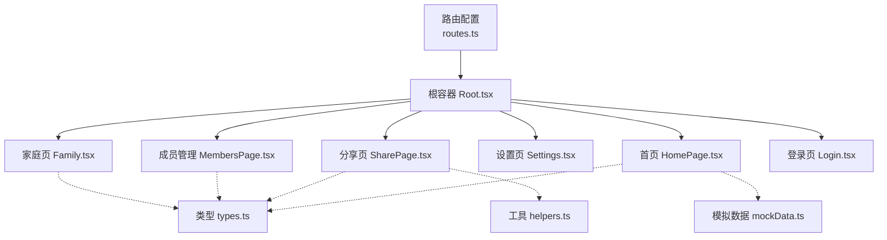
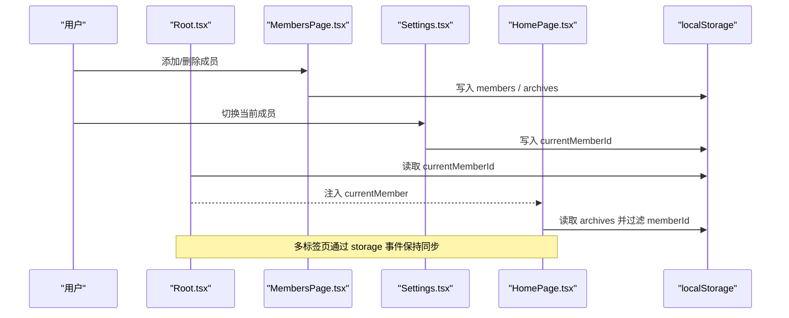
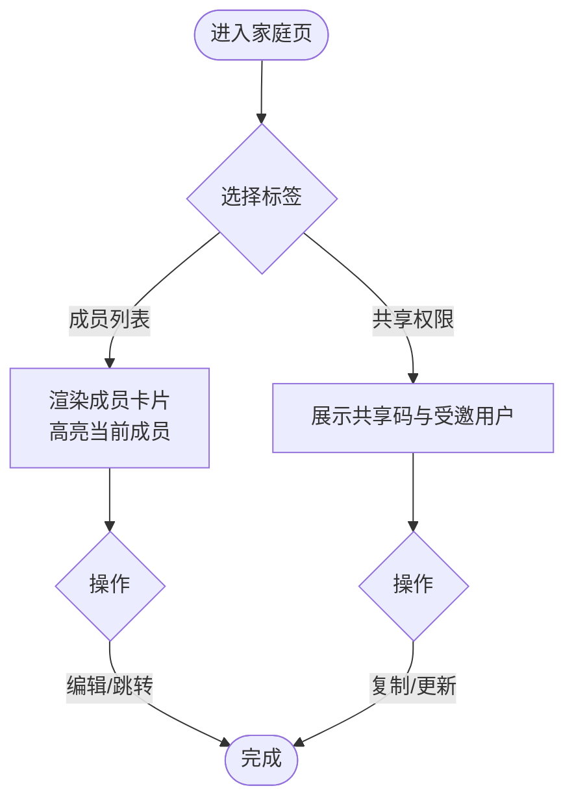
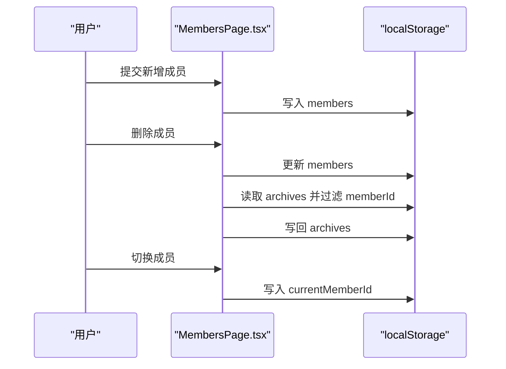
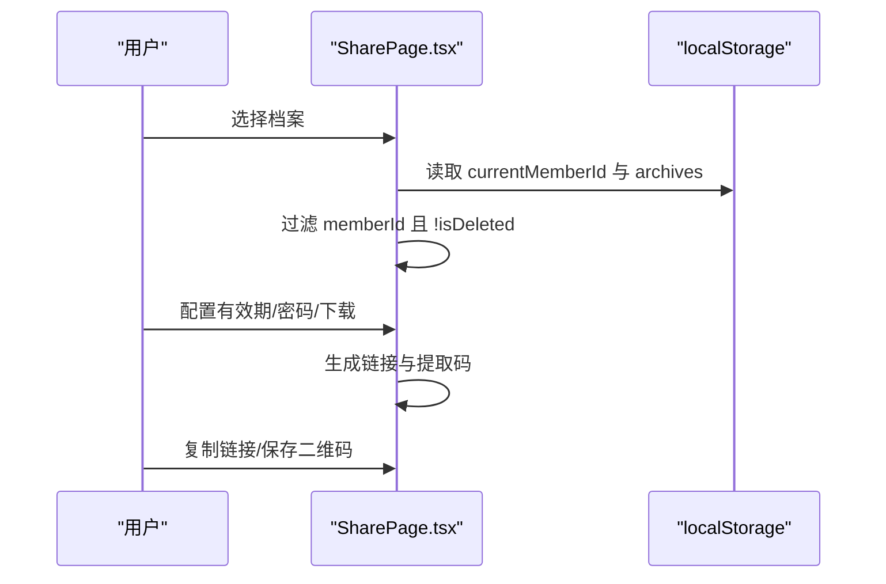
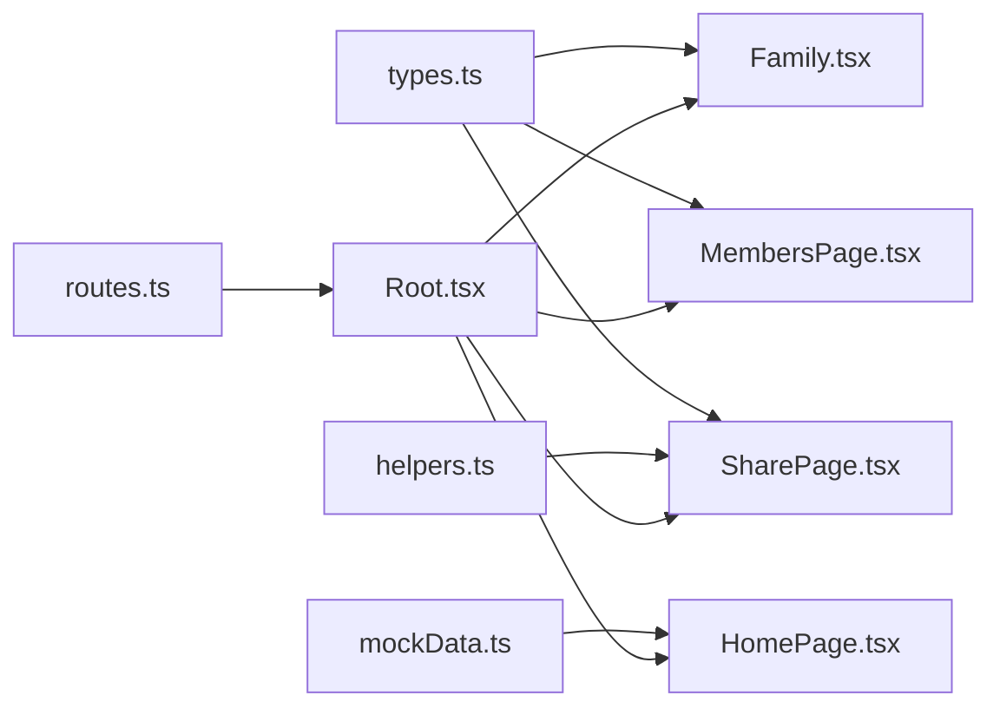

# 家庭管理页面

<cite>
**本文引用的文件**
- [Family.tsx](file://figma-ui/src/app/pages/Family.tsx)
- [MembersPage.tsx](file://figma-ui/src/app/pages/MembersPage.tsx)
- [SharePage.tsx](file://figma-ui/src/app/pages/SharePage.tsx)
- [types.ts](file://figma-ui/src/app/types.ts)
- [helpers.ts](file://figma-ui/src/app/utils/helpers.ts)
- [mockData.ts](file://figma-ui/src/app/utils/mockData.ts)
- [routes.ts](file://figma-ui/src/app/routes.ts)
- [Root.tsx](file://figma-ui/src/app/Root.tsx)
- [HomePage.tsx](file://figma-ui/src/app/pages/HomePage.tsx)
- [Settings.tsx](file://figma-ui/src/app/pages/Settings.tsx)
- [Login.tsx](file://figma-ui/src/app/pages/Login.tsx)
</cite>

## 目录
1. [简介](#简介)
2. [项目结构](#项目结构)
3. [核心组件](#核心组件)
4. [架构总览](#架构总览)
5. [详细组件分析](#详细组件分析)
6. [依赖关系分析](#依赖关系分析)
7. [性能考虑](#性能考虑)
8. [故障排查指南](#故障排查指南)
9. [结论](#结论)
10. [附录](#附录)

## 简介
本文件为医案通医疗档案网站“家庭管理页面”的完整技术文档，聚焦家庭协作功能的实现与使用。内容涵盖：
- 家庭成员管理（添加、删除、切换）
- 权限控制与共享设置（分享链接、有效期、密码保护、下载权限）
- 健康档案同步机制（基于本地存储的数据一致性策略）
- 用户角色管理与权限验证流程
- 通知系统与用户体验优化
- 与认证系统的集成、数据安全与隐私保护策略

该页面通过前端路由组织多个子页面，结合类型定义、工具函数与模拟数据，形成一套可独立运行的演示级实现。

## 项目结构
围绕家庭管理的核心代码分布在以下位置：
- 页面层：Family、MembersPage、SharePage、Settings、Home、Login
- 类型与工具：types、helpers、mockData
- 路由与根容器：routes、Root
- 数据流：localStorage 作为持久化载体，跨页面共享成员与档案数据

图表来源
- [routes.ts:25-75](file://figma-ui/src/app/routes.ts#L25-L75)
- [Root.tsx:35-58](file://figma-ui/src/app/Root.tsx#L35-L58)
- [Family.tsx:1-224](file://figma-ui/src/app/pages/Family.tsx#L1-L224)
- [MembersPage.tsx:1-294](file://figma-ui/src/app/pages/MembersPage.tsx#L1-L294)
- [SharePage.tsx:1-264](file://figma-ui/src/app/pages/SharePage.tsx#L1-L264)
- [types.ts:1-95](file://figma-ui/src/app/types.ts#L1-L95)
- [helpers.ts:1-52](file://figma-ui/src/app/utils/helpers.ts#L1-L52)
- [mockData.ts:1-98](file://figma-ui/src/app/utils/mockData.ts#L1-L98)

章节来源
- [routes.ts:25-75](file://figma-ui/src/app/routes.ts#L25-L75)
- [Root.tsx:35-58](file://figma-ui/src/app/Root.tsx#L35-L58)

## 核心组件
- 家庭页（Family.tsx）：展示家庭成员列表与共享权限入口，提供统计概览、成员卡片、共享码与受邀用户列表。
- 成员管理（MembersPage.tsx）：成员增删改查、切换当前成员、关联档案计数与清理。
- 分享页（SharePage.tsx）：选择档案、配置分享权限（有效期、密码、下载）、生成并复制分享链接。
- 类型定义（types.ts）：成员、档案、OCR、分享链接等数据结构与常量。
- 工具函数（helpers.ts）：日期格式化、过期判断、ID生成、手机号脱敏等。
- 模拟数据（mockData.ts）：初始化默认档案数据到 localStorage。
- 根容器（Root.tsx）：加载当前成员、监听 storage 事件实现跨页同步。
- 首页（HomePage.tsx）：根据 currentMemberId 过滤并渲染当前成员的档案。
- 设置页（Settings.tsx）：在设置中维护成员列表与当前成员切换。
- 登录页（Login.tsx）：模拟登录流程，写入 isLoggedIn 与 userPhone，必要时初始化默认成员。

章节来源
- [Family.tsx:1-224](file://figma-ui/src/app/pages/Family.tsx#L1-L224)
- [MembersPage.tsx:1-294](file://figma-ui/src/app/pages/MembersPage.tsx#L1-L294)
- [SharePage.tsx:1-264](file://figma-ui/src/app/pages/SharePage.tsx#L1-L264)
- [types.ts:1-95](file://figma-ui/src/app/types.ts#L1-L95)
- [helpers.ts:1-52](file://figma-ui/src/app/utils/helpers.ts#L1-L52)
- [mockData.ts:1-98](file://figma-ui/src/app/utils/mockData.ts#L1-L98)
- [Root.tsx:35-58](file://figma-ui/src/app/Root.tsx#L35-L58)
- [HomePage.tsx:1-33](file://figma-ui/src/app/pages/HomePage.tsx#L1-L33)
- [Settings.tsx:1-45](file://figma-ui/src/app/pages/Settings.tsx#L1-L45)
- [Login.tsx:1-122](file://figma-ui/src/app/pages/Login.tsx#L1-L122)

## 架构总览
家庭管理采用“页面 + 本地存储”的前端架构：
- 路由将 family、members、share、settings、home、login 等页面挂载到 Root。
- Root 负责读取 currentMemberId 并注入 context，供子页面消费。
- 各页面通过 localStorage 读写 members、archives、currentMemberId 等键，实现跨页数据共享。
- 通过 window "storage" 事件监听，实现多标签页间的数据同步。

图表来源
- [Root.tsx:35-58](file://figma-ui/src/app/Root.tsx#L35-L58)
- [MembersPage.tsx:15-48](file://figma-ui/src/app/pages/MembersPage.tsx#L15-L48)
- [Settings.tsx:316-347](file://figma-ui/src/app/pages/Settings.tsx#L316-L347)
- [HomePage.tsx:21-33](file://figma-ui/src/app/pages/HomePage.tsx#L21-L33)

## 详细组件分析

### 家庭页（Family.tsx）
- 功能要点
  - 成员列表：展示头像、姓名、角色、年龄、最近就诊与健康提示；支持编辑与跳转。
  - 共享权限：展示家庭共享码与受邀用户列表，支持更新二维码与复制密码。
  - 统计概览：显示总成员、总档案、待识别数量。
- 交互逻辑
  - Tab 切换“成员列表/共享权限”，配合动画过渡。
  - 通过 useOutletContext 获取 currentMember，用于高亮当前成员。
- 数据与状态
  - 成员数据以 MOCK_MEMBERS 静态数组呈现（演示用途）。
  - 共享用户列表为硬编码示例。

图表来源
- [Family.tsx:57-224](file://figma-ui/src/app/pages/Family.tsx#L57-L224)

章节来源
- [Family.tsx:17-55](file://figma-ui/src/app/pages/Family.tsx#L17-L55)
- [Family.tsx:57-224](file://figma-ui/src/app/pages/Family.tsx#L57-L224)

### 成员管理（MembersPage.tsx）
- 功能要点
  - 成员列表：展示基本信息、关系、性别、生日、血型、过敏史与档案数量。
  - 添加成员：表单校验必填项，生成新成员并持久化。
  - 删除成员：禁止删除本人；确认后删除成员及其所有档案。
  - 切换成员：写入 currentMemberId 并导航回首页。
- 数据流
  - 从 localStorage 读取 members 与 archives，进行联动删除。
  - 切换成员后，首页按 memberId 过滤档案。

图表来源
- [MembersPage.tsx:15-48](file://figma-ui/src/app/pages/MembersPage.tsx#L15-L48)
- [MembersPage.tsx:20-43](file://figma-ui/src/app/pages/MembersPage.tsx#L20-L43)

章节来源
- [MembersPage.tsx:1-153](file://figma-ui/src/app/pages/MembersPage.tsx#L1-L153)
- [MembersPage.tsx:155-294](file://figma-ui/src/app/pages/MembersPage.tsx#L155-L294)

### 分享页（SharePage.tsx）
- 功能要点
  - 档案选择：仅展示当前成员且未删除的档案。
  - 权限设置：有效期（天/永久）、密码保护、允许下载。
  - 生成分享：生成链接与提取码，支持复制与保存二维码。
- 数据流
  - 从 localStorage 读取 currentMemberId 与 archives，过滤出可分享档案。
  - 通过 isExpired 与 daysUntilExpiry 辅助计算有效期。

图表来源
- [SharePage.tsx:17-45](file://figma-ui/src/app/pages/SharePage.tsx#L17-L45)
- [SharePage.tsx:47-264](file://figma-ui/src/app/pages/SharePage.tsx#L47-L264)
- [helpers.ts:21-51](file://figma-ui/src/app/utils/helpers.ts#L21-L51)

章节来源
- [SharePage.tsx:1-264](file://figma-ui/src/app/pages/SharePage.tsx#L1-L264)
- [helpers.ts:1-52](file://figma-ui/src/app/utils/helpers.ts#L1-L52)

### 类型与工具（types.ts, helpers.ts, mockData.ts）
- types.ts
  - Member：成员基础信息（id、name、relation、gender、birthday、bloodType、allergies）。
  - Archive：档案元数据（memberId、type、title、hospital、date、uploadDate、tags、isFavorite、isDeleted、ocrData）。
  - ShareLink：分享链接（archiveIds、url、password、expiresAt、createdAt、isRevoked、viewCount）。
  - 常量：ARCHIVE_TYPE_LABELS、ARCHIVE_TYPE_COLORS。
- helpers.ts
  - formatDate/formatDateShort：中文日期格式化。
  - isExpired/daysUntilExpiry：过期判断与剩余天数计算。
  - generateId/maskPhone：唯一ID生成与手机号脱敏。
- mockData.ts
  - MOCK_ARCHIVES：示例档案数据。
  - initializeMockData：若 localStorage 无 archives，则写入默认数据。

章节来源
- [types.ts:1-95](file://figma-ui/src/app/types.ts#L1-L95)
- [helpers.ts:1-52](file://figma-ui/src/app/utils/helpers.ts#L1-L52)
- [mockData.ts:1-98](file://figma-ui/src/app/utils/mockData.ts#L1-L98)

### 根容器与路由（Root.tsx, routes.ts）
- Root.tsx
  - 读取 currentMemberId，加载对应成员并注入 Outlet context。
  - 监听 window "storage" 事件，实现跨标签页的成员切换同步。
- routes.ts
  - 定义 family、members、share、settings、records、ocr、dashboard、search、upload、login 等路由。
  - 将 Family、MembersPage、SharePage 等页面挂载至受保护的 Root 下。

章节来源
- [Root.tsx:35-58](file://figma-ui/src/app/Root.tsx#L35-L58)
- [routes.ts:25-75](file://figma-ui/src/app/routes.ts#L25-L75)

### 首页与设置页（HomePage.tsx, Settings.tsx）
- HomePage.tsx
  - 初始化模拟数据，读取 members、archives、currentMemberId。
  - 根据 currentMemberId 过滤档案并渲染。
- Settings.tsx
  - 在设置中维护成员列表，支持删除非本人成员。
  - 切换成员时更新 currentMemberId，并在提示中说明数据将自动切换。

章节来源
- [HomePage.tsx:1-33](file://figma-ui/src/app/pages/HomePage.tsx#L1-L33)
- [Settings.tsx:316-347](file://figma-ui/src/app/pages/Settings.tsx#L316-L347)

### 登录与认证集成（Login.tsx）
- 模拟登录流程：校验手机号与验证码，写入 isLoggedIn 与 userPhone。
- 首次登录时若不存在成员，则创建默认成员（id 为 "1"），确保后续页面有可用上下文。
- 登录后跳转到首页，由 Root 与 Home 读取 currentMemberId 并渲染。

章节来源
- [Login.tsx:18-40](file://figma-ui/src/app/pages/Login.tsx#L18-L40)

## 依赖关系分析
- 页面依赖类型定义：所有页面均引用 types.ts 中的 Member、Archive、ShareLink 等类型。
- 数据持久化：MembersPage、SharePage、HomePage、Settings、Login 均读写 localStorage。
- 工具函数：SharePage 使用 helpers.ts 的日期与过期处理函数。
- 路由与上下文：Root 通过 context 向子页面注入 currentMember，Family 通过 useOutletContext 消费。

图表来源
- [types.ts:1-95](file://figma-ui/src/app/types.ts#L1-L95)
- [helpers.ts:1-52](file://figma-ui/src/app/utils/helpers.ts#L1-L52)
- [mockData.ts:1-98](file://figma-ui/src/app/utils/mockData.ts#L1-L98)
- [routes.ts:25-75](file://figma-ui/src/app/routes.ts#L25-L75)
- [Root.tsx:35-58](file://figma-ui/src/app/Root.tsx#L35-L58)

章节来源
- [types.ts:1-95](file://figma-ui/src/app/types.ts#L1-L95)
- [helpers.ts:1-52](file://figma-ui/src/app/utils/helpers.ts#L1-L52)
- [mockData.ts:1-98](file://figma-ui/src/app/utils/mockData.ts#L1-L98)
- [routes.ts:25-75](file://figma-ui/src/app/routes.ts#L25-L75)
- [Root.tsx:35-58](file://figma-ui/src/app/Root.tsx#L35-L58)

## 性能考虑
- 数据量控制：当前为演示级数据，实际应分页加载档案与成员，避免一次性渲染大量 DOM。
- 本地存储读写：频繁读写 localStorage 可能阻塞主线程，建议批量更新与防抖。
- 过滤与排序：首页与分享页对 archives 进行过滤，建议在数据层建立索引或缓存结果。
- 动画与交互：Family 使用 motion/react 动画，注意在低端设备上减少重排重绘。

[本节为通用指导，不直接分析具体文件]

## 故障排查指南
- 无法看到成员或档案
  - 检查 localStorage 是否包含 members 与 archives，确认 initializeMockData 已执行。
  - 确认 currentMemberId 是否正确设置，Root 是否成功注入 context。
- 删除成员失败
  - 确认是否为本人（id 为 "1"），系统禁止删除本人。
  - 检查 confirm 弹窗是否被拦截，导致删除流程中断。
- 分享链接无效
  - 检查所选档案是否属于当前成员且未被标记删除。
  - 使用 helpers.isExpired 与 daysUntilExpiry 校验有效期。
- 多标签页不同步
  - 确认 Root 是否注册了 window "storage" 事件监听器。
  - 切换成员后，其他标签页应能自动刷新 currentMember。

章节来源
- [MembersPage.tsx:27-43](file://figma-ui/src/app/pages/MembersPage.tsx#L27-L43)
- [SharePage.tsx:17-45](file://figma-ui/src/app/pages/SharePage.tsx#L17-L45)
- [helpers.ts:21-51](file://figma-ui/src/app/utils/helpers.ts#L21-L51)
- [Root.tsx:35-58](file://figma-ui/src/app/Root.tsx#L35-L58)

## 结论
家庭管理页面通过清晰的路由与组件划分，实现了成员管理、权限控制与分享能力。基于 localStorage 的轻量数据方案便于快速演示与迭代，同时借助 Root 的 storage 监听实现跨页同步。未来可引入后端服务与更完善的权限模型，进一步提升安全性与可扩展性。

[本节为总结性内容，不直接分析具体文件]

## 附录

### 成员列表渲染（代码片段路径）
- 成员卡片渲染与高亮当前成员：[Family.tsx:117-162](file://figma-ui/src/app/pages/Family.tsx#L117-L162)
- 成员列表与空态展示：[MembersPage.tsx:78-147](file://figma-ui/src/app/pages/MembersPage.tsx#L78-L147)

### 权限矩阵配置（代码片段路径）
- 分享权限设置（有效期、密码、下载）：[SharePage.tsx:111-179](file://figma-ui/src/app/pages/SharePage.tsx#L111-L179)
- 分享结果与链接复制：[SharePage.tsx:197-264](file://figma-ui/src/app/pages/SharePage.tsx#L197-L264)

### 数据同步算法（代码片段路径）
- 根容器加载与 storage 监听：[Root.tsx:35-58](file://figma-ui/src/app/Root.tsx#L35-L58)
- 首页按成员过滤档案：[HomePage.tsx:21-33](file://figma-ui/src/app/pages/HomePage.tsx#L21-L33)
- 分享页按成员过滤档案：[SharePage.tsx:17-24](file://figma-ui/src/app/pages/SharePage.tsx#L17-L24)

### 通知系统（代码片段路径）
- 登录成功与错误提示：[Login.tsx:18-34](file://figma-ui/src/app/pages/Login.tsx#L18-L34)
- 设置页提示文案：[Settings.tsx:337-341](file://figma-ui/src/app/pages/Settings.tsx#L337-L341)

### 与认证系统集成（代码片段路径）
- 模拟登录与默认成员初始化：[Login.tsx:18-40](file://figma-ui/src/app/pages/Login.tsx#L18-L40)
- 路由与受保护页面挂载：[routes.ts:37-75](file://figma-ui/src/app/routes.ts#L37-L75)

### 数据安全与隐私保护（代码片段路径）
- 手机号脱敏：[helpers.ts:36-41](file://figma-ui/src/app/utils/helpers.ts#L36-L41)
- 分享链接有效期与密码保护：[SharePage.tsx:111-179](file://figma-ui/src/app/pages/SharePage.tsx#L111-L179)
- 登录协议与隐私声明提示：[Login.tsx:117-119](file://figma-ui/src/app/pages/Login.tsx#L117-L119)