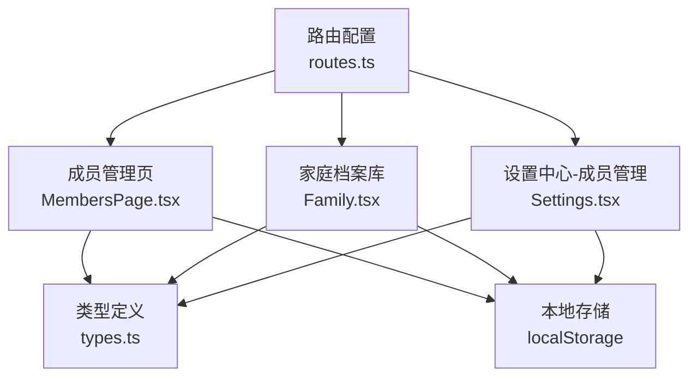
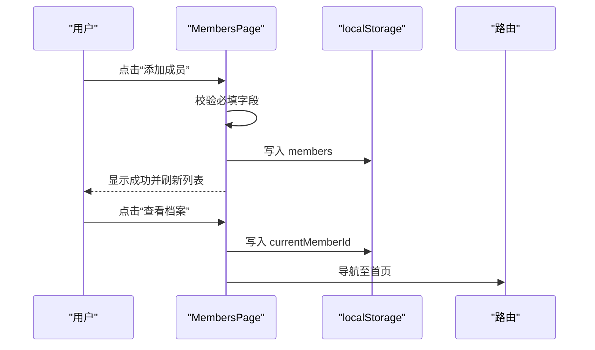
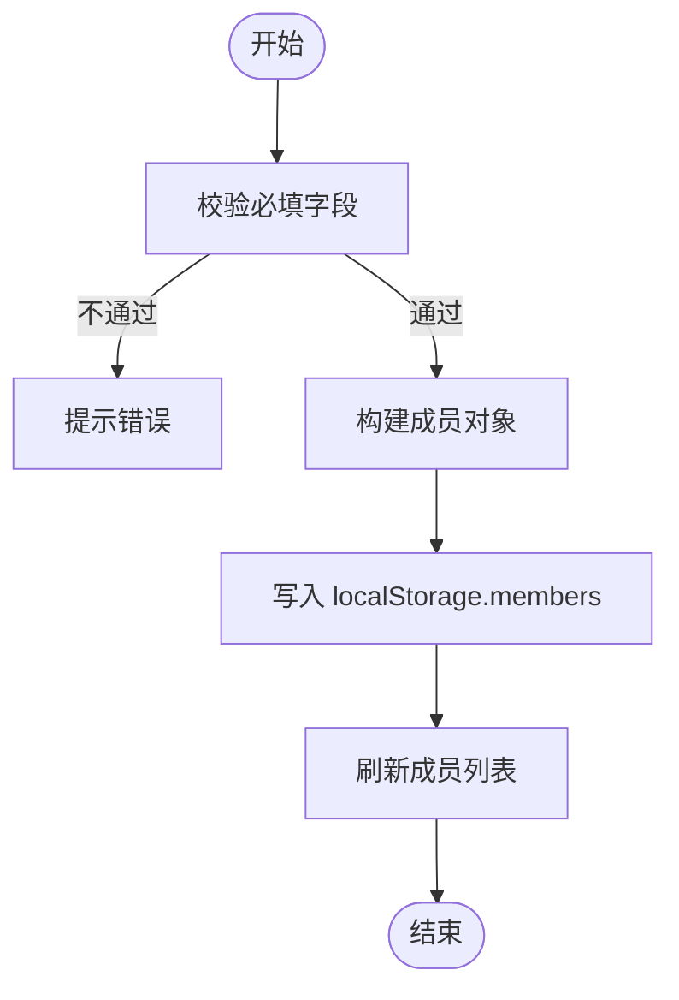
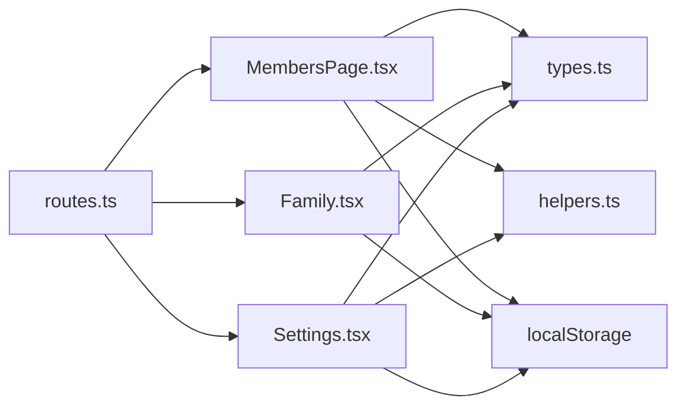

# 成员管理功能

<cite>
**本文引用的文件**
- [MembersPage.tsx](file://figma-ui/src/app/pages/MembersPage.tsx)
- [Family.tsx](file://figma-ui/src/app/pages/Family.tsx)
- [Settings.tsx](file://figma-ui/src/app/pages/Settings.tsx)
- [types.ts](file://figma-ui/src/app/types.ts)
- [helpers.ts](file://figma-ui/src/app/utils/helpers.ts)
- [mockData.ts](file://figma-ui/src/app/utils/mockData.ts)
- [routes.ts](file://figma-ui/src/app/routes.ts)
</cite>

## 目录
1. [简介](#简介)
2. [项目结构](#项目结构)
3. [核心组件](#核心组件)
4. [架构总览](#架构总览)
5. [详细组件分析](#详细组件分析)
6. [依赖关系分析](#依赖关系分析)
7. [性能考虑](#性能考虑)
8. [故障排查指南](#故障排查指南)
9. [结论](#结论)
10. [附录](#附录)

## 简介
本文件面向“医案通医疗档案网站”的成员管理功能，聚焦家庭成员的添加、删除、切换与权限共享等核心操作；说明成员数据结构设计（用户信息字段、角色权限模型、头像处理机制）；梳理成员列表渲染逻辑、搜索筛选与批量操作的实现现状；提供成员CRUD流程、表单验证与状态更新的代码级路径；解释成员关系管理与家庭树结构的现有实现与扩展建议。

## 项目结构
成员管理相关的前端页面与类型定义分布如下：
- 路由注册：在路由表中定义了 /members、/family、/settings 等入口
- 页面组件：
  - MembersPage：独立的成员管理页，支持添加、删除、切换当前成员
  - Family：家庭档案库视图，展示成员列表与共享权限面板（含二维码与共享密码）
  - Settings：设置中心中的“家庭成员管理”，支持添加、删除、切换当前成员
- 类型与工具：
  - types：成员、档案、OCR数据等类型定义
  - helpers：日期格式化、过期判断、ID生成等工具函数
  - mockData：初始化本地存储的示例档案数据

图表来源
- [routes.ts:25-75](file://figma-ui/src/app/routes.ts#L25-L75)
- [MembersPage.tsx:1-153](file://figma-ui/src/app/pages/MembersPage.tsx#L1-L153)
- [Family.tsx:1-106](file://figma-ui/src/app/pages/Family.tsx#L1-L106)
- [Settings.tsx:27-42](file://figma-ui/src/app/pages/Settings.tsx#L27-L42)

章节来源
- [routes.ts:25-75](file://figma-ui/src/app/routes.ts#L25-L75)

## 核心组件
- MembersPage：负责成员列表展示、添加成员表单、删除成员、切换当前成员并跳转首页
- Family：以卡片形式展示家庭成员，提供“成员列表”和“共享权限”两个Tab，包含二维码与共享密码展示
- Settings：在设置中提供“家庭成员管理”子视图，支持添加、删除、切换当前成员，并通过Toast反馈操作结果
- types：统一成员、档案、OCR等数据结构定义，保证跨页面类型一致
- helpers：提供日期格式化、过期判断、ID生成等通用能力
- mockData：为本地存储提供初始档案数据，便于演示与测试

章节来源
- [MembersPage.tsx:1-153](file://figma-ui/src/app/pages/MembersPage.tsx#L1-L153)
- [Family.tsx:1-106](file://figma-ui/src/app/pages/Family.tsx#L1-L106)
- [Settings.tsx:27-42](file://figma-ui/src/app/pages/Settings.tsx#L27-L42)
- [types.ts:1-95](file://figma-ui/src/app/types.ts#L1-L95)
- [helpers.ts:1-52](file://figma-ui/src/app/utils/helpers.ts#L1-L52)
- [mockData.ts:1-98](file://figma-ui/src/app/utils/mockData.ts#L1-L98)

## 架构总览
成员管理的整体数据流围绕“本地存储”展开：
- 成员数据存储在 localStorage 的 members 键下
- 当前成员ID存储在 currentMemberId 键下
- 档案数据存储在 archives 键下，通过 memberId 关联到成员
- 页面间通过路由切换，并在进入时从本地存储读取最新数据

图表来源
- [MembersPage.tsx:20-48](file://figma-ui/src/app/pages/MembersPage.tsx#L20-L48)
- [routes.ts:25-75](file://figma-ui/src/app/routes.ts#L25-L75)

章节来源
- [MembersPage.tsx:1-153](file://figma-ui/src/app/pages/MembersPage.tsx#L1-L153)
- [routes.ts:25-75](file://figma-ui/src/app/routes.ts#L25-L75)

## 详细组件分析

### 成员数据结构设计
- 成员对象（Member）
  - 字段：id、name、relation、gender、birthday、bloodType、allergies
  - 用途：标识成员身份、描述基本信息、记录健康相关属性
- 档案对象（Archive）
  - 字段：id、memberId、type、title、hospital、department、date、uploadDate、imageUrl、ocrData、tags、isFavorite、isDeleted
  - 用途：承载成员的各类医疗档案，并与成员通过 memberId 关联
- OCR数据（OCRData）
  - 字段：hospital、department、date、doctorName、diagnosis、items、prescription 等
  - 用途：结构化解析上传文档的关键信息
- 工具函数
  - formatDate、formatDateShort：日期本地化展示
  - isExpired、daysUntilExpiry：过期判断与剩余天数计算
  - generateId：生成唯一ID
  - maskPhone：手机号脱敏

章节来源
- [types.ts:1-95](file://figma-ui/src/app/types.ts#L1-L95)
- [helpers.ts:1-52](file://figma-ui/src/app/utils/helpers.ts#L1-L52)

### 成员CRUD操作与表单验证
- 添加成员
  - 入口：MembersPage 的 AddMemberForm 与 Settings 的成员管理视图
  - 验证：必填字段 name、relation 校验；未填写则提示
  - 提交：构造 Member 对象，追加到 members 数组并持久化到 localStorage
  - 反馈：Settings 使用 Toast 提示成功；MembersPage 直接刷新列表
- 删除成员
  - 保护：禁止删除本人（id === "1"）
  - 联动：删除成员时同时过滤其所有档案（archives 中 memberId 匹配项）
  - 反馈：MembersPage 使用 confirm 二次确认；Settings 使用 Toast 提示
- 切换当前成员
  - 写入 currentMemberId，并导航回首页或更新当前视图状态
  - 影响：后续档案加载、展示均基于当前成员ID进行过滤

图表来源
- [MembersPage.tsx:169-186](file://figma-ui/src/app/pages/MembersPage.tsx#L169-L186)
- [Settings.tsx:84-104](file://figma-ui/src/app/pages/Settings.tsx#L84-L104)

章节来源
- [MembersPage.tsx:155-294](file://figma-ui/src/app/pages/MembersPage.tsx#L155-L294)
- [Settings.tsx:84-126](file://figma-ui/src/app/pages/Settings.tsx#L84-L126)

### 成员列表渲染逻辑
- MembersPage
  - 从 localStorage 读取 members 并渲染卡片
  - 每个成员卡片显示姓名、关系、性别、生日、血型、档案数量
  - 操作按钮：“查看档案”（切换当前成员）、“删除”（非本人可删）
- Family
  - 使用模拟数据展示成员卡片，包含头像、年龄、最近就诊时间与健康提示
  - Tab切换：成员列表与共享权限
- Settings
  - 成员管理视图：显示成员列表，标记当前成员，支持添加与删除

章节来源
- [MembersPage.tsx:78-130](file://figma-ui/src/app/pages/MembersPage.tsx#L78-L130)
- [Family.tsx:108-168](file://figma-ui/src/app/pages/Family.tsx#L108-L168)
- [Settings.tsx:295-335](file://figma-ui/src/app/pages/Settings.tsx#L295-L335)

### 搜索筛选与批量操作
- 搜索筛选
  - 当前成员管理页面未实现搜索与筛选功能
  - 建议在成员列表顶部增加输入框，按姓名、关系、性别等条件过滤
- 批量操作
  - 当前未实现批量选择与批量删除
  - 建议增加多选模式，支持批量删除成员及其档案

[本节为概念性说明，不涉及具体文件]

### 角色权限模型与继承权限
- 角色与权限
  - Family 的“共享权限”Tab展示了“受邀查看者”“管理员”等角色与有效期
  - 当前实现为静态展示，未接入后端权限控制
- 继承权限
  - 当前未实现基于家庭树的权限继承逻辑
  - 建议：以“本人”为根节点，根据关系层级（如父母、子女）推导访问范围与编辑权限

章节来源
- [Family.tsx:169-218](file://figma-ui/src/app/pages/Family.tsx#L169-L218)

### 头像处理机制
- 展示
  - Family 使用外部图片URL作为头像
  - 提供 ImageWithFallback 组件用于图片加载失败时的降级展示
- 上传
  - 当前未实现头像上传与裁剪逻辑
  - 建议：引入文件选择与预览，上传后返回URL并缓存至本地或云端

章节来源
- [Family.tsx:127-133](file://figma-ui/src/app/pages/Family.tsx#L127-L133)
- [ImageWithFallback.tsx:1-27](file://figma-ui/src/app/components/figma/ImageWithFallback.tsx#L1-L27)

### 成员关系管理与家庭树结构
- 关系字段
  - Member.relation 表示与本人的关系（如父亲、母亲、配偶、子女、其他）
- 家庭树
  - 当前仅以扁平成员列表呈现，未构建父子关系图
  - 建议：维护 parent_id 或关系层级，支持可视化家庭树与权限继承

章节来源
- [types.ts:1-9](file://figma-ui/src/app/types.ts#L1-L9)
- [MembersPage.tsx:94-99](file://figma-ui/src/app/pages/MembersPage.tsx#L94-L99)

## 依赖关系分析
- 路由依赖
  - routes.ts 将 /members、/family、/settings 映射到对应页面组件
- 组件依赖
  - MembersPage、Family、Settings 均依赖 types.ts 中的 Member、Archive 等类型
  - MembersPage、Settings 依赖 localStorage 进行数据持久化
  - Family 依赖 motion/react 实现动画效果
- 工具依赖
  - helpers.ts 提供日期与ID工具函数
  - mockData.ts 提供初始档案数据

图表来源
- [routes.ts:25-75](file://figma-ui/src/app/routes.ts#L25-L75)
- [MembersPage.tsx:1-153](file://figma-ui/src/app/pages/MembersPage.tsx#L1-L153)
- [Family.tsx:1-106](file://figma-ui/src/app/pages/Family.tsx#L1-L106)
- [Settings.tsx:27-42](file://figma-ui/src/app/pages/Settings.tsx#L27-L42)
- [types.ts:1-95](file://figma-ui/src/app/types.ts#L1-L95)
- [helpers.ts:1-52](file://figma-ui/src/app/utils/helpers.ts#L1-L52)

章节来源
- [routes.ts:25-75](file://figma-ui/src/app/routes.ts#L25-L75)

## 性能考虑
- 本地存储读写
  - 频繁读写 localStorage 可能带来阻塞，建议合并写入或使用内存状态缓存后再落盘
- 列表渲染优化
  - 成员较多时建议使用虚拟滚动或分页加载
- 图片加载
  - 使用占位图与懒加载，避免首屏压力过大
- 动画与交互
  - Family 使用 motion 动画，注意在低端设备上减少复杂动画以提升流畅度

[本节为通用指导，不涉及具体文件]

## 故障排查指南
- 无法删除本人
  - 现象：删除本人被阻止
  - 原因：id === "1" 的保护逻辑
  - 解决：如需调整，请修改保护条件
- 删除成员后档案未清理
  - 现象：删除成员但档案仍存在
  - 原因：未同步过滤 archives
  - 解决：确保删除成员时同步过滤 memberId 匹配的档案
- 切换成员后数据未更新
  - 现象：切换成员但列表仍显示旧数据
  - 原因：未正确写入 currentMemberId 或未重新加载数据
  - 解决：检查写入逻辑与页面初始化读取逻辑

章节来源
- [MembersPage.tsx:27-43](file://figma-ui/src/app/pages/MembersPage.tsx#L27-L43)
- [Settings.tsx:106-126](file://figma-ui/src/app/pages/Settings.tsx#L106-L126)

## 结论
成员管理功能已具备基础的增删改查与切换能力，数据通过本地存储持久化，页面间通过路由与状态联动。当前版本尚未实现搜索筛选、批量操作、头像上传与完整的权限继承模型。建议优先完善搜索与批量操作，增强头像上传与预览体验，并设计基于家庭树的权限继承策略，以提升多成员场景下的可用性与安全性。

## 附录
- 关键API调用路径（前端侧）
  - 添加成员：MembersPage.AddMemberForm.handleSubmit -> localStorage.members
  - 删除成员：MembersPage.handleDeleteMember -> localStorage.members + localStorage.archives
  - 切换成员：MembersPage.handleSwitchMember -> localStorage.currentMemberId + 路由导航
- 表单验证流程
  - 必填字段校验（name、relation），未通过则提示错误
- 状态更新机制
  - 通过 useState 更新本地状态，并同步写入 localStorage 以保持跨页面一致性

章节来源
- [MembersPage.tsx:20-48](file://figma-ui/src/app/pages/MembersPage.tsx#L20-L48)
- [MembersPage.tsx:169-186](file://figma-ui/src/app/pages/MembersPage.tsx#L169-L186)
- [Settings.tsx:84-126](file://figma-ui/src/app/pages/Settings.tsx#L84-L126)