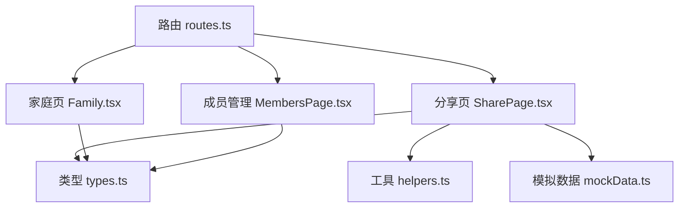
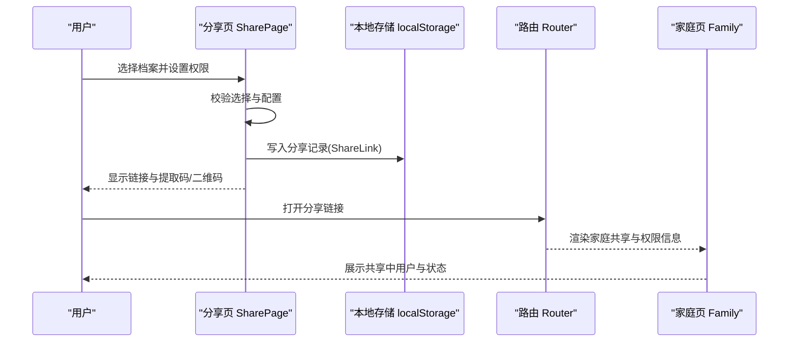
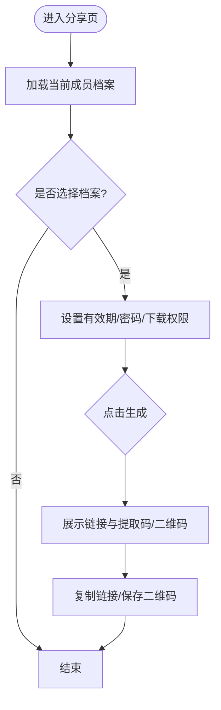
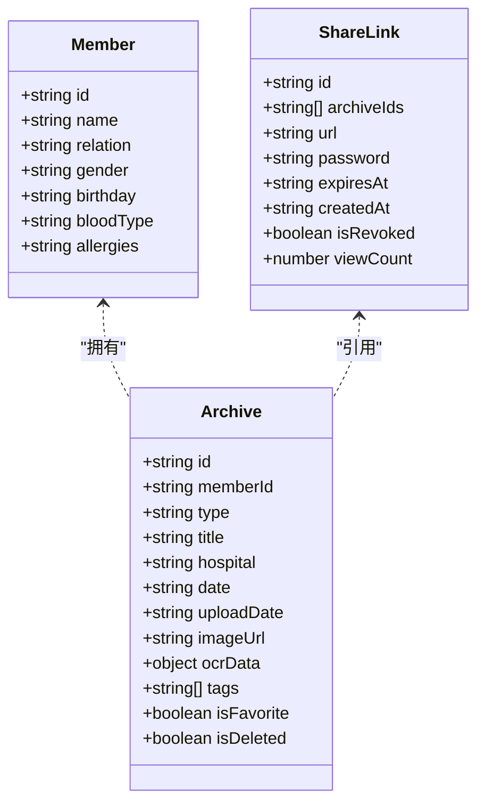
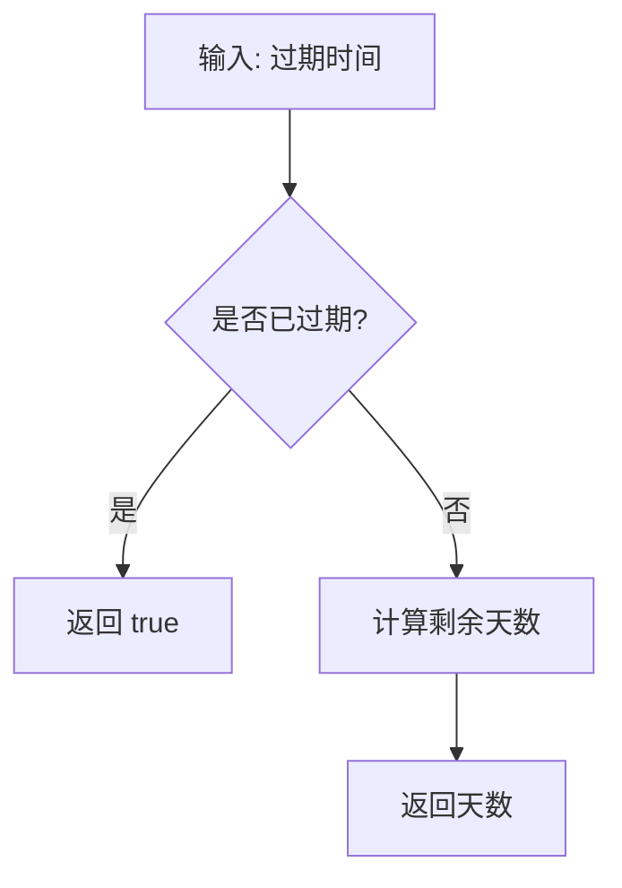
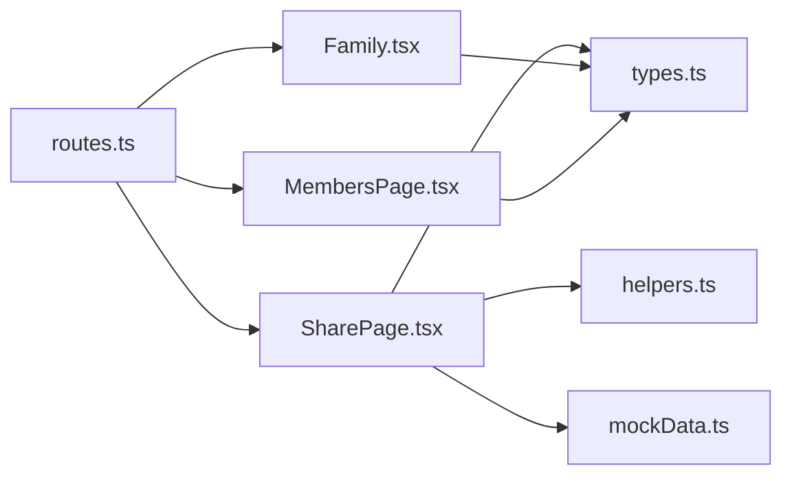

# 数据共享功能

<cite>
**本文引用的文件**
- [SharePage.tsx](file://figma-ui/src/app/pages/SharePage.tsx)
- [Family.tsx](file://figma-ui/src/app/pages/Family.tsx)
- [types.ts](file://figma-ui/src/app/types.ts)
- [helpers.ts](file://figma-ui/src/app/utils/helpers.ts)
- [mockData.ts](file://figma-ui/src/app/utils/mockData.ts)
- [routes.ts](file://figma-ui/src/app/routes.ts)
- [MembersPage.tsx](file://figma-ui/src/app/pages/MembersPage.tsx)
- [Layout.tsx](file://figma-ui/src/app/components/Layout.tsx)
- [需求.md](file://figma-ui/src/imports/需求.md)
</cite>

## 目录
1. [简介](#简介)
2. [项目结构](#项目结构)
3. [核心组件](#核心组件)
4. [架构总览](#架构总览)
5. [详细组件分析](#详细组件分析)
6. [依赖关系分析](#依赖关系分析)
7. [性能考虑](#性能考虑)
8. [故障排查指南](#故障排查指南)
9. [结论](#结论)
10. [附录](#附录)

## 简介
本文件面向医案通医疗档案网站的数据共享能力，聚焦以下目标：
- 家庭共享码生成、二维码绑定与数据同步机制
- 共享范围控制、文件访问权限与数据版本管理
- 共享邀请流程、接受确认机制与共享状态监控
- 代码级示例路径（共享码生成算法、WebSocket 实时同步、冲突检测）
- 数据加密传输、隐私保护策略与共享历史记录追踪

说明：当前仓库为前端原型实现，部分后端能力（如 WebSocket 同步、服务端加密存储）以“待实现”形式给出设计建议与集成点。

## 项目结构
围绕数据共享的前端入口与页面组织如下：
- 路由层：通过 createHashRouter 注册页面路由，包含分享页、家庭页等
- 页面层：
  - 分享页 SharePage：选择档案、设置有效期/密码/下载权限、生成链接与二维码
  - 家庭页 Family：展示家庭共享码、成员列表与共享权限管理
  - 成员管理 MembersPage：成员增删改查与切换当前成员
- 类型与工具：
  - types：定义 Archive、ShareLink 等数据结构
  - helpers：日期格式化、过期判断、ID 生成等通用方法
  - mockData：本地初始化模拟数据（含档案）

图表来源
- [routes.ts:24-43](file://figma-ui/src/app/routes.ts#L24-L43)
- [SharePage.tsx:1-264](file://figma-ui/src/app/pages/SharePage.tsx#L1-L264)
- [Family.tsx:1-224](file://figma-ui/src/app/pages/Family.tsx#L1-L224)
- [MembersPage.tsx:1-294](file://figma-ui/src/app/pages/MembersPage.tsx#L1-L294)
- [types.ts:11-72](file://figma-ui/src/app/types.ts#L11-L72)
- [helpers.ts:21-51](file://figma-ui/src/app/utils/helpers.ts#L21-L51)
- [mockData.ts:1-98](file://figma-ui/src/app/utils/mockData.ts#L1-L98)

章节来源
- [routes.ts:24-43](file://figma-ui/src/app/routes.ts#L24-L43)
- [SharePage.tsx:1-264](file://figma-ui/src/app/pages/SharePage.tsx#L1-L264)
- [Family.tsx:1-224](file://figma-ui/src/app/pages/Family.tsx#L1-L224)
- [MembersPage.tsx:1-294](file://figma-ui/src/app/pages/MembersPage.tsx#L1-L294)
- [types.ts:11-72](file://figma-ui/src/app/types.ts#L11-L72)
- [helpers.ts:21-51](file://figma-ui/src/app/utils/helpers.ts#L21-L51)
- [mockData.ts:1-98](file://figma-ui/src/app/utils/mockData.ts#L1-L98)

## 核心组件
- 分享页（SharePage）
  - 功能：选择档案、配置有效期/密码/下载权限、生成分享链接与二维码、复制链接与保存二维码
  - 关键状态：已选档案集合、分享配置（expireIn、needPassword、allowDownload）、生成结果态
- 家庭页（Family）
  - 功能：展示家庭共享码、更新二维码、查看当前共享用户及角色/有效期
- 类型定义（types）
  - 档案模型 Archive、分享链接模型 ShareLink（id、archiveIds、url、password、expiresAt、createdAt、isRevoked、viewCount）
- 工具函数（helpers）
  - 过期判断 isExpired、剩余天数 daysUntilExpiry、随机 ID generateId
- 模拟数据（mockData）
  - 初始化本地 localStorage 中的档案数据，便于演示

章节来源
- [SharePage.tsx:6-45](file://figma-ui/src/app/pages/SharePage.tsx#L6-L45)
- [Family.tsx:169-217](file://figma-ui/src/app/pages/Family.tsx#L169-L217)
- [types.ts:11-72](file://figma-ui/src/app/types.ts#L11-L72)
- [helpers.ts:21-51](file://figma-ui/src/app/utils/helpers.ts#L21-L51)
- [mockData.ts:91-98](file://figma-ui/src/app/utils/mockData.ts#L91-L98)

## 架构总览
从用户操作到数据落地的端到端流程（前端视角）：
- 用户在分享页选择档案并设置权限
- 前端校验与计算有效期、生成分享链接与提取码
- 将分享记录写入本地存储（或后续对接后端持久化）
- 在家庭页展示共享码与共享成员状态
- 通过路由进入分享详情页进行查看/下载（受权限控制）

图表来源
- [SharePage.tsx:17-45](file://figma-ui/src/app/pages/SharePage.tsx#L17-L45)
- [routes.ts:24-43](file://figma-ui/src/app/routes.ts#L24-L43)
- [Family.tsx:169-217](file://figma-ui/src/app/pages/Family.tsx#L169-L217)
- [types.ts:63-72](file://figma-ui/src/app/types.ts#L63-L72)

## 详细组件分析

### 分享页（SharePage）
- 档案选择与过滤
  - 根据 currentMemberId 过滤出当前成员的未删除档案
- 权限设置
  - 有效期：1天/7天/30天/永久
  - 密码保护：是否启用提取码
  - 允许下载：是否允许查看者下载原件
- 生成分享
  - 点击生成后进入结果视图，展示链接与提取码（若开启）
  - 提供复制链接与保存二维码按钮

图表来源
- [SharePage.tsx:17-45](file://figma-ui/src/app/pages/SharePage.tsx#L17-L45)
- [SharePage.tsx:117-178](file://figma-ui/src/app/pages/SharePage.tsx#L117-L178)
- [SharePage.tsx:181-259](file://figma-ui/src/app/pages/SharePage.tsx#L181-L259)

章节来源
- [SharePage.tsx:17-45](file://figma-ui/src/app/pages/SharePage.tsx#L17-L45)
- [SharePage.tsx:117-178](file://figma-ui/src/app/pages/SharePage.tsx#L117-L178)
- [SharePage.tsx:181-259](file://figma-ui/src/app/pages/SharePage.tsx#L181-L259)

### 家庭共享码与成员管理（Family / MembersPage）
- 家庭共享码
  - 展示共享码与掩码后的密码片段
  - 支持更新二维码
  - 列出当前共享中的用户及其角色与有效期
- 成员管理
  - 添加/删除成员，切换当前成员
  - 删除成员时联动清理其档案

图表来源
- [types.ts:1-72](file://figma-ui/src/app/types.ts#L1-L72)
- [Family.tsx:169-217](file://figma-ui/src/app/pages/Family.tsx#L169-L217)
- [MembersPage.tsx:15-48](file://figma-ui/src/app/pages/MembersPage.tsx#L15-L48)

章节来源
- [Family.tsx:169-217](file://figma-ui/src/app/pages/Family.tsx#L169-L217)
- [MembersPage.tsx:15-48](file://figma-ui/src/app/pages/MembersPage.tsx#L15-L48)
- [types.ts:1-72](file://figma-ui/src/app/types.ts#L1-L72)

### 数据模型与工具
- 数据模型
  - Archive：档案元数据与 OCR 结构化数据
  - ShareLink：分享链接的生命周期与访问统计
- 工具函数
  - isExpired：判断链接是否过期
  - daysUntilExpiry：计算剩余天数
  - generateId：生成唯一标识

图表来源
- [helpers.ts:21-51](file://figma-ui/src/app/utils/helpers.ts#L21-L51)

章节来源
- [helpers.ts:21-51](file://figma-ui/src/app/utils/helpers.ts#L21-L51)
- [types.ts:11-72](file://figma-ui/src/app/types.ts#L11-L72)

## 依赖关系分析
- 路由依赖
  - 通过 createHashRouter 挂载各页面，包括分享页与家庭页
- 页面依赖
  - SharePage 依赖 types 的 Archive/ShareLink，使用 helpers 的日期与过期工具
  - Family 展示共享码与成员状态，依赖 types 的成员与分享模型
  - MembersPage 维护成员与档案的本地存储一致性
- 外部依赖
  - 图标库 lucide-react、动画 motion/react 用于交互体验

图表来源
- [routes.ts:24-43](file://figma-ui/src/app/routes.ts#L24-L43)
- [SharePage.tsx:1-264](file://figma-ui/src/app/pages/SharePage.tsx#L1-L264)
- [Family.tsx:1-224](file://figma-ui/src/app/pages/Family.tsx#L1-L224)
- [MembersPage.tsx:1-294](file://figma-ui/src/app/pages/MembersPage.tsx#L1-L294)
- [types.ts:1-72](file://figma-ui/src/app/types.ts#L1-L72)
- [helpers.ts:21-51](file://figma-ui/src/app/utils/helpers.ts#L21-L51)
- [mockData.ts:1-98](file://figma-ui/src/app/utils/mockData.ts#L1-L98)

章节来源
- [routes.ts:24-43](file://figma-ui/src/app/routes.ts#L24-L43)
- [SharePage.tsx:1-264](file://figma-ui/src/app/pages/SharePage.tsx#L1-L264)
- [Family.tsx:1-224](file://figma-ui/src/app/pages/Family.tsx#L1-L224)
- [MembersPage.tsx:1-294](file://figma-ui/src/app/pages/MembersPage.tsx#L1-L294)
- [types.ts:1-72](file://figma-ui/src/app/types.ts#L1-L72)
- [helpers.ts:21-51](file://figma-ui/src/app/utils/helpers.ts#L21-L51)
- [mockData.ts:1-98](file://figma-ui/src/app/utils/mockData.ts#L1-L98)

## 性能考虑
- 本地存储读写
  - 避免频繁序列化/反序列化，批量更新时合并写入
- 列表渲染优化
  - 对档案列表进行分页或虚拟滚动（当档案数量增长时）
- 图片与OCR数据
  - 大图懒加载，OCR 结果按需解析
- 权限校验
  - 在前端做快速拦截，减少无效请求；服务端需再次校验

[本节为通用指导，不直接分析具体文件]

## 故障排查指南
- 无法生成分享链接
  - 检查是否选择了至少一份档案
  - 检查当前成员是否存在且档案未被标记删除
- 链接失效
  - 使用 isExpired 判断是否过期
  - 检查 ShareLink.expiresAt 是否正确设置
- 成员删除导致数据不一致
  - 删除成员时需同时清理其档案，确保 localStorage 中 archives 与 members 一致
- 二维码无法更新
  - 检查 Family 页面的更新按钮逻辑，确保重新生成共享码并刷新展示

章节来源
- [SharePage.tsx:32-45](file://figma-ui/src/app/pages/SharePage.tsx#L32-L45)
- [helpers.ts:21-51](file://figma-ui/src/app/utils/helpers.ts#L21-L51)
- [MembersPage.tsx:27-43](file://figma-ui/src/app/pages/MembersPage.tsx#L27-L43)
- [Family.tsx:169-217](file://figma-ui/src/app/pages/Family.tsx#L169-L217)

## 结论
当前前端实现了数据共享的核心交互：档案选择、权限配置、链接与二维码生成、家庭共享码展示与成员管理。后端侧的 WebSocket 实时同步、服务端加密与冲突检测尚未实现，但已在类型与流程上预留扩展点。建议在后续迭代中完善：
- 服务端持久化 ShareLink 与访问审计
- WebSocket 推送共享状态变更与冲突解决
- 端到端加密与最小权限原则落地

[本节为总结性内容，不直接分析具体文件]

## 附录

### 共享邀请流程与接受确认机制（设计建议）
- 邀请方：在分享页生成链接与提取码，可附加有效期与权限
- 受邀方：打开链接后输入提取码，系统校验通过后建立共享关系
- 接受确认：受邀方确认后，邀请方收到通知并可撤销授权
- 状态监控：共享列表中展示受邀方角色与有效期，支持一键撤销

[本节为概念性流程，不直接映射到具体源码]

### 数据加密传输与隐私保护策略（设计建议）
- 传输安全：全站 HTTPS，敏感字段（提取码、档案内容）采用端到端加密
- 存储安全：服务端对分享链接与档案内容进行加密存储，仅授权方可解密
- 权限最小化：默认禁止下载，按需开启；支持按档案粒度控制访问
- 审计日志：记录分享创建、访问、下载、撤销等操作，便于追溯

[本节为概念性策略，不直接映射到具体源码]

### 共享历史记录追踪（设计建议）
- 记录项：分享链接、创建时间、有效期、访问次数、是否撤销、访问者身份（脱敏）
- 查询与导出：支持按时间范围与成员维度查询，支持导出审计报表
- 合规要求：满足医疗数据访问审计与留存要求

[本节为概念性规范，不直接映射到具体源码]

### 代码示例路径（参考）
- 共享码生成算法
  - 链接与提取码生成：见分享页生成结果展示与复制逻辑
  - 参考路径：[SharePage.tsx:181-259](file://figma-ui/src/app/pages/SharePage.tsx#L181-L259)
- WebSocket 实时同步（待实现）
  - 建议接入点：分享状态变更、成员加入/退出、权限调整
  - 参考路径：[routes.ts:24-43](file://figma-ui/src/app/routes.ts#L24-L43)、[Family.tsx:169-217](file://figma-ui/src/app/pages/Family.tsx#L169-L217)
- 冲突检测算法（待实现）
  - 建议策略：基于版本号与时间戳的乐观锁，合并策略优先保留最新修改
  - 参考路径：[types.ts:11-72](file://figma-ui/src/app/types.ts#L11-L72)、[helpers.ts:21-51](file://figma-ui/src/app/utils/helpers.ts#L21-L51)

章节来源
- [SharePage.tsx:181-259](file://figma-ui/src/app/pages/SharePage.tsx#L181-L259)
- [routes.ts:24-43](file://figma-ui/src/app/routes.ts#L24-L43)
- [Family.tsx:169-217](file://figma-ui/src/app/pages/Family.tsx#L169-L217)
- [types.ts:11-72](file://figma-ui/src/app/types.ts#L11-L72)
- [helpers.ts:21-51](file://figma-ui/src/app/utils/helpers.ts#L21-L51)

### 需求对齐
- 分享与授权能力与验收标准
  - 支持多份档案生成分享链接、设置有效期、可选访问密码、限制下载、医生端查看优化、随时撤销分享
  - 参考路径：[需求.md:333-342](file://figma-ui/src/imports/需求.md#L333-L342)

章节来源
- [需求.md:333-342](file://figma-ui/src/imports/需求.md#L333-L342)