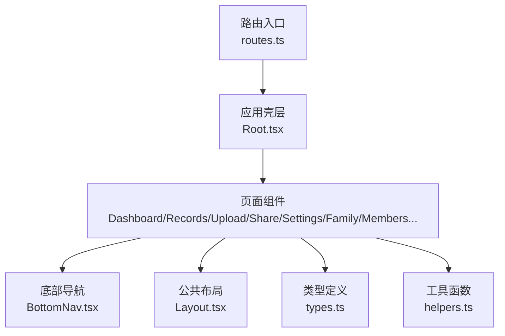
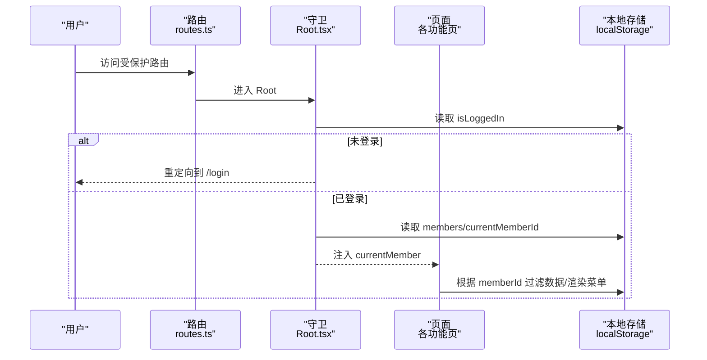
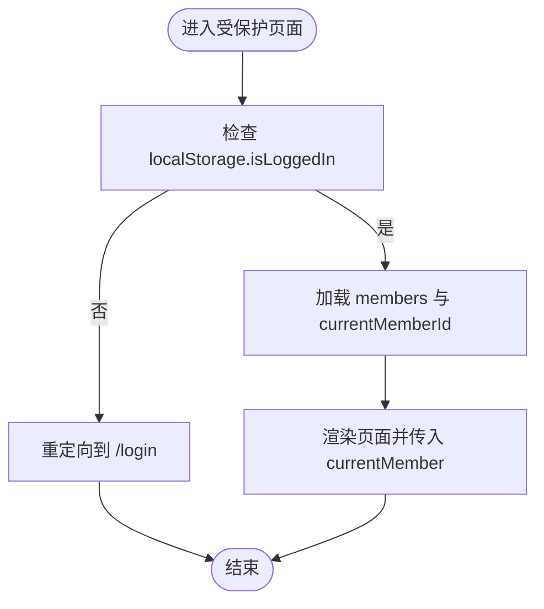
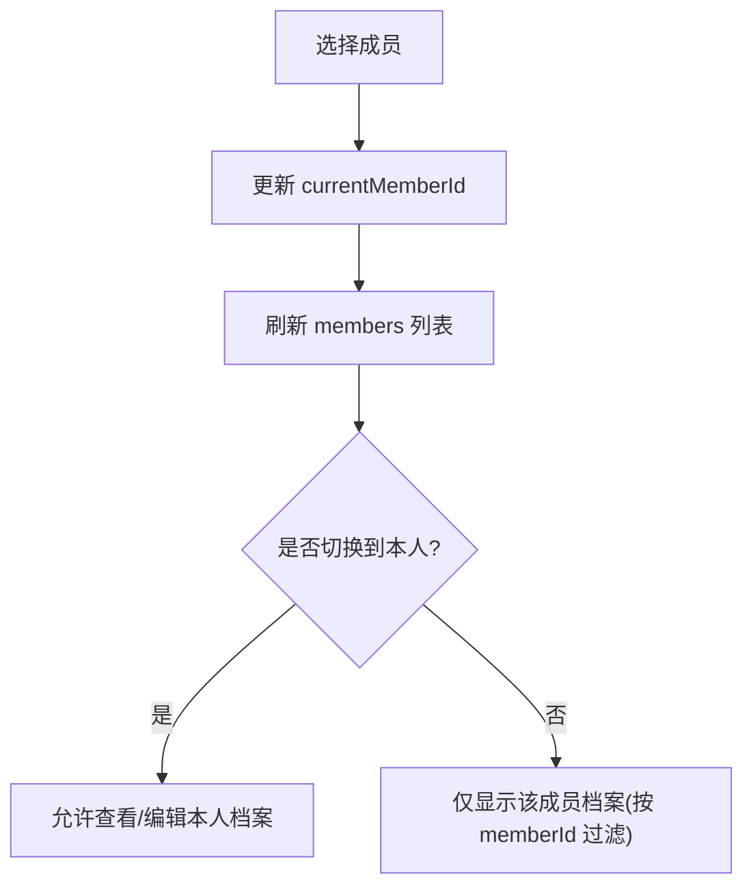
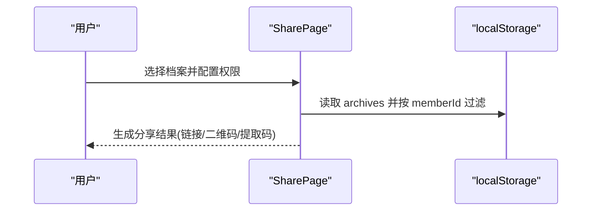
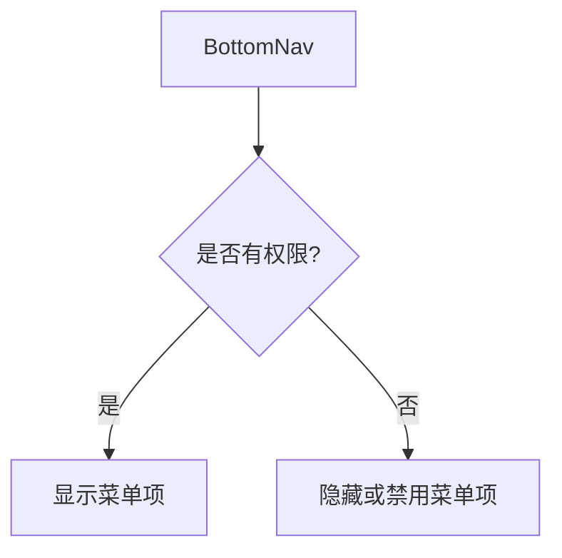
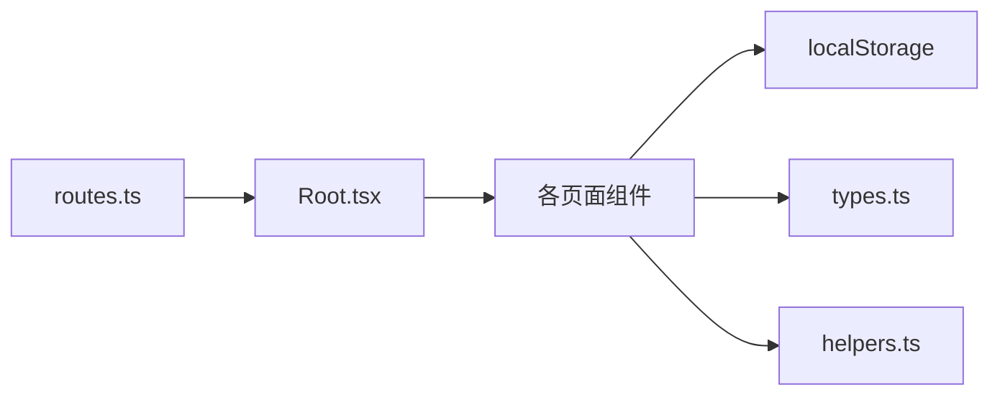

# 权限控制机制

<cite>
**本文引用的文件**
- [routes.ts](file://figma-ui/src/app/routes.ts)
- [Root.tsx](file://figma-ui/src/app/Root.tsx)
- [Login.tsx](file://figma-ui/src/app/pages/Login.tsx)
- [LoginPage.tsx](file://figma-ui/src/app/pages/LoginPage.tsx)
- [Layout.tsx](file://figma-ui/src/app/components/Layout.tsx)
- [BottomNav.tsx](file://figma-ui/src/app/components/BottomNav.tsx)
- [MembersPage.tsx](file://figma-ui/src/app/pages/MembersPage.tsx)
- [Family.tsx](file://figma-ui/src/app/pages/Family.tsx)
- [SharePage.tsx](file://figma-ui/src/app/pages/SharePage.tsx)
- [types.ts](file://figma-ui/src/app/types.ts)
- [helpers.ts](file://figma-ui/src/app/utils/helpers.ts)
</cite>

## 目录
1. [简介](#简介)
2. [项目结构](#项目结构)
3. [核心组件](#核心组件)
4. [架构总览](#架构总览)
5. [详细组件分析](#详细组件分析)
6. [依赖关系分析](#依赖关系分析)
7. [性能与安全考量](#性能与安全考量)
8. [故障排查指南](#故障排查指南)
9. [结论](#结论)
10. [附录](#附录)

## 简介
本文件面向医案通医疗档案网站的前端权限控制机制，聚焦基于角色的访问控制（RBAC）在现有代码中的实现现状、可扩展点与落地建议。当前仓库实现了基础的登录态校验、成员切换与共享链接配置等能力；尚未发现服务端鉴权与细粒度 RBAC 的完整实现。本文在尊重现有代码的前提下，梳理已实现的权限相关流程，并给出角色矩阵、共享权限、访问范围、继承规则、验证流程、安全策略、审计日志以及实时同步与冲突解决的可扩展设计方案，帮助后续迭代完善。

## 项目结构
前端采用 React Router 进行路由管理，通过根组件 Root 做登录态守卫，页面级组件负责具体业务与局部权限控制（如成员切换、分享配置）。类型定义集中在 types.ts，工具函数集中在 helpers.ts。

图表来源
- [routes.ts:25-106](file://figma-ui/src/app/routes.ts#L25-L106)
- [Root.tsx:6-59](file://figma-ui/src/app/Root.tsx#L6-L59)
- [BottomNav.tsx:5-85](file://figma-ui/src/app/components/BottomNav.tsx#L5-L85)
- [Layout.tsx:10-251](file://figma-ui/src/app/components/Layout.tsx#L10-L251)
- [types.ts:1-95](file://figma-ui/src/app/types.ts#L1-L95)
- [helpers.ts:1-52](file://figma-ui/src/app/utils/helpers.ts#L1-L52)

章节来源
- [routes.ts:25-106](file://figma-ui/src/app/routes.ts#L25-L106)
- [Root.tsx:6-59](file://figma-ui/src/app/Root.tsx#L6-L59)

## 核心组件
- 登录与认证：Login.tsx、LoginPage.tsx 负责手机号+验证码登录流程，成功后写入本地登录态。
- 路由守卫：Root.tsx 在进入受保护路由前检查登录态，未登录则跳转至 /login。
- 成员上下文：Root.tsx 从 localStorage 加载 members 与 currentMemberId，并通过 Outlet context 向子页面传递当前成员信息。
- 成员管理：MembersPage.tsx 提供添加、删除、切换成员的能力，并对“本人”成员做保护性限制。
- 家庭与共享：Family.tsx 展示家庭成员列表与共享权限界面（含共享码与受邀用户），SharePage.tsx 提供按成员筛选可分享档案、设置有效期/密码/下载权限并生成分享结果。
- 类型与工具：types.ts 定义了 Member、Archive、ShareLink 等数据结构；helpers.ts 提供日期格式化、过期判断、ID 生成等工具。

章节来源
- [Login.tsx:12-34](file://figma-ui/src/app/pages/Login.tsx#L12-L34)
- [LoginPage.tsx:5-50](file://figma-ui/src/app/pages/LoginPage.tsx#L5-L50)
- [Root.tsx:6-59](file://figma-ui/src/app/Root.tsx#L6-L59)
- [MembersPage.tsx:6-153](file://figma-ui/src/app/pages/MembersPage.tsx#L6-L153)
- [Family.tsx:57-224](file://figma-ui/src/app/pages/Family.tsx#L57-L224)
- [SharePage.tsx:6-264](file://figma-ui/src/app/pages/SharePage.tsx#L6-L264)
- [types.ts:1-95](file://figma-ui/src/app/types.ts#L1-L95)
- [helpers.ts:1-52](file://figma-ui/src/app/utils/helpers.ts#L1-L52)

## 架构总览
下图展示了从路由到页面再到数据源的权限相关调用链。当前实现以本地存储为权限状态载体，未引入服务端鉴权中间件。

图表来源
- [routes.ts:25-106](file://figma-ui/src/app/routes.ts#L25-L106)
- [Root.tsx:10-46](file://figma-ui/src/app/Root.tsx#L10-L46)

## 详细组件分析

### 登录与认证流程
- 登录表单：支持手机号与验证码输入，提交后写入 isLoggedIn 并跳转首页。
- 登录态守卫：Root 在挂载时检查 isLoggedIn，未登录强制跳转到 /login。
- 多入口兼容：存在两个登录页面组件，均使用相同本地存储键名，保证一致性。

图表来源
- [Root.tsx:10-46](file://figma-ui/src/app/Root.tsx#L10-L46)
- [Login.tsx:18-27](file://figma-ui/src/app/pages/Login.tsx#L18-L27)
- [LoginPage.tsx:31-50](file://figma-ui/src/app/pages/LoginPage.tsx#L31-L50)

章节来源
- [Login.tsx:12-34](file://figma-ui/src/app/pages/Login.tsx#L12-L34)
- [LoginPage.tsx:5-50](file://figma-ui/src/app/pages/LoginPage.tsx#L5-L50)
- [Root.tsx:6-59](file://figma-ui/src/app/Root.tsx#L6-L59)

### 成员切换与访问范围
- 成员数据：members 数组存储在 localStorage，currentMemberId 标识当前操作主体。
- 切换逻辑：MembersPage 中切换成员会更新 currentMemberId 并回到首页；其他页面依据 memberId 过滤档案。
- 访问范围：SharePage 仅列出当前成员的未删除档案；Family 展示家庭成员及共享状态。

图表来源
- [MembersPage.tsx:45-48](file://figma-ui/src/app/pages/MembersPage.tsx#L45-L48)
- [SharePage.tsx:17-24](file://figma-ui/src/app/pages/SharePage.tsx#L17-L24)

章节来源
- [MembersPage.tsx:6-153](file://figma-ui/src/app/pages/MembersPage.tsx#L6-L153)
- [SharePage.tsx:17-24](file://figma-ui/src/app/pages/SharePage.tsx#L17-L24)

### 共享权限与访问控制
- 分享配置：SharePage 支持设置有效期、密码保护、是否允许下载。
- 共享码：Family 展示家庭共享码与受邀用户列表，体现“邀请-授权-有效期”的协作模型。
- 数据隔离：分享前仅能选择当前成员下的档案，避免越权。

图表来源
- [SharePage.tsx:6-264](file://figma-ui/src/app/pages/SharePage.tsx#L6-L264)
- [Family.tsx:169-223](file://figma-ui/src/app/pages/Family.tsx#L169-L223)

章节来源
- [SharePage.tsx:6-264](file://figma-ui/src/app/pages/SharePage.tsx#L6-L264)
- [Family.tsx:57-224](file://figma-ui/src/app/pages/Family.tsx#L57-L224)

### 动态菜单与路由可见性
- 底部导航：BottomNav 固定展示常用入口，可根据需要结合角色进行条件渲染。
- 顶部导航：Layout 用于站点首页导航，非应用内权限控制重点。
- 扩展建议：可在 BottomNav 中根据角色隐藏/显示特定入口（如“上传”、“分享”、“设置”）。

图表来源
- [BottomNav.tsx:5-85](file://figma-ui/src/app/components/BottomNav.tsx#L5-L85)

章节来源
- [BottomNav.tsx:5-85](file://figma-ui/src/app/components/BottomNav.tsx#L5-L85)
- [Layout.tsx:10-251](file://figma-ui/src/app/components/Layout.tsx#L10-L251)

### 类型与数据结构
- Member：成员基本信息，用于身份与数据归属。
- Archive：档案元数据，包含所属成员、类型、标签、收藏与删除标记。
- ShareLink：分享链接元数据，包含关联档案、密码、有效期、撤销状态、浏览量等。
- 工具：helpers 提供日期格式化、过期判断、ID 生成、脱敏等通用能力。

章节来源
- [types.ts:1-95](file://figma-ui/src/app/types.ts#L1-L95)
- [helpers.ts:1-52](file://figma-ui/src/app/utils/helpers.ts#L1-L52)

## 依赖关系分析
- 路由层：routes.ts 声明所有页面路由，未内置路由守卫，统一由 Root.tsx 处理登录态。
- 组件层：Root.tsx 作为受保护路由的容器，向下注入 currentMember；各页面组件依赖 localStorage 读写成员与档案数据。
- 数据层：无后端服务，权限状态与业务数据全部保存在浏览器本地存储。

图表来源
- [routes.ts:25-106](file://figma-ui/src/app/routes.ts#L25-L106)
- [Root.tsx:6-59](file://figma-ui/src/app/Root.tsx#L6-L59)

章节来源
- [routes.ts:25-106](file://figma-ui/src/app/routes.ts#L25-L106)
- [Root.tsx:6-59](file://figma-ui/src/app/Root.tsx#L6-L59)

## 性能与安全考量
- 性能
  - 本地存储读写频繁：建议在关键路径减少重复解析 JSON，必要时对 members/archives 做内存缓存。
  - 列表过滤：SharePage 每次进入都会重新过滤当前成员档案，可考虑在成员切换时预计算。
- 安全
  - 当前仅前端校验登录态，易被绕过；需在后端接口层增加鉴权与数据隔离。
  - 分享链接的有效期与密码在前端配置，但实际生效需后端校验；否则存在伪造风险。
  - 敏感信息（如手机号）应使用脱敏展示，避免明文暴露。

[本节为通用指导，不直接分析具体文件]

## 故障排查指南
- 登录后无法进入主页
  - 检查 localStorage 中 isLoggedIn 是否写入成功。
  - 确认 Root 的重定向逻辑是否正确执行。
- 成员切换无效
  - 检查 MembersPage 是否正确更新 currentMemberId。
  - 确认其他页面是否基于 memberId 正确过滤数据。
- 分享链接无效
  - 检查 SharePage 配置的有效期与密码是否生效。
  - 确认后端（若接入）是否校验了链接有效性、密码与下载权限。

章节来源
- [Root.tsx:10-46](file://figma-ui/src/app/Root.tsx#L10-L46)
- [MembersPage.tsx:45-48](file://figma-ui/src/app/pages/MembersPage.tsx#L45-L48)
- [SharePage.tsx:17-24](file://figma-ui/src/app/pages/SharePage.tsx#L17-L24)

## 结论
当前仓库实现了基础的前端登录态校验、成员切换与分享配置，具备构建 RBAC 的良好起点。建议后续补充：
- 明确角色体系（管理员、查看者、编辑者）与权限矩阵，并在路由与菜单层实施控制。
- 将权限状态与服务端对接，确保接口级鉴权与数据隔离。
- 建立共享权限的持久化与审计日志，记录授权、撤销与访问行为。
- 设计权限变更通知与实时同步机制，提升多端协作体验。

[本节为总结性内容，不直接分析具体文件]

## 附录

### 角色与权限矩阵（建议方案）
- 管理员
  - 可管理成员、分配角色、修改共享权限、撤销分享链接、查看审计日志。
- 编辑者
  - 可编辑与上传本人/授权范围内的档案，可创建分享链接（受限于有效期与下载权限）。
- 查看者
  - 仅可查看授权范围内的档案与历史，不可编辑或删除。

[本节为概念性说明，不直接分析具体文件]

### 共享权限与访问范围（建议方案）
- 共享范围：按成员维度隔离数据，分享链接仅包含指定 archiveIds。
- 访问控制：链接需携带有效 token/密码，后端校验有效期与下载权限。
- 继承规则：子资源（如附件）继承父资源的访问控制；新增资源默认继承所属成员的权限。

[本节为概念性说明，不直接分析具体文件]

### 权限验证流程（建议方案）
- 前端：路由守卫检查登录态与角色；菜单与按钮按角色显隐。
- 后端：每个接口校验用户身份、角色与资源归属；返回最小可用数据集。
- 审计：记录登录、授权、访问、撤销等操作，便于追溯。

[本节为概念性说明，不直接分析具体文件]

### 权限变更通知与实时同步（建议方案）
- 事件源：WebSocket 或 Server-Sent Events 推送权限变更。
- 客户端：监听事件后刷新本地权限缓存与 UI。
- 冲突解决：以服务器时间戳为准，合并冲突；保留操作日志以便回滚。

[本节为概念性说明，不直接分析具体文件]