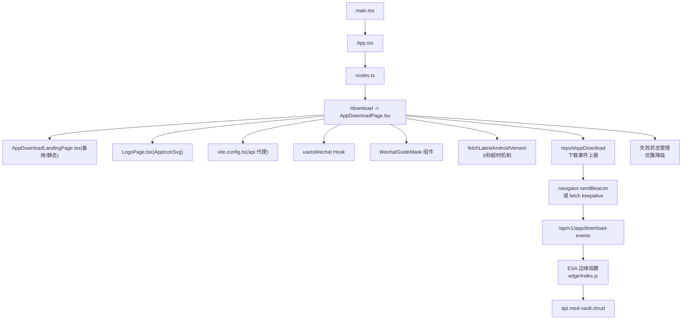
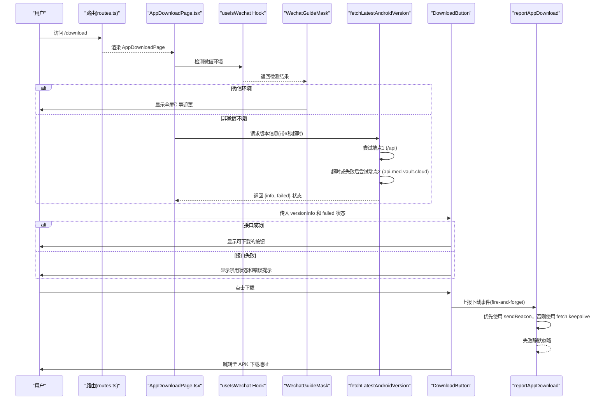
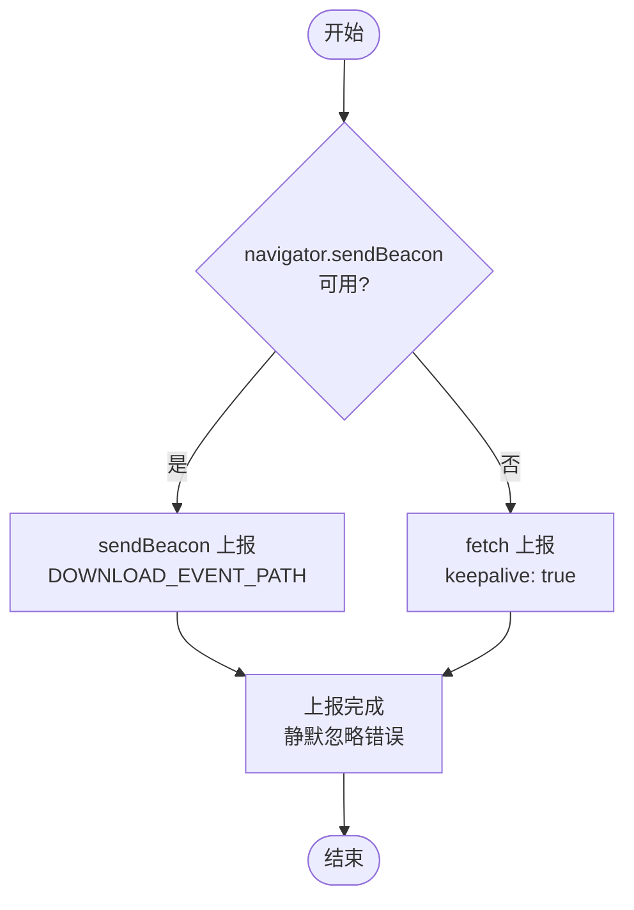
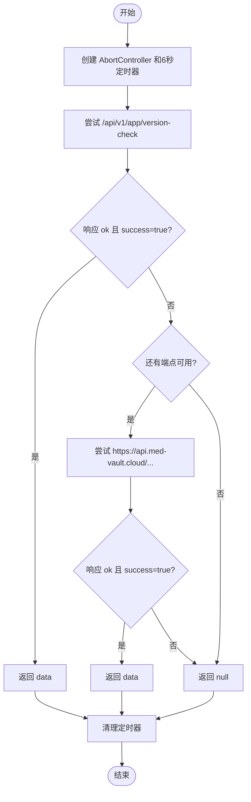
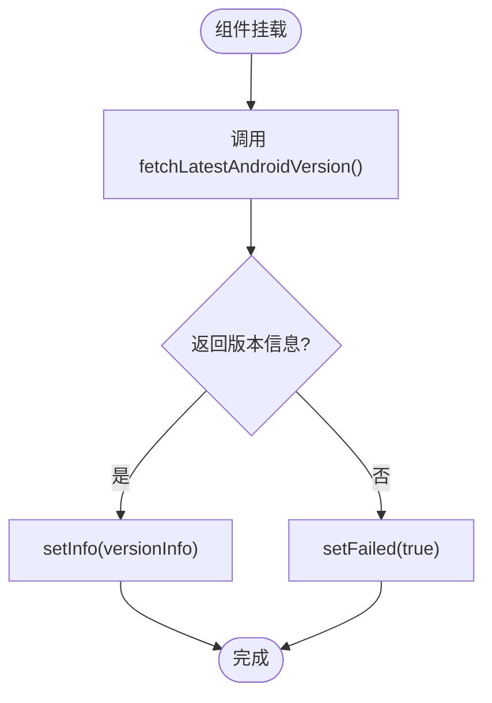
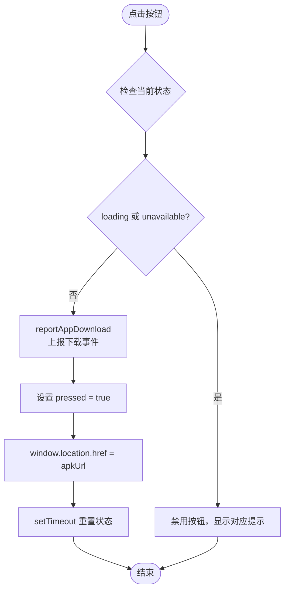
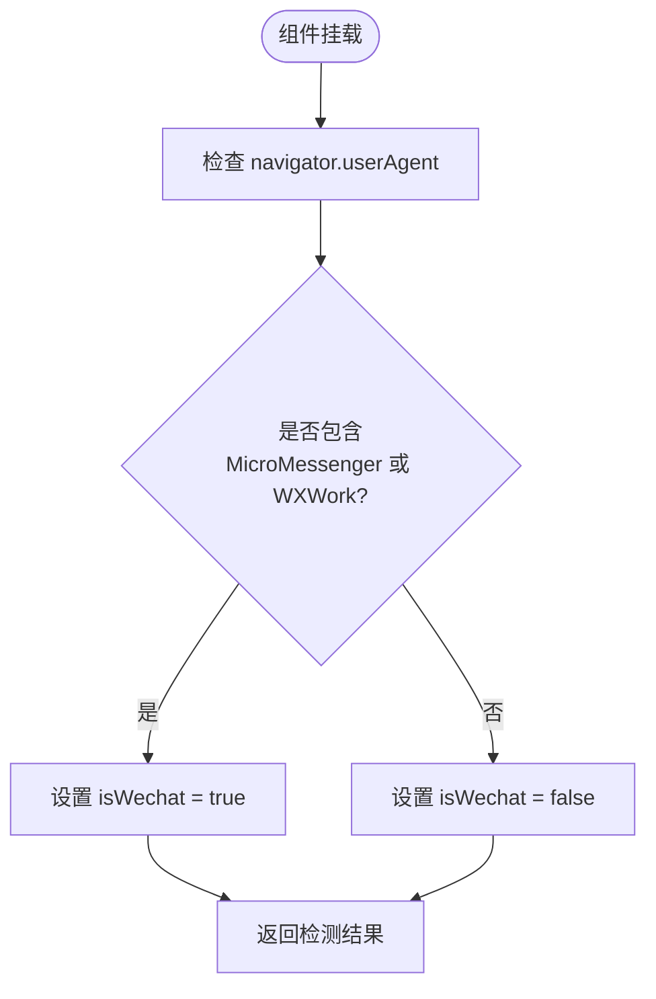
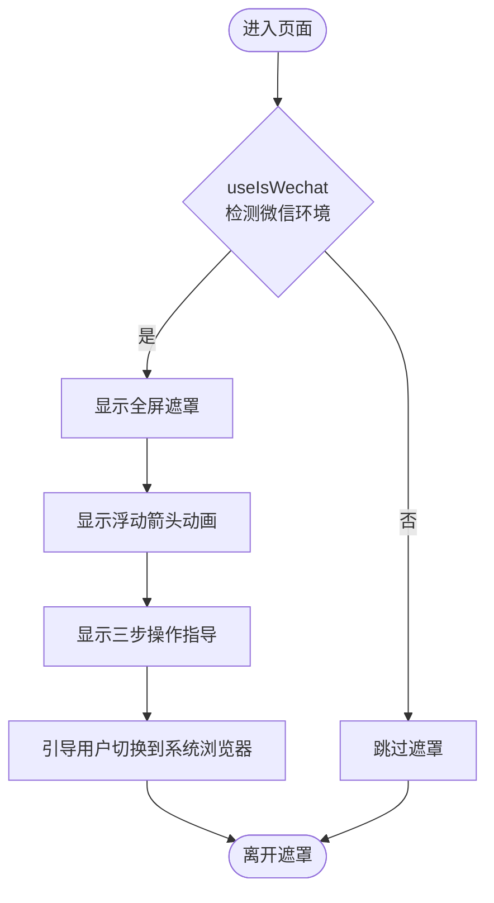
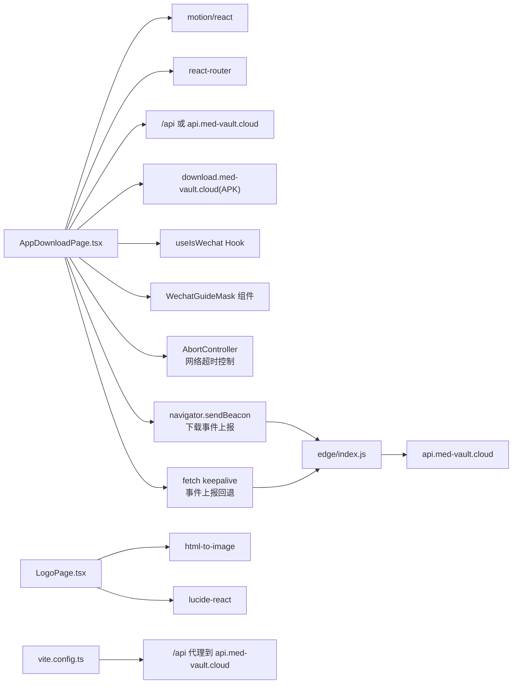

# 应用下载落地页

<cite>
**本文引用的文件**
- [AppDownloadLandingPage.tsx](file://figma-ui/AppDownloadLandingPage.tsx)
- [AppDownloadPage.tsx](file://figma-ui/src/app/pages/AppDownloadPage.tsx)
- [routes.ts](file://figma-ui/src/app/routes.ts)
- [LogoPage.tsx](file://figma-ui/src/app/pages/LogoPage.tsx)
- [Layout.tsx](file://figma-ui/src/app/components/Layout.tsx)
- [main.tsx](file://figma-ui/src/main.tsx)
- [vite.config.ts](file://figma-ui/vite.config.ts)
- [package.json](file://figma-ui/package.json)
- [README.md](file://figma-ui/README.md)
- [index.js](file://figma-ui/edge/index.js)
</cite>

## 更新摘要
**所做更改**
- 增强了微信浏览器检测和引导系统
- 新增了 useIsWechat hook 用于环境检测
- 新增了 WechatGuideMask 组件提供分步指导
- 更新了微信环境下的用户体验流程
- **新增**：实现了6秒网络超时机制防止无限加载状态
- **新增**：改进了双端点策略的错误处理和重试逻辑
- **新增**：添加了完整的失败状态管理和优雅降级机制
- **新增**：优化了按钮行为和视觉反馈，包括禁用状态、透明度变化和描述性文本消息
- **最新**：新增了下载事件上报功能，实现 fire-and-forget 分析追踪，支持 navigator.sendBeacon 和 fetch keepalive 两种上报方式

## 目录
1. [简介](#简介)
2. [项目结构](#项目结构)
3. [核心组件](#核心组件)
4. [架构总览](#架构总览)
5. [详细组件分析](#详细组件分析)
6. [依赖关系分析](#依赖关系分析)
7. [性能与可用性考量](#性能与可用性考量)
8. [故障排查指南](#故障排查指南)
9. [结论](#结论)
10. [附录](#附录)

## 简介
本页面为"医案通"应用的 Android APK 下载落地页，提供产品卖点、内测标识、下载入口与版本信息展示。项目基于 React + Vite + Tailwind CSS 构建，使用 motion 实现入场动效，并通过路由系统挂载到 /download。**最新更新**：增强了微信浏览器检测和引导系统，通过 useIsWechat hook 和 WechatGuideMask 组件为用户提供在微信环境中的分步操作指导；同时大幅增强了网络弹性，新增6秒超时机制防止无限加载状态，改进了双端点策略的错误处理，添加了完整的失败状态管理和优雅降级机制，优化了按钮行为和视觉反馈。**最新功能**：新增了下载事件上报功能，实现了 fire-and-forget 分析追踪，支持 navigator.sendBeacon 和 fetch keepalive 两种上报方式，用于跟踪 Android 应用下载行为和分析用户转化数据。

## 项目结构
- 入口与路由
  - 应用入口：[main.tsx](file://figma-ui/src/main.tsx) 渲染根组件 App。
  - 路由配置：[routes.ts](file://figma-ui/src/app/routes.ts) 将 /download 映射到 AppDownloadPage。
- 落地页实现
  - 独立静态版：[AppDownloadLandingPage.tsx](file://figma-ui/AppDownloadLandingPage.tsx)（直接硬编码下载链接）。
  - 集成版：[AppDownloadPage.tsx](file://figma-ui/src/app/pages/AppDownloadPage.tsx)（支持版本检查接口与增强型微信引导遮罩，具备完善的网络弹性和下载事件上报机制）。
- 品牌与布局
  - 应用图标 SVG：[LogoPage.tsx](file://figma-ui/src/app/pages/LogoPage.tsx) 导出 AppIconSvg，供多处复用。
  - 站点布局：[Layout.tsx](file://figma-ui/src/app/components/Layout.tsx) 用于其他页面，下载页采用独立全屏布局。
- 边缘函数代理
  - ESA 边缘函数：[index.js](file://figma-ui/edge/index.js) 提供 /api/* 路径代理，支持 CORS 和请求转发。
- 构建与开发
  - 构建工具：Vite 配置见 [vite.config.ts](file://figma-ui/vite.config.ts)，包含本地 /api 代理以模拟边缘函数。
  - 依赖与脚本：见 [package.json](file://figma-ui/package.json)。
  - 运行说明：见 [README.md](file://figma-ui/README.md)。

**图表来源**
- [main.tsx:1-7](file://figma-ui/src/main.tsx#L1-L7)
- [routes.ts:24-101](file://figma-ui/src/app/routes.ts#L24-L101)
- [AppDownloadPage.tsx:1-551](file://figma-ui/src/app/pages/AppDownloadPage.tsx#L1-L551)
- [AppDownloadLandingPage.tsx:1-304](file://figma-ui/AppDownloadLandingPage.tsx#L1-L304)
- [LogoPage.tsx:7-55](file://figma-ui/src/app/pages/LogoPage.tsx#L7-L55)
- [vite.config.ts:20-28](file://figma-ui/vite.config.ts#L20-L28)
- [index.js:1-74](file://figma-ui/edge/index.js#L1-L74)

章节来源
- [main.tsx:1-7](file://figma-ui/src/main.tsx#L1-L7)
- [routes.ts:24-101](file://figma-ui/src/app/routes.ts#L24-L101)
- [AppDownloadPage.tsx:1-551](file://figma-ui/src/app/pages/AppDownloadPage.tsx#L1-L551)
- [AppDownloadLandingPage.tsx:1-304](file://figma-ui/AppDownloadLandingPage.tsx#L1-L304)
- [LogoPage.tsx:7-55](file://figma-ui/src/app/pages/LogoPage.tsx#L7-L55)
- [vite.config.ts:20-28](file://figma-ui/vite.config.ts#L20-L28)
- [index.js:1-74](file://figma-ui/edge/index.js#L1-L74)
- [package.json:9-12](file://figma-ui/package.json#L9-L12)
- [README.md:6-11](file://figma-ui/README.md#L6-L11)

## 核心组件
- 下载按钮 DownloadButton
  - 点击后跳转至 APK 下载地址；移动端体验优化；显示最新版本号（当接口返回时）；非移动端提示建议在手机浏览器打开。
  - **增强**：具备完整的加载状态、禁用状态和错误状态管理，支持透明度变化和描述性文本反馈。
  - **新增**：点击下载时自动调用 reportAppDownload 进行事件上报。
- 版本信息获取 useAndroidVersionInfo
  - 通过同域 /api 或直连 api.med-vault.cloud 的版本检查接口获取最新 Android 版本、下载链接、更新说明等。
  - **增强**：新增失败状态管理，区分加载中、成功和失败三种状态。
- **网络弹性 fetchLatestAndroidVersion**
  - **新增**：实现6秒超时机制防止无限加载状态，使用 AbortController 进行请求控制。
  - **增强**：改进双端点策略的错误处理，支持自动重试和优雅降级。
- **下载事件上报 reportAppDownload**
  - **新增**：实现 fire-and-forget 分析追踪，支持 navigator.sendBeacon 和 fetch keepalive 两种上报方式。
  - **特性**：失败静默忽略，绝不阻塞下载主流程；口径以「点击/触发下载」为准。
- **微信环境检测 useIsWechat**
  - **新增**：专门用于检测微信内置浏览器环境的自定义 Hook，支持微信和企业微信环境识别。
- **微信引导遮罩 WechatGuideMask**
  - **增强**：检测微信内置浏览器并弹出全屏指引，提供动画箭头、分步操作卡片和清晰的用户指导。
- 更新说明 ReleaseNotes
  - 展示服务端返回的多行更新说明，无内容时不渲染。
- 静态落地页 AppDownloadLandingPage
  - 不依赖后端接口，直接硬编码 APK 地址，适合快速发布或离线场景。

章节来源
- [AppDownloadPage.tsx:235-346](file://figma-ui/src/app/pages/AppDownloadPage.tsx#L235-L346)
- [AppDownloadPage.tsx:218-233](file://figma-ui/src/app/pages/AppDownloadPage.tsx#L218-L233)
- [AppDownloadPage.tsx:29-52](file://figma-ui/src/app/pages/AppDownloadPage.tsx#L29-L52)
- [AppDownloadPage.tsx:54-77](file://figma-ui/src/app/pages/AppDownloadPage.tsx#L54-L77)
- [AppDownloadPage.tsx:135-142](file://figma-ui/src/app/pages/AppDownloadPage.tsx#L135-L142)
- [AppDownloadPage.tsx:144-216](file://figma-ui/src/app/pages/AppDownloadPage.tsx#L144-L216)
- [AppDownloadPage.tsx:348-373](file://figma-ui/src/app/pages/AppDownloadPage.tsx#L348-L373)
- [AppDownloadLandingPage.tsx:64-136](file://figma-ui/AppDownloadLandingPage.tsx#L64-L136)

## 架构总览
下载落地页由路由挂载，页面内通过 hooks 拉取版本信息，结合 UI 组件完成下载引导。**新增的网络弹性机制**确保在网络异常情况下仍能提供良好的用户体验，通过6秒超时、双端点重试和优雅降级策略，避免用户陷入无限加载状态。**增强的微信环境检测机制**会在检测到微信内置浏览器时自动显示引导遮罩，帮助用户切换到系统浏览器进行下载。**最新的下载事件上报机制**在用户点击下载时自动上报下载行为，支持 fire-and-forget 模式，确保不影响主流程。**若接口不可用，回退到内置下载链接或显示友好的错误提示**。

**图表来源**
- [routes.ts:97-101](file://figma-ui/src/app/routes.ts#L97-L101)
- [AppDownloadPage.tsx:13-42](file://figma-ui/src/app/pages/AppDownloadPage.tsx#L13-L42)
- [AppDownloadPage.tsx:100-181](file://figma-ui/src/app/pages/AppDownloadPage.tsx#L100-L181)
- [AppDownloadPage.tsx:183-195](file://figma-ui/src/app/pages/AppDownloadPage.tsx#L183-L195)
- [AppDownloadPage.tsx:197-279](file://figma-ui/src/app/pages/AppDownloadPage.tsx#L197-L279)
- [AppDownloadPage.tsx:250-257](file://figma-ui/src/app/pages/AppDownloadPage.tsx#L250-L257)
- [AppDownloadPage.tsx:54-77](file://figma-ui/src/app/pages/AppDownloadPage.tsx#L54-L77)

## 详细组件分析

### 下载事件上报 reportAppDownload 函数
- **功能要点**
  - 实现 fire-and-forget 分析追踪，失败静默忽略，绝不阻塞下载主流程。
  - 支持两种上报方式：优先使用 `navigator.sendBeacon`，不支持时回退到 `fetch` with `keepalive: true`。
  - 上报数据包含平台信息（android）和版本号（截断至64字符）。
  - 通过同域 `/api/v1/app/download-events` 接口上报，经 ESA 边缘函数代理。
- **技术实现**
  - 浏览器兼容性：`if (navigator.sendBeacon)` 检测支持情况
  - sendBeacon 方式：`navigator.sendBeacon(DOWNLOAD_EVENT_PATH, new Blob([body], { type: "application/json" }))`
  - fetch 回退方式：`fetch(DOWNLOAD_EVENT_PATH, { method: "POST", headers: { "Content-Type": "application/json" }, body, keepalive: true })`
  - 错误处理：try-catch 包裹，所有异常静默忽略
- **复杂度**
  - 时间复杂度 O(1)，空间复杂度 O(1)，异步操作不阻塞主线程。

**图表来源**
- [AppDownloadPage.tsx:54-77](file://figma-ui/src/app/pages/AppDownloadPage.tsx#L54-L77)
- [index.js:31-72](file://figma-ui/edge/index.js#L31-L72)

章节来源
- [AppDownloadPage.tsx:54-77](file://figma-ui/src/app/pages/AppDownloadPage.tsx#L54-L77)
- [index.js:31-72](file://figma-ui/edge/index.js#L31-L72)

### 网络弹性 fetchLatestAndroidVersion 函数
- **功能要点**
  - 实现6秒超时机制防止无限加载状态，使用 `AbortController` 进行请求控制。
  - 依次尝试两个端点：先同域 /api（经 Vite 代理），再直连 api.med-vault.cloud。
  - 解析统一信封格式 { success, data }，成功则返回 data 作为版本信息。
  - 任一请求失败则继续尝试下一个端点，全部失败返回 null。
- **技术实现**
  - 超时控制：`const controller = new AbortController(); const timer = setTimeout(() => controller.abort(), FETCH_TIMEOUT_MS);`
  - 请求信号：`signal: controller.signal` 传递给 fetch 请求
  - 资源清理：`clearTimeout(timer)` 在 finally 块中确保定时器被清除
- **复杂度**
  - 最多两次网络请求，时间复杂度 O(1) 次 I/O，空间复杂度 O(1)。

**图表来源**
- [AppDownloadPage.tsx:29-52](file://figma-ui/src/app/pages/AppDownloadPage.tsx#L29-L52)
- [vite.config.ts:20-28](file://figma-ui/vite.config.ts#L20-L28)

章节来源
- [AppDownloadPage.tsx:29-52](file://figma-ui/src/app/pages/AppDownloadPage.tsx#L29-L52)
- [vite.config.ts:20-28](file://figma-ui/vite.config.ts#L20-L28)

### 失败状态管理 useAndroidVersionInfo Hook
- **功能要点**
  - 管理版本信息的加载状态，区分加载中、成功和失败三种状态。
  - 使用 `failed` 状态标记接口调用是否失败，用于UI层面的错误提示。
  - 支持组件卸载时的状态清理，避免内存泄漏。
- **状态流转**
  - 初始状态：`info = null, failed = false`
  - 加载中：调用 `fetchLatestAndroidVersion()`
  - 成功：`info = versionInfo, failed = false`
  - 失败：`info = null, failed = true`
- **复杂度**
  - 时间复杂度 O(1)，空间复杂度 O(1)。

**图表来源**
- [AppDownloadPage.tsx:218-233](file://figma-ui/src/app/pages/AppDownloadPage.tsx#L218-L233)

章节来源
- [AppDownloadPage.tsx:218-233](file://figma-ui/src/app/pages/AppDownloadPage.tsx#L218-L233)

### 增强的下载按钮 DownloadButton
- **功能要点**
  - 点击触发 window.location.href 跳转至 APK 地址。
  - 根据是否移动端显示不同提示文案。
  - 当存在 versionInfo.latest_version 时显示最新版本号。
  - 按钮具备 shimmer 动效与按下态反馈。
  - **增强**：支持完整的状态管理，包括加载、禁用、错误和正常状态。
  - **新增**：点击下载时自动调用 reportAppDownload 进行事件上报。
- **状态管理**
  - `loading`：接口请求中，按钮半透明显示"正在获取下载链接…"
  - `unavailable`：接口失败或无下载地址，按钮禁用显示"下载暂不可用"
  - `pressed`：用户点击后的视觉反馈，显示"下载已开始"
  - 正常状态：显示"立即下载 · Android APK"
- **数据流**
  - 接收 versionInfo 和 failed 作为 props，智能判断按钮状态。
  - 当 download_url 为空或接口失败时禁用按钮并显示错误提示。
  - 点击下载时先上报事件，再执行跳转。
- **复杂度**
  - 时间复杂度 O(1)，空间复杂度 O(1)。

**图表来源**
- [AppDownloadPage.tsx:235-346](file://figma-ui/src/app/pages/AppDownloadPage.tsx#L235-L346)
- [AppDownloadLandingPage.tsx:64-136](file://figma-ui/AppDownloadLandingPage.tsx#L64-L136)

章节来源
- [AppDownloadPage.tsx:235-346](file://figma-ui/src/app/pages/AppDownloadPage.tsx#L235-L346)
- [AppDownloadLandingPage.tsx:64-136](file://figma-ui/AppDownloadLandingPage.tsx#L64-L136)

### 微信环境检测 useIsWechat Hook
- **功能要点**
  - 通过检测 navigator.userAgent 判断是否在微信内置浏览器中。
  - 同时支持普通微信（MicroMessenger）和企业微信（WXWork）环境。
  - 使用 React useState 管理状态，在组件挂载时执行检测逻辑。
- **技术实现**
  - 正则表达式匹配：`/micromessenger|wxwork/i.test(navigator.userAgent)`
  - 返回布尔值表示是否为微信环境
- **复杂度**
  - 时间复杂度 O(1)，空间复杂度 O(1)

**图表来源**
- [AppDownloadPage.tsx:135-142](file://figma-ui/src/app/pages/AppDownloadPage.tsx#L135-L142)

章节来源
- [AppDownloadPage.tsx:135-142](file://figma-ui/src/app/pages/AppDownloadPage.tsx#L135-L142)

### 微信引导遮罩 WechatGuideMask 组件
- **功能要点**
  - 仅在微信环境中显示全屏遮罩层。
  - 提供动画箭头指向右上角菜单按钮。
  - 显示分步操作指导卡片，包含三个明确步骤。
  - 底部提示用户微信内无法直接下载安装包。
- **交互流程**
  - 用户按指引操作后回到页面，即可正常触发下载。
  - 遮罩层使用高 z-index (9999) 确保覆盖所有页面内容。
- **视觉设计**
  - 半透明背景配合 backdropFilter 模糊效果。
  - 渐变蓝色步骤编号与白色文字形成对比。
  - 黄色箭头动画吸引用户注意力。

**图表来源**
- [AppDownloadPage.tsx:144-216](file://figma-ui/src/app/pages/AppDownloadPage.tsx#L144-L216)

章节来源
- [AppDownloadPage.tsx:144-216](file://figma-ui/src/app/pages/AppDownloadPage.tsx#L144-L216)

### 更新说明 ReleaseNotes
- **功能要点**
  - 读取 versionInfo.release_notes，按换行分割逐行渲染。
  - 若无内容则不渲染该区块。

章节来源
- [AppDownloadPage.tsx:348-373](file://figma-ui/src/app/pages/AppDownloadPage.tsx#L348-L373)

### 静态落地页 AppDownloadLandingPage
- **特点**
  - 不依赖后端接口，APK 地址硬编码，便于快速上线或离线分发。
  - 同样包含特性列表、Beta 标签、下载按钮与限制提示。
  - **注意**：不具备动态网络弹性机制和下载事件上报功能，适用于简单场景。

章节来源
- [AppDownloadLandingPage.tsx:1-304](file://figma-ui/AppDownloadLandingPage.tsx#L1-L304)

### 路由与入口
- **路由挂载**
  - /download 指向 AppDownloadPage，便于通过 URL 直达下载页。
- **入口渲染**
  - main.tsx 创建根节点并渲染 App。

章节来源
- [routes.ts:97-101](file://figma-ui/src/app/routes.ts#L97-L101)
- [main.tsx:1-7](file://figma-ui/src/main.tsx#L1-L7)

### 边缘函数代理 index.js
- **功能要点**
  - 提供 /api/* 路径的统一代理，转发到 https://api.med-vault.cloud。
  - 支持 CORS 预检和跨域请求头处理。
  - 透传请求方法、头部和请求体到上游服务。
  - 为下载事件上报提供同域访问能力。
- **技术实现**
  - 仅处理 /api/* 路径，其他路径返回 404。
  - 支持 OPTIONS 预检请求。
  - 统一添加 CORS 响应头。
  - 错误处理：上游请求失败返回 502。

章节来源
- [index.js:1-74](file://figma-ui/edge/index.js#L1-L74)

## 依赖关系分析
- **运行时依赖**
  - react、react-dom：UI 框架。
  - motion：动画与过渡效果。
  - lucide-react：图标库（在 LogoPage 中使用）。
  - html-to-image：用于 Logo 页面的 PNG 导出（下载页未直接使用）。
  - tailwindcss：样式原子化。
  - vite：构建与本地开发服务器。
- **关键外部服务**
  - 版本检查 API：/api（本地代理）或 https://api.med-vault.cloud。
  - 下载事件上报 API：/api/v1/app/download-events（经边缘函数代理）。
  - APK 下载源：download.med-vault.cloud。
- **新增网络弹性依赖**
  - AbortController：原生浏览器API，用于请求超时控制。
  - navigator.sendBeacon：原生浏览器API，用于可靠的事件上报。
  - 无额外第三方依赖，完全基于原生Web API实现。

**图表来源**
- [AppDownloadPage.tsx:29-77](file://figma-ui/src/app/pages/AppDownloadPage.tsx#L29-L77)
- [AppDownloadPage.tsx:135-216](file://figma-ui/src/app/pages/AppDownloadPage.tsx#L135-L216)
- [LogoPage.tsx:1-5](file://figma-ui/src/app/pages/LogoPage.tsx#L1-L5)
- [vite.config.ts:20-28](file://figma-ui/vite.config.ts#L20-L28)
- [index.js:1-74](file://figma-ui/edge/index.js#L1-L74)
- [package.json:14-75](file://figma-ui/package.json#L14-L75)

章节来源
- [package.json:14-75](file://figma-ui/package.json#L14-L75)
- [vite.config.ts:20-28](file://figma-ui/vite.config.ts#L20-L28)
- [AppDownloadPage.tsx:29-77](file://figma-ui/src/app/pages/AppDownloadPage.tsx#L29-L77)
- [AppDownloadPage.tsx:135-216](file://figma-ui/src/app/pages/AppDownloadPage.tsx#L135-L216)
- [LogoPage.tsx:1-5](file://figma-ui/src/app/pages/LogoPage.tsx#L1-L5)
- [index.js:1-74](file://figma-ui/edge/index.js#L1-L74)

## 性能与可用性考量
- **网络请求优化**
  - 版本检查仅一次串行尝试两个端点，避免并发风暴；失败快速回退。
  - **新增**：6秒超时机制防止无限加载，提升用户体验和网络效率。
  - **新增**：AbortController 确保请求及时取消，释放网络资源。
  - **新增**：下载事件上报采用 fire-and-forget 模式，不阻塞主流程。
- **渲染性能**
  - 使用 motion 控制入场动画，减少重排；特性列表为静态数据，渲染开销低。
  - **新增**：智能状态管理避免不必要的重新渲染，仅在状态变化时更新UI。
  - **微信引导遮罩**仅在检测到微信环境时渲染，避免不必要的性能开销。
  - **新增**：下载事件上报使用异步方式，不影响页面响应性能。
- **可访问性**
  - 按钮具备明确的语义与视觉反馈；微信环境提供清晰的操作指引。
  - **新增**：完整的状态反馈，包括加载、禁用、错误和成功状态的视觉提示。
  - **新增**：描述性文本消息帮助用户理解当前状态和预期行为。
  - **增强**：微信引导遮罩使用高对比度颜色和清晰的步骤说明，提升可访问性。
- **兼容性**
  - 仅在 Android 平台提供安装；桌面端提示建议使用手机浏览器。
  - **增强**：同时支持普通微信和企业微信环境检测。
  - **新增**：优雅降级机制确保在接口不可用时仍能提供基本功能。
  - **新增**：下载事件上报支持浏览器特性检测，不支持 sendBeacon 时自动回退到 fetch。
- **缓存与降级**
  - 接口异常时自动回退到内置 APK 地址，保证基本可用性。
  - **新增**：失败状态管理提供友好的错误提示，避免用户困惑。
  - **新增**：下载事件上报失败静默忽略，不影响下载主流程。

## 故障排查指南
- **无法获取版本信息**
  - 检查 /api 代理是否生效（本地开发需启动 dev server）；确认远端 CORS 策略。
  - **新增**：检查6秒超时是否正常工作，确认网络请求是否正常终止。
  - 参考：[vite.config.ts:20-28](file://figma-ui/vite.config.ts#L20-L28)、[AppDownloadPage.tsx:29-52](file://figma-ui/src/app/pages/AppDownloadPage.tsx#L29-L52)
- **下载链接无效**
  - 若接口返回 download_url 为空，将回退到内置 FALLBACK_APK_URL；确认远端 APK 可达。
  - **新增**：检查按钮是否正确进入禁用状态，确认错误提示是否正常显示。
  - 参考：[AppDownloadPage.tsx:235-346](file://figma-ui/src/app/pages/AppDownloadPage.tsx#L235-L346)
- **按钮长时间加载**
  - **新增**：确认6秒超时机制是否正常工作，检查是否有网络请求卡死。
  - **新增**：验证 AbortController 是否正确释放定时器资源。
  - 参考：[AppDownloadPage.tsx:29-52](file://figma-ui/src/app/pages/AppDownloadPage.tsx#L29-L52)
- **微信内无法下载**
  - **新增**：出现全屏遮罩属预期行为；请按照指引切换到系统浏览器。
  - 检查是否正确检测到微信环境；确认遮罩层 z-index 未被其他元素覆盖。
  - 参考：[AppDownloadPage.tsx:135-216](file://figma-ui/src/app/pages/AppDownloadPage.tsx#L135-L216)
- **下载事件上报失败**
  - **新增**：事件上报采用 fire-and-forget 模式，失败不会影响下载主流程。
  - **新增**：检查浏览器是否支持 navigator.sendBeacon，不支持时会使用 fetch keepalive 回退。
  - **新增**：确认 /api/v1/app/download-events 路径可通过边缘函数正确代理。
  - 参考：[AppDownloadPage.tsx:54-77](file://figma-ui/src/app/pages/AppDownloadPage.tsx#L54-L77)、[index.js:31-72](file://figma-ui/edge/index.js#L31-L72)
- **页面未加载**
  - 确认路由 /download 已正确注册；检查入口渲染是否正常。
  - 参考：[routes.ts:97-101](file://figma-ui/src/app/routes.ts#L97-L101)、[main.tsx:1-7](file://figma-ui/src/main.tsx#L1-L7)

章节来源
- [vite.config.ts:20-28](file://figma-ui/vite.config.ts#L20-L28)
- [AppDownloadPage.tsx:29-77](file://figma-ui/src/app/pages/AppDownloadPage.tsx#L29-L77)
- [AppDownloadPage.tsx:135-216](file://figma-ui/src/app/pages/AppDownloadPage.tsx#L135-L216)
- [AppDownloadPage.tsx:235-346](file://figma-ui/src/app/pages/AppDownloadPage.tsx#L235-L346)
- [index.js:31-72](file://figma-ui/edge/index.js#L31-L72)
- [routes.ts:97-101](file://figma-ui/src/app/routes.ts#L97-L101)
- [main.tsx:1-7](file://figma-ui/src/main.tsx#L1-L7)

## 结论
该落地页实现了简洁高效的 Android APK 下载流程，具备版本信息动态获取、**增强的微信环境适配**、**显著改进的网络弹性**和**全新的下载事件上报功能**。通过6秒超时机制、双端点重试策略和完整的失败状态管理，有效避免了无限加载状态，提升了用户体验的可靠性。**最新的微信浏览器检测和引导系统**通过 useIsWechat hook 和 WechatGuideMask 组件，为用户在微信环境中提供了直观的分步操作指导。**新增的下载事件上报功能**采用 fire-and-forget 模式，支持 navigator.sendBeacon 和 fetch keepalive 两种上报方式，确保在不影响主流程的前提下收集下载行为数据。**优化的按钮行为和视觉反馈**包括禁用状态、透明度变化和描述性文本消息，使用户能够清晰了解当前状态和预期行为。通过路由集中管理、组件职责清晰、动画与交互细节完善，既保证了用户体验，也兼顾了可维护性与扩展性。

## 附录
- **快速启动**
  - 安装依赖与启动开发服务器：参见 [README.md:6-11](file://figma-ui/README.md#L6-L11)。
  - 构建与预览：参见 [package.json:9-12](file://figma-ui/package.json#L9-L12)。
- **相关页面**
  - 品牌标志与导出：参见 [LogoPage.tsx:57-188](file://figma-ui/src/app/pages/LogoPage.tsx#L57-L188)。
  - 站点布局：参见 [Layout.tsx:10-144](file://figma-ui/src/app/components/Layout.tsx#L10-L144)。
- **新增功能参考**
  - 网络弹性机制：参见 [AppDownloadPage.tsx:29-52](file://figma-ui/src/app/pages/AppDownloadPage.tsx#L29-L52)
  - 失败状态管理：参见 [AppDownloadPage.tsx:218-233](file://figma-ui/src/app/pages/AppDownloadPage.tsx#L218-L233)
  - 增强的下载按钮：参见 [AppDownloadPage.tsx:235-346](file://figma-ui/src/app/pages/AppDownloadPage.tsx#L235-L346)
  - 微信环境检测：参见 [AppDownloadPage.tsx:135-142](file://figma-ui/src/app/pages/AppDownloadPage.tsx#L135-L142)
  - 微信引导遮罩：参见 [AppDownloadPage.tsx:144-216](file://figma-ui/src/app/pages/AppDownloadPage.tsx#L144-L216)
  - **下载事件上报**：参见 [AppDownloadPage.tsx:54-77](file://figma-ui/src/app/pages/AppDownloadPage.tsx#L54-L77)
  - **边缘函数代理**：参见 [index.js:31-72](file://figma-ui/edge/index.js#L31-L72)