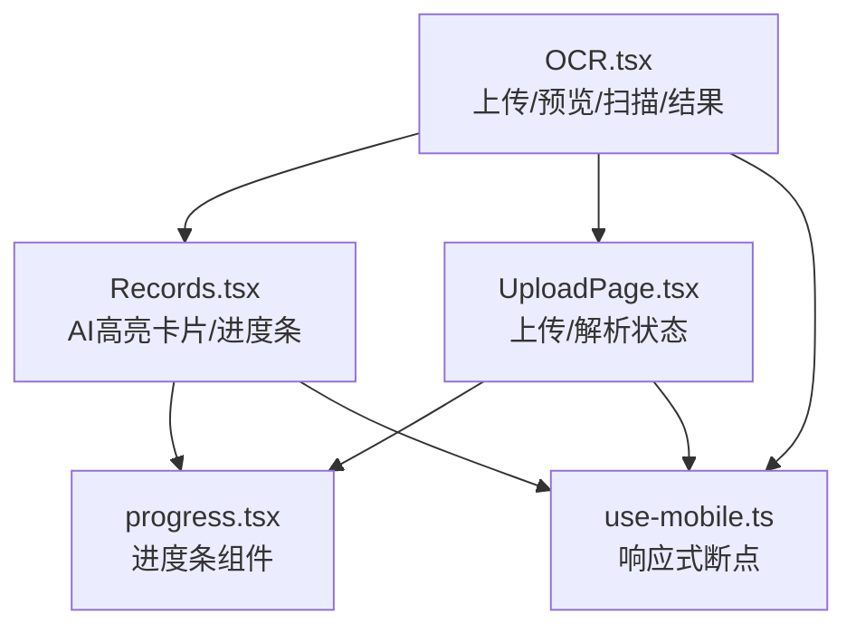
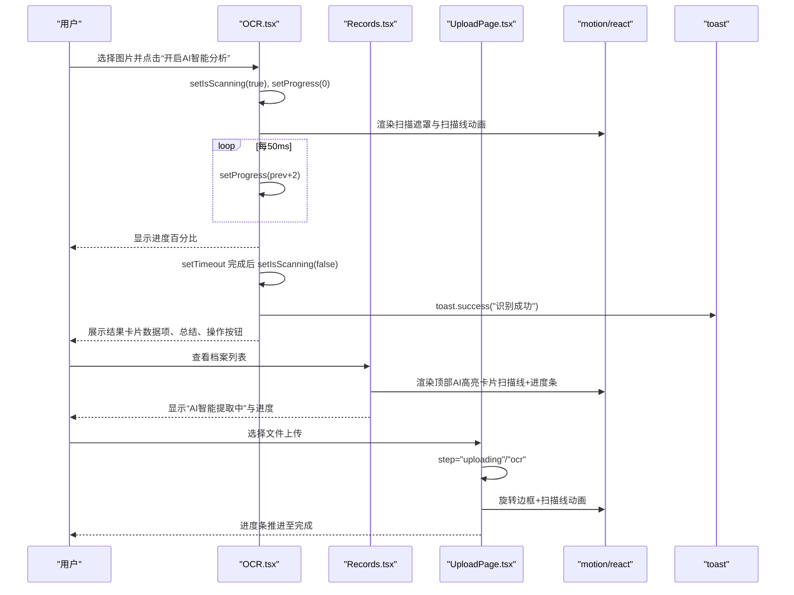
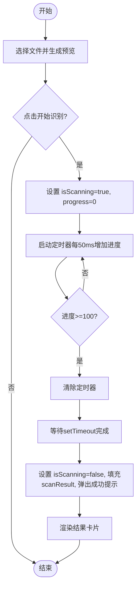
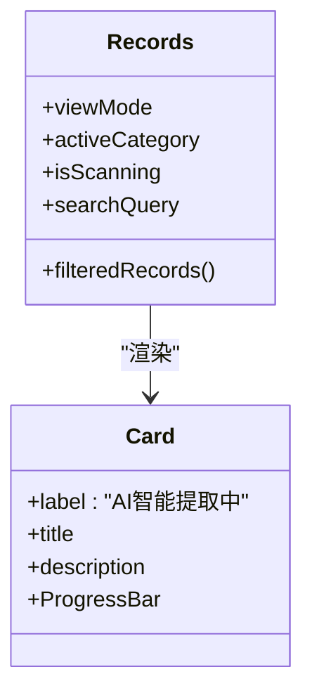
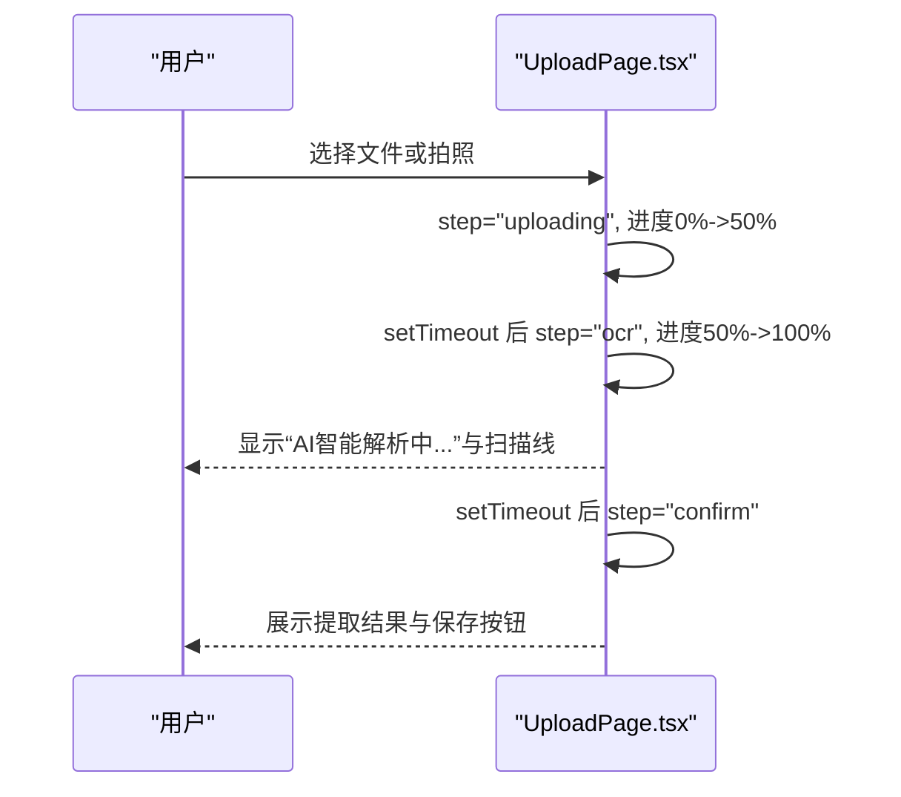
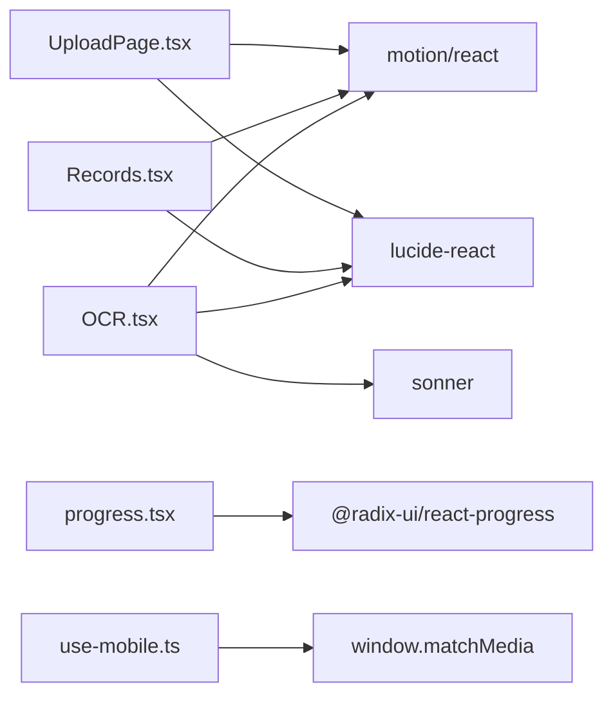

# AI处理状态展示

<cite>
**本文引用的文件**
- [OCR.tsx](file://figma-ui/src/app/pages/OCR.tsx)
- [Records.tsx](file://figma-ui/src/app/pages/Records.tsx)
- [UploadPage.tsx](file://figma-ui/src/app/pages/UploadPage.tsx)
- [progress.tsx](file://figma-ui/src/app/components/ui/progress.tsx)
- [use-mobile.ts](file://figma-ui/src/app/components/ui/use-mobile.ts)
</cite>

## 目录
1. [简介](#简介)
2. [项目结构](#项目结构)
3. [核心组件](#核心组件)
4. [架构总览](#架构总览)
5. [详细组件分析](#详细组件分析)
6. [依赖关系分析](#依赖关系分析)
7. [性能考虑](#性能考虑)
8. [故障排查指南](#故障排查指南)
9. [结论](#结论)
10. [附录：关键实现路径与示例定位](#附录关键实现路径与示例定位)

## 简介
本文件面向医案通医疗档案网站的“AI处理状态展示”功能，聚焦于OCR识别过程中的状态管理、扫描线动画、进度条更新与用户反馈设计；同时说明AI智能提取提示卡片的布局结构、渐变背景效果、模糊光晕装饰与响应式适配。文档还涵盖动画库 motion 的使用、AnimatePresence 的页面切换、状态转换动画以及性能优化策略，并提供具体代码片段的路径引用以便快速定位实现。

## 项目结构
与AI处理状态展示直接相关的页面与组件分布如下：
- OCR识别主流程：OCR.tsx（上传预览、扫描遮罩、进度百分比、结果卡片）
- 档案列表中的AI高亮卡片：Records.tsx（顶部AI提示卡片、扫描线、进度条）
- 上传流程中的AI解析状态：UploadPage.tsx（上传中/解析中、扫描线、进度条）
- 通用进度条组件：progress.tsx（可复用进度指示器）
- 移动端断点检测：use-mobile.ts（用于响应式适配）

图表来源
- [OCR.tsx:24-270](file://figma-ui/src/app/pages/OCR.tsx#L24-L270)
- [Records.tsx:101-235](file://figma-ui/src/app/pages/Records.tsx#L101-L235)
- [UploadPage.tsx:54-109](file://figma-ui/src/app/pages/UploadPage.tsx#L54-L109)
- [progress.tsx:8-31](file://figma-ui/src/app/components/ui/progress.tsx#L8-L31)
- [use-mobile.ts:5-21](file://figma-ui/src/app/components/ui/use-mobile.ts#L5-L21)

章节来源
- [OCR.tsx:24-270](file://figma-ui/src/app/pages/OCR.tsx#L24-L270)
- [Records.tsx:101-235](file://figma-ui/src/app/pages/Records.tsx#L101-L235)
- [UploadPage.tsx:54-109](file://figma-ui/src/app/pages/UploadPage.tsx#L54-L109)
- [progress.tsx:8-31](file://figma-ui/src/app/components/ui/progress.tsx#L8-L31)
- [use-mobile.ts:5-21](file://figma-ui/src/app/components/ui/use-mobile.ts#L5-L21)

## 核心组件
- OCR.tsx：负责文件选择、预览、启动扫描、模拟进度与结果渲染；使用 AnimatePresence 控制上传区与预览区的切换；在预览图上叠加扫描遮罩与扫描线动画；通过定时器驱动进度并触发完成回调。
- Records.tsx：在档案列表顶部提供AI高亮卡片，包含扫描线动画、渐变进度条和“AI智能提取中”标签；使用 motion 控制进度宽度变化。
- UploadPage.tsx：上传与解析两阶段状态，分别显示不同文案与进度；包含旋转边框与扫描线动效。
- progress.tsx：基于 Radix Progress 的可复用进度条组件，支持 value 驱动的宽度变化。
- use-mobile.ts：提供 isMobile 布尔值，便于在不同屏幕尺寸下调整UI与动画强度。

章节来源
- [OCR.tsx:24-270](file://figma-ui/src/app/pages/OCR.tsx#L24-L270)
- [Records.tsx:101-235](file://figma-ui/src/app/pages/Records.tsx#L101-L235)
- [UploadPage.tsx:54-109](file://figma-ui/src/app/pages/UploadPage.tsx#L54-L109)
- [progress.tsx:8-31](file://figma-ui/src/app/components/ui/progress.tsx#L8-L31)
- [use-mobile.ts:5-21](file://figma-ui/src/app/components/ui/use-mobile.ts#L5-L21)

## 架构总览
整体采用“状态驱动渲染 + 动画增强”的模式：
- 状态层：isScanning、progress、scanResult、step 等状态控制UI分支与动画开关。
- 视图层：基于 Tailwind 类名构建卡片、渐变、模糊光晕与响应式布局。
- 动画层：motion/react 的 Motion.div、AnimatePresence 控制入场/出场与过渡；CSS 动画与阴影实现扫描线与光晕。
- 交互层：点击触发 startScan、文件选择、重置等操作，配合 toast 反馈。

图表来源
- [OCR.tsx:42-75](file://figma-ui/src/app/pages/OCR.tsx#L42-L75)
- [OCR.tsx:96-245](file://figma-ui/src/app/pages/OCR.tsx#L96-L245)
- [Records.tsx:193-235](file://figma-ui/src/app/pages/Records.tsx#L193-L235)
- [UploadPage.tsx:54-109](file://figma-ui/src/app/pages/UploadPage.tsx#L54-L109)

## 详细组件分析

### OCR.tsx：OCR识别流程与状态管理
- 状态管理
  - isScanning：控制扫描遮罩与扫描线的显示/隐藏。
  - progress：定时器递增，驱动进度百分比与视觉反馈。
  - scanResult：识别完成后渲染结构化数据与总结。
  - file/preview：文件对象与预览URL。
- 定时器与清理
  - 使用 setInterval 每50ms增加进度，达到100%时 clearInterval。
  - 使用 setTimeout 模拟后端处理耗时，完成后关闭扫描并弹出成功提示。
- 动画与交互
  - AnimatePresence 控制上传区与预览区的切换动画。
  - 扫描遮罩内使用 Motion.div 实现自上而下的扫描线动画。
  - 按钮 hover/tap 缩放与光泽扫过效果提升交互感。
- 结果展示
  - 结果卡片包含标题、日期、医院、医生、数据项网格、AI总结与操作按钮。
  - 正常/异常指标使用不同图标标识。

图表来源
- [OCR.tsx:42-75](file://figma-ui/src/app/pages/OCR.tsx#L42-L75)
- [OCR.tsx:96-245](file://figma-ui/src/app/pages/OCR.tsx#L96-L245)

章节来源
- [OCR.tsx:24-270](file://figma-ui/src/app/pages/OCR.tsx#L24-L270)

### Records.tsx：AI智能提取提示卡片
- 布局结构
  - 顶部卡片包含“AI智能提取中”标签、标题、描述与进度条。
  - 背景使用模糊光晕（大圆 + blur）营造信任蓝氛围。
- 扫描线与进度
  - isScanning 为真时，Motion.div 从上到下循环移动，形成扫描线。
  - 进度条使用 Motion.div 的 width 从0%到75%/100%，缓动曲线平滑。
- 自动停止演示
  - useEffect 中设置定时器，3秒后自动将 isScanning 置为 false，便于演示。

图表来源
- [Records.tsx:101-235](file://figma-ui/src/app/pages/Records.tsx#L101-L235)

章节来源
- [Records.tsx:101-235](file://figma-ui/src/app/pages/Records.tsx#L101-L235)

### UploadPage.tsx：上传与解析状态
- 步骤流转
  - select -> uploading -> ocr -> confirm，每一步都有对应文案与进度。
- 动画与视觉
  - 上传阶段：外圈虚线旋转，中心图标表示上传。
  - 解析阶段：中心图标变为Sparkles，叠加扫描线动画。
  - 进度条根据当前步骤推进，体现阶段性时长差异。
- 结果确认
  - 解析成功后进入确认页，展示提取的关键指标与保存按钮。

图表来源
- [UploadPage.tsx:54-109](file://figma-ui/src/app/pages/UploadPage.tsx#L54-L109)
- [UploadPage.tsx:111-185](file://figma-ui/src/app/pages/UploadPage.tsx#L111-L185)

章节来源
- [UploadPage.tsx:54-185](file://figma-ui/src/app/pages/UploadPage.tsx#L54-L185)

### 进度条组件：progress.tsx
- 基于 Radix Progress 封装，value 驱动 Indicator 的 transform 计算宽度。
- 样式简洁，适合嵌入任意卡片或遮罩区域。
- 可与 motion 结合实现更丰富的过渡效果。

章节来源
- [progress.tsx:8-31](file://figma-ui/src/app/components/ui/progress.tsx#L8-L31)

### 响应式适配：use-mobile.ts
- 提供 isMobile 布尔值，基于 matchMedia 监听窗口宽度变化。
- 可在不同断点下调整动画强度、布局密度与字体大小，确保移动端体验。

章节来源
- [use-mobile.ts:5-21](file://figma-ui/src/app/components/ui/use-mobile.ts#L5-L21)

## 依赖关系分析
- 页面级依赖
  - OCR.tsx 依赖 motion/react（Motion.div、AnimatePresence）、lucide-react 图标、sonner 提示。
  - Records.tsx 依赖 motion/react、lucide-react。
  - UploadPage.tsx 依赖 motion/react、lucide-react。
- 组件级依赖
  - progress.tsx 依赖 @radix-ui/react-progress。
  - use-mobile.ts 无外部依赖，仅使用浏览器API。
- 耦合与内聚
  - 各页面独立维护自身状态，内聚度高；进度条与移动端检测作为可复用模块，降低重复实现。

图表来源
- [OCR.tsx:1-22](file://figma-ui/src/app/pages/OCR.tsx#L1-L22)
- [Records.tsx:1-25](file://figma-ui/src/app/pages/Records.tsx#L1-L25)
- [UploadPage.tsx:1-6](file://figma-ui/src/app/pages/UploadPage.tsx#L1-L6)
- [progress.tsx:1-7](file://figma-ui/src/app/components/ui/progress.tsx#L1-L7)
- [use-mobile.ts:1-7](file://figma-ui/src/app/components/ui/use-mobile.ts#L1-L7)

章节来源
- [OCR.tsx:1-22](file://figma-ui/src/app/pages/OCR.tsx#L1-L22)
- [Records.tsx:1-25](file://figma-ui/src/app/pages/Records.tsx#L1-L25)
- [UploadPage.tsx:1-6](file://figma-ui/src/app/pages/UploadPage.tsx#L1-L6)
- [progress.tsx:1-7](file://figma-ui/src/app/components/ui/progress.tsx#L1-L7)
- [use-mobile.ts:1-7](file://figma-ui/src/app/components/ui/use-mobile.ts#L1-L7)

## 性能考虑
- 定时器管理
  - 在OCR.tsx中，当进度达到100%时立即 clearInterval，避免无效渲染与内存泄漏。
  - 在Records.tsx中，使用一次性setTimeout自动结束演示状态，防止长时间动画占用资源。
- 动画性能
  - 使用 motion 的 transform 与 opacity 进行GPU加速动画，减少重排。
  - 扫描线使用绝对定位与线性缓动，避免复杂布局计算。
- 条件渲染
  - 通过 isScanning、scanResult、step 等状态精确控制DOM节点创建与销毁，减少不必要的渲染。
- 响应式优化
  - 借助 use-mobile.ts 的 isMobile，可在移动端降低动画复杂度或调整布局密度，提升流畅度。
- 进度条实现
  - progress.tsx 使用 transform 控制宽度，避免频繁改变 layout 属性，提高性能。

[本节为通用性能建议，不直接分析具体文件]

## 故障排查指南
- 扫描遮罩不消失
  - 检查 isScanning 是否被正确设置为 false；确认 setTimeout 是否执行。
  - 参考：[OCR.tsx:58-75](file://figma-ui/src/app/pages/OCR.tsx#L58-L75)
- 进度条卡住
  - 检查 setInterval 是否在达到100%时被清除；确认 setProgress 调用是否正确。
  - 参考：[OCR.tsx:47-56](file://figma-ui/src/app/pages/OCR.tsx#L47-L56)
- 扫描线动画异常
  - 检查 Motion.div 的 top 动画范围与 transition 配置；确认层级 z-index 未被覆盖。
  - 参考：[OCR.tsx:160-175](file://figma-ui/src/app/pages/OCR.tsx#L160-L175)、[Records.tsx:204-211](file://figma-ui/src/app/pages/Records.tsx#L204-L211)、[UploadPage.tsx:76-84](file://figma-ui/src/app/pages/UploadPage.tsx#L76-L84)
- 移动端显示错乱
  - 使用 use-mobile.ts 的 isMobile 判断，调整布局与动画强度。
  - 参考：[use-mobile.ts:5-21](file://figma-ui/src/app/components/ui/use-mobile.ts#L5-L21)
- 进度条宽度不正确
  - 检查 progress.tsx 的 value 传入与 transform 计算；确保父容器宽度稳定。
  - 参考：[progress.tsx:22-26](file://figma-ui/src/app/components/ui/progress.tsx#L22-L26)

章节来源
- [OCR.tsx:47-75](file://figma-ui/src/app/pages/OCR.tsx#L47-L75)
- [OCR.tsx:160-175](file://figma-ui/src/app/pages/OCR.tsx#L160-L175)
- [Records.tsx:204-211](file://figma-ui/src/app/pages/Records.tsx#L204-L211)
- [UploadPage.tsx:76-84](file://figma-ui/src/app/pages/UploadPage.tsx#L76-L84)
- [progress.tsx:22-26](file://figma-ui/src/app/components/ui/progress.tsx#L22-L26)
- [use-mobile.ts:5-21](file://figma-ui/src/app/components/ui/use-mobile.ts#L5-L21)

## 结论
本项目通过清晰的状态管理与 motion 动画组合，实现了流畅且直观的AI处理状态展示。OCR.tsx 提供了完整的识别流程与结果呈现；Records.tsx 与 UploadPage.tsx 分别在列表与上传场景中增强了用户感知；progress.tsx 与 use-mobile.ts 提供了可复用的基础能力。建议在后续迭代中进一步接入真实后端接口、完善错误边界与加载态降级策略，并结合 isMobile 做更精细的性能调优。

[本节为总结性内容，不直接分析具体文件]

## 附录：关键实现路径与示例定位
- 定时器控制与进度更新
  - 参考：[OCR.tsx:47-56](file://figma-ui/src/app/pages/OCR.tsx#L47-L56)
- CSS动画集成（扫描线、光晕、渐变）
  - 扫描线动画：[OCR.tsx:160-175](file://figma-ui/src/app/pages/OCR.tsx#L160-L175)、[Records.tsx:204-211](file://figma-ui/src/app/pages/Records.tsx#L204-L211)、[UploadPage.tsx:76-84](file://figma-ui/src/app/pages/UploadPage.tsx#L76-L84)
  - 模糊光晕与渐变背景：[Records.tsx:193-235](file://figma-ui/src/app/pages/Records.tsx#L193-L235)
- 状态驱动渲染与页面切换
  - AnimatePresence 切换：[OCR.tsx:96-245](file://figma-ui/src/app/pages/OCR.tsx#L96-L245)
  - 步骤状态机：[UploadPage.tsx:54-109](file://figma-ui/src/app/pages/UploadPage.tsx#L54-L109)
- 用户体验优化
  - 成功提示：[OCR.tsx:73-74](file://figma-ui/src/app/pages/OCR.tsx#L73-L74)
  - 交互反馈（hover/tap缩放）：[OCR.tsx:176-194](file://figma-ui/src/app/pages/OCR.tsx#L176-L194)
- 响应式适配
  - 移动端断点检测：[use-mobile.ts:5-21](file://figma-ui/src/app/components/ui/use-mobile.ts#L5-L21)
- 进度条组件
  - 可复用进度条：[progress.tsx:8-31](file://figma-ui/src/app/components/ui/progress.tsx#L8-L31)