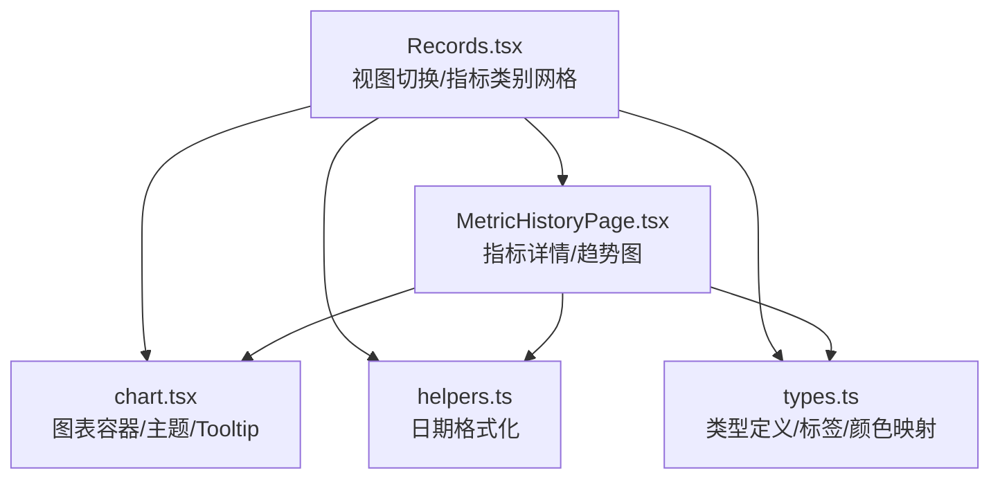
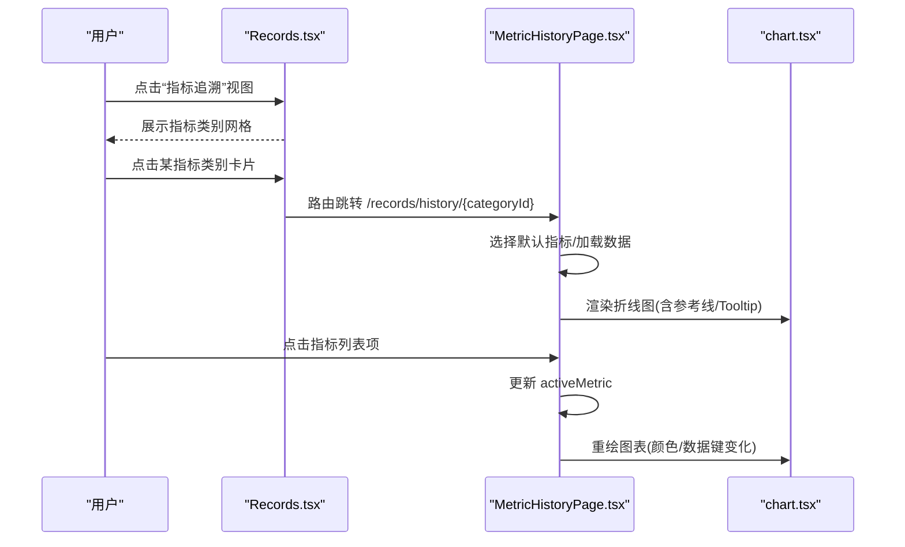
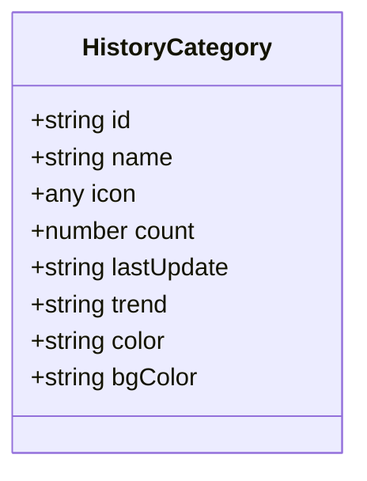
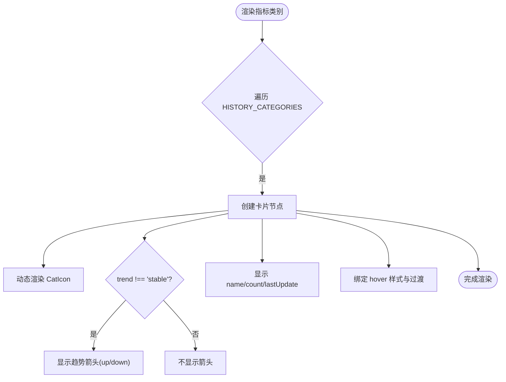
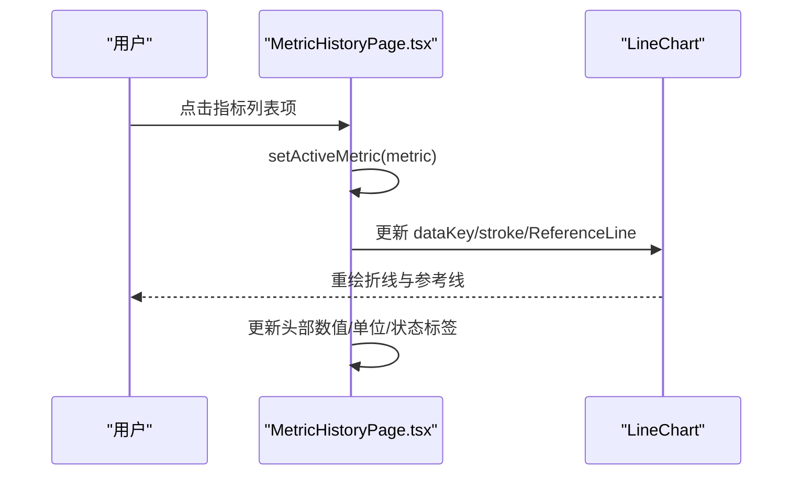
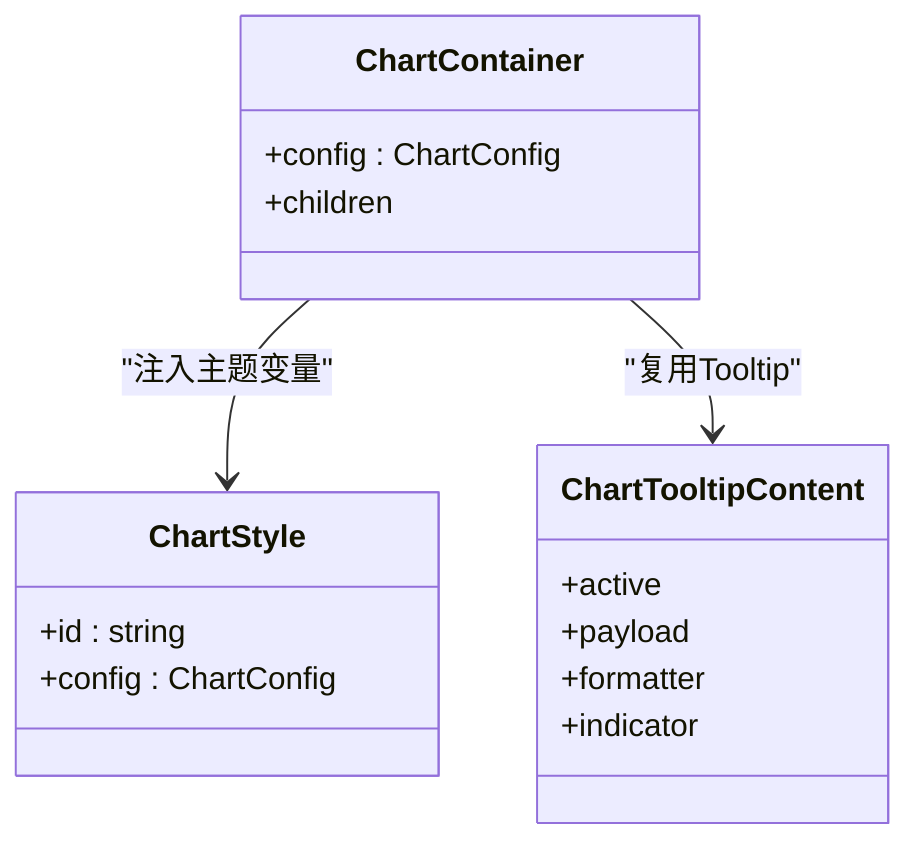
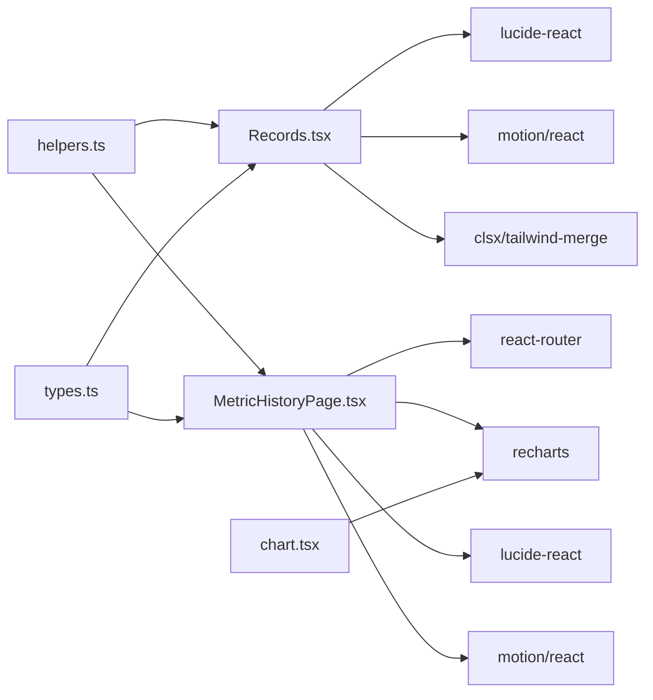

# 指标追溯模式

<cite>
**本文引用的文件**
- [MetricHistoryPage.tsx](file://figma-ui/src/app/pages/MetricHistoryPage.tsx)
- [Records.tsx](file://figma-ui/src/app/pages/Records.tsx)
- [types.ts](file://figma-ui/src/app/types.ts)
- [helpers.ts](file://figma-ui/src/app/utils/helpers.ts)
- [chart.tsx](file://figma-ui/src/app/components/ui/chart.tsx)
</cite>

## 目录
1. [简介](#简介)
2. [项目结构](#项目结构)
3. [核心组件](#核心组件)
4. [架构总览](#架构总览)
5. [详细组件分析](#详细组件分析)
6. [依赖关系分析](#依赖关系分析)
7. [性能考量](#性能考量)
8. [故障排查指南](#故障排查指南)
9. [结论](#结论)
10. [附录](#附录)

## 简介
本文件面向医案通医疗档案网站的“指标追溯模式”，系统性说明历史数据聚合展示能力，包括：
- HISTORY_CATEGORIES 数据结构设计与用途
- 指标卡片组件实现与交互
- 趋势指示器显示与动画
- 数据可视化元素（折线图、参考区间线、工具提示）
- 不同指标类型的图标映射、颜色主题配置
- 数量统计显示与最后更新时间格式
- 网格布局、卡片悬停效果、异常指标高亮等UI特性
- 动态图标渲染、条件样式应用、数据绑定与交互响应机制

## 项目结构
指标追溯模式由两个页面协同完成：
- 入口页 Records.tsx：提供“常规列表”和“指标追溯”两种视图切换；在追溯模式下以网格形式展示指标类别卡片。
- 详情页 MetricHistoryPage.tsx：进入具体指标类别后，展示该指标的折线趋势图、当前值、参考区间、异常状态及指标列表。

**图示来源**
- [Records.tsx:101-167](file://figma-ui/src/app/pages/Records.tsx#L101-L167)
- [MetricHistoryPage.tsx:59-153](file://figma-ui/src/app/pages/MetricHistoryPage.tsx#L59-L153)
- [chart.tsx:37-69](file://figma-ui/src/app/components/ui/chart.tsx#L37-L69)
- [helpers.ts:4-19](file://figma-ui/src/app/utils/helpers.ts#L4-L19)
- [types.ts:74-94](file://figma-ui/src/app/types.ts#L74-L94)

**章节来源**
- [Records.tsx:101-167](file://figma-ui/src/app/pages/Records.tsx#L101-L167)
- [MetricHistoryPage.tsx:59-153](file://figma-ui/src/app/pages/MetricHistoryPage.tsx#L59-L153)

## 核心组件
- 指标类别网格（Records.tsx）
  - 使用二维网格布局展示多个指标类别卡片，每个卡片包含图标、名称、报告数量、最后更新时间、趋势指示器。
  - 支持悬停放大、阴影增强、边框高亮等过渡效果。
- 指标详情与趋势图（MetricHistoryPage.tsx）
  - 顶部显示当前选中指标的名称、缩写、数值、单位与异常状态标签。
  - 中部为折线图，展示历史时间序列，叠加上下限参考线。
  - 底部为指标列表，点击切换当前指标并联动图表更新。
- 图表与主题（chart.tsx）
  - 提供可配置的图表容器、主题变量注入、Tooltip 内容定制能力。
- 工具函数（helpers.ts）
  - 提供中文日期格式化、短日期格式化等通用方法。
- 类型与映射（types.ts）
  - 提供档案类型标签与颜色映射，便于统一展示风格。

**章节来源**
- [Records.tsx:339-384](file://figma-ui/src/app/pages/Records.tsx#L339-L384)
- [MetricHistoryPage.tsx:80-153](file://figma-ui/src/app/pages/MetricHistoryPage.tsx#L80-L153)
- [chart.tsx:37-69](file://figma-ui/src/app/components/ui/chart.tsx#L37-L69)
- [helpers.ts:4-19](file://figma-ui/src/app/utils/helpers.ts#L4-L19)
- [types.ts:74-94](file://figma-ui/src/app/types.ts#L74-L94)

## 架构总览
指标追溯模式的交互流程如下：
- 用户在 Records.tsx 中切换到“指标追溯”视图，看到按类别聚合的指标卡片网格。
- 点击某个指标类别卡片，路由跳转到 MetricHistoryPage.tsx，传入 categoryId。
- MetricHistoryPage.tsx 根据当前选中的指标渲染折线图、参考区间线和异常状态。
- 用户可在指标列表中切换不同指标，图表与数值随之更新。
- 图表 Tooltip 展示对应时间点的指标值与医院信息。

**图示来源**
- [Records.tsx:339-384](file://figma-ui/src/app/pages/Records.tsx#L339-L384)
- [MetricHistoryPage.tsx:59-153](file://figma-ui/src/app/pages/MetricHistoryPage.tsx#L59-L153)
- [chart.tsx:37-69](file://figma-ui/src/app/components/ui/chart.tsx#L37-L69)

## 详细组件分析

### 数据结构：HISTORY_CATEGORIES
- 目的：描述“指标追溯”入口处的指标类别集合，用于生成网格卡片。
- 字段说明：
  - id：唯一标识
  - name：类别名称
  - icon：图标组件引用（如 Droplet、HeartPulse、Activity、Dna）
  - count：该类别下的历史报告数量
  - lastUpdate：最后更新时间（字符串）
  - trend：趋势方向（up/down/stable），用于右上角趋势指示器
  - color/bgColor：前景色与背景色，用于图标容器配色
- 使用位置：Records.tsx 中以 grid-cols-2 网格渲染，每项卡片通过 cat.icon 动态渲染图标，依据 cat.trend 显示趋势箭头，并展示 count 与 lastUpdate。

**图示来源**
- [Records.tsx:40-56](file://figma-ui/src/app/pages/Records.tsx#L40-L56)

**章节来源**
- [Records.tsx:40-56](file://figma-ui/src/app/pages/Records.tsx#L40-L56)

### 指标卡片组件（Records.tsx）
- 网格布局：grid grid-cols-2 gap-4，确保移动端友好。
- 卡片内容：
  - 图标区域：w-10 h-10 圆角容器，使用 cat.bgColor 与 cat.color 设置背景与图标色。
  - 趋势指示器：当 trend !== "stable" 时显示 TrendingUp，并根据 up/down 调整颜色与旋转。
  - 文本信息：name、count（份报告）、lastUpdate（最后更新）。
- 交互与动效：
  - 悬停：hover:shadow-md、hover:border-blue-100、group-hover:text-blue-600。
  - 入场动画：initial opacity/scale，animate 到可见，exit 反向动画，配合 AnimatePresence。
  - 延迟递增：transition.delay = index * 0.05，形成依次出现效果。

**图示来源**
- [Records.tsx:346-384](file://figma-ui/src/app/pages/Records.tsx#L346-L384)

**章节来源**
- [Records.tsx:346-384](file://figma-ui/src/app/pages/Records.tsx#L346-L384)

### 指标详情与趋势图（MetricHistoryPage.tsx）
- 头部信息：
  - 指标名称与缩写（activeMetric.name/abbr）
  - 当前值与单位（activeMetric.current/unit）
  - 异常状态标签：status !== "normal" 时显示“偏高/偏低”等提示。
- 折线图：
  - 数据源：METRIC_DATA（时间序列数组，包含 date、wbc、rbc、hospital）。
  - X轴：date；Y轴：dataMin/dataMax 自适应范围。
  - 参考线：ReferenceLine y={min/max}，虚线表示参考区间边界。
  - 线条：type="monotone"，stroke 根据 status 动态切换（正常蓝色，异常红色）。
  - 点样式：dot r=4，activeDot r=6，颜色随状态变化。
  - Tooltip：CustomTooltip 显示 label、value、hospital。
- 指标列表：
  - 列表项包含 name、abbr、参考区间、current、unit。
  - 右侧显示趋势箭头：TrendingUp/TrendingDown/Minus，颜色随 status 变化。
  - 点击切换 activeMetric，触发图表与头部信息更新。

**图示来源**
- [MetricHistoryPage.tsx:80-153](file://figma-ui/src/app/pages/MetricHistoryPage.tsx#L80-L153)
- [MetricHistoryPage.tsx:168-210](file://figma-ui/src/app/pages/MetricHistoryPage.tsx#L168-L210)

**章节来源**
- [MetricHistoryPage.tsx:80-153](file://figma-ui/src/app/pages/MetricHistoryPage.tsx#L80-L153)
- [MetricHistoryPage.tsx:168-210](file://figma-ui/src/app/pages/MetricHistoryPage.tsx#L168-L210)

### 图表容器与主题（chart.tsx）
- ChartContainer：
  - 提供 data-chart 标识与 CSS 变量注入，支持多主题（light/dark）。
  - 内部包裹 Recharts.ResponsiveContainer，保证响应式。
- ChartStyle：
  - 根据 config 生成 CSS 变量 --color-*，供图表元素引用。
- ChartTooltipContent：
  - 支持自定义 indicator（dot/line/dashed）、formatter、icon 渲染。
  - 可隐藏 label/indicator，适配不同场景。

**图示来源**
- [chart.tsx:37-69](file://figma-ui/src/app/components/ui/chart.tsx#L37-L69)
- [chart.tsx:72-103](file://figma-ui/src/app/components/ui/chart.tsx#L72-L103)
- [chart.tsx:107-200](file://figma-ui/src/app/components/ui/chart.tsx#L107-L200)

**章节来源**
- [chart.tsx:37-69](file://figma-ui/src/app/components/ui/chart.tsx#L37-L69)
- [chart.tsx:72-103](file://figma-ui/src/app/components/ui/chart.tsx#L72-L103)
- [chart.tsx:107-200](file://figma-ui/src/app/components/ui/chart.tsx#L107-L200)

### 日期格式化与工具函数（helpers.ts）
- formatDate：输出中文长日期（年/月/日）。
- formatDateShort：输出中文短日期。
- isExpired/daysUntilExpiry：用于过期判断与倒计时计算。
- generateId/maskPhone：辅助生成ID与隐私脱敏。

**章节来源**
- [helpers.ts:4-51](file://figma-ui/src/app/utils/helpers.ts#L4-L51)

### 类型与映射（types.ts）
- ArchiveType 枚举：门诊病历、检验报告、影像报告、处方、体检报告、出院记录、发票、其他。
- ARCHIVE_TYPE_LABELS：类型到中文标签的映射。
- ARCHIVE_TYPE_COLORS：类型到 Tailwind 颜色类的映射，用于统一标签样式。

**章节来源**
- [types.ts:27-94](file://figma-ui/src/app/types.ts#L27-L94)

## 依赖关系分析
- Records.tsx 依赖：
  - lucide-react 图标库（Droplet、HeartPulse、Activity、Dna、TrendingUp 等）
  - motion/react 动画（AnimatePresence、Motion.div）
  - clsx/tailwind-merge 样式合并
- MetricHistoryPage.tsx 依赖：
  - react-router（Link、useParams、useNavigate）
  - recharts（LineChart、Line、XAxis、YAxis、CartesianGrid、Tooltip、ResponsiveContainer、ReferenceLine）
  - lucide-react（ChevronLeft、TrendingUp、TrendingDown、Minus、Calendar、AlertCircle、Building、FileImage）
  - motion/react（Motion.div 入场动画）
- chart.tsx 依赖：
  - recharts（封装容器与Tooltip）
  - 主题变量注入逻辑
- helpers.ts/types.ts 被多处复用，提供统一的数据处理与样式映射。

**图示来源**
- [Records.tsx:1-21](file://figma-ui/src/app/pages/Records.tsx#L1-L21)
- [MetricHistoryPage.tsx:1-21](file://figma-ui/src/app/pages/MetricHistoryPage.tsx#L1-L21)
- [chart.tsx:1-6](file://figma-ui/src/app/components/ui/chart.tsx#L1-L6)

**章节来源**
- [Records.tsx:1-21](file://figma-ui/src/app/pages/Records.tsx#L1-L21)
- [MetricHistoryPage.tsx:1-21](file://figma-ui/src/app/pages/MetricHistoryPage.tsx#L1-L21)
- [chart.tsx:1-6](file://figma-ui/src/app/components/ui/chart.tsx#L1-L6)

## 性能考量
- 列表渲染优化：
  - 使用 key 稳定标识（metric.id/cat.id），避免不必要的重渲染。
  - 列表项动画采用延迟递增，降低首屏压力。
- 图表渲染：
  - 使用 ResponsiveContainer 自适应尺寸，减少重复计算。
  - ReferenceLine 仅在必要时绘制，避免过多图形元素。
- 样式与主题：
  - 通过 CSS 变量集中管理颜色，减少内联样式开销。
  - 使用 tailwind-merge 合并类名，避免冲突与冗余。
- 交互响应：
  - 点击切换指标仅更新 activeMetric，局部重绘，提升流畅度。

[本节为通用指导，无需特定文件引用]

## 故障排查指南
- 图表不显示或空白：
  - 检查 METRIC_DATA 是否包含有效数据与正确字段（date、wbc/rbc）。
  - 确认 Line 的 dataKey 与实际数据一致。
  - 验证 YAxis domain 设置是否合理（dataMin/dataMax）。
- 参考线未显示：
  - 确认 ReferenceLine 的 y 值与 activeMetric.min/max 绑定正确。
- 趋势箭头不显示：
  - 检查 HISTORY_METRICS 的 status 是否为 high/low/normal。
  - 确认条件渲染逻辑与图标组件导入正确。
- 日期格式不正确：
  - 使用 helpers.ts 的 formatDate/formatDateShort 进行统一格式化。
- 主题颜色不生效：
  - 确认 chart.tsx 的 ChartContainer 已包裹图表，且 config 中包含颜色配置。

**章节来源**
- [MetricHistoryPage.tsx:112-143](file://figma-ui/src/app/pages/MetricHistoryPage.tsx#L112-L143)
- [helpers.ts:4-19](file://figma-ui/src/app/utils/helpers.ts#L4-L19)
- [chart.tsx:37-69](file://figma-ui/src/app/components/ui/chart.tsx#L37-L69)

## 结论
指标追溯模式通过 Records.tsx 的网格化指标类别入口与 MetricHistoryPage.tsx 的详细趋势图，实现了从宏观聚合到微观分析的完整链路。借助 HISTORY_CATEGORIES 数据结构、动态图标渲染、条件样式与动画效果，以及 recharts 的可视化能力，系统提供了直观、易用的历史数据追踪体验。同时，chart.tsx 的主题与 Tooltip 定制能力进一步增强了可配置性与一致性。

[本节为总结性内容，无需特定文件引用]

## 附录

### 关键代码片段路径（示例）
- 动态图标渲染：[Records.tsx:346-365](file://figma-ui/src/app/pages/Records.tsx#L346-L365)
- 条件样式应用（异常高亮）：[MetricHistoryPage.tsx:90-106](file://figma-ui/src/app/pages/MetricHistoryPage.tsx#L90-L106)
- 数据绑定（折线图）：[MetricHistoryPage.tsx:112-143](file://figma-ui/src/app/pages/MetricHistoryPage.tsx#L112-L143)
- 交互响应（切换指标）：[MetricHistoryPage.tsx:168-210](file://figma-ui/src/app/pages/MetricHistoryPage.tsx#L168-L210)
- 日期格式化：[helpers.ts:4-19](file://figma-ui/src/app/utils/helpers.ts#L4-L19)
- 类型与颜色映射：[types.ts:74-94](file://figma-ui/src/app/types.ts#L74-L94)