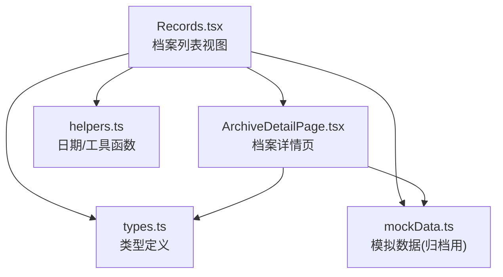
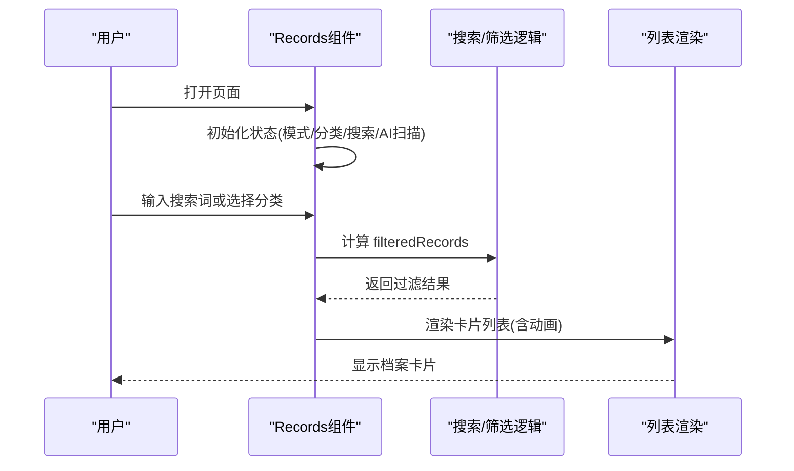
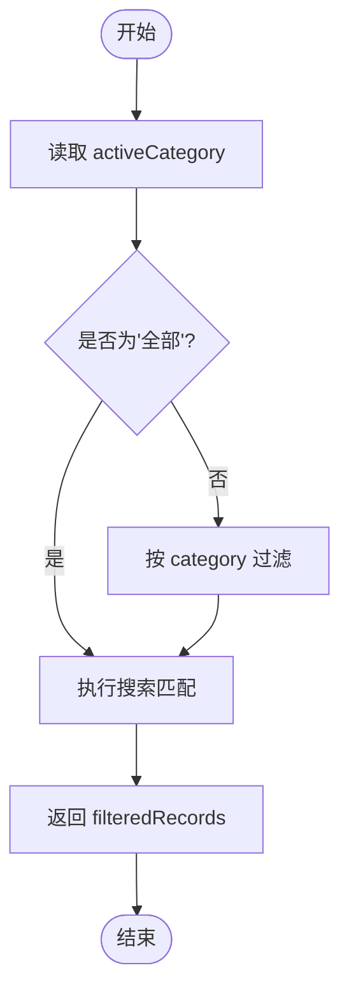
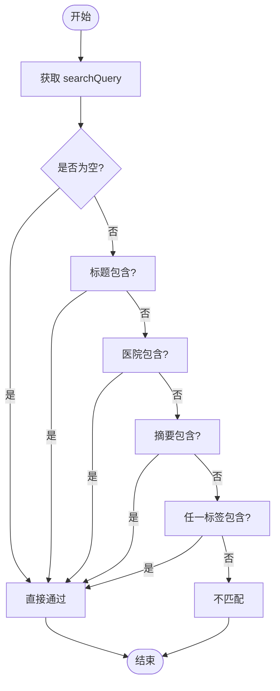
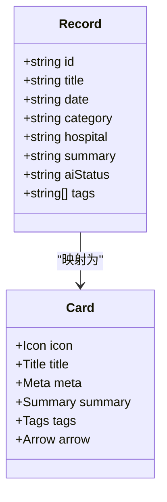
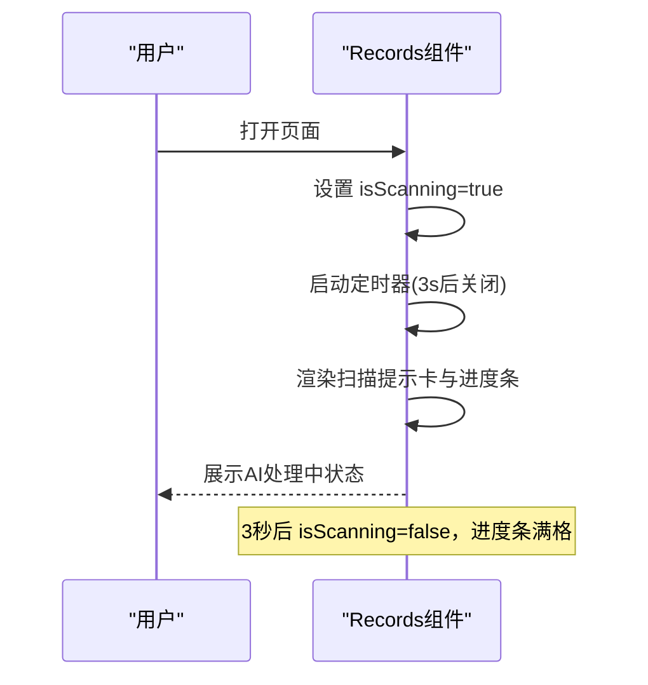
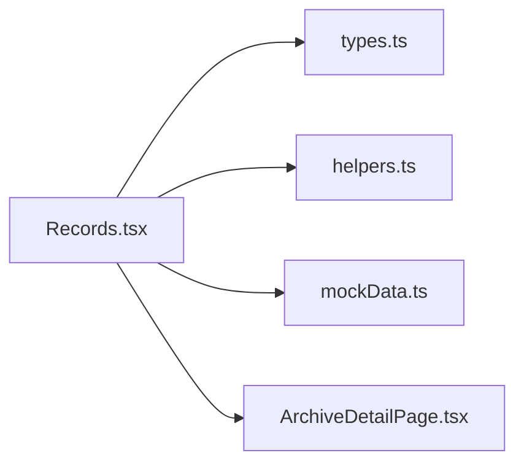

# 档案列表视图

<cite>
**本文引用的文件**
- [Records.tsx](file://figma-ui/src/app/pages/Records.tsx)
- [types.ts](file://figma-ui/src/app/types.ts)
- [mockData.ts](file://figma-ui/src/utils/mockData.ts)
- [ArchiveDetailPage.tsx](file://figma-ui/src/app/pages/ArchiveDetailPage.tsx)
- [helpers.ts](file://figma-ui/src/app/utils/helpers.ts)
</cite>

## 目录
1. [简介](#简介)
2. [项目结构](#项目结构)
3. [核心组件](#核心组件)
4. [架构总览](#架构总览)
5. [详细组件分析](#详细组件分析)
6. [依赖关系分析](#依赖关系分析)
7. [性能考量](#性能考量)
8. [故障排查指南](#故障排查指南)
9. [结论](#结论)
10. [附录](#附录)

## 简介
本文件面向“医案通”医疗档案网站的“档案列表视图”，聚焦常规模式下的档案卡片展示、分类筛选、多条件搜索、动画与交互，以及上传后AI处理状态展示、标签系统渲染、医院信息与日期格式化等UI细节。文档同时说明Record数据结构定义、MOCK_RECORDS模拟数据组织方式、分类过滤器的实现机制与多条件搜索逻辑，并提供可落地的优化建议与代码片段路径指引。

## 项目结构
- 页面入口：档案列表视图由 Records 组件提供，负责常规模式与指标追溯模式的切换、搜索与分类筛选、列表渲染与动画。
- 类型定义：types.ts 定义了全局的 Archive、OCRData、LabItem、PrescriptionItem 等类型，用于详情页与列表页的数据契约。
- 模拟数据：mockData.ts 提供 MOCK_ARCHIVES 及初始化逻辑，供详情页与列表页在本地存储为空时回退使用。
- 详情展示：ArchiveDetailPage.tsx 根据 Archive.type 动态渲染不同内容（检验报告、处方、门诊病历、影像检查），并展示AI提取信息。
- 工具函数：helpers.ts 提供日期格式化、过期判断、ID生成等通用方法。

图表来源
- [Records.tsx:1-421](file://figma-ui/src/app/pages/Records.tsx#L1-L421)
- [types.ts:11-94](file://figma-ui/src/app/types.ts#L11-L94)
- [mockData.ts:1-98](file://figma-ui/src/utils/mockData.ts#L1-L98)
- [ArchiveDetailPage.tsx:1-356](file://figma-ui/src/app/pages/ArchiveDetailPage.tsx#L1-L356)
- [helpers.ts:1-51](file://figma-ui/src/app/utils/helpers.ts#L1-L51)

章节来源
- [Records.tsx:1-421](file://figma-ui/src/app/pages/Records.tsx#L1-L421)
- [types.ts:11-94](file://figma-ui/src/app/types.ts#L11-L94)
- [mockData.ts:1-98](file://figma-ui/src/utils/mockData.ts#L1-L98)
- [ArchiveDetailPage.tsx:1-356](file://figma-ui/src/app/pages/ArchiveDetailPage.tsx#L1-L356)
- [helpers.ts:1-51](file://figma-ui/src/app/utils/helpers.ts#L1-L51)

## 核心组件
- Records 组件
  - 视图模式切换：常规模式与指标追溯模式，通过状态控制渲染分支。
  - 搜索与筛选：支持按分类过滤与多字段搜索（标题、医院、摘要、标签）。
  - AI处理状态展示：上传后的扫描进度条与扫描线动画，自动停止以演示效果。
  - 列表渲染：档案卡片包含图标、标题、日期、医院、AI摘要、标签与导航箭头，带入场与布局动画。
  - 交互响应：点击分类按钮更新 activeCategory；输入框 onChange 更新 searchQuery；模式切换按钮带动画切换。

章节来源
- [Records.tsx:27-36](file://figma-ui/src/app/pages/Records.tsx#L27-L36)
- [Records.tsx:51-99](file://figma-ui/src/app/pages/Records.tsx#L51-L99)
- [Records.tsx:101-122](file://figma-ui/src/app/pages/Records.tsx#L101-L122)
- [Records.tsx:193-236](file://figma-ui/src/app/pages/Records.tsx#L193-L236)
- [Records.tsx:238-264](file://figma-ui/src/app/pages/Records.tsx#L238-L264)
- [Records.tsx:267-337](file://figma-ui/src/app/pages/Records.tsx#L267-L337)

## 架构总览
常规模式下，用户进入档案列表，首先看到顶部统计与模式切换按钮，随后是搜索栏与可选的AI处理提示卡。下方为水平滚动的分类筛选器，再往下是档案卡片列表。所有数据来源于本地状态与模拟数据，搜索与筛选在渲染前完成，确保列表即时响应。

图表来源
- [Records.tsx:101-122](file://figma-ui/src/app/pages/Records.tsx#L101-L122)
- [Records.tsx:267-337](file://figma-ui/src/app/pages/Records.tsx#L267-L337)

## 详细组件分析

### Record 数据结构与模拟数据
- Record 类型定义
  - 字段包括 id、title、date、category、hospital、summary、aiStatus、tags。
  - aiStatus 用于表示AI处理状态（analyzing/completed/pending），便于在卡片中展示不同状态。
- MOCK_RECORDS 组织方式
  - 数组形式，每条记录对应一个档案条目，包含示例数据如血常规、门诊病历、影像检查、处方记录等。
  - 通过 category 字段区分档案类型，配合分类筛选器进行过滤。
  - tags 字段用于标签渲染与搜索匹配。

章节来源
- [Records.tsx:27-36](file://figma-ui/src/app/pages/Records.tsx#L27-L36)
- [Records.tsx:58-99](file://figma-ui/src/app/pages/Records.tsx#L58-L99)

### 分类筛选逻辑
- 分类常量 CATEGORIES 定义“全部、门诊病历、化验报告、处方记录、影像检查”。
- 筛选逻辑：activeCategory 为“全部”时不过滤；否则仅保留 category 匹配的项。
- 与搜索组合：最终结果为分类过滤与搜索匹配结果的交集。

图表来源
- [Records.tsx:38-38](file://figma-ui/src/app/pages/Records.tsx#L38-L38)
- [Records.tsx:113-122](file://figma-ui/src/app/pages/Records.tsx#L113-L122)

章节来源
- [Records.tsx:38-38](file://figma-ui/src/app/pages/Records.tsx#L38-L38)
- [Records.tsx:113-122](file://figma-ui/src/app/pages/Records.tsx#L113-L122)

### 多条件搜索算法
- 搜索范围：标题、医院、摘要、标签（任一标签命中即算匹配）。
- 大小写不敏感：统一转为小写进行比较。
- 空查询：当 searchQuery 为空时，跳过搜索匹配，仅受分类过滤影响。

图表来源
- [Records.tsx:113-122](file://figma-ui/src/app/pages/Records.tsx#L113-L122)

章节来源
- [Records.tsx:113-122](file://figma-ui/src/app/pages/Records.tsx#L113-L122)

### 列表渲染与卡片组件
- 卡片组成：
  - 左侧图标：根据 category 动态选择（病历、处方、其他）。
  - 标题与元信息：标题、日期、医院（截断显示）。
  - AI摘要区域：背景色块与行高限制，突出AI提取内容。
  - 标签系统：按标签内容动态着色（异常类红色系，其他蓝色系）。
  - 导航箭头：右侧指示可点击进入详情页。
- 动画与过渡：
  - 列表项入场：淡入、缩放、位移，延迟递增形成瀑布式效果。
  - 悬停反馈：阴影加深、边框变色、渐变背景。
  - 模式切换：图标旋转与透明度变化，增强交互感。

图表来源
- [Records.tsx:27-36](file://figma-ui/src/app/pages/Records.tsx#L27-L36)
- [Records.tsx:267-337](file://figma-ui/src/app/pages/Records.tsx#L267-L337)

章节来源
- [Records.tsx:267-337](file://figma-ui/src/app/pages/Records.tsx#L267-L337)

### AI处理状态展示（上传后）
- 扫描提示卡：仅在常规模式且无搜索时显示，包含“AI智能提取中”标签与“刚刚上传”时间戳。
- 扫描线动画：垂直移动的半透明扫描线，循环播放，营造正在处理的视觉反馈。
- 进度条：宽度从0到75%或100%，根据 isScanning 状态驱动，体现处理进度。
- 自动停止：使用定时器在演示场景下自动结束扫描，避免无限加载。

图表来源
- [Records.tsx:107-111](file://figma-ui/src/app/pages/Records.tsx#L107-L111)
- [Records.tsx:193-236](file://figma-ui/src/app/pages/Records.tsx#L193-L236)

章节来源
- [Records.tsx:107-111](file://figma-ui/src/app/pages/Records.tsx#L107-L111)
- [Records.tsx:193-236](file://figma-ui/src/app/pages/Records.tsx#L193-L236)

### 标签系统与医院信息展示
- 标签渲染：
  - 基于 tag 内容判断样式（异常类红色系，其他蓝色系）。
  - 使用紧凑尺寸与圆角，保持卡片整洁。
- 医院信息：
  - 在卡片元信息中显示医院名称，超长文本截断显示。
  - 详情页进一步展示医院与科室信息，结合日历图标与就诊时间。

章节来源
- [Records.tsx:314-333](file://figma-ui/src/app/pages/Records.tsx#L314-L333)
- [ArchiveDetailPage.tsx:287-302](file://figma-ui/src/app/pages/ArchiveDetailPage.tsx#L287-L302)

### 日期格式化与UI细节
- 日期格式化工具：
  - formatDate：中文长日期格式（年、月、日）。
  - formatDateShort：中文短日期格式。
- 列表中的日期：
  - 当前列表直接使用字符串日期展示，如需统一格式可调用工具函数。
- 其他UI细节：
  - 搜索框聚焦时边框与阴影变化，提升可发现性。
  - 分类按钮选中态高亮，未选中态保持简洁。
  - 卡片悬停时背景渐变与阴影加深，增强层次。

章节来源
- [helpers.ts:1-51](file://figma-ui/src/app/utils/helpers.ts#L1-L51)
- [Records.tsx:178-191](file://figma-ui/src/app/pages/Records.tsx#L178-L191)
- [Records.tsx:238-264](file://figma-ui/src/app/pages/Records.tsx#L238-L264)
- [Records.tsx:289-303](file://figma-ui/src/app/pages/Records.tsx#L289-L303)

### 与详情页的联动
- 列表项链接：每个卡片通过路由跳转到详情页，携带 record.id。
- 详情页数据源：优先从 localStorage 读取，若不存在则回退到 MOCK_ARCHIVES。
- 类型标签与颜色：详情页使用 ARCHIVE_TYPE_LABELS 与 ARCHIVE_TYPE_COLORS 展示类型标识与配色。

章节来源
- [Records.tsx:282-284](file://figma-ui/src/app/pages/Records.tsx#L282-L284)
- [ArchiveDetailPage.tsx:32-40](file://figma-ui/src/app/pages/ArchiveDetailPage.tsx#L32-L40)
- [types.ts:74-94](file://figma-ui/src/app/types.ts#L74-L94)

## 依赖关系分析
- Records.tsx 依赖：
  - 类型定义 types.ts（用于全局类型一致性）。
  - 模拟数据 mockData.ts（详情页使用，列表页内嵌 MOCK_RECORDS）。
  - 工具函数 helpers.ts（可用于日期格式化）。
  - 第三方库：motion/react（动画）、lucide-react（图标）、clsx/tailwind-merge（样式合并）。
- 耦合度与内聚性：
  - Records 组件内聚了状态管理、筛选逻辑与渲染，适合独立维护。
  - 与详情页通过路由参数解耦，数据源可替换为真实API。

图表来源
- [Records.tsx:1-421](file://figma-ui/src/app/pages/Records.tsx#L1-L421)
- [types.ts:11-94](file://figma-ui/src/app/types.ts#L11-L94)
- [helpers.ts:1-51](file://figma-ui/src/app/utils/helpers.ts#L1-L51)
- [mockData.ts:1-98](file://figma-ui/src/utils/mockData.ts#L1-L98)
- [ArchiveDetailPage.tsx:1-356](file://figma-ui/src/app/pages/ArchiveDetailPage.tsx#L1-L356)

章节来源
- [Records.tsx:1-421](file://figma-ui/src/app/pages/Records.tsx#L1-L421)
- [types.ts:11-94](file://figma-ui/src/app/types.ts#L11-L94)
- [helpers.ts:1-51](file://figma-ui/src/app/utils/helpers.ts#L1-L51)
- [mockData.ts:1-98](file://figma-ui/src/utils/mockData.ts#L1-L98)
- [ArchiveDetailPage.tsx:1-356](file://figma-ui/src/app/pages/ArchiveDetailPage.tsx#L1-L356)

## 性能考量
- 列表渲染优化
  - 使用 key 稳定标识（record.id）避免不必要的重渲染。
  - 动画延迟递增减少首屏压力，提升感知性能。
- 搜索与筛选
  - 过滤逻辑简单高效，适用于小规模数据；大数据量时可考虑防抖与索引。
- 动画性能
  - 使用 motion/react 的 layout 与 AnimatePresence 保证平滑过渡。
  - 扫描线与进度条动画应避免阻塞主线程。
- 内存与状态
  - 状态变量较少，易于管理；未来可扩展分页与虚拟滚动。

[本节为通用指导，无需具体文件引用]

## 故障排查指南
- 搜索无结果
  - 检查 searchQuery 是否为空或大小写转换是否正确。
  - 确认标签匹配逻辑是否覆盖所有字段。
- 分类筛选无效
  - 验证 activeCategory 是否与记录的 category 完全一致。
  - 注意“全部”选项应跳过分类过滤。
- AI扫描动画不停止
  - 检查定时器是否被正确清理，避免重复创建。
  - 确认 isScanning 状态是否在预期时机更新。
- 详情页数据为空
  - 确认 localStorage 是否有 archives 数据，若无则回退到 MOCK_ARCHIVES。
  - 检查路由参数 id 是否存在且与数据匹配。

章节来源
- [Records.tsx:107-111](file://figma-ui/src/app/pages/Records.tsx#L107-L111)
- [Records.tsx:113-122](file://figma-ui/src/app/pages/Records.tsx#L113-L122)
- [ArchiveDetailPage.tsx:32-40](file://figma-ui/src/app/pages/ArchiveDetailPage.tsx#L32-L40)

## 结论
档案列表视图在常规模式下提供了清晰的卡片展示、直观的分类筛选与多条件搜索，并通过动画与交互提升用户体验。AI处理状态展示增强了上传后的反馈感，标签系统与医院信息使卡片信息丰富且易读。整体实现简洁、内聚度高，具备良好的扩展性与可维护性。

[本节为总结，无需具体文件引用]

## 附录
- 关键代码片段路径（用于快速定位实现）
  - Record 类型定义：[Records.tsx:27-36](file://figma-ui/src/app/pages/Records.tsx#L27-L36)
  - MOCK_RECORDS 模拟数据：[Records.tsx:58-99](file://figma-ui/src/app/pages/Records.tsx#L58-L99)
  - 分类常量与筛选逻辑：[Records.tsx:38-38](file://figma-ui/src/app/pages/Records.tsx#L38-L38)、[Records.tsx:113-122](file://figma-ui/src/app/pages/Records.tsx#L113-L122)
  - 搜索算法实现：[Records.tsx:113-122](file://figma-ui/src/app/pages/Records.tsx#L113-L122)
  - AI处理状态与动画：[Records.tsx:107-111](file://figma-ui/src/app/pages/Records.tsx#L107-L111)、[Records.tsx:193-236](file://figma-ui/src/app/pages/Records.tsx#L193-L236)
  - 列表渲染与卡片组件：[Records.tsx:267-337](file://figma-ui/src/app/pages/Records.tsx#L267-L337)
  - 标签与医院信息展示：[Records.tsx:314-333](file://figma-ui/src/app/pages/Records.tsx#L314-L333)、[ArchiveDetailPage.tsx:287-302](file://figma-ui/src/app/pages/ArchiveDetailPage.tsx#L287-L302)
  - 日期格式化工具：[helpers.ts:1-51](file://figma-ui/src/app/utils/helpers.ts#L1-L51)
  - 详情页数据源与类型标签：[ArchiveDetailPage.tsx:32-40](file://figma-ui/src/app/pages/ArchiveDetailPage.tsx#L32-L40)、[types.ts:74-94](file://figma-ui/src/app/types.ts#L74-L94)