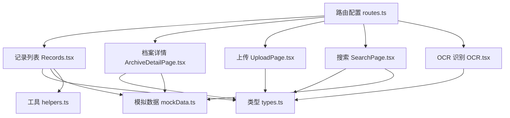
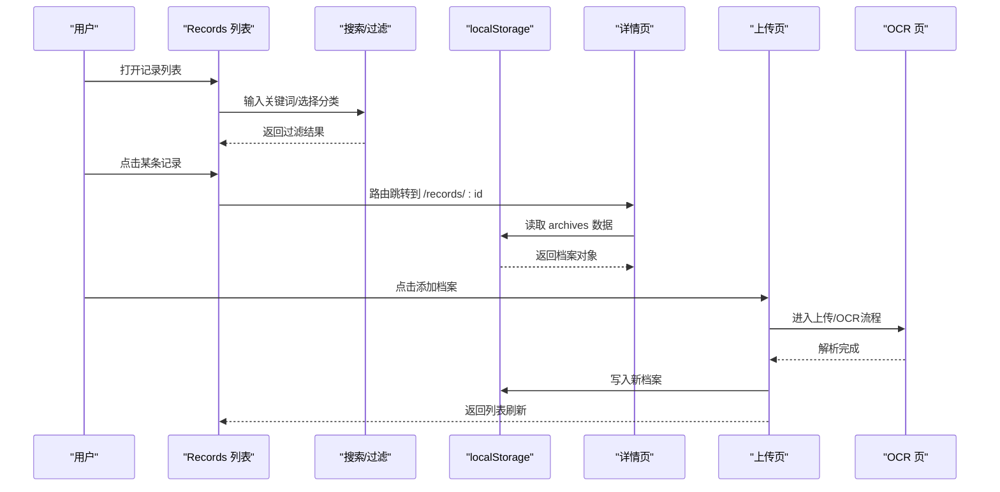
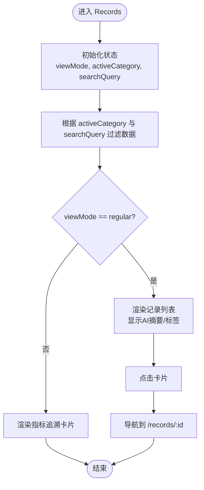
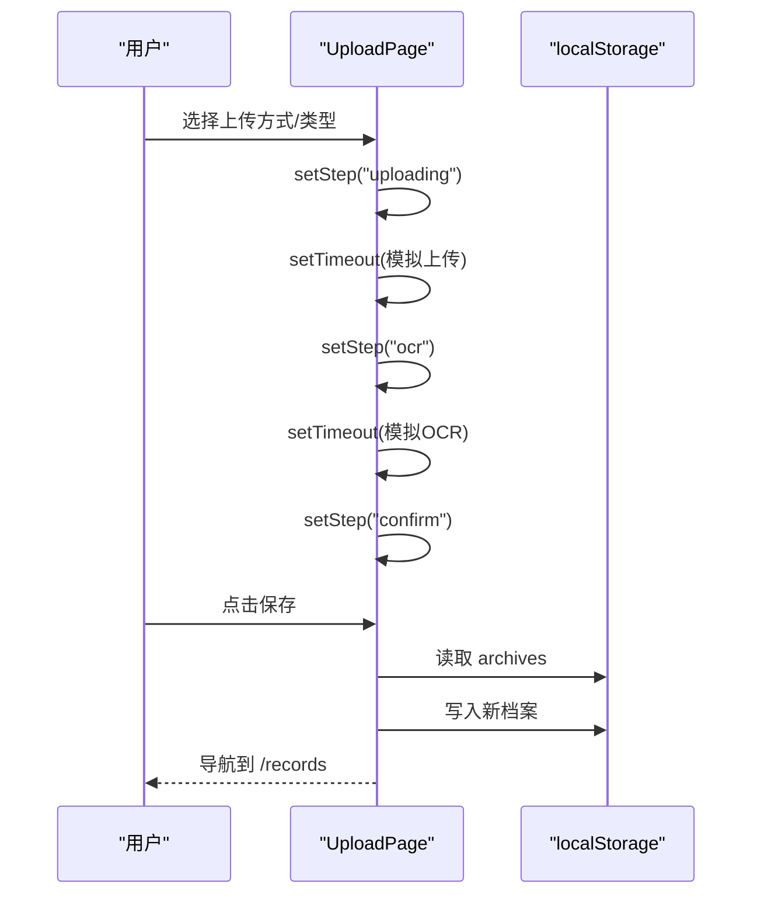
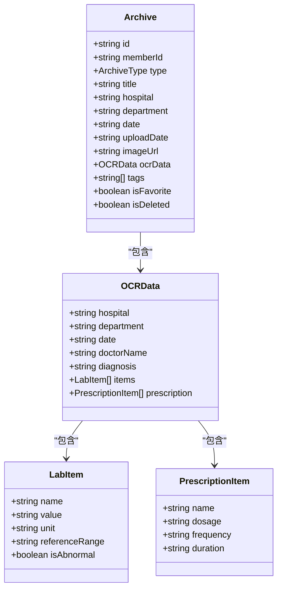
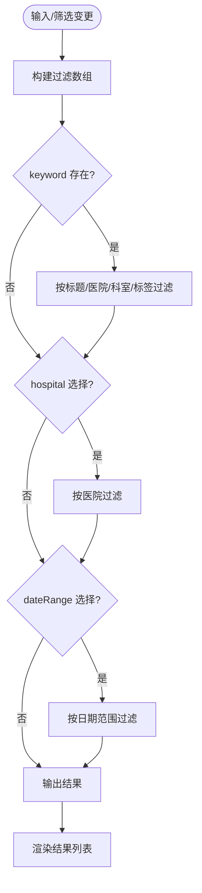
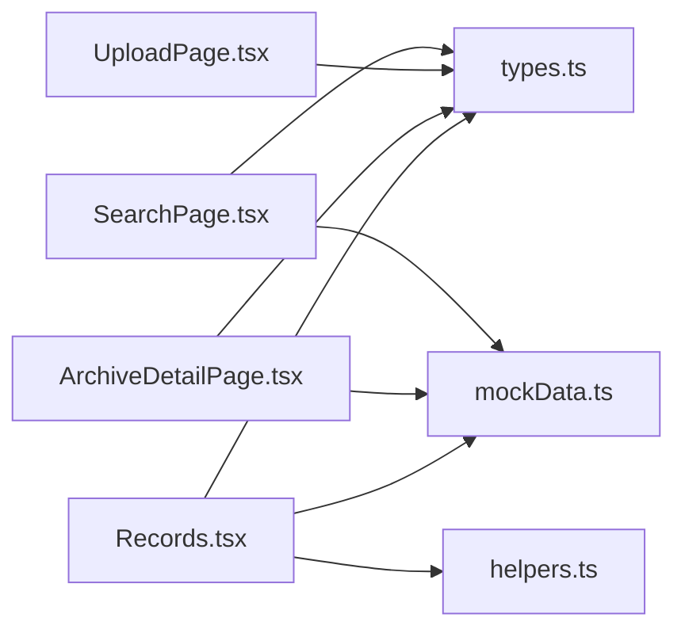

# 档案管理页面

<cite>
**本文引用的文件**
- [Records.tsx](file://figma-ui/src/app/pages/Records.tsx)
- [UploadPage.tsx](file://figma-ui/src/app/pages/UploadPage.tsx)
- [ArchiveDetailPage.tsx](file://figma-ui/src/app/pages/ArchiveDetailPage.tsx)
- [SearchPage.tsx](file://figma-ui/src/app/pages/SearchPage.tsx)
- [OCR.tsx](file://figma-ui/src/app/pages/OCR.tsx)
- [types.ts](file://figma-ui/src/app/types.ts)
- [mockData.ts](file://figma-ui/src/app/utils/mockData.ts)
- [helpers.ts](file://figma-ui/src/app/utils/helpers.ts)
- [routes.ts](file://figma-ui/src/app/routes.ts)
</cite>

## 目录
1. [简介](#简介)
2. [项目结构](#项目结构)
3. [核心组件与功能](#核心组件与功能)
4. [架构总览](#架构总览)
5. [详细组件分析](#详细组件分析)
6. [依赖关系分析](#依赖关系分析)
7. [性能考虑](#性能考虑)
8. [故障排查指南](#故障排查指南)
9. [结论](#结论)
10. [附录](#附录)

## 简介
本文件为“医案通”医疗档案网站中 Records 档案管理页面的完整技术文档。内容覆盖：
- 文档上传、分类管理、搜索筛选、详情查看等核心业务逻辑
- 页面状态管理、文件处理流程、数据验证机制与用户交互设计
- 文件上传组件集成、OCR 识别结果展示、标签系统实现与分页加载方案
- 页面与后端 API 的交互模式（当前为本地存储模拟）、错误处理策略与本地存储方案

## 项目结构
该页面属于前端 React + TypeScript 工程，采用路由驱动的多页面组织方式。与档案管理相关的关键文件包括：
- 列表页：Records.tsx
- 详情页：ArchiveDetailPage.tsx
- 上传页：UploadPage.tsx
- 搜索页：SearchPage.tsx
- OCR 页：OCR.tsx
- 类型定义：types.ts
- 模拟数据与初始化：mockData.ts
- 工具函数：helpers.ts
- 路由配置：routes.ts

图表来源
- [routes.ts:25-88](file://figma-ui/src/app/routes.ts#L25-L88)
- [Records.tsx:1-421](file://figma-ui/src/app/pages/Records.tsx#L1-L421)
- [ArchiveDetailPage.tsx:1-356](file://figma-ui/src/app/pages/ArchiveDetailPage.tsx#L1-L356)
- [UploadPage.tsx:1-278](file://figma-ui/src/app/pages/UploadPage.tsx#L1-L278)
- [SearchPage.tsx:1-286](file://figma-ui/src/app/pages/SearchPage.tsx#L1-L286)
- [OCR.tsx:228-269](file://figma-ui/src/app/pages/OCR.tsx#L228-L269)
- [types.ts:1-95](file://figma-ui/src/app/types.ts#L1-L95)
- [mockData.ts:1-98](file://figma-ui/src/app/utils/mockData.ts#L1-L98)
- [helpers.ts:1-52](file://figma-ui/src/app/utils/helpers.ts#L1-L52)

章节来源
- [routes.ts:25-88](file://figma-ui/src/app/routes.ts#L25-L88)

## 核心组件与功能
- 记录列表（Records）
  - 视图切换：常规列表 / 指标追溯
  - 搜索：标题、医院、摘要、标签多字段模糊匹配
  - 分类过滤：全部、门诊病历、化验报告、处方记录、影像检查
  - AI 扫描进度提示与动画
  - 标签系统：异常/常规标签样式区分
  - 跳转详情：通过路由链接到详情页
- 上传（UploadPage）
  - 步骤化流程：选择类型 → 上传 → OCR 解析 → 确认归档
  - 模拟上传与 OCR 处理，完成后写入本地存储并跳转
- 详情（ArchiveDetailPage）
  - 按档案类型渲染不同内容：检验报告、处方、门诊病历、影像报告
  - 从 localStorage 或模拟数据读取档案
  - 标签、医生、诊断、用药提醒等结构化展示
- 搜索（SearchPage）
  - 关键词搜索：标题、医院、科室、标签
  - 机构筛选：按医院去重后提供快捷按钮
  - 时间范围筛选：近一周/一月/三月/一年
  - 结果计数与空态提示
- OCR（OCR.tsx）
  - 识别贴士与预览区域（占位），用于上传后的识别流程衔接

章节来源
- [Records.tsx:101-421](file://figma-ui/src/app/pages/Records.tsx#L101-L421)
- [UploadPage.tsx:7-278](file://figma-ui/src/app/pages/UploadPage.tsx#L7-L278)
- [ArchiveDetailPage.tsx:27-356](file://figma-ui/src/app/pages/ArchiveDetailPage.tsx#L27-L356)
- [SearchPage.tsx:7-286](file://figma-ui/src/app/pages/SearchPage.tsx#L7-L286)
- [OCR.tsx:228-269](file://figma-ui/src/app/pages/OCR.tsx#L228-L269)

## 架构总览
整体采用“页面组件 + 类型定义 + 本地存储”的前端架构。当前未接入真实后端 API，所有数据读写均基于浏览器 localStorage；未来可替换为 REST/GraphQL 接口。

图表来源
- [Routes.ts:25-88](file://figma-ui/src/app/routes.ts#L25-L88)
- [Records.tsx:113-122](file://figma-ui/src/app/pages/Records.tsx#L113-L122)
- [ArchiveDetailPage.tsx:32-40](file://figma-ui/src/app/pages/ArchiveDetailPage.tsx#L32-L40)
- [UploadPage.tsx:12-52](file://figma-ui/src/app/pages/UploadPage.tsx#L12-L52)
- [OCR.tsx:228-269](file://figma-ui/src/app/pages/OCR.tsx#L228-L269)

## 详细组件分析

### 记录列表（Records）
- 状态管理
  - 视图模式：regular/history
  - 活跃分类：activeCategory
  - 扫描动画：isScanning（演示用自动停止）
  - 搜索词：searchQuery
- 数据流
  - 使用内置 MOCK_RECORDS 进行演示
  - 过滤逻辑：同时满足分类与搜索条件
- 交互设计
  - 顶部模式切换按钮带动画
  - 搜索框聚焦高亮
  - 分类横向滚动
  - 卡片悬停动效与标签样式
- 路由
  - 点击卡片跳转到 /records/:id

图表来源
- [Records.tsx:101-122](file://figma-ui/src/app/pages/Records.tsx#L101-L122)
- [Records.tsx:269-337](file://figma-ui/src/app/pages/Records.tsx#L269-L337)

章节来源
- [Records.tsx:27-122](file://figma-ui/src/app/pages/Records.tsx#L27-L122)
- [Records.tsx:124-421](file://figma-ui/src/app/pages/Records.tsx#L124-L421)

### 上传流程（UploadPage）
- 步骤化流程
  - select：选择类型（拍照/相册/微信导入/特定类型）
  - uploading：模拟上传进度
  - ocr：模拟 OCR 解析进度
  - confirm：展示解析结果并保存
- 数据持久化
  - 将新档案写入 localStorage 的 archives 键
  - 使用 currentMemberId 关联成员
- 导航
  - 确认后跳转回 /records

图表来源
- [UploadPage.tsx:12-52](file://figma-ui/src/app/pages/UploadPage.tsx#L12-L52)

章节来源
- [UploadPage.tsx:7-278](file://figma-ui/src/app/pages/UploadPage.tsx#L7-L278)

### 档案详情（ArchiveDetailPage）
- 数据来源
  - 优先从 localStorage 读取 archives，找不到则回退到 mockData
- 内容渲染
  - 根据 type 动态渲染：lab_report/prescription/medical_record/imaging_report
  - 异常指标高亮、用药提醒、影像占位图
- 导航与操作
  - 返回上一页、分享、更多操作、下载、AI 助手入口

图表来源
- [types.ts:11-61](file://figma-ui/src/app/types.ts#L11-L61)

章节来源
- [ArchiveDetailPage.tsx:27-356](file://figma-ui/src/app/pages/ArchiveDetailPage.tsx#L27-L356)
- [types.ts:11-61](file://figma-ui/src/app/types.ts#L11-L61)

### 搜索与筛选（SearchPage）
- 搜索算法
  - 关键词匹配：title/hospital/department/tags
  - 机构筛选：按医院去重生成选项
  - 时间范围：week/month/quarter/year
- 状态更新
  - keyword、selectedHospital、selectedDateRange 变化时触发 filterArchives
- 结果展示
  - 数量统计、空态提示、卡片展示类型标签与 AI 已解析标识

图表来源
- [SearchPage.tsx:25-69](file://figma-ui/src/app/pages/SearchPage.tsx#L25-L69)

章节来源
- [SearchPage.tsx:7-286](file://figma-ui/src/app/pages/SearchPage.tsx#L7-L286)

### OCR 识别（OCR.tsx）
- 功能要点
  - 识别贴士：光线、摆放、边缘拍摄建议
  - 预览区占位：用于后续对接真实图片/文件预览
  - 底部操作：存入草稿/确认归档（占位）
- 与上传流程衔接
  - 作为上传流程中的 OCR 阶段，配合 UploadPage 的步骤化体验

章节来源
- [OCR.tsx:228-269](file://figma-ui/src/app/pages/OCR.tsx#L228-L269)

## 依赖关系分析
- 组件耦合
  - Records 与 SearchPage 各自维护独立的状态与过滤逻辑，低耦合
  - ArchiveDetailPage 依赖 types 与 mockData，便于扩展真实数据源
  - UploadPage 与 OCR 通过步骤状态协作，最终统一写入 localStorage
- 外部依赖
  - React Router：路由与参数传递
  - lucide-react：图标
  - motion/react：动画
  - clsx/tailwind-merge：样式合并
- 数据层
  - 当前使用 localStorage 作为本地存储
  - 可通过 initializeMockData 初始化默认数据

图表来源
- [Records.tsx:1-421](file://figma-ui/src/app/pages/Records.tsx#L1-L421)
- [ArchiveDetailPage.tsx:1-356](file://figma-ui/src/app/pages/ArchiveDetailPage.tsx#L1-L356)
- [UploadPage.tsx:1-278](file://figma-ui/src/app/pages/UploadPage.tsx#L1-L278)
- [SearchPage.tsx:1-286](file://figma-ui/src/app/pages/SearchPage.tsx#L1-L286)
- [types.ts:1-95](file://figma-ui/src/app/types.ts#L1-L95)
- [mockData.ts:1-98](file://figma-ui/src/app/utils/mockData.ts#L1-L98)
- [helpers.ts:1-52](file://figma-ui/src/app/utils/helpers.ts#L1-L52)

章节来源
- [types.ts:1-95](file://figma-ui/src/app/types.ts#L1-L95)
- [mockData.ts:1-98](file://figma-ui/src/app/utils/mockData.ts#L1-L98)

## 性能考虑
- 列表渲染
  - Records 使用简单数组过滤，数据量较小时性能良好；若数据增长，建议引入虚拟列表或分页
- 搜索与筛选
  - SearchPage 每次输入都会重新计算过滤，建议在大数据集下加入防抖与索引优化
- 动画与过渡
  - motion/react 动画在移动端可能带来额外开销，可按需降级或减少复杂动画
- 本地存储
  - localStorage 容量有限，建议对大文件或大量记录进行分片或迁移至 IndexedDB/后端

[本节为通用指导，不直接分析具体文件]

## 故障排查指南
- 无法找到档案详情
  - 现象：详情页显示“未找到相关档案”
  - 原因：localStorage 中不存在对应 id，且 mockData 也未命中
  - 解决：确保上传流程成功写入 archives，或检查路由参数 id
  - 参考位置
    - [ArchiveDetailPage.tsx:32-52](file://figma-ui/src/app/pages/ArchiveDetailPage.tsx#L32-L52)
- 上传后列表未刷新
  - 现象：上传成功后返回列表看不到新档案
  - 原因：Records 使用内存中的 MOCK_RECORDS，未监听 localStorage 变化
  - 解决：在 Records 中增加 useEffect 监听 archives 变化并重新渲染
  - 参考位置
    - [Records.tsx:58-99](file://figma-ui/src/app/pages/Records.tsx#L58-L99)
    - [UploadPage.tsx:26-52](file://figma-ui/src/app/pages/UploadPage.tsx#L26-L52)
- 搜索结果为空
  - 现象：搜索无结果
  - 原因：关键词不匹配或筛选条件过严
  - 解决：放宽关键词或重置筛选条件
  - 参考位置
    - [SearchPage.tsx:25-69](file://figma-ui/src/app/pages/SearchPage.tsx#L25-L69)
    - [SearchPage.tsx:188-199](file://figma-ui/src/app/pages/SearchPage.tsx#L188-L199)
- 本地存储初始化
  - 现象：首次访问无数据
  - 解决：调用 initializeMockData 初始化默认数据
  - 参考位置
    - [mockData.ts:91-98](file://figma-ui/src/app/utils/mockData.ts#L91-L98)

章节来源
- [ArchiveDetailPage.tsx:32-52](file://figma-ui/src/app/pages/ArchiveDetailPage.tsx#L32-L52)
- [Records.tsx:58-99](file://figma-ui/src/app/pages/Records.tsx#L58-L99)
- [UploadPage.tsx:26-52](file://figma-ui/src/app/pages/UploadPage.tsx#L26-L52)
- [SearchPage.tsx:25-69](file://figma-ui/src/app/pages/SearchPage.tsx#L25-L69)
- [SearchPage.tsx:188-199](file://figma-ui/src/app/pages/SearchPage.tsx#L188-L199)
- [mockData.ts:91-98](file://figma-ui/src/app/utils/mockData.ts#L91-L98)

## 结论
本页面以 React + TypeScript 实现了完整的档案管理流程，涵盖上传、OCR、分类、搜索、详情查看等核心能力。当前采用本地存储模拟数据，具备良好的可扩展性，便于后续接入真实后端 API。建议在生产环境中：
- 将 Records 的数据源改为实时请求或订阅 localStorage 变化
- 为搜索与列表增加分页与虚拟滚动
- 完善错误边界与网络重试机制
- 对敏感数据进行加密与权限控制

[本节为总结性内容，不直接分析具体文件]

## 附录

### 关键代码片段路径（不含代码内容）
- 文件拖拽上传（示例思路）
  - 可在 UploadPage 中增加 onDrop/onDragOver 事件，结合 FileReader 读取文件并进入 OCR 流程
  - 参考：[UploadPage.tsx:12-52](file://figma-ui/src/app/pages/UploadPage.tsx#L12-L52)
- 批量操作（示例思路）
  - 在 Records 列表中添加多选状态，支持批量删除/导出/打标签
  - 参考：[Records.tsx:269-337](file://figma-ui/src/app/pages/Records.tsx#L269-L337)
- 搜索算法
  - 关键词匹配与多条件组合过滤
  - 参考：[SearchPage.tsx:25-69](file://figma-ui/src/app/pages/SearchPage.tsx#L25-L69)
- 分类过滤
  - 水平滚动分类按钮与 activeCategory 状态联动
  - 参考：[Records.tsx:238-264](file://figma-ui/src/app/pages/Records.tsx#L238-L264)
- OCR 识别结果展示
  - 详情页按类型渲染检验项目、处方、诊断等
  - 参考：[ArchiveDetailPage.tsx:54-249](file://figma-ui/src/app/pages/ArchiveDetailPage.tsx#L54-L249)
- 标签系统
  - 标签样式区分异常与常规，详情页展示标签集合
  - 参考：[Records.tsx:314-333](file://figma-ui/src/app/pages/Records.tsx#L314-L333)
  - 参考：[ArchiveDetailPage.tsx:304-312](file://figma-ui/src/app/pages/ArchiveDetailPage.tsx#L304-L312)
- 分页加载（建议实现）
  - 在 Records 中引入分页状态（page、pageSize），结合后端接口或本地数组切片
  - 参考：[Records.tsx:113-122](file://figma-ui/src/app/pages/Records.tsx#L113-L122)

### 数据模型与常量
- 档案类型与颜色映射
  - 参考：[types.ts:27-95](file://figma-ui/src/app/types.ts#L27-L95)
- 模拟数据与初始化
  - 参考：[mockData.ts:3-98](file://figma-ui/src/app/utils/mockData.ts#L3-L98)

### 工具函数
- 日期格式化与过期判断
  - 参考：[helpers.ts:1-52](file://figma-ui/src/app/utils/helpers.ts#L1-L52)