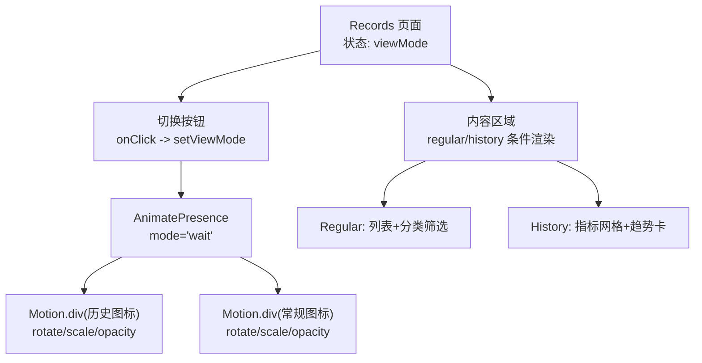
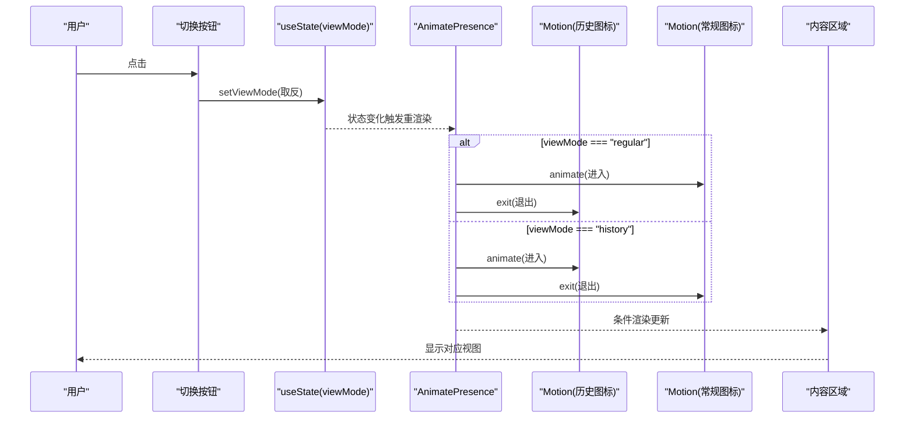
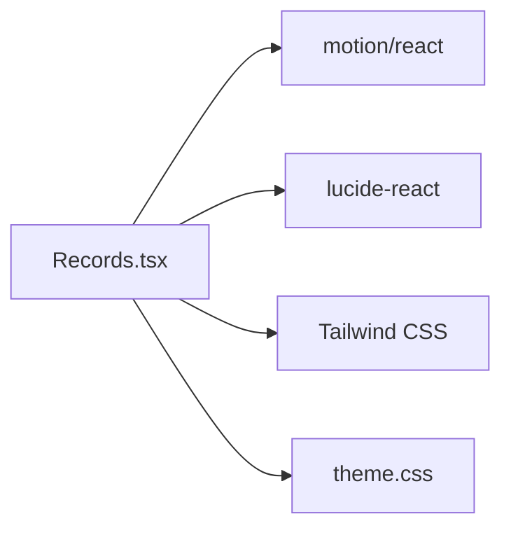

# 视图模式切换器

<cite>
**本文引用的文件**
- [Records.tsx](file://figma-ui/src/app/pages/Records.tsx)
- [theme.css](file://figma-ui/src/styles/theme.css)
- [button.tsx](file://figma-ui/src/app/components/ui/button.tsx)
- [toggle.tsx](file://figma-ui/src/app/components/ui/toggle.tsx)
</cite>

## 目录
1. [简介](#简介)
2. [项目结构](#项目结构)
3. [核心组件](#核心组件)
4. [架构总览](#架构总览)
5. [详细组件分析](#详细组件分析)
6. [依赖关系分析](#依赖关系分析)
7. [性能考量](#性能考量)
8. [故障排查指南](#故障排查指南)
9. [结论](#结论)
10. [附录：代码片段路径与最佳实践](#附录代码片段路径与最佳实践)

## 简介
本文件面向医案通医疗档案网站的“视图模式切换器”，聚焦 Records 页面中的状态管理、动画与交互细节。该切换器支持两种视图模式：
- regular（常规列表）：展示按分类筛选的医疗记录卡片，包含 AI 摘要与标签。
- history（指标追溯）：以网格形式聚合历史指标类别，并突出近期异常指标。

切换器通过一个紧凑的图标按钮实现，使用 AnimatePresence + Motion 完成图标旋转、缩放与淡入淡出过渡；按钮具备阴影、缩放反馈与焦点状态处理，并提供无障碍标签说明当前操作语义。

## 项目结构
- 视图模式切换逻辑集中在 Records 页面中，使用 React useState 管理 viewMode 状态。
- 动画由 motion/react（framer-motion）提供，包括 AnimatePresence 与 Motion 组件。
- 样式基于 Tailwind CSS 与主题变量，按钮阴影、圆角、缩放与颜色过渡均通过类名组合实现。
- 可访问性通过 aria-label 提供屏幕阅读器提示。

图表来源
- [Records.tsx:101-167](file://figma-ui/src/app/pages/Records.tsx#L101-L167)
- [Records.tsx:268-416](file://figma-ui/src/app/pages/Records.tsx#L268-L416)

章节来源
- [Records.tsx:101-167](file://figma-ui/src/app/pages/Records.tsx#L101-L167)
- [Records.tsx:268-416](file://figma-ui/src/app/pages/Records.tsx#L268-L416)

## 核心组件
- 视图模式状态：viewMode 为 "regular" | "history"，默认 "regular"。
- 切换按钮：点击时翻转 viewMode；按钮带阴影、悬停背景渐变、按下缩放与指示点。
- 图标动画：使用 AnimatePresence 包裹两个图标容器，分别定义 initial/animate/exit 的 rotate、scale、opacity 与 transition 时长。
- 内容区：根据 viewMode 渲染不同布局与数据。

章节来源
- [Records.tsx:101-167](file://figma-ui/src/app/pages/Records.tsx#L101-L167)
- [Records.tsx:268-416](file://figma-ui/src/app/pages/Records.tsx#L268-L416)

## 架构总览
视图模式切换器的数据流与交互流程如下：

图表来源
- [Records.tsx:133-167](file://figma-ui/src/app/pages/Records.tsx#L133-L167)
- [Records.tsx:268-416](file://figma-ui/src/app/pages/Records.tsx#L268-L416)

## 详细组件分析

### 状态管理机制（viewMode）
- 类型安全：使用联合类型 "regular" | "history" 约束状态值，避免非法切换。
- 切换逻辑：点击按钮时执行三元表达式取反，保证在两种模式间稳定切换。
- 副作用控制：切换仅影响 UI 渲染，无额外副作用，保持组件轻量。

章节来源
- [Records.tsx:101-103](file://figma-ui/src/app/pages/Records.tsx#L101-L103)
- [Records.tsx:133-136](file://figma-ui/src/app/pages/Records.tsx#L133-L136)

### 图标动画与过渡（AnimatePresence + Motion）
- 容器：使用 AnimatePresence mode="wait" 确保退出动画完成后才进入新元素，避免重叠闪烁。
- 入场/出场：
  - 历史图标：initial={opacity:0, rotate:-45, scale:0.8} → animate={opacity:1, rotate:0, scale:1} → exit={opacity:0, rotate:45, scale:0.8}
  - 常规图标：initial={opacity:0, rotate:45, scale:0.8} → animate={opacity:1, rotate:0, scale:1} → exit={opacity:0, rotate:-45, scale:0.8}
- 过渡时长：transition.duration=0.2s，提供快速而顺滑的切换体验。
- 图标选择：根据 viewMode 动态切换 History/FileText 图标，配合 drop-shadow 增强视觉层次。

章节来源
- [Records.tsx:141-163](file://figma-ui/src/app/pages/Records.tsx#L141-L163)

### 按钮样式设计（阴影、缩放、焦点）
- 外观：白色背景、细边框、大圆角、柔和蓝色投影，营造轻盈质感。
- 交互反馈：
  - 悬停：背景透明度提升，形成微妙光晕。
  - 按下：active:scale-95 提供即时触觉反馈。
  - 焦点：遵循系统焦点样式，结合主题 ring 变量，确保键盘可达性与可见性。
- 指示点：右上角小圆点带发光阴影，强化当前模式的视觉提示。

章节来源
- [Records.tsx:133-167](file://figma-ui/src/app/pages/Records.tsx#L133-L167)
- [theme.css:154-157](file://figma-ui/src/styles/theme.css#L154-L157)

### 内容区域与布局响应
- Regular 模式：
  - 顶部 AI 扫描卡片（仅在未搜索时显示），含进度条与扫描线动画。
  - 分类筛选横向滚动，选中态高亮并带阴影。
  - 列表项使用 Motion layout 实现平滑增删与排序动画。
- History 模式：
  - 指标类别网格，每个卡片带图标、数量、趋势箭头与最后更新时间。
  - 底部趋势卡突出近期异常指标，采用渐变背景与毛玻璃效果。

章节来源
- [Records.tsx:194-236](file://figma-ui/src/app/pages/Records.tsx#L194-L236)
- [Records.tsx:239-264](file://figma-ui/src/app/pages/Records.tsx#L239-L264)
- [Records.tsx:268-416](file://figma-ui/src/app/pages/Records.tsx#L268-L416)

### 无障碍访问支持
- 语义化按钮：使用原生 button 元素，确保键盘可操作与屏幕阅读器识别。
- 描述性标签：aria-label 根据当前模式动态切换，告知用户即将切换到的目标视图。
- 焦点可见性：遵循主题 ring 配置，确保焦点环清晰可见。

章节来源
- [Records.tsx:133-136](file://figma-ui/src/app/pages/Records.tsx#L133-L136)
- [theme.css:154-157](file://figma-ui/src/styles/theme.css#L154-L157)

### 与其他组件的关系
- 与通用 Button/Toggle 组件：本切换器未复用通用 Button/Toggle，而是自定义以实现更精细的动画与样式控制。
- 与主题系统：阴影、圆角、颜色等通过 Tailwind 类与 CSS 变量组合，保持一致的设计语言。

章节来源
- [button.tsx:7-23](file://figma-ui/src/app/components/ui/button.tsx#L7-L23)
- [toggle.tsx:9-29](file://figma-ui/src/app/components/ui/toggle.tsx#L9-L29)
- [theme.css:95-140](file://figma-ui/src/styles/theme.css#L95-L140)

## 依赖关系分析
- 运行时依赖：motion/react（AnimatePresence、Motion）用于动画；lucide-react 提供图标。
- 样式依赖：Tailwind CSS 类名与 theme.css 中的基础样式与变量。
- 组件耦合：切换器与 Records 页面强耦合，状态与渲染逻辑集中管理，便于维护。

图表来源
- [Records.tsx:1-21](file://figma-ui/src/app/pages/Records.tsx#L1-L21)
- [theme.css:95-140](file://figma-ui/src/styles/theme.css#L95-L140)

章节来源
- [Records.tsx:1-21](file://figma-ui/src/app/pages/Records.tsx#L1-L21)
- [theme.css:95-140](file://figma-ui/src/styles/theme.css#L95-L140)

## 性能考量
- 动画性能：
  - 使用 transform（rotate、scale）与 opacity 进行动画，避免触发重排，提升流畅度。
  - AnimatePresence mode="wait" 减少同时渲染多个元素带来的开销。
- 渲染优化：
  - 条件渲染避免无关内容参与计算，降低 DOM 节点数量。
  - 列表项使用 key 与 layout 动画，提高增删排序时的性能。
- 交互反馈：
  - active:scale-95 提供即时反馈，无需额外 JS 计算。
  - 悬停与焦点样式通过 CSS 过渡，减少重绘。

[本节为通用指导，不直接分析具体文件]

## 故障排查指南
- 动画不生效：
  - 检查是否正确引入 motion/react 的 AnimatePresence 与 Motion。
  - 确认 key 属性唯一且随模式变化，确保 AnimatePresence 能正确识别进出元素。
- 图标错位或闪烁：
  - 检查 initial/animate/exit 的 transform 与 opacity 是否一致。
  - 确认父容器尺寸固定，避免布局抖动。
- 焦点不可见：
  - 检查主题 ring 变量与 focus-visible 样式是否被覆盖。
  - 确保按钮未被 pointer-events-none 禁用焦点。
- 无障碍问题：
  - 验证 aria-label 是否正确反映当前模式。
  - 使用屏幕阅读器测试按钮可读性与操作反馈。

章节来源
- [Records.tsx:133-167](file://figma-ui/src/app/pages/Records.tsx#L133-L167)
- [theme.css:154-157](file://figma-ui/src/styles/theme.css#L154-L157)

## 结论
该视图模式切换器以简洁的图标按钮为核心，结合状态管理与动画库实现了流畅的模式切换体验。通过合理的阴影、缩放与焦点处理，兼顾了美观与可用性；AnimaPresence 与 Motion 的组合确保了图标切换的丝滑过渡。整体实现符合现代前端最佳实践，具备良好的可维护性与扩展性。

[本节为总结性内容，不直接分析具体文件]

## 附录：代码片段路径与最佳实践
- 状态管理与切换事件
  - 状态定义与切换逻辑：[Records.tsx:101-103](file://figma-ui/src/app/pages/Records.tsx#L101-L103)、[Records.tsx:133-136](file://figma-ui/src/app/pages/Records.tsx#L133-L136)
- 动画配置与过渡
  - AnimatePresence 与 Motion 动画参数：[Records.tsx:141-163](file://figma-ui/src/app/pages/Records.tsx#L141-L163)
- 按钮样式与交互
  - 阴影、缩放与焦点：[Records.tsx:133-167](file://figma-ui/src/app/pages/Records.tsx#L133-L167)、[theme.css:154-157](file://figma-ui/src/styles/theme.css#L154-L157)
- 内容区域渲染
  - Regular 模式列表与筛选：[Records.tsx:194-264](file://figma-ui/src/app/pages/Records.tsx#L194-L264)
  - History 模式网格与趋势卡：[Records.tsx:339-416](file://figma-ui/src/app/pages/Records.tsx#L339-L416)
- 可访问性
  - aria-label 与焦点样式：[Records.tsx:133-136](file://figma-ui/src/app/pages/Records.tsx#L133-L136)、[theme.css:154-157](file://figma-ui/src/styles/theme.css#L154-L157)

[本节为参考路径汇总，不直接分析具体文件]