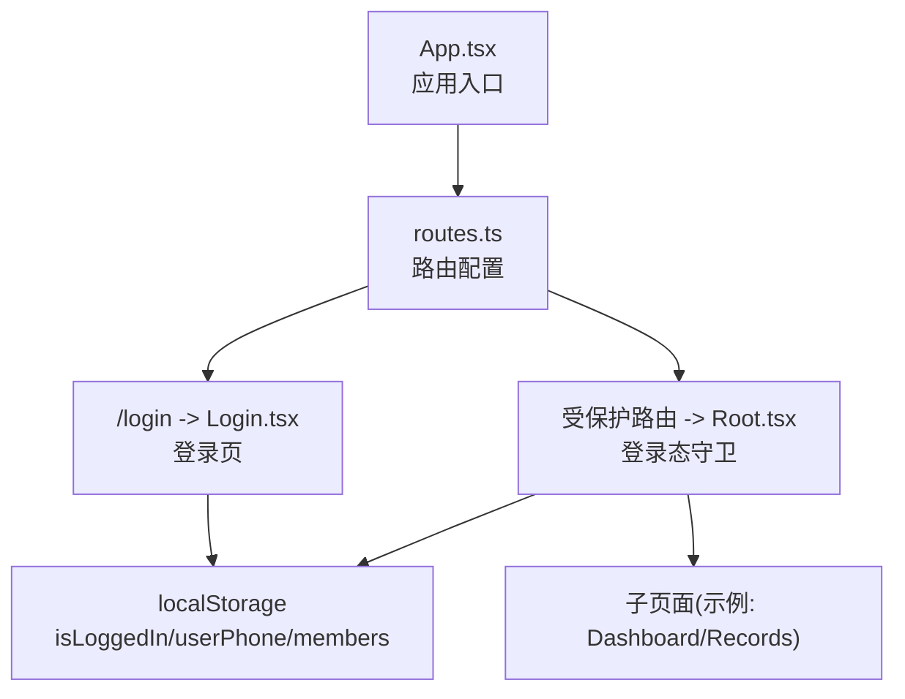
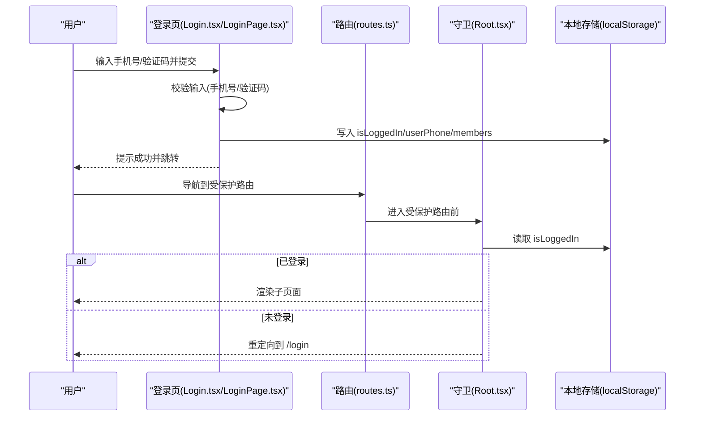
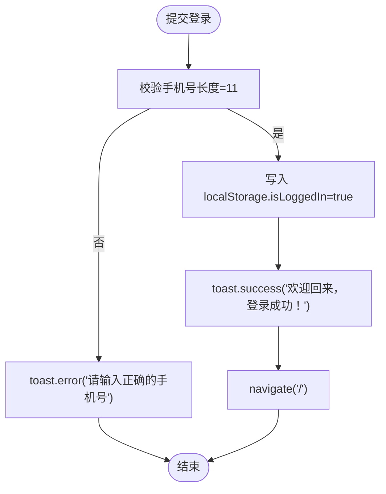
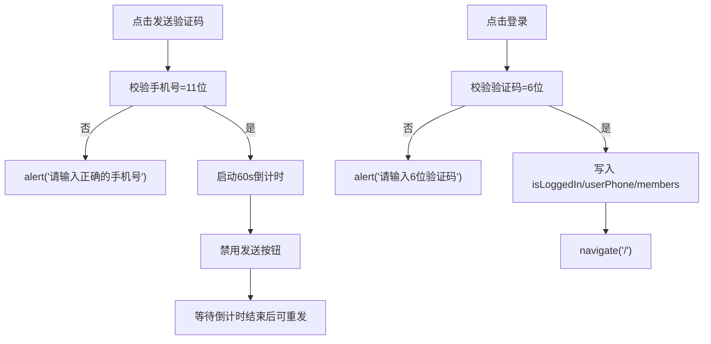
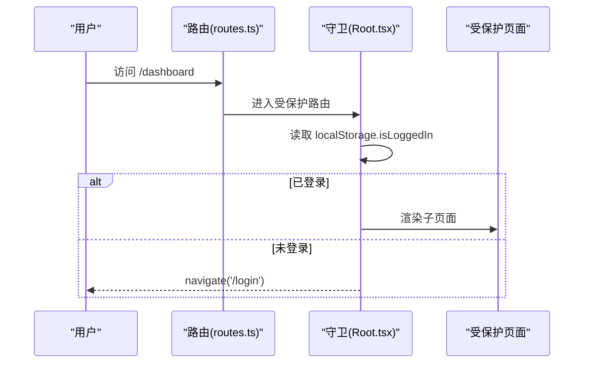
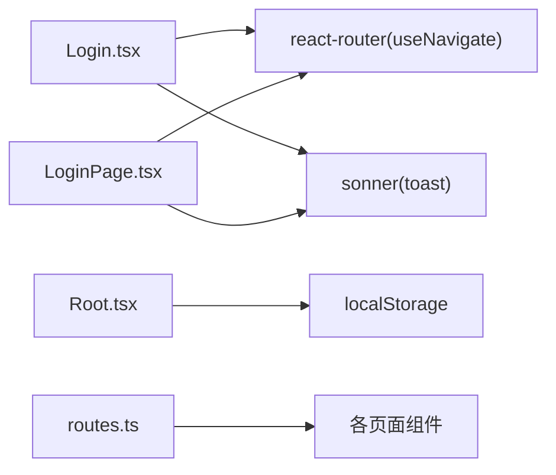

# 认证页面

<cite>
**本文引用的文件**
- [figma-ui/src/app/pages/Login.tsx](file://figma-ui/src/app/pages/Login.tsx)
- [figma-ui/src/app/pages/LoginPage.tsx](file://figma-ui/src/app/pages/LoginPage.tsx)
- [figma-ui/src/app/routes.ts](file://figma-ui/src/app/routes.ts)
- [figma-ui/src/app/Root.tsx](file://figma-ui/src/app/Root.tsx)
- [figma-ui/src/app/App.tsx](file://figma-ui/src/app/App.tsx)
- [figma-ui/src/app/components/Layout.tsx](file://figma-ui/src/app/components/Layout.tsx)
- [figma-ui/src/app/types.ts](file://figma-ui/src/app/types.ts)
- [figma-ui/src/app/components/ui/button.tsx](file://figma-ui/src/app/components/ui/button.tsx)
- [figma-ui/src/app/components/ui/form.tsx](file://figma-ui/src/app/components/ui/form.tsx)
</cite>

## 目录
1. [简介](#简介)
2. [项目结构](#项目结构)
3. [核心组件](#核心组件)
4. [架构总览](#架构总览)
5. [详细组件分析](#详细组件分析)
6. [依赖关系分析](#依赖关系分析)
7. [性能考量](#性能考量)
8. [故障排查指南](#故障排查指南)
9. [结论](#结论)
10. [附录](#附录)

## 简介
本章节面向医案通医疗档案网站的登录认证页面，系统性说明当前实现的用户认证流程、表单验证、错误提示、会话管理与权限控制。文档同时给出扩展建议，涵盖密码加密传输、防暴力破解、自动登录与忘记密码等安全与体验优化点，帮助读者在现有代码基础上进行安全加固与功能完善。

## 项目结构
- 路由层：通过 React Router 的 HashRouter 管理页面路由，登录页位于 /login。
- 页面层：提供两套登录 UI（Login.tsx 与 LoginPage.tsx），均基于手机号+验证码完成“模拟登录”。
- 根布局与守卫：Root.tsx 作为受保护路由的根，检查本地登录态并引导未登录用户至登录页。
- 应用入口：App.tsx 注入 RouterProvider，挂载全局路由。
- 通用 UI：Button、Form 等基础组件用于统一交互与可访问性。

图表来源
- [figma-ui/src/app/App.tsx:1-12](file://figma-ui/src/app/App.tsx#L1-L12)
- [figma-ui/src/app/routes.ts:25-106](file://figma-ui/src/app/routes.ts#L25-L106)
- [figma-ui/src/app/Root.tsx:10-16](file://figma-ui/src/app/Root.tsx#L10-L16)

章节来源
- [figma-ui/src/app/App.tsx:1-12](file://figma-ui/src/app/App.tsx#L1-L12)
- [figma-ui/src/app/routes.ts:25-106](file://figma-ui/src/app/routes.ts#L25-L106)

## 核心组件
- 登录页组件
  - Login.tsx：简洁版登录表单，使用 toast 提示，提交后写入 isLoggedIn 并跳转首页。
  - LoginPage.tsx：增强版登录表单，包含倒计时重发、默认成员初始化等逻辑。
- 路由与守卫
  - routes.ts：定义 /login 路由及受保护路由组。
  - Root.tsx：在未登录时重定向到 /login，并在登录后加载成员数据。
- 通用 UI
  - Button、Form：提供一致的按钮样式与表单字段能力，便于后续接入表单库。

章节来源
- [figma-ui/src/app/pages/Login.tsx:12-34](file://figma-ui/src/app/pages/Login.tsx#L12-L34)
- [figma-ui/src/app/pages/LoginPage.tsx:5-58](file://figma-ui/src/app/pages/LoginPage.tsx#L5-L58)
- [figma-ui/src/app/routes.ts:25-106](file://figma-ui/src/app/routes.ts#L25-L106)
- [figma-ui/src/app/Root.tsx:10-16](file://figma-ui/src/app/Root.tsx#L10-L16)
- [figma-ui/src/app/components/ui/button.tsx:7-35](file://figma-ui/src/app/components/ui/button.tsx#L7-L35)
- [figma-ui/src/app/components/ui/form.tsx:48-168](file://figma-ui/src/app/components/ui/form.tsx#L48-L168)

## 架构总览
- 前端认证流程（当前为模拟）：
  - 用户在登录页输入手机号与验证码。
  - 前端校验输入格式（手机号长度、验证码位数）。
  - 成功后将 isLoggedIn、userPhone、members 等写入 localStorage。
  - 跳转到首页或受保护路由；若直接访问受保护路由且未登录，Root 会重定向到 /login。
- 状态存储：
  - 使用 localStorage 持久化登录态与会话信息。
- 权限控制：
  - 通过 Root 组件对受保护路由进行前置校验，未登录则强制跳转登录页。

图表来源
- [figma-ui/src/app/pages/Login.tsx:18-27](file://figma-ui/src/app/pages/Login.tsx#L18-L27)
- [figma-ui/src/app/pages/LoginPage.tsx:31-58](file://figma-ui/src/app/pages/LoginPage.tsx#L31-L58)
- [figma-ui/src/app/routes.ts:25-106](file://figma-ui/src/app/routes.ts#L25-L106)
- [figma-ui/src/app/Root.tsx:10-16](file://figma-ui/src/app/Root.tsx#L10-L16)

## 详细组件分析

### 登录页组件：Login.tsx
- 表单状态管理
  - phone、code、isSending 三个状态分别管理手机号、验证码与发送中状态。
- 表单验证机制
  - 提交时校验手机号长度为 11 位，否则以 toast.error 提示。
- 错误处理与用户体验
  - 使用 sonner 的 toast 展示错误与成功消息。
  - 发送验证码按钮具备禁用与 loading 反馈。
- 会话管理
  - 登录成功后将 isLoggedIn 写入 localStorage，并跳转首页。
- 可扩展点
  - 可接入后端 API 进行验证码发送与登录校验。
  - 可增加“记住我”与自动登录逻辑。

图表来源
- [figma-ui/src/app/pages/Login.tsx:18-27](file://figma-ui/src/app/pages/Login.tsx#L18-L27)

章节来源
- [figma-ui/src/app/pages/Login.tsx:12-34](file://figma-ui/src/app/pages/Login.tsx#L12-L34)

### 登录页组件：LoginPage.tsx
- 表单状态管理
  - phone、code、codeSent、countdown 四个状态管理输入、发送标记与倒计时。
- 验证码发送与防重复
  - 点击发送后设置 60 秒倒计时，期间禁用按钮，避免频繁请求。
- 表单验证机制
  - 手机号必须为 11 位数字；验证码必须为 6 位数字。
- 会话管理
  - 登录成功后写入 isLoggedIn、userPhone，并初始化 members 与 currentMemberId。
- 用户体验设计
  - 输入框限制仅数字输入，提升输入体验。
  - 按钮状态随倒计时变化，清晰反馈。

图表来源
- [figma-ui/src/app/pages/LoginPage.tsx:12-58](file://figma-ui/src/app/pages/LoginPage.tsx#L12-L58)

章节来源
- [figma-ui/src/app/pages/LoginPage.tsx:5-58](file://figma-ui/src/app/pages/LoginPage.tsx#L5-L58)

### 路由与守卫：routes.ts 与 Root.tsx
- 路由配置
  - /login 映射到 Login 组件。
  - 受保护路由组包含 dashboard、records、settings 等页面。
- 登录态守卫
  - Root.tsx 在进入受保护路由前检查 localStorage.isLoggedIn，未登录则重定向到 /login。
  - 登录后加载 members 与 currentMemberId，并通过 Outlet 上下文传递给子页面。

图表来源
- [figma-ui/src/app/routes.ts:25-106](file://figma-ui/src/app/routes.ts#L25-L106)
- [figma-ui/src/app/Root.tsx:10-16](file://figma-ui/src/app/Root.tsx#L10-L16)

章节来源
- [figma-ui/src/app/routes.ts:25-106](file://figma-ui/src/app/routes.ts#L25-L106)
- [figma-ui/src/app/Root.tsx:10-16](file://figma-ui/src/app/Root.tsx#L10-L16)

### 退出登录：Settings.tsx
- 退出逻辑
  - 移除 localStorage.isLoggedIn，并提示“已安全退出登录”，随后跳转 /login。
- 用户体验
  - 使用 toast.info 提供操作反馈。

章节来源
- [figma-ui/src/app/pages/Settings.tsx:44-48](file://figma-ui/src/app/pages/Settings.tsx#L44-L48)

### 表单与UI组件：button.tsx 与 form.tsx
- Button
  - 提供多种变体与尺寸，支持 disabled 状态与可访问性属性。
- Form
  - 提供 useFormField、FormItem、FormLabel、FormControl、FormMessage 等，便于构建结构化表单与错误提示。

章节来源
- [figma-ui/src/app/components/ui/button.tsx:7-35](file://figma-ui/src/app/components/ui/button.tsx#L7-L35)
- [figma-ui/src/app/components/ui/form.tsx:48-168](file://figma-ui/src/app/components/ui/form.tsx#L48-L168)

## 依赖关系分析
- 组件耦合
  - 登录页依赖 React Router 的 useNavigate 进行页面跳转。
  - 登录页依赖 sonner 的 toast 进行用户反馈。
  - Root 依赖 localStorage 进行登录态判断与成员数据加载。
- 外部依赖
  - lucide-react 图标库用于界面装饰。
  - motion/react 用于动画效果。
- 潜在循环依赖
  - 当前路由与组件之间无循环引用，结构清晰。

图表来源
- [figma-ui/src/app/pages/Login.tsx:8-10](file://figma-ui/src/app/pages/Login.tsx#L8-L10)
- [figma-ui/src/app/pages/LoginPage.tsx:1-3](file://figma-ui/src/app/pages/LoginPage.tsx#L1-L3)
- [figma-ui/src/app/Root.tsx:1-4](file://figma-ui/src/app/Root.tsx#L1-L4)
- [figma-ui/src/app/routes.ts:1-20](file://figma-ui/src/app/routes.ts#L1-L20)

章节来源
- [figma-ui/src/app/pages/Login.tsx:8-10](file://figma-ui/src/app/pages/Login.tsx#L8-L10)
- [figma-ui/src/app/pages/LoginPage.tsx:1-3](file://figma-ui/src/app/pages/LoginPage.tsx#L1-L3)
- [figma-ui/src/app/Root.tsx:1-4](file://figma-ui/src/app/Root.tsx#L1-L4)
- [figma-ui/src/app/routes.ts:1-20](file://figma-ui/src/app/routes.ts#L1-L20)

## 性能考量
- 表单输入限制
  - 使用 maxLength 与正则替换限制输入类型与长度，减少无效计算。
- 倒计时与定时器
  - 验证码倒计时使用 setInterval，注意在组件卸载时清理，避免内存泄漏。
- 本地存储读写
  - 登录成功后批量写入必要字段，减少多次 I/O。
- 路由守卫
  - 在 Root 中尽早检查登录态，避免不必要的子页面渲染。

[本节为通用指导，不直接分析具体文件]

## 故障排查指南
- 常见问题
  - 手机号格式不正确：检查输入是否为 11 位数字。
  - 验证码位数不足：确保为 6 位数字。
  - 无法进入受保护路由：确认 localStorage.isLoggedIn 是否存在。
- 调试建议
  - 打开浏览器开发者工具，查看控制台错误与网络请求（如未来接入 API）。
  - 检查 localStorage 中的 isLoggedIn、userPhone、members 是否按预期写入。
  - 若出现路由跳转异常，检查 routes.ts 的路由配置是否正确。

章节来源
- [figma-ui/src/app/pages/Login.tsx:18-27](file://figma-ui/src/app/pages/Login.tsx#L18-L27)
- [figma-ui/src/app/pages/LoginPage.tsx:12-58](file://figma-ui/src/app/pages/LoginPage.tsx#L12-L58)
- [figma-ui/src/app/Root.tsx:10-16](file://figma-ui/src/app/Root.tsx#L10-L16)

## 结论
当前登录认证采用前端模拟方式，通过手机号+验证码完成登录，并使用 localStorage 维护会话与成员数据。Root 组件作为受保护路由的守卫，确保未登录用户被重定向到登录页。整体结构清晰、易于扩展。建议在后续版本中引入后端 API 进行真实认证、增加密码加密传输、防暴力破解、自动登录与忘记密码等功能，以提升安全性与用户体验。

[本节为总结性内容，不直接分析具体文件]

## 附录

### 安全与体验增强建议
- 密码加密传输
  - 接入 HTTPS 与后端 API，使用一次性验证码或令牌机制，避免明文传输敏感信息。
- 防暴力破解
  - 服务端侧增加验证码重试次数限制与 IP 限流；前端侧保持倒计时与按钮禁用。
- 自动登录
  - 在首次登录后记录 refresh token 或设备标识，下次访问时静默刷新会话。
- 忘记密码
  - 通过短信验证码重置密码，结合邮箱二次验证，确保账户安全。
- 表单验证与错误提示
  - 使用 form.tsx 提供的表单组件统一错误提示与可访问性。
- 路由守卫与权限控制
  - 在 Root 中根据角色或权限动态渲染菜单与页面，未授权时显示 403 或引导升级。

[本节为概念性建议，不直接分析具体文件]