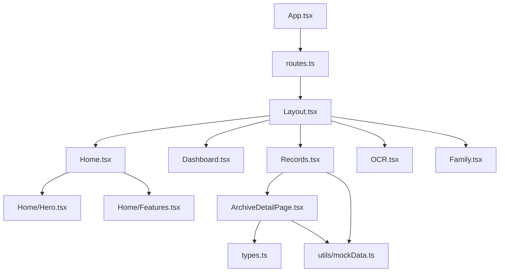
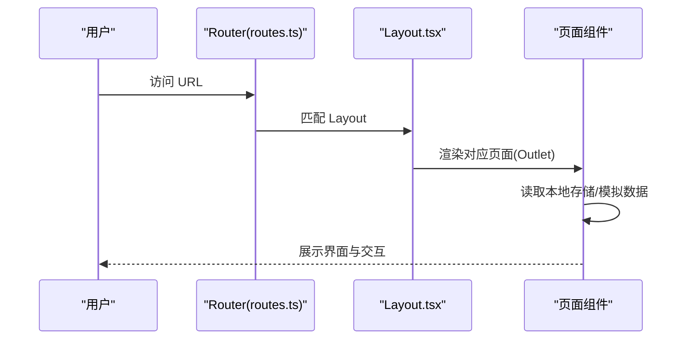
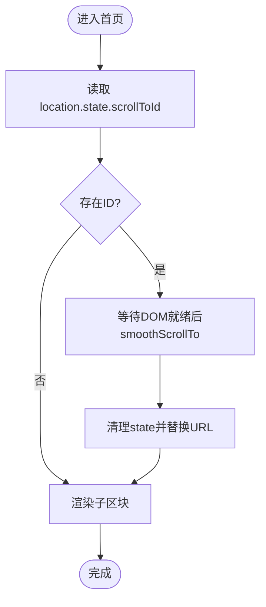
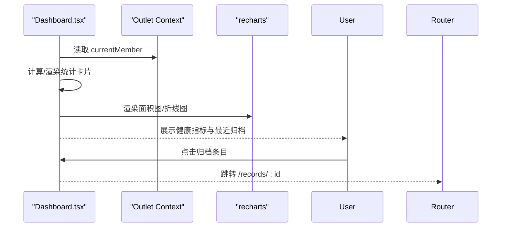
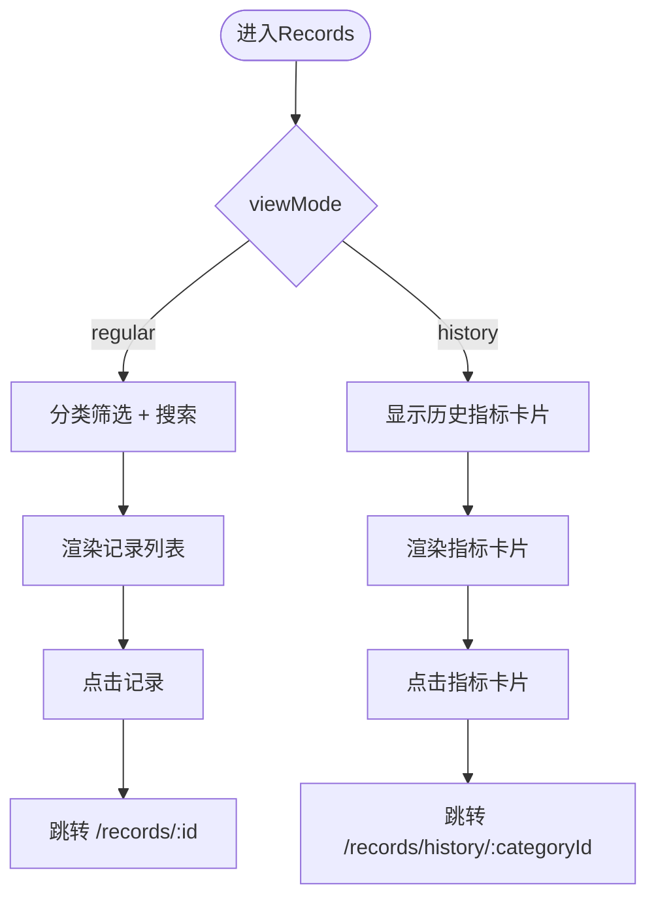
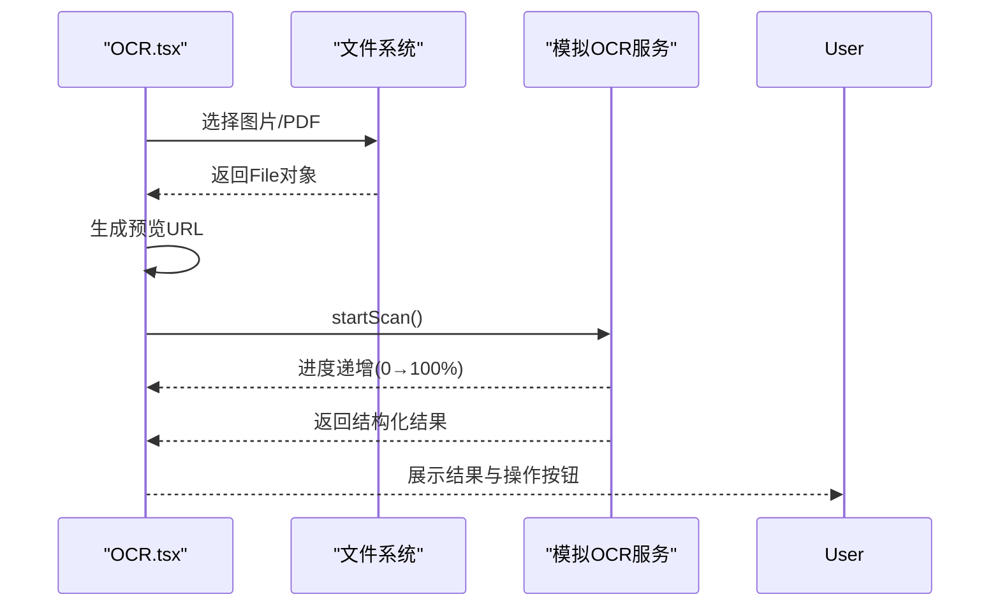
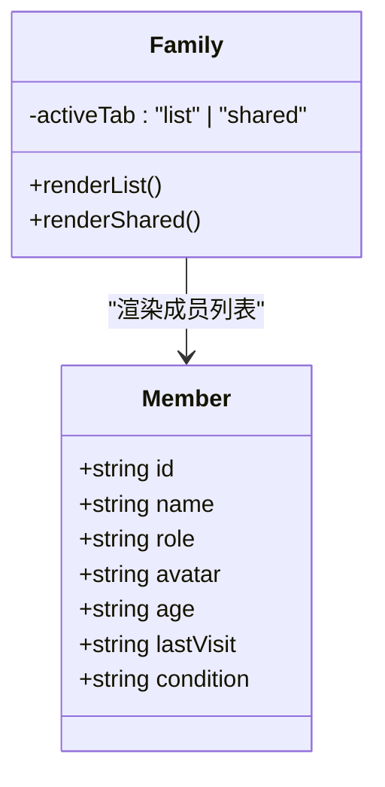
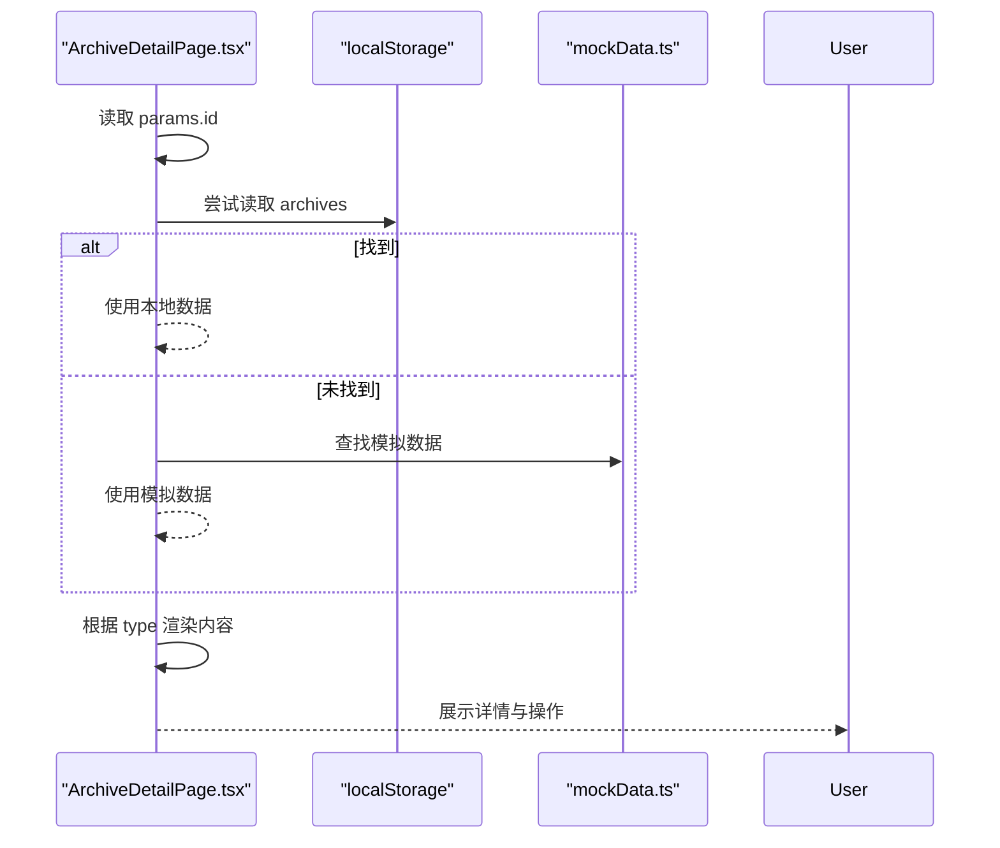
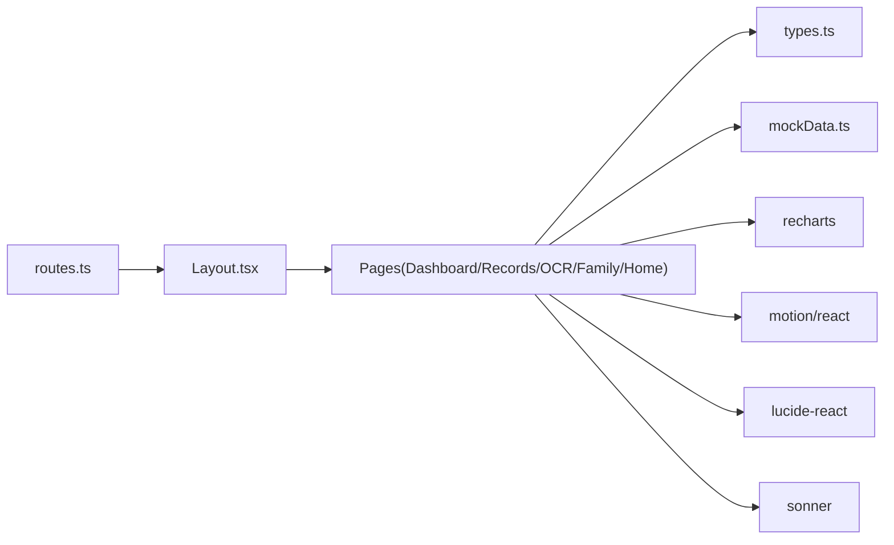

# 页面组件

<cite>
**本文引用的文件**
- [App.tsx](file://figma-ui/src/app/App.tsx)
- [routes.ts](file://figma-ui/src/app/routes.ts)
- [Layout.tsx](file://figma-ui/src/app/components/Layout.tsx)
- [Home.tsx](file://figma-ui/src/app/pages/Home.tsx)
- [Hero.tsx](file://figma-ui/src/app/pages/Home/Hero.tsx)
- [Features.tsx](file://figma-ui/src/app/pages/Home/Features.tsx)
- [Dashboard.tsx](file://figma-ui/src/app/pages/Dashboard.tsx)
- [Records.tsx](file://figma-ui/src/app/pages/Records.tsx)
- [OCR.tsx](file://figma-ui/src/app/pages/OCR.tsx)
- [Family.tsx](file://figma-ui/src/app/pages/Family.tsx)
- [ArchiveDetailPage.tsx](file://figma-ui/src/app/pages/ArchiveDetailPage.tsx)
- [types.ts](file://figma-ui/src/app/types.ts)
- [mockData.ts](file://figma-ui/src/app/utils/mockData.ts)
</cite>

## 目录
1. [简介](#简介)
2. [项目结构](#项目结构)
3. [核心组件](#核心组件)
4. [架构总览](#架构总览)
5. [详细组件分析](#详细组件分析)
6. [依赖关系分析](#依赖关系分析)
7. [性能考虑](#性能考虑)
8. [故障排查指南](#故障排查指南)
9. [结论](#结论)

## 简介
本文件面向医案通医疗档案网站的前端页面组件，聚焦以下核心业务页面的设计与实现：仪表盘（Dashboard）、首页（Home）、档案管理（Records）、OCR识别（OCR）、家庭管理（Family）。文档从数据获取策略、状态管理模式、路由参数处理、用户交互流程、组合结构与子组件调用、数据绑定与事件处理等维度进行系统化说明，并结合代码级图示展示关键流程。同时提供性能优化建议与常见问题排查方法，帮助读者快速理解并扩展这些页面。

## 项目结构
本项目采用 React + React Router 的 SPA 架构，页面按功能模块组织在 pages 目录下，公共 UI 组件位于 components/ui，类型定义与模拟数据分别位于 types.ts 与 utils/mockData.ts。根入口 App 通过 RouterProvider 挂载路由配置，Layout 作为外层布局容器承载导航与页脚，各业务页面以路由方式加载。

图表来源
- [App.tsx:1-12](file://figma-ui/src/app/App.tsx#L1-L12)
- [routes.ts:25-106](file://figma-ui/src/app/routes.ts#L25-L106)
- [Layout.tsx:10-144](file://figma-ui/src/app/components/Layout.tsx#L10-L144)
- [Home.tsx:13-43](file://figma-ui/src/app/pages/Home.tsx#L13-L43)
- [Dashboard.tsx:30-204](file://figma-ui/src/app/pages/Dashboard.tsx#L30-L204)
- [Records.tsx:101-421](file://figma-ui/src/app/pages/Records.tsx#L101-L421)
- [OCR.tsx:24-270](file://figma-ui/src/app/pages/OCR.tsx#L24-L270)
- [Family.tsx:57-224](file://figma-ui/src/app/pages/Family.tsx#L57-L224)
- [ArchiveDetailPage.tsx:27-356](file://figma-ui/src/app/pages/ArchiveDetailPage.tsx#L27-L356)
- [types.ts:11-95](file://figma-ui/src/app/types.ts#L11-L95)
- [mockData.ts:3-98](file://figma-ui/src/app/utils/mockData.ts#L3-L98)

章节来源
- [App.tsx:1-12](file://figma-ui/src/app/App.tsx#L1-L12)
- [routes.ts:25-106](file://figma-ui/src/app/routes.ts#L25-L106)
- [Layout.tsx:10-144](file://figma-ui/src/app/components/Layout.tsx#L10-L144)

## 核心组件
- 路由与布局：App 通过 RouterProvider 注入路由；Layout 提供顶部导航、移动端菜单、滚动监听与底部信息区，并通过 Outlet 渲染子页面。
- 首页 Home：由多个子区块组成（Hero、Why、Solution、Features、Scenarios、Principles、Privacy、TargetAudience、CTA），支持根据 location.state 平滑滚动到指定锚点。
- 仪表盘 Dashboard：展示健康指标趋势图、最近归档列表、快捷卡片，使用 useOutletContext 获取当前成员信息。
- 档案管理 Records：支持常规视图与“指标追溯”视图切换、分类筛选、关键词搜索、AI 扫描进度动画与历史指标卡片。
- OCR 识别：文件选择与预览、扫描进度条、结果结构化展示（检验项、诊断、用药等）与操作按钮（存入草稿/确认归档）。
- 家庭管理 Family：成员列表与共享权限两个 Tab，支持添加成员、生成共享码、查看共享用户与权限控制。

章节来源
- [routes.ts:25-106](file://figma-ui/src/app/routes.ts#L25-L106)
- [Layout.tsx:10-144](file://figma-ui/src/app/components/Layout.tsx#L10-L144)
- [Home.tsx:13-43](file://figma-ui/src/app/pages/Home.tsx#L13-L43)
- [Dashboard.tsx:30-204](file://figma-ui/src/app/pages/Dashboard.tsx#L30-L204)
- [Records.tsx:101-421](file://figma-ui/src/app/pages/Records.tsx#L101-L421)
- [OCR.tsx:24-270](file://figma-ui/src/app/pages/OCR.tsx#L24-L270)
- [Family.tsx:57-224](file://figma-ui/src/app/pages/Family.tsx#L57-L224)

## 架构总览
整体采用“路由驱动 + 组件组合”的模式：
- 路由层：routes.ts 集中声明所有页面路由，包含嵌套路由与动态参数（如 /records/:id、/records/history/:categoryId）。
- 布局层：Layout 统一承载导航与页脚，内部通过 Outlet 渲染具体页面。
- 页面层：每个业务页面负责自身状态与交互，必要时通过 useOutletContext 或 props 获取上下文数据。
- 数据层：本地 localStorage 与 mockData.ts 提供演示数据；类型定义集中在 types.ts，确保数据结构一致。

图表来源
- [routes.ts:25-106](file://figma-ui/src/app/routes.ts#L25-L106)
- [Layout.tsx:10-144](file://figma-ui/src/app/components/Layout.tsx#L10-L144)

## 详细组件分析

### 首页 Home
- 组合结构：由 Hero、Why、Solution、Features、Scenarios、Principles、Privacy、TargetAudience、CTA 等子区块组成，按顺序渲染。
- 路由参数处理：通过 useLocation 读取 state.scrollToId，并在 useEffect 中延迟执行 smooth scroll 到目标区域，随后清理 state 避免重复滚动。
- 数据与交互：子区块多为静态内容展示，部分按钮触发全局通知（LaunchNoticeProvider）。
- 性能要点：首屏按需渲染区块；滚动定位使用 setTimeout 保证 DOM 就绪；可考虑将非首屏区块懒加载。

图表来源
- [Home.tsx:13-43](file://figma-ui/src/app/pages/Home.tsx#L13-L43)

章节来源
- [Home.tsx:13-43](file://figma-ui/src/app/pages/Home.tsx#L13-L43)
- [Hero.tsx:7-107](file://figma-ui/src/app/pages/Home/Hero.tsx#L7-L107)
- [Features.tsx:5-84](file://figma-ui/src/app/pages/Home/Features.tsx#L5-L84)

### 仪表盘 Dashboard
- 数据获取策略：使用 useOutletContext 获取 currentMember，用于欢迎语与健康分展示；统计与趋势数据为本地 MOCK_STATS。
- 图表展示：基于 recharts 的 AreaChart/LineChart，响应式容器 ResponsiveContainer 适配不同屏幕尺寸。
- 交互流程：点击最近归档链接跳转到 /records/:id；健康指标趋势支持时间范围选择（下拉框）。
- 状态管理：页面内局部状态较少，主要依赖上下文与本地常量数据。

图表来源
- [Dashboard.tsx:30-204](file://figma-ui/src/app/pages/Dashboard.tsx#L30-L204)

章节来源
- [Dashboard.tsx:30-204](file://figma-ui/src/app/pages/Dashboard.tsx#L30-L204)

### 档案管理 Records
- 视图模式：常规视图（记录列表）与指标追溯视图（历史指标卡片）通过 viewMode 切换，配合 AnimatePresence 实现过渡动画。
- 筛选与搜索：activeCategory 控制分类过滤；searchQuery 对标题、医院、摘要、标签进行模糊匹配。
- AI 扫描提示：isScanning 控制扫描进度条与扫描线动画，模拟上传后的 OCR 处理过程。
- 数据绑定：MOCK_RECORDS 作为演示数据源，渲染时动态选择图标与样式；历史记录类别 HISTORY_CATEGORIES 提供趋势指示。
- 路由跳转：点击记录跳转到 /records/:id；点击历史指标卡片跳转到 /records/history/:categoryId。

图表来源
- [Records.tsx:101-421](file://figma-ui/src/app/pages/Records.tsx#L101-L421)

章节来源
- [Records.tsx:101-421](file://figma-ui/src/app/pages/Records.tsx#L101-L421)

### OCR 识别
- 文件上传：隐藏 input[type=file]，通过 ref 触发点击；handleFileChange 设置 file 与 preview，并重置扫描状态。
- 扫描流程：startScan 启动进度定时器，模拟 3 秒识别过程；完成后设置 scanResult 并弹出成功提示。
- 结果展示：结构化展示检验项、医生签名、诊断与建议；正常/异常用图标区分；支持“存入草稿”和“确认归档”。
- 用户体验：预览区叠加扫描线动画；进度条实时更新；错误边界可通过 toast 提示。

图表来源
- [OCR.tsx:24-270](file://figma-ui/src/app/pages/OCR.tsx#L24-L270)

章节来源
- [OCR.tsx:24-270](file://figma-ui/src/app/pages/OCR.tsx#L24-L270)

### 家庭管理 Family
- 成员列表：MOCK_MEMBERS 提供演示数据；currentMember 来自 Outlet Context，高亮当前成员；支持编辑与详情跳转。
- 共享权限：Tab 切换至共享视图，展示共享二维码与密码、当前共享用户列表及权限状态。
- 交互流程：添加新成员按钮预留扩展；共享码支持复制；用户列表支持更多操作（删除/修改权限）。
- 状态管理：activeTab 控制视图切换；useOutletContext 获取当前成员信息。

图表来源
- [Family.tsx:17-224](file://figma-ui/src/app/pages/Family.tsx#L17-L224)

章节来源
- [Family.tsx:57-224](file://figma-ui/src/app/pages/Family.tsx#L57-L224)

### 档案详情页 ArchiveDetailPage
- 路由参数处理：通过 useParams 获取 id，查找本地存储或 mockData 中的档案数据。
- 动态渲染：根据 archive.type 渲染不同内容（检验报告、处方、门诊病历、影像报告/体检报告）。
- 数据绑定：ocrData 字段包含检验项、处方、诊断等信息；ARCHIVE_TYPE_LABELS 用于显示类型标签。
- 交互流程：返回上一页、分享、下载、询问AI助手等；异常指标高亮并给出提醒。

图表来源
- [ArchiveDetailPage.tsx:27-356](file://figma-ui/src/app/pages/ArchiveDetailPage.tsx#L27-L356)
- [types.ts:11-95](file://figma-ui/src/app/types.ts#L11-L95)
- [mockData.ts:3-98](file://figma-ui/src/app/utils/mockData.ts#L3-L98)

章节来源
- [ArchiveDetailPage.tsx:27-356](file://figma-ui/src/app/pages/ArchiveDetailPage.tsx#L27-L356)
- [types.ts:11-95](file://figma-ui/src/app/types.ts#L11-L95)
- [mockData.ts:3-98](file://figma-ui/src/app/utils/mockData.ts#L3-L98)

## 依赖关系分析
- 路由依赖：routes.ts 集中管理页面路由与嵌套关系，Layout 作为父级容器。
- 组件依赖：Home 依赖多个子区块；Dashboard、Records、OCR、Family 各自独立但均可能依赖通用 UI 组件与图标库。
- 数据依赖：ArchiveDetailPage 依赖 types.ts 与 mockData.ts；Dashboard 与 Records 使用本地常量数据；Family 通过 Outlet Context 获取成员信息。
- 外部库：recharts 用于图表；motion/react 用于动画；lucide-react 用于图标；sonner 用于提示。

图表来源
- [routes.ts:25-106](file://figma-ui/src/app/routes.ts#L25-L106)
- [Layout.tsx:10-144](file://figma-ui/src/app/components/Layout.tsx#L10-L144)
- [Dashboard.tsx:30-204](file://figma-ui/src/app/pages/Dashboard.tsx#L30-L204)
- [Records.tsx:101-421](file://figma-ui/src/app/pages/Records.tsx#L101-L421)
- [OCR.tsx:24-270](file://figma-ui/src/app/pages/OCR.tsx#L24-L270)
- [Family.tsx:57-224](file://figma-ui/src/app/pages/Family.tsx#L57-L224)
- [ArchiveDetailPage.tsx:27-356](file://figma-ui/src/app/pages/ArchiveDetailPage.tsx#L27-L356)
- [types.ts:11-95](file://figma-ui/src/app/types.ts#L11-L95)
- [mockData.ts:3-98](file://figma-ui/src/app/utils/mockData.ts#L3-L98)

章节来源
- [routes.ts:25-106](file://figma-ui/src/app/routes.ts#L25-L106)
- [Layout.tsx:10-144](file://figma-ui/src/app/components/Layout.tsx#L10-L144)

## 性能考虑
- 首屏优化：首页子区块可按需懒加载（React.lazy + Suspense），减少初始包体积。
- 图表性能：recharts 的 ResponsiveContainer 已做自适应，大数据量时可考虑分页或采样。
- 动画性能：motion/react 动画尽量轻量，避免复杂层级；大量列表项可使用虚拟滚动。
- 资源加载：图片使用懒加载与占位骨架屏；PDF/大图上传前压缩与预览优化。
- 状态管理：页面内局部状态足够时使用 useState；跨页面共享状态可考虑 Context 或轻量状态库。
- 错误边界：为关键页面包裹 ErrorBoundary，捕获渲染错误并提供降级展示与重试机制。

[本节为通用指导，不直接分析具体文件]

## 故障排查指南
- 首页滚动失效：检查 location.state.scrollToId 是否存在且目标元素 ID 正确；确保 useEffect 中延迟执行以避免 DOM 未就绪。
- 仪表盘数据为空：确认 Outlet Context 是否传入 currentMember；检查 mock 数据是否正确初始化。
- 档案详情未找到：检查路由参数 id 是否与本地存储或 mockData 中的 id 匹配；若不存在则回退到模拟数据。
- OCR 识别失败：检查文件类型与大小限制；确认预览 URL 生成成功；进度定时器是否正确清理。
- 家族成员高亮异常：确认 currentMember.id 与成员 id 比较逻辑；检查 Avatar 与条件渲染。

章节来源
- [Home.tsx:13-43](file://figma-ui/src/app/pages/Home.tsx#L13-L43)
- [Dashboard.tsx:30-204](file://figma-ui/src/app/pages/Dashboard.tsx#L30-L204)
- [ArchiveDetailPage.tsx:27-52](file://figma-ui/src/app/pages/ArchiveDetailPage.tsx#L27-L52)
- [OCR.tsx:32-83](file://figma-ui/src/app/pages/OCR.tsx#L32-L83)
- [Family.tsx:57-162](file://figma-ui/src/app/pages/Family.tsx#L57-L162)

## 结论
医案通网站通过清晰的路由与布局分层、模块化页面组件与本地数据模拟，实现了仪表盘、首页、档案管理、OCR识别与家庭管理等核心功能。页面组件在数据获取、状态管理、路由参数处理与用户交互方面具备良好实践，结合动画与图表提升了用户体验。后续可扩展真实后端接口、引入更完善的状态管理与错误边界，进一步提升性能与稳定性。