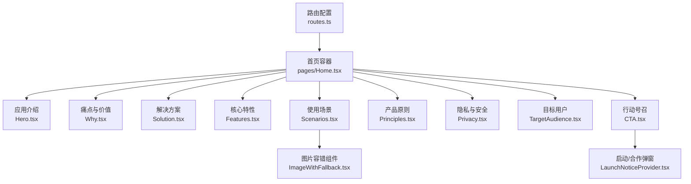
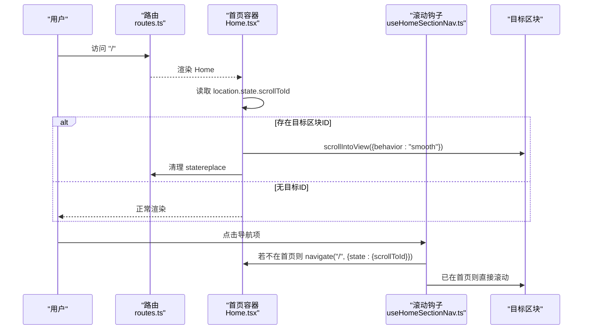
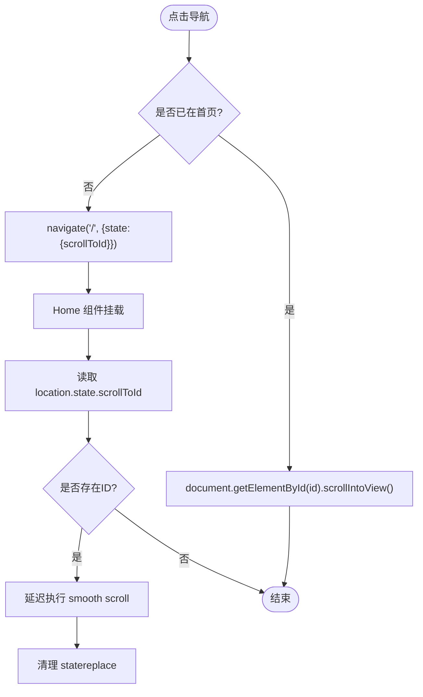
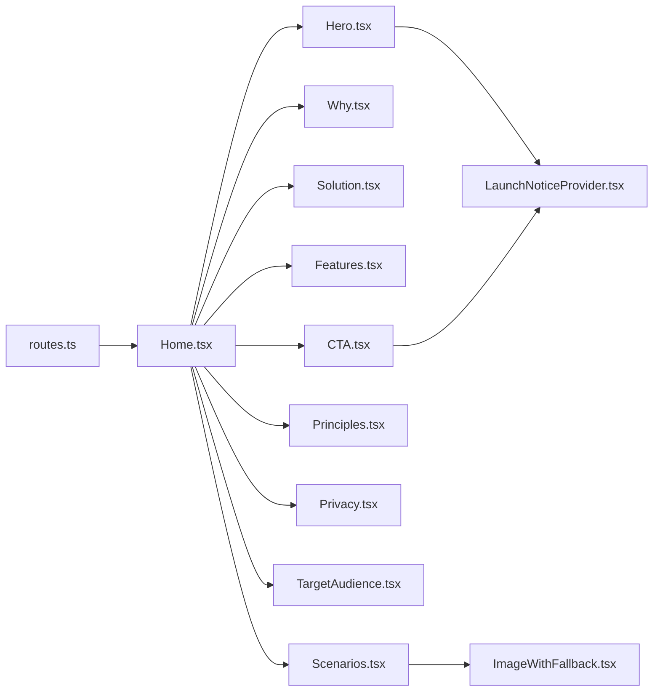

# 首页页面

<cite>
**本文引用的文件**
- [Home.tsx](file://figma-ui/src/app/pages/Home.tsx)
- [useHomeSectionNav.ts](file://figma-ui/src/app/hooks/useHomeSectionNav.ts)
- [routes.ts](file://figma-ui/src/app/routes.ts)
- [Hero.tsx](file://figma-ui/src/app/pages/Home/Hero.tsx)
- [Why.tsx](file://figma-ui/src/app/pages/Home/Why.tsx)
- [Solution.tsx](file://figma-ui/src/app/pages/Home/Solution.tsx)
- [Features.tsx](file://figma-ui/src/app/pages/Home/Features.tsx)
- [Scenarios.tsx](file://figma-ui/src/app/pages/Home/Scenarios.tsx)
- [Principles.tsx](file://figma-ui/src/app/pages/Home/Principles.tsx)
- [Privacy.tsx](file://figma-ui/src/app/pages/Home/Privacy.tsx)
- [TargetAudience.tsx](file://figma-ui/src/app/pages/Home/TargetAudience.tsx)
- [CTA.tsx](file://figma-ui/src/app/pages/Home/CTA.tsx)
- [LaunchNoticeProvider.tsx](file://figma-ui/src/app/components/LaunchNoticeProvider.tsx)
- [ImageWithFallback.tsx](file://figma-ui/src/app/components/figma/ImageWithFallback.tsx)
</cite>

## 目录
1. [简介](#简介)
2. [项目结构](#项目结构)
3. [核心组件](#核心组件)
4. [架构总览](#架构总览)
5. [详细组件分析](#详细组件分析)
6. [依赖关系分析](#依赖关系分析)
7. [性能与优化](#性能与优化)
8. [故障排查指南](#故障排查指南)
9. [结论](#结论)
10. [附录：代码片段路径参考](#附录代码片段路径参考)

## 简介
本文件为医案通医疗档案网站的“首页”页面技术文档，聚焦于首页的整体架构、功能模块、滚动导航、动画与响应式实现、数据驱动渲染、用户引导流程以及视觉层次设计。文档同时给出关键组件的复用方式、路由链接配置、图片容错与懒加载策略，并说明与全局状态和性能优化的结合点。

## 项目结构
首页由一个聚合页面容器与多个独立的功能区块组件构成，采用“按功能分块 + 组合式渲染”的组织方式。路由将根路径映射到首页组件；各区块通过 id 锚点进行滚动定位；交互弹窗通过上下文提供统一入口。

图表来源
- [routes.ts:22-34](file://figma-ui/src/app/routes.ts#L22-L34)
- [Home.tsx:13-42](file://figma-ui/src/app/pages/Home.tsx#L13-L42)
- [Hero.tsx:7-106](file://figma-ui/src/app/pages/Home/Hero.tsx#L7-L106)
- [Why.tsx:5-92](file://figma-ui/src/app/pages/Home/Why.tsx#L5-L92)
- [Solution.tsx:5-106](file://figma-ui/src/app/pages/Home/Solution.tsx#L5-L106)
- [Features.tsx:5-84](file://figma-ui/src/app/pages/Home/Features.tsx#L5-L84)
- [Scenarios.tsx:14-129](file://figma-ui/src/app/pages/Home/Scenarios.tsx#L14-L129)
- [Principles.tsx:5-78](file://figma-ui/src/app/pages/Home/Principles.tsx#L5-L78)
- [Privacy.tsx:5-77](file://figma-ui/src/app/pages/Home/Privacy.tsx#L5-L77)
- [TargetAudience.tsx:5-59](file://figma-ui/src/app/pages/Home/TargetAudience.tsx#L5-L59)
- [CTA.tsx:7-58](file://figma-ui/src/app/pages/Home/CTA.tsx#L7-L58)
- [LaunchNoticeProvider.tsx:52-118](file://figma-ui/src/app/components/LaunchNoticeProvider.tsx#L52-L118)
- [ImageWithFallback.tsx:6-27](file://figma-ui/src/app/components/figma/ImageWithFallback.tsx#L6-L27)

章节来源
- [routes.ts:22-34](file://figma-ui/src/app/routes.ts#L22-L34)
- [Home.tsx:13-42](file://figma-ui/src/app/pages/Home.tsx#L13-L42)

## 核心组件
- 首页容器（Home）：负责组装所有区块、处理从其他页面跳转回首页时的平滑滚动定位。
- 应用介绍（Hero）：首屏品牌信息、核心价值主张、双按钮引导（体验/合作），配合入场动画与设备样机展示。
- 痛点与价值（Why）：以网格卡片呈现典型就医痛点，并以高亮卡片强调平台价值。
- 解决方案（Solution）：三步法（归集/保存/调用）+ 模拟“健康档案库”界面，强化心智模型。
- 核心特性（Features）：六大能力卡片，数据驱动渲染，滚动入场动效。
- 使用场景（Scenarios）：多场景卡片，支持图片与占位图两种展示，使用图片容错组件。
- 产品原则（Principles）：四条原则，图标+文案，强调克制与专注。
- 隐私与安全（Privacy）：深色背景信任区，列出安全与合规要点。
- 目标用户（TargetAudience）：面向不同人群的价值匹配清单。
- 行动号召（CTA）：收尾转化区，双按钮（体验/合作），统一弹窗交互。

章节来源
- [Home.tsx:13-42](file://figma-ui/src/app/pages/Home.tsx#L13-L42)
- [Hero.tsx:7-106](file://figma-ui/src/app/pages/Home/Hero.tsx#L7-L106)
- [Why.tsx:5-92](file://figma-ui/src/app/pages/Home/Why.tsx#L5-L92)
- [Solution.tsx:5-106](file://figma-ui/src/app/pages/Home/Solution.tsx#L5-L106)
- [Features.tsx:5-84](file://figma-ui/src/app/pages/Home/Features.tsx#L5-L84)
- [Scenarios.tsx:14-129](file://figma-ui/src/app/pages/Home/Scenarios.tsx#L14-L129)
- [Principles.tsx:5-78](file://figma-ui/src/app/pages/Home/Principles.tsx#L5-L78)
- [Privacy.tsx:5-77](file://figma-ui/src/app/pages/Home/Privacy.tsx#L5-L77)
- [TargetAudience.tsx:5-59](file://figma-ui/src/app/pages/Home/TargetAudience.tsx#L5-L59)
- [CTA.tsx:7-58](file://figma-ui/src/app/pages/Home/CTA.tsx#L7-L58)

## 架构总览
首页采用“容器 + 区块”的组合模式，路由层将根路径指向首页；区块内部通过 motion 库实现滚动可见时入场动画；跨页跳转时使用 location.state 传递目标区块 id，并在首页挂载时执行一次平滑滚动。

图表来源
- [routes.ts:22-34](file://figma-ui/src/app/routes.ts#L22-L34)
- [Home.tsx:17-27](file://figma-ui/src/app/pages/Home.tsx#L17-L27)
- [useHomeSectionNav.ts:9-24](file://figma-ui/src/app/hooks/useHomeSectionNav.ts#L9-L24)

## 详细组件分析

### 首页容器（Home）
- 职责：组合各区块、处理从外部跳转到指定区块的滚动定位。
- 关键点：
  - 使用路由状态携带 scrollToId，在 effect 中延迟执行 smooth scroll，避免闪烁。
  - 滚动完成后清理路由状态，保持 URL 整洁。
- 响应式：外层容器使用 flex 纵向布局与最小高度，保证内容铺满视口。

章节来源
- [Home.tsx:13-42](file://figma-ui/src/app/pages/Home.tsx#L13-L42)

### 应用介绍（Hero）
- 职责：首屏品牌传达与引导。
- 关键点：
  - 标题与副标题突出价值主张，双按钮分别触发“立即体验”与“合作咨询”。
  - 右侧设备样机内嵌应用截图，底部渐变遮罩裁剪长图。
  - 使用 motion 做入场动画，提升首屏吸引力。
- 交互：按钮回调来自 LaunchNoticeProvider，统一弹出二维码提示。

章节来源
- [Hero.tsx:7-106](file://figma-ui/src/app/pages/Home/Hero.tsx#L7-L106)
- [LaunchNoticeProvider.tsx:52-118](file://figma-ui/src/app/components/LaunchNoticeProvider.tsx#L52-L118)

### 痛点与价值（Why）
- 职责：阐述现实就医痛点与平台价值。
- 关键点：
  - 数据驱动的痛点列表，每项含图标、标题与描述。
  - 最后一张高亮卡片强调“医案通为您解决痛点”。
  - 滚动可见时逐项入场动画。

章节来源
- [Why.tsx:5-92](file://figma-ui/src/app/pages/Home/Why.tsx#L5-L92)

### 解决方案（Solution）
- 职责：以“统一归集—长期保存—随时调用”三步构建心智模型。
- 关键点：
  - 左侧文案+步骤卡片，右侧模拟“健康档案库”界面，增强真实感。
  - 滚动可见动画与背景光晕装饰，提升层次感。

章节来源
- [Solution.tsx:5-106](file://figma-ui/src/app/pages/Home/Solution.tsx#L5-L106)

### 核心特性（Features）
- 职责：展示六大核心能力。
- 关键点：
  - 数据驱动渲染 features 数组，每项包含图标、标题与描述。
  - 网格布局自适应，滚动可见时交错入场。

章节来源
- [Features.tsx:5-84](file://figma-ui/src/app/pages/Home/Features.tsx#L5-L84)

### 使用场景（Scenarios）
- 职责：覆盖慢病复诊、跨院就医、儿童成长档案、父母代管、年度体检等场景。
- 关键点：
  - 数据驱动的场景卡片，部分带图片，部分用占位图表。
  - 图片通过 ImageWithFallback 进行错误兜底，避免加载失败影响布局。
  - 网格布局在不同尺寸下调整跨度，形成错落有致的视觉节奏。

章节来源
- [Scenarios.tsx:14-129](file://figma-ui/src/app/pages/Home/Scenarios.tsx#L14-L129)
- [ImageWithFallback.tsx:6-27](file://figma-ui/src/app/components/figma/ImageWithFallback.tsx#L6-L27)

### 产品原则（Principles）
- 职责：表达“以患者为中心、先可信后智能、先归集后分析、先场景后扩展”的原则。
- 关键点：
  - 四列栅格，图标+标题+描述，简洁有力。
  - 背景模糊装饰提升质感。

章节来源
- [Principles.tsx:5-78](file://figma-ui/src/app/pages/Home/Principles.tsx#L5-L78)

### 隐私与安全（Privacy）
- 职责：建立信任，强调数据安全与合规。
- 关键点：
  - 深色主题区域，对比强烈，突出“信任是基石”。
  - 列表化安全要点，滚动可见时逐项出现。

章节来源
- [Privacy.tsx:5-77](file://figma-ui/src/app/pages/Home/Privacy.tsx#L5-L77)

### 目标用户（TargetAudience）
- 职责：明确适用人群，增强共鸣。
- 关键点：
  - 左右分栏，左侧价值陈述，右侧人群清单。
  - 悬停微动效提升交互反馈。

章节来源
- [TargetAudience.tsx:5-59](file://figma-ui/src/app/pages/Home/TargetAudience.tsx#L5-L59)

### 行动号召（CTA）
- 职责：收尾转化，推动“立即体验”或“合作咨询”。
- 关键点：
  - 大标题+副标题+双按钮，居中排版。
  - 按钮回调统一走 LaunchNoticeProvider，弹出二维码与说明。

章节来源
- [CTA.tsx:7-58](file://figma-ui/src/app/pages/Home/CTA.tsx#L7-L58)
- [LaunchNoticeProvider.tsx:52-118](file://figma-ui/src/app/components/LaunchNoticeProvider.tsx#L52-L118)

### 滚动导航机制
- 目标：在任意页面点击导航项，能回到首页并平滑滚动至对应区块。
- 实现：
  - useHomeSectionNav 判断当前是否在首页：在首页则直接滚动；否则导航到首页并通过 location.state 传递目标区块 id。
  - Home 组件监听 location.state，若有 scrollToId 则延迟执行 smooth scroll，随后清理 state。

图表来源
- [useHomeSectionNav.ts:9-24](file://figma-ui/src/app/hooks/useHomeSectionNav.ts#L9-L24)
- [Home.tsx:17-27](file://figma-ui/src/app/pages/Home.tsx#L17-L27)

章节来源
- [useHomeSectionNav.ts:9-24](file://figma-ui/src/app/hooks/useHomeSectionNav.ts#L9-L24)
- [Home.tsx:17-27](file://figma-ui/src/app/pages/Home.tsx#L17-L27)

## 依赖关系分析
- 路由依赖：routes.ts 将根路径映射到 Home 组件。
- 组件依赖：
  - Hero/CTA 依赖 LaunchNoticeProvider 提供的弹窗能力。
  - Scenarios 依赖 ImageWithFallback 进行图片错误兜底。
  - 所有区块普遍依赖 motion 实现滚动可见动画。
- 样式与UI：基于 Tailwind 类名与自定义主题，确保一致的视觉语言。

图表来源
- [routes.ts:22-34](file://figma-ui/src/app/routes.ts#L22-L34)
- [Home.tsx:13-42](file://figma-ui/src/app/pages/Home.tsx#L13-L42)
- [Hero.tsx:7-106](file://figma-ui/src/app/pages/Home/Hero.tsx#L7-L106)
- [CTA.tsx:7-58](file://figma-ui/src/app/pages/Home/CTA.tsx#L7-L58)
- [Scenarios.tsx:14-129](file://figma-ui/src/app/pages/Home/Scenarios.tsx#L14-L129)
- [LaunchNoticeProvider.tsx:52-118](file://figma-ui/src/app/components/LaunchNoticeProvider.tsx#L52-L118)
- [ImageWithFallback.tsx:6-27](file://figma-ui/src/app/components/figma/ImageWithFallback.tsx#L6-L27)

章节来源
- [routes.ts:22-34](file://figma-ui/src/app/routes.ts#L22-L34)
- [Home.tsx:13-42](file://figma-ui/src/app/pages/Home.tsx#L13-L42)

## 性能与优化
- 滚动动画：使用 motion 的 whileInView 与 viewport.once 控制仅在进入视口时触发一次动画，减少重复计算。
- 图片优化：
  - 使用 ImageWithFallback 在加载失败时降级为占位图，避免布局抖动。
  - 首屏 Hero 的设备截图为本地资源，减少网络开销。
- 路由与状态：
  - 通过 location.state 传递滚动目标，避免 hash 冲突；滚动完成后清理 state，保持 URL 干净。
- 渲染结构：
  - 区块组件均为纯展示型，数据以常量数组驱动，易于维护与扩展。
- 建议：
  - 对长列表场景可考虑虚拟滚动（如未来扩展）。
  - 对大图资源可引入懒加载与 WebP/AVIF 格式以提升加载速度。
  - 对动画可结合 prefers-reduced-motion 媒体查询降低动效强度。

[本节为通用性能建议，不直接分析具体文件]

## 故障排查指南
- 滚动定位失效：
  - 检查目标区块是否设置了正确的 id（例如 #why、#features、#scenarios、#principles、#privacy、#cta）。
  - 确认 Home 组件 effect 中的延迟时间足够让 DOM 渲染完成。
- 弹窗未显示：
  - 确认按钮回调是否正确调用 showLaunchNotice/showPartnerNotice。
  - 确认页面已包裹 LaunchNoticeProvider（当前首页容器可直接使用其暴露的方法）。
- 图片加载失败：
  - 检查 src 地址是否可达；若为外链，注意跨域与防盗链限制。
  - 观察 ImageWithFallback 的错误回调是否被触发，必要时替换为稳定资源。

章节来源
- [Home.tsx:17-27](file://figma-ui/src/app/pages/Home.tsx#L17-L27)
- [LaunchNoticeProvider.tsx:52-118](file://figma-ui/src/app/components/LaunchNoticeProvider.tsx#L52-L118)
- [ImageWithFallback.tsx:6-27](file://figma-ui/src/app/components/figma/ImageWithFallback.tsx#L6-L27)

## 结论
首页通过清晰的“容器+区块”组合、数据驱动的渲染、统一的滚动导航与动画策略，构建了完整的品牌传达与用户引导链路。各区块职责单一、可复用性强；弹窗与图片容错等细节提升了用户体验与健壮性。后续可在图片懒加载、动画降级与可访问性方面持续优化。

[本节为总结性内容，不直接分析具体文件]

## 附录：代码片段路径参考
- 首页容器与滚动定位
  - [Home.tsx:13-42](file://figma-ui/src/app/pages/Home.tsx#L13-L42)
  - [Home.tsx:17-27](file://figma-ui/src/app/pages/Home.tsx#L17-L27)
- 滚动导航钩子
  - [useHomeSectionNav.ts:9-24](file://figma-ui/src/app/hooks/useHomeSectionNav.ts#L9-L24)
- 路由配置
  - [routes.ts:22-34](file://figma-ui/src/app/routes.ts#L22-L34)
- 应用介绍（Hero）
  - [Hero.tsx:7-106](file://figma-ui/src/app/pages/Home/Hero.tsx#L7-L106)
- 痛点与价值（Why）
  - [Why.tsx:5-92](file://figma-ui/src/app/pages/Home/Why.tsx#L5-L92)
- 解决方案（Solution）
  - [Solution.tsx:5-106](file://figma-ui/src/app/pages/Home/Solution.tsx#L5-L106)
- 核心特性（Features）
  - [Features.tsx:5-84](file://figma-ui/src/app/pages/Home/Features.tsx#L5-L84)
- 使用场景（Scenarios）
  - [Scenarios.tsx:14-129](file://figma-ui/src/app/pages/Home/Scenarios.tsx#L14-L129)
- 产品原则（Principles）
  - [Principles.tsx:5-78](file://figma-ui/src/app/pages/Home/Principles.tsx#L5-L78)
- 隐私与安全（Privacy）
  - [Privacy.tsx:5-77](file://figma-ui/src/app/pages/Home/Privacy.tsx#L5-L77)
- 目标用户（TargetAudience）
  - [TargetAudience.tsx:5-59](file://figma-ui/src/app/pages/Home/TargetAudience.tsx#L5-L59)
- 行动号召（CTA）
  - [CTA.tsx:7-58](file://figma-ui/src/app/pages/Home/CTA.tsx#L7-L58)
- 弹窗上下文（LaunchNoticeProvider）
  - [LaunchNoticeProvider.tsx:52-118](file://figma-ui/src/app/components/LaunchNoticeProvider.tsx#L52-L118)
- 图片容错（ImageWithFallback）
  - [ImageWithFallback.tsx:6-27](file://figma-ui/src/app/components/figma/ImageWithFallback.tsx#L6-L27)