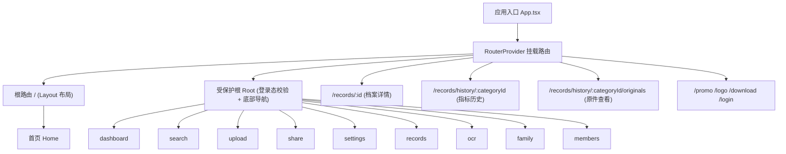
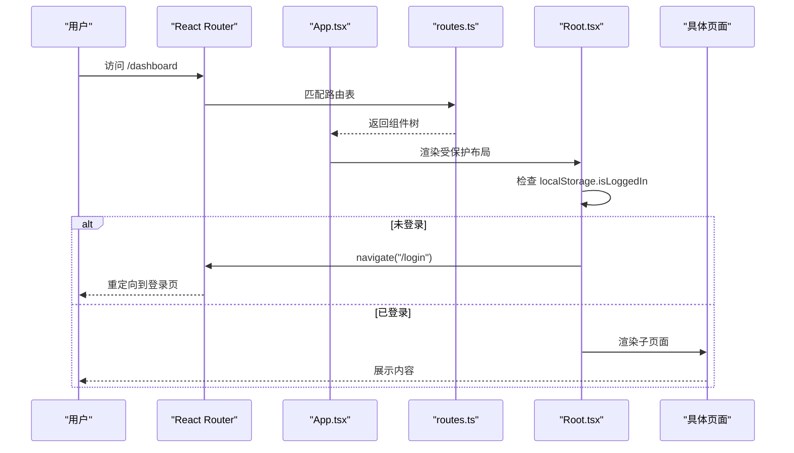
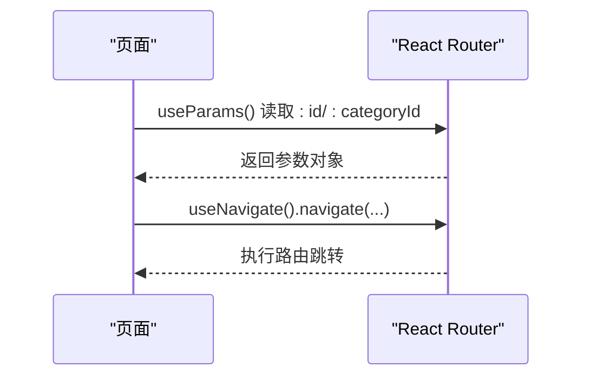
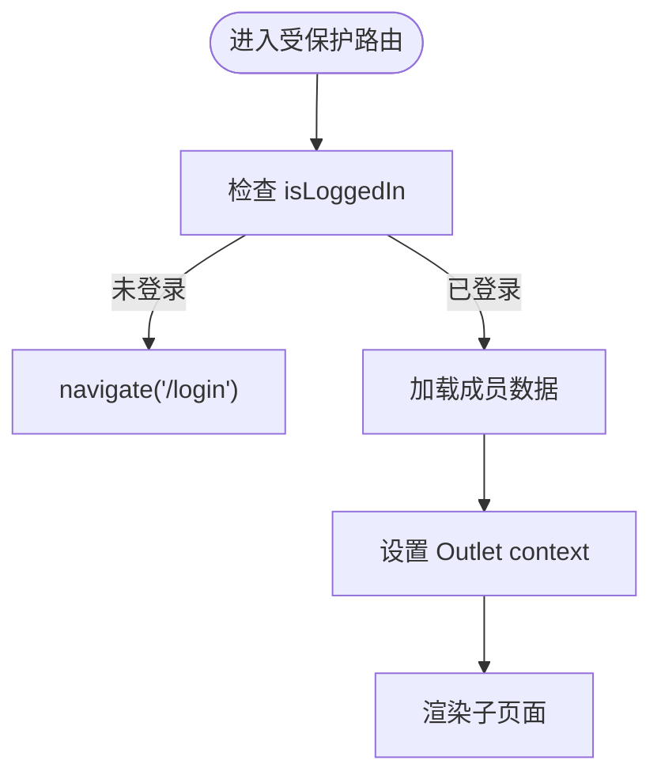
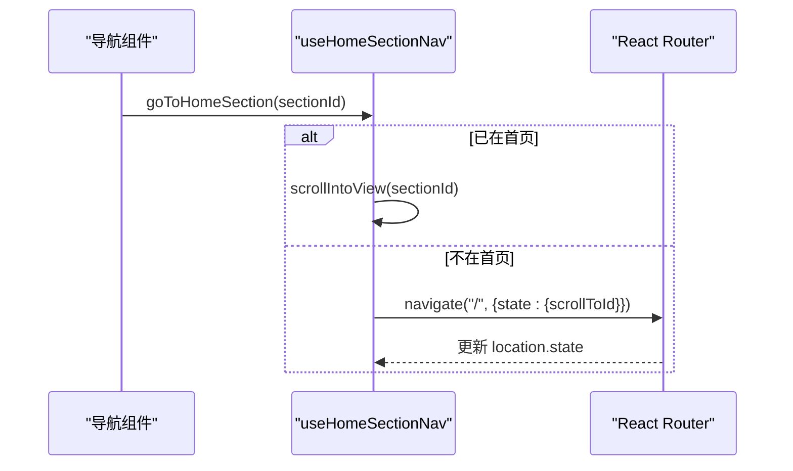
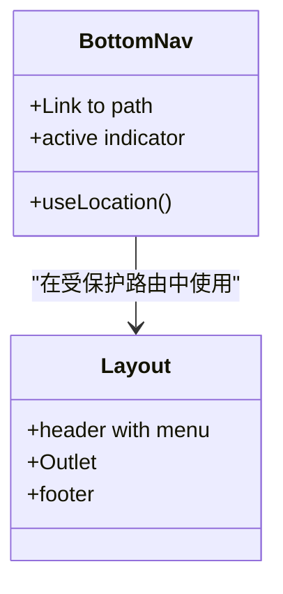
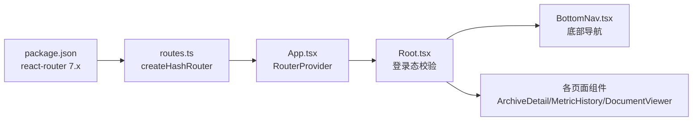

# 路由系统设计

<cite>
**本文引用的文件**
- [routes.ts](file://figma-ui/src/app/routes.ts)
- [App.tsx](file://figma-ui/src/app/App.tsx)
- [Root.tsx](file://figma-ui/src/app/Root.tsx)
- [Layout.tsx](file://figma-ui/src/app/components/Layout.tsx)
- [BottomNav.tsx](file://figma-ui/src/app/components/BottomNav.tsx)
- [ArchiveDetailPage.tsx](file://figma-ui/src/app/pages/ArchiveDetailPage.tsx)
- [MetricHistoryPage.tsx](file://figma-ui/src/app/pages/MetricHistoryPage.tsx)
- [DocumentViewerPage.tsx](file://figma-ui/src/app/pages/DocumentViewerPage.tsx)
- [useHomeSectionNav.ts](file://figma-ui/src/app/hooks/useHomeSectionNav.ts)
- [package.json](file://figma-ui/package.json)
</cite>

## 目录
1. [简介](#简介)
2. [项目结构](#项目结构)
3. [核心组件](#核心组件)
4. [架构总览](#架构总览)
5. [详细组件分析](#详细组件分析)
6. [依赖关系分析](#依赖关系分析)
7. [性能考虑](#性能考虑)
8. [故障排查指南](#故障排查指南)
9. [结论](#结论)
10. [附录](#附录)

## 简介
本设计文档围绕医案通医疗档案网站的路由系统，基于 React Router v7 的组合式路由进行系统化说明。内容涵盖：
- 路由配置与嵌套路由组织
- 动态路由参数与页面导航机制
- 路由守卫与权限控制（登录态校验）
- URL 状态同步、查询字符串处理策略
- 响应式路由适配与移动端导航优化
- 路由性能优化（代码分割、懒加载、预加载）
- 路由测试方法与调试技巧
- 与全局状态管理的集成方式与最佳实践

## 项目结构
本项目采用组合式路由（createHashRouter），将应用拆分为多个布局与页面模块，通过父子路由实现功能域隔离与复用。



图示来源
- [App.tsx:1-12](file://figma-ui/src/app/App.tsx#L1-L12)
- [routes.ts:25-106](file://figma-ui/src/app/routes.ts#L25-L106)

章节来源
- [App.tsx:1-12](file://figma-ui/src/app/App.tsx#L1-L12)
- [routes.ts:25-106](file://figma-ui/src/app/routes.ts#L25-L106)

## 核心组件
- 路由定义与挂载
  - 使用 createHashRouter 创建路由实例，集中管理所有路由表，包含嵌套路由与独立路由。
  - 在 App 中通过 RouterProvider 注入路由实例，完成渲染挂载。
- 布局组件
  - Layout：面向首页的通用布局，包含顶部导航、页脚与 Outlet 插槽。
  - Root：受保护的根布局，负责登录态检查、成员数据加载、以及底部导航栏。
- 导航组件
  - BottomNav：移动端底部导航，基于 useLocation 高亮当前项，使用 Link 进行无刷新跳转。
- 页面组件
  - ArchiveDetailPage：通过 useParams 获取动态参数 id，展示档案详情。
  - MetricHistoryPage：通过 useParams 获取 categoryId，展示指标历史趋势。
  - DocumentViewerPage：通过 useParams 获取 categoryId，展示原件图片轮播。
- 工具 Hook
  - useHomeSectionNav：在 Hash 路由下安全地跳转到首页并滚动到指定区块，避免 hash 抢占问题。

章节来源
- [routes.ts:25-106](file://figma-ui/src/app/routes.ts#L25-L106)
- [App.tsx:1-12](file://figma-ui/src/app/App.tsx#L1-L12)
- [Layout.tsx:1-251](file://figma-ui/src/app/components/Layout.tsx#L1-L251)
- [Root.tsx:1-59](file://figma-ui/src/app/Root.tsx#L1-L59)
- [BottomNav.tsx:1-85](file://figma-ui/src/app/components/BottomNav.tsx#L1-L85)
- [ArchiveDetailPage.tsx:1-356](file://figma-ui/src/app/pages/ArchiveDetailPage.tsx#L1-L356)
- [MetricHistoryPage.tsx:1-216](file://figma-ui/src/app/pages/MetricHistoryPage.tsx#L1-L216)
- [DocumentViewerPage.tsx:1-131](file://figma-ui/src/app/pages/DocumentViewerPage.tsx#L1-L131)
- [useHomeSectionNav.ts:1-25](file://figma-ui/src/app/hooks/useHomeSectionNav.ts#L1-L25)

## 架构总览
整体采用“布局 + 页面”的组合式路由模式：
- 顶层路由按功能域划分，公共布局与受保护布局分离。
- 受保护路由通过 Root 统一进行登录态校验与上下文传递。
- 动态路由用于详情页与历史记录等场景，参数通过 useParams 读取。
- 移动端通过 BottomNav 提供固定底部导航，结合 useLocation 实现高亮与平滑切换。



图示来源
- [App.tsx:1-12](file://figma-ui/src/app/App.tsx#L1-L12)
- [routes.ts:25-106](file://figma-ui/src/app/routes.ts#L25-L106)
- [Root.tsx:1-59](file://figma-ui/src/app/Root.tsx#L1-L59)

## 详细组件分析

### 路由配置与嵌套路由
- 路由表集中在 routes.ts，使用 createHashRouter 创建实例，便于在无服务端 fallback 环境下运行。
- 嵌套路由：
  - / 下的 Layout 包裹首页 Home，作为对外展示的着陆页布局。
  - Root 作为受保护布局，其 children 包含 dashboard、search、upload、share、settings、records、ocr、family、members 等功能模块。
- 独立路由：
  - /records/:id 档案详情
  - /records/history/:categoryId 指标历史
  - /records/history/:categoryId/originals 原件查看
  - /promo、/logo、/download、/login 等独立页面

```mermaid
flowchart TD
Start(["进入应用"]) --> Match["匹配路由表"]
Match --> |路径为 "/"| Layout["渲染 Layout"]
Match --> |路径为 "/dashboard"| Protected["进入 Root 受保护布局"]
Match --> |路径为 "/records/:id"| Detail["渲染档案详情"]
Match --> |路径为 "/records/history/:categoryId"| History["渲染指标历史"]
Match --> |其他| Others["渲染对应页面"]
Protected --> CheckLogin{"是否已登录?"}
CheckLogin --> |否| Redirect["重定向到 /login"]
CheckLogin --> |是| RenderChild["渲染子页面"]
```

图示来源
- [routes.ts:25-106](file://figma-ui/src/app/routes.ts#L25-L106)
- [Root.tsx:1-59](file://figma-ui/src/app/Root.tsx#L1-L59)

章节来源
- [routes.ts:25-106](file://figma-ui/src/app/routes.ts#L25-L106)

### 动态路由参数与页面导航
- 动态参数：
  - ArchiveDetailPage 使用 useParams 获取 id，根据 id 从本地存储或模拟数据中查找档案并渲染。
  - MetricHistoryPage 与 DocumentViewerPage 使用 useParams 获取 categoryId，用于筛选与展示相关数据。
- 页面导航：
  - 使用 useNavigate 进行编程式导航，如登录后跳转首页、返回列表页等。
  - 使用 Link 进行声明式导航，如底部导航与页面内跳转。



图示来源
- [ArchiveDetailPage.tsx:1-356](file://figma-ui/src/app/pages/ArchiveDetailPage.tsx#L1-L356)
- [MetricHistoryPage.tsx:1-216](file://figma-ui/src/app/pages/MetricHistoryPage.tsx#L1-L216)
- [DocumentViewerPage.tsx:1-131](file://figma-ui/src/app/pages/DocumentViewerPage.tsx#L1-L131)

章节来源
- [ArchiveDetailPage.tsx:1-356](file://figma-ui/src/app/pages/ArchiveDetailPage.tsx#L1-L356)
- [MetricHistoryPage.tsx:1-216](file://figma-ui/src/app/pages/MetricHistoryPage.tsx#L1-L216)
- [DocumentViewerPage.tsx:1-131](file://figma-ui/src/app/pages/DocumentViewerPage.tsx#L1-L131)

### 路由守卫与权限控制逻辑
- 登录态校验：
  - Root 组件在挂载时检查 localStorage 中的 isLoggedIn，若未登录则导航至 /login。
  - 同时加载 members 数据与 currentMemberId，设置默认成员并传递给子页面。
- 上下文传递：
  - 通过 Outlet context 将 currentMember 传递给子页面，供业务组件使用。
- 扩展建议：
  - 可封装高阶组件或自定义路由守卫，基于角色或权限字段进行细粒度控制。



图示来源
- [Root.tsx:1-59](file://figma-ui/src/app/Root.tsx#L1-L59)

章节来源
- [Root.tsx:1-59](file://figma-ui/src/app/Root.tsx#L1-L59)

### URL 状态同步与查询字符串处理
- URL 状态同步：
  - useHomeSectionNav 在 Hash 路由下避免直接使用 href="#id" 导致 hash 抢占，改为先导航到首页再通过 location.state 携带目标区块 ID，并在首页监听 state 进行滚动定位。
- 查询字符串处理：
  - 当前路由表未显式使用 useSearchParams；建议在需要搜索过滤、分页等场景引入 useSearchParams，保持 URL 与视图状态一致，支持分享与回退。



图示来源
- [useHomeSectionNav.ts:1-25](file://figma-ui/src/app/hooks/useHomeSectionNav.ts#L1-L25)

章节来源
- [useHomeSectionNav.ts:1-25](file://figma-ui/src/app/hooks/useHomeSectionNav.ts#L1-L25)

### 响应式路由适配与移动端导航优化
- 底部导航：
  - BottomNav 使用 useLocation 判断当前路径，高亮对应图标与标签，提升移动端导航体验。
  - 特殊按钮（上传）采用悬浮样式，增强操作引导。
- 布局适配：
  - Layout 在桌面端显示顶部导航，移动端提供折叠菜单，确保在不同屏幕尺寸下的可用性。
- 交互优化：
  - 使用 motion 动画提升过渡体验，减少视觉突兀感。



图示来源
- [BottomNav.tsx:1-85](file://figma-ui/src/app/components/BottomNav.tsx#L1-L85)
- [Layout.tsx:1-251](file://figma-ui/src/app/components/Layout.tsx#L1-L251)

章节来源
- [BottomNav.tsx:1-85](file://figma-ui/src/app/components/BottomNav.tsx#L1-L85)
- [Layout.tsx:1-251](file://figma-ui/src/app/components/Layout.tsx#L1-L251)

### 路由性能优化策略
- 代码分割与懒加载：
  - 当前路由表直接导入页面组件，可在构建阶段对大体积页面进行拆分，按需加载。
- 预加载机制：
  - 对高频访问页面（如 records、dashboard）可采用预加载策略，减少首次渲染延迟。
- 路由级缓存：
  - 对详情页可使用路由级缓存或虚拟列表，避免重复请求与渲染开销。
- 构建优化：
  - 使用 Vite 构建工具，合理配置分包与资源压缩，降低首屏体积。

[本节为通用指导，不直接分析具体文件]

### 路由测试方法与调试技巧
- 单元测试：
  - 使用 react-router 提供的测试工具（如 MemoryRouter）模拟路由环境，验证导航行为与参数解析。
- 端到端测试：
  - 使用 Playwright/Cypress 模拟用户操作，覆盖登录态校验、动态参数跳转、底部导航高亮等场景。
- 调试技巧：
  - 在浏览器开发者工具中观察 URL 变化与组件渲染顺序，确认路由匹配是否正确。
  - 在 Root 中添加日志输出，跟踪登录态变化与重定向逻辑。

[本节为通用指导，不直接分析具体文件]

### 与全局状态管理的集成方式与最佳实践
- 当前实现：
  - 登录态与成员数据存储在 localStorage，并通过 Root 初始化后以 Outlet context 传递给子页面。
- 最佳实践：
  - 对于复杂状态（如用户信息、权限、主题），建议使用状态管理库（如 Zustand/Redux）统一管理，并与路由守卫联动。
  - 将路由参数与查询字符串映射到全局状态，保证跨页面一致性。
  - 在状态变更时触发必要的路由重定向或页面刷新。

章节来源
- [Root.tsx:1-59](file://figma-ui/src/app/Root.tsx#L1-L59)

## 依赖关系分析
- 路由版本：
  - package.json 中声明 react-router 7.x，配合 createHashRouter 使用。
- 组件依赖：
  - App 依赖 RouterProvider 与路由实例。
  - Root 依赖 useNavigate、useEffect、localStorage。
  - 页面组件依赖 useParams、useNavigate、useLocation。
  - 导航组件依赖 Link、useLocation。



图示来源
- [package.json:66-66](file://figma-ui/package.json#L66-L66)
- [routes.ts:25-106](file://figma-ui/src/app/routes.ts#L25-L106)
- [App.tsx:1-12](file://figma-ui/src/app/App.tsx#L1-L12)
- [Root.tsx:1-59](file://figma-ui/src/app/Root.tsx#L1-L59)
- [BottomNav.tsx:1-85](file://figma-ui/src/app/components/BottomNav.tsx#L1-L85)
- [ArchiveDetailPage.tsx:1-356](file://figma-ui/src/app/pages/ArchiveDetailPage.tsx#L1-L356)
- [MetricHistoryPage.tsx:1-216](file://figma-ui/src/app/pages/MetricHistoryPage.tsx#L1-L216)
- [DocumentViewerPage.tsx:1-131](file://figma-ui/src/app/pages/DocumentViewerPage.tsx#L1-L131)

章节来源
- [package.json:66-66](file://figma-ui/package.json#L66-L66)
- [routes.ts:25-106](file://figma-ui/src/app/routes.ts#L25-L106)

## 性能考虑
- 首屏优化：
  - 将非关键页面（如 promo、logo、download）进行懒加载，减少初始包体。
- 路由级优化：
  - 对详情页使用 Suspense 与错误边界，提升容错与用户体验。
- 网络优化：
  - 对图片与文档资源启用 CDN 与缓存策略，减少加载时间。
- 内存优化：
  - 在页面卸载时清理定时器与事件监听，避免内存泄漏。

[本节为通用指导，不直接分析具体文件]

## 故障排查指南
- 常见问题：
  - 登录后仍被重定向：检查 Root 中 isLoggedIn 的判断逻辑与 localStorage 写入时机。
  - 动态参数为空：确认路由路径与 useParams 的键名一致。
  - 移动端导航高亮异常：核对 useLocation 的 pathname 与 Link 的 to 值是否完全匹配。
- 调试步骤：
  - 在 Root 中添加 console.log 输出登录态与成员数据。
  - 在页面组件中打印 useParams 与 useLocation 的值，确认路由匹配。
  - 使用浏览器网络面板检查资源加载情况，定位性能瓶颈。

章节来源
- [Root.tsx:1-59](file://figma-ui/src/app/Root.tsx#L1-L59)
- [ArchiveDetailPage.tsx:1-356](file://figma-ui/src/app/pages/ArchiveDetailPage.tsx#L1-L356)
- [MetricHistoryPage.tsx:1-216](file://figma-ui/src/app/pages/MetricHistoryPage.tsx#L1-L216)
- [DocumentViewerPage.tsx:1-131](file://figma-ui/src/app/pages/DocumentViewerPage.tsx#L1-L131)

## 结论
本项目基于 React Router v7 的组合式路由实现了清晰的路由结构与良好的用户体验。通过 Root 的登录态校验与上下文传递，保障了受保护路由的安全性；通过动态参数与导航钩子，实现了灵活的页面跳转与数据展示。后续可进一步引入查询字符串状态同步、更细粒度的权限控制与路由级性能优化，以提升系统的可维护性与扩展性。

[本节为总结性内容，不直接分析具体文件]

## 附录
- 路由表概览
  - 首页：/
  - 受保护功能：/dashboard、/search、/upload、/share、/settings、/records、/ocr、/family、/members
  - 动态详情：/records/:id、/records/history/:categoryId、/records/history/:categoryId/originals
  - 独立页面：/promo、/logo、/download、/login

章节来源
- [routes.ts:25-106](file://figma-ui/src/app/routes.ts#L25-L106)