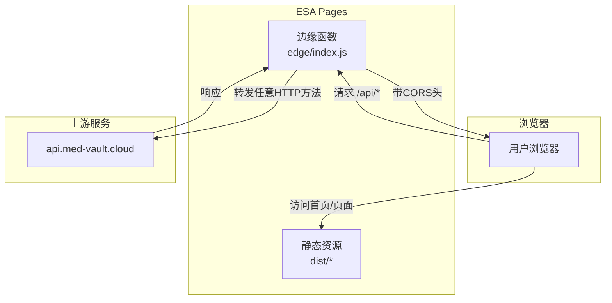
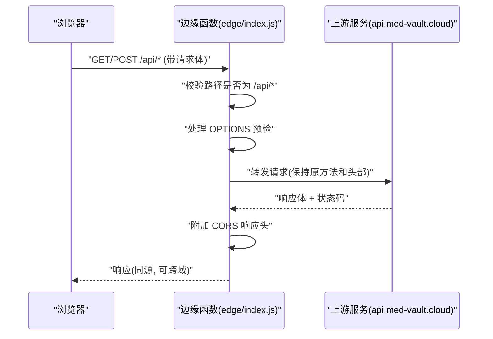
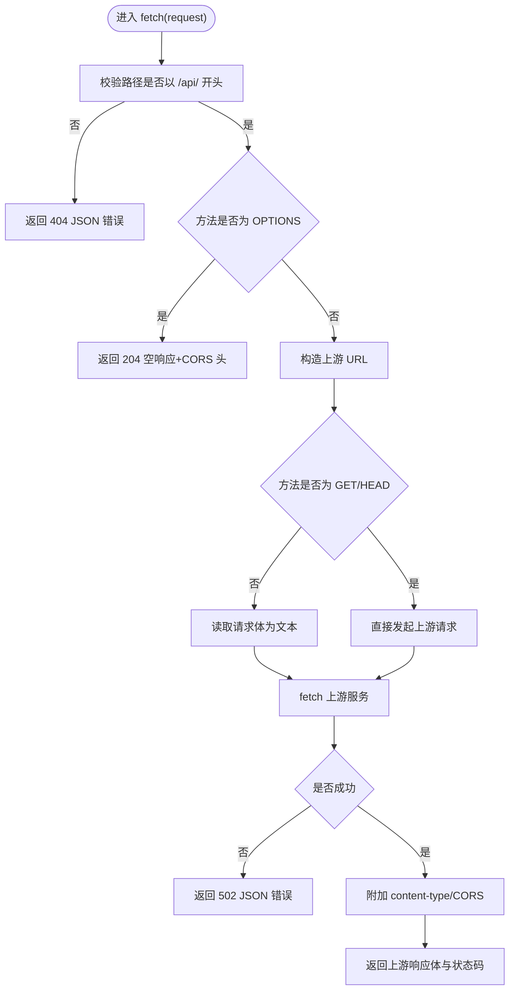
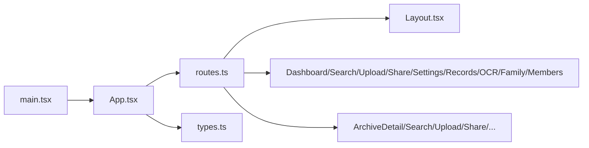
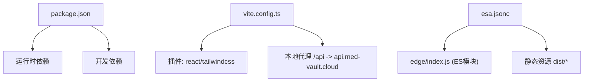

# 边缘函数系统

<cite>
**本文引用的文件**
- [edge/index.js](file://figma-ui/edge/index.js)
- [esa.jsonc](file://figma-ui/esa.jsonc)
- [vite.config.ts](file://figma-ui/vite.config.ts)
- [package.json](file://figma-ui/package.json)
- [src/main.tsx](file://figma-ui/src/main.tsx)
- [src/app/App.tsx](file://figma-ui/src/app/App.tsx)
- [src/app/routes.ts](file://figma-ui/src/app/routes.ts)
- [src/app/components/Layout.tsx](file://figma-ui/src/app/components/Layout.tsx)
- [src/app/types.ts](file://figma-ui/src/app/types.ts)
</cite>

## 更新摘要
**所做更改**
- 更新了边缘函数架构，从单一端点代理改为灵活的/api/*通用API代理
- 增强了CORS支持，新增POST方法支持
- 移除了边缘缓存配置，简化了响应处理
- 改用了ES模块导出格式，提升了模块化程度
- 优化了请求体处理和错误响应结构
- 更新了架构图和流程图以反映新的代理逻辑

## 目录
1. [简介](#简介)
2. [项目结构](#项目结构)
3. [核心组件](#核心组件)
4. [架构总览](#架构总览)
5. [详细组件分析](#详细组件分析)
6. [依赖关系分析](#依赖关系分析)
7. [性能考量](#性能考量)
8. [故障排查指南](#故障排查指南)
9. [结论](#结论)
10. [附录](#附录)

## 简介
本仓库为"医案通"官网与前端应用，并配套一个部署在阿里云 ESA Pages 的边缘函数（EdgeRoutine），用于在同域环境下代理所有 /api/* 接口到 https://api.med-vault.cloud，解决浏览器跨域限制、统一 CORS 响应头，并提供通用的 API 代理服务。前端基于 React + Vite + Tailwind 构建，使用 Hash Router 进行路由管理，静态资源由 Pages assets 托管。

**更新** 边缘函数已从单一版本检查接口代理升级为通用的 /api/* 接口代理，支持多种 HTTP 方法和更灵活的路径匹配。

## 项目结构
- 边缘函数入口：figma-ui/edge/index.js（ES模块格式）
- 平台配置：figma-ui/esa.jsonc（定义入口、构建命令、静态资源目录与 SPA fallback）
- 前端工程：figma-ui/src（React 应用、页面、组件、类型、样式等）
- 构建与开发：figma-ui/vite.config.ts（插件、代理、别名）、figma-ui/package.json（脚本与依赖）

**图表来源**
- [edge/index.js:1-74](file://figma-ui/edge/index.js#L1-L74)
- [esa.jsonc:1-14](file://figma-ui/esa.jsonc#L1-L14)

**章节来源**
- [edge/index.js:1-74](file://figma-ui/edge/index.js#L1-L74)
- [esa.jsonc:1-14](file://figma-ui/esa.jsonc#L1-L14)
- [vite.config.ts:1-40](file://figma-ui/vite.config.ts#L1-L40)
- [package.json:1-101](file://figma-ui/package.json#L1-L101)

## 核心组件
- **边缘函数**：负责拦截所有 /api/* 路径、支持 GET/POST/OPTIONS 方法、透传请求体和头部、附加 CORS 响应头、返回统一错误格式。
- **前端应用**：React 单页应用，通过 Hash Router 组织页面；本地开发通过 Vite 代理模拟同域 API。
- **平台配置**：定义构建与部署行为，将 edge/index.js 作为 ES 模块入口，并将 dist 作为静态资源目录，启用 SPA fallback。

**更新** 边缘函数现在支持通用的 /api/* 路径匹配，不再局限于特定的版本检查接口。

**章节来源**
- [edge/index.js:1-74](file://figma-ui/edge/index.js#L1-L74)
- [vite.config.ts:20-28](file://figma-ui/vite.config.ts#L20-L28)
- [esa.jsonc:1-14](file://figma-ui/esa.jsonc#L1-L14)

## 架构总览
整体流程：浏览器发起对 /api/* 的请求，被 ESA 边缘函数拦截，支持 GET、POST、OPTIONS 等方法，随后向 https://api.med-vault.cloud 发起请求，获取响应后添加 CORS 头再返回给浏览器。非 /api/* 路径会返回 404 错误。SPA 页面与静态资源由 Pages 直接提供。

**更新** 新的架构支持所有 /api/* 路径的通用代理，而不仅仅是特定的版本检查接口。

**图表来源**
- [edge/index.js:31-72](file://figma-ui/edge/index.js#L31-L72)

**章节来源**
- [edge/index.js:31-72](file://figma-ui/edge/index.js#L31-L72)

## 详细组件分析

### 边缘函数（EdgeRoutine）
- **职责**
  - 仅处理 /api/* 路径的所有 HTTP 方法（GET、POST、OPTIONS）
  - 支持 OPTIONS 预检，统一 CORS 头
  - 透传请求体和头部信息
  - 移除边缘缓存，直接转发上游响应
  - 统一错误响应格式（success=false，含 error 消息）
- **关键逻辑**
  - 路径前缀匹配（/api/*）
  - HTTP 方法处理（GET、POST、OPTIONS）
  - 请求体处理（非 GET/HEAD 方法时读取文本内容）
  - 上游 fetch 调用与异常捕获
  - 响应头注入（content-type、CORS）
- **复杂度**
  - 时间复杂度 O(1)，空间复杂度 O(1)
- **优化点**
  - 移除了复杂的缓存策略，简化为直接转发
  - 支持任意请求体大小（通过 text() 读取）
  - 增强的错误处理和统一的响应格式

**更新** 新的边缘函数实现了通用的 API 代理功能，支持多种 HTTP 方法和请求体处理。

**图表来源**
- [edge/index.js:31-72](file://figma-ui/edge/index.js#L31-L72)

**章节来源**
- [edge/index.js:1-74](file://figma-ui/edge/index.js#L1-L74)

### 前端应用（React + Vite）
- **入口与路由**
  - main.tsx 挂载根节点并渲染 App
  - App 包裹 LaunchNoticeProvider 与 RouterProvider
  - routes.ts 使用 createHashRouter 定义页面路由（dashboard、search、upload、share、settings、records、ocr、family、members、download、login 等）
- **布局与导航**
  - Layout.tsx 提供顶部导航、移动端菜单、底部信息区
- **数据模型**
  - types.ts 定义了成员、档案、OCR 结果、分享链接等数据结构及枚举映射

**更新** 前端应用保持不变，但可以通过新的通用 API 代理访问更多后端功能。

**图表来源**
- [src/main.tsx:1-7](file://figma-ui/src/main.tsx#L1-L7)
- [src/app/App.tsx:1-12](file://figma-ui/src/app/App.tsx#L1-L12)
- [src/app/routes.ts:1-106](file://figma-ui/src/app/routes.ts#L1-L106)
- [src/app/components/Layout.tsx:1-251](file://figma-ui/src/app/components/Layout.tsx#L1-L251)
- [src/app/types.ts:1-95](file://figma-ui/src/app/types.ts#L1-L95)

**章节来源**
- [src/main.tsx:1-7](file://figma-ui/src/main.tsx#L1-L7)
- [src/app/App.tsx:1-12](file://figma-ui/src/app/App.tsx#L1-L12)
- [src/app/routes.ts:1-106](file://figma-ui/src/app/routes.ts#L1-L106)
- [src/app/components/Layout.tsx:1-251](file://figma-ui/src/app/components/Layout.tsx#L1-L251)
- [src/app/types.ts:1-95](file://figma-ui/src/app/types.ts#L1-L95)

### 平台与构建配置
- **ESA 配置**
  - entry 指向 edge/index.js（ES 模块格式）
  - buildCommand 执行 npm run build
  - assets.directory 指向 ./dist
  - notFoundStrategy 为 singlePageApplication，确保 SPA 路由刷新可用
- **Vite 配置**
  - 启用 react 与 tailwindcss 插件
  - 本地开发时通过 /api 代理到 https://api.med-vault.cloud，模拟边缘函数的同源行为
  - 设置 @ 别名指向 src
  - 支持 raw 导入 svg/csv 等资源

**更新** ESA 配置现在支持 ES 模块格式的入口文件。

**章节来源**
- [esa.jsonc:1-14](file://figma-ui/esa.jsonc#L1-L14)
- [vite.config.ts:1-40](file://figma-ui/vite.config.ts#L1-L40)

## 依赖关系分析
- **运行时依赖**
  - React、React DOM、react-router（Hash Router）
  - UI 与动画：@radix-ui/*、motion/react、lucide-react、tailwind-merge 等
  - 工具库：date-fns、sonner、recharts、html-to-image、html2canvas 等
- **构建与开发依赖**
  - vite、@vitejs/plugin-react、@tailwindcss/vite、tailwindcss
- **运行环境**
  - Node 20（engines 指定）
  - 构建产物输出至 dist，由 ESA Pages 托管

**更新** package.json 中添加了 "type": "module" 以支持 ES 模块格式。

**图表来源**
- [package.json:1-101](file://figma-ui/package.json#L1-L101)
- [vite.config.ts:1-40](file://figma-ui/vite.config.ts#L1-L40)
- [esa.jsonc:1-14](file://figma-ui/esa.jsonc#L1-L14)

**章节来源**
- [package.json:1-101](file://figma-ui/package.json#L1-L101)
- [vite.config.ts:1-40](file://figma-ui/vite.config.ts#L1-L40)
- [esa.jsonc:1-14](file://figma-ui/esa.jsonc#L1-L14)

## 性能考量
- **无边缘缓存**
  - 移除了边缘层缓存配置，直接转发上游响应，确保数据实时性
  - 适合需要最新数据的 API 场景
- **请求最小化**
  - 仅透传必要的请求体和头部，避免冗余数据传输
- **同源代理**
  - 本地开发通过 Vite 代理模拟边缘函数行为，减少跨域调试成本
- **建议**
  - 可根据具体 API 需求在上游服务层面实现缓存策略
  - 对频繁调用的 API 考虑在上游实现适当的缓存机制

**更新** 新的架构移除了边缘缓存，专注于提供可靠的 API 代理服务。

## 故障排查指南
- **常见问题**
  - 404 Not Found：请求路径不是 /api/* 格式
  - 502 upstream fetch failed：上游不可达或网络异常
  - CORS 错误：确认请求包含正确的方法与头部，且边缘函数已返回 CORS 头
  - POST 请求失败：检查请求体格式和 Content-Type 头部
- **定位步骤**
  - 检查浏览器 Network 面板中的请求路径与方法
  - 查看边缘函数日志（若平台提供）
  - 验证上游服务是否可达与返回格式是否符合预期
  - 本地开发时确认 Vite 代理配置生效（/api 转发到 https://api.med-vault.cloud）

**更新** 新增了 POST 请求相关的故障排查指导。

**章节来源**
- [edge/index.js:35-38](file://figma-ui/edge/index.js#L35-L38)
- [edge/index.js:40-43](file://figma-ui/edge/index.js#L40-L43)
- [edge/index.js:56-61](file://figma-ui/edge/index.js#L56-L61)
- [vite.config.ts:20-28](file://figma-ui/vite.config.ts#L20-L28)

## 结论
该边缘函数经过重构后，从单一的版本检查接口代理升级为通用的 /api/* API 代理服务，支持多种 HTTP 方法和请求体处理，提供了更灵活的后端接口访问能力。通过移除边缘缓存和增强 CORS 支持，确保了数据的实时性和跨域访问的可靠性。配合 React SPA 与 ESA Pages 的静态托管与 SPA fallback，形成完整的发布与访问链路。建议在后续迭代中根据具体 API 需求在上游服务层面实现适当的缓存和监控策略。

**更新** 新的架构提供了更强大的 API 代理能力，为前端应用提供了更灵活的后端访问方式。

## 附录
- **快速开始**
  - 安装依赖：npm install
  - 本地开发：npm run dev（Vite 启动，/api 代理到上游）
  - 构建产物：npm run build（输出至 dist）
  - 预览构建：npm run preview
- **部署说明**
  - 在 ESA 控制台导入仓库，根目录设为 figma-ui
  - 构建命令：npm run build
  - 静态资源目录：./dist
  - 边缘函数入口：./edge/index.js（ES 模块格式）

**更新** 部署说明中强调了 ES 模块格式的支持。

**章节来源**
- [package.json:9-13](file://figma-ui/package.json#L9-L13)
- [esa.jsonc:1-14](file://figma-ui/esa.jsonc#L1-L14)