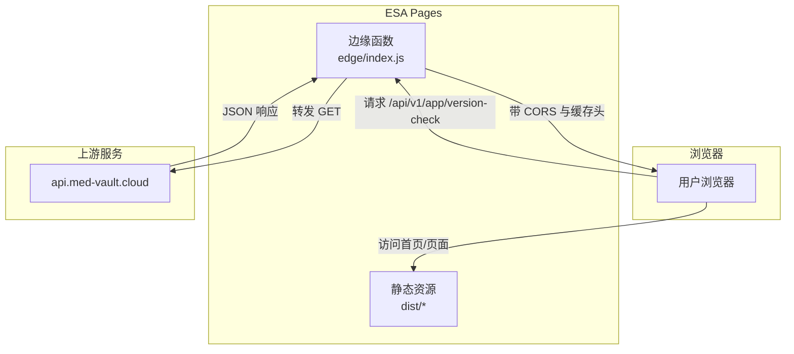
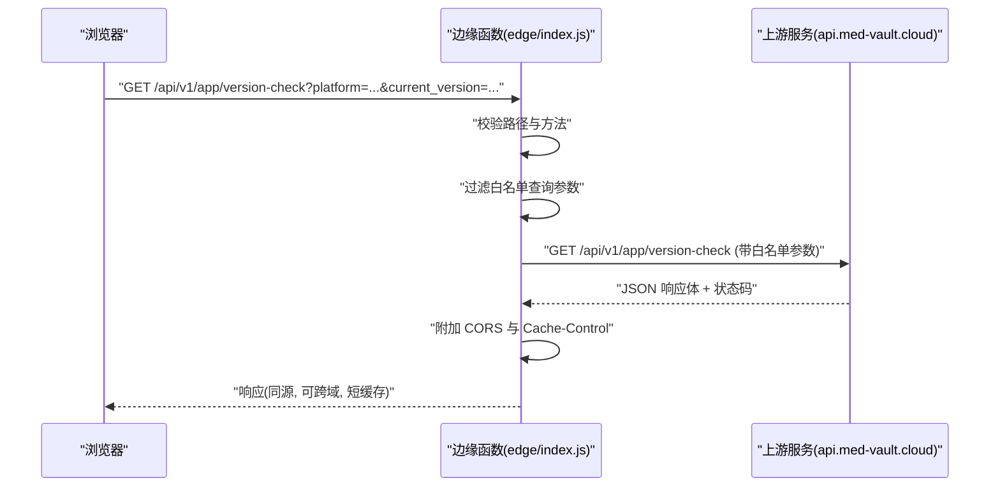
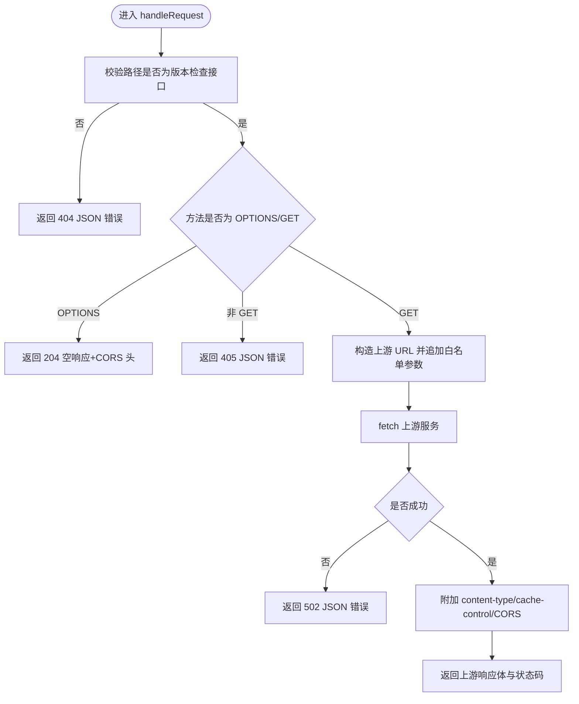
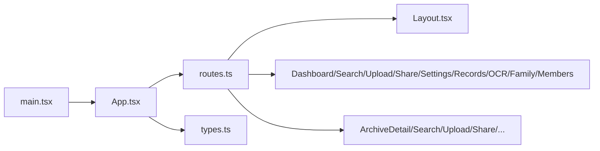
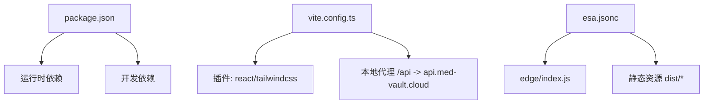

# 边缘函数系统

<cite>
**本文引用的文件**
- [edge/index.js](file://figma-ui/edge/index.js)
- [esa.jsonc](file://figma-ui/esa.jsonc)
- [vite.config.ts](file://figma-ui/vite.config.ts)
- [package.json](file://figma-ui/package.json)
- [src/main.tsx](file://figma-ui/src/main.tsx)
- [src/app/App.tsx](file://figma-ui/src/app/App.tsx)
- [src/app/routes.ts](file://figma-ui/src/app/routes.ts)
- [src/app/components/Layout.tsx](file://figma-ui/src/app/components/Layout.tsx)
- [src/app/types.ts](file://figma-ui/src/app/types.ts)
</cite>

## 目录
1. [简介](#简介)
2. [项目结构](#项目结构)
3. [核心组件](#核心组件)
4. [架构总览](#架构总览)
5. [详细组件分析](#详细组件分析)
6. [依赖关系分析](#依赖关系分析)
7. [性能考量](#性能考量)
8. [故障排查指南](#故障排查指南)
9. [结论](#结论)
10. [附录](#附录)

## 简介
本仓库为“医案通”官网与前端应用，并配套一个部署在阿里云 ESA Pages 的边缘函数（EdgeRoutine），用于在同域环境下代理 App 版本检查接口，解决浏览器跨域限制、统一 CORS 响应头、并提供短缓存以降低源站压力。前端基于 React + Vite + Tailwind 构建，使用 Hash Router 进行路由管理，静态资源由 Pages assets 托管。

## 项目结构
- 边缘函数入口：figma-ui/edge/index.js
- 平台配置：figma-ui/esa.jsonc（定义入口、构建命令、静态资源目录与 SPA fallback）
- 前端工程：figma-ui/src（React 应用、页面、组件、类型、样式等）
- 构建与开发：figma-ui/vite.config.ts（插件、代理、别名）、figma-ui/package.json（脚本与依赖）

图表来源
- [edge/index.js:1-87](file://figma-ui/edge/index.js#L1-L87)
- [esa.jsonc:1-14](file://figma-ui/esa.jsonc#L1-L14)

章节来源
- [edge/index.js:1-87](file://figma-ui/edge/index.js#L1-L87)
- [esa.jsonc:1-14](file://figma-ui/esa.jsonc#L1-L14)
- [vite.config.ts:1-40](file://figma-ui/vite.config.ts#L1-L40)
- [package.json:1-101](file://figma-ui/package.json#L1-L101)

## 核心组件
- 边缘函数：负责拦截特定路径、校验方法、白名单过滤查询参数、转发到上游、附加 CORS 与缓存头、返回统一错误格式。
- 前端应用：React 单页应用，通过 Hash Router 组织页面；本地开发通过 Vite 代理模拟同域 API。
- 平台配置：定义构建与部署行为，将 edge/index.js 作为入口，并将 dist 作为静态资源目录，启用 SPA fallback。

章节来源
- [edge/index.js:1-87](file://figma-ui/edge/index.js#L1-L87)
- [vite.config.ts:20-28](file://figma-ui/vite.config.ts#L20-L28)
- [esa.jsonc:1-14](file://figma-ui/esa.jsonc#L1-L14)

## 架构总览
整体流程：浏览器发起对 /api/v1/app/version-check 的请求，被 ESA 边缘函数拦截，仅允许 GET 方法与白名单查询参数透传，随后向 https://api.med-vault.cloud 发起请求，获取响应后添加 CORS 与缓存头再返回给浏览器。非匹配路径或非法方法会返回统一 JSON 错误。SPA 页面与静态资源由 Pages 直接提供。

图表来源
- [edge/index.js:43-86](file://figma-ui/edge/index.js#L43-L86)

章节来源
- [edge/index.js:43-86](file://figma-ui/edge/index.js#L43-L86)

## 详细组件分析

### 边缘函数（EdgeRoutine）
- 职责
  - 仅处理 /api/v1/app/version-check 的 GET 请求
  - 支持 OPTIONS 预检，统一 CORS 头
  - 仅透传白名单查询参数：platform、current_version、user_id、device_id
  - 短缓存（max-age 秒级）降低上游压力
  - 统一错误响应格式（success=false，含 request_id）
- 关键逻辑
  - 路径与方法校验
  - 查询参数白名单过滤
  - 上游 fetch 调用与异常捕获
  - 响应头注入（content-type、cache-control、CORS）
- 复杂度
  - 时间复杂度 O(1)，空间复杂度 O(1)
- 优化点
  - 可考虑根据上游 cache-control 动态设置边缘缓存
  - 可增加重试与熔断策略提升可用性

图表来源
- [edge/index.js:43-86](file://figma-ui/edge/index.js#L43-L86)

章节来源
- [edge/index.js:1-87](file://figma-ui/edge/index.js#L1-L87)

### 前端应用（React + Vite）
- 入口与路由
  - main.tsx 挂载根节点并渲染 App
  - App 包裹 LaunchNoticeProvider 与 RouterProvider
  - routes.ts 使用 createHashRouter 定义页面路由（dashboard、search、upload、share、settings、records、ocr、family、members、download、login 等）
- 布局与导航
  - Layout.tsx 提供顶部导航、移动端菜单、底部信息区，并通过 useHomeSectionNav 实现首页锚点跳转
- 数据模型
  - types.ts 定义了成员、档案、OCR 结果、分享链接等数据结构及枚举映射

图表来源
- [src/main.tsx:1-7](file://figma-ui/src/main.tsx#L1-L7)
- [src/app/App.tsx:1-12](file://figma-ui/src/app/App.tsx#L1-L12)
- [src/app/routes.ts:1-106](file://figma-ui/src/app/routes.ts#L1-L106)
- [src/app/components/Layout.tsx:1-251](file://figma-ui/src/app/components/Layout.tsx#L1-L251)
- [src/app/types.ts:1-95](file://figma-ui/src/app/types.ts#L1-L95)

章节来源
- [src/main.tsx:1-7](file://figma-ui/src/main.tsx#L1-L7)
- [src/app/App.tsx:1-12](file://figma-ui/src/app/App.tsx#L1-L12)
- [src/app/routes.ts:1-106](file://figma-ui/src/app/routes.ts#L1-L106)
- [src/app/components/Layout.tsx:1-251](file://figma-ui/src/app/components/Layout.tsx#L1-L251)
- [src/app/types.ts:1-95](file://figma-ui/src/app/types.ts#L1-L95)

### 平台与构建配置
- ESA 配置
  - entry 指向 edge/index.js
  - buildCommand 执行 npm run build
  - assets.directory 指向 ./dist
  - notFoundStrategy 为 singlePageApplication，确保 SPA 路由刷新可用
- Vite 配置
  - 启用 react 与 tailwindcss 插件
  - 本地开发时通过 /api 代理到 https://api.med-vault.cloud，模拟边缘函数的同源行为
  - 设置 @ 别名指向 src
  - 支持 raw 导入 svg/csv 等资源

章节来源
- [esa.jsonc:1-14](file://figma-ui/esa.jsonc#L1-L14)
- [vite.config.ts:1-40](file://figma-ui/vite.config.ts#L1-L40)

## 依赖关系分析
- 运行时依赖
  - React、React DOM、react-router（Hash Router）
  - UI 与动画：@radix-ui/*、motion/react、lucide-react、tailwind-merge 等
  - 工具库：date-fns、sonner、recharts、html-to-image、html2canvas 等
- 构建与开发依赖
  - vite、@vitejs/plugin-react、@tailwindcss/vite、tailwindcss
- 运行环境
  - Node 20（engines 指定）
  - 构建产物输出至 dist，由 ESA Pages 托管

图表来源
- [package.json:1-101](file://figma-ui/package.json#L1-L101)
- [vite.config.ts:1-40](file://figma-ui/vite.config.ts#L1-L40)
- [esa.jsonc:1-14](file://figma-ui/esa.jsonc#L1-L14)

章节来源
- [package.json:1-101](file://figma-ui/package.json#L1-L101)
- [vite.config.ts:1-40](file://figma-ui/vite.config.ts#L1-L40)
- [esa.jsonc:1-14](file://figma-ui/esa.jsonc#L1-L14)

## 性能考量
- 边缘缓存
  - 边缘层设置 max-age 秒级缓存，减少上游请求频率，适合低频更新的版本检查场景
- 请求最小化
  - 仅透传白名单查询参数，避免冗余数据传输
- 同源代理
  - 本地开发通过 Vite 代理模拟边缘函数行为，减少跨域调试成本
- 建议
  - 根据上游响应头的 cache-control 动态调整边缘缓存策略
  - 对上游失败增加重试与降级策略（如返回本地默认版本）

[本节为通用指导，不直接分析具体文件]

## 故障排查指南
- 常见问题
  - 404 Not Found：请求路径不是 /api/v1/app/version-check
  - 405 Method Not Allowed：非 GET/OPTIONS 方法
  - 502 upstream fetch failed：上游不可达或网络异常
  - CORS 错误：确认请求包含正确的方法与头部，且边缘函数已返回 CORS 头
- 定位步骤
  - 检查浏览器 Network 面板中的请求路径与方法
  - 查看边缘函数日志（若平台提供）
  - 验证上游服务是否可达与返回格式是否符合预期
  - 本地开发时确认 Vite 代理配置生效（/api 转发到 https://api.med-vault.cloud）

章节来源
- [edge/index.js:29-37](file://figma-ui/edge/index.js#L29-L37)
- [edge/index.js:43-86](file://figma-ui/edge/index.js#L43-L86)
- [vite.config.ts:20-28](file://figma-ui/vite.config.ts#L20-L28)

## 结论
该边缘函数以极简方式实现了版本检查接口的同域代理、CORS 统一处理与短缓存，有效规避跨域问题并降低上游压力。配合 React SPA 与 ESA Pages 的静态托管与 SPA fallback，形成完整的发布与访问链路。建议在后续迭代中增强缓存策略、错误重试与监控能力，以提升稳定性与可观测性。

[本节为总结性内容，不直接分析具体文件]

## 附录
- 快速开始
  - 安装依赖：npm install
  - 本地开发：npm run dev（Vite 启动，/api 代理到上游）
  - 构建产物：npm run build（输出至 dist）
  - 预览构建：npm run preview
- 部署说明
  - 在 ESA 控制台导入仓库，根目录设为 figma-ui
  - 构建命令：npm run build
  - 静态资源目录：./dist
  - 边缘函数入口：./edge/index.js

章节来源
- [package.json:9-13](file://figma-ui/package.json#L9-L13)
- [esa.jsonc:1-14](file://figma-ui/esa.jsonc#L1-L14)