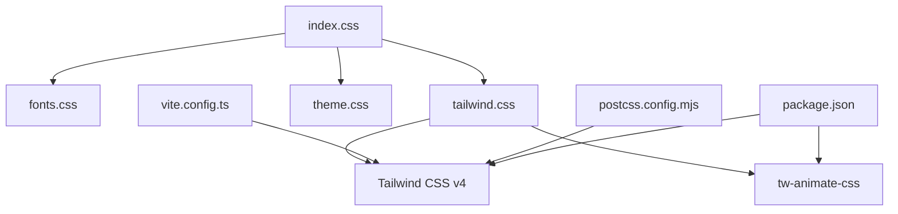
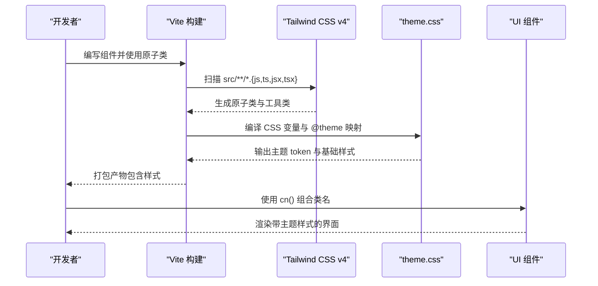
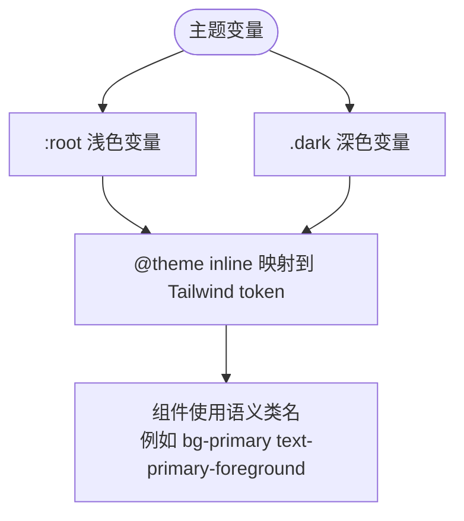
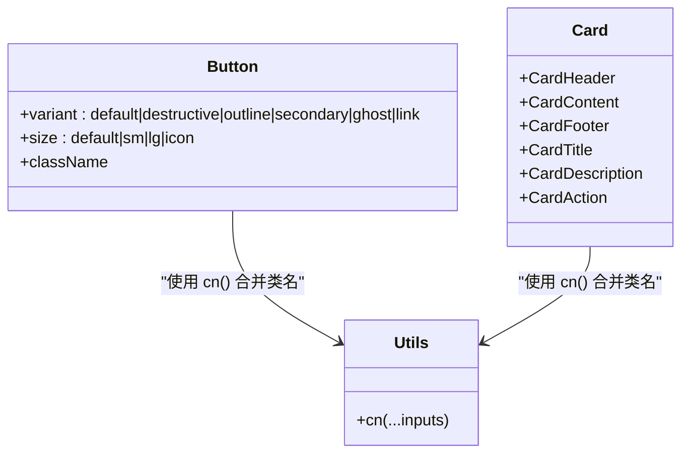
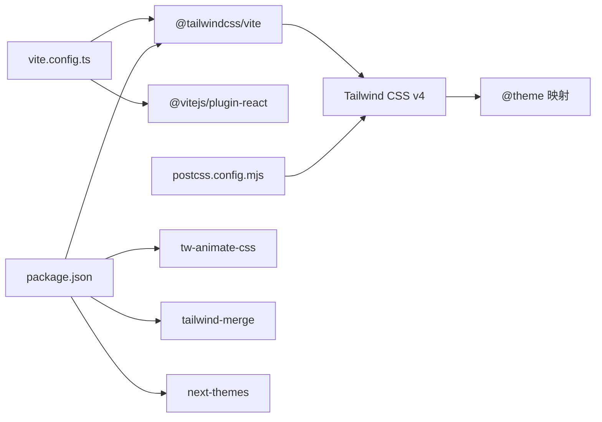

# 样式与主题

<cite>
**本文引用的文件**
- [index.css](file://figma-ui/src/styles/index.css)
- [tailwind.css](file://figma-ui/src/styles/tailwind.css)
- [theme.css](file://figma-ui/src/styles/theme.css)
- [fonts.css](file://figma-ui/src/styles/fonts.css)
- [utils.ts](file://figma-ui/src/lib/utils.ts)
- [button.tsx](file://figma-ui/src/app/components/ui/button.tsx)
- [card.tsx](file://figma-ui/src/app/components/ui/card.tsx)
- [package.json](file://figma-ui/package.json)
- [postcss.config.mjs](file://figma-ui/postcss.config.mjs)
- [vite.config.ts](file://figma-ui/vite.config.ts)
</cite>

## 目录
1. [简介](#简介)
2. [项目结构](#项目结构)
3. [核心组件](#核心组件)
4. [架构总览](#架构总览)
5. [详细组件分析](#详细组件分析)
6. [依赖关系分析](#依赖关系分析)
7. [性能考量](#性能考量)
8. [故障排查指南](#故障排查指南)
9. [结论](#结论)
10. [附录](#附录)

## 简介
本文件为医案通医疗档案网站的样式与主题系统提供系统化文档。项目基于 Tailwind CSS 4 的原子化样式体系，采用 CSS 变量驱动的主题系统，支持深色模式、品牌色定制、字体管理与图标集成；同时通过响应式策略与动画库实现跨设备一致的视觉体验。本文从架构、数据流、处理逻辑到优化与兼容性，帮助读者快速理解并高效定制样式与主题。

## 项目结构
样式入口统一在 styles 目录下，按职责分层：
- index.css：聚合导入字体、Tailwind 与主题
- tailwind.css：引入 Tailwind CSS v4 与动画库，声明源码扫描范围
- theme.css：定义 CSS 变量主题、@theme 映射、基础层样式与动画
- fonts.css：加载 Inter 字体族

构建与插件配置：
- vite.config.ts：启用 React 与 Tailwind 插件，设置别名与资源类型
- postcss.config.mjs：由 @tailwindcss/vite 自动管理 PostCSS 插件，可在此扩展
- package.json：声明 Tailwind v4、tw-animate-css、next-themes 等关键依赖

图表来源
- [index.css:1-4](file://figma-ui/src/styles/index.css#L1-L4)
- [tailwind.css:1-5](file://figma-ui/src/styles/tailwind.css#L1-L5)
- [theme.css:1-218](file://figma-ui/src/styles/theme.css#L1-L218)
- [vite.config.ts:1-30](file://figma-ui/vite.config.ts#L1-L30)
- [postcss.config.mjs:1-16](file://figma-ui/postcss.config.mjs#L1-L16)
- [package.json:14-81](file://figma-ui/package.json#L14-L81)

章节来源
- [index.css:1-4](file://figma-ui/src/styles/index.css#L1-L4)
- [tailwind.css:1-5](file://figma-ui/src/styles/tailwind.css#L1-L5)
- [theme.css:1-218](file://figma-ui/src/styles/theme.css#L1-L218)
- [fonts.css:1-3](file://figma-ui/src/styles/fonts.css#L1-L3)
- [vite.config.ts:1-30](file://figma-ui/vite.config.ts#L1-L30)
- [postcss.config.mjs:1-16](file://figma-ui/postcss.config.mjs#L1-L16)
- [package.json:14-81](file://figma-ui/package.json#L14-L81)

## 核心组件
- 主题变量与颜色系统：集中定义在 theme.css 的 :root 与 .dark 中，并通过 @theme inline 映射到 Tailwind 语义化 token（如 --color-primary、--color-background 等），实现“一处定义、全局生效”
- 字体管理：通过 fonts.css 加载 Inter 字体族，并在 theme.css 中声明 --font-sans，确保一致的字重与行高
- 基础层样式：在 theme.css 的 @layer base 中统一 html/body/标题/表单元素的基础排版与滚动行为
- 动画与工具类：引入 tw-animate-css 并提供自定义慢速旋转动画 animate-spin-slow
- 类名合并工具：lib/utils.ts 暴露 cn() 函数，结合 clsx 与 tailwind-merge 安全合并 className，避免冲突

章节来源
- [theme.css:3-93](file://figma-ui/src/styles/theme.css#L3-L93)
- [theme.css:95-140](file://figma-ui/src/styles/theme.css#L95-L140)
- [theme.css:142-218](file://figma-ui/src/styles/theme.css#L142-L218)
- [fonts.css:1-3](file://figma-ui/src/styles/fonts.css#L1-L3)
- [tailwind.css:1-5](file://figma-ui/src/styles/tailwind.css#L1-L5)
- [utils.ts:1-7](file://figma-ui/src/lib/utils.ts#L1-L7)

## 架构总览
样式架构遵循“入口聚合 → 框架注入 → 主题映射 → 组件使用”的分层模型：
- 入口聚合：index.css 统一导入字体、Tailwind 与主题
- 框架注入：tailwind.css 引入 Tailwind CSS v4 与动画库，并声明源码扫描路径以生成原子类
- 主题映射：theme.css 将 CSS 变量映射为 Tailwind 语义 token，并定义基础层样式与动画
- 组件使用：UI 组件通过 cn() 组合原子类与变体，应用主题色、尺寸、交互状态等

图表来源
- [tailwind.css:1-5](file://figma-ui/src/styles/tailwind.css#L1-L5)
- [theme.css:95-140](file://figma-ui/src/styles/theme.css#L95-L140)
- [vite.config.ts:14-19](file://figma-ui/vite.config.ts#L14-L19)

章节来源
- [tailwind.css:1-5](file://figma-ui/src/styles/tailwind.css#L1-L5)
- [theme.css:95-140](file://figma-ui/src/styles/theme.css#L95-L140)
- [vite.config.ts:14-19](file://figma-ui/vite.config.ts#L14-L19)

## 详细组件分析

### 主题系统与颜色体系
- 浅色/深色变量：在 :root 与 .dark 中分别定义背景、前景、卡片、主色、强调、成功、警告、破坏、边框、输入、环形等变量，保证在不同模式下的一致对比度
- 语义化 Token：通过 @theme inline 将 CSS 变量映射到 Tailwind 的颜色 token（如 --color-primary、--color-card-foreground 等），使组件可直接使用语义类名
- 圆角与侧边栏：统一半径变量与侧边栏相关颜色，便于整体风格控制
- 渐变与霓虹：提供科技感渐变与霓虹色变量，用于装饰性效果

图表来源
- [theme.css:3-93](file://figma-ui/src/styles/theme.css#L3-L93)
- [theme.css:95-140](file://figma-ui/src/styles/theme.css#L95-L140)

章节来源
- [theme.css:3-93](file://figma-ui/src/styles/theme.css#L3-L93)
- [theme.css:95-140](file://figma-ui/src/styles/theme.css#L95-L140)

### 字体管理
- 字体加载：通过 Google Fonts 加载 Inter 字重集合（300-800）
- 字体栈：在 theme.css 中声明 --font-sans 为 Inter 及系统回退字体，确保跨平台一致性
- 基础排版：在 @layer base 中为 h1-h4、label、button、input 设置默认字号、字重与行高，并被原子类覆盖

章节来源
- [fonts.css:1-3](file://figma-ui/src/styles/fonts.css#L1-L3)
- [theme.css:95-98](file://figma-ui/src/styles/theme.css#L95-L98)
- [theme.css:168-218](file://figma-ui/src/styles/theme.css#L168-L218)

### 响应式设计策略
- 原子类优先：通过 Tailwind 提供的响应式前缀（sm/md/lg/xl）直接控制不同断点的布局与间距
- 容器查询：部分组件使用 @container 进行容器级响应式布局（如 CardHeader）
- 滚动与锚点：html 启用平滑滚动，并为带 id 的元素设置 scroll-margin-top，提升导航体验

章节来源
- [card.tsx:22-27](file://figma-ui/src/app/components/ui/card.tsx#L22-L27)
- [theme.css:168-175](file://figma-ui/src/styles/theme.css#L168-L175)

### 动画效果实现
- 动画库：引入 tw-animate-css 提供丰富的预置动画
- 自定义动画：定义 spin 关键帧与 animate-spin-slow 工具类，用于长周期旋转场景
- 组件内过渡：按钮与开关等组件使用 transition-* 类实现平滑状态切换

章节来源
- [tailwind.css:4](file://figma-ui/src/styles/tailwind.css#L4)
- [theme.css:142-152](file://figma-ui/src/styles/theme.css#L142-L152)
- [button.tsx:8](file://figma-ui/src/app/components/ui/button.tsx#L8)

### 组件样式组织与命名规范
- 类名合并：使用 cn() 组合多个类名，避免重复与冲突
- 变体系统：Button 通过 class-variance-authority 定义 variant 与 size 变体，统一外观与交互
- 语义化类名：组件内部使用 data-slot 标记子节点，便于样式定位与维护
- 命名约定：组件文件位于 app/components/ui，页面位于 app/pages，样式集中在 styles

图表来源
- [button.tsx:7-35](file://figma-ui/src/app/components/ui/button.tsx#L7-L35)
- [card.tsx:5-82](file://figma-ui/src/app/components/ui/card.tsx#L5-L82)
- [utils.ts:4-6](file://figma-ui/src/lib/utils.ts#L4-L6)

章节来源
- [button.tsx:7-59](file://figma-ui/src/app/components/ui/button.tsx#L7-L59)
- [card.tsx:5-93](file://figma-ui/src/app/components/ui/card.tsx#L5-L93)
- [utils.ts:1-7](file://figma-ui/src/lib/utils.ts#L1-L7)

### 主题定制指南
- 深色模式切换：在根元素添加或移除 .dark 类即可切换主题；可使用 next-themes 等库管理用户偏好
- 品牌色彩定制：修改 :root 中的 primary/accent/success/warning/destructive 等变量，并同步更新 .dark 对应值
- 布局适配：调整 --radius 与侧边栏相关变量，统一圆角与侧边栏配色；通过响应式原子类适配多端布局
- 字体替换：在 fonts.css 更换字体源，并在 theme.css 更新 --font-sans 字体栈

章节来源
- [theme.css:3-93](file://figma-ui/src/styles/theme.css#L3-L93)
- [theme.css:95-140](file://figma-ui/src/styles/theme.css#L95-L140)
- [fonts.css:1-3](file://figma-ui/src/styles/fonts.css#L1-L3)

### 图标集成
- 图标库：项目引入 lucide-react 作为图标源，可在按钮、菜单等组件中直接使用
- 样式兼容：按钮中对 SVG 尺寸与指针事件做了约束，确保图标与文本对齐与交互一致

章节来源
- [package.json:56](file://figma-ui/package.json#L56)
- [button.tsx:8](file://figma-ui/src/app/components/ui/button.tsx#L8)

## 依赖关系分析
- 构建与插件：
  - Vite 启用 @tailwindcss/vite 与 @vitejs/plugin-react
  - PostCSS 由 Tailwind v4 自动管理，无需额外 autoprefixer
- 运行时依赖：
  - tailwind-merge 与 clsx 用于类名合并
  - tw-animate-css 提供动画
  - next-themes 可用于主题持久化与媒体查询联动
- 组件依赖：
  - Radix UI 提供无障碍与可访问性基础
  - MUI Icons Material 与 Emotion 可作为备选方案

图表来源
- [vite.config.ts:14-19](file://figma-ui/vite.config.ts#L14-L19)
- [postcss.config.mjs:1-16](file://figma-ui/postcss.config.mjs#L1-L16)
- [package.json:14-81](file://figma-ui/package.json#L14-L81)

章节来源
- [vite.config.ts:14-19](file://figma-ui/vite.config.ts#L14-L19)
- [postcss.config.mjs:1-16](file://figma-ui/postcss.config.mjs#L1-L16)
- [package.json:14-81](file://figma-ui/package.json#L14-L81)

## 性能考量
- 按需生成：Tailwind v4 通过 @source 扫描源码，仅生成使用的原子类，减少 CSS 体积
- 动画库裁剪：tw-animate-css 可按需引入或使用最小集，避免全量引入导致体积膨胀
- 字体加载：Inter 字体建议启用预加载与子集化，减少首屏阻塞
- 类名合并：使用 cn() 避免重复类名与无效样式，降低浏览器计算开销
- 构建缓存：Vite 增量构建与静态资源缓存可显著提升开发体验与生产构建速度

[本节为通用指导，不直接分析具体文件]

## 故障排查指南
- 主题未生效：检查根元素是否正确添加 .dark 类；确认 theme.css 已正确导入且顺序在 Tailwind 之后
- 颜色异常：核对 :root 与 .dark 中对应变量是否成对定义；确认 @theme inline 映射完整
- 字体显示异常：确认 fonts.css 已导入，网络可达；必要时增加本地回退字体
- 动画不生效：确认 tw-animate-css 已引入；检查动画类名拼写与层级作用域
- 类名冲突：使用 cn() 合并类名；避免硬编码与第三方样式优先级覆盖

章节来源
- [theme.css:1-4](file://figma-ui/src/styles/theme.css#L1-L4)
- [tailwind.css:1-5](file://figma-ui/src/styles/tailwind.css#L1-L5)
- [index.css:1-4](file://figma-ui/src/styles/index.css#L1-L4)

## 结论
本项目以 Tailwind CSS v4 为核心，构建了清晰、可扩展的样式与主题系统。通过 CSS 变量驱动的语义化 token、统一的字体与基础排版、完善的动画与响应式策略，以及规范的组件样式组织，实现了高一致性与高可维护性的前端样式体系。配合 Vite 与 PostCSS 的现代构建流程，既保证了开发效率，也兼顾了生产环境的性能与兼容性。

[本节为总结性内容，不直接分析具体文件]

## 附录
- 常用主题变量参考：background、foreground、primary、accent、success、warning、destructive、border、ring、sidebar 系列
- 常用原子类：颜色、尺寸、间距、圆角、阴影、过渡、响应式前缀
- 推荐实践：
  - 始终通过 cn() 合并类名
  - 在主题变量中集中管理品牌色与模式切换
  - 使用语义化 token 而非硬编码颜色
  - 利用容器查询与响应式原子类实现灵活布局

[本节为补充信息，不直接分析具体文件]